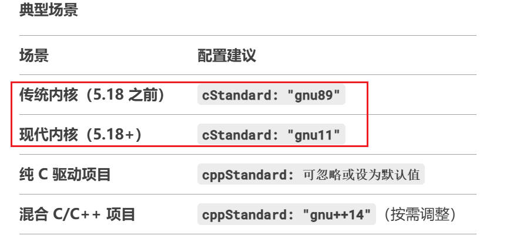

# 驱动基础

## 第1章 编写第一个驱动helloworld

### 1.1 最简单的Linux驱动结构

一个最简单的Linux驱动主要由以下几个部分组成。

1. 头文件(必须有)

    驱动需要包含内核响应头文件。必须包含<linux/module.h>和<linux/init.h>

2. 驱动加载函数(必须有)

    当加载驱动的时候，驱动加载函数会自动被内核执行

3. 驱动写在函数(必须有)

    当卸载驱动的时候，驱动希望在函数会自动被内核执行

4. 许可证声明(必须有)

    Linux驱动加载时，要最受开源协议。内核驱动中最常见的是"GPL v2"或"GPL"

5. 模块参数(可选)

    模块参数是，模块被加载时传递给内核模块的值

5. 作者和版本信息(可选)

    可以生命驱动的作者信息和代码的版本信息

### 1.2 VSCODE智能配置感知(c_cpp_properties.json)

做这个事情的目的是，为了让VSCODE正确识别内核头文件路径并消除代码警告。

#### 1.2.1 打开配置

    按下`Ctrl+Shift+P`，输入`C/C++: Edit Configurations`，进入配置界面。此时会自动生成`c_cpp_properties.json`文件

#### 1.2.2 通用模板

`c_cpp_properties.json`

```json
{
    "configurations": [
        {
            "name": "Linux ARM",
            "includePath": [
                "${workspaceFolder}/**",
                // 内核头文件路径（按实际路径修改）
                "/path/to/arm-linux-kernel/include/**",
                "/path/to/arm-linux-kernel/arch/arm/include/**",
                "/path/to/arm-linux-kernel/arch/arm/include/generated/**"
            ],
            "defines": [
                "__KERNEL__",
                "MODULE"
            ],
            "compilerPath": "/usr/bin/arm-linux-gnueabihf-gcc", // 交叉编译器路径
            "cStandard": "gnu11",
            "cppStandard": "gnu++14",
            "intelliSenseMode": "linux-gcc-arm"
        }
    ],
    "version": 4
}
```

接下来我们一一解释这些参数，并定制属于我们自己的json配置文件

1. `name`: VSCODE允许在`c_cpp_properties.json`中定义多套配置(如针对不同的Linux内核版本)，点击vscode右下角可以迅速切换


2. `includePath`: 添加内核源码的关键头文件路径

    + `include/`: 通用内核头文件
    + `arch/arm/include`: ARM架构相关头文件
    + 其他必要路径(如驱动子系统头文件)

3. `defines`: 用于给Vscode的C/C++插件传递预定义的宏，可以来控制代码的条件编译，或模拟编译环境
   
   + `__KERNEL__`: 内核中大量使用`#ifdef`条件编译指令。通过定义`__KERNEL__`，告诉 IntelliSense当前解析的是内核代码
  
        ```c
        #ifdef __KERNEL__
        // 内核空间代码
        #else
        // 用户空间代码
        #endif
        ```
    + 定义 MODULE 宏，表示当前代码是作为可加载模块(*.ko)编译的。这会启用内核头文件中与模块相关的代码路径

        ```c
        #include <linux/module.h>  // 依赖 MODULE 宏
        ```

4. `compilerPath`: 指定编译器路径。编译器会内置一些宏(如 __linux__、__arm__、__GNUC__)，这些宏会影响代码的条件编译逻辑(如 #ifdef __arm__)，IntelliSense 需要知道编译器的类型，才能正确解析这些宏

    + 在c_cpp_properties.json中，compilerPath需要指向交叉编译器的C编译器可执行文件(通常是arm-linux-gnueabihf-gcc)
    + 我的交叉编译器安装路径是`/usr/local/arm/gcc-linaro-4.9.4-2017.01-x86_64_arm-linux-gnueabihf`，因此`compilerPath`设为`/usr/local/arm/gcc-linaro-4.9.4-2017.01-x86_64_arm-linux-gnueabihf/bin/arm-linux-gnueabhf-gcc`

5. `cStandard和cppStandard`: Linux 内核代码大量依赖 GNU C 扩展语法。如果使用纯 ISO C 标准（如 c11），IntelliSense 会将这些 GNU 扩展语法标记为错误（红色波浪线）。
gnu11 表示使用 GNU 扩展的 C11 标准，使编辑器能够正确识别内核代码中的特殊语法

配置建议如下：



#### 1.2.3 定制内容

根据前一节的介绍，我们开发设备驱动的通用配置如下：

```json
{
    "configurations": [
        {
            "name": "Linux ARM (4.1.15)",
            "includePath": [
                "${workspaceFolder}/**",
                // 内核头文件路径（按实际路径修改）
                "/home/ding/linux/imx/kernel/include/**",
                "/home/ding/linux/imx/kernel/arch/arm/include/**",
                "/home/ding/linux/imx/kernel/arch/arm/include/generated/**"
            ],
            "defines": [
                "__KERNEL__",
                "MODULE"
            ],
            "compilerPath": "/usr/local/arm/gcc-linaro-4.9.4-2017.01-x86_64_arm-linux-gnueabihf/bin/arm-linux-gnueabihf-gcc", // 交叉编译器路径
            "cStandard": "gnu11",
            "cppStandard": "gnu++14",
            "intelliSenseMode": "linux-gcc-arm"
        }
    ],
    "version": 4
}
```

### 1.3 helloworld程序

```c
#include <linux/module.h>
#include <linux/init.h>

static int helloworld_init(void)
{
	printk("helloworld_init\n");
	return 0;
}

static void helloworld_exit(void)
{
	printk("helloworld_exit\n");
}

module_init(helloworld_init);
module_exit(helloworld_exit);

MODULE_LICENSE("GPL v2");
MODULE_AUTHOR("ding");
MODULE_VERSION("V1.0");
```

这是最简单的驱动程序。但值得介绍的东西很多：

1. 包含必要的头文件
   
   + `<linux/module.h>`: 提供了`MODULE_LICENSE`、`MODULE_AUTHOR` ...
   + `<linux/init.h>`: 提供了`module_init`、`module_exit`
  
2. 驱动加载函数`_init`无入参有返回值，所以要写成`int xxxx_init(void)`的形式
3. 驱动卸载函数`_exit`无入参无返回值，所以要写成`void xxxx_init(void)`的形式
4. `MODULE_LICENSE`等声明通常放在最后面，靠近`module_exit`的位置，这是规范

### 1.4 编译Linux驱动程序

