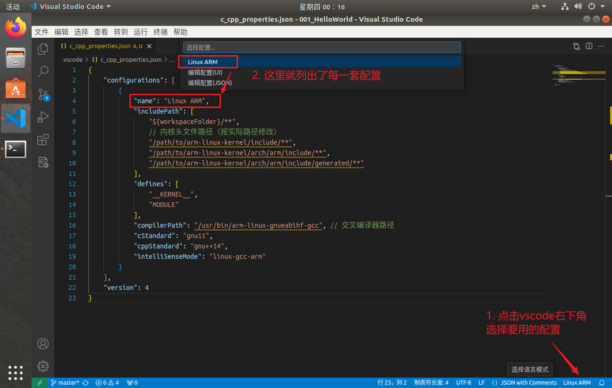
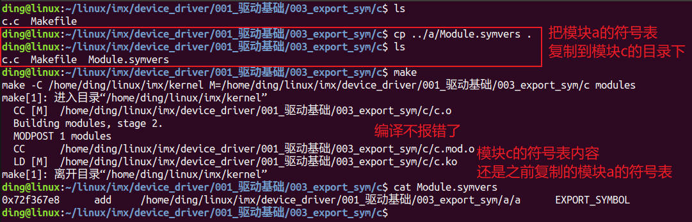
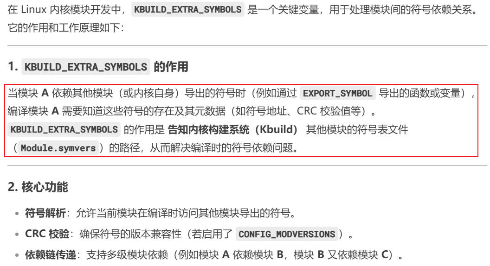

# 驱动基础

## 第1章 编写第一个驱动helloworld

### 1.1 最简单的Linux驱动结构

一个最简单的Linux驱动主要由以下几个部分组成。

1. 头文件(必须有)

    驱动需要包含内核响应头文件。必须包含<linux/module.h>和<linux/init.h>

2. 驱动加载函数(必须有)

    当加载驱动的时候，驱动加载函数会自动被内核执行

3. 驱动写在函数(必须有)

    当卸载驱动的时候，驱动希望在函数会自动被内核执行

4. 许可证声明(必须有)

    Linux驱动加载时，要最受开源协议。内核驱动中最常见的是"GPL v2"或"GPL"

5. 模块参数(可选)

    模块参数是，模块被加载时传递给内核模块的值

5. 作者和版本信息(可选)

    可以生命驱动的作者信息和代码的版本信息

### 1.2 VSCODE智能配置感知(c_cpp_properties.json)

做这个事情的目的是，为了让VSCODE正确识别内核头文件路径并消除代码警告。

#### 1.2.1 打开配置

    按下`Ctrl+Shift+P`，输入`C/C++: Edit Configurations`，进入配置界面。此时会自动生成`c_cpp_properties.json`文件

#### 1.2.2 通用模板

`c_cpp_properties.json`

```json
{
    "configurations": [
        {
            "name": "Linux ARM",
            "includePath": [
                "${workspaceFolder}/**",
                // 内核头文件路径（按实际路径修改）
                "/path/to/arm-linux-kernel/include/**",
                "/path/to/arm-linux-kernel/arch/arm/include/**",
                "/path/to/arm-linux-kernel/arch/arm/include/generated/**"
            ],
            "defines": [
                "__KERNEL__",
                "MODULE"
            ],
            "compilerPath": "/usr/bin/arm-linux-gnueabihf-gcc", // 交叉编译器路径
            "cStandard": "gnu11",
            "cppStandard": "gnu++14",
            "intelliSenseMode": "linux-gcc-arm"
        }
    ],
    "version": 4
}
```

接下来我们一一解释这些参数，并定制属于我们自己的json配置文件

1. `name`: VSCODE允许在`c_cpp_properties.json`中定义多套配置(如针对不同的Linux内核版本)，点击vscode右下角可以迅速切换



2. `includePath`: 添加内核源码的关键头文件路径

    + `include/`: 通用内核头文件
    + `arch/arm/include`: ARM架构相关头文件
    + 其他必要路径(如驱动子系统头文件)

3. `defines`: 用于给Vscode的C/C++插件传递预定义的宏，可以来控制代码的条件编译，或模拟编译环境
   
   + `__KERNEL__`: 内核中大量使用`#ifdef`条件编译指令。通过定义`__KERNEL__`，告诉 IntelliSense当前解析的是内核代码
  
        ```c
        #ifdef __KERNEL__
        // 内核空间代码
        #else
        // 用户空间代码
        #endif
        ```
    + 定义 MODULE 宏，表示当前代码是作为可加载模块(*.ko)编译的。这会启用内核头文件中与模块相关的代码路径

        ```c
        #include <linux/module.h>  // 依赖 MODULE 宏
        ```

4. `compilerPath`: 指定编译器路径。编译器会内置一些宏(如 __linux__、__arm__、__GNUC__)，这些宏会影响代码的条件编译逻辑(如 #ifdef __arm__)，IntelliSense 需要知道编译器的类型，才能正确解析这些宏

    + 在c_cpp_properties.json中，compilerPath需要指向交叉编译器的C编译器可执行文件(通常是arm-linux-gnueabihf-gcc)
    + 我的交叉编译器安装路径是`/usr/local/arm/gcc-linaro-4.9.4-2017.01-x86_64_arm-linux-gnueabihf`，因此`compilerPath`设为`/usr/local/arm/gcc-linaro-4.9.4-2017.01-x86_64_arm-linux-gnueabihf/bin/arm-linux-gnueabhf-gcc`

5. `cStandard和cppStandard`: Linux 内核代码大量依赖 GNU C 扩展语法。如果使用纯 ISO C 标准（如 c11），IntelliSense 会将这些 GNU 扩展语法标记为错误（红色波浪线）。
gnu11 表示使用 GNU 扩展的 C11 标准，使编辑器能够正确识别内核代码中的特殊语法

配置建议如下：


#### 1.2.3 定制内容

根据前一节的介绍，我们开发设备驱动的通用配置如下：

```json
{
    "configurations": [
        {
            "name": "Linux ARM (4.1.15)",
            "includePath": [
                "${workspaceFolder}/**",
                // 内核头文件路径（按实际路径修改）
                "/home/ding/linux/imx/kernel/include/**",
                "/home/ding/linux/imx/kernel/arch/arm/include/**",
                "/home/ding/linux/imx/kernel/arch/arm/include/generated/**"
            ],
            "defines": [
                "__KERNEL__",
                "MODULE"
            ],
            "compilerPath": "/usr/local/arm/gcc-linaro-4.9.4-2017.01-x86_64_arm-linux-gnueabihf/bin/arm-linux-gnueabihf-gcc", // 交叉编译器路径
            "cStandard": "gnu11",
            "cppStandard": "gnu++14",
            "intelliSenseMode": "linux-gcc-arm"
        }
    ],
    "version": 4
}
```

### 1.3 helloworld程序

```c
#include <linux/module.h>
#include <linux/init.h>

static int helloworld_init(void)
{
	printk("helloworld_init\n");
	return 0;
}

static void helloworld_exit(void)
{
	printk("helloworld_exit\n");
}

module_init(helloworld_init);
module_exit(helloworld_exit);

MODULE_LICENSE("GPL v2");
MODULE_AUTHOR("ding");
MODULE_VERSION("V1.0");
```

这是最简单的驱动程序。但值得介绍的东西很多：

1. 包含必要的头文件
   
   + `<linux/module.h>`: 提供了`MODULE_LICENSE`、`MODULE_AUTHOR` ...
   + `<linux/init.h>`: 提供了`module_init`、`module_exit`
  
2. 驱动加载函数`_init`无入参有返回值，所以要写成`int xxxx_init(void)`的形式
3. 驱动卸载函数`_exit`无入参无返回值，所以要写成`void xxxx_init(void)`的形式
4. `MODULE_LICENSE`等声明通常放在最后面，靠近`module_exit`的位置，这是规范

### 1.4 编译Linux驱动程序

如何编译驱动程序？

第一种编译方法：将驱动放在Linux内核里面，然后编译Linux内核。

第二种编译方法：将驱动编译成内核模块，独立于Linux内核以外。

什么是Linux内核模块？

内核模块是Linux系统中一个特殊的机制，可以将一些使用频率很少或者暂时不用的功能编译成内核模块，在需要时再动态加载到内核里面。

使用内核模块可以较少内核体积，加快启动速度。内核模块的后缀是`.ko`

#### 1.4.1 驱动编译成内核模块

##### 1.4.1.1 通用模板

把驱动编译成Linux内核模块，需要一个简单的Makefile

```makefile
# 定义模块名称
obj-m += mydriver.o

# 定义内核源码路径
KDIR ?= /xxx/linux-kernel
PWD  ?= $(shell pwd)

all:
	make -C $(KDIR) M=$(PWD) modules

clean:
	make -C $(KDIR) M=$(PWD) clean
```

Makefile解释如下：

1. `obj-m += mydriver.o`: `-m`表示编译成模块
2. `KDIR ?= /xxx/linux-kernel`: 使用绝对路径来指定内核源码的路径
3. `PWD ?= $(shell pwd)`: 获取Makefile和驱动源码文件所在的路径
4. `make -C $(KDIR) M=$(PWD) modules`: 进入KDIR目录，使用PWD路径下源码和Makefile文件编译驱动模块
5. `make -C $(KDIR) M=$(PWD) clean`: 清除编译文件

**注意：要编译驱动模块，必须先把Linux内核源码编译通过，否则无法编译内核模块**

##### 1.4.1.2 实际编译

还记得内核如何编译的吗？我们写了个脚本`build.sh`，然后在脚本里面指定了`ARCH`和`CROSS_COMPILE`

```sh
export ARCH=arm
export CROSS_COMPILE=/usr/local/arm/gcc-linaro-4.9.4-2017.01-x86_64_arm-linux-gnueabihf/bin/arm-linux-gnueabihf-

# 其他编译
```

现在我们来编译helloworld驱动模块试试：

```makefile
obj-m += helloworld.o

KDIR ?= /home/ding/linux/imx/kernel
PWD  ?= $(shell pwd)

all:
	make -C $(KDIR) M=$(PWD) modules

clean:
	make -C $(KDIR) M=$(PWD) clean
```

编译输出结果如下：编译失败了！


似乎我们没有指定架构和编译器。在shell中通过export临时设置一下环境变量。再试试编译：

**可以看到，设置完ARCH和CROSS_COMPILE之后，就编译成功了**


**注意：export设置的环境变量是临时的，而且只对当前的终端有效。比如我们关闭终端再重新打开，就有没了**

每次设置`ARCH`和`CROSS_COMPILE`都很麻烦啊，所以我们直接在内核的顶层Makefile中把这两个环境变量写死。

```Makefile
ARCH		?= arm
CROSS_COMPILE	?= /usr/local/arm/gcc-linaro-4.9.4-2017.01-x86_64_arm-linux-gnueabihf/bin/arm-linux-gnueabihf-
```

##### 1.4.1.3 模块操作的基本命令

1. 加载模块：`insmod helloworld.ko`或`modprobe helloworld.ko`
2. 卸载模块：`rmmod helloworld.ko`
3. 查看加载的模块：

    + `lsmod`命令：列出已经载入的内核模块
    + `cat /proc/modules`：查看模块是否加载成功

4. 查看模块信息：`modinfo helloworld.ko`

实测结果如下：


还可以在ubuntu中查看模块信息：


#### 1.4.2 menuconfig图形化配置

##### 1.4.2.1 打开图形化界面

1. 在终端中输入`export ARCH=arm`设置平台架构。平台结构是arm还是arm64，根据实际开发板来选择
   
   *为什么要先设置平台架构？因为linux支持多种平台架构，所以需要我们手动配置告诉他*

2. 在内核源码的顶层目录下，输入`make menuconfig`

输入完成即可打开配置页面：


##### 1.4.2.2 图形化配置界面的操作

1. 移动

使用键盘的上、下、左、右按键，可以移动光标

2. 搜索功能

输入`/`即可弹出搜索界面

3. 配置驱动选项状态

    + 把驱动编译成模块，用M来表示
    + 把驱动编译到内核里面，用*来表示
    + 不编译
    + 使用`空格`来配置这三种不同的状态
  
比如我们想搜索LAN8720的驱动厂商SMSC，输入`/`，然后再输入SMSC，有以下界面：


##### 1.4.2.3 与图形化有关的文件

Makefile、.config和Kconfig之间的关系：

**Kconfig文件**

Kconfig文件时图形化配置界面的源文件，图形化界面中的选项由Kconfig文件决定。当执行命令`make menuconfig`时，内核的配置工具会读取内核源码目录下的`arch/xxx/Kconfig`，`xxx`是命令`export ARCH=arm`中的`ARCH`值，然后再生成对应的配置界面。

如果我们要把`helloworld`编译进内核，那就可以修改Kconfig文件，在menuconfig的界面中增加一项。

**config文件和.config文件**

config文件和.config文件，都是Linux内核的配置文件。config位于`arch/$(ARCH)/configs`目录下，是Linux系统默认的配置文件。

.config位于内核源码的顶层目录下，编译Linux内核时会使用.config里面的配置来编译内核镜像。

若.config存在，`make menuconfig`界面的默认配置就是.config文件的配置，修改图形配置界面并保存时，会刷新.config文件。

若.config不存在，`make menuconfig`界面的默认配置，就是Kconfig文件中的默认配置。

使用命令`make xxx_defconfig`命令，会根据`arch/$(ARCH)configs`目录下默认配置文件，生成.config文件。

理解一下这幅图，沿着箭头的指向从上往下看。

1. 首先执行`make menuconfig`，打开图形化配置界面。图形化界面中的选项，由Kconfig决定
2. 打开图形化配置界面后，就可以在里面进行配置。比如让A驱动编译，B驱动不编译。设置完成保存，自动生成了.config文件
3. 执行`make`，就可以编译内核了


*那么问题来了，似乎我们只用到了Kconfig和.config文件。config文件有什么用？*

Kconfig是固定不变的，menuconfig中的配置项成千上万。怎么知道哪些有用？我们需要一份默认配置(由厂商提供)，然后在默认配置上增加我们自己的内容了。

**所以，config文件就是厂商提供给我们的，可以生成定制化的.config文件，方便我们开发。**


那么xxx_defconfig和.config的文件内容，是一致的吗？我们来看下。

可以看到，两个文件的大小明显不同。xxx_defconfig更像是一个精简的配置，而生成的.config文件则要大很多。


从内容上看，两个文件的内容也不一样。那么.config文件是怎么来的？


deepseek的回答是，xxx_defconfig只是覆盖了某些特定的配置项，而其他选项则保留为Kconfig中定义的默认值。

*也就是说，.config文件是defconfig和Kconfig默认值合并之后的结果，而且还自动处理了依赖关系。*


##### 1.4.2.4 savedefconfig

*还有个问题，如果我们在图形界面中更改了某项值，那当然会生成.config文件对吧。但是只要执行`make distclean`全部重新编译时，.config就被删除了，这意味着下次我们还要重新打开图形界面再重复配置一次。*

如何解决？

`最理想的办法是，把更改图形界面配置项带来的增量变化，添加到xxx_defconfig这个默认的配置文件中。这样下次生成.config时，就会包含我们的更改了。`

能不能把.config直接覆盖xxx_defconfig？

`这样不好。因为前面提到，.config文件包含了默认Kconfig要大很多，而我们需要的只是修改的那几项，而不是整个的配置。所以要有个工具，能够去除.config中的合并引入的配置项，还原一个最精简的xxx_defconfig。这就是save_config`


下面是一个简单的示例，添加博通的PHY驱动，看看saveconfig是怎么用的。


当前目录下已经有了.config和Kconfig文件，我们执行`make savedefconfig`，来生成精简的`defconfig`配置文件。


执行完成后得到了`defconfig`文件，与原配置文件`xxx_defconfig`比较发现，确实只增加了博通的PHY驱动，这是我们想要的。


savedefconfig的工作原理：提取用户自定义的配置项，剥离默认值和隐式依赖项，生成最小化的配置模板


#### 1.4.3 Makefile

Makefile里面包含了编译规则，告诉我们要如何编译Linux。

刚才我们再图形配置界面添加了博通的PHY驱动，对应的.config增加了`CONFIG_BROADCOM_PHY=y`

那么接下来Makefile就应该识别到这个配置项，来把博通的PHY驱动.c文件编译到内核


#### 1.4.4 Kconfig语法

**mainmenu: 设置主菜单的标题**


**menu/endmenu: 设置菜单结构**

可以用menu/endmenu来生成菜单，menu是菜单开始的标志，endmenu是菜单结束的标志。


**配置选项**

使用关键字`config`来定义一个新的选项。每个选项都必须指定类型，类型包括bool、tristate、string、hex、int。

最常见的是bool tristate string这3种。bool类型有2种值(Y和N)，tristate有3种值(Y M N)

default提供了CONFIG_xxx的默认值。前面我们提到，当.config不存在时，使用的是Kconfig中的默认值，就是这个玩意了。


**依赖关系**

Kconfig中的依赖关系，可以用depends on和select来描述


这个在uboot中已经使用到了，举例如下：


**注释**

Kconfig中使用comment用于注释，不过此注释非彼注释，这个注释是在图形化界面中显示一行注释。


**source 读取另一个Kconfig文件**


#### 1.4.5 实例: 把驱动编译进linux内核

现在我们尝试把驱动编译进linux内核。想想之前做了什么？

1. 要修改Kconfig文件，增加图形界面的配置项，最终在.config中得到`CONFIG_HELLOWORLD=y`
2. 要修改Makefile文件，增加helloworld.c的编译。既`obj-(CONFIG_HELLOWORLD) += helloworld.o`

接下来我们就尝试修改这些文件。加到哪里呢？放在字符设备中。`drivers/char`目录下


这是当前字符设备的配置界面。我们可以有两种方式来添加helloworld。

1. 直接把helloworld加到`drivers/char`目录下，在这个Kconfig目录下增加helloworld
2. 在`drivers/char`目录下新增一个helloworld，在里面创建Kconfig，然后在上层通过source引用

先来试试第一种：很简单。


实测结果如下：


第二种方式更加复杂，我们来试试

##### 1.4.5.1 写Kconfig包含

1. 在`drivers/char`目录下创建`helloworld`目录
2. 在`hellowolrd`目录下创建Kconfig，内容跟前面第一种的内容一致
   
    ```Kconfig
    config HELLOWORLD
	bool "helloworld support"
	default y
	help
		build-in helloworld to kernel
    ```

3. 在`drivers/char`的Kconfig中使用`source`，把hellowolrd的Kconfig加进来


验证结果没问题：


##### 1.4.5.2 写驱动.c源文件

现在第一步完成了。我们要把之前写的helloworld.c复制到`helloworld`目录下

##### 1.4.5.3 写Makefile包含

`helloworld.c`复制好之后，我们要添加Makefile文件。这该怎么写？

在helloworld目录下，创建一个Makefile，内容如下：`obj-$(CONFIG_HELLOWORLD) += helloworld.o`

然后在上层Makefile中，包含子Makefile，添加一条：`obj-$(CONFIG_HELLOWORLD)	+= helloworld/`


##### 1.4.5.3 编译linux内核

考虑以下，现在我们做了些什么，我们在Kconfig中增加了helloworld驱动编译。

之前编译Linux内核的步骤：

1. `make xxx_defconfig`

    执行make时，linux会把默认的defconfig和Kconfig合并，来生成一个.config文件。我想说的是，合并Kconfg这个过程应该已经把我们的`hellowolrd`驱动程序带进去了，不需要我们每次都执行`menuconfig`再保存一次

2. 执行`make menuconfig`修改配置界面，或者不要menuconfig，直接编译

3. 编译linux内核

编译完成后，在helloworld目录下生成了编译文件


接下来启动一下linux内核，看内核启动时会不会自动加载helloworld驱动，可以看到，果然是有的


如果日志太多不方便查看，我们还可以在`dmesg`中直接搜索，方式是`dmesg | grep "helloworld"`，看下输出结果


## 第2章 驱动程序传参

**注意，给驱动模块传参时，如`a=1`不能写成`a = 1`，即`=`两边不能有空格，因为这会被shell识别成分隔符**

在C语言应用程序中，经常通过`(int argc, char *argv[])`来给应用程序传参。

驱动程序中，也可以给驱动来传参，增加驱动程序的灵活性


既然驱动程序可以传参，那可以传递哪种类型的参数呢？

**C语言传参的常用类型，驱动程序基本也都支持：**

1. 基本类型：`char bool int long short byte ushort uint`
2. 数组：`array`
3. 字符串：`string`

**如何给驱动传递参数？**

驱动支持的参数有3种，分别对应函数。这3个函数在内核源码`include/linux/moduleparam.h`中有定义

1. 传递基本类型函数：`module_param(name,type,perm);`

    函数参数：

    + name: 要传递给驱动代码中的变量的名字
    + type: 参数类型
    + perm: 参数的读写权限

2. 传递数组类型函数：`module_param_array(name,type,nump,perm);`

    + name: 要传递给驱动代码中的变量的名字
    + type: 参数类型
    + nump: 一个指针，会被传入数组的实际长度来填充
    + perm: 参数的读写权限

3. 传递字符串类型函数：`module_param_string(name,string,len,perm);`

    + name: insmod传参时，指定的参数的名称
    + string: 驱动代码中变量的名称
    + len: 字符串的最大长度，包括\0。可以用sizeof来计算
    + perm: 参数的读写权限

4. MODULE_PARM_DESC函数
   
    + 函数功能：为模块参数提供文档说明，使用`modinfo <模块名>`命令时，可以查看这些描述
    + 函数原型：`#define MODULE_PARM_DESC(_parm, desc)`
    + _parm：要描述的参数的参数名称
    + desc：描述信息
    
    实例：

    ```c
    #include <linux/module.h>

    static int debug_level = 0;
    module_param(debug_level, int, 0644);
    MODULE_PARM_DESC(debug_level, "调试级别：0（关闭），1（基本），2（详细）");

    static char *device_name = "default_device";
    module_param(device_name, charp, 0644);
    MODULE_PARM_DESC(device_name, "设备名称（字符串）");

    static int __init my_module_init(void) {
        printk(KERN_INFO "模块加载，设备名称：%s\n", device_name);
        return 0;
    }

    static void __exit my_module_exit(void) {
        printk(KERN_INFO "模块卸载\n");
    }

    module_init(my_module_init);
    module_exit(my_module_exit);

    MODULE_LICENSE("GPL");
    MODULE_AUTHOR("Your Name");
    MODULE_DESCRIPTION("一个示例驱动模块");
    ```

    通过 modinfo 查看模块信息：

    ```sh
    $ modinfo my_module.ko
    parm:           debug_level:调试级别：0（关闭），1（基本），2（详细） (int)
    parm:           device_name:设备名称（字符串） (charp)
    ```

*参数的读写权限*

参数的读写权限，定义在`include/linux/stat.h`和`include/uapi/linux/stat.h`，一般使用S_IRUDO，也可以使用数字表示，如444表示S_IRUGO

可以这样分析：

```c
#define S_IRWXU 00700   // S_I先不管，U是User的缩写，表示文件的拥有者具有可读可写的权限
#define S_IRUSR 00400   // 读
#define S_IWUSR 00200   // 写
#define S_IXUSR 00100   // 执行

#define S_IRWXG 00070   // S_I先不管，U是User的缩写，表示与文件拥有者同组的用户，具有可读可写的权限
#define S_IRGRP 00040
#define S_IWGRP 00020
#define S_IXGRP 00010

#define S_IRWXO 00007   // S_I先不管，U是User的缩写，表示与文件拥有者不同组的用户，具有可读可写的权限
#define S_IROTH 00004
#define S_IWOTH 00002
#define S_IXOTH 00001
```

可以把这些权限组合起来用，设置 所有者+组+其他人 的权限：

```c
#define S_IRWXUGO	(S_IRWXU|S_IRWXG|S_IRWXO)
#define S_IALLUGO	(S_ISUID|S_ISGID|S_ISVTX|S_IRWXUGO)
#define S_IRUGO		(S_IRUSR|S_IRGRP|S_IROTH)
#define S_IWUGO		(S_IWUSR|S_IWGRP|S_IWOTH)
#define S_IXUGO		(S_IXUSR|S_IXGRP|S_IXOTH)
```

**驱动传参实测**

`param.c`

```c
#include <linux/module.h>
#include <linux/init.h>
#include <linux/moduleparam.h>
#include <linux/stat.h>
#include <uapi/linux/stat.h>

static int a = 0;
module_param(a, int, S_IRUGO);
MODULE_PARM_DESC(a, "eg: a=1");

static int array[5] = {0};
static int array_size = 0;
module_param_array(array, int, &array_size, S_IRUGO);
MODULE_PARM_DESC(array, "eg: array=1,2,3");

static char str1[20] = {0};
module_param_string(str, str1, (sizeof(str1) - 1), S_IRUGO);
MODULE_PARM_DESC(str, "eg: str=helloworld");

static int module_param_init(void)
{
	int i;

	printk("a = %d\n", a);
	printk("array_size = %d\n", array_size);
	for (i = 0; i < array_size; i++) {
		printk("array[%d] = %d\n", i, array[i]);
	}
	printk("str1: %s\n", str1);

	return 0;
}

static void module_param_exit(void)
{
	printk("bye!\n");
}

module_init(module_param_init);
module_exit(module_param_exit);

MODULE_LICENSE("GPL");
MODULE_AUTHOR("ding");
MODULE_VERSION("V1.0");
```

使用`modinfo`查看模块信息，确实打印了传参的帮助信息。


使用insmod测试，不设参数和传递参数时，模块加载的打印情况：


**注意：驱动程序传参时，=左右两个一定不能有空格！**

## 第3章 内核模块符号导出

### 3.1 内核符号表引入：

驱动程序可以编译成内核模块，也就是ko文件。通常情况下，每个ko文件时相互独立的，也就是说模块之间无法相互访问。但是在某些场景下要互相访问，如B模块要用A模块中的函数。怎么做？

什么是符号表？

*Linux中的符号表，是内核或程序在编译、链接和运行过程中生成的数据结构，记录了代码中所有函数、变量、全局对象等符号的名称、地址和类型信息。符号表在调试、性能分析、内核模块开发时至关重要。*

符号表中的每个条目通常包含以下信息：

1. 符号名称：例如函数名、变量名
2. 符号地址：符号在内核地址空间中的内存位置
3. 符号类型：函数(T/t) 变量(D/d) 未定义符号(U)
4. 作用域：全局符号(大写类型标记)  局部符号(小写标记)

Linux内核符号表的作用：

1. 调试coredump：通过符号表可以把coredump转换为函数名和代码位置
2. 动态加载内核模块：内核模块在加载时，需要依赖内核导出的符号(EXPORT_SYMBOL)来调用核心函数
3. 反汇编和逆向工程

Linux内核符号表，有2种形式：

1. 静态符号表(map文件)：System.map
   
   在内核编译时生成，仅包含编译时确定的符号(不包含动态加载的模块符号)

2. 动态符号表(`/proc/kallsyms`)：通过`cat /proc/kallsyms`可以查看

    实时反映当前运行内核的所有符号(包括动态加载的模块)

    

回到刚才的问题。如果B模块要用A模块中的函数，那就可以导出A模块中的函数名导入到符号表中，B模块根据符号表就可以找到要调用的函数。

### 3.2 内核符号表的格式

每个编译出来的内核模块，都包含一个`Module.symvers`文件，这就是符号表。如果模块没有依赖或`EXPORT_SYMBOL`导出符号的话，这个文件的内容为空。

当我们使用`EXPORT_SYMBOL`导出符号时，`Module.symvers`文件如下：**最前面的是CRC，不是地址。只有模块加载到内核中，最前面才显示地址。**


### 3.3 内核符号表导出

模块可以使用宏`EXPORT_SYMBOL`导出符号，到内核符号表中。

`EXPORT_SYMBOL(符号名);`

导出去的符号可以被其他模块使用，使用前只需要`extern`声明一下即可。

我们写一个简单的内核模块a，这里面定义实现了一个`add`函数。

```c
#include <linux/module.h>
#include <linux/init.h>

int add(int a, int b)
{
	return a + b;
}
// EXPORT_SYMBOL(add);

static int module_a_init(void)
{
	printk("module_a_init\n");
	return 0;
}

static void module_a_exit(void)
{
	printk("module_a_exit\n");
}

module_init(module_a_init);
module_exit(module_a_exit);

MODULE_LICENSE("GPL");
MODULE_AUTHOR("ding");
MODULE_VERSION("V1.0");
```

先注释掉符号导出，看看编译结果：


然后使用`EXPORT_SYMBOL(add)`导出符号表，再次编译。

**注意了，我们的模块刚编译完，最前面这个可不是地址，而是符号的CRC校验。这很好理解，我们还没有加载到内核呢，哪来的地址啊？**

*但是，一旦模块加载到了内核，使用`cat /proc/kallsyms看到的符号表，最前面这个就真的是地址了。`*


现在再写一个驱动模块c，我们直接调用`add`函数，看看有没有什么问题。

可以看到，直接调用`add`函数编译时，会产生一个警告(显示add函数未定义)但没有报错，最终还是得到了ko文件。


这跟我们想的还不太一样啊。我预期他应该编译不过的，但竟然编译过了。接下来试试运行一下，看正不正常

因为模块c依赖于模块a，所以我们先加载a，再加载c。

**可以看到，模块a正常加载没问题，但模块c加载时报错，找不到符号add，与预期一致。**


我们下一步想要做的是，把模块a的符号表给模块c来使用，这样他应该就能找到`add`函数了。应该怎么做？

`很简单，直接把模块a编译生成的Module.Symvers文件，复制到模块c的目录下，然后再编译模块c。`

我们试试看：可以看到，现在编译警告没有了。



加载模块运行以下试试：现在模块c能够正确加载了。


看起来问题已经很好的解决了。但真的是这样吗？

考虑一个更加复杂的情况，模块c同时依赖于模块a和模块b，此时应该如何处理符号表？

**首先，我们应该分别编译模块a和模块b，得到各自的符号表。这样实际上我们有了2个符号表，而且名字都一样**

现在我们应该怎么把a和b的符号表放到模块c的目录下呢？

如果还是跟之前一样，先复制a再复制b，那么b就会把a覆盖掉。这样肯定有问题。

**我们最终希望实现的效果是，在模块c中有一个符号表，包含了a和b的符号表的全部内容**

### 3.3.1 手动复制

把a和b的符号表，手动追加到模块c的符号表中

使用`cat`命令和`>>`重定向，把a和b的符号表手动合并

```sh
cat ../a/Module.symvers >> Module.symvers
cat ../b/Module.symvers >> Module.symvers
```

实测运行结果如下：


### 3.3.2 `Makefile`自动处理符号表

修改makefile，自动处理符号表

上面这种方式。如果执行了`make clean`，那么`Module.symvers`就会被删掉，意味着还需要重新制作一次符号表。太麻烦了，有没有自动化的方式呢？

**有的，使用Makefile的`KBUILD_EXTRA_SYMBOLS`变量**

我们先来看下，内核标准文档对于`KBUILD_EXTRA_SYMBOLS`的描述：

如果从另一个模块中复制`Module.symvers`不切实际的话，可以使用`KBUILD_EXTRA_SYMBOLS来构建。`


DeepSeek对于`KBUILD_EXTRA_SYMBOLS`，有更加详细的解释：



工作原理简单来说，就是内核的`kbuild`系统，根据`KBUILD_EXTRA_SYMBOLS`来构建合并符号表。


我们尝试一下，模块c的Makfile改为：

1. 直接使用相对路径来设置`KBUILD_EXTRA_SYMBOLS`，编译报错


2. 使用绝对路径来设置`KBUILD_EXTRA_SYMBOLS`，正常编译


3. 通过$(PWD)来间接使用相对路径，编译成功


**总结：当使用`KBUILD_EXTRA_SYMBOLS`自动构建符号表时，建议使用$(PWD)相对路径，或直接使用绝对路径。**

