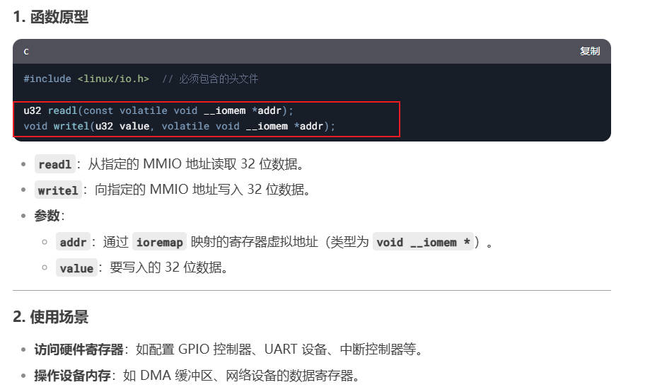

# 字符设备基础

## 第1章 申请字符设备号

### 1.1 理论讲解

**什么是设备号？**

linux给定每一个字符设备或者块设备，都必须有一个专属的设备号。一个设备号由主设备号和次设备号组成。

1. 主设备号用来表示某一类驱动，如键盘、鼠标都可以归类到USB驱动
2. 而次设备号用来表示这个驱动下的各个设备。比如第几个鼠标，第几个键盘等

所以，我们开发字符驱动程序，申请设备号是第一步，只有有了设备号，才可以向系统注册设备。

**设备号的类型**

Linux中使用`dev_t`的数据类型表示设备号。`dev_t`定义在`linux/types.h`里面，为`uint32`类型。

`linux/types.h`，设备号是一个32位的数据类型。

```c
typedef __u32 __kernel_dev_t;

typedef __kernel_dev_t		dev_t;  // u32类型
```

`linux/kdev_t.h`，高12位为主设备号`(MAJOR)`，低20位为次设备号`(MINOR)`。

```c
#define MINORBITS	20
#define MINORMASK	((1U << MINORBITS) - 1)

#define MAJOR(dev)	((unsigned int) ((dev) >> MINORBITS))
#define MAJOR(dev)	((unsigned int) ((dev) & MINORMASK))
#define MKDEV(ma,mi)	(((ma) << MINORBITS) | (mi))
```

`MAJOR`用于取高12位，`MAJOR`用于取第20位。`MKDEV`用于拼接设备号。

**设备号分配**

在编写字符设备驱动代码时，可以静态分配设备号，或动态分配设备号。

1. 查看系统已使用的设备号：`cat /proc/devices`
2. 静态分配设备号：开发者自己指定一个设备号，比如选择50作为主设备号。有些设备号已经被系统使用了，在指定设备号时就不能再使用了
3. 动态分配设备号：徐通自动给我们选择一个还没被使用的设备号

`linux/fs.h`，分配设备号的函数：

1. 静态分配设备号函数：`int register_chrdev_region(dev_t from, unsigned count, const char *name)`
   
   + `dev_t from`：起始设备号，通过MKDEV(major, minor)生成。`major`主设备号，`minor`起始次设备号(通常从0开始)
   + `unsigned count`：连续注册的次设备号数量
   + `const char *name`：设备名称，显示在`/proc/devices`，用于用户空间识别设备

2. 动态分配设备号函数：`int alloc_chrdev_region(dev_t *dev, unsigned baseminor, unsigned count, const char *name)`

    + `dev_t *dev`：保存内核自动分配的设备号，通过指针返回
    + `unsigned baseminor`：起始次设备号：通常设为0
    + `unsigned count`：连续注册的次设备号数量
    + `const char *name`：设备名称，显示在`/proc/devices`，用于用户空间识别设备

3. 释放字符设备号函数：`void unregister_chrdev_region(dev_t from, unsigned count)`

    + `dev_t from`：起始设备号，需要与注册使用的`dev_t`完全一致
    + `unsigned count`：要释放的连续次设备号数量，需与注册时指定的数量一致

### 1.2 代码编写

我们写一段模块代码，来注册设备号。可以接受用户传参来设置设备号，如果没主动设置，就自动生成设备号。

`dev_t.c`

```c
#include <linux/init.h>			/* module_init, module_exit */
#include <linux/module.h>		/* MODULE_LISENCE, MODULE_AUTHOR */
#include <linux/moduleparam.h>	/* module_param */
#include <linux/types.h>		/* dev_t */
#include <linux/kdev_t.h>		/* MAJOR, MINOR, MKDEV */
#include <linux/fs.h>			/* alloc_chrdev_region, unregister_chrdev_region */

#define CHRDEV_NAME		"chr_test"

static int major = 0;
static int minor = 0;

module_param(major, int, S_IRUGO);
module_param(minor, int, S_IRUGO);

static __init int module_param_init(void)
{
	int ret;
	dev_t dev;

	if (major) {
		printk("major:%d, minor:%d\n", major, minor);
		dev = MKDEV(major, minor);
		ret = register_chrdev_region(dev, 1, CHRDEV_NAME);
		if (ret < 0) {
			printk("register_chrdev_region error\n");
			return ret;
		}
		else {
			printk("register_chrdev_region OK\n");
			printk("dev:%d\n", dev);
		}
	}
	else {
		ret = alloc_chrdev_region(&dev, 0, 1, CHRDEV_NAME);
		if (ret < 0) {
			printk("alloc_chrdev_region error\n");
			return ret;
		}
		else {
			printk("alloc_chrdev_region OK\n");
			major = MAJOR(dev);
			minor = MINOR(dev);
			printk("major:%d, minor:%d\n", major, minor);
			printk("dev:%d\n", dev);
		}
	}	

	return 0;
}

static __exit void module_param_exit(void)
{
	dev_t dev = MKDEV(major, minor);

	unregister_chrdev_region(dev, 1);
	printk("unregister_chrdev_region\n");
}

module_init(module_param_init);
module_exit(module_param_exit);

MODULE_LICENSE("GPL");
MODULE_AUTHOR("ding");
```

### 1.3 实验测试

接下来我们要测试这个驱动程序。该怎么测试呢？

*回想一下，理论部分提到，我们注册的设备号会显示在`/proc/devices`，供给用户空间识别设备。*

OK，我们可以先查看`/proc/devices`，然后分别测试静态/动态注册，看`/proc/devices`的变化。


可以看到，主设备号100是空闲的。我们就静态注册100来作为主设备号。

执行命令：`insmod dev_t.ko major=100`。测试结果注册成功


接下来我们尝试自动分配设备号，测试结果成功


### 1.4 内存占用问题

前面无论是静态注册，还是动态注册，都需要我们传递一个参数：`连续注册的次设备号数量`。现在需要思考几个问题：

1. 应该申请多少个次设备号？有什么用
2. 申请多个次设备号，会带来显著的内存开销吗？

对于次设备号的作用，以下是DeepSeek给出的解释：


而内存开销上，即使申请多个次设备号，也几乎不会产生多少的开销。


下面是一个典型的使用场景。申请了4个次设备号，用来管理4个硬件设备。*注意，设备文件名相同，只是后面的数字不同。*


用户空间可以通过打开设备文件(如/dev/device2)，来操作LED2。Open打开文件时，通过inode可以获取到次设备号，继而关联到硬件设备。


## 第2章 注册字符类设备

### 2.1 cdev结构体

Linux系统中，使用cdev结构体描述一个字符设备。cdev结构体定义在`linux/cdev.h`文件中。

```c
struct cdev {
	struct kobject kobj;
	struct module *owner;
	const struct file_operations *ops;
	struct list_head list;
	dev_t dev;
	unsigned int count;
};
```

成员详解：

1. `struct kobject kobj`：开发者不用管
2. `struct module *owner`：指向拥有该设备的模块，通常都设为`THIS_MODULE`
3. `struct file_operations *ops`：定义设备支持的操作函数。这是核心，驱动必须要实现这些函数
4. `struct list_head list`：开发者不用管
5. `dev_t dev`：起始设备号，由主设备号和起始次设备号组成
6. `unsigned int count`：驱动管理的设备实例个数

### 2.2 cdev_init 初始化函数

cdev_init函数，用于初始化cdev结构体成员，建立cdev和file_operations之间的联系：

```c
void cdev_init(struct cdev *cdev, const struct file_operations *fops)
{
	memset(cdev, 0, sizeof *cdev);

	cdev->ops = fops;   // 关联ops
}
```

### 2.3 cdev_add 向系统添加一个字符设备

初始化cdev结构体之后，就可以调用cdev_add函数，向系统间添加一个字符设备。

函数原型：`int cdev_add(struct cdev *p, dev_t dev, unsigned count);`

DeepSeek给出了非常好的函数详解：


下面是cdev_add的底层原理。简单来说，干了2个事情：

1. 把`cdev`添加到内核的字符设备链表。我们执行`cat /proc/devices`时，就会遍历这个链表，来打印全部的字符设备
2. 维护全局哈希表`cdev_map`，把`cdev`的设备号映射到map哈希表。为什么已经有了链表还需要map？因为哈希表访问速度快，而俩表需要遍历


用户空间通过设备文件，操作设备驱动的流程：

1. 通过设备文件，找到设备号
2. 根据设备号，在哈希表`cdev_map`中，找到对应的cdev设备
3. 执行`cdev->ops`操作函数


这里还有个问题。如果有多个连续的次设备号，在执行`cdev_add`时，会给每一个次设备号都映射一个map位图吗？

**答案当然是不会。前面我们说了，即使注册很多个次设备号也不会带来显著的内存开销。我们看看这种情况下，是怎么实现的。**

1. 存储：根据主设备号的哈希值存储到不同的桶中，每个桶中存储的是设备号范围的起始值和数量，而非单独记录每个次设备号


2. 查找：当用户空间访问设备号时，内核遍历哈希桶中的范围条目，检查目标设备号是否在某个已注册的范围内


### 2.4 cdev_del 从系统中删除一个字符设备

函数原型：`void cdev_del(struct cdev *);`

### 2.5 代码示例

回想以下，我们写字符设备驱动的流程：

1. 申请得到设备号
2. 初始化cdev字符设备，关联file_ops
3. 把字符设备+设备号一起，添加到系统中

下面是对应的代码实例：

```c
#include <linux/init.h>			/* module_init, module_exit */
#include <linux/module.h>		/* MODULE_LISENCE, MODULE_AUTHOR */
#include <linux/moduleparam.h>	/* module_cdev */
#include <linux/types.h>		/* dev_t */
#include <linux/kdev_t.h>		/* MAJOR, MINOR, MKDEV */
#include <linux/fs.h>			/* alloc_chrdev_region, unregister_chrdev_region */
#include <linux/cdev.h>			/* struct cdev, cdev_init, cdev_add */

#define CDEV_NAME		"cdev_test"

static dev_t dev_num;
static struct cdev cdev_test;

/* THIS_MODULE在linux/export.h中定义, 而这个头文件已经被linux/module.h包含了 */
static struct file_operations cdev_test_ops = {
	.owner	= THIS_MODULE,
};

static __init int module_cdev_init(void)
{
	alloc_chrdev_region(&dev_num, 0, 1, CDEV_NAME);
	printk("alloc_chrdev_region OK\n");
	printk("major:%d, minor:%d\n", MAJOR(dev_num), MINOR(dev_num));

	/* 先初始化再设置. 因为初始化会清空结构体 */
	cdev_init(&cdev_test, &cdev_test_ops);
	cdev_test.owner = THIS_MODULE;
	cdev_add(&cdev_test, dev_num, 1);

	return 0;
}

static __exit void module_cdev_exit(void)
{
	cdev_del(&cdev_test);
	unregister_chrdev_region(dev_num, 1);

	printk("exit\n");
}

module_init(module_cdev_init);
module_exit(module_cdev_exit);

MODULE_LICENSE("GPL");
MODULE_AUTHOR("ding");
```

### 2.6 file_operations结构体的作用

Linux系统中，一切皆文件，访问设备也是在访问文件。在应用程序中调用open、read、write、close这几个系统调用时，最终会去执行到file_operations里面的函数。


## 第3章 设备节点(设备文件)

### 3.1 什么是设备节点

前面提到，Linux系统一切皆文件的思想。每个设备在Linux系统中，都有一个对应的`设备文件`代表他们，应用程序通过操作这个`设备文件`，便可以操作对应的硬件。如下代码所示：

`fd = open("/dev/hello", O_RDWR);`

这个`设备文件`就是设备节点，所以Linux设备节点是应用程序和驱动程序沟通的一个桥梁。

下面是DeepSeek对设备节点的解释：

设备节点包含2和关键标识：

1. 设备类型：字符设备或块设备
2. 设备号：主设备号对应了内核中的驱动程序，次设备号标识了同意驱动下的不同设备实例

我们可以这样理解执行过程：用户程序打开了一个设备文件，内核首先判断设备类型。如果是字符设备，就去`cdev_map`哈希表中遍历注册的字符设备，如果设备号匹配上了，那就找到了具体的`cdev`结构体。`cdev_init`时把cdev结构体和file_ops进行了绑定，所以最终会调用到`struct file+operations`中，我们自己写的操作函数。


### 3.2 如何创建设备节点

有两种方式，创建设备节点：

1. 手动创建：通过命令`mknod`创建设备节点

命令语法：`mknod 设备文件名 c 主设备号 次设备号`。

例如：`mknod /dev/hello c 236 0`

2. 自动创建

可以通过mdev机制，实现设备节点的自动创建与删除。

udev机制：例如自动为USV串口设备创建节点/dev/ttyUSBx

+ 内核检测到新设备(如插入USB)时，会发送事件到用户空间的udev守护进程
+ udev根据规则动态创建设备节点，并设备权限

接下来我们写一个简单的应用程序`app.c`，来进行测试。

```c
#include <stdio.h>
#include <unistd.h>		/* close函数 */
#include <sys/types.h>	/* open函数要使用以下3个头文件 */
#include <sys/stat.h>
#include <fcntl.h>

int main(int argc, char *argv[])
{
	int fd;
	if (argc < 2) {
		fprintf(stderr, "Usage: %s /dev/xxx\n", argv[0]);
		return -1;
	}

	fd = open(argv[1], O_RDWR);
	if (fd < 0) {
		printf("open %s error\n", argv[1]);
		return fd;
	}
	close(fd);

	return 0;
}
```

测试流程：

1. `insmod`加载驱动模块。并查看`/proc/devices`中的设备名为`cdev_test`


2. `mknod`创建设备节点。`mknod /dev/cdev_test c 248 0`
3. 查看设备节点
4. 执行应用程序，Open打开访问设备节点。跟我们预期的一致，执行了open和close动作


### 3.3 自动创建设备节点

前面测试时，使用的手动创建设备节点太麻烦了。接下来我们使用udev自动创建设备节点。


**什么是udev？**

udev是 Linux 系统中负责管理设备文件系统的工具，它会根据内核发送的设备事件（uevent）和预定义的规则来自动创建设备文件。下面列举了udev自动创建按设备的几种常见情况：

1. 使用标准linux设备模型(class_create和device_create)

	+ `class_create`函数：在`/sys/class/`下创建设备类目录，如`/sys/class/my_class`
	+ `device_create`函数：在`/sys/class/my_class`下创建设备属性文件(如设备号)，并触发uevent事件

2. 热插拔设备

	+ 当有热插拔设备(SD卡 USB)插入系统时，内核会检测到设备的变化，发送uevent事件。udev会根据设备的属性(如厂商ID 产品ID)来创建设备文件

**内核生成uevent事件**

当`device_create`被调用时：

1. sysfs更新：
	
	+ 内核在/sys/class/my_class/my_device下生成设备属性文件(如dev、uenent)
	+ dev文件包含设备号

2. 触发uevent：

	内核向用户空间发送`uevent`事件，内容包括：

	```sh
	ACTION=add           # 设备添加事件
	DEVPATH=/sys/class/my_class/my_device  # 设备在 sysfs 中的路径
	SUBSYSTEM=my_class   # 设备所属子系统
	MAJOR=254            # 主设备号
	MINOR=0              # 次设备号
	DEVNAME=my_device    # 设备名称
	```

下面是一个`mem`实例。字符设备在`/sys/class`下面有设备类，设备类下面有设备的属性文件，包括dev和uevent。

其中dev内容就是设备号，event给出了(主设备号+次设备号+设备名称)，这就是前文提到的，手动创建设备文件所需的参数。


**mdev处理uevent事件**

mdev 作为用户空间守护进程，监听内核的 uevent 事件并响应：

1. 接收uevent事件
2. 解析设备信息。确定设备类型(字符/块设备)，获取设备号
3. 根据`DEVNAME`和类型，以及设备号，在`/dev`下创建设备节点
4. 最终结果

	+ 设备节点生成：`/dev/my_device`被创建
	+ sysfs关联：`/sys/class/my_class/my_device`下的属性文件，与`/dev/my_device`通过设备号关联

**关键流程图**

```text
insmod module.ko
  → 内核加载模块，执行 module_init()
    → register_chrdev() 注册设备
    → class_create() 创建 sysfs 类目录
    → device_create() 创建设备属性文件并触发 uevent
      → 内核发送 uevent 到用户空间
        → mdev 解析事件并读取 /sys 信息
          → 根据 /etc/mdev.conf 规则
            → 在 /dev 下创建设备节点
```

### 3.4 Linux标准设备模型函数

**class_create函数 创建类**

头文件：`linux/device.h`

函数原型：`struct class *class_create(struct module *owner, const char *name);`

参数：

	+ `struct module *owner`：拥有该类的模块，通常为THIS_MODULE
	+ `const char *name`：设备类的名称（字符串），将在 /sys/class/ 下生成同名目录

返回值：返回指向`struct class`的指针。所以我们使用时，要先创建`struct class`类型的指针变量


**device_create函数 创建设备**


**device_destroy和class_destroy销毁设备和类**

如果加载驱动模块时，创建了设备类和设备，那卸载模块时就要对应的销毁设备和设备类。


### 3.5 实测总结

到目前为止，我们学的都还是字符设备的驱动框架，包括：申请设备号，cdev_init(关联fops)、cdev_add(向系统注册字符设备)、class_create创建类、device_create创建设备文件。

真正具体对硬件操作的地方是：`open`、`read`、`write`、`close`这些函数。

```c
#include <linux/init.h>			/* module_init, module_exit */
#include <linux/module.h>		/* MODULE_LISENCE, MODULE_AUTHOR */
#include <linux/moduleparam.h>	/* module_cdev */
#include <linux/types.h>		/* dev_t */
#include <linux/kdev_t.h>		/* MAJOR, MINOR, MKDEV */
#include <linux/fs.h>			/* alloc_chrdev_region, unregister_chrdev_region */
#include <linux/cdev.h>			/* struct cdev, cdev_init, cdev_add */
#include <linux/device.h>		/* class_create, device_create */

#define CDEV_NAME		"cdev_test"

static dev_t s_dev_num;
static struct cdev s_cdev;
static struct class *s_class;
static struct device *s_device;

static int module_cdev_open(struct inode *inode, struct file *filp)
{
	printk("module_cdev_open\n");
	return 0;
}

static ssize_t module_cdev_read(struct file *filp, char __user *buf, size_t size, loff_t *ppos)
{
	printk("module_cdev_read\n");
	return 0;
}

static ssize_t module_cdev_write(struct file *filp, const char __user *buf, size_t size, loff_t *ppos)
{
	printk("module_cdev_write\n");
	return 0;
}

static int module_cdev_release(struct inode *inode, struct file *filp)
{
	printk("module_cdev_release\n");
	return 0;
}

static struct file_operations cdev_test_ops = {
	.owner		= THIS_MODULE,
	.open		= module_cdev_open,
	.read 		= module_cdev_read,
	.write		= module_cdev_write,
	.release	= module_cdev_release,
};

static __init int module_cdev_init(void)
{
	alloc_chrdev_region(&s_dev_num, 0, 1, CDEV_NAME);
	printk("alloc_chrdev_region OK\n");
	printk("major:%d, minor:%d\n", MAJOR(s_dev_num), MINOR(s_dev_num));

	/* 先初始化再设置. 因为初始化会清空结构体 */
	cdev_init(&s_cdev, &cdev_test_ops);
	s_cdev.owner = THIS_MODULE;
	cdev_add(&s_cdev, s_dev_num, 1);

	s_class = class_create(THIS_MODULE, CDEV_NAME);
	s_device = device_create(s_class, NULL, s_dev_num, NULL, CDEV_NAME);

	return 0;
}

static __exit void module_cdev_exit(void)
{
	device_destroy(s_class, s_dev_num);
	class_destroy(s_class);

	cdev_del(&s_cdev);
	unregister_chrdev_region(s_dev_num, 1);

	printk("exit\n");
}

module_init(module_cdev_init);
module_exit(module_cdev_exit);

MODULE_LICENSE("GPL");
MODULE_AUTHOR("ding");
```

下面是测试结果：

1. 执行`insmod`命令后，首先申请了设备号


2. 在`/sys/class`下生成了`cdev_test`类。`cdev_test`类下面还有`cdev_test`设备

3. 在`/dev`下生成了设备节点`/dev/cdev_test`


4. 应用程序能够正常访问设备节点`/dev/cdev_test`


## 第4章 内核空间与用户空间

### 4.1 为什么要区分用户态与内核态

Linux系统将可访问的内存空间分为了两部分：用户空间和内核空间。操纵系统和驱动程序运行在内核空间(内核态)，应用程序运行在用户空间(用户态)

为什么要区分用户空间和内核空间呢？

内核空间中的代码控制了硬件资源，用户空间中的代码智能通过内核暴露的系统调用接口，来使用系统中的硬件资源。这样的设计可以保证操作系统自身的安全性和稳定性。

另一方面，内核空间的代码更偏向于系统管理，而用户空间的代码更偏重于业务逻辑实现。

### 4.2 arm linux中的特权指令集

DeepSeek给出了arm架构的特权指令集。用户态(User Mode)执行这些指令会触发`Undef`异常，Linux内核会捕获此异常并终止违规进程(通过SIGILL信号)，产生core dump。

特权指令集总结分为：

1. 读写程序状态寄存器CPSR、SPSR
2. 内存管理单元MMU控制，页表和快表操作
3. 协处理器CP15操作，缓存，MMU配置
4. 修改中断状态(使能、禁用)


### 4.3 arm linux上电默认启动的模式

imx6ull芯片上电启动时，默认运行在管理模式(SVC模式)，而非用户模式。

因为boot和内核要操作硬件：中断、MMU、Cache等。所以只能运行在特权模式。等内核初始化加载完成后，再切换到用户模式。


### 4.4 用户态和内核态的切换，及权限管理


### 4.5 用户空间和内核空间的数据交换

用户空间和内核空间的数据交换，不能直接通过简单的内存拷贝(rumemcpy)交换数据，而必须使用`copy_to_user`和`copy_from_user`来实现。原因是为了权限控制和系统安全。


### 4.6 数据拷贝函数

`linux/include/arm-asm/uaccess.h`，定义了`copy_to_user`和`copy_from_user`这两个函数。

函数定义与基本作用：


实现原理：


### 4.7 软件实测

`驱动程序.c`

```c
#include <linux/init.h>			/* module_init, module_exit */
#include <linux/module.h>		/* MODULE_LISENCE, MODULE_AUTHOR */
#include <linux/moduleparam.h>	/* module_cdev */
#include <linux/types.h>		/* dev_t */
#include <linux/kdev_t.h>		/* MAJOR, MINOR, MKDEV */
#include <linux/fs.h>			/* alloc_chrdev_region, unregister_chrdev_region */
#include <linux/cdev.h>			/* struct cdev, cdev_init, cdev_add */
#include <linux/device.h>		/* class_create, device_create */
#include <linux/uaccess.h>

#define CDEV_NAME		"cdev_test"

static dev_t s_dev_num;
static struct cdev s_cdev;
static struct class *s_class;
static struct device *s_device;

static int module_cdev_open(struct inode *inode, struct file *filp)
{
	printk("module_cdev_open\n");
	return 0;
}

static ssize_t module_cdev_read(struct file *filp, char __user *buf, size_t size, loff_t *ppos)
{
	char kbuf[32] = "This is cdev_test read";
	if (copy_to_user(buf, kbuf, strlen(kbuf)) != 0) {
		printk("copy_to_user error\n");
		return -1;
	}
	printk("module_cdev_read\n");
	return 0;
}

static ssize_t module_cdev_write(struct file *filp, const char __user *buf, size_t size, loff_t *ppos)
{
	char kbuf[32] = {0};
	if (copy_from_user(kbuf, buf, size) != 0) {
		printk("copy_from_user error\n");
		return -1;
	}
	printk("kbuf: %s\n", kbuf);
	printk("module_cdev_write\n");
	return 0;
}

static int module_cdev_release(struct inode *inode, struct file *filp)
{
	printk("module_cdev_release\n");
	return 0;
}

static struct file_operations cdev_test_ops = {
	.owner		= THIS_MODULE,
	.open		= module_cdev_open,
	.read 		= module_cdev_read,
	.write		= module_cdev_write,
	.release	= module_cdev_release,
};

static __init int module_cdev_init(void)
{
	alloc_chrdev_region(&s_dev_num, 0, 1, CDEV_NAME);
	printk("alloc_chrdev_region OK\n");
	printk("major:%d, minor:%d\n", MAJOR(s_dev_num), MINOR(s_dev_num));

	/* 先初始化再设置. 因为初始化会清空结构体 */
	cdev_init(&s_cdev, &cdev_test_ops);
	s_cdev.owner = THIS_MODULE;
	cdev_add(&s_cdev, s_dev_num, 1);

	s_class = class_create(THIS_MODULE, CDEV_NAME);
	s_device = device_create(s_class, NULL, s_dev_num, NULL, CDEV_NAME);

	return 0;
}

static __exit void module_cdev_exit(void)
{
	device_destroy(s_class, s_dev_num);
	class_destroy(s_class);

	cdev_del(&s_cdev);
	unregister_chrdev_region(s_dev_num, 1);

	printk("exit\n");
}

module_init(module_cdev_init);
module_exit(module_cdev_exit);

MODULE_LICENSE("GPL");
MODULE_AUTHOR("ding");
```

`应用程序.c`

```c
#include <stdio.h>
#include <string.h>
#include <unistd.h>		/* close函数 */
#include <sys/types.h>	/* open函数要使用以下3个头文件 */
#include <sys/stat.h>
#include <fcntl.h>

int main(int argc, char *argv[])
{
	int fd;
	char buf[32] = {0};
	const char str[] = "app_write_test";

	if (argc < 2) {
		fprintf(stderr, "Usage: %s /dev/xxx\n", argv[0]);
		return -1;
	}
	fd = open(argv[1], O_RDWR);
	if (fd < 0) {
		printf("open %s error\n", argv[1]);
		return fd;
	}
	read(fd, buf, sizeof(buf));
	printf("read buf: %s\n", buf);
	write(fd, str, strlen(str));
	close(fd);

	return 0;
}
```

实测结果：


## 第5章 文件私有数据

在Linux设备驱动中，`private_data`是`struct file`中的一个成员(void *指针)，文件私有数据就是将私有数据`private_data`指向设备结构体。


### 5.1 printf缓冲输出打印

`驱动程序.c`如下，每行打印前面都有`[KERN]`，表示这是内核的日志

```c
#include <linux/init.h>			/* module_init, module_exit */
#include <linux/module.h>		/* MODULE_LISENCE, MODULE_AUTHOR */
#include <linux/moduleparam.h>	/* module_cdev */
#include <linux/types.h>		/* dev_t */
#include <linux/kdev_t.h>		/* MAJOR, MINOR, MKDEV */
#include <linux/fs.h>			/* alloc_chrdev_region, unregister_chrdev_region */
#include <linux/cdev.h>			/* struct cdev, cdev_init, cdev_add */
#include <linux/device.h>		/* class_create, device_create */
#include <linux/uaccess.h>		/* copy_to_user, copy_from_user */

#define CDEV_NAME			"cdev_test"
#define PRINTK(fmt, ...)	printk("[KERN] " fmt, ##__VA_ARGS__)

struct cdev_dev {
	dev_t dev_num;
	struct cdev cdev;
	struct class *class;
	struct device *device;
	char kbuf[32];
};

struct cdev_dev dev1;

static int module_cdev_open(struct inode *inode, struct file *filp)
{
	PRINTK("module_cdev_open\n");
	filp->private_data = &dev1;
	return 0;
}

static ssize_t module_cdev_read(struct file *filp, char __user *buf, size_t size, loff_t *ppos)
{
	struct cdev_dev *dev = (struct cdev_dev *)filp->private_data;

	strcpy(dev->kbuf, "helloworld\n");
	if (copy_to_user(buf, dev->kbuf, strlen(dev->kbuf)) != 0) {
		PRINTK("copy_to_user error\n");
		return -1;
	}

	return 0;
}

static ssize_t module_cdev_write(struct file *filp, const char __user *buf, size_t size, loff_t *ppos)
{
	struct cdev_dev *dev = (struct cdev_dev *)filp->private_data;

	if (copy_from_user(dev->kbuf, buf, size) != 0) {
		PRINTK("copy_from_user error\n");
		return -1;
	}
	PRINTK("kbuf:%s\n", dev->kbuf);
	return 0;
}

static int module_cdev_release(struct inode *inode, struct file *filp)
{
	PRINTK("module_cdev_close\n");
	return 0;
}

static struct file_operations cdev_test_ops = {
	.owner		= THIS_MODULE,
	.open		= module_cdev_open,
	.read 		= module_cdev_read,
	.write		= module_cdev_write,
	.release	= module_cdev_release,
};

static __init int module_cdev_init(void)
{
	alloc_chrdev_region(&dev1.dev_num, 0, 1, CDEV_NAME);
	PRINTK("alloc_chrdev_region OK\n");
	PRINTK("major:%d, minor:%d\n", MAJOR(dev1.dev_num), MINOR(dev1.dev_num));

	/* 先初始化再设置. 因为初始化会清空结构体 */
	cdev_init(&dev1.cdev, &cdev_test_ops);
	dev1.cdev.owner = THIS_MODULE;
	cdev_add(&dev1.cdev, dev1.dev_num, 1);

	dev1.class = class_create(THIS_MODULE, CDEV_NAME);
	dev1.device = device_create(dev1.class, NULL, dev1.dev_num, NULL, CDEV_NAME);

	return 0;
}

static __exit void module_cdev_exit(void)
{
	device_destroy(dev1.class, dev1.dev_num);
	class_destroy(dev1.class);

	cdev_del(&dev1.cdev);
	unregister_chrdev_region(dev1.dev_num, 1);

	PRINTK("exit\n");
}

module_init(module_cdev_init);
module_exit(module_cdev_exit);

MODULE_LICENSE("GPL");
MODULE_AUTHOR("ding");
```

`测试应用程序.c`，可以看到，输出的换行符跟我们预期的顺序并不完全一致。

```c
#include <stdio.h>
#include <string.h>
#include <unistd.h>		/* close函数 */
#include <sys/types.h>	/* open函数要使用以下3个头文件 */
#include <sys/stat.h>
#include <fcntl.h>

int main(int argc, char *argv[])
{
	int fd;
	char buf[32] = {0};
	const char str[] = "app_write_test";

	if (argc < 2) {
		fprintf(stderr, "Usage: %s /dev/xxx\n", argv[0]);
		return -1;
	}
	fd = open(argv[1], O_RDWR);
	if (fd < 0) {
		printf("open %s error\n", argv[1]);
		return fd;
	}
	read(fd, buf, sizeof(buf));
	printf("read buf:%s\n", buf);
	write(fd, str, strlen(str));
	close(fd);

	return 0;
}
```

测试结果：


可以看到，应用程序的换行符没有立即打印，而是被缓冲了。反而是内核的日志优先打印。DeepSeek给出了解释：


### 5.2 一个驱动兼容不同设备

文件私有数据的典型使用场景是，支持主设备号相同，次设备号不同的多个设备。

我们准备设计这样的一个驱动程序：

1. 5个设备，主设备号相同，次设备号递增
2. 5个设备的设备节点分别为：/dev/cdev_test0, /dev/cdev_test1, ..., /dev/cdev_test4
3. private_data指针，指向设备结构体

现在考虑下，我们的设备驱动应该怎么写，接下来是思考的部分：

1. 大家共用主设备号，所以只需要一个主设备号变量major
2. 大家共同一个设备类，所以只需要一个设备类变量class
3. 次设备号每个都不同，所以设备结构体需要minor
4. cdev设备结构体，由设备号(major + minor)组成。所以也是每个都不同，设备结构体需要cdev
5. 每个设备都要创建设备指针`device`
6. 申请设备号时，指定要申请5个连续的设备
7. 申请到设备号dev之后，可以紧接着创建设备类class。这是共用的
8. 一个循环，遍历初始化cdev，minor和设备指针
9. open函数中，一个参数是i_node，这个结构体包含了`dev_t`的设备号，从中根据次设备号可以获取对应设备

完整的驱动代码如下：

```c
#include <linux/init.h>			/* module_init, module_exit */
#include <linux/module.h>		/* MODULE_LISENCE, MODULE_AUTHOR */
#include <linux/moduleparam.h>	/* module_cdev */
#include <linux/types.h>		/* dev_t */
#include <linux/kdev_t.h>		/* MAJOR, MINOR, MKDEV */
#include <linux/fs.h>			/* alloc_chrdev_region, unregister_chrdev_region */
#include <linux/cdev.h>			/* struct cdev, cdev_init, cdev_add */
#include <linux/device.h>		/* class_create, device_create */
#include <linux/uaccess.h>		/* copy_to_user, copy_from_user */

#define DEVICE_NAME		"cdev_test"
#define DEVICE_NUM		(5)

#define PRINTK(fmt, ...)	printk("[KERN] " fmt, ##__VA_ARGS__)

struct cdev_dev {
	int minor;
	struct cdev cdev;
	struct device *device;
	char kbuf[64];
};

static int major;
static struct class *class;
static struct cdev_dev devices[DEVICE_NUM];

static int module_cdev_open(struct inode *inode, struct file *filp)
{
	int minor = iminor(inode);

	filp->private_data = &devices[minor];
	PRINTK("Device %d opened\n", minor);

	return 0;
}

static ssize_t module_cdev_read(struct file *filp, char __user *buf, size_t size, loff_t *ppos)
{
	struct cdev_dev *dev = (struct cdev_dev *)filp->private_data;

	sprintf(dev->kbuf, "Device %d read\n", dev->minor);
	if (copy_to_user(buf, dev->kbuf, strlen(dev->kbuf)) != 0) {
		PRINTK("copy_to_user error\n");
		return -1;
	}

	return 0;
}

static ssize_t module_cdev_write(struct file *filp, const char __user *buf, size_t size, loff_t *ppos)
{
	struct cdev_dev *dev = (struct cdev_dev *)filp->private_data;

	if (copy_from_user(dev->kbuf, buf, size) != 0) {
		PRINTK("copy_from_user error\n");
		return -1;
	}
	PRINTK("Device %d write:%s\n", dev->minor, dev->kbuf);
	return 0;
}

static int module_cdev_release(struct inode *inode, struct file *filp)
{
	int minor = iminor(inode);
	PRINTK("Device %d closed\n", minor);
	return 0;
}

static struct file_operations cdev_test_ops = {
	.owner		= THIS_MODULE,
	.open		= module_cdev_open,
	.read 		= module_cdev_read,
	.write		= module_cdev_write,
	.release	= module_cdev_release,
};

static __init int module_cdev_init(void)
{
	int i;
	dev_t dev;
	
	PRINTK("Initializing...\n");
	alloc_chrdev_region(&dev, 0, DEVICE_NUM, DEVICE_NAME);
	major = MAJOR(dev);
	class = class_create(THIS_MODULE, DEVICE_NAME);
	for (i = 0; i < DEVICE_NUM; i++) {
		devices[i].minor = i;
		cdev_init(&devices[i].cdev, &cdev_test_ops);		
		devices[i].cdev.owner = THIS_MODULE;
		cdev_add(&devices[i].cdev, MKDEV(major, i), 1);
		devices[i].device = device_create(class, NULL, MKDEV(major, i), NULL, "%s%d", DEVICE_NAME, i);
	}

	return 0;
}

static __exit void module_cdev_exit(void)
{
	int i;

	for (i = 0; i < DEVICE_NUM; i++) {
		device_destroy(class, MKDEV(major, i));
		cdev_del(&devices[i].cdev);
	}
	class_destroy(class);
	unregister_chrdev_region(MKDEV(major, 0), DEVICE_NUM);

	PRINTK("Cleanup completed\n");
}

module_init(module_cdev_init);
module_exit(module_cdev_exit);

MODULE_LICENSE("GPL");
MODULE_AUTHOR("ding");
```

测试结果如下：


## 第6章 杂项设备驱动

在Linux内核中，把无法归类的五花八门的设备定义成杂项设备。**相对于字符设备来说，杂项设备的主设备号固定为10**。而字符设备不管是动态分配还是静态分配设备号，都会消耗一个主设备号，比较浪费。

杂项设备是字符设备的一种，他简化了操作流程和难度，会自己调用`class_create`和`device_create`来自动创建设备节点。

下面是杂项设备的关键数据结构：


下面是DeepSeek给出的，杂项设备驱动的操作流程：

`include/linux/miscdevice.h`

```c
struct miscdevice  {
	int minor;
	const char *name;
	const struct file_operations *fops;
	// ...
};
```

上面是杂项设备的结构体。对于杂项设备，我们只需要关注前3个成员的初始化：

1. `minor`: 次设备号。如果设为`MISC_DYNAMIC_MINOR`，则由内核自动分配次设备号
2. `char *name`: 设备名。用于生成设备节点`/dev/name`
3. `file_operations *fops`：文件操作函数集

**注册函数：`int misc_register(struct miscdevice *misc)`**

	定义一个miscdevice结构体变量，先初始化前3个成员，然后注册。此时会自动生成设备节点

**卸载函数：`int misc_deregister(struct miscdevice *misc)`**

	调用卸载函数后，会自动删除设备节点

下面是杂项设备的测试代码。值得注意的是，我们在`read`和`write`函数中，从`filp->f_inode`获取了inode节点，然后继续从`inode->i_rdev`获取到了设备号。

`测试代码.c`

```c
#include <linux/init.h>			/* module_init, module_exit */
#include <linux/module.h>		/* MODULE_LISENCE, MODULE_AUTHOR */
#include <linux/moduleparam.h>	/* module_cdev */
#include <linux/types.h>		/* dev_t */
#include <linux/kdev_t.h>		/* MAJOR, MINOR, MKDEV */
#include <linux/fs.h>			/* alloc_chrdev_region, unregister_chrdev_region */
#include <linux/cdev.h>			/* struct cdev, cdev_init, cdev_add */
#include <linux/device.h>		/* class_create, device_create */
#include <linux/uaccess.h>		/* copy_to_user, copy_from_user */
#include <linux/miscdevice.h>	/* misc_register */

#define DEVICE_NAME		"misc_test"

#define PRINTK(fmt, ...)	printk("[KERN] " fmt, ##__VA_ARGS__)

static int module_cdev_open(struct inode *inode, struct file *filp)
{
	int major = imajor(inode);
	int minor = iminor(inode);
	PRINTK("Device (%d,%d) opened\n", major, minor);

	return 0;
}

static ssize_t module_cdev_read(struct file *filp, char __user *buf, size_t size, loff_t *ppos)
{
	return 0;
}

static ssize_t module_cdev_write(struct file *filp, const char __user *buf, size_t size, loff_t *ppos)
{
	char kbuf[64] = {0};
	dev_t dev = filp->f_inode->i_rdev;

	if (copy_from_user(kbuf, buf, size) != 0) {
		PRINTK("copy_from_user error\n");
		return -1;
	}
	PRINTK("Device (%d,%d) write:%s\n", MAJOR(dev), MINOR(dev), kbuf);
	return 0;
}

static int module_cdev_release(struct inode *inode, struct file *filp)
{
	int major = imajor(inode);
	int minor = iminor(inode);
	PRINTK("Device (%d,%d) closed\n", major, minor);
	return 0;
}

static struct file_operations cdev_test_ops = {
	.owner		= THIS_MODULE,
	.open		= module_cdev_open,
	.read 		= module_cdev_read,
	.write		= module_cdev_write,
	.release	= module_cdev_release,
};

static struct miscdevice device = {
	.minor = MISC_DYNAMIC_MINOR,
	.name  = DEVICE_NAME,
	.fops  = &cdev_test_ops,
};

static __init int module_cdev_init(void)
{
	PRINTK("Initializing...\n");
	misc_register(&device);
	return 0;
}

static __exit void module_cdev_exit(void)
{
	misc_deregister(&device);
	PRINTK("Removed!\n");
}

module_init(module_cdev_init);
module_exit(module_cdev_exit);

MODULE_LICENSE("GPL");
MODULE_AUTHOR("ding");
```

测试结果如下：


## 第7章 Linux驱动错误处理

在前面的代码中，我们为了简单起见抓住重点，都是直接写代码，完全忽略了返回值。但实际上，Linux驱动的返回值错误处理非常重要。

### 7.1 函数返回值`int`类型

当内核函数返回`int`类型时，通常应该遵守如下规则：

1. 成功时返回0
2. 错误时返回负的错误码(错误码在`linux/errno.h`中定义)

	```c
	#define	EPERM		 1	/* Operation not permitted */
	#define	ENOENT		 2	/* No such file or directory */
	#define	ESRCH		 3	/* No such process */
	...
	#define	EAGAIN		11	/* Try again */
	#define	ENOMEM		12	/* Out of memory */
	#define	EACCES		13	/* Permission denied */
	#define	EFAULT		14	/* Bad address */
	#define	ENOTBLK		15	/* Block device required */
	#define	EBUSY		16	/* Device or resource busy */
	#define	EEXIST		17	/* File exists */
	#define	EXDEV		18	/* Cross-device link */
	#define	ENODEV		19	/* No such device */
	```

**关键点：不要直接检查`ret == -INVAL`等，通常直接传递返回值即可。**

### 7.2 函数返回值`指针`类型

**先牢记一点：NULL指针不代表错误(除非某些特定申请内存的函数)，必须用`IS_ERR`来检查指针，而非直接检查NULL。**

当内核函数返回指针时，错误处理略有不同：

1. 成功时返回有效指针（非空）
2. 错误时返回特殊错误指针，使用 ERR_PTR() 宏封装错误码（例如 ERR_PTR(-ENOMEM)）
3. 错误指针需要通过 IS_ERR() 和 PTR_ERR() 处理

**关键点：NULL 指针不表示错误， 必须用 IS_ERR() 检测错误指针，而非直接检查 NULL。**

如何理解这个过程？

下面是DeepSeek的解释：


### 7.3 `IS_ERR、ERR_PTR、PTR_ERR`介绍

`ERR_PTR`：强制类型转换，把负值错误码转换成`void *`指针

	`#define ERR_PTR(error) ((void *)((long)(error)))`

`PTR_ERR`: 把指针强制类型转换成数值

	`#define PTR_ERR(ptr) ((long)(ptr))`


### 7.4 Linux错误处理标准


### 7.5 字符设备驱动的正确初始化顺序

**申请到设备号`dev_t`之后，应该先创建设备类`class`，再初始化和添加cdev设备。**


为什么要先创建设备类`class`，再初始化和添加cdev设备？

1. 方便错误处理
2. 方便用户空间访问


### 7.6 错误处理实例

以下面的代码为例：

```c
static __init int module_cdev_init(void)
{
	alloc_chrdev_region(&dev1.dev_num, 0, 1, CDEV_NAME);
	PRINTK("alloc_chrdev_region OK\n");

	dev1.class = class_create(THIS_MODULE, CDEV_NAME);
	cdev_init(&dev1.cdev, &cdev_test_ops);
	dev1.cdev.owner = THIS_MODULE;
	cdev_add(&dev1.cdev, dev1.dev_num, 1);

	dev1.device = device_create(dev1.class, NULL, dev1.dev_num, NULL, CDEV_NAME);

	return 0;
}
```

我们添加完错误处理代码后，会变成现在的样子：

`增加错误处理.c`

```c
static __init int module_cdev_init(void)
{
	int ret; 

	ret = alloc_chrdev_region(&dev1.dev_num, 0, 1, CDEV_NAME);
	if (ret < 0) {
		goto err_alloc_chrdev;
	}
	dev1.class = class_create(THIS_MODULE, CDEV_NAME);
	if (IS_ERR(dev1.class)) {
		ret = PTR_ERR(dev1.class);
		goto err_class_create;
	}
	cdev_init(&dev1.cdev, &cdev_test_ops);
	dev1.cdev.owner = THIS_MODULE;
	ret = cdev_add(&dev1.cdev, dev1.dev_num, 1);
	if (ret < 0) {
		goto err_cdev_add;
	}
	dev1.device = device_create(dev1.class, NULL, dev1.dev_num, NULL, CDEV_NAME);
	if (IS_ERR(dev1.device)) {
		ret = PTR_ERR(dev1.device);
		goto err_device_create;
	}
	PRINTK("Initializing...\n");
	return 0;

err_device_create:
	cdev_del(&dev1.cdev);
err_cdev_add:
	class_destroy(dev1.class);
err_class_create:
	unregister_chrdev_region(dev1.dev_num, 1);
err_alloc_chrdev:
	return ret;
}
```

## 第8章 点亮LED设备

我们使用的是正点原子`imx6ull`开发板。LED灯的原理图如下:

### 8.1 硬件操作流程

**LED的引脚为GPIO1_IO03 输出低电平时点亮LED灯**


对于imx6ull操作GPIO来说，需要有以下步骤：

1. 配置IO复用功能
   


2. 配置IO的电气属性


3. 配置IO方向


4. 拉高/拉低输出电平


### 8.2 寄存器映射`ioremap`和`iounmap`

由于arm linux使用的是虚拟地址。要访问物理寄存器时，需要先通过`ioremap`把寄存器地址映射成虚拟地址。

使用完成后，要通过`iounmap`释放映射的虚拟地址。


### 8.3 寄存器的读写`readl`和`weitel`

ioremap得到寄存器虚拟地址后，不能直接读写虚拟地址，而是要通过`readl`和`writel`函数。

否则可能由于内存屏障，或编译器优化，造成未知的问题。下面是DeepSeek的解释：


`readl`和`writel`函数的使用方式：



### 8.4 LED驱动代码

关键点：

1. 在`module_init`或`probe`阶段，执行`ioremap`
2. 在`open`阶段，给寄存器赋值
3. 在`write`阶段，兼容了数值和字符串。分别用于应用程序和shll来操作


```c
#include <linux/init.h>			/* module_init, module_exit */
#include <linux/module.h>		/* MODULE_LISENCE, MODULE_AUTHOR */
#include <linux/moduleparam.h>	/* module_cdev */
#include <linux/types.h>		/* dev_t */
#include <linux/kdev_t.h>		/* MAJOR, MINOR, MKDEV */
#include <linux/fs.h>			/* alloc_chrdev_region, unregister_chrdev_region */
#include <linux/cdev.h>			/* struct cdev, cdev_init, cdev_add */
#include <linux/device.h>		/* class_create, device_create */
#include <linux/uaccess.h>		/* copy_to_user, copy_from_user */
#include <linux/errno.h>		/* IS_ERR, PTR_ERR */
#include <linux/io.h>			/* ioremap,  */

#define CLASS_NAME			"imx6ull"
#define CDEV_NAME			"led"
#define PRINTK(fmt, ...)	printk("[KERN] " fmt, ##__VA_ARGS__)

#define MUX_CTL_PAD_GPIO1_IO03	(0x020E0068)
#define PAD_CTL_PAD_GPIO1_IO03	(0x020E02F4)
#define GPIO1_GDIR	(0x0209C004)
#define GPIO1_DR	(0x0209C000)

struct cdev_dev {
	dev_t  dev;
	struct class *class;
	struct cdev cdev;
	struct device *device;
	char   val;
};

struct gpio_reg {
	unsigned int *vir_mux;
	unsigned int *vir_pad;
	unsigned int *vir_gpio_gdir;
	unsigned int *vir_gpio_dr;
};

struct led_dev {
	struct cdev_dev cdev;
	struct gpio_reg gpio;
};

static struct led_dev led;

static int module_cdev_open(struct inode *inode, struct file *filp)
{
	PRINTK("LED Open\n");
	filp->private_data = &led;

	writel(0x5, led.gpio.vir_mux);
	writel(0x10b0, led.gpio.vir_pad);
	writel((1 << 3), led.gpio.vir_gpio_gdir);
	writel(0x0, led.gpio.vir_gpio_dr);

	return 0;
}

static ssize_t module_cdev_write(struct file *filp, const char __user *buf, size_t size, loff_t *ppos)
{
	u32 val;
	struct led_dev *dev = (struct led_dev *)filp->private_data;

	if (copy_from_user(&dev->cdev.val, buf, 1)) 
		return -EFAULT;
	
	if (dev->cdev.val == 1 || dev->cdev.val == '1') {
		PRINTK("LED ON\n");
		val = readl(dev->gpio.vir_gpio_dr);
		val &= ~(1 << 3);
		writel(val, dev->gpio.vir_gpio_dr);
	}
	else if (dev->cdev.val == 0 || dev->cdev.val == '0') {
		PRINTK("LED OFF\n");
		val = readl(dev->gpio.vir_gpio_dr);
		val |= (1 << 3);
		writel(val, dev->gpio.vir_gpio_dr);
	}

	return 1;
}

static int module_cdev_release(struct inode *inode, struct file *filp)
{
	PRINTK("LED Close\n");
	return 0;
}

static struct file_operations cdev_ops = {
	.owner		= THIS_MODULE,
	.open		= module_cdev_open,
	.write		= module_cdev_write,
	.release	= module_cdev_release,
};

static __init int module_cdev_init(void)
{
	int ret;

	ret = alloc_chrdev_region(&led.cdev.dev, 0, 1, CDEV_NAME);
	if (ret < 0) {
		goto err_alloc_chrdev;
	}
	led.cdev.class = class_create(THIS_MODULE, CLASS_NAME);
	if (IS_ERR(led.cdev.class)) {
		ret = PTR_ERR(led.cdev.class);
		goto err_class_create;
	}
	cdev_init(&led.cdev.cdev, &cdev_ops);
	led.cdev.cdev.owner = THIS_MODULE;
	ret = cdev_add(&led.cdev.cdev, led.cdev.dev, 1);
	if (ret < 0) {
		goto err_cdev_add;
	}
	led.cdev.device = device_create(led.cdev.class, NULL, led.cdev.dev, NULL, CDEV_NAME);
	if (IS_ERR(led.cdev.device)) {
		ret = PTR_ERR(led.cdev.device);
		goto err_device_create;
	}
	
	led.gpio.vir_mux = ioremap(MUX_CTL_PAD_GPIO1_IO03, 4);
	if (IS_ERR(led.gpio.vir_mux)) {
		ret = PTR_ERR(led.gpio.vir_mux);
		goto err_ioremap1;
	}
	led.gpio.vir_pad = ioremap(PAD_CTL_PAD_GPIO1_IO03, 4);
	if (IS_ERR(led.gpio.vir_pad)) {
		ret = PTR_ERR(led.gpio.vir_pad);
		goto err_ioremap2;
	}
	led.gpio.vir_gpio_gdir = ioremap(GPIO1_GDIR, 4);
	if (IS_ERR(led.gpio.vir_gpio_gdir)) {
		ret = PTR_ERR(led.gpio.vir_gpio_gdir);
		goto err_ioremap3;
	}
	led.gpio.vir_gpio_dr = ioremap(GPIO1_DR, 4);
	if (IS_ERR(led.gpio.vir_gpio_dr)) {
		ret = PTR_ERR(led.gpio.vir_gpio_dr);
		goto err_ioremap4;
	}
	PRINTK("LED driver initializing...\n");

	return 0;

err_ioremap4:
	iounmap(led.gpio.vir_gpio_gdir);
err_ioremap3:
	iounmap(led.gpio.vir_pad);
err_ioremap2:
	iounmap(led.gpio.vir_mux);
err_ioremap1:
	device_destroy(led.cdev.class, led.cdev.dev);
err_device_create:
	cdev_del(&led.cdev.cdev);
err_cdev_add:
	class_destroy(led.cdev.class);
err_class_create:
	unregister_chrdev_region(led.cdev.dev, 1);
err_alloc_chrdev:
	return ret;
}

static __exit void module_cdev_exit(void)
{
	iounmap(led.gpio.vir_gpio_dr);
	iounmap(led.gpio.vir_gpio_gdir);
	iounmap(led.gpio.vir_pad);
	iounmap(led.gpio.vir_mux);

	device_destroy(led.cdev.class, led.cdev.dev);
	cdev_del(&led.cdev.cdev);
	class_destroy(led.cdev.class);
	unregister_chrdev_region(led.cdev.dev, 1);

	PRINTK("LED Driver removed\n");
}

module_init(module_cdev_init);
module_exit(module_cdev_exit);

MODULE_LICENSE("GPL");
MODULE_AUTHOR("ding");
```

### 8.5 应用测试程序

```c
#include <stdio.h>
#include <string.h>
#include <stdlib.h>		/* atoi函数 */
#include <unistd.h>		/* close函数 */
#include <sys/types.h>	/* open函数要使用以下3个头文件 */
#include <sys/stat.h>
#include <fcntl.h>

int main(int argc, char *argv[])
{
	int fd, val;

	fd = open(argv[1], O_RDWR);
	if (fd < 0) {
		printf("open %s error\n", argv[1]);
		return fd;
	}
	val = atoi(argv[2]);
	write(fd, &val, sizeof(val));
	close(fd);

	return 0;
}
```

### 8.5 测试结果


## 第9章 Linux标准错误处理

在前面第7章，其实只介绍了Linux驱动的错误处理。我们提到，如果驱动程序出错，要返回`errno.h`中的标准错误码。

这其实只解决了部分问题，准确的说只介绍了驱动中的错误处理方案，我们在回顾一下：

1. 如果函数返回的是`int`类型，`返回值 < 0`表示出错
2. 如果函数返回的是指针，可以用`IS_ERR()`来检查错误，用`PTR_ERR()`把指针返回值，转为标准错误码

OK。我们现在已经知道了，驱动出错时要返回错误码。那还有2个问题：

1. 驱动正确时，返回什么
2. 驱动返回一个错误码之后，应用接口返回值，直接就是这个错误码？

### 9.1 Linux错误处理核心机制

#### 9.1.1 错误码定义

+ 所有系统调用的错误码均为负数，对应`<linux/errno.h>`中的宏定义
+ 应用程序通过全局变量`errno`获取最后一次错误码（需包含`errno.h`）

#### 9.1.2 驱动与应用程的映射

+ 驱动程序返回的错误码（如-EBUSY）会被内核转为应用层的`errno`值（如EBUSY），二者绝对值对应统一错误类型

### 9.2 驱动程序中接口返回值

驱动程序通过**文件操作结构体**(`struct file_operations`)实现设备操作接口，返回值规则如下：

1. `int (*open)(struct inode *, struct file *)`

	+ 成功：返回0，表示打开设备成功
	+ 错误：返回**负错误码**（如-EBUSY表示设备忙，-ENODEV表示设备不存在）

2. `ssize_t (*read)(struct file *, char __user *, size_t, loff_t *)`

	+ 成功：返回**实际读取的字节数**（`>= 0，0表示已到文件末尾`）
	+ 错误：返回**负错误码**（如-EINTR表示读取被信号中断，-EIO表示输入输出错误）
	+ 注意：驱动层需要通过`copy_to_user()`函数向用户空间拷贝数据，若失败则返回错误码

3. `ssize_t (*write)(struct file *, const char __user *, size_t, loff_t *)`

	+ 成功：返回**实际写入的字节数**（`>= 0`）
	+ 错误：返回**负错误码**（如-ENOSPC表示设备无空间）

4. `int (*release)(struct inode *, struct file *)`

	+ 成功：返回0
	+ 错误：极少返回错误（通常设备释放资源无需报错），若失败则返回负错误码（如`-EIO`）

### 9.3 应用程序中的接口返回值

内核会把驱动接口的负错误码，转换成应用程序的正错误码，并保存在`errno`变量中。

应用程序通过系统调用访问设备或文件，错误处理需检查返回值并读取`errno`。

1. `int open(const char *path, int flags, mode_t mode)`

	+ 成功：返回**非负文件描述符**
	+ 错误：返回`-1`，`errno`被设置为驱动陈对应的错误码

2. `ssize_t read(int fd, void *buf, size_t count)`

	+ 成功：返回**实际读取的字节数**（>0表示正常读取，0表示文件末尾）
	+ 若被信号中断且未读取任何数据，返回-1且`errno=EINTR`（可重试）
	+ 错误：返回-1，`errno`包含具体错误（如EAGAIN表示非阻塞读取时无数据）

3. `ssize_t write(int fd, const void *buf, size_t count)`

	+ 成功：返回**实际写入的字节数**（>=0，可能小于`count`，需循环写入直到全部数据发送完毕）
	+ 错误：返回-1，`errno`表示错误原因（如EINVAL表示参数无效）

4. `int close(int fd)`

	+ 成功：返回0
	+ 错误：返回-1，`errno`通常为`EBADF`（无效文件描述符）
	+ 注意：多次关闭同一文件描述符会触发`EBADF`，但内核会自动释放资源，一般无需严格处理
