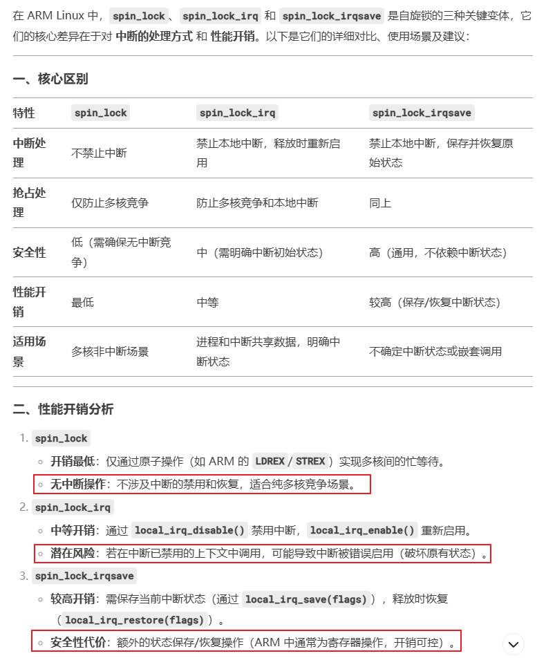
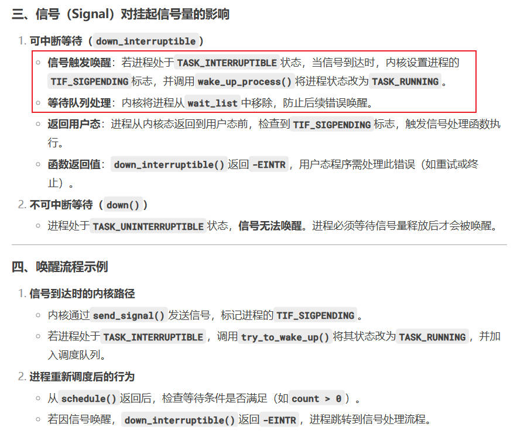

# 并发与竞争

## 第1章 原子操作

### 1.1 什么是原子操作

*原子操作指在执行过程中不会被中断的操作，要么完全执行，要么完全不执行，中间不会插入其他操作。这对于避免多核竞态条件至关重要。*

### 1.2 原子操作的接口

#### 1.2.1 原子操作的数据结构`atomic_t`

`linux/types.h`，定义了原子操作的数据结构`atomic_t`。其实就是一个int整数。

```c
typedef struct {
	int counter;
} atomic_t;
```

#### 1.2.2 原子变量初始化 `ATOMIC_INIT(i)`

`linux/asm/atomic.h`

由于原子变量的类型是一个结构体，所以不能直接赋值，而是要使用`ATOMIC_INIT`。例如：

```c
// 把一个原子变量的初始值设为1
atomic_t count = ATOMIC_INIT(1);
```

这个宏定义的实现方式也很简单，如下所示。其实就是给结构体的成员赋值。

```c
#define ATOMIC_INIT(i)	{ (i) }
```

#### 1.2.3 原子变量的直接赋值函数

| 函数原型 | 作用描述 | 示例 |
| ------- | ------- | ---- |
| `atomic_read(atomic_t *v)` | 读取原子变量的值 | `int val = atomic_read(&counter);` |
| `atomic_set(atomic_t *v, int i)` | 设置原子变量的值 | `atomic_set(&counter, 10);` |
| `atomic_add(int val, atomic_t *v)` | 原子地加上 val | `atomic_add(5, &counter);` |
| `atomic_sub(int val, atomic_t *v)` | 原子地减去 val | `atomic_sub(3, &counter);` |
| `atomic_inc(atomic_t *v)` | 原子地加 1 | `atomic_inc(&counter);` |
| `atomic_dec(atomic_t *v)` | 原子地减 1 | `atomic_dec(&counter);` |

#### 1.2.4 原子变量的test函数

| 函数原型 | 作用描述 | 示例 |
| ------- | ------- | ---- |
| `atomic_inc_and_test(atomic_t *v)` | 加 1 并检查是否为 0 | `if (atomic_inc_and_test(&counter)) {...}` |
| `atomic_dec_and_test(atomic_t *v)` | 减 1 并检查是否为 0 | `if (atomic_dec_and_test(&counter)) {...}` |

### 1.3 原子操作的测试

我们想通过原子操作，实现这样一个事情：`一个设备驱动，同时智能被一个应用程序打开。`

实现方式是，在open函数中判断原子变量。

```c
static int module_cdev_open(struct inode *inode, struct file *filp)
{
	if (!atomic_dec_and_test(&v)) {
		atomic_inc(&v);
		return -EBUSY;
	}
	filp->private_data = &dev;
	return 0;
}
```

直接看完整的驱动代码：

`atomic驱动.c`

```c
#include <linux/init.h>			/* module_init, module_exit */
#include <linux/module.h>		/* MODULE_LISENCE, MODULE_AUTHOR */
#include <linux/moduleparam.h>	/* module_cdev */
#include <linux/types.h>		/* dev_t */
#include <linux/kdev_t.h>		/* MAJOR, MINOR, MKDEV */
#include <linux/fs.h>			/* alloc_chrdev_region, unregister_chrdev_region */
#include <linux/cdev.h>			/* struct cdev, cdev_init, cdev_add */
#include <linux/device.h>		/* class_create, device_create */
#include <linux/uaccess.h>		/* copy_to_user, copy_from_user */
#include <linux/errno.h>		/* IS_ERR, PTR_ERR */
#include <linux/io.h>			/* ioremap, iounmap */
#include <linux/atomic.h>		/* atomic_t, atomic_add */
#include <asm/atomic.h>			

#define CLASS_NAME			"cdev_test"
#define CDEV_NAME			"cdev_test"
#define PRINTK(fmt, ...)	printk("[KERN] " fmt, ##__VA_ARGS__)

struct cdev_dev {
	dev_t  dev;
	struct class *class;
	struct cdev cdev;
	struct device *device;
};

static struct cdev_dev dev;
static atomic_t v = ATOMIC64_INIT(1);

static int module_cdev_open(struct inode *inode, struct file *filp)
{
	if (!atomic_dec_and_test(&v)) {
		atomic_inc(&v);
		return -EBUSY;
	}
	filp->private_data = &dev;
	PRINTK("Char device open\n");
	return 0;
}

ssize_t module_cdev_read(struct file *filp, char __user *buf, size_t size, loff_t *ppos)
{
	return 0;
}

static ssize_t module_cdev_write(struct file *filp, const char __user *buf, size_t size, loff_t *ppos)
{
	return 0;
}

static int module_cdev_release(struct inode *inode, struct file *filp)
{
	atomic_inc(&v);
	PRINTK("Char device close\n");
	return 0;
}

static struct file_operations cdev_ops = {
	.owner		= THIS_MODULE,
	.open		= module_cdev_open,
	.read		= module_cdev_read,
	.write		= module_cdev_write,
	.release	= module_cdev_release,
};

static __init int module_cdev_init(void)
{
	int ret;

	ret = alloc_chrdev_region(&dev.dev, 0, 1, CDEV_NAME);
	if (ret < 0) {
		goto err_alloc_chrdev;
	}
	dev.class = class_create(THIS_MODULE, CLASS_NAME);
	if (IS_ERR(dev.class)) {
		ret = PTR_ERR(dev.class);
		goto err_class_create;
	}
	cdev_init(&dev.cdev, &cdev_ops);
	dev.cdev.owner = THIS_MODULE;
	ret = cdev_add(&dev.cdev, dev.dev, 1);
	if (ret < 0) {
		goto err_cdev_add;
	}
	dev.device = device_create(dev.class, NULL, dev.dev, NULL, CDEV_NAME);
	if (IS_ERR(dev.device)) {
		ret = PTR_ERR(dev.device);
		goto err_device_create;
	}
	
	PRINTK("Char device initializing...\n");

	return 0;

err_device_create:
	cdev_del(&dev.cdev);
err_cdev_add:
	class_destroy(dev.class);
err_class_create:
	unregister_chrdev_region(dev.dev, 1);
err_alloc_chrdev:
	return ret;
}

static __exit void module_cdev_exit(void)
{
	device_destroy(dev.class, dev.dev);
	cdev_del(&dev.cdev);
	class_destroy(dev.class);
	unregister_chrdev_region(dev.dev, 1);

	PRINTK("Char device removed\n");
}

module_init(module_cdev_init);
module_exit(module_cdev_exit);

MODULE_LICENSE("GPL");
MODULE_AUTHOR("ding");
```

应用代码中，我们打开一个设备文件后Sleep占用5秒，然后关闭设备文件。我们要测试的是，这5秒内其他应用程序能否打开设备文件。

`应用代码.c`

```c
#include <stdio.h>
#include <string.h>
#include <stdlib.h>		/* atoi函数 */
#include <unistd.h>		/* close函数 */
#include <sys/types.h>	/* open函数要使用以下3个头文件 */
#include <sys/stat.h>
#include <fcntl.h>

int main(int argc, char *argv[])
{
	int fd, val;

	fd = open(argv[1], O_RDWR);
	if (fd < 0) {
		printf("open %s error\n", argv[1]);
		return fd;
	}
	sleep(5);

	close(fd);
	return 0;
}
```

测试结果跟预期一致。5秒内的访问会直接报错，5秒之后第一个应用程序退出，设备文件又可以继续访问了。


## 第2章 自旋锁

什么是自旋锁？

*自旋锁是为了实现保护共享资源提出的一种锁机制。自旋锁以原地等待的方式来解决资源冲突。在多核CPU当中，当线程A获取到自旋锁以后，此时线程B也想获取自旋锁但是获取不到，只能原地打转(类似于while (1)一直占用CPU不会休眠)。*

**作为比较，如果是使用互斥锁，那么线程B请求锁时会挂起，内核把线程B所在的CPU调度到其他线程，这会带来上下文切换的开销。我们之所以使用自旋锁，就是希望能够快进快出，使原地自旋的开销 < 线程切换的开销。**

可以看到，自旋锁的开销在纳秒~微秒级，而互斥锁的开销在毫秒级以上。所以如果对时延要求严格(如中断)的场所，使用自旋锁，否则互斥锁更好。


### 2.1 自旋锁的API函数

| 函数原型 | 作用描述 |
| ------- | ------- |
| `DEFINE_SPINLOCK(spinlock_t lock)` | 定义并初始化一个自旋锁 |
| `int spin_lock_init(spinlock_t *lock)` | 初始化自旋锁 |
| `void spin_lock(spinlock_t *lock)` | 获取自旋锁，也叫做加锁 |
| `void spin_unlock(spinlock_t *lock)` | 释放自旋锁，也叫做解锁 |
| `int spin_trylock(spinlock_t *lock)` | 尝试获取自旋锁，如果没有获取到就返回0 |
| `int spin_is_locked(spinlock_t *lock)` | 检查自旋锁是否被获取，如果没有被获取就返回非0，否则返回0 |

使用自旋锁，通常是用来保护快进快出非常简短的代码。如下所示：

```c
static struct cdev_dev dev;
static int flag = 1;
DEFINE_SPINLOCK(lock);

static int module_cdev_open(struct inode *inode, struct file *filp)
{
	spin_lock(&lock);
	if (!flag) {
		spin_unlock(&lock);
		return -EBUSY;
	}
	flag = 0;
	spin_unlock(&lock);
	filp->private_data = &dev;
	PRINTK("Char device open\n");
	return 0;
}
```

与中断相关的自旋锁API函数：

| 函数原型 | 作用描述 |
| ------- | ------- |
| `void spin_lock_irq(spinlock_t *lock)` | 关闭中断，并获取自旋锁 |
| `void spin_unlock_irq(spinlock_t *lock)` | 打开中断，并释放自旋锁 |
| `void spin_lock_irqsave(spinlock_t *lock, unsigned long flags)` | 保存中断状态，关闭中断，并获取自旋锁 |
| `void spin_unlock_irqrestore(spinlock_t *lock, unsigned long flags)` | 恢复之前保存的中断状态，打开中断并释放自旋锁 |

下面是这几种自旋锁API的典型使用场景：**不涉及中断使用`spin_lock`，涉及中断使用`spin_lock_irqsave`**



### 2.2 关闭内核抢占

使用自旋锁会禁止抢占。禁止抢占的行为是，CPU会一直执行当前任务，不会调度其他任务(即使其他任务有更高优先级)。可以响应中断，但中断处理完成后，还是会回到前任任务来执行。

关闭内核抢占的原理：


关闭抢占后，当前任务会独占CPU。直到主动调用`preempt_enable()`打开抢占，或者手动触发调度`schedule()`


### 2.3 自旋锁的死锁

*在多核CPU或支持抢占的单核CPU中，被自旋锁保护的临界区不能调用任何能够引起睡眠或者阻塞的函数，否则可能会发生死锁。*

一个死锁的实例：在单核CPU下，A进程获取到自旋锁(隐式的关闭了内核抢占)，如果A进程此时进入了休眠状态，B进程此时也想获取到自旋锁，但由于是单核CPU被禁止抢占，进程B无法调度出去执行，只能原地等锁释放。但进程A休眠了无法执行，所以就产生了死锁。

*多核CPU不会发生上面的情况，因为其他的核会调度其他进程。*

另一个死锁的实例：进程A获取到自旋锁，如果产生了中断，并且在中断里面也要访问共享资源，此时中断里面无法获取到自旋锁，只能原地旋转产生死锁。为了避免这种情况，可以在进程A中使用`spin_lock_irqsave`来禁止中断并获取自旋锁。

## 第3章 信号量

为什么要引入信号量？

前面介绍的自旋锁，是通过原地等待的方式来处理并发与竞争的，所以被保护的临界区不能太长，以免造成对CPU资源的浪费。但有些情况下，我们要长时间对一些资源进行保护，这时就可以使用信号量。

信号量会引起调用者睡眠，所以信号量也叫睡眠锁。

### 3.1 信号量的API函数

| 函数原型 | 作用描述 |
| ------- | ------- |
| `DEFINE_SEMAPHORE(name)` | 定义信号量，并设置信号量的值为1 |
| `void sema_init(struct semaphore *sem, int val)` | 初始化信号量sem，并设置信号量的值为val |
| `void down(struct semaphore *sem)` | 获取信号量，不能被信号打断，如ctrl+c |
| `int  down_interruptible(struct semaphore *sem)` | 获取信号量，能被信号打断，如ctrl+c |
| `void up(struct semaphore *sem)` | 释放信号量 |
| `int down_trylock(struct semaphore *sem)` | 尝试获取信号量。如果获取到就返回0，获取不到返回非0 |

信号量挂起进程的原理是，把进程加入到信号量的等待列表中，然后把进程状态设为睡眠，调度其他进程运行。

信号量唤醒的原理是，当有人释放信号量时，检查这个信号量的等待列表，从头部取出最先请求休眠的进程，调度运行。


信号量睡眠可以被信号sig唤醒：



`信号量测试代码.c`

```c
#include <linux/init.h>			/* module_init, module_exit */
#include <linux/module.h>		/* MODULE_LISENCE, MODULE_AUTHOR */
#include <linux/moduleparam.h>	/* module_cdev */
#include <linux/types.h>		/* dev_t */
#include <linux/kdev_t.h>		/* MAJOR, MINOR, MKDEV */
#include <linux/fs.h>			/* alloc_chrdev_region, unregister_chrdev_region */
#include <linux/cdev.h>			/* struct cdev, cdev_init, cdev_add */
#include <linux/device.h>		/* class_create, device_create */
#include <linux/uaccess.h>		/* copy_to_user, copy_from_user */
#include <linux/errno.h>		/* IS_ERR, PTR_ERR */
#include <linux/io.h>			/* ioremap, iounmap */
#include <linux/semaphore.h>

#define CLASS_NAME			"cdev_test"
#define CDEV_NAME			"cdev_test"
#define PRINTK(fmt, ...)	printk("[KERN] " fmt, ##__VA_ARGS__)

struct cdev_dev {
	dev_t  dev;
	struct class *class;
	struct cdev cdev;
	struct device *device;
};

static struct cdev_dev dev;
struct semaphore sem;

static int module_cdev_open(struct inode *inode, struct file *filp)
{
	if (down_interruptible(&sem)) {
		return -EINTR;
	}
	filp->private_data = &dev;
	PRINTK("Char device open\n");
	return 0;
}

ssize_t module_cdev_read(struct file *filp, char __user *buf, size_t size, loff_t *ppos)
{
	return 0;
}

static ssize_t module_cdev_write(struct file *filp, const char __user *buf, size_t size, loff_t *ppos)
{
	return 0;
}

static int module_cdev_release(struct inode *inode, struct file *filp)
{
	up(&sem);
	PRINTK("Char device close\n");
	return 0;
}

static struct file_operations cdev_ops = {
	.owner		= THIS_MODULE,
	.open		= module_cdev_open,
	.read		= module_cdev_read,
	.write		= module_cdev_write,
	.release	= module_cdev_release,
};

static __init int module_cdev_init(void)
{
	int ret;

	sema_init(&sem, 1);
	ret = alloc_chrdev_region(&dev.dev, 0, 1, CDEV_NAME);
	if (ret < 0) {
		goto err_alloc_chrdev;
	}
	dev.class = class_create(THIS_MODULE, CLASS_NAME);
	if (IS_ERR(dev.class)) {
		ret = PTR_ERR(dev.class);
		goto err_class_create;
	}
	cdev_init(&dev.cdev, &cdev_ops);
	dev.cdev.owner = THIS_MODULE;
	ret = cdev_add(&dev.cdev, dev.dev, 1);
	if (ret < 0) {
		goto err_cdev_add;
	}
	dev.device = device_create(dev.class, NULL, dev.dev, NULL, CDEV_NAME);
	if (IS_ERR(dev.device)) {
		ret = PTR_ERR(dev.device);
		goto err_device_create;
	}
	
	PRINTK("Char device initializing...\n");

	return 0;

err_device_create:
	cdev_del(&dev.cdev);
err_cdev_add:
	class_destroy(dev.class);
err_class_create:
	unregister_chrdev_region(dev.dev, 1);
err_alloc_chrdev:
	return ret;
}

static __exit void module_cdev_exit(void)
{
	device_destroy(dev.class, dev.dev);
	cdev_del(&dev.cdev);
	class_destroy(dev.class);
	unregister_chrdev_region(dev.dev, 1);

	PRINTK("Char device removed\n");
}

module_init(module_cdev_init);
module_exit(module_cdev_exit);

MODULE_LICENSE("GPL");
MODULE_AUTHOR("ding");
```

测试结果：

第1个进程后台运行，没关闭文件时，第2个进程被挂起。等到第1个进程结束时，进程2立即被执行。


## 第4章 互斥锁

### 4.1 非递归互斥锁

Linux内核的互斥锁设计，是标准的互斥锁，而非递归互斥锁。这意味着，我们如果在同一个线程中多次加锁，就会导致死锁。

Linux用户空间的互斥锁`pthread_mutex`，是递归互斥锁设计。


如果我们一定想要一个递归互斥锁，可以通过以下方式来模拟，但不推荐。


### 4.2 互斥锁API函数

互斥锁的API函数：

| 函数原型 | 作用描述 |
| ------- | ------- |
| `DEFINE_MUTEX(mutexname)` | 定义并初始化一个互斥锁 |
| `mutex_init(mutex *lock)` | 初始化互斥锁 |
| `void mutex_lock(struct mutex *lock)` | 上锁 |
| `void mutex_unlock(struct mutex *lock)` | 解锁 |
| `int mutex_is_locked(struct mutex *lock)` | 如果锁已经被使用则返回1，否则返回0 |

`测试代码.c`

```c
static struct mutex lock;
static int flag = 1;

static int module_cdev_open(struct inode *inode, struct file *filp)
{
	mutex_lock(&lock);
	if (!flag) {
		mutex_unlock(&lock);
		return -EBUSY;
	}
	flag = 0;
	mutex_unlock(&lock);
	filp->private_data = &dev;
	PRINTK("Char device open\n");
	return 0;
}

ssize_t module_cdev_read(struct file *filp, char __user *buf, size_t size, loff_t *ppos)
{
	return 0;
}

static ssize_t module_cdev_write(struct file *filp, const char __user *buf, size_t size, loff_t *ppos)
{
	return 0;
}

static int module_cdev_release(struct inode *inode, struct file *filp)
{
	mutex_lock(&lock);
	flag = 1;
	mutex_unlock(&lock);
	PRINTK("Char device close\n");
	return 0;
}
```

