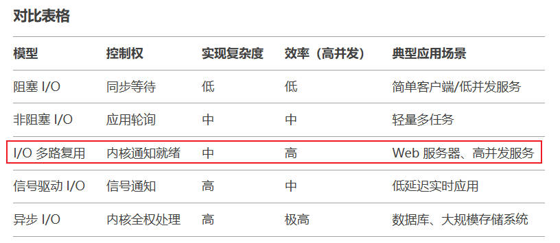
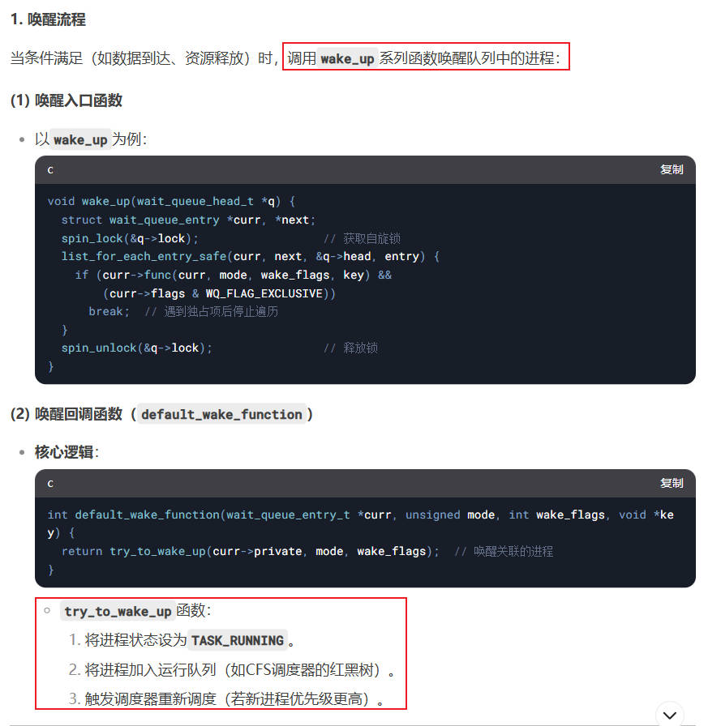
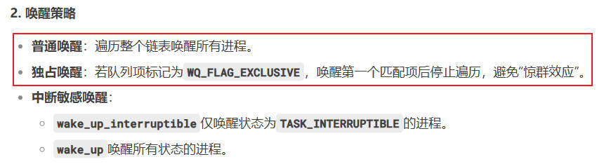
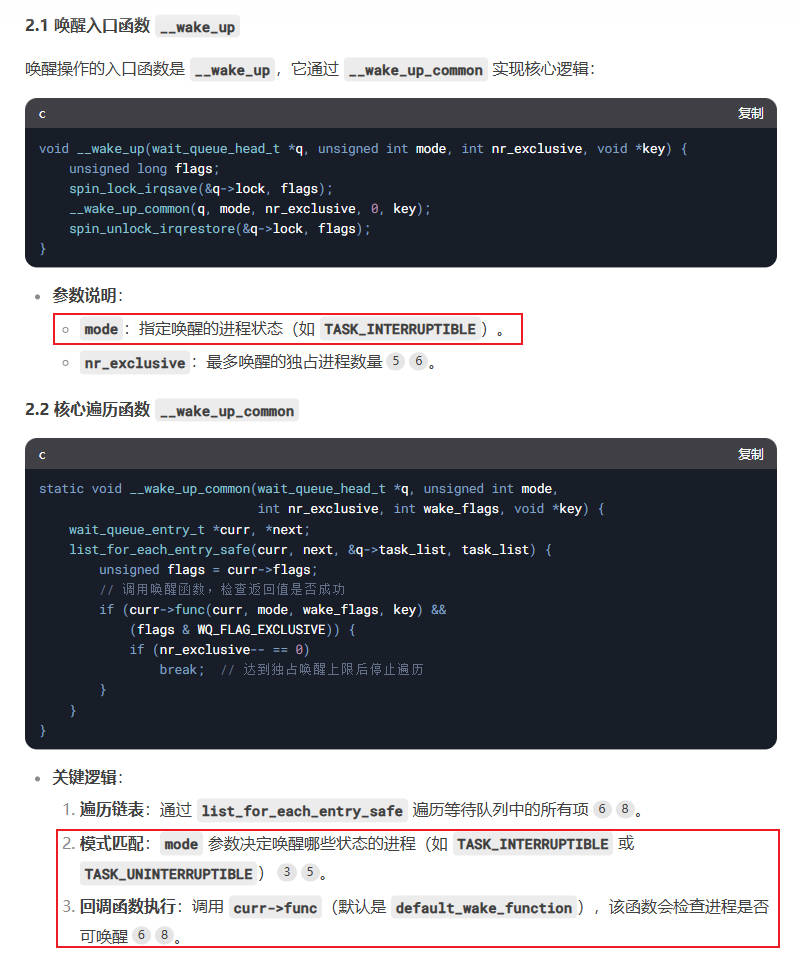
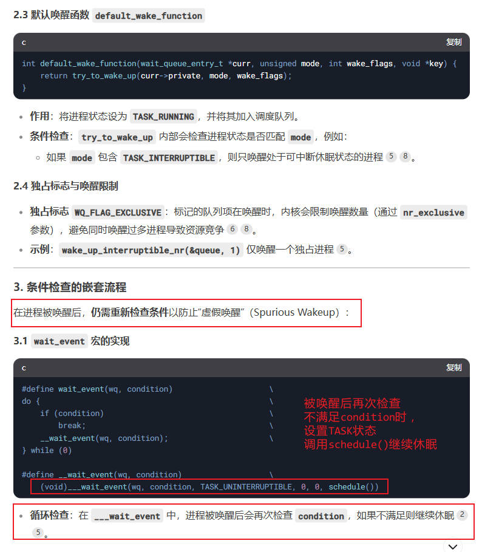
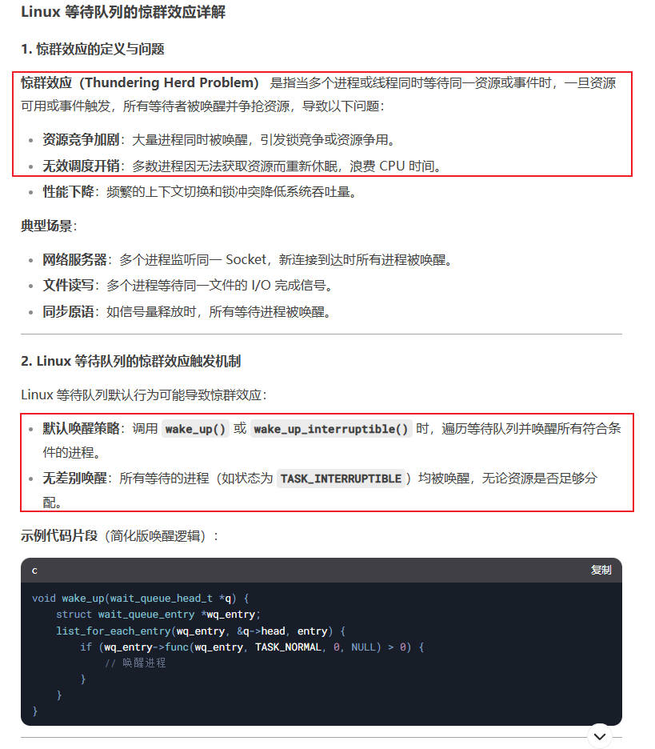
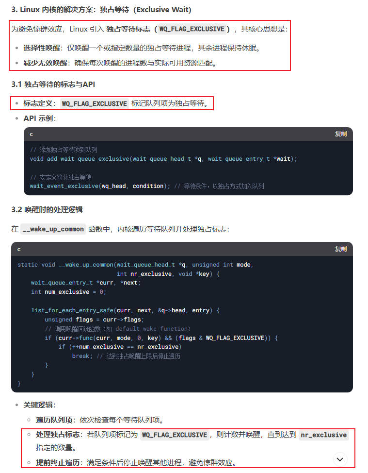
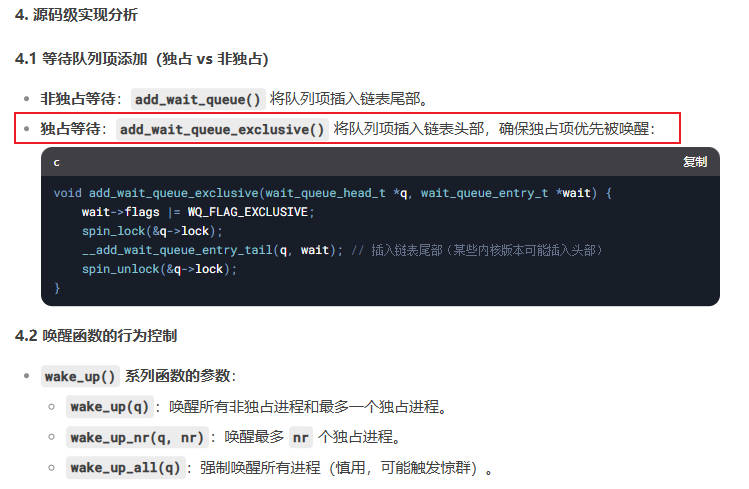

# 高级字符设备驱动

## 第1章IO模型

### 1.1 IO模型的引入

什么是IO：`Linux中提到的IO，指的是输入和输出(input output)，而不是MCU中常说的GPIO。`

IO执行过程：`操作系统负责对计算机的资源进行管理，应用程序运行在操作系统上，处在用户空间。应用程序不能直接对硬件进行操作，智能通过操作系统提供的API来操作硬件。`

一个完整的IO过程包含以下几个步骤：

1. 应用程序向操作系统发起IO调用请求(系统调用)
2. 操作系统准备数据，把IO设被的数据加载到内核缓冲区
3. 操作系统拷贝数据，把内核缓冲区的的数据从内核空间拷贝到用户空间

在执行IO过程中，由于CPU和内存的速度远高于外设的速度，所以就存在速度严重不匹配的情况，这就可以使用IO模型进行编程。

### 1.2 Linux的5种IO模型

#### 1.2.1 阻塞IO

+ 机制：当应用程序调用`read()`或`write()`系统调用时，进程被挂起，直到数据就绪或操作成功
+ 特点：
    1. 简单易用，代码逻辑直观
    2. 单线程下无法处理多任务，效率低
    3. 适用于低并发或简单场景
+ 系统调用示例：默认的`read()`、`write()`

#### 1.2.2 非阻塞IO

+ 机制：通过`fcntl()`设置`O_NONBLOCK`标志，系统调用立即返回结果(成功或`EGAIN`错误)，需要轮询检查状态
+ 特点：
    1. 避免进程阻塞，但频繁轮询浪费CPU
    2. 适用于轻量级多任务，但高并发下效率不足
+ 系统调用示例：`read()`返回`EGAIN`时需重试

#### 1.2.3 IO多路复用

+ 机制：使用`select`、`poll`、`epoll`同时监控多个文件描述符(FDs)，当任一FD就绪时返回，由应用处理就绪的IO
+ 特点：
    1. 单线程处理多IO，适合高并发
    2. `select / poll`效率随FD数量线性下降，`epoll`通过事件驱动优化性能
+ 使用场景：Web服务器、消息队列等高并发服务
+ 系统调用：`select()`、`poll()`、`epoll_create()`、`epoll_wait()`

#### 1.2.4 信号驱动IO

+ 机制：通过`sigaction()`注册`SIGIO`信号处理函数，内核在数据就绪时发送信号通知应用
+ 特点：
    1. 避免轮询，但信号处理复杂(异步安全、可重入问题)
    2. 适用于低延时场景，但信号队列溢出可能导致丢失通知
+ 系统调用：`fcntl()`设置`F_SETOWN`、`F_SETSIG`

#### 1.2.5 异步IO

+ 机制：应用通过`aio_read()`、`aio_write()`提交IO请求后立即返回，内核完成整个操作后通知应用(如通过回调)
+ 特点：
    1. 真正的异步：应用无需参与数据就绪后的读写操作
    2. Linux原生AIO支持有限，通常结合`libaio`库或框架
+ 使用场景：高性能存储、数据库等需要极致并发的场景

对比表格：



## 第2章 等待队列

什么是等待队列？

等待队列，是Linux内核实现阻塞和唤醒的机制。核心思想：`当某个条件不满足时，进程主动让出CPU进入休眠。当条件满足时，内核通过队列快速唤醒这些休眠的进程`。

等待队列的作用：

1. 避免忙等待：通过休眠而非轮询，减少CPU资源浪费
2. 事件驱动：高效响应硬件中断或软件条件变化

### 2.1 等待队列的组成

Linux内核的等待队列由2个核心数据结构组成：等待队列头、等待队列项。

可以通过消息队列来帮助理解。等待队列头就是定义了一个消息队列，等待队列项就是往消息队列里面抛消息。

#### 2.1.1 等待队列头`wait_queue_head_t`

```c
typedef struct {
	spinlock_t		lock;           // 自旋锁：保护队列操作的原子性
	struct list_head	task_list;  // 双向链表头，链接所有等待队列项
} wait_queue_head_t;
```

作用：

1. 同步控制：通过自旋锁`spinlock`确保对链表并发操作的原子性
2. 链表管理：`task_list`：所有等待的进程都挂载在此链表上

#### 2.1.2 等待队列项

```c
typedef int (*wait_queue_func_t)(wait_queue_t *wait, unsigned mode, int flags, void *key);

typedef struct {
	unsigned int		flags;      // 标志位：如独占等待
	void			*private;       // 关联的进程
	wait_queue_func_t	func;       // 唤醒回调函数
	struct list_head	task_list;  // 链表节点。用于挂在到等待队列头
} wait_queue_t;
```

关键字段详解：

`flags`: 控制唤醒行为（如独占等待）
`private`：指向等待进程的`task_struct`，唤醒时通过此字段找到进程
`func`：唤醒回调函数，决定如何唤醒进程（默认调用`try_to_wake_up`）
`entry`：双向链表节点，将队列项链接到等待队列头的链表

### 2.2 常用API和底层原理

考虑一下，我们要使用等待队列需要做些什么，然后就知道有哪些API函数了。

1. 需要有一个等待队列头
2. 需要能够把等待队列项，挂载到等待队列头中

#### 2.2.1 初始化等待队列

所谓的初始化等待队列，其实就是定义一个等待队列头，类似于定义一条消息队列。

1. `#define DECLARE_WAIT_QUEUE_HEAD(name)`: 定义并初始化等待队列头

2. `init_waitqueue_head(wait_queue_head_t *q)`：初始化等待队列头，需要先定义一个等待队列头的变量

#### 2.2.2 进入等待队列

前面定义好了等待队列头，我们接下来就应该把等待队列项，添加到等待队列头中。

1. `wait_event(wait_queue_head_t *q, condition)`：不可中断等待（无视信号）

底层源码实现：

+ `wait_event`自动管理了等待列表项。内核隐式创建了一个等待列表项，并挂载在等待队列头
+ 设置进程状态`state`为可中断或不可中断，此时一执行`schedule()`就会调度到其他进程执行了
+ 如果`condition`条件满足，直接退出继续运行当前进程
+ 如果`condition`条件不满足，调度到其他进程去执行，因此当前进程进入休眠

```c
wait_event(wait_queue_head_t *q, condition)
{
    // 定义了一个等待队列项
    wait_queue_t __wait;

    prepare_to_wait_event()
    {
        __wait.flags = 0;
        __wait.private = current; // 等待队列项的成员指针，指向当前进程
        __wait.func = default_wake_function;

        // 把等待队列项，添加到等待队列头中
        __add_wait_queue(q, __wait);

        set_current_state(TASK_UNINTERRUPTIBLE); // 设置进程状态为，不可中断
    }
    
    // 判断条件是否满足。如果满足条件直接跳出，并把进程状态设回运行
    // 如果条件不满足，schedule调度其他进程运行，当前进程进入休眠
    for (;;) {
        if (condition)
		break;		

        schedule();
    }
    
    set_current_state(TASK_RUNNING);
}
```

2. `wait_event_interruptible(wait_queue_head_t *q, condition)`：可中断等待

实现方式与不可中断几乎完全一致，位移的区别是，把进程状态标志设为可中断

3. 手动管理等待列表项
   
我们也可以手动创建等待列表项，并手动添加到等待列表头中。操作流程如下：


```c
DECLARE_WAIT_QUEUE_HEAD(wq_head);       // 定义等待队列头
DEFINE_WAIT(item);                      // 定义等待队列项
prepare_to_wait(&queue, &item, state);  // 添加队列项并设置进程状态
finish_wait(&queue, &item);             // 移除队列项并恢复进程状态
```

4. 总结

等待流程：

+ `加入队列`：调用`wait_event()`后，内核将当前进程封装为队列项，添加到等待队列头的链表
+ `设置状态`：进程状态设为可中断或不可中断
+ `让出CPU`：调用`schedule()`触发调度，切换到其他进程
+ `检查条件`：被唤醒后再次检查条件是否满足，放置虚假唤醒。*这一步至关重要，因为wake_up()会唤醒队列中断所有等待项，即使条件不满足。所以我们必须检查，如果不满足还得继续休眠。*

调度逻辑：当进程状态设为非`TASK_RUNNING`时，调度器`schedule()`不再选择该进程运行

#### 2.2.3 唤醒队列

前面讲到，调用`wait_event`时如果条件`condition`不满足，进程将进入休眠。过了一会，假如收到了一个数据导致条件`condition`满足了，我们就可以唤醒等待队列。

1. `wake_up(wait_queue_head_t *q)`：唤醒等待队列中的所有进程（包括 可中断 和 不可中断）

*注意，这并不是唤醒某一个等待队列项，而是唤醒(条件检查)整条队列*。底层源码实现：

+ `获取锁`：通过自旋锁保护队列操作
+ `遍历链表`：调用眉和等待项的`func`函数（默认唤醒进程）
+ `修改状态`：将进程状态设为`TASK_RUNNING`，加入调度队列

```c
// 定义了可中断 和 不可中断 的进程标志
#define TASK_NORMAL		(TASK_INTERRUPTIBLE | TASK_UNINTERRUPTIBLE)

wake_up(wait_queue_head_t *q)
{
    unsigned long flags;
    spin_lock_irqsave(&q->lock, flags);

    __wake_up(wait_queue_head_t *q, TASK_NORMAL) // 唤醒目标包括：可中断 和 不可中断
    {
        __wake_up_common(wait_queue_head_t *q, TASK_NORMAL)
        {
            wait_queue_t *curr, *next;

            list_for_each_entry_safe(curr, next, &q->task_list, task_list) {
                unsigned flags = curr->flags;

                if (curr->func(curr, mode, wake_flags, key) &&
                        (flags & WQ_FLAG_EXCLUSIVE) && !--nr_exclusive)
                    break;
            }
        }
    }

    spin_unlock_irqrestore(&q->lock, flags);
}

// 这里调用了curr->func，即默认的唤醒函数来处理。我们看看怎么做的
int autoremove_wake_function(wait_queue_t *wait, unsigned mode, int sync, void *key)
{
	int ret = default_wake_function(wait, mode, sync, key);
                try_to_wake_up(curr->private, mode)
                {
                    try_to_wake_up(struct task_struct *p, state = (TASK_INTERRUPTIBLE | TASK_UNINTERRUPTIBLE))
                    {
                        // 唤醒条件不满足，返回0
                        if (!(p->state & state))
		                    return 0;

                        // 唤醒条件满足，设置运行状态，返回1
                        p->state = TASK_RUNNING;
                        // 加入调度队列
                        return 1;
                    }
                }
                    
    // 如果唤醒成功，则从等待队列中删除等待项
	if (ret)
		list_del_init(&wait->task_list);
	return ret;
}
```

2. `wake_up_interruptible(wait_queue_head_t *q)`：仅唤醒可中断的进程

实现原理与`wake_up`几乎完全一致，只有唤醒的标志位不同

3. 总结

唤醒流程：

+ `获取锁`：通过自旋锁保护队列操作
+ `遍历链表`：调用眉和等待项的`func`函数（默认唤醒进程）
+ `修改状态`：将进程状态设为`TASK_RUNNING`，加入调度队列

### 2.3 一些技术细节

#### 2.3.1 唤醒的总体流程





#### 2.3.2 唤醒的源码分析

函数调用链：



唤醒后的条件检查：



#### 2.3.3 惊群效应

惊群效应的来源：



Linux内核对惊群效应的解决方案：





### 2.4 按键驱动的唤醒流程

前面介绍了等待队列，休眠和唤醒的API和实现原理。下面是一个常用的按键驱动程序：


### 2.4 按键阻塞驱动代码

```c
#include <linux/init.h>     /* module_init */
#include <linux/module.h>   /* MODULE_LICENSE */
#include <linux/types.h>    /* dev_t */
#include <linux/fs.h>       /* alloc_chrdev_region */
#include <linux/cdev.h>     /* cdev_init */
#include <linux/device.h>   /* class_create, device_create */
#include <linux/io.h>
#include <asm/io.h>         /* ioremap */
#include <linux/uaccess.h>
#include <asm/uaccess.h>    /* copy_from_user */
#include <linux/sched.h>
#include <linux/wait.h>
#include <linux/atomic.h>
#include <linux/timer.h>
#include <linux/jiffies.h>

#define PRINTF(fmt, ...)    printk("[KERN] " fmt, ##__VA_ARGS__)

#define DEVICE_NAME     "key"
#define CLASS_NAME      "cdev_test"

// KEY -> SNVS_TAMPER0 -> GPIO5_IO00
#define MUX_GPIO5_IO00  0x02290008
#define PAD_GPIO5_IO00  0x0229004C

#define GPIO5_GDIR  0x020AC004
#define GPIO5_DR    0x020AC000

struct cdev_device {
    int minor;
    struct cdev cdev;
    struct device *device;
};

static int major;
static struct class *class;
static struct cdev_device dev;

static atomic_t v = ATOMIC_INIT(-1);
static struct timer_list timer;
static DECLARE_WAIT_QUEUE_HEAD(wq_head);

static void __iomem *mux_gpio5_io00;
static void __iomem *pad_gpio5_io00;
static void __iomem *gpio5_gdir;
static void __iomem *gpio5_dr;

static u8 last_val, this_val;

static void s_key_init(void)
{
    u32 reg_val;

    writel(0b101, mux_gpio5_io00);
    writel(0x10b0, pad_gpio5_io00);

    reg_val = readl(gpio5_gdir);
    reg_val &= ~((u32)1 << 0);
    writel(reg_val, gpio5_gdir);
}

static u8 s_key_get(void)
{
    u32 reg_val = readl(gpio5_dr);
    u8 level = reg_val & 0b1;

    return level;
}

static void timer_callback(unsigned long data)
{
    this_val = s_key_get();
    if (last_val == 1 && this_val == 0)  {
        // key down
        atomic_set(&v, 0);
        wake_up_interruptible(&wq_head);
    }
    else if (last_val == 0 && this_val == 1) {
        atomic_set(&v, 1);
        wake_up_interruptible(&wq_head);
    }
    else {
        atomic_set(&v, -1);
    }
    last_val = this_val;
    mod_timer(&timer, jiffies + msecs_to_jiffies(10));
}

static int cdev_module_open(struct inode *inode, struct file *filp)
{
    s_key_init();
    last_val = s_key_get();
    setup_timer(&timer, timer_callback, 0);
    mod_timer(&timer, jiffies + msecs_to_jiffies(10));
    atomic_set(&v, -1);

    filp->private_data = &dev;
    PRINTF("KEY open\n");

    return 0;
}

static ssize_t cdev_module_read(struct file *filp, char __user *buf , size_t size, loff_t *ppos)
{
    int ato_val;
    u8  key_val;

    if (wait_event_interruptible(wq_head, ((ato_val = atomic_read(&v)) >= 0))) {
        return -EINTR;
    }
    key_val = ato_val;
    if (copy_to_user(buf, &key_val, 1)) {
        return -EFAULT;
    }
    atomic_set(&v, -1);

    return 1;
}

static int cdev_module_release(struct inode *inode, struct file *filp)
{
    del_timer(&timer);
    PRINTF("KEY close\n");
    return 0;
}

const struct file_operations cdev_fops = {
    .owner   = THIS_MODULE,
    .open    = cdev_module_open,
    .read    = cdev_module_read,
    .release = cdev_module_release,
};

static int cdev_module_init(void)
{
    dev_t dev_num;

    alloc_chrdev_region(&dev_num, 0, 1, DEVICE_NAME);
    class = class_create(THIS_MODULE, CLASS_NAME);
    major = MAJOR(dev_num);
    dev.minor = 0;
    cdev_init(&dev.cdev, &cdev_fops);
    dev.cdev.owner = THIS_MODULE;
    cdev_add(&dev.cdev, dev_num, 1);
    dev.device = device_create(class, NULL, dev_num, NULL, DEVICE_NAME);

    mux_gpio5_io00 = ioremap(MUX_GPIO5_IO00, 4);
    pad_gpio5_io00 = ioremap(PAD_GPIO5_IO00, 4);
    gpio5_gdir = ioremap(GPIO5_GDIR, 4);
    gpio5_dr   = ioremap(GPIO5_DR, 4);

    PRINTF("KEY driver init(major:%d minor:%d)\n", major, 0);

    return 0;
}

static void cdev_module_exit(void)
{
    iounmap(gpio5_dr);
    iounmap(gpio5_gdir);
    iounmap(pad_gpio5_io00);
    iounmap(mux_gpio5_io00);

    device_destroy(class, MKDEV(major, dev.minor));
    cdev_del(&dev.cdev);
    class_destroy(class);
    unregister_chrdev_region(MKDEV(major, dev.minor), 1);
    PRINTF("KEY driver exit\n");
}

MODULE_LICENSE("GPL");

module_init(cdev_module_init);
module_exit(cdev_module_exit);
```

## 第3章 非阻塞IO


