# 高级字符设备驱动

## 第1章IO模型

### 1.1 IO模型的引入

什么是IO：`Linux中提到的IO，指的是输入和输出(input output)，而不是MCU中常说的GPIO。`

IO执行过程：`操作系统负责对计算机的资源进行管理，应用程序运行在操作系统上，处在用户空间。应用程序不能直接对硬件进行操作，智能通过操作系统提供的API来操作硬件。`

一个完整的IO过程包含以下几个步骤：

1. 应用程序向操作系统发起IO调用请求(系统调用)
2. 操作系统准备数据，把IO设被的数据加载到内核缓冲区
3. 操作系统拷贝数据，把内核缓冲区的的数据从内核空间拷贝到用户空间

在执行IO过程中，由于CPU和内存的速度远高于外设的速度，所以就存在速度严重不匹配的情况，这就可以使用IO模型进行编程。

### 1.2 Linux的5种IO模型

#### 1.2.1 阻塞IO

+ 机制：当应用程序调用`read()`或`write()`系统调用时，进程被挂起，直到数据就绪或操作成功
+ 特点：
    1. 简单易用，代码逻辑直观
    2. 单线程下无法处理多任务，效率低
    3. 适用于低并发或简单场景
+ 系统调用示例：默认的`read()`、`write()`

#### 1.2.2 非阻塞IO

+ 机制：通过`fcntl()`设置`O_NONBLOCK`标志，系统调用立即返回结果(成功或`EGAIN`错误)，需要轮询检查状态
+ 特点：
    1. 避免进程阻塞，但频繁轮询浪费CPU
    2. 适用于轻量级多任务，但高并发下效率不足
+ 系统调用示例：`read()`返回`EGAIN`时需重试

#### 1.2.3 IO多路复用

+ 机制：使用`select`、`poll`、`epoll`同时监控多个文件描述符(FDs)，当任一FD就绪时返回，由应用处理就绪的IO
+ 特点：
    1. 单线程处理多IO，适合高并发
    2. `select / poll`效率随FD数量线性下降，`epoll`通过事件驱动优化性能
+ 使用场景：Web服务器、消息队列等高并发服务
+ 系统调用：`select()`、`poll()`、`epoll_create()`、`epoll_wait()`

#### 1.2.4 信号驱动IO

+ 机制：通过`sigaction()`注册`SIGIO`信号处理函数，内核在数据就绪时发送信号通知应用
+ 特点：
    1. 避免轮询，但信号处理复杂(异步安全、可重入问题)
    2. 适用于低延时场景，但信号队列溢出可能导致丢失通知
+ 系统调用：`fcntl()`设置`F_SETOWN`、`F_SETSIG`

#### 1.2.5 异步IO

+ 机制：应用通过`aio_read()`、`aio_write()`提交IO请求后立即返回，内核完成整个操作后通知应用(如通过回调)
+ 特点：
    1. 真正的异步：应用无需参与数据就绪后的读写操作
    2. Linux原生AIO支持有限，通常结合`libaio`库或框架
+ 使用场景：高性能存储、数据库等需要极致并发的场景

对比表格：


## 第2章 等待队列

什么是等待队列？

等待队列，是Linux内核实现阻塞和唤醒的机制。核心思想：`当某个条件不满足时，进程主动让出CPU进入休眠。当条件满足时，内核通过队列快速唤醒这些休眠的进程`。

等待队列的作用：

1. 避免忙等待：通过休眠而非轮询，减少CPU资源浪费
2. 事件驱动：高效响应硬件中断或软件条件变化

### 2.1 等待队列的组成

Linux内核的等待队列由2个核心数据结构组成：等待队列头、等待队列项。

可以通过消息队列来帮助理解。等待队列头就是定义了一个消息队列，等待队列项就是往消息队列里面抛消息。

#### 2.1.1 等待队列头`wait_queue_head_t`

```c
typedef struct {
	spinlock_t		lock;           // 自旋锁：保护队列操作的原子性
	struct list_head	task_list;  // 双向链表头，链接所有等待队列项
} wait_queue_head_t;
```

作用：

1. 同步控制：通过自旋锁`spinlock`确保对链表并发操作的原子性
2. 链表管理：`task_list`：所有等待的进程都挂载在此链表上

#### 2.1.2 等待队列项

```c
typedef int (*wait_queue_func_t)(wait_queue_t *wait, unsigned mode, int flags, void *key);

typedef struct {
	unsigned int		flags;      // 标志位：如独占等待
	void			*private;       // 关联的进程
	wait_queue_func_t	func;       // 唤醒回调函数
	struct list_head	task_list;  // 链表节点。用于挂在到等待队列头
} wait_queue_t;
```

关键字段详解：

`flags`: 控制唤醒行为（如独占等待）
`private`：指向等待进程的`task_struct`，唤醒时通过此字段找到进程
`func`：唤醒回调函数，决定如何唤醒进程（默认调用`try_to_wake_up`）
`entry`：双向链表节点，将队列项链接到等待队列头的链表

### 2.2 常用API和底层原理

考虑一下，我们要使用等待队列需要做些什么，然后就知道有哪些API函数了。

1. 需要有一个等待队列头
2. 需要能够把等待队列项，挂载到等待队列头中

#### 2.2.1 初始化等待队列

所谓的初始化等待队列，其实就是定义一个等待队列头，类似于定义一条消息队列。

1. `#define DECLARE_WAIT_QUEUE_HEAD(name)`: 定义并初始化等待队列头

2. `init_waitqueue_head(wait_queue_head_t *q)`：初始化等待队列头，需要先定义一个等待队列头的变量

#### 2.2.2 进入等待队列

前面定义好了等待队列头，我们接下来就应该把等待队列项，添加到等待队列头中。

1. `wait_event(wait_queue_head_t *q, condition)`：不可中断等待（无视信号）

底层源码实现：

+ `wait_event`自动管理了等待列表项。内核隐式创建了一个等待列表项，并挂载在等待队列头
+ 设置进程状态`state`为可中断或不可中断，此时一执行`schedule()`就会调度到其他进程执行了
+ 如果`condition`条件满足，直接退出继续运行当前进程
+ 如果`condition`条件不满足，调度到其他进程去执行，因此当前进程进入休眠

```c
wait_event(wait_queue_head_t *q, condition)
{
    // 定义了一个等待队列项
    wait_queue_t __wait;

    prepare_to_wait_event()
    {
        __wait.flags = 0;
        __wait.private = current; // 等待队列项的成员指针，指向当前进程
        __wait.func = default_wake_function;

        // 把等待队列项，添加到等待队列头中
        __add_wait_queue(q, __wait);

        set_current_state(TASK_UNINTERRUPTIBLE); // 设置进程状态为，不可中断
    }
    
    // 判断条件是否满足。如果满足条件直接跳出，并把进程状态设回运行
    // 如果条件不满足，schedule调度其他进程运行，当前进程进入休眠
    for (;;) {
        if (condition)
		break;		

        schedule();
    }
    
    set_current_state(TASK_RUNNING);
}
```

2. `wait_event_interruptible(wait_queue_head_t *q, condition)`：可中断等待

实现方式与不可中断几乎完全一致，位移的区别是，把进程状态标志设为可中断

3. 手动管理等待列表项
   
我们也可以手动创建等待列表项，并手动添加到等待列表头中。操作流程如下：


```c
DECLARE_WAIT_QUEUE_HEAD(wq_head);       // 定义等待队列头
DEFINE_WAIT(item);                      // 定义等待队列项
prepare_to_wait(&queue, &item, state);  // 添加队列项并设置进程状态
finish_wait(&queue, &item);             // 移除队列项并恢复进程状态
```

4. 总结

等待流程：

+ `加入队列`：调用`wait_event()`后，内核将当前进程封装为队列项，添加到等待队列头的链表
+ `设置状态`：进程状态设为可中断或不可中断
+ `让出CPU`：调用`schedule()`触发调度，切换到其他进程
+ `检查条件`：被唤醒后再次检查条件是否满足，放置虚假唤醒。*这一步至关重要，因为wake_up()会唤醒队列中断所有等待项，即使条件不满足。所以我们必须检查，如果不满足还得继续休眠。*

调度逻辑：当进程状态设为非`TASK_RUNNING`时，调度器`schedule()`不再选择该进程运行

#### 2.2.3 唤醒队列

前面讲到，调用`wait_event`时如果条件`condition`不满足，进程将进入休眠。过了一会，假如收到了一个数据导致条件`condition`满足了，我们就可以唤醒等待队列。

1. `wake_up(wait_queue_head_t *q)`：唤醒等待队列中的所有进程（包括 可中断 和 不可中断）

*注意，这并不是唤醒某一个等待队列项，而是唤醒(条件检查)整条队列*。底层源码实现：

+ `获取锁`：通过自旋锁保护队列操作
+ `遍历链表`：调用眉和等待项的`func`函数（默认唤醒进程）
+ `修改状态`：将进程状态设为`TASK_RUNNING`，加入调度队列

```c
// 定义了可中断 和 不可中断 的进程标志
#define TASK_NORMAL		(TASK_INTERRUPTIBLE | TASK_UNINTERRUPTIBLE)

wake_up(wait_queue_head_t *q)
{
    unsigned long flags;
    spin_lock_irqsave(&q->lock, flags);

    __wake_up(wait_queue_head_t *q, TASK_NORMAL) // 唤醒目标包括：可中断 和 不可中断
    {
        __wake_up_common(wait_queue_head_t *q, TASK_NORMAL)
        {
            wait_queue_t *curr, *next;

            list_for_each_entry_safe(curr, next, &q->task_list, task_list) {
                unsigned flags = curr->flags;

                if (curr->func(curr, mode, wake_flags, key) &&
                        (flags & WQ_FLAG_EXCLUSIVE) && !--nr_exclusive)
                    break;
            }
        }
    }

    spin_unlock_irqrestore(&q->lock, flags);
}

// 这里调用了curr->func，即默认的唤醒函数来处理。我们看看怎么做的
int autoremove_wake_function(wait_queue_t *wait, unsigned mode, int sync, void *key)
{
	int ret = default_wake_function(wait, mode, sync, key);
                try_to_wake_up(curr->private, mode)
                {
                    try_to_wake_up(struct task_struct *p, state = (TASK_INTERRUPTIBLE | TASK_UNINTERRUPTIBLE))
                    {
                        // 唤醒条件不满足，返回0
                        if (!(p->state & state))
		                    return 0;

                        // 唤醒条件满足，设置运行状态，返回1
                        p->state = TASK_RUNNING;
                        // 加入调度队列
                        return 1;
                    }
                }
                    
    // 如果唤醒成功，则从等待队列中删除等待项
	if (ret)
		list_del_init(&wait->task_list);
	return ret;
}
```

2. `wake_up_interruptible(wait_queue_head_t *q)`：仅唤醒可中断的进程

实现原理与`wake_up`几乎完全一致，只有唤醒的标志位不同

3. 总结

唤醒流程：

+ `获取锁`：通过自旋锁保护队列操作
+ `遍历链表`：调用眉和等待项的`func`函数（默认唤醒进程）
+ `修改状态`：将进程状态设为`TASK_RUNNING`，加入调度队列

### 2.3 一些技术细节

#### 2.3.1 唤醒的总体流程


#### 2.3.2 唤醒的源码分析

函数调用链：


唤醒后的条件检查：


#### 2.3.3 惊群效应

惊群效应的来源：


Linux内核对惊群效应的解决方案：


### 2.4 按键驱动的唤醒流程

前面介绍了等待队列，休眠和唤醒的API和实现原理。下面是一个常用的按键驱动程序：


### 2.4 按键阻塞驱动代码

```c
#include <linux/init.h>     /* module_init */
#include <linux/module.h>   /* MODULE_LICENSE */
#include <linux/types.h>    /* dev_t */
#include <linux/fs.h>       /* alloc_chrdev_region */
#include <linux/cdev.h>     /* cdev_init */
#include <linux/device.h>   /* class_create, device_create */
#include <linux/io.h>
#include <asm/io.h>         /* ioremap */
#include <linux/uaccess.h>
#include <asm/uaccess.h>    /* copy_from_user */
#include <linux/sched.h>
#include <linux/wait.h>
#include <linux/atomic.h>
#include <linux/timer.h>
#include <linux/jiffies.h>

#define PRINTF(fmt, ...)    printk("[KERN] " fmt, ##__VA_ARGS__)

#define DEVICE_NAME     "key"
#define CLASS_NAME      "cdev_test"

// KEY -> SNVS_TAMPER0 -> GPIO5_IO00
#define MUX_GPIO5_IO00  0x02290008
#define PAD_GPIO5_IO00  0x0229004C

#define GPIO5_GDIR  0x020AC004
#define GPIO5_DR    0x020AC000

struct cdev_device {
    int minor;
    struct cdev cdev;
    struct device *device;
};

static int major;
static struct class *class;
static struct cdev_device dev;

static atomic_t v = ATOMIC_INIT(-1);
static struct timer_list timer;
static DECLARE_WAIT_QUEUE_HEAD(wq_head);

static void __iomem *mux_gpio5_io00;
static void __iomem *pad_gpio5_io00;
static void __iomem *gpio5_gdir;
static void __iomem *gpio5_dr;

static u8 last_val, this_val;

static void s_key_init(void)
{
    u32 reg_val;

    writel(0b101, mux_gpio5_io00);
    writel(0x10b0, pad_gpio5_io00);

    reg_val = readl(gpio5_gdir);
    reg_val &= ~((u32)1 << 0);
    writel(reg_val, gpio5_gdir);
}

static u8 s_key_get(void)
{
    u32 reg_val = readl(gpio5_dr);
    u8 level = reg_val & 0b1;

    return level;
}

static void timer_callback(unsigned long data)
{
    this_val = s_key_get();
    if (last_val == 1 && this_val == 0)  {
        // key down
        atomic_set(&v, 0);
        wake_up_interruptible(&wq_head);
    }
    else if (last_val == 0 && this_val == 1) {
        atomic_set(&v, 1);
        wake_up_interruptible(&wq_head);
    }
    else {
        atomic_set(&v, -1);
    }
    last_val = this_val;
    mod_timer(&timer, jiffies + msecs_to_jiffies(10));
}

static int cdev_module_open(struct inode *inode, struct file *filp)
{
    s_key_init();
    last_val = s_key_get();
    setup_timer(&timer, timer_callback, 0);
    mod_timer(&timer, jiffies + msecs_to_jiffies(10));
    atomic_set(&v, -1);

    filp->private_data = &dev;
    PRINTF("KEY open\n");

    return 0;
}

static ssize_t cdev_module_read(struct file *filp, char __user *buf , size_t size, loff_t *ppos)
{
    int ato_val;
    u8  key_val;

    if (wait_event_interruptible(wq_head, ((ato_val = atomic_read(&v)) >= 0))) {
        return -EINTR;
    }
    key_val = ato_val;
    if (copy_to_user(buf, &key_val, 1)) {
        return -EFAULT;
    }
    atomic_set(&v, -1);

    return 1;
}

static int cdev_module_release(struct inode *inode, struct file *filp)
{
    del_timer(&timer);
    PRINTF("KEY close\n");
    return 0;
}

const struct file_operations cdev_fops = {
    .owner   = THIS_MODULE,
    .open    = cdev_module_open,
    .read    = cdev_module_read,
    .release = cdev_module_release,
};

static int cdev_module_init(void)
{
    dev_t dev_num;

    alloc_chrdev_region(&dev_num, 0, 1, DEVICE_NAME);
    class = class_create(THIS_MODULE, CLASS_NAME);
    major = MAJOR(dev_num);
    dev.minor = 0;
    cdev_init(&dev.cdev, &cdev_fops);
    dev.cdev.owner = THIS_MODULE;
    cdev_add(&dev.cdev, dev_num, 1);
    dev.device = device_create(class, NULL, dev_num, NULL, DEVICE_NAME);

    mux_gpio5_io00 = ioremap(MUX_GPIO5_IO00, 4);
    pad_gpio5_io00 = ioremap(PAD_GPIO5_IO00, 4);
    gpio5_gdir = ioremap(GPIO5_GDIR, 4);
    gpio5_dr   = ioremap(GPIO5_DR, 4);

    PRINTF("KEY driver init(major:%d minor:%d)\n", major, 0);

    return 0;
}

static void cdev_module_exit(void)
{
    iounmap(gpio5_dr);
    iounmap(gpio5_gdir);
    iounmap(pad_gpio5_io00);
    iounmap(mux_gpio5_io00);

    device_destroy(class, MKDEV(major, dev.minor));
    cdev_del(&dev.cdev);
    class_destroy(class);
    unregister_chrdev_region(MKDEV(major, dev.minor), 1);
    PRINTF("KEY driver exit\n");
}

MODULE_LICENSE("GPL");

module_init(cdev_module_init);
module_exit(cdev_module_exit);
```

## 第3章 非阻塞IO

前面介绍了使用等待队列来实现阻塞IO。阻塞IO的特点是，当应用程序调用`read()`接口读取数据时，如果数据没准备好，应用程序会进入休眠。

阻塞IO最大的好处就是，应用程序不用一直轮询了，降低了CPU使用率。但问题在于，这不一定能够满足所有的应用场景。

考虑以下情况：应用程序希望读取3个数据值。读到第1个时进入休眠了，导致无法读取后面2个数据。如何解决？

最简单的方案是：非阻塞IO。基本思路是：

1. 应用程序调用`open(xxx, O_RDWR | O_NONBLOCK)`时设置`O_NONBLOCK`，表示希望以非阻塞IO来操作文件
2. 应用程序调用`read(fd, buf, size)`读取数据时，驱动程序先读取`O_NONBLOCK`判断是非阻塞IO，如果没有数据就返回`-EAGAIN`错误码

本质上，驱动程序不再阻塞应用程序了，所以应用可以简单的轮询多个设备。

### 3.1 非阻塞IO驱动程序

我们已经有一个等待队列阻塞IO驱动了，只需要很少的改动，就能改成支持非阻塞IO。思考一下该怎么做

1. 检查用户是否以非阻塞模式打开设备，这可以通过检查`file->f_flags`中的`O_NONBLOCK`位来实现。在驱动的`read`函数中，当没有数据可读时，如果用户设置了`O_NONBLOCK`直接返回`-EAGAIN`，否则让进程休眠等待
2. 现有的阻塞逻辑是在等待队列中休眠。当按键事件发生时，调用可以调用`wake_up_interruplible`唤醒进程

所以，我们的按键驱动应该只需要修改`read()`函数。总结如下：

1. 非阻塞检查：在`read()`函数中，通过`file->f_flags & O_NONBLOCK`判断是否是非阻塞模式。若数据不可读，直接返回`-EAGAIN`
2. 等待队列处理：使用`wait_event_interruptible`让进程在阻塞模式下休眠，直到按键事件触发唤醒
3. 数据同步：使用`key_pressed`标志确保数据可用状态的正确性，避免竞态条件
4. 中断处理：在按键中断中更新按键数据并唤醒等待队列，确保阻塞进程及时响应

修改的驱动代码：

```c
static ssize_t cdev_module_read(struct file *filp, char __user *buf , size_t size, loff_t *ppos)
{
    int ato_val;
    struct cdev_device *device = (struct cdev_device *)filp->private_data;

    // 非阻塞IO
    if (filp->f_flags & O_NONBLOCK) {
        if ((ato_val = atomic_read(&device->v)) < 0) {
            return -EAGAIN;
        }
    }
    else {
        if (wait_event_interruptible(wq_head, ((ato_val = atomic_read(&device->v)) >= 0))) {
            return -EINTR;
        }
    }

    if (copy_to_user(buf, &ato_val, 1)) {
        return -EFAULT;
    }
    atomic_set(&device->v, -1);
    
    return 1;
}
```

### 3.2 非阻塞IO应用程序

应用程序改为，在打开文件时设置`O_NONBLOCK`标志位。

阻塞IO应用程序示例：

```c
fd = open("/dev/key", O_RDWR);
if (fd < 0) {
    printf("Open fail\n");
    return fd;
}
```

非阻塞IO应用程序实例：

```c
fd = open("/dev/key", O_RDWR | O_NONBLOCK);
if (fd < 0) {
    printf("Open fail\n");
    return fd;
}
```

## 第4章 理解文件描述符fd、位图bitmap、标准输入/输出/错误、文件打开、关闭、Linux一切皆文件理解、进程与文件的关系

[参考链接](https://blog.csdn.net/qq_51216031/article/details/141030796)

### 4.1 理解文件

如何理解文件？

1. 操作文件：本质是进程在控制文件。强调的是进程和文件的关系
2. 用户打开文件，实际执行的动作：`找到对应磁盘->但磁盘是外部设备->把文件向磁盘写入`。本质是向硬件中写入
3. 但用户没有权力直接写入底层硬件，因为硬件由操作系统直接管理。所以，要通过操作系统接口（`系统调用`），提供给用户进行和底层数据的控制交互

*总之，操作文件就是进程控制文件，所以进程描述符中，应该有他控制的文件信息。*

### 4.2 系统调用

#### 4.2.1 `open`接口

open接口：`int open(const char *pathname, int flags);`

1. `pathname`：一个字符串，表示要打开的文件路径
2. `flags`：打开文件的标志位，本质上是一个位图（bitmap）。例如 O_RDONLY（只读）、O_RDWR（读写）

#### 4.2.2 位图（bitmap）

***什么是位图？***

**一个整数有32位，每个bit都可以进行标记位传递。这些标记位都是一个一个的宏，每个宏都只有一个1**。

下面是一个最简单的位图设计方案：

```c
#include<stdio.h>

#define ONE     1
#define TWO     ONE << 1
#define THREE   TWO << 1
#define FOUR    THREE << 1
 
void func(int flag)
{
    if (flag == ONE) {
        printf("NOE\n");
    }
    else if (flag == (TWO | ONE)) {
        printf("TWO and NOE\n");
    }
    else if (flag == (THREE | TWO)) {
        printf("THREE and TWO\n");  
    }
    else if (flag == (FOUR | THREE)) {
        printf("FOUR and THREE\n");  
    }
    else {
    }
}

int main()
{
    func(ONE);
    func(ONE | TWO);
    func(FOUR | THREE); 
 
    return 0;
}
```

上面的代码中，`ONE`、`TWO`、`THREE`等都是标记位，这就是位图设计模式。

有了这种设计模式后，当一个函数需要传参时，我们就不需要笨重的写多个参数，而是直接使用标记位模式，设计宏，设计代码。

根据上述的理解，现在我们来理解`open`函数的第二个参数：这些参数就是一些宏，每个宏只有一个比特位为1，对应不同的选项。当两个不通过的选项（宏）用按位或 | 结合起来时
就会将之不同的选项功能结合起来。

下表是`open`函数的位图宏参数列表：

| 位图宏参数 | 参数值 | 功能描述 |
| - | - | - |
| O_RDONLY | 00000000 | 只读打开文件 |
| O_WRONLY | 00000001 | 只写打开文件 |
| O_RDWR | 00000002 | 读写打开文件 |
| O_CREAT | 00000100 | 如果文件不存在，则创建文件 |
| O_APPEND | 00002000 | 追加写入文件末尾 |

考虑一下C语言的`fopen`函数。如果我们以`w`方式打开文件，实际上执行的就是下列代码：

*本质上，就是执行open系统调用，O_WRONLY和O_CREAT的组合。*

```c
#include <fcntl.h>
#include <unistd.h>
#include <stdio.h>
 
int main() 
{
    int fd;
    fd = open("file.txt", O_WRONLY | O_CREAT, 0644);
    if (fd == -1) {
        perror("Failed to open file");
        return 1;
    }
    close(fd);
    return 0;
}
```

#### 4.2.3 `close`接口

关闭文件描述符，`int fd`就是文件描述符

```c
#include <unistd.h>
int close(int fd);
```

#### 4.2.4 `write`接口

向文件中写入数据，`int fd`就是文件描述符

```c
#include <unistd.h>
ssize_t write(int fd, const void *buf, size_t count);
```

### 4.3 文件描述符

系统调用`open`、`read`、`write`、`close`这几个函数中，整数`int fd`就是文件描述符。

文件描述符`fd`的本质是什么？**`fd`就是一个数组的下标。**

我们梳理一下，截止目前我们获取了哪些信息：

1. 操作系统运行时，会有很多进程在运行。同时，也会打开很多文件
2. 在文件没有被打开之前，文件是存在磁盘中的。那么，打开文件，是谁打开的呢？

    ***是进程打开的***

3. 当要打开一个文件时，进程将文件的数据加载到文件内核级的缓存块中（实际上打开时不会加载数据，而是读写时加载数据）

    ***因此，打开文件：本质是进程打开文件***

4. 而一个进程能打开很多文件。同时，系统当中可以存在许多进程。所以，在操作系统内部存在大量的文件

**问题来了：操作系统如何对这些大量的文件进行管理？**

1. 这个文件是那个进程打开的？
2. 以什么方式打开的？
3. 什么时候打开，什么时候关闭？
4. 谁来关闭？

要回答这些问题，我们就要进入到linux内核源码。

*为了更好的管理文件，Linux系统对所有被打开的文件，都创建一个结构体`struct file`。定义如下：*

`fs.h`

```c
struct file {
    union {
		struct llist_node	fu_llist;
		struct rcu_head 	fu_rcuhead;
	} f_u;
	struct path     f_path;
	struct inode   *f_inode;
	const struct file_operations *f_op;

	atomic_long_t   f_count;
	unsigned int    f_flags;
	fmode_t         f_mode;
	loff_t			f_pos;

	void			*private_data;
};
```

Linux内核`file`结构体成员介绍：

1. `f_path`: 描述文件在文件系统中的路径信息
2. `f_inode`: 直接指向文件的`inode`对象，包含文件的元数据（权限、大小、时间戳等）和底层文件系统的操作函数集
3. `f_op`: 指向文件操作函数集的指针，定义了针对该文件的具体操作（如读、写、定位等）
   
    + 普通文件：ext4_file_operations
    + 字符设备：驱动自定义的 mydev_fops
    + 套接字：socket_file_ops

4. `f_count`: 引用计数器，表示当前`struct file`被引用的次数。每当文件描述符复制（如 dup()）或通过 fork() 继承时，计数增加。当计数归零时，内核释放该对象
5. `f_flags`: 存储用户调用`open()`时传递的标志，如`O_NONBLOCK`（非阻塞模式）、`O_APPEND`（追加模式）、`O_CLOEXEC`（执行时关闭）等
6. `f_mode`: 描述文件的访问模式，由用户调用`open()`时传入的标志（如`O_RDONLY`、`O_WRONLY`、`O_RDWR`）决定
7. `f_pos`: 记录当前文件的读写位置（即用户空间的“文件指针”）。每次`read()/write()`后自动更新，也可通过`lseek()`显式修改
8. `private_data`: 通常指向设备私有数据（如寄存器地址、缓冲区）

我们说过，`文件 = 属性 + 内容`。

而这个`struct file`结构体对象，就是用来描述一个个被打开的文件。这些被打开的文件结构体对象，就被操作系统用双向链表组织起来，成为一个双向链表。于是，操作系统对被打开文件的管理，就变成了对一个双向链表的增删查改。

可是，这只解决了对文件的管理。对于文件和进程之间的从属关系，如何描述组织呢？

**所以，我们的进程还必须有一条项目，能够记录当前进程打开的文件列表。**

在进程的PCB `task_struct`结构体对象中，存在一个指针变量：`struct files_struct *file`，这个指针变量指向一个数组：`struct file* fd_array[32]`。我们这样理解：

1. 进程PCB`task_struct`结构体成员`files`指向了一个保存64个文件的`file`数组
2. 我们打开一个文件，Linux系统会创建`file`结构体指针，保存在`fd_array`数组中。返回数组下标，这就是文件描述符`fd`
3. 用户想要访问一个进程下的文件，就可以通过文件描述符`fd`来找到文件对象

```c
#define NR_OPEN_DEFAULT 32
/*
 * Open file table structure
 */
struct files_struct {
	atomic_t count;

	struct file *fd_array[NR_OPEN_DEFAULT];
};

struct task_struct {
	volatile long state;	/* -1 unrunnable, 0 runnable, >0 stopped */
	void *stack;

/* open file information */
	struct files_struct *files;
}
```

进程PCB关联的文件结构，如下图所示

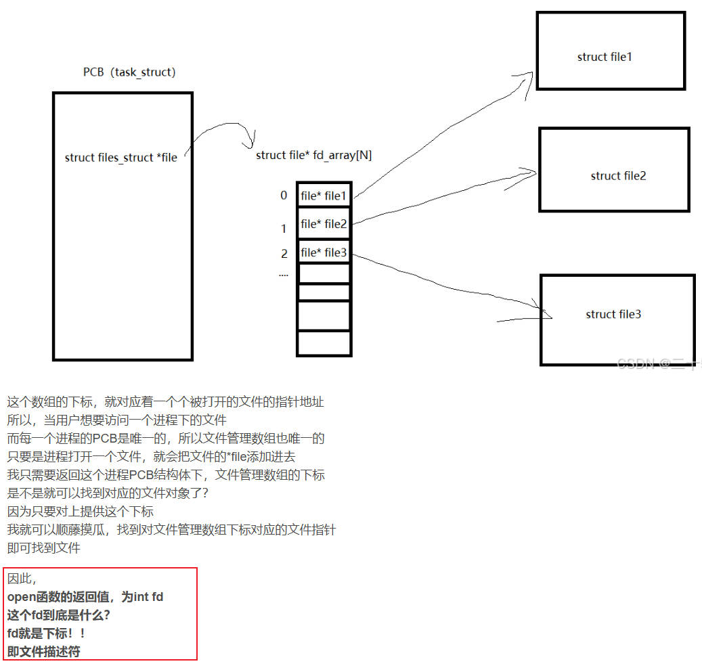

还有个问题：既然`fd_array[]`数组的默认大小是64，那么进程最多只能打开64个文件吗？

*早期的Linux确实是这样的。但2.6以后的内核都支持动态扩展fdtable表，如果超过了64，fatable会扩大一倍。*

### 4.4 文件读写`ops`映射

我们调用`open()`打开文件得到`fd`后，读写文件`read()`、`write()`就会执行`struct file`结构体中的`f_op`函数操作集中的函数指针，来实现对文件的读写。

1. 设备文件：如果文件类型的字符设备文件，`f_op`中的`read`、`write`最终会调用到我们的设备驱动
2. 磁盘文件：如果文件类型是磁盘文件，`f_op`中的`read`、`write`最终会调用到文件系统的读写接口

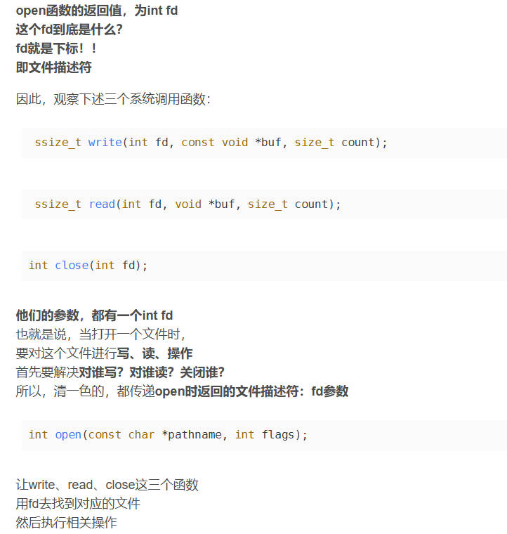

以读写磁盘文件为例：

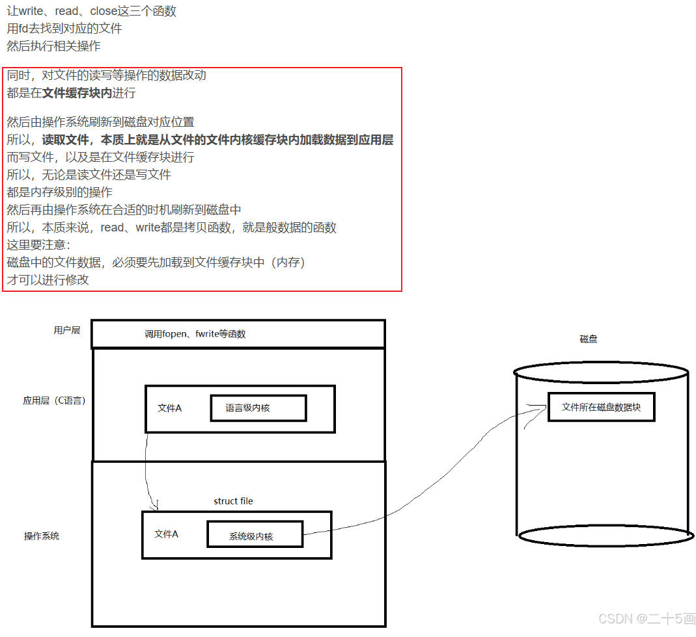

### 4.5 文件操作

前面其实已经介绍了文件描述符的原理。我们来系统的整理一下流程。

#### 4.5.1 打开文件

所以，当open一个文件时，到底在干什么？

1. 创建`file文件结构体`
2. 开辟文件缓存区的空间，加载文件数据（从磁盘中加载，有可能延后）
3. 查看进程的`文件描述符表`
4. 将`file`文件地址，填入对应的表下标中
5. 返回下标，即`fd`

#### 4.5.2 标准输入、输出、错误

当我们理解了上述的陈述之后，我们再接着来理解这三个东西：

0. 标注输入 键盘
1. 标准输出 显示器
2. 标准错误 显示器

当我们打开进程下面只有一个文件时，我们查看该文件的fd，按理来说，一个进程下只有一个我们创建的文件，因此，进程的文件描述符号表对应的，只有一个文件，数组中文件的下标应为0，所以文件的fd应该是0，但是实际上却不是，而是3。

所以，为什么是3呢？也就是说前面还有0、1、2三个文件，这三个文件是什么？

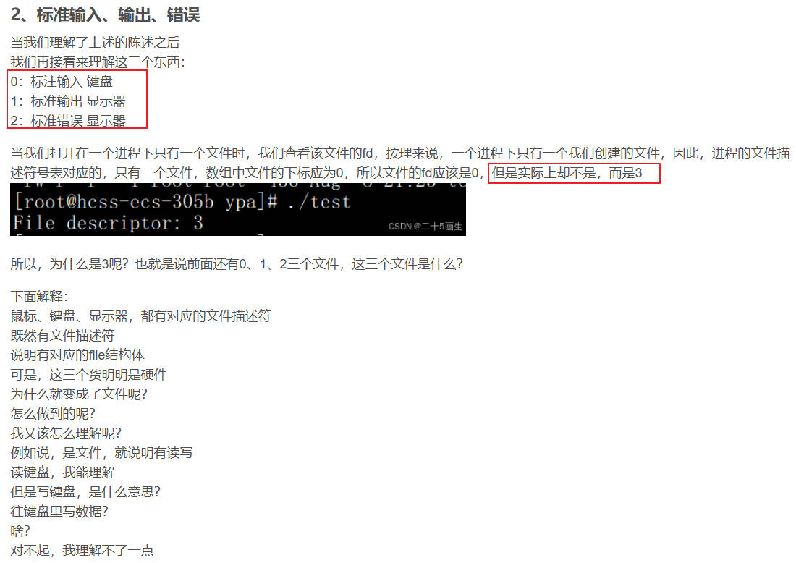

对于我们理解来说，标准输入、输出、错误也是文件啊，创建进程时Linux就会创建这3个文件，描述符0~2。标准输入输出错误对应着硬件：键盘、显示器、显示器。接下来是非常重要的概念：

***硬件，也是文件。对于每一个硬件：我们关注2点：属性和操作方法。***

**硬件属性`struct device`**

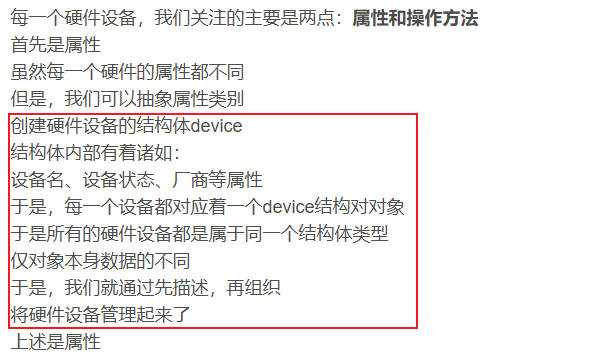

**硬件操作方法**

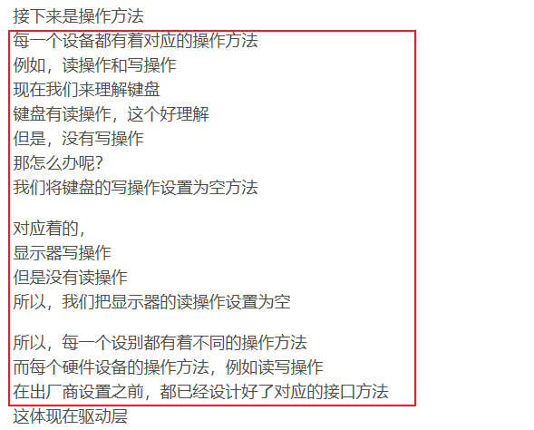

**设备文件函数指针`f_op`，对硬件操作方法的封装**

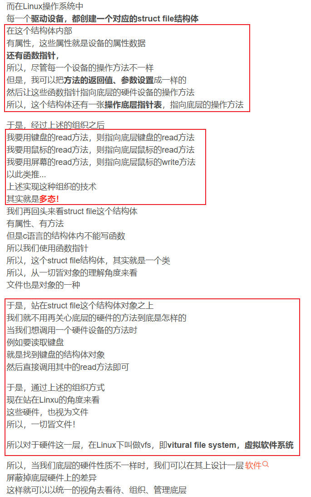

## 第5章 IO多路复用`select`

IO多路复用比较复杂。我们先详细分析`select`，把这个搞清楚之后，再去分析`poll`和`epoll`。

```c
#include <sys/select.h>
#include <sys/time.h>

#undef __FD_SETSIZE
#define __FD_SETSIZE	1024

typedef struct {
	unsigned long fds_bits[__FD_SETSIZE / (8 * sizeof(long))];
} fd_set;

struct timeval {
	long    tv_sec;		/* seconds */
	long	tv_usec;	/* microseconds */
};

int select(
    int nfds,                 // 监控的最大文件描述符 + 1（FD范围：0~nfds-1）
    fd_set *readfds,          // 监控可读事件的FD集合
    fd_set *writefds,         // 监控可写事件的FD集合
    fd_set *exceptfds,        // 监控异常事件的FD集合
    struct timeval *timeout   // 超时时间（NULL表示永久阻塞）
);
```

### 5.1 `fd_set`接口

#### 5.1.1 `fd_set`原型

`fd_set`的本质是一个位图(bitmap)，即位数组，每个位对应一个文件描述符。最多支持1024位，所以一个进程最多打开1024个文件。

```c
#define __FD_SETSIZE	1024

typedef struct {
	unsigned long fds_bits[__FD_SETSIZE / (8 * sizeof(long))];
} fd_set;
```

我们看一下这个计算方法：`__FD_SETSIZE / (8 * sizeof(long))`，假设`long`为4字节，这等价于：`1024 / (8 * 4) = 32`。

所以，`fd_set`其实就是一个`unsigned long`类型的数组，数组长度为32。

```c
typedef struct {
	unsigned long fds_bits[32];
} fd_set;
```

**位数组机制：**

1. 若某位为1，表示该文件描述符被加入监控集合
2. 若为0，表示不监控

#### 5.1.2 `fd_set`操作函数

Linux 提供一组宏来操作 fd_set，这些宏在 <sys/select.h> 中定义：

1. `FD_ZERO(fd_set *set)`

    + 作用：初始化 fd_set，将所有位清零

    ```c
    fd_set read_fds;
    FD_ZERO(&read_fds); // 初始化 read_fds，表示暂时不监控任何文件描述符
    ```

2. `FD_SET(int fd, fd_set *set)`

    + 作用：将文件描述符 fd 添加到 set 集合中

    ```c
    FD_SET(socket_fd, &read_fds); // 监控 socket_fd 是否可读
    ```

3. `FD_CLR(int fd, fd_set *set)`

    + 作用：从 set 集合中移除文件描述符 fd

    ```c
    FD_CLR(socket_fd, &read_fds); // 停止监控 socket_fd
    ```

4. `FD_ISSET(int fd, fd_set *set)`

    + 作用：检查 fd 是否在 set 集合中（即对应位是否为 1）

    ```c
    if (FD_ISSET(socket_fd, &read_fds)) {
        // socket_fd 已准备好读取数据
    }
    ```

#### 5.1.3 `fd_set的限制：1024`

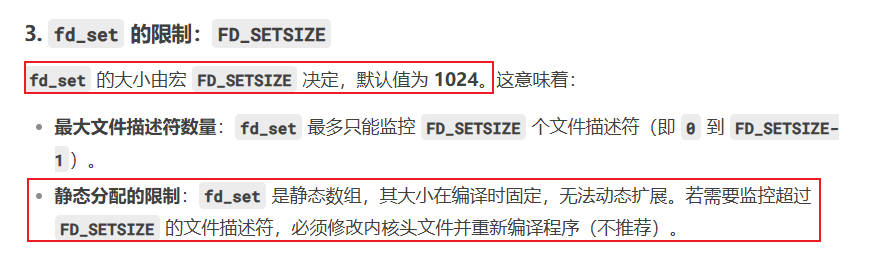

#### 5.1.4 `fd_set 在 select() 中的使用`

`fd_set`主要用在`select()`函数中，用于同时监控多个文件描述符。

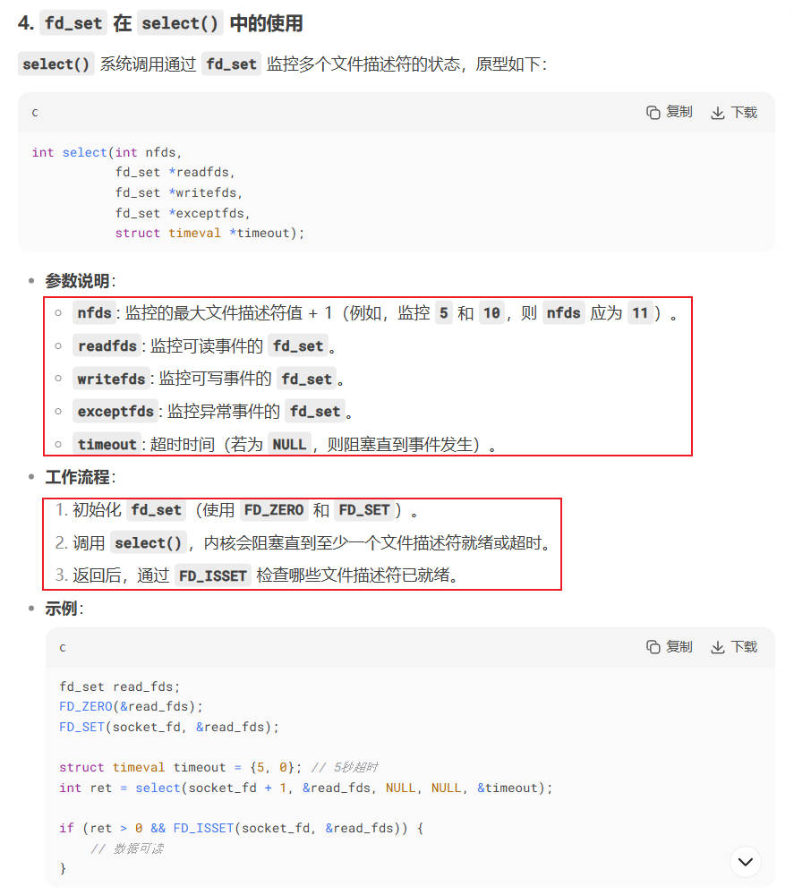

#### 5.1.5 `fd_set的局限性`

`fd_set`虽然很好用，但是性能并不高，尤其是在需要监控很多个文件描述符的情况时。`select()`每次都要遍历所有文件描述符（直到nfds-1），性能低开销大。

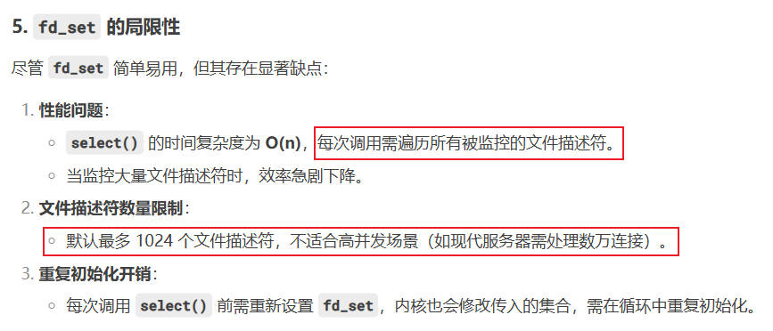

### 5.2 `select`调用过程

#### 5.2.1 `select()`应用程序

要分析`select`原理，我们要从应用程序开始，跟着应用程序一步步进入到内核，看清楚整个过程他是怎么运行的。

```c
#include <stdio.h>
#include <stdlib.h>
#include <fcntl.h>
#include <unistd.h>
#include <sys/select.h>
#include <sys/time.h>

#define BUFFER_SIZE 256

const char* DEV_PATH1 = "/dev/char_device0";  // 第一个设备路径
const char* DEV_PATH2 = "/dev/char_device1";  // 第二个设备路径
const char* DEV_PATH3 = "/dev/char_device2";  // 第三个设备路径

int main() 
{
    int fd1, fd2, fd3;
    fd_set read_fds;
    struct timeval timeout;
    int max_fd, ready_fds;
    char buffer[BUFFER_SIZE];

    // 1. 打开字符设备文件
    fd1 = open(DEV_PATH1, O_RDONLY);
    fd2 = open(DEV_PATH2, O_RDONLY);
    fd3 = open(DEV_PATH3, O_RDONLY);

    if (fd1 < 0) {
        perror("open device1 failed");
        return -1;
    }
    if (fd2 < 0) {
        perror("open device2 failed");
        return -1;
    }
    if (fd3 < 0) {
        perror("open device3 failed");
        return -1;
    }

    // 2. 确定最大文件描述符
    max_fd = fd1;
    if (fd2 > max_fd) max_fd = fd2;
    if (fd3 > max_fd) max_fd = fd3;

    // 3. select事件循环
    while (1) {
        // 设置位图bitmap
        FD_ZERO(&read_fds);
        FD_SET(fd1, &read_fds);
        FD_SET(fd2, &read_fds);
        FD_SET(fd3, &read_fds);

        // 设置5秒超时
        timeout.tv_sec = 5;
        timeout.tv_usec = 0;

        ready_fds = select(max_fd + 1, &read_fds, NULL, NULL, &timeout);
        if (ready_fds == -1) {
            perror("select error");
            break;
        } else if (ready_fds == 0) {
            printf("Select timeout (5 seconds)\n");
            continue;
        }

        // 检查第一个设备
        if (FD_ISSET(fd1, &read_fds)) {
            ssize_t bytes = read(fd1, buffer, BUFFER_SIZE - 1);
            if (bytes > 0) {
                buffer[bytes] = '\0';
                printf("Device 1: %s\n", buffer);
            } else if (bytes == 0) {
                printf("Device 1 closed\n");
                break;
            } else {
                perror("Read from device 1 failed");
            }
        }
        // 检查第二个设备
        if (FD_ISSET(fd2, &read_fds)) {
            ssize_t bytes = read(fd2, buffer, BUFFER_SIZE - 1);
            if (bytes > 0) {
                buffer[bytes] = '\0';
                printf("Device 2: %s\n", buffer);
            } else if (bytes == 0) {
                printf("Device 2 closed\n");
                break;
            } else {
                perror("Read from device 2 failed");
            }
        }
        // 检查第三个设备
        if (FD_ISSET(fd3, &read_fds)) {
            ssize_t bytes = read(fd3, buffer, BUFFER_SIZE - 1);
            if (bytes > 0) {
                buffer[bytes] = '\0';
                printf("Device 3: %s\n", buffer);
            } else if (bytes == 0) {
                printf("Device 3 closed\n");
                break;
            } else {
                perror("Read from device 3 failed");
            }
        }
    }

    close(fd1);
    close(fd2);
    close(fd3);
    printf("Program exited cleanly\n");
    return 0;
}
```

#### 5.2.2 `select`调用`sys_select`系统调用

`select`调用过程分析：

```c
FD_ZERO(&read_fds);
FD_SET(fd1, &read_fds);
FD_SET(fd2, &read_fds);
FD_SET(fd3, &read_fds);

// 设置5秒超时
timeout.tv_sec = 5;
timeout.tv_usec = 0;

ready_fds = select(max_fd + 1, &read_fds, NULL, NULL, &timeout);
```

#### 5.2.3 `sys_select()`调用`core_sys_select()`内核函数

`sys_select()`系统调用做了以下事情：

1. 用户态的`timeout`，安全复制到内核态，然后把超时参数转换成内核时间格式`end_time`，保存在`to`指针
2. 调用内核函数`core_sys_select`：真正执行`select`逻辑

```c
long sys_select(int n/*max_fd + 1*/, fd_set __user *inp/*read_fds*/, fd_set __user *outp/*NULL*/,
			fd_set __user *exp/*NULL*/, struct timeval __user *tvp/*timeout*/)
{
    struct timespec end_time, *to = NULL;
	struct timeval tv;
	int ret;

	if (tvp) {
		if (copy_from_user(&tv, tvp, sizeof(tv)))
			return -EFAULT;

		to = &end_time;
		if (poll_select_set_timeout(to,
				tv.tv_sec + (tv.tv_usec / USEC_PER_SEC),
				(tv.tv_usec % USEC_PER_SEC) * NSEC_PER_USEC))
			return -EINVAL;
	}

	ret = core_sys_select(n, inp, outp, exp, to);
	ret = poll_select_copy_remaining(&end_time, tvp, 1, ret);

	return ret;
}
```

#### 5.2.4 `core_sys_select()`内核函数，调用`do_select()`函数

1. 参数校验与修正：检查传入的文件描述符数量 n，确保不超过进程限制
2. 初始化6个位图指针，输入（in/out/ex）、输出（res_in/res_out/res_ex），指向分配的内存区域的首地址
3. 数据复制：将用户空间的 fd_set 位图复制到内核空间
4. 事件监听：调用 do_select 进行事件轮询
5. 结果回传：将就绪事件的结果位图复制回用户空间

```c
int core_sys_select(int n/*max_fd + 1*/, fd_set __user *inp/*read_fds*/, fd_set __user *outp/*NULL*/,
			   fd_set __user *exp/*NULL*/, struct timespec *end_time/*timeout*/)
{
    fd_set_bits fds;
	void *bits;
	int ret, max_fds;
	unsigned int size;
	struct fdtable *fdt;
	long stack_fds[32]; // 栈缓冲区优化。32这个值与之前每个进程的文件数组fd_array[32]一致，用于默认每个进程默认32个文件描述符

	ret = -EINVAL;
	if (n < 0)
		goto out_nofds;

	// 1. 参数校验与修正：检查传入的文件描述符数量 n，确保不超过进程限制
	rcu_read_lock();
	fdt = files_fdtable(current->files);
	max_fds = fdt->max_fds;
	rcu_read_unlock();
	if (n > max_fds)
		n = max_fds;

	// 2. 我们需要6个位图（in、out、ex、res_in、res_out、res_ex）
	size = FDS_BYTES(n);    // 计算需要的字节数，用于分配内存存放文件描述符集合
	bits = stack_fds;       // 优先使用栈内存，如果不够再动态分配内存

	if (size > sizeof(stack_fds) / 6) {
		// 栈不足时分配堆内存
		ret = -ENOMEM;
		bits = kmalloc(6 * size, GFP_KERNEL);
		if (!bits)
			goto out_nofds;
	}
	fds.in      = bits;     // 初始化6个位图指针，输入（in/out/ex）、输出（res_in/res_out/res_ex），指向分配的内存区域的首地址
	fds.out     = bits +   size;
	fds.ex      = bits + 2*size;
	fds.res_in  = bits + 3*size;
	fds.res_out = bits + 4*size;
	fds.res_ex  = bits + 5*size;

    // 3. 从用户空间复制文件描述符集合到内核空间，并初始化结果集为0
	if ((ret = get_fd_set(n, inp, fds.in)) ||
	    (ret = get_fd_set(n, outp, fds.out)) ||
	    (ret = get_fd_set(n, exp, fds.ex)))
		goto out;
	zero_fd_set(n, fds.res_in);
	zero_fd_set(n, fds.res_out);
	zero_fd_set(n, fds.res_ex);

    // 4. 调用do_select执行实际的文件描述符选择操作，并等待就绪事件
    // do_select 遍历所有文件描述符，调用 vfs_poll 检查事件状态，并阻塞等待事件或超时
	ret = do_select(n, &fds, end_time);

	if (ret < 0)
		goto out;
	if (!ret) {
		ret = -ERESTARTNOHAND;
		if (signal_pending(current))
			goto out;
		ret = 0;
	}

    // 5. 通过 copy_to_user 将结果位图（res_in 等）回传用户空间
    // 大量用户-内核数据拷贝是 select 效率低下的主要原因
	if (set_fd_set(n, inp, fds.res_in) ||
	    set_fd_set(n, outp, fds.res_out) ||
	    set_fd_set(n, exp, fds.res_ex))
		ret = -EFAULT;

out:
	if (bits != stack_fds)
		kfree(bits);
out_nofds:
	return ret;
}
```

#### 5.2.5 `do_select()`内核函数的原理介绍

##### 5.2.5.1 初步理解

在上一个函数`core_sys_select()`中，调用了`do_select()`内核函数。我们可以先试想一下，`do_select`函数要做什么，再去分析他的源码。

```c
core_sys_select()
{
    if ((ret = get_fd_set(n, inp, fds.in)) ||
	    (ret = get_fd_set(n, outp, fds.out)) ||
	    (ret = get_fd_set(n, exp, fds.ex)))
		goto out;
	zero_fd_set(n, fds.res_in);
	zero_fd_set(n, fds.res_out);
	zero_fd_set(n, fds.res_ex);

    // 关键函数：执行do_select
    ret = do_select(n, &fds, end_time);
    return ret;
}
```

1. 参数`n`：这是由空户空间传入的，要监控的最大的文件描述符

    + 为什么要传入这个？为了提高内核效率。我们只需要从0开始遍历到n，而不是便利所有文件描述符

2. 参数`fds`：包括6个参数：输入3个(in、out、execept)拷贝于用户空间，输出3个(in、out、execept)是已经就绪的文件位图

    + 我们的`do_select()`函数，要把就绪的文件描述符，设置给3个输出位图(in、out、execept)

3. 参数`end_time`：用户空间设置的等待超时

    + 当用户调用`select()`函数时，`do_select()`函数从0~n把所有文件描述符检查一遍。有就绪的就要立即返回，没有准备好的，执行可被唤醒的进程休眠。此时用户进程阻塞挂起
    + 休眠最终一定会醒来，我们要看是什么原因唤醒的。如果是被等待队列唤醒，OK，这说明有文件描述符`fd`就绪了，我们要执行上一步的操作，检查现在有哪些就绪的。每匹配一个计数值+1，全部遍历完返回计数值，这就是我们要的select返回值
    + 如果是超时时间到了唤醒的，说明等待的时间一直没有准备就绪的文件描述符，我们要返回计数值0

4. 返回值`ret`：这就是`do_select()`函数遍历0~n，统计的准备就绪的文件描述符个数

##### 5.2.5.2 核心机制

在Linux内核的`do_select函数中，`当所有文件描述符（fd）未就绪时进程会进入休眠，被唤醒后必须重新遍历所有fd并再次调用poll_wait检查`。

这一行为是设计上的必然要求，原因如下：

1. 等待队列的临时注册

    + poll_wait的瞬时性：*poll_wait的作用是将当前进程注册到文件的等待队列（通过poll_table_entry），但这种注册是单次生效的。当进程被唤醒后，内核会自动清理所有关联的等待队列条目（poll_table_entry），进程需要重新调用poll_wait才能再次监听文件事件。*

    +  类比场景：*类似于订阅杂志——每次收到一期杂志后，若想继续接收下一期，必须重新订阅。内核不会自动保留订阅状态。*

2. 文件状态动态变化

    + 事件可能随时发生：*进程休眠期间，可能有多个 fd 的状态发生变化。例如：A 事件唤醒进程：进程因 fd A 就绪被唤醒，但休眠期间 fd B 也可能变为就绪。*
    + 必须重新检查：*为确保不遗漏任何新事件，需重新遍历所有 fd，调用 vfs_poll 获取最新状态（包括重新注册等待队列）。*
    + **这就是为什么，我们在字符设备的f_ops->poll函数中，要调用poll_wait的原因。因为要重新注册等待队列啊，poll_wait就是用来注册等待队列的。**

3. 水平触发语义

    + 设计原则：*select/poll 是水平触发的，只要 fd 处于就绪状态，调用就会立即返回。例如：如果一个socket可读，但用户未读取所有数据，下一次select仍会报告它可读。*
    + 依赖最新状态：*必须每次重新检查所有 fd 的当前状态，而不能依赖历史注册信息，否则可能返回过时的结果。*

##### 5.2.5.3 内核代码验证

下面是`do_select()`的原理（代码做了简化）：

1. 外层无限循环（for (;;)）：`进程被唤醒后，必须重新进入循环，再次遍历所有 fd，确保获取最新状态。`
2. vfs_poll 的重新调用：`每次调用 vfs_poll 时，若文件未就绪，会通过 poll_wait 重新注册等待队列。`

```c
retval = 0;
for (;;) {
    // 每次循环都会重新遍历所有 fd
    for (i = 0; i < n; i++) {
        struct fd f = fdget(i);
        if (f.file) {
            mask = vfs_poll(f.file, &wait); // 内部调用 poll_wait
            if (mask & ...) {
                retval++; // 记录就绪事件
            }
        }
    }

    // 退出条件：有事件、超时或信号中断
    if (retval || timed_out || signal_pending(current))
        break;

    // 无事件时休眠
    if (!poll_schedule_timeout(&table, TASK_INTERRUPTIBLE, timeout, slack))
        timed_out = 1;
}
```

##### 5.2.5.4 性能影响与优化对比

`select/poll`的性能瓶颈：

1. 时间复杂度 O(n)：每次唤醒后需遍历所有`fd`，对于大并发场景（如数万连接），遍历开销成为瓶颈
2. 重复注册等待队列：频繁调用`poll_wait`和内存分配（poll_table_entry）增加`CPU`和内存压力

这是`select/poll`在大规模高并发场景下性能低下的根本原因，而`epoll`通过持久化注册和事件反馈机制解决了这一问题。若需高性能`I/O`多路复用，应优先选择`epoll`。

#### 5.2.6 `do_select()`内核函数的源码分析

```c
int do_select(int n, fd_set_bits *fds, struct timespec *end_time)
{
	ktime_t expire, *to = NULL;
	struct poll_wqueues table;
	poll_table *wait;
	int retval, i, timed_out = 0;
	unsigned long slack = 0;
	unsigned int busy_flag = net_busy_loop_on() ? POLL_BUSY_LOOP : 0;
	unsigned long busy_end = 0;

	rcu_read_lock();
	retval = max_select_fd(n, fds);
	rcu_read_unlock();

	if (retval < 0)
		return retval;
	n = retval;

	poll_initwait(&table);
	wait = &table.pt;
	if (end_time && !end_time->tv_sec && !end_time->tv_nsec) {
		wait->_qproc = NULL;
		timed_out = 1;
	}

	if (end_time && !timed_out)
		slack = select_estimate_accuracy(end_time);

	retval = 0;
	for (;;) {
		unsigned long *rinp, *routp, *rexp, *inp, *outp, *exp;
		bool can_busy_loop = false;

		inp = fds->in; outp = fds->out; exp = fds->ex;
		rinp = fds->res_in; routp = fds->res_out; rexp = fds->res_ex;

		for (i = 0; i < n; ++rinp, ++routp, ++rexp) {
			unsigned long in, out, ex, all_bits, bit = 1, mask, j;
			unsigned long res_in = 0, res_out = 0, res_ex = 0;

			in = *inp++; out = *outp++; ex = *exp++;
			all_bits = in | out | ex;
			if (all_bits == 0) {
				i += BITS_PER_LONG;
				continue;
			}

			for (j = 0; j < BITS_PER_LONG; ++j, ++i, bit <<= 1) {
				struct fd f;
				if (i >= n)
					break;
				if (!(bit & all_bits))
					continue;
				f = fdget(i);
				if (f.file) {
					const struct file_operations *f_op;
					f_op = f.file->f_op;
					mask = DEFAULT_POLLMASK;
					if (f_op->poll) {
						wait_key_set(wait, in, out,
							     bit, busy_flag);
						mask = (*f_op->poll)(f.file, wait);
					}
					fdput(f);
					if ((mask & POLLIN_SET) && (in & bit)) {
						res_in |= bit;
						retval++;
						wait->_qproc = NULL;
					}
					if ((mask & POLLOUT_SET) && (out & bit)) {
						res_out |= bit;
						retval++;
						wait->_qproc = NULL;
					}
					if ((mask & POLLEX_SET) && (ex & bit)) {
						res_ex |= bit;
						retval++;
						wait->_qproc = NULL;
					}
					/* got something, stop busy polling */
					if (retval) {
						can_busy_loop = false;
						busy_flag = 0;

					/*
					 * only remember a returned
					 * POLL_BUSY_LOOP if we asked for it
					 */
					} else if (busy_flag & mask)
						can_busy_loop = true;

				}
			}
			if (res_in)
				*rinp = res_in;
			if (res_out)
				*routp = res_out;
			if (res_ex)
				*rexp = res_ex;
			cond_resched();
		}
		wait->_qproc = NULL;
		if (retval || timed_out || signal_pending(current))
			break;
		if (table.error) {
			retval = table.error;
			break;
		}

		/* only if found POLL_BUSY_LOOP sockets && not out of time */
		if (can_busy_loop && !need_resched()) {
			if (!busy_end) {
				busy_end = busy_loop_end_time();
				continue;
			}
			if (!busy_loop_timeout(busy_end))
				continue;
		}
		busy_flag = 0;

		/*
		 * If this is the first loop and we have a timeout
		 * given, then we convert to ktime_t and set the to
		 * pointer to the expiry value.
		 */
		if (end_time && !to) {
			expire = timespec_to_ktime(*end_time);
			to = &expire;
		}

		if (!poll_schedule_timeout(&table, TASK_INTERRUPTIBLE,
					   to, slack))
			timed_out = 1;
	}

	poll_freewait(&table);

	return retval;
}
```

##### 5.2.6.1 初始化等待队列

```c
poll_table *wait;
struct poll_wqueues table;

poll_initwait(&table);
wait = &table.pt;
```

我们先来看一下这几个结构体：

**`poll_table结构体`**，轮询表。有2个成员：

1. `_qproc`：函数指针
2. `_key`：用来保存`mask`值

```c
typedef void (*poll_queue_proc)(struct file *, wait_queue_head_t *, struct poll_table_struct *);

typedef struct poll_table_struct {
	poll_queue_proc _qproc;
	unsigned long _key;
} poll_table;
```

**`struct poll_table_entry结构体`**，轮询表条目，每个要监控的`fd`对应着这样一条。有4个成员：

1. `struct file *filp`：我们要监控的文件描述符`fd`，它对应的文件指针`filp`
2. `unsigned long key`：文件`读写就绪`标记位。我们在`do_select()`函数中，不是要检查文件是否`读写就绪`吗？就是检查这个标记位了
3. `wait_queue_t wait`：等待队列项。这是一个变量而不是指针，这很好理解，每个文件描述符`fd`都需要一个队列项，用于添加到等待队列中进入休眠
4. `wait_queue_head_t *wait_address`：等待队列头。这是一个指针，意味着等待队列头是由外部传入的，这很好理解，我们检测了多个等待队列项，但只需要一个等待队列头，然后把这些等待队列项添加进去
    + 等待队列头是一个指针，指向了等待队列头。这个由谁来设置？**后面我们会看到，由我们自己在字符设备驱动框架的`.poll`中设置**

```c
struct poll_table_entry {
	struct file *filp;
	unsigned long key;
	wait_queue_t wait;
	wait_queue_head_t *wait_address;
};
```

**struct poll_wqueues结构体**，轮询等待队列。关键成员变量介绍：

1. `poll_table pt`：就是`poll_table`结构体
2. `struct task_struct *polling_task`：调用select/poll接口的进程，通常为`current`
3. `int inline_index`：当前使用poll监控的文件描述符`fd`个数
4. `struct poll_table_entry inline_entries[N_INLINE_POLL_ENTRIES]`：轮询表数组。我们所有要监控的`文件描述符fd`相关信息，都保存在这个数组中

```c
struct poll_wqueues {
	poll_table pt;  // 轮询表
	struct poll_table_page *table;
	struct task_struct *polling_task;
	int triggered;
	int error;
	int inline_index;
	struct poll_table_entry inline_entries[N_INLINE_POLL_ENTRIES];
};
```

**`poll_initwait(&table)`函数，就是初始化了轮询等待队列，然后把轮询表的函数指针设为`__pollwait()`函数**

```c
static void __pollwait(struct file *filp, wait_queue_head_t *wait_address,
				poll_table *p)
{
	struct poll_wqueues *pwq = container_of(p, struct poll_wqueues, pt);
	struct poll_table_entry *entry = poll_get_entry(pwq);
	if (!entry)
		return;
	entry->filp = get_file(filp);
	entry->wait_address = wait_address;
	entry->key = p->_key;
	init_waitqueue_func_entry(&entry->wait, pollwake);
	entry->wait.private = pwq;
	add_wait_queue(wait_address, &entry->wait);
}

void poll_initwait(struct poll_wqueues *pwq)
{
    pwq->pt._qproc = __pollwait;    // 设置poll_table的函数指针为__pollwait
    pwq->pt._key = 0;               // 设置poll_table的mask初始值为0

	pwq->polling_task = current;
	pwq->triggered = 0;
	pwq->error = 0;
	pwq->table = NULL;
	pwq->inline_index = 0;
}
```

**`__pollwait()`函数分析**

`__pollwait()`现在是函数指针了。他做了以下事情：

1. 把文件指针`filp`设置给`轮询表项`。文件指针的入参是谁给的？后面将会看到，是`do_select()`遍历要监控的fd时，取出来的文件指针
2. 把等待队列头`wait_address`设置给`轮询表项`。这个入参是谁给的？是我们的驱动程序给的。驱动程序中定义等待队列头，然后通过`.poll`传给`__pollwait()`函数

    + 驱动程序示例：驱动程序中调用了`poll_wait()`函数

    ```c
    // 等待队列头
    static wait_queue_head_t button_wait_queue;
    // 事件标志
    static volatile int button_event = 0;

    // poll 方法实现
    static unsigned int button_poll(struct file *filp, poll_table *wait) {
        unsigned int mask = 0;

        poll_wait(filp, &button_wait_queue, wait);

        if (button_event) {
            mask |= POLLIN | POLLRDNORM;
            button_event = 0;
        }

        return mask;
    }

    // 设置文件操作方法
    fops.poll = button_poll;
    fops.open = button_open;
    fops.release = button_release;
    fops.read = button_read;
    ```

    + `poll_wait()`函数原型：正好就是调用了我们注册的回调函数指针`__pollwait()`

    ```c
    static inline void poll_wait(struct file * filp, wait_queue_head_t * wait_address, poll_table *p)
    {
        if (p && p->_qproc && wait_address)
            p->_qproc(filp, wait_address, p);
    }
    ```

3. 函数调用流程分析：假设我们现在要监控一个文件描述符`fd`了，看看源码

    + **do_select函数**：根据文件描述符`fd`，获取到文件指针`f.file`。把文件指针`f.file`作为第1个参数，变量轮询表wait（包含了__pollwait函数指针）作为第2个参数，调用了设备驱动的`poll方法`，返回值放在mask变量中

        ```c
        struct poll_wqueues table;

        poll_initwait(&table);
	    poll_table *wait = &table.pt;

        f = fdget(fd);
        if (f.file) {
            const struct file_operations *f_op;
            f_op = f.file->f_op;
            if (f_op->poll) {
                mask = (*f_op->poll)(f.file, wait);
            }
        }
        ```

    + **设备驱动程序的poll方法**：最终调用`__pollwait()`函数，添加到我们自己的等待队列，然后返回mask

        ```c
        static unsigned int button_poll(struct file *filp, poll_table *wait) {
        unsigned int mask = 0;

            // poll_wait就是调用函数指针，等价于__pollwait(filp，&button_wait_queue, wait)
            poll_wait(filp, &button_wait_queue, wait);

            if (button_event) {
                mask |= POLLIN | POLLRDNORM;
                button_event = 0;
            }

            return mask;
        }
        ```

    + **`__pollwait()函数`**：把`do_select`提供的`filp`和`poll_table`，以及`设备驱动poll方法`提供的的`等待队列头`，组合起来。最终效果是，把等待项添加到设备驱动的等待队列头中。注意：只是添加到等待队列，这并不会因此阻塞。只有当队列条件不满足，且执行`schedu()`触发进程调度时，才会阻塞

        ```c
        static void __pollwait(struct file *filp, wait_queue_head_t *wait_address, poll_table *p)
        {
            struct poll_wqueues *pwq = container_of(p, struct poll_wqueues, pt);
            struct poll_table_entry *entry = poll_get_entry(pwq);
            if (!entry)
                return;
            entry->filp = get_file(filp);
            entry->wait_address = wait_address;
            entry->key = p->_key;
            init_waitqueue_func_entry(&entry->wait, pollwake);
            entry->wait.private = pwq;
            add_wait_queue(wait_address, &entry->wait);
        }
        ```

##### 5.2.6.2 遍历输入文件描述符

1. 参数参数`n`：要监控的最大文件描述符
2. `inp = fds->in; outp = fds->out; exp = fds->ex;`：指向输入的文件描述符集合
3. 为提高效率，一次处理32位，即一次最多监控32个文件描述符。如果当前处理的这32位中没有要监控的文件描述符，则跳过，继续下一个32位。否则，遍历这32位中的每一个文件描述符

    ```c
    in = *inp++; out = *outp++; ex = *exp++;
    all_bits = in | out | ex;
    if (all_bits == 0) {
        i += BITS_PER_LONG; // 32
        continue;
    }
    ```

4. 当前遍历这轮32个文件描述符，有需要监控的对象。对当前32位中的每一个文件描述符，调用`fdget()`获取到文件指针。然后调用文件的poll方法，并把结果放到mask变量中

    + `mask = (*f_op->poll)(f.file, wait)`：`poll`就是设备驱动提供的poll方法，wait就是`do_select`定义的轮询表，这里直接进入了设备驱动。返回值`mask`由设备驱动提供
    + 根据`mask`判断，输入`POLLIN_SET`，输出`POLLOUT_SET`，异常`POLLEX_SET`，是否设置了对应位，来判断当前监控的文件描述符是否准备好
    + 如果准备好了，就把对应的位设置到`res_in/out/ex`中。并把返回值加1，标识有文件描述符准备好了

    ```c
    for (j = 0; j < BITS_PER_LONG/*32*/; ++j, ++i, bit <<= 1) {
        struct fd f;
        if (i >= n)
            break;
        if (!(bit & all_bits))
            continue;
        f = fdget(i);
        if (f.file) {
            const struct file_operations *f_op;
            f_op = f.file->f_op;
            mask = DEFAULT_POLLMASK;
            if (f_op->poll) {
                wait_key_set(wait, in, out, bit, busy_flag);
                mask = (*f_op->poll)(f.file, wait);
            }
            if ((mask & POLLIN_SET) && (in & bit)) {
                res_in |= bit;
                retval++;
                wait->_qproc = NULL;
            }
            if ((mask & POLLOUT_SET) && (out & bit)) {
                res_out |= bit;
                retval++;
                wait->_qproc = NULL;
            }
            if ((mask & POLLEX_SET) && (ex & bit)) {
                res_ex |= bit;
                retval++;
                wait->_qproc = NULL;
            }
        }
    }
    if (res_in)
        *rinp = res_in;
    if (res_out)
        *routp = res_out;
    if (res_ex)
        *rexp = res_ex;
    ```

5. 如果所有的文件描述符都没有准备好，`poll_schedule_timeout()`会被调用，进入阻塞状态。超时时间设为应用程序给的`timeout`，并且可以被信号打断
6. 如果休眠被打断了，说明有文件描述准备好了。此时又重新执行`for (;;)`循环，把所有检测的文件描述符再重新监测一遍，返回准备好的文件描述符，并返回`>0`的值

    ```c
    for (;;) {
        unsigned long *rinp, *routp, *rexp, *inp, *outp, *exp;
        bool can_busy_loop = false;

        inp = fds->in; outp = fds->out; exp = fds->ex;
        rinp = fds->res_in; routp = fds->res_out; rexp = fds->res_ex;

        for (i = 0; i < n; ++rinp, ++routp, ++rexp) {
            for (j = 0; j < BITS_PER_LONG; ++j, ++i, bit <<= 1) {
                f = fdget(i);
                if (f.file) {
                    const struct file_operations *f_op;
                    f_op = f.file->f_op;
                    if (f_op->poll) {
                        wait_key_set(wait, in, out,
                                    bit, busy_flag);
                        mask = (*f_op->poll)(f.file, wait);
                    }
                    fdput(f);
                    if ((mask & POLLIN_SET) && (in & bit)) {
                        res_in |= bit;
                        retval++;
                        wait->_qproc = NULL;
                    }
                    if ((mask & POLLOUT_SET) && (out & bit)) {
                        // 
                    }
                    if ((mask & POLLEX_SET) && (ex & bit)) {
                        //
                    }
                }
            }
            if (res_in)
                *rinp = res_in;
            if (res_out)
                *routp = res_out;
            if (res_ex)
                *rexp = res_ex;
        }
        to = &expire;
        if (!poll_schedule_timeout(&table, TASK_INTERRUPTIBLE,
                        to, slack))
            timed_out = 1;
    }
    ```

### 5.3 驱动程序应该怎么写

#### 5.3.1 `poll`方法的设备驱动框架

整个`do_select`函数，通过`mask = (*f_op->poll)(f.file, wait)`调用设备驱动程序。

因此，`poll`的设备驱动框架如下：

1. 设备结构体中，定义读写的等待队列头

    ```c
    // 设备私有结构体
    struct my_dev {
        struct cdev cdev;
        wait_queue_head_t rwq;   // 读等待队列
        wait_queue_head_t wwq;   // 写等待队列
        char buf[512];
        int buf_len;
        spinlock_t lock;
    };
    ```

2. `module_init`中，初始化等待队列头

    ```c
    // 模块初始化
    static int __init my_dev_init(void)
    {
        dev_t devno = MKDEV(MAJOR_NUM, 0);
        int ret;

        // 注册字符设备
        ret = register_chrdev_region(devno, 1, DEV_NAME);
        if (ret < 0) {
            return ret;
        }

        // 初始化cdev
        cdev_init(&g_dev.cdev, &my_fops);
        g_dev.cdev.owner = THIS_MODULE;
        ret = cdev_add(&g_dev.cdev, devno, 1);
        if (ret < 0) {
            unregister_chrdev_region(devno, 1);
            return ret;
        }

        // 初始化等待队列和锁
        init_waitqueue_head(&g_dev.rwq);
        init_waitqueue_head(&g_dev.wwq);
        spin_lock_init(&g_dev.lock);
        g_dev.buf_len = 0;

        return 0;
    }
    ```

3. 设备驱动的`poll`方法，调用`poll_wait(filp, &等待队列头, wait)`函数，把读写的等待队列头传给`poll_wait`函数。接下来`poll_wait`就会创建等待项，并把等待项添加到我们设置的等待队列头中
4. 检查设备驱动的读写缓冲区设备准备好，即文件描述符是否准备好。如果就绪，设置对应的`mask`，并返回结果。这个结果就是select/poll函数返回给用户空间的值

    + `设备驱动poll方法`，调用`poll_wait`函数，把等待队列头传给`poll_wait`函数
    + 如果当前可读，设置`mask |= POLLIN | POLLRDNORM`
    + 如果当前可写，设置`mask |= POLLOUT | POLLWRNORM`
    + 返回`mask`值，即文件描述符是否准备好

    ```c
    // poll方法（关键）
    static unsigned int my_poll(struct file *filp, struct poll_table_struct *wait)
    {
        struct my_dev *dev = filp->private_data;
        unsigned int mask = 0;

        // 注册等待队列
        poll_wait(filp, &dev->rwq, wait);
        poll_wait(filp, &dev->wwq, wait);

        // 检查可读/可写状态
        spin_lock(&dev->lock);
        if (dev->buf_len > 0) {
            mask |= POLLIN | POLLRDNORM;  // 可读
        }
        if (dev->buf_len < sizeof(dev->buf)) {
            mask |= POLLOUT | POLLWRNORM; // 可写
        }
        spin_unlock(&dev->lock);

        return mask;
    }
    ```

5. 设备驱动的`read/write`方法，如果有读/写数据准备好了，调用`wake_up_interruptible`唤醒等待队列。此时，我们预期`poll`方法会返回`>0`的值，即文件描述符准备好。进一步的，select/poll函数会返回`>0`的值，即文件描述符准备好

    ```c
    // 读操作
    static ssize_t my_read(struct file *filp, char __user *ubuf, size_t count, loff_t *off)
    {
        struct my_dev *dev = filp->private_data;
        int ret, len;

        // 等待数据可读（若缓冲区为空，阻塞）
        wait_event_interruptible(dev->rwq, dev->buf_len > 0);

        spin_lock(&dev->lock);
        len = min(count, (size_t)dev->buf_len);
        ret = copy_to_user(ubuf, dev->buf, len);
        if (ret) {
            spin_unlock(&dev->lock);
            return -EFAULT;
        }
        // 移动缓冲区数据（模拟环形缓冲区，简化处理）
        memmove(dev->buf, dev->buf + len, dev->buf_len - len);
        dev->buf_len -= len;
        spin_unlock(&dev->lock);

        // 唤醒写等待队列（空间释放后，允许继续写）
        wake_up_interruptible(&dev->wwq);
        return len;
    }

    // 写操作
    static ssize_t my_write(struct file *filp, const char __user *ubuf, size_t count, loff_t *off)
    {
        struct my_dev *dev = filp->private_data;
        int ret, len;

        // 等待空间可写（若缓冲区满，阻塞）
        wait_event_interruptible(dev->wwq, dev->buf_len < sizeof(dev->buf));

        spin_lock(&dev->lock);
        len = min(count, sizeof(dev->buf) - dev->buf_len);
        ret = copy_from_user(dev->buf + dev->buf_len, ubuf, len);
        if (ret) {
            spin_unlock(&dev->lock);
            return -EFAULT;
        }
        dev->buf_len += len;
        spin_unlock(&dev->lock);

        // 唤醒读等待队列（数据到达后，允许读）
        wake_up_interruptible(&dev->rwq);
        return len;
    }
    ```

#### 5.3.2 驱动程序的关键点

`poll`方法中，如果设备可读，设置的mask为`POLLIN | POLLRDNORM`。为什么不是仅``POLLIN`？

1. `POLLIN`：可读
2. `POLLRDNORM`：poll read normal，普通数据可读
3. `POLLOUT`：可写
4. `POLLWRNORM`：poll write normal，普通数据可写

这是Linux内核的规范，`POLLIN | POLLRDNORM`表示普通读操作准备好。如果仅设置``POLLIN`，在某些情况下（如某些特定的文件系统或设备驱动），可能会导致问题。因此，为了兼容性和一致性，推荐同时使用这两个标志。

##### 5.3.2.1 标志位的作用

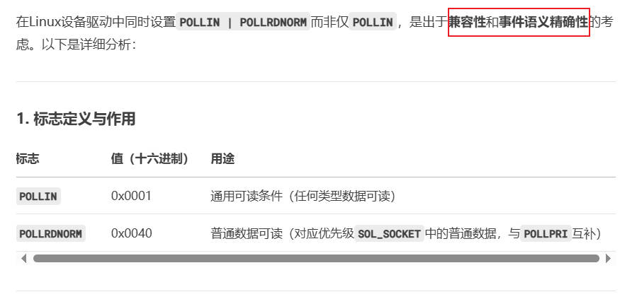

##### 5.3.2.2 `POLLIN | POLLRDNORM`组合使用的原因

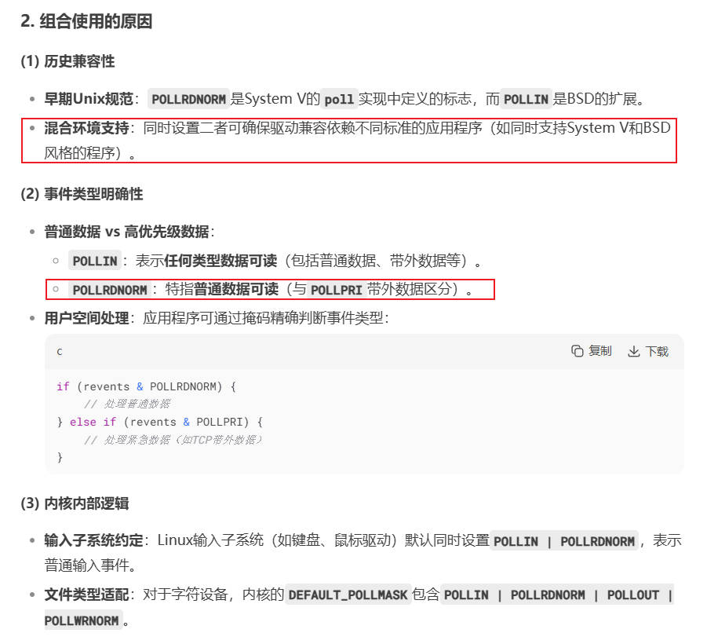

##### 5.3.2.3 代码实现对比

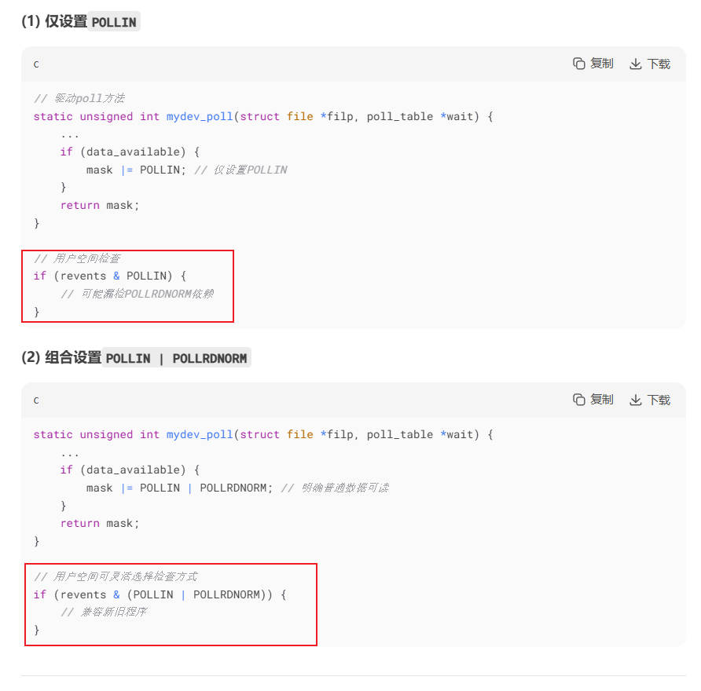

### 5.4 `select`多路复用代码实例

#### 5.4.1 设计原则

我们设计这样一个设备驱动：

1. 支持监控读和写
2. 使用一个缓冲区。不为0就可读，未满就可写
3. 用户程序调用`write`方法写入数据后，`wake`唤醒监控的读`readfds`。用户程序调用`read`方法读走数据后，`wake`唤醒监控的写`writefds`
4. 使用自旋锁，保护缓冲区操作

#### 5.4.2 驱动程序

`select.c`

```c
#include <linux/init.h>     /* module_init */
#include <linux/module.h>   /* MODULE_LICENSE */
#include <linux/types.h>    /* dev_t */
#include <linux/fs.h>       /* alloc_chrdev_region */
#include <linux/cdev.h>     /* cdev_init */
#include <linux/device.h>   /* class_create, device_create */
#include <linux/io.h>
#include <asm/io.h>         /* ioremap */
#include <linux/uaccess.h>
#include <asm/uaccess.h>    /* copy_from_user */
#include <linux/sched.h>
#include <linux/wait.h>
#include <linux/spinlock.h>
#include <linux/poll.h>
#include <linux/kernel.h>

#define PRINTF(fmt, ...)    printk("[KERN] " fmt, ##__VA_ARGS__)

#define DEVICE_NAME     "cdev_test"
#define CLASS_NAME      "cdev_cls"

struct my_dev {
    dev_t dev;
    struct cdev cdev;
    struct device *device;
    struct class  *class;
    wait_queue_head_t rwq;
    wait_queue_head_t wwq;
    char buf[128];
    int  buf_len;
    spinlock_t lock;
};

static struct my_dev s_dev;

static int my_open(struct inode *inode, struct file *filp)
{
    filp->private_data = &s_dev;
    PRINTF("driver open\n");
    return 0;
}

static ssize_t my_read(struct file *filp, char __user *buf , size_t size, loff_t *ppos)
{
    int len;
    struct my_dev *dev = filp->private_data;

    if (filp->f_flags & O_NONBLOCK) {
        spin_lock(&dev->lock);
        if (!dev->buf_len) {
            spin_unlock(&dev->lock);
            return -EAGAIN;
        }
        spin_unlock(&dev->lock);
    }
    else {
        if (wait_event_interruptible(dev->rwq, dev->buf_len > 0)) {
            return -EINTR;
        }
    }

    spin_lock(&dev->lock);
    len = min(size, (size_t)dev->buf_len);
    if (copy_to_user(buf, dev->buf, len)) {
        spin_unlock(&dev->lock);
        return -EFAULT;
    }
    memmove(dev->buf, dev->buf + len, dev->buf_len - len);
    dev->buf_len -= len;
    spin_unlock(&dev->lock);

    wake_up_interruptible(&dev->wwq);   // 读走了数据，缓冲区又有空间了，唤醒 写--等待队列
    return len;
}

static ssize_t my_write(struct file *filp, const char __user *buf, size_t size, loff_t *ppos)
{
    size_t len;
    struct my_dev *dev = filp->private_data;

    if (filp->f_flags & O_NONBLOCK) {
        spin_lock(&dev->lock);
        if (dev->buf_len >= sizeof(dev->buf)) {
            spin_unlock(&dev->lock);
            return -EAGAIN;
        }
        spin_unlock(&dev->lock);
    }
    else {
        if (wait_event_interruptible(dev->wwq, dev->buf_len < sizeof(dev->buf))) {
            return -EINTR;
        }
    }

    spin_lock(&dev->lock);
    len = min(size, sizeof(dev->buf) - dev->buf_len);
    if (copy_from_user(dev->buf + dev->buf_len, buf, len)) {
        spin_unlock(&dev->lock);
        return -EFAULT;
    }
    dev->buf_len += len;
    spin_unlock(&dev->lock);

    wake_up_interruptible(&dev->rwq);   // 写入了数据，缓冲区可读，唤醒 读--等待队列
    return len;
}

static unsigned int my_poll(struct file *filp, struct poll_table_struct *wait)
{
    unsigned int mask = 0;
    struct my_dev *dev = filp->private_data;

    poll_wait(filp, &dev->rwq, wait);
    poll_wait(filp, &dev->wwq, wait);

    spin_lock(&dev->lock);
    if (dev->buf_len > 0) {
        mask |= POLLIN | POLLRDNORM;    // 缓冲区可读，唤醒 读--等待队列
    }
    if (dev->buf_len < sizeof(dev->buf)) {
        mask |= POLLOUT | POLLWRNORM;   // 缓冲区空间未满，唤醒 写--等待队列
    }
    spin_unlock(&dev->lock);

    return mask;
}

static int my_close(struct inode *inode, struct file *filp)
{
    PRINTF("driver close\n");
    return 0;
}

const struct file_operations cdev_fops = {
    .owner   = THIS_MODULE,
    .open    = my_open,
    .read    = my_read,
    .write   = my_write,
    .poll    = my_poll,
    .release = my_close,
};

static int my_dev_init(void)
{
    alloc_chrdev_region(&s_dev.dev, 0, 1, DEVICE_NAME);
    s_dev.class = class_create(THIS_MODULE, CLASS_NAME);
    cdev_init(&s_dev.cdev, &cdev_fops);
    s_dev.cdev.owner = THIS_MODULE;
    cdev_add(&s_dev.cdev, s_dev.dev, 1);
    s_dev.device = device_create(s_dev.class, NULL, s_dev.dev, NULL, DEVICE_NAME);

    init_waitqueue_head(&s_dev.rwq);
    init_waitqueue_head(&s_dev.wwq);
    memset(s_dev.buf, 0, s_dev.buf_len);
    s_dev.buf_len = 0;
    spin_lock_init(&s_dev.lock);

    PRINTF("driver init(major:%d minor:%d)\n", MAJOR(s_dev.dev), MINOR(s_dev.dev));
    return 0;
}

static void my_dev_exit(void)
{
    device_destroy(s_dev.class, s_dev.dev);
    cdev_del(&s_dev.cdev);
    class_destroy(s_dev.class);
    unregister_chrdev_region(s_dev.dev, 1);

    PRINTF("driver exit\n");
}

MODULE_LICENSE("GPL");

module_init(my_dev_init);
module_exit(my_dev_exit);
```

#### 5.4.3 应用测试程序

##### 5.4.3.1 `app.c`

```c
#include <stdio.h>
#include <stdlib.h>
#include <errno.h>
#include <sys/types.h>
#include <sys/stat.h>
#include <sys/time.h>
#include <fcntl.h>
#include <unistd.h>

int main(int argc, char *argv[])
{
    int fd, ret;
    fd_set readfds;
    struct timeval tv;

    if (argc < 2) {
        printf("Usage: ./app /dev/xxx param\n");
        return -EINVAL;
    }
    fd = open(argv[1], O_RDWR | O_NONBLOCK);
    if (fd < 0) {
        printf("Open %s fail:%d\n", argv[1], fd);
        return fd;
    }
   
    while (1) {
        FD_ZERO(&readfds);
        FD_SET(fd, &readfds);

        tv.tv_sec  = 5;
        tv.tv_usec = 0;
        ret = select(fd + 1, &readfds, NULL, NULL, &tv);
        if (ret < 0) {
            printf("select error\n");
            return -1;
        }
        else if (ret == 0) {
            printf("timeout!\n");
            continue;
        }

        if (FD_ISSET(fd, &readfds)) {
            char str[256] = {0};
            ret = read(fd, str, sizeof(str));
            if (ret > 0) {
                printf("Read: %s\n", str);
            }
            else {
                printf("Read error\n");
            }
        }
    }
    
    close(fd);
    return 0;
}
```

##### 5.4.3.2 `write.c`

```c
#include <stdio.h>
#include <stdlib.h>
#include <string.h>
#include <errno.h>
#include <sys/types.h>
#include <sys/stat.h>
#include <sys/time.h>
#include <fcntl.h>
#include <unistd.h>

int main(int argc, char *argv[])
{
    int fd, len, ret;
    char str[256] = {0};

    if (argc < 3) {
        printf("Usage: ./app /dev/xxx string\n");
        return -EINVAL;
    }
    fd = open(argv[1], O_RDWR | O_NONBLOCK);
    if (fd < 0) {
        printf("Open %s fail:%d\n", argv[1], fd);
        return fd;
    }
    strcpy(str, argv[2]);
    len = strlen(str) + 1;
    ret = write(fd, str, len);
    if (ret != len) {
        printf("Write error\n");
    }
    
    close(fd);
    return 0;
}
```

## 第6章 IO多路复用`poll`

前面已经介绍了`select`多路复用，现在来看下`poll`多路复用。

```c
#include <poll.h>

struct pollfd {
    int fd;			    // 要监视的文件描述符
    short int events;   // 请求监视的事件（用户设置），可以用mask设置多个事件位
    short int revents;  // 实际发生的事件（内核返回）
};

typedef unsigned int nfds_t;

int poll(struct pollfd *fds, nfds_t nfds, int timeout);
```

`poll`函数的参数介绍：

1. `struct pollfd *fds`： 指向`pollfd`结构体数组的指针，每个结构体描述一个监控的文件描述符
2. `nfds_t nfds`： `fds`数组元素的个数（监控的文件描述符数量）
3. `int timeout`： 超时时间，单位：毫秒

    + `-1`: 阻塞等待，直到有事件发生
    + `0`: 立即返回，不阻塞
    + `>0`: 等待指定毫秒后超时

### 6.1 `poll`函数参数详细介绍

#### 6.1.1 `struct pollfd`结构体

```c
struct pollfd {
    int fd;			    // 要监视的文件描述符
    short int events;   // 请求监视的事件（用户设置），可以用mask设置多个事件位
    short int revents;  // 实际发生的事件（内核返回）
};
```

例如，我们要监视一个文件描述符`fd`的读写状态：

```c
struct pollfd fds[1];
int fd, ret;

fd = open("/dev/cdev_test", O_RDWR);

fds[0].fd = fd;
fds[0].events = POLLIN | POLLOUT;

ret = poll(fds/*fds数组*/, 1/*数组元素个数为1*/, 5000/*超时时间5000ms*/);
```

#### 6.1.2 `nfds_t nfds`文件描述符个数

`nfds`表示要监视的文件描述符个数，类型为`unsigned int`。

#### 6.1.3 `int timeout`超时

`int timeout`，设置监视的超时，单位为`ms毫秒`。

#### 6.1.4 `struct poll_list`结构体

前面介绍了`struct pollfd`结构体。在Linux内核源码中，`struct poll_list`的典型定义如下：

```c
struct poll_list {
	struct poll_list *next;     // 指向下一个struct poll_list节点的指针
	int len;                    // 当前节点数组中，pollfd元素的个数
	struct pollfd entries[0];   // 柔性数组，存储实际的struct pollfd结构体
};
```

1. `next`指针

    + 作用：将多个`poll_list`节点连接成链表，用于管理大数量的`pollfd`
    + 场景：当用户空间传递的`pollfd`数量（nfds）超过单个`poll_list`节点能容纳的大小时，内核会创建多个`poll_list`节点，通过`next`指针串联，形成链表结构

2. `len`字段

    + 作用：记录当前`entries`数组中实际有效的`pollfd`数量
    + 约束：`len`的最大值由内核内存管理策略决定，通常与页面大小对齐（例如：`PAGE_SIZE / sizeof(struct pollfd)`）

3. `entries[0]`柔性数组

    1. 柔性数组：`C99标准支持的特性，允许结构体的最后一个成员为长度未知的数组`。以下两种写法都是正确的柔性数组写法，具体取决于编译器允许的书写形式

    ```c
    struct S1 {
        int num;
        double d;
        int arr[];  // 柔性数组
    };

    struct S2 {
        int num;
        double d;
        int arr[0]; // 柔性数组
    };
    ```

    2. 柔性数组的特点：

    + 不占用结构体本身的内存空间。sizeof返回结构体大小时，不报错柔性数组成员所占的内存
    + 分配内存时，需额外为柔性数组预留空间（如`sizeof(struct poll_list) + n * sizeof(struct pollfd)`）

    3. `entries[0]`的含义：

    + 他是`entries`数组的起始位置
    + 实际储存用户空间传递的`struct pollfd`结构体，每个元素对应一个被监视的文件描述符
    + 内核通过`entries[0]`访问数组中的内核`pollfd`

`struct poll_list`的使用场景：

`poll`系统吊桶的核心逻辑是，遍历所有被监视的`pollfd`，检查没和文件描述符的事件状态。但用户空间传递的`pollfd`数组可能非常大（如nfds=10000），直接在栈上分配这么大的内存，会导致栈溢出。因此，内核采用以下策略：

1. 动态分配链表：内核将用户空间的`pollfd`数组复制到内核空间，并分割为多个`poll_list`节点，每个节点大小与内存也对齐，如4KB
2. 链表遍历：内核通过`poll_list->next`遍历所有节点，逐个处理每个`entries`数组中的`pollfd`

`poll_list`与`pollfd`的关系：

假设用户调用`poll(fds, nfds, timeout)`，其中`fds`数用户空间的`struct pollfd`数组，`nfds=500`：

1. 内核计算单个`poll_list`节点最多能容纳`PAGE_SIZE / sizeof(struct pollfd)`个`pollfd`（假设`PAGE_SIZE`=4096，`sizeof(struct pollfd)=8`，则单个节点最多容纳512个）
2. 由于`nfds=500<512`，内核只需要分配一个`poll_list`节点，其`entries`数组大小为`500 * sizeof(struct pollfd)`
3. `entries[0]`对应用户空间`fds[0]`，依此类推，`len=500`

这种设计避免了栈溢出风险，同时通过内存页对齐，优化了访问效率。

### 6.2 `do_sys_poll`系统调用源码分析

`poll`系统调用的过程：

`poll(应用层)` -> `sys_poll(内核)` -> `do_sys_poll(核心函数)`，所以我们重点分析`do_sys_poll`函数源码。

`do_sys_poll`的执行流程，可分为几个关键步骤：

#### 6.2.1 用户数据校验与内核空间复制

1. 创建了`stack_pps`局部变量，大小为256字节，`long`在32位系统中为32位地址对齐，64位系统中为64位地址对齐
2. `N_STACK_PPS`表示一个`stack_pps`局部变量能够保存的`pollfd`个数。我们可以想到，如果nfds超了，说明栈变量不够用，那就要申请页内存了
2. 如果nfds超过了最大限制，就退出
3. `todo`初始化为nfds，len初始值设为`min(nfds, N_STACK_PPS)`，这是什么意思？很简单，这是先判断`stack_pps`这个局部变量的空间，够不够保存`nfds`这么多个文件描述符
4. 把用户空间的`ufds`拷贝到内核空间的`stack_pps`变量中，如果`stack_pps`不够就申请内存页，每一页用来保存一个`poll_list`

```c
#define POLL_STACK_ALLOC    256
#define N_STACK_PPS         ((sizeof(stack_pps) - sizeof(struct poll_list)) / sizeof(struct pollfd))
#define POLLFD_PER_PAGE     ((PAGE_SIZE-sizeof(struct poll_list)) / sizeof(struct pollfd))

int do_sys_poll(struct pollfd __user *ufds, unsigned int nfds,
		struct timespec *end_time)
{
    struct poll_wqueues table;
 	int err = -EFAULT, fdcount, len, size;
	/* Allocate small arguments on the stack to save memory and be
	   faster - use long to make sure the buffer is aligned properly
	   on 64 bit archs to avoid unaligned access */
	long stack_pps[POLL_STACK_ALLOC/sizeof(long)];
	struct poll_list *const head = (struct poll_list *)stack_pps;
 	struct poll_list *walk = head;
 	unsigned long todo = nfds;

	if (nfds > rlimit(RLIMIT_NOFILE))
		return -EINVAL;

	len = min_t(unsigned int, nfds, N_STACK_PPS);
	for (;;) {
		walk->next = NULL;
		walk->len = len;
		if (!len)
			break;

		if (copy_from_user(walk->entries, ufds + nfds-todo,
					sizeof(struct pollfd) * walk->len))
			goto out_fds;

		todo -= walk->len;
		if (!todo)
			break;

		len = min(todo, POLLFD_PER_PAGE);
		size = sizeof(struct poll_list) + sizeof(struct pollfd) * len;
		walk = walk->next = kmalloc(size, GFP_KERNEL);
		if (!walk) {
			err = -ENOMEM;
			goto out_fds;
		}
	}
}
```

#### 6.2.2 初始化等待队列

`poll_initwait`函数在之前的`select`源码中已经分析了。说白了，就是初始化等待队列，关键是`do_poll`函数。

```c
struct poll_wqueues table;

poll_initwait(&table);
fdcount = do_poll(nfds, head, &table, end_time);
poll_freewait(&table);
```

#### 6.2.3 `do_poll`事件轮询

1. 在前面已经把`fds`数组从用户空间拷贝到内核空间了，接下来我们要逐个遍历这些文件描述符`fd`，看是否准备好。由于`struct poll_list`可能是链表结构，而每个链表中又包含了多个`struct pollfd`，所以要有2层循环
2. 调用`do_pollfd`函数进入设备驱动程序的`.poll`方法，如果有事件就绪了，会设置`fds`的`revents`变量，返回时供用户空间使用
3. 如果有事件就绪，则`count`大于0，`do_poll`函数返回就绪的文件描述符个数
4. 如果没有事件就绪，调用`poll_schedule_timeout`调度进程休眠。唤醒后，重新执行`do_poll`检查所有检测的文件描述符

```c
static int do_poll(unsigned int nfds,  struct poll_list *list,
		   struct poll_wqueues *wait, struct timespec *end_time)
{
	poll_table* pt = &wait->pt;
	ktime_t expire, *to = NULL;
	int timed_out = 0, count = 0;
	unsigned long slack = 0;
	unsigned int busy_flag = net_busy_loop_on() ? POLL_BUSY_LOOP : 0;
	unsigned long busy_end = 0;

	for (;;) {
		struct poll_list *walk;
		bool can_busy_loop = false;

		for (walk = list; walk != NULL; walk = walk->next) {
			struct pollfd * pfd, * pfd_end;

			pfd = walk->entries;
			pfd_end = pfd + walk->len;
			for (; pfd != pfd_end; pfd++) {
				/*
				 * Fish for events. If we found one, record it
				 * and kill poll_table->_qproc, so we don't
				 * needlessly register any other waiters after
				 * this. They'll get immediately deregistered
				 * when we break out and return.
				 */
				if (do_pollfd(pfd, pt, &can_busy_loop,
					      busy_flag)) {
					count++;
					pt->_qproc = NULL;
					/* found something, stop busy polling */
					busy_flag = 0;
					can_busy_loop = false;
				}
			}
		}

		if (count || timed_out)
			break;

		if (!poll_schedule_timeout(wait, TASK_INTERRUPTIBLE, to, slack))
			timed_out = 1;
	}
	return count;
}
```

#### 6.2.4 `do_pollfd`进入设备驱动

1. `do_pollfd`函数就是调用了设备驱动的`.poll`方法，返回值保存在mask变量中，最终赋值给`struct pollfd`结构体的`revents`成员，供用户空间使用
2. `mask &= pollfd->events`，这里非常重要。假设我们在用户空间设置了`events = POLLIN | POLLOUT`，而`.poll`设备驱动只有`POLLIN`，那么这里最终的返回值就只有`POLLIN`。没问题，这就是我们想要监控的操作

```c
static inline unsigned int do_pollfd(struct pollfd *pollfd, poll_table *pwait,
				     bool *can_busy_poll,
				     unsigned int busy_flag)
{
	unsigned int mask;
	int fd;

	mask = 0;
	fd = pollfd->fd;
	if (fd >= 0) {
		struct fd f = fdget(fd);
		mask = POLLNVAL;
		if (f.file) {
			mask = DEFAULT_POLLMASK;
			if (f.file->f_op->poll) {
				mask = f.file->f_op->poll(f.file, pwait);
			}
			/* Mask out unneeded events. */
			mask &= pollfd->events;
			fdput(f);
		}
	}
	pollfd->revents = mask;

	return mask;
}
```

#### 6.2.5 `poll_wait`函数

设备驱动的`.poll`方法，会调用`poll_wait`函数，把要监控的文件描述符，添加到自己创建的等待队列头中，这跟之前`select`中分析的一致。

### 6.3 驱动代码

`poll.c`

```c
#include <linux/init.h>     /* module_init */
#include <linux/module.h>   /* MODULE_LICENSE */
#include <linux/types.h>    /* dev_t */
#include <linux/fs.h>       /* alloc_chrdev_region */
#include <linux/cdev.h>     /* cdev_init */
#include <linux/device.h>   /* class_create, device_create */
#include <linux/io.h>
#include <asm/io.h>         /* ioremap */
#include <linux/uaccess.h>
#include <asm/uaccess.h>    /* copy_from_user */
#include <linux/sched.h>
#include <linux/wait.h>
#include <linux/mutex.h>
#include <linux/poll.h>
#include <linux/kernel.h>

#define PRINTF(fmt, ...)    printk("[KERN] " fmt, ##__VA_ARGS__)

#define DEVICE_NAME     "cdev_test"
#define CLASS_NAME      "cdev_cls"

struct my_dev {
    dev_t dev;
    struct cdev cdev;
    struct device *device;
    struct class  *class;
    wait_queue_head_t rwq;
    wait_queue_head_t wwq;
    char buf[128];
    unsigned int buf_len;
    struct mutex lock;
};

static struct my_dev s_dev;

static int my_open(struct inode *inode, struct file *filp)
{
    // PRINTF("driver open\n");
    filp->private_data = &s_dev;
    return 0;
}

static ssize_t my_read(struct file *filp, char __user *buf , size_t size, loff_t *ppos)
{
    int ret, len;
    struct my_dev *dev = filp->private_data;

    if (size == 0) {
        return 0;
    }

    mutex_lock(&dev->lock);
    if (dev->buf_len == 0) {
        mutex_unlock(&dev->lock);
        if (filp->f_flags & O_NONBLOCK) {
            return -EAGAIN;
        }
        ret = wait_event_interruptible(dev->rwq, dev->buf_len > 0);
        if (ret) {
            return -EINTR;
        }
        mutex_lock(&dev->lock);
    }
    len = min_t(unsigned int, size, dev->buf_len);
    if (copy_to_user(buf, dev->buf, len)) {
        mutex_unlock(&dev->lock);
        return -EFAULT;
    }
    memmove(dev->buf, dev->buf + len, dev->buf_len - len);
    dev->buf_len -= len;
    mutex_unlock(&dev->lock);

    wake_up_interruptible(&dev->wwq);
    return len;
}

static ssize_t my_write(struct file *filp, const char __user *buf, size_t size, loff_t *ppos)
{
    int ret, len;
    struct my_dev *dev = filp->private_data;

    if (size == 0) {
        return 0;
    }

    mutex_lock(&dev->lock);
    if (dev->buf_len >= sizeof(dev->buf)) {
        if (filp->f_flags & O_NONBLOCK) {
            mutex_unlock(&dev->lock);
            return -EAGAIN;
        }
        ret = wait_event_interruptible(dev->wwq, dev->buf_len < sizeof(dev->buf));
        if (ret) {
            mutex_unlock(&dev->lock);
            return -EINTR;
        }
        mutex_lock(&dev->lock);
    }
    len = min_t(unsigned int, size, sizeof(dev->buf) - dev->buf_len);
    if (copy_from_user(dev->buf + dev->buf_len, buf, len)) {
        mutex_unlock(&dev->lock);
        return -EFAULT;
    }
    dev->buf_len += len;
    mutex_unlock(&dev->lock);

    wake_up_interruptible(&dev->rwq);
    return len;
}

static unsigned int my_poll(struct file *filp, struct poll_table_struct *wait)
{
    unsigned int mask = 0;
    struct my_dev *dev = filp->private_data;

    poll_wait(filp, &dev->rwq, wait);
    poll_wait(filp, &dev->wwq, wait);

    mutex_lock(&dev->lock);
    if (dev->buf_len > 0) {
        mask |= POLLIN | POLLRDNORM;
    }
    if (dev->buf_len < sizeof(dev->buf)) {
        mask |= POLLOUT | POLLWRNORM;
    }
    mutex_unlock(&dev->lock);

    return mask;
}

static int my_close(struct inode *inode, struct file *filp)
{
    // PRINTF("driver close\n");
    return 0;
}

const struct file_operations cdev_fops = {
    .owner   = THIS_MODULE,
    .open    = my_open,
    .read    = my_read,
    .write   = my_write,
    .poll    = my_poll,
    .release = my_close,
};

static int my_dev_init(void)
{
    alloc_chrdev_region(&s_dev.dev, 0, 1, DEVICE_NAME);
    s_dev.class = class_create(THIS_MODULE, CLASS_NAME);
    cdev_init(&s_dev.cdev, &cdev_fops);
    s_dev.cdev.owner = THIS_MODULE;
    cdev_add(&s_dev.cdev, s_dev.dev, 1);
    s_dev.device = device_create(s_dev.class, NULL, s_dev.dev, NULL, DEVICE_NAME);

    init_waitqueue_head(&s_dev.rwq);
    init_waitqueue_head(&s_dev.wwq);
    memset(s_dev.buf, 0, sizeof(s_dev.buf));
    s_dev.buf_len = 0;
    mutex_init(&s_dev.lock);

    PRINTF("driver init(major:%d minor:%d)\n", MAJOR(s_dev.dev), MINOR(s_dev.dev));
    return 0;
}

static void my_dev_exit(void)
{
    device_destroy(s_dev.class, s_dev.dev);
    cdev_del(&s_dev.cdev);
    class_destroy(s_dev.class);
    unregister_chrdev_region(s_dev.dev, 1);

    PRINTF("driver exit\n");
}

MODULE_LICENSE("GPL");

module_init(my_dev_init);
module_exit(my_dev_exit);
```

### 6.4 应用测试程序

`app.c`

```c
#include <stdio.h>
#include <stdlib.h>
#include <errno.h>
#include <sys/types.h>
#include <sys/stat.h>
#include <sys/time.h>
#include <fcntl.h>
#include <unistd.h>
#include <poll.h>

int main(int argc, char *argv[])
{
    int fd, ret;
    struct pollfd fds[1];

    if (argc < 2) {
        printf("Usage: ./app /dev/xxx param\n");
        return -EINVAL;
    }
    fd = open(argv[1], O_RDWR);
    if (fd < 0) {
        printf("Open %s fail:%d\n", argv[1], fd);
        return fd;
    }
    fds[0].fd = fd;
    fds[0].events = POLLIN;
   
    while (1) {
        ret = poll(fds, 1, 5000);
        if (ret < 0) {
            printf("poll error\n");
            return -1;
        }
        else if (ret == 0) {
            printf("timeout!\n");
            continue;
        }

        if (fds[0].revents | POLLIN) {
            char str[256] = {0};
            ret = read(fd, str, sizeof(str));
            if (ret > 0) {
                printf("Read: %s\n", str);
            }
            else {
                printf("Read error\n");
            }
        }
    }
    
    close(fd);
    return 0;
}
```

`write.c`

```c
#include <stdio.h>
#include <stdlib.h>
#include <string.h>
#include <errno.h>
#include <sys/types.h>
#include <sys/stat.h>
#include <sys/time.h>
#include <fcntl.h>
#include <unistd.h>

int main(int argc, char *argv[])
{
    int fd, len, ret;
    char str[256] = {0};

    if (argc < 3) {
        printf("Usage: ./app /dev/xxx string\n");
        return -EINVAL;
    }
    fd = open(argv[1], O_RDWR | O_NONBLOCK);
    if (fd < 0) {
        printf("Open %s fail:%d\n", argv[1], fd);
        return fd;
    }
    strcpy(str, argv[2]);
    len = strlen(str) + 1;
    ret = write(fd, str, len);
    if (ret != len) {
        printf("Write error\n");
    }
    
    close(fd);
    return 0;
}
```

## 第7章 `SIGIO`信号驱动

TODO

## 第8章 Timer定时器

Linux内核提供了`struct timer_list`定时器。典型使用场景：

1. 网络协议栈

    + 超时重传：TCP使用定时器检测丢包并触发重传
    + 连接管理：维护心跳包或检测空闲连接超时

2. 设备驱动

    + 轮询替代：定期检查设备状态(如USB设备插入)，避免忙等待
    + 防抖动：处理硬件信号抖动(如按键输入)

3. 内核子系统

    + 内存管理：定期回收内存
    + 任务调度：实现CPU时间片轮转

4. 用户态交互

    + 系统调用超时：为阻塞操作(如select)，设置超时限制
    + 内核模块：实现周期性任务(如日志轮转、统计信息收集)

### 8.1 `struct timer_list`成员解析

`#include <linux/timer.h>`

```c
struct timer_list {
	struct list_head entry;
	unsigned long expires;
	void (*function)(unsigned long);
	unsigned long data;
    // ...
};
```

以下是`struct timer_list`的主要成员及作用：

1. `entry (类型: struct list_head )`: 将定时器挂载到内核的定时器管理数据结构中。定时器激活时，内核通过`entry`将其加入全局定时器队列，到期时快速定位并执行

2. `expires (类型：unsigned long)`: 记录定时器的到期时间，单位为`jiffies(内核时间单位，通常与时钟中断频率相关)`

    + 到期时间通过`jiffies + timeout`计算。例如：1秒后触发: `expires = jiffies + HZ (HZ是每秒的时钟中断数)`
    + 使用`mod_timer()`可动态更新该值，调整定时器的触发时间

3. `function和data`: `function`是定时器到期时执行的回调函数指针，函数原型为`void (*function)(unsigned long data)`，`data`就是传给定时器的参数

### 8.2 `timer定时器`API和底层原理

1. 获取当前`jiffies`时间值

    `unsigned long jiffies;`，`jiffies`是内核中的一个全局变量，记录自系统启动以来的时钟中断次数。每个时钟中断的时间间隔由`HZ`宏定义，比如HZ=1000，每个jiffies代表1毫秒。

    + `unsigned long msecs_to_jiffies(const unsigned int m)`: 毫秒数转为`jiffies`计数
    + `unsigned long usecs_to_jiffies(const unsigned int u)`: 微秒数转为`jiffies`计数

    常用的代码：

    ```c
    // 设置一个500ms的定时器
    mod_timer(&timer, jiffies + msecs_to_jiffies(500));
    ```

2. 初始化定时器：创建一个定时器变量，并赋予关键字段的初值(还没有添加进内核)

    + `DEFINE_TIMER(name, function, expires, data)`: 定义 + 初始化一条龙
    + `setup_timer(struct timer_list *timer, void (*function)(unsigned long), unsigned long data)`: 需要先在外部定义定时器变量，再调用`setup_timer`来初始化

    底层代码实现：

    ```c
    #define setup_timer(timer, fn, data)    \
    do {								    \
		(timer)->function = (_fn);		    \
		(timer)->data = (_data);		    \
	} while (0)
    ```

3. 添加/启动/激活定时器

    前面只是定义了定时器变量。要想启动定时器，还需要把他添加进内核中。启动定时器的函数：

    + `add_timer(struct timer_list *timer)`: 启动定时器。定时时间就是初始化时设置的`expires`，适合跟`DEFINE_TIMER`配合使用
    + `mod_timer(struct timer_list *timer, unsigned long expires)`: 设置`expires值`并启动定时器，适合跟`setup_timer`配合使用

    底层代码实现: 1. `add_timer`就是调用`mod_timer`实现的。2. `mod_timer`最终是把定时器添加到链表

    ```c
    void add_timer(struct timer_list *timer)
    {
        mod_timer(timer, timer->expires);
    }

    // mod_timer -> __mod_timer -> internal_add_timer -> __internal_add_timer
    static void __internal_add_timer(struct tvec_base *base, struct timer_list *timer)
    {
        unsigned long expires = timer->expires;
        unsigned long idx = expires - base->timer_jiffies;
        struct list_head *vec;

        /* 省略计算过程 */
       
        list_add_tail(&timer->entry, vec);
    }
    ```

    可以看到，`mod_timer`函数实际上完成了2个动作：1. 更新到期时间；2. 如果定时器没激活，那就激活定时器。

4. 修改定时器到期时间

    如前面分析，直接调用`mod_timer(struct timer_list *timer, unsigned long expires)`函数。

5. 删除定时器

    根据是单核但是多核CPU，分成同步或异步删除。同步删除可以确保安全，而异步删除有可能残留竞争

    + `int del_timer(struct timer_list * timer)`: 异步删除
    + `int del_timer_sync(struct timer_list *timer)`: 同步删除，建议使用

    底层代码实现：从链表中移除。

    ```c
    int del_timer(struct timer_list *timer)
    {
        // detach_if_pending(timer, base, true);
            // detach_timer(timer, clear_pending);
                 __list_del(entry->prev, entry->next);
    }
    ```

### 8.3 `mod_timer`行为逻辑

`mod_timer()`的核心逻辑：

1. 如果定时器尚未激活(未添加到内核定时器队列)，则激活他
2. 如果定时器已经激活，则更新其到期时间
3. 无论新设置的`expires`是否过期，定时器都会被重新挂载到内核的定时器队列中

    当`expires`被设置为一个过去的时间时：

    + 内核会认为定时器已经到期，立即将其标记为待执行状态
    + 定时器的回调函数，会在下一个时钟中断或软中断中触发

### 8.4 定时器是单次触发的

在Linux内核中，标准的定时器本身不支持自动周期运行。他是一次性触发的，到起执行回调函数后会自动失效。

定时器到期后触发流程：

1. 到期检测：每次时钟中断触发时，内核会检查所有定时器的到期时间`expires`，将已过期的定时器标记为待执行
2. 移除定时器：在触发回调函数之前，内核会从定时器链表结构中删除该定时器
3. 执行回调：将定时器的回调函数加入待执行队列(软中断上下文)，最终在软中断中执行回调

如果想要实现周期性触发定时器，可以在回调函数中通过`mod_timer()`重新设置到期时间，使其再次触发。

### 8.5 驱动代码

`timer.c`

```c
#include <linux/init.h>     /* module_init */
#include <linux/module.h>   /* MODULE_LICENSE */
#include <linux/types.h>    /* dev_t */
#include <linux/fs.h>       /* alloc_chrdev_region */
#include <linux/cdev.h>     /* cdev_init */
#include <linux/device.h>   /* class_create, device_create */
#include <linux/uaccess.h>  /* copy_from_user */
#include <linux/timer.h>    /* mod_timer */
#include <linux/jiffies.h>  
#include <linux/atomic.h>

#define PRINTF(fmt, ...)    printk("[KERN] " fmt, ##__VA_ARGS__)

#define DEVICE_NAME     "cdev_test"
#define CLASS_NAME      "cdev_cls"

struct my_dev {
    dev_t dev;
    struct cdev cdev;
    struct device *device;
    struct class  *class;
    atomic_t v;
    struct timer_list timer;
};

static struct my_dev s_dev;

static void timer_callback(unsigned long data)
{
    struct my_dev *dev = (struct my_dev *)data;
    atomic_inc(&dev->v);
    mod_timer(&dev->timer, jiffies + msecs_to_jiffies(1000));
}

static int my_open(struct inode *inode, struct file *filp)
{
    PRINTF("driver open\n");
    filp->private_data = &s_dev;
    mod_timer(&s_dev.timer, jiffies + msecs_to_jiffies(1000));
    return 0;
}

static ssize_t my_read(struct file *filp, char __user *buf, size_t size, loff_t *ppos)
{
    int ret, val, len;
    struct my_dev *dev = filp->private_data;

    val = atomic_read(&dev->v);
    len = sizeof(val);
    ret = copy_to_user(buf, &val, len);
    if (ret) {
        return -EFAULT;
    }

    return len;
}

static ssize_t my_write(struct file *filp, const char __user *buf, size_t size, loff_t *ppos)
{
    return 0;
}

static unsigned int my_poll(struct file *filp, struct poll_table_struct *wait)
{
    return 0;
}

static int my_close(struct inode *inode, struct file *filp)
{
    PRINTF("driver close\n");
    del_timer_sync(&s_dev.timer);
    return 0;
}

const struct file_operations cdev_fops = {
    .owner   = THIS_MODULE,
    .open    = my_open,
    .read    = my_read,
    .write   = my_write,
    .poll    = my_poll,
    .release = my_close,
};

static int my_dev_init(void)
{
    alloc_chrdev_region(&s_dev.dev, 0, 1, DEVICE_NAME);
    s_dev.class = class_create(THIS_MODULE, CLASS_NAME);
    cdev_init(&s_dev.cdev, &cdev_fops);
    s_dev.cdev.owner = THIS_MODULE;
    cdev_add(&s_dev.cdev, s_dev.dev, 1);
    s_dev.device = device_create(s_dev.class, NULL, s_dev.dev, NULL, DEVICE_NAME);
    atomic_set(&s_dev.v, 0);
    setup_timer(&s_dev.timer, timer_callback, (unsigned long)&s_dev);
    PRINTF("driver init(major:%d minor:%d)\n", MAJOR(s_dev.dev), MINOR(s_dev.dev));
    return 0;
}

static void my_dev_exit(void)
{
    device_destroy(s_dev.class, s_dev.dev);
    cdev_del(&s_dev.cdev);
    class_destroy(s_dev.class);
    unregister_chrdev_region(s_dev.dev, 1);

    PRINTF("driver exit\n");
}

MODULE_LICENSE("GPL");

module_init(my_dev_init);
module_exit(my_dev_exit);
```

### 8.6 测试应用程序

```c
#include <stdio.h>
#include <stdlib.h>
#include <errno.h>
#include <sys/types.h>
#include <sys/stat.h>
#include <sys/time.h>
#include <fcntl.h>
#include <unistd.h>

int main(int argc, char *argv[])
{
    int fd, ret, val;

    if (argc < 2) {
        printf("Usage: ./app /dev/xxx param\n");
        return -EINVAL;
    }
    fd = open(argv[1], O_RDWR);
    if (fd < 0) {
        printf("Open %s fail:%d\n", argv[1], fd);
        return fd;
    }
   
    while (1) {
        ret = read(fd, &val, sizeof(val));
        if (ret > 0) {
            printf("val:%d\n", val);
        }
        sleep(1);
    }
    
    close(fd);
    return 0;
}
```

## 第9章 Linux内核打印实验

Linux内核有多种方式可以打印日志。

### 9.1 `dmesg`命令

在终端使用`dmesg`命令，可以获取内核的打印信息。`dmesg -c`选项会先打印log，再清除日志缓冲区。

```sh
BusyBox v1.29.0 (2025-03-31 18:21:06 CST) multi-call binary.

Usage: dmesg [-c] [-n LEVEL] [-s SIZE]

Print or control the kernel ring buffer

        -c  Clear ring buffer after printing
```

`dmesg`命令的打印输出：

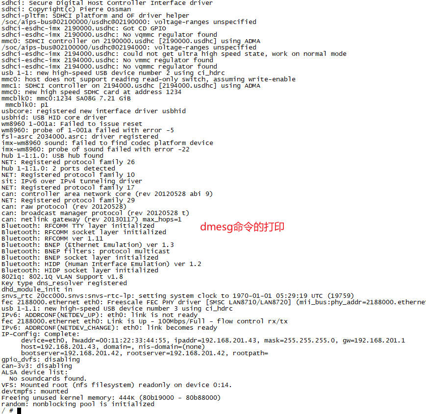

`dmesg`可以跟`grep`管道组合使用，来查找我们感兴趣的日志信息。

比如：我们想查找`nfs`相关的日志，可以输入`dmesg | grep nfs`，输出如下：

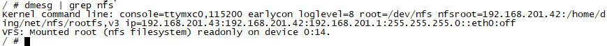

### 9.2 `/proc/kmsg`文件

内核的所有打印信息，都会输出到循环缓冲区`log_buf`中。为了能够方便的再用户空间读取内核打印信息，Linux内核驱动将该循环缓冲区映射到了`/proc`目录下的`kmsg`文件。

通过`cat /proc/kmsg`或者其他应用程序读取`log_buf`的时候可以不断的等待新的log，所以访问`/proc/kmsg`的方式适合长时间的读取log，没有新的log时会阻塞，一旦有新的log就可以被打印出来。

`/proc/kmsg`，本质上是一个`proc`虚拟文件。由内核`fs/proc/kmsg.c`源码，在内核初始化时创建：

`fs/proc/kmsg.c`

```c
/*
 *  linux/fs/proc/kmsg.c
 *
 *  Copyright (C) 1992  by Linus Torvalds
 *
 */

#include <linux/types.h>
#include <linux/errno.h>
#include <linux/time.h>
#include <linux/kernel.h>
#include <linux/poll.h>
#include <linux/proc_fs.h>
#include <linux/fs.h>
#include <linux/syslog.h>

#include <asm/uaccess.h>
#include <asm/io.h>

extern wait_queue_head_t log_wait;

static int kmsg_open(struct inode * inode, struct file * file)
{
	return do_syslog(SYSLOG_ACTION_OPEN, NULL, 0, SYSLOG_FROM_PROC);
}

static int kmsg_release(struct inode * inode, struct file * file)
{
	(void) do_syslog(SYSLOG_ACTION_CLOSE, NULL, 0, SYSLOG_FROM_PROC);
	return 0;
}

static ssize_t kmsg_read(struct file *file, char __user *buf,
			 size_t count, loff_t *ppos)
{
	if ((file->f_flags & O_NONBLOCK) &&
	    !do_syslog(SYSLOG_ACTION_SIZE_UNREAD, NULL, 0, SYSLOG_FROM_PROC))
		return -EAGAIN;
	return do_syslog(SYSLOG_ACTION_READ, buf, count, SYSLOG_FROM_PROC);
}

static unsigned int kmsg_poll(struct file *file, poll_table *wait)
{
	poll_wait(file, &log_wait, wait);
	if (do_syslog(SYSLOG_ACTION_SIZE_UNREAD, NULL, 0, SYSLOG_FROM_PROC))
		return POLLIN | POLLRDNORM;
	return 0;
}


static const struct file_operations proc_kmsg_operations = {
	.read		= kmsg_read,
	.poll		= kmsg_poll,
	.open		= kmsg_open,
	.release	= kmsg_release,
	.llseek		= generic_file_llseek,
};

static int __init proc_kmsg_init(void)
{
	proc_create("kmsg", S_IRUSR, NULL, &proc_kmsg_operations);
	return 0;
}
fs_initcall(proc_kmsg_init);
```

### 9.3 调整内核打印等级

#### 9.3.1 `printk`函数

`printk`是内核中用于打印调试信息的关键函数，其日志级别通过优先级数值（0-7）控制，`数值越小优先级越高`。具体定义如下：

```c
#define KERN_SOH	"\001"		/* ASCII Start Of Header */

#define KERN_EMERG	    KERN_SOH "0"	/* system is unusable */
#define KERN_ALERT	    KERN_SOH "1"	/* action must be taken immediately */
#define KERN_CRIT	    KERN_SOH "2"	/* critical conditions */
#define KERN_ERR	    KERN_SOH "3"	/* error conditions */
#define KERN_WARNING	KERN_SOH "4"	/* warning conditions */
#define KERN_NOTICE	    KERN_SOH "5"	/* normal but significant condition */
#define KERN_INFO	    KERN_SOH "6"	/* informational */
#define KERN_DEBUG	    KERN_SOH "7"	/* debug-level messages */
```

这里的`KERN_SOH`有什么用？为什么要把日志等级定义成`KERN_SOH 4`，而不是直接就是4呢？

`KERN_SOH`是内核中定义的一个宏，其本质是ASCII控制字符SOH，十六进制表示为0x01。在ASCII编码体系中，SOH通常用于数据传输或通信协议中作为特殊控制信号，标志着数据包或报文头部的开始。它不是一个可打印字符，所以在文本编辑器或其他普通显示环境下，通常不会显示出任何可见的图形符号。在电传打字机时代以及后续的计算机通信技术中，这些控制字符对于确保数据正确传输和格式化具有重要意义。

在Linux内核中，`KERN_SOH`的作用是作为内核日志消息中`优先级标记的起始符`。

#### 9.3.2 内核日志的优先级格式

`printk`输出的日志消息，需要包含一个`优先级标记`，用于告知日志系统（如syslogd）该消息的严重级别。优先级标记的标准格式为：

`KERN_SOH <level>`

#### 9.3.3 `/proc/sys/kernel/printk`文件

内核的日志打印由相应的打印等级来控制，可以通过调整内核打印等级来控制打印日志的输出。以下命令用来查看内核的打印等级：

```sh
cat /proc/sys/kernel/printk
7       4       1       7
```

这里打印了4个值。正好就对应了内核源码`kernel/printk/printk.c`中的数组变量：

```c
#define CONSOLE_LOGLEVEL_MIN	 1 /* Minimum loglevel we let people use */
#define CONSOLE_LOGLEVEL_QUIET	 4 /* Shhh ..., when booted with "quiet" */
#define CONSOLE_LOGLEVEL_DEFAULT 7 /* anything MORE serious than KERN_DEBUG */

int console_printk[4] = {
	CONSOLE_LOGLEVEL_DEFAULT,	/* 当前控制台日志级别 */
	MESSAGE_LOGLEVEL_DEFAULT,	/* 默认消息日志级别 */
	CONSOLE_LOGLEVEL_MIN,		/* 最低控制台日志级别 */
	CONSOLE_LOGLEVEL_DEFAULT,	/* 默认控制台日志级别 */
};
```
参数介绍：

| 日志宏 | 默认值 | 描述 |
| - | - | - |
| CONSOLE_LOGLEVEL_DEFAULT | 7 | 当前控制台日志级别：优先级高于该值的消息会显示在控制台（可以由uboot启动时设置） |
| MESSAGE_LOGLEVEL_DEFAULT | 4 | 默认消息日志级别：未指定等级的`printk`消息默认使用此级别 |
| CONSOLE_LOGLEVEL_MIN | 1 | 最低控制台日志级别：控制台日志级别的最小值（防止误设为 0） |
| CONSOLE_LOGLEVEL_DEFAULT | 7 | 默认控制台日志级别：系统启动时的默认值 |

1. 使用方式：通过`printk(KERN_INFO "Hello, world!")`输出，或使用封装函数`pr_info("Hello, world!")`
2. 默认级别：未指定日志等级是，使用`MESSAGE_LOGLEVEL_DEFAULT`，也就是4，对应着`KERN_WARNING`

#### 9.3.4 修改打印日志等级实验

既然我们可以读取`/proc/sys/kernel/printk`文件，那么也可以写入该文件来设置日志等级。

`测试驱动程序.c`

```c
#include <linux/init.h>     /* module_init */
#include <linux/module.h>   /* MODULE_LICENSE */
#include <linux/types.h>    /* dev_t */
#include <linux/fs.h>       /* alloc_chrdev_region */
#include <linux/cdev.h>     /* cdev_init */
#include <linux/device.h>   /* class_create, device_create */
#include <linux/uaccess.h>  /* copy_from_user */

static int my_dev_init(void)
{
    printk(KERN_EMERG   "0 KERN_EMERG\n");
    printk(KERN_ALERT   "1 KERN_ALERT\n");
    printk(KERN_CRIT    "2 KERN_CRIT\n");
    printk(KERN_ERR     "3 KERN_ERR\n");
    printk(KERN_WARNING "4 KERN_WARNING\n");
    printk(KERN_NOTICE  "5 KERN_NOTICE\n");
    printk(KERN_INFO    "6 KERN_INFO\n");
    printk(KERN_DEBUG   "7 KERN_DEBUG\n");
    return 0;
}

static void my_dev_exit(void)
{
}

MODULE_LICENSE("GPL");

module_init(my_dev_init);
module_exit(my_dev_exit);
```

测试结果如下：

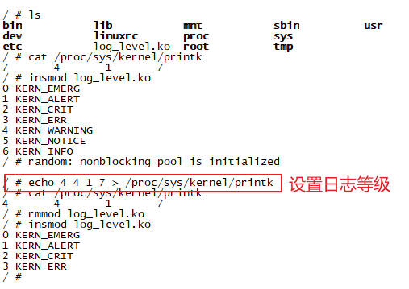

## 第10章 内核的内存分配

在Linux内核设备驱动开发中，内存分配是一个核心任务。

### 10.1 `kmalloc/kzalloc`

在设备驱动开发中，`kmalloc/kzalloc`这两个内存分配函数非常高频的使用。

#### 函数原型

头文件路径：`#include <linux/slab.h>`

```c
void *kmalloc(size_t size, gfp_t flags);
void *kzalloc(size_t size, gfp_t flags);
```

+ `size_t size`参数：要分配的内存大小，以字节为单位
+ `gfp_t flags`参数：控制内存分配的行为，包括分配位置（DMA区域）、是否允许休眠、是否清零内存

| 标志类型 | 常用标志 | 说明 |
| - | - | - |
| 上下文限制 | `GFP_KERNEL` | 在进程上下文中使用（允许休眠，可能触发内存回收）
| 上下文限制 | `GFP_ATOMIC` | 在原子上下文中使用（不可休眠，如中断处理程序或自旋锁内）|
| 内存区域 | `GFP_DMA` | 从DMA可用区域（低16MB物理内存）分配，用于兼容旧设备 |
| 内存区域 | `GFP_DMA32` | 从32位地址空间（<4GB）分配，适用于64位系统上的DMA设备 |
| 内存初始化 | `__GFP_ZERO` | 分配的内存初始化为0（类似`kzalloc`） |

#### 特点

+ 物理内存连续：分配的内存在物理地址上是连续的（适合DMA操作）
+ 小内存分配：通常用于小块内存（最大分配大小由`KMALLOC_MAX_SIZE`定义，通常为4MB）
+ 快速访问：由于物理连续，访问效率高

#### 区别

`kzalloc`是`kmalloc + memset`的封装，适用于需要清零的内存（如结构体初始化）

```c
void *kzalloc(size_t size, gfp_t flags)
{
	return kmalloc(size, flags | __GFP_ZERO);
}
```

#### 使用场景

+ 需要物理连续内存的场景（如DMA缓冲区）
+ 分配小到中等大小的内存块（例如设备驱动的私有数据结构）

### 10.2 `kfree`

在Linux内核的内存管理中，`kmalloc/kzalloc`分配的内存，统一使用`kfree`释放。

#### 函数原型

```c
void kfree(const void *p);
```

#### 关键细节

+ 直接释放内存：将内存块交还给内存管理子系统（slab分配器），不修改内存中的原有数据
+ 支持NULL指针：若传入NULL指针，`kfree`会静默跳过（不会报错）
+ 适用场景：普通内存释放，无需保护敏感数据

## 第11章 `llseek`定位

### 11.1 典型场景

前面我们写的所有设备驱动，读写`内核buffer`时，都是从`内核buffer`的起始头部开始，这对大多数流式设备都没问题。

但是，还有一些特殊的设备，需要进行随机访问，比如文件。我们在C语言中，通过`fread、fwrite`函数读写文件时，每次都会自动偏移到下一次要读取的位置，而不是每次都是从文件头开始。

*总结：支持随机访问的设备，必须实现`llseek`来定位。*

#### 11.1.1 内存模拟设备（RAM Disk）

场景特点：

+ 设备的行为类似于内存或文件，允许用户随机读写任意位置的数据
+ 需要跟踪并限制读写偏移（`f_ops`）的范围，防止越界访问

#### 11.1.2 固件更新

场景特点：

+ 设备支持分块更新固件（如按4KB块写入），需强制用户按块对齐访问
+ 偏移必须是块大小的整数倍

```c
static loff_t firmware_llseek(struct file *file, loff_t offset, int whence)
{
    loff_t new_pos;
    const loff_t block_size = 4096; // 固件块大小

    switch (whence) {
        case SEEK_SET: new_pos = offset; break;
        case SEEK_CUR: new_pos = file->f_pos + offset; break;
        case SEEK_END: new_pos = FIRMWARE_MAX_SIZE + offset; break;
        default: return -EINVAL;
    }
    // 检查是否按块对齐
    if (new_pos % block_size != 0)
        return -EINVAL;
    // 检查是否超出固件最大大小
    if (new_pos < 0 || new_pos >= FIRMWARE_MAX_SIZE)
        return -EINVAL;
    file->f_pos = new_pos;
    return new_pos;
}
```

### 11.2 函数原型

`file_ops`的`.llseek`方法，函数原型和参数介绍。

1. `struct file *filp`：文件指针
2. `loff_t offset`：文件位置指针。本质上是相对于whence的偏移量，可以为负值
3. `int whence`：操作文件的位置

    + `SEEK_SET`：文件头开始
    + `SEEK_CUR`：当前文件指针位置开始
    + `SEEK_END`：文件尾部开始

```c
loff_t my_llseek(struct file *filp, loff_t offset, int whence);
```

### 11.3 `loff_t *pos`文件位置指针

在Linux设备驱动程序中，`read`和`write`方法的最后一个参数，是`loff_t *pos`文件位置指针。具有以下关键作用：

`loff_t *pos`是一个指向文件偏移量的指针，用于追踪当前读写操作的起始位置。它使得驱动程序能够：

+ 定位数据：决定从设备的哪个位置开始读取或写入
+ 自动推进偏移：在操作完成后更新偏移量，为后续操作提供连续性
+ 支持随机访问：允许通过修改偏移量，跳转到任意位置操作

#### 读操作

```c
ssize_t my_read(struct file *filp, char __user *buf , size_t size, loff_t *pos);
```

+ 输入时：`*pos`表示用户空间期望的起始读取位置
+ 输出时：驱动需要更新`*pos`为实际读取的新位置（原值+读取字节数）

#### 写操作

```c
ssize_t my_write(struct file *filp, const char __user *buf, size_t size, loff_t *pps);
```

+ 输入时：`*pos`表示用户空间期望的起始写入位置
+ 输出时：驱动需要更新`*pos`为实际写入的新位置（原值+写入字节数）

#### 与用户空间的联系

| 用户空间操作 | 内核行为 | 驱动可见的`*pos`变化 |
| - | - | - |
| `read(fd, buf, 100)` | 传入当前偏移量（file指针中有个成员f_pos就是偏移量）| 驱动看到初始偏移，需要更新偏移 |
| `write(fd, buf, 100)` | 同上 | 同上 |
| `lseek(fd, 1024, SEEK_SET)` | 直接修改偏移量 | 下次读写时使用新值 |

#### 典型驱动实现方式

```c
static ssize_t my_read(struct file *file, char __user *buf,
                      size_t count, loff_t *pos)
{
    // 1. 计算可读范围
    size_t available = buffer_size - *pos;
    size_t to_read = min(count, available);

    // 2. 执行数据拷贝（设备->用户空间）
    copy_to_user(buf, device_buffer + *pos, to_read);

    // 3. 更新偏移量（关键步骤！）
    *pos += to_read;

    return to_read;
}
```

#### 注意事项

1. 偏移量维护责任

    + 驱动必须在每次操作后更新`*pos`
    + 若没有更新，后续操作会重复使用相同位置

2. 并发控制

    + 对共享偏移量的访问，需要加锁

3. 边界检查

    + 需验证`*pos`是否超出设备容量

4. 特殊设备处理

    + 对于顺序访问的流式设备，可能要忽略`pos`
    + 需要实现`llseek`返回错误

#### 与llseek的关联

当用户调用`llseek()`时：

```c
loff_t my_llseek(struct file *file, loff_t offset, int whence)
{
    // 计算新偏移量
    switch(whence) {
    case SEEK_SET: new = offset;
    case SEEK_CUR: new = file->f_pos + offset;
    case SEEK_END: new = device_size + offset;
    }
    
    // 更新到 file->f_pos
    file->f_pos = new;
    return new;
}
```

+ 该函数直接修改`file->f_pos`
+ `read/write`中看到的`*pos`，就是`file->f_pos`的地址

### 11.4 驱动程序

```c
#include <linux/init.h>     /* module_init */
#include <linux/module.h>   /* MODULE_LICENSE */
#include <linux/types.h>    /* dev_t */
#include <linux/fs.h>       /* alloc_chrdev_region */
#include <linux/cdev.h>     /* cdev_init */
#include <linux/device.h>   /* class_create, device_create */
#include <linux/uaccess.h>  /* copy_from_user */
#include <asm/uaccess.h>    
#include <linux/mutex.h>
#include <linux/slab.h>

#define DEVICE_NAME     "cdev_test"
#define CLASS_NAME      "cdev_cls"

#define SIZE    4096

struct my_dev {
    dev_t dev;
    struct cdev cdev;
    struct device *device;
    struct class  *class;
    struct mutex lock;
    char  *buf;
    size_t buf_size;
};

static struct my_dev s_dev;

static int my_open(struct inode *inode, struct file *filp)
{
    filp->private_data = &s_dev;
    return 0;
}

static loff_t my_llseek(struct file *filp, loff_t offset, int whence)
{
    loff_t new_pos;
    struct my_dev *dev = filp->private_data;

    mutex_lock(&dev->lock);
    switch (whence)
    {
    case SEEK_SET:
        new_pos = offset;
        break;
    case SEEK_CUR:
        new_pos = filp->f_pos + offset;
        break;
    case SEEK_END:
        new_pos = dev->buf_size + offset;
        break;
    default:
        mutex_unlock(&dev->lock);
        return -EINVAL;
    }
    if (new_pos < 0 || new_pos > dev->buf_size) {
        mutex_unlock(&dev->lock);
        return -EINVAL;
    }
    filp->f_pos = new_pos; // 更新当前位置
    mutex_unlock(&dev->lock);

    return new_pos;
}

static ssize_t my_read(struct file *filp, char __user *buf , size_t size, loff_t *pos)
{
    int ret, len;
    struct my_dev *dev = filp->private_data;

    mutex_lock(&dev->lock);
    len = min_t(int, size, dev->buf_size - *pos);
    if (len > 0) {
        ret = copy_to_user(buf, dev->buf + *pos, len);
        if (ret) {
            mutex_lock(&dev->lock);
            return -EFAULT;
        }
        *pos += len;
    }
    mutex_unlock(&dev->lock);

    return len;
}

static ssize_t my_write(struct file *filp, const char __user *buf, size_t size, loff_t *pos)
{
    int ret, len;
    struct my_dev *dev = filp->private_data;

    mutex_lock(&dev->lock);
    len = min_t(int, size, dev->buf_size - *pos);
    if (len > 0) {
        ret = copy_from_user(dev->buf + *pos, buf, len);
        if (ret) {
            mutex_lock(&dev->lock);
            return -EFAULT;
        }
        *pos += len;
    }
    mutex_unlock(&dev->lock);

    return len;
}

static int my_close(struct inode *inode, struct file *filp)
{
    return 0;
}

const struct file_operations cdev_fops = {
    .owner   = THIS_MODULE,
    .open    = my_open,
    .llseek  = my_llseek,
    .read    = my_read,
    .write   = my_write,
    .release = my_close,
};

static int my_dev_init(void)
{
    alloc_chrdev_region(&s_dev.dev, 0, 1, DEVICE_NAME);
    s_dev.class = class_create(THIS_MODULE, CLASS_NAME);
    cdev_init(&s_dev.cdev, &cdev_fops);
    s_dev.cdev.owner = THIS_MODULE;
    cdev_add(&s_dev.cdev, s_dev.dev, 1);
    s_dev.device = device_create(s_dev.class, NULL, s_dev.dev, NULL, DEVICE_NAME);
    mutex_init(&s_dev.lock);
    s_dev.buf = kzalloc(SIZE, GFP_KERNEL);
    s_dev.buf_size = SIZE;

    printk("driver init(major:%d minor:%d)\n", MAJOR(s_dev.dev), MINOR(s_dev.dev));
    return 0;
}

static void my_dev_exit(void)
{
    kfree(s_dev.buf);
    s_dev.buf = NULL;
    s_dev.buf_size = 0;
    device_destroy(s_dev.class, s_dev.dev);
    cdev_del(&s_dev.cdev);
    class_destroy(s_dev.class);
    unregister_chrdev_region(s_dev.dev, 1);

    printk("driver exit\n");
}

MODULE_LICENSE("GPL");

module_init(my_dev_init);
module_exit(my_dev_exit);
```

### 11.5 测试应用程序

```c
#include <stdio.h>
#include <stdlib.h>
#include <sys/types.h>
#include <sys/stat.h>
#include <unistd.h>
#include <fcntl.h>

#define SIZE    4096

int main(int argc, char *argv[])
{
    int fd, ret;

    if (argc < 2) {
        printf("Usage: ./app /dev/xxx param\n");
        return -1;
    }
    fd = open(argv[1], O_RDWR);
    if (fd < 0) {
        printf("Open %s fail:%d\n", argv[1], fd);
        return fd;
    }

    // Test SEEK_SET
    if (lseek(fd, 100, SEEK_SET) != 100) {
        printf("lseek SEEK_SET fail\n");
        close(fd);
        return -1;
    }
    // Test write
    char str[] = "test data";
    if (write(fd, str, sizeof(str)) != sizeof(str)) {
        printf("write fail\n");
        close(fd);
        return -1;
    }
    // Test SEEK_CUR
    if (lseek(fd, -5, SEEK_CUR) != 100 + sizeof(str) - 5) {
        printf("lseek SEEK_SET fail\n");
        close(fd);
        return -1;
    }
    // Test read
    char read_buf[5];
    if (read(fd, read_buf, sizeof(read_buf)) != sizeof(read_buf)) {
        printf("read fail\n");
        close(fd);
        return -1;
    }
    printf("Read:%s\n", read_buf);
    // Test SEEK_END
    if (lseek(fd, -10, SEEK_END) != SIZE - 10) {
        printf("lseek SEEK_SET fail\n");
        close(fd);
        return -1;
    }

    close(fd);
    printf("lseek test complete\r\n");
    return 0;
}
```

测试结果如下：

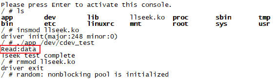

## 第12章 `ioctl`系统调用

在Linux设备驱动开发中，`ioctl`是一个关键的系统调用接口，用于实现设备无法通过常规读写操作完成的控制功能。其核心作用是，允许用户空间程序与内核驱动之间进行灵活的双向数据交互和控制命令传递。

### 12.1 `ioctl`的核心作用

| 功能维度 | 说明 |
| - | - |
| 设备控制 | 修改设备工作模式（如串口波特率、网络设备MTU）|
| 状态获取 | 读取设备状态信息（如传感器当前值、硬件寄存器状态）|
| 高级操作 | 触发非标准操作（如摄像头开始录像、FPGA重新配置）|
| 参数传递 | 传递复杂数据结构（如配置参数块、加密密钥）|

### 12.2 `ioctl`的典型使用场景

#### 12.2.1 硬件参数配置

```c
// 用户空间设置串口波特率
struct termios options;
ioctl(fd, TCGETS, &options);  // 获取当前参数
options.c_cflag |= B115200;    // 设置波特率为115200
ioctl(fd, TCSETS, &options);  // 应用新配置
```

#### 12.2.2 设备模式切换

```c
// 设置网络接口为混杂模式（抓包）
int promisc = 1;
ioctl(sockfd, SIOCGIFFLAGS, &ifr);  // 获取当前标志
ifr.ifr_flags |= IFF_PROMISC;
ioctl(sockfd, SIOCSIFFLAGS, &ifr);  // 设置新标志
```

#### 12.2.3 私有协议实现

```c
// 自定义加密设备驱动
struct crypto_key {
    int algo;
    char key[256];
};

struct crypto_key key = {
    .algo = AES_256,
    .key = "secret_key_here"
};
ioctl(fd, SET_CRYPTO_KEY, &key);  // 传递密钥
```

#### 12.2.4 状态查询

```c
// 查询磁盘剩余扇区数
unsigned long sectors;
ioctl(fd, BLKGETSIZE, &sectors); 
```

### 12.3 `ioctl`参数传递机制

1. 参数传递方式

| 方式 | 说明 |
| - | - |
| 整型直接传递 | 简单数值直接通过`unsigned long arg`传递 |
| 指针传递 | 传递用户空间指针，驱动需要用`copy_to_user()/copy_from_user()`拷贝数据 |

### 12.4 Linux内核`ioctl`函数详解

#### 12.4.1 函数原型

1. 用户空间

```c
#include <unistd.h>
#include <sys/ioctl.h>
int ioctl(int fd, int request, ...);  // 第三个参数通常为 void *argp
```

2. 内核空间

```c
long (*ioctl)(struct file *file, unsigned int cmd, unsigned long arg);
```

#### 12.4.2 参数介绍

1. `struct file *file`：文件指针
2. `unsigned int cmd`：32位无符号整数，包含4个核心字段：数据方向（Dir）、数据大小（Size）、幻数（MagicNumber）、命令号（NR：Number）。这些字段通过内核宏进行标准化构造和解析，确保驱动与用户空间的交互安全且规范

    | 位范围 | 31~30 | 29~16 | 15~8 | 7~0 |
    | - | - | - | - | - |
    | 字段 | 数据方向（`dir`）| 数据大小（`size`）| 幻数（`MagicNumber`）| 命令号（`nr`）|
    | 长度 | 2 | 14 | 8 | 8 |
    | 含义 | 读、写、双向 | 传输数据的字节数 | 唯一标识设备，避免命令冲突（如`a`、0x41等）| 设备支持的具体操作（如0表示读状态、1表示写配置） |

3. `unsigned long arg`：简单的整数，或指针（需要使用`copy_to_user`来访问）

#### 12.4.3 数据传输注意事项

1. 用户空间与内核空间的隔离：内核不能直接访问用户空间指针`arg`，必须通过`copy_to_user`进行数据拷贝
2. 数据类型对齐：确保用户空间与内核空间的数据结构定义一致（字节序、对齐方式），避免因编译选项不同导致的错误

#### 14.4.4 错误处理

1. 驱动进检查命令的合法性（如幻数是否匹配、数据大小是否合理），通过`_IOC_TYPE(cmd)`校验幻数，避免非法命令执行
2. 返回值：成功犯规0，错误返回负的错误码（如-EINVAL、-EFAULT）

#### 14.4.5 驱动实现建议

1. 命令分发

使用`switch-case`根据`cmd`处理不同操作，先校验幻数，再处理具体命令

```c
long my_ioctl(struct file *file, unsigned int cmd, unsigned long arg) {
    if (_IOC_TYPE(cmd) != MY_MAGIC) {
        return -EINVAL;  // 非法幻数
    }
    switch (_IOC_NR(cmd)) {
        case CMD_SET:  return handle_set(cmd, arg);
        case CMD_GET:  return handle_get(cmd, arg);
        default:       return -EINVAL;  // 非法命令号
    }
}
```

2. 安全检查

使用`access_ok()`检查用户指针是否可读/写。虽然`copy_from_user`会隐式检查，但显式检查更清晰。

#### 14.4.6 优缺点与适用场景

+ 优点

    1. 灵活度高：可自定义任意类型的控制命令和数据格式，适用于复杂或硬件相关的操作
    2. 兼容性强：长期存在于Linux系统，支持字符设备、块设备、网络接口

+ 缺点

    1. 缺乏统一规范：每个设备的命令和参数自定义，导致接口混乱，难以通用化
    2. 安全性风险：错误的命令或数据可能导致内核崩溃，需要严格校验

+ 适用场景

    1. 硬件设备的特殊控制（串口波特率设置、GPIO配置）
    2. 内核与用户空间的自定义数据交互

### 12.5 `ioctl`宏定义操作

