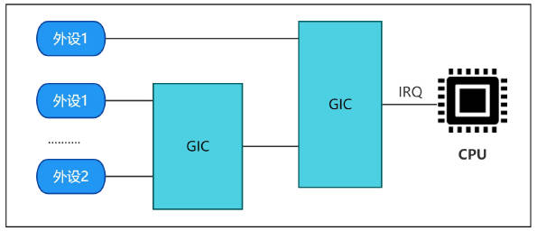

# 中断

## 第1章 `GIC`与`NVIC`

以前在stm32单片机中，用的是`NVIC`中断控制器。但是在linux系统中，用的是`GIC`控制器。为什么linux系统不用`NVIC`呢？二者有什么联系与区别。

### 1.1 硬件架构的差异

#### 1.1.1 目标处理器系列不同

+ `NVIC`：转为Cortex-M系列设计，如stm32、ESP32。面向低功耗、实时性强的单片机场景
+ `GIC`：转为Cortex-A系列设计，如Cortex-A系列，面向高性能、多核、复杂外设管理的Linux/Android系统

关键点：Cortex-A处理器的硬件架构中原生继承GIC，而非NVIC。

#### 1.1.2 中断管理规模

NVIC：

+ 最多支持240个外设中断，适合简单外设（`GPIO、UART、ADC`）
+ 中断类型单一，仅支持外设中断和内核异常（`Systick`）

GIC：

+ 支持SPI（共享外设中断）、PPI（私有外设中断）和SGI（软件生成中断）
+ GICv2支持最多1020个中断（SPI 32~1019），适配复杂外设（`PCIe、USB3、千兆网卡`）

现在Soc可能集成数百个外设，NVIC的240中断上限无法满足需求。

### 1.2 多核系统的支持

#### 1.2.1 GIC的多核特性

+ 中断路由与负载均衡：GIC的`Distributor`模块，可将SPI中断动态分发到不同CPU核心，优化负载（如网络中断绑定到空闲CPU）
+ 核间通信：通过SGI发送核间中断，触发其他CPU核心的动作（如任务调度）

#### 1.2.2 NVIC的局限性

NVIC只能适用于单核CPU。

### 1.3 中断类型与功能扩展

#### 1.3.1 GIC的细分中断类型

| 中断类型 | 功能 | Linux应用场景 |
| - | - | - |
| SPI | 共享外设中断（如网卡、磁盘） | 多核共享外设的中断处理 |
| PPI | CPU私有中断（如本地定时器） | 每核独立的时钟中断 |
| SGI | 软件生成中断（核间通信）） | 多核任务调度 |

#### 1.3.2 NVIC的单一中断类型

+ 所有外设中断统一管理，缺乏SPI、PPI/SGI的细分，无法支持多和系统的精细管理
+ 例如：CortexM的Systick定时器中断时全局的，无法绑定到特定的CPU核心

### 1.4 性能与实时性对比

#### 1.4.1 NVIC的实时性优势

+ 中断响应延时极低（通常<10周期），适合硬实时系统（如电机控制）
+ 原因：NVIC直接集成在Cortex-M内核中，无需通过总线访问外部控制器

#### 1.4.2 GIC的吞吐量优势

+ 通过多核分发和优先级抢占，支持高并发中断处理（如数据中心网卡的 100 万+ PPS）
+ 示例：GIC 可将多个网卡队列的中断分发到不同 CPU 核心，避免单核瓶颈

### 1.5 总结

ARM Linux为何必须使用GIC？

+ 硬件强制要求：Cortex-A处理器原生集成GIC，无法替换为NVIC
+ 多核支持：GIC的SPI-SGI中断机制，是Linux多核调度核负载均衡的基础
+ 扩展性需求：GIC支持上千个中断核虚拟化，适配复杂外设核云计算场景
+ Linux内核依赖：设备树、电源管理等特性深度绑定GIC功能

最终结论：

+ NVIC是为资源受限的单片机设计，适合实时操作系统（`FreeRTOS`）
+ 高性能多和系统设计的，是Linux在Cortex-A平台上的唯一选择。两者服务于不同的生态位，不可互换。

## 第2章 `GIC`与`CPU核心`

在ARM Linux SoC中，GIC（`Generic Interrupt Controller`）通常是集成在CPU核外部的独立模块，但与CPU核紧密集成在同一芯片上。外设的中断信号线会直接连到GIC，而非直接连到CPU核。

### 2.1 典型SoC架构图

```
+-------------------+       +-------------------+
|      CPU Core      |       |      CPU Core      |
| (Cortex-A7/A53/A76)|       | (Cortex-A7/A53/A76)|
+---------+---------+       +---------+---------+
          |                           |
          |         +-------+         |
          +-------->|       |<--------+
                    |  GIC  |
                    |       |<--- [外设中断信号线]
                    +-------+
                      ^  |  ^
                      |  |  |
                      |  |  +--- 其他外设（如 GPU、NPU）
                      |  |
          +-----------+--+-----------+
          |           |              |
      [UART]       [GPIO]         [Ethernet]...
```

### 2.2 GIC的位置

+ 外部模块：GIC是SoC中断一个独立硬件组件，与CPU分离，不直接嵌入CPU内部。通过片上总线（AMBA/AXI）与CPU核紧密相连
+ 多核支持：GIC通常设计为支持多核架构，可集中管理多个CPU核的中断分发（例如分配中断到不同核心、设置优先级）

### 2.3 外设中断的连接方式

+ 中断信号接入GIC：所有外设（如 UART、GPIO、以太网控制器等）的中断请求线（IRQ）直接连接到 GIC 的输入端
+ GIC 的中断路由：
    + GIC的`Distributor`模块接收外设中断，根据优先级、目标 CPU 核配置（如亲和性）将中断分发给特定CPU核
    + CPU 核通过 CPU Interface 模块与 GIC 交互，接收中断信号（如 IRQ/FIQ）

### 2.4 与传统架构的区别

+ 传统中断控制器：在早期ARM架构（如ARM7/ARM9）中，外设中断可能直接连接到CPU核的专用中断引脚（如IRQ/FIQ），此时中断控制器可能集成在CPU核内部
+ 现在多核场景：GIC的出现是为了支持多核SoC核复杂中断管理（如负载均衡），因此必须作为独立模块存在

### 2.5 Linux内核的视角

+ 设备树配置：在设备树中，外设的中断属性会指定其连接的GIC和中断号（如`<interrupt-parent = <&gic>>`）
+ 中断处理流程：
    1. 外设触发中断，GIC接收并标记为挂起状态
    2. GIC根据优先级和目标核配置，向对应CPU发出中断信号
    3. CPU核通过读取`GICC_IAR`寄存器确认中断，执行中断服务程序（ISR）
    4. ISR完成后，CPU写入`GICC_EOIR`寄存器通知GIC结束中断

### 2.6 GIC的`Distributor`与`CPU Interface`

```
+---------------------+      +---------------------+
|    Peripheral 1     |      |    Peripheral N     |
| (SPI: UART/GPIO...) |      | (SPI: Ethernet...)  |
+----------+----------+      +----------+----------+
           | SPI                        | SPI
           v                            v
    +------+----------------------------+------+
    |              GIC Distributor               |
    | (全局中断管理：优先级仲裁、目标核分配、使能控制) |
    +------+----------------------------+------+
           | IRQ_OUT[0] ... IRQ_OUT[M]  |      | PPI/SGI (来自CPU核私有外设)
           v                            v      v
    +------+--------+            +------+--------+     +-----------------+
    | CPU Interface 0 |          | CPU Interface M |<----| SGI (核间中断)  |
    | (Core 0 专属)    |          | (Core M 专属)    |     | (软件触发，如IPI)|
    +------+--------+            +------+--------+     +-----------------+
           | IRQ/FIQ                  | IRQ/FIQ
           v                            v
    +------+--------+            +------+--------+
    |   CPU Core 0   |            |   CPU Core M   |
    | (Cortex-A系列核) |            | (Cortex-A系列核) |
    +---------------+            +---------------+
```

#### 2.6.1 关键模块与连接说明

1. 外设（`Peripheral`）

    + 所有外设的中断信号（SPI）直接连到`GIC Distributor`
    + 示例外设：UART、GPIO、以太网控制器

2. `GIC Distributor`

    + 功能：
        + 接收所有外设的中断请求（SPI）
        + 管理中断优先级、使能状态、目标CPU核分配（亲和性）
        + 将中断路由到对应的`CPU Interface`

    + 关键信号：
        + `SPI[0-N]`：外设中断输入线
        + `IRQ OUT[0-M]`：路由到各CPU核的中断信号线

3. `CPU Interface`

    + 功能：
        + 每个CPU核对应一个独立的`CPU Interface`
        + 将`Distributor`路由的中断，转换为CPU核的IRQ信号
        + 处理CPU核的中断确认（`GICC_IAR`）和中断结束（`GICC_EOIR`）操作

    + 关键信号：
        + `IRQ/FIQ`：连接到CPU核的中断引脚
        + `PPI`：每个CPU核的私有中断
        + `SGI`：核间中断，由软件触发

4. `CPU`

    + 通过`IRQ/FIQ`引脚接收中断信号
    + 通过AMBA 总线（AXI/AHB）与GIC寄存器交互，完成中断处理流程

#### 2.6.2 详细信号流

1. 外设触发中断
    + 外设产生中断后，通过SPI信号线发送给`Distributor`

2. `Distributor`路由中断
    + `Distributor`根据优先级核目标CPU核配置，选择中断路由路径
    + 将中断通过`IRQ_OUT`信号线发送到目标`CPU Interface`

3. `CPU Interface`转发中断
    + `CPU Interface`将中断转换为IRQ或FIQ信号，触发CPU核进入中断处理模式

4. CPU 核处理中断
    + CPU 核读取`GICC_IAR`获取中断ID，执行中断服务程序（ISR）
    + ISR 完成后，写入`GICC_EOIR`通知GIC结束中断

**SPI信号流**

```
外设（SPI）--> GIC Distributor --> IRQ_OUT[0:M] --> CPU Interface --> IRQ/FIQ --> CPU 核
```

**PPI信号流**

```
CPU 核私有外设（PPI）--> CPU Interface --> IRQ/FIQ --> 同一 CPU 核
```

**SGI信号流**

```
CPU 核 A 写寄存器触发 SGI --> GIC Distributor --> IRQ_OUT[X] --> CPU Interface B --> IRQ --> CPU 核 B
```

## 2.7 `GICv2`状态机

下图是GICv2中断处理状态机，主要描述了中断从触发到完成的完整生命周期，涵盖`Distributor`和`CPU Interface`的协作流程。

```
    +-------------------+
    |      Idle         | <------------------+
    +-------------------+                    |
            |                             |
            | 外设触发中断                 |
            | (Distributor检测到中断)       |
            v                             |
    +-------------------+                    |
    |     Pending       |                    |
    +-------------------+                    |
            |                             |
            | Distributor仲裁并路由中断     |
            | (优先级、目标核亲和性)         |
            v                             |
    +-------------------+                    |
    |    Active         |--------------------+
    +-------------------+                    |
            |                             |
            | CPU核响应中断                 |
            | (读GICC_IAR获取中断ID)        |
            v                             |
    +-------------------+                    |
    | Active & Pending  |                    |
    +-------------------+                    |
            |                             |
            | 中断处理完成                 |
            | (写GICC_EOIR结束中断)        |
            v                             |
    +-------------------+                    |
    |     Idle         |--------------------+
    +-------------------+
```

### 2.7.1 状态机详细说明

1. `IDLE`（空闲状态）
    + 触发条件：
        + 初始状态，无中断挂起或处理中
        + 中断处理完成（CPU核写入`GICC_EOIR`）后返回此状态
    + 行为：
        + `Distributor`和`CPU Interface`等待新中断触发

2. `Pending`（挂起状态）
    + 触发条件：
        + 外设触发中断（SPI、PPI、SGI），`Distributor`检测到中断并标记为挂起
    + 行为：
        + `Distributor`更新中断状态寄存器`GICD_ISPENDRn`，标记中断为`Pending`
        + 若中断已使能（`GICD_ISENABLERn`置位），且优先级高于当前活动中断，进入仲裁流程
        
        
    + 关键操作：
        + 中断优先级仲裁，选择目标CPU核（通过`GICD_ITARGETSRn`配置亲和性）

3. `Active`活动状态
    + 触发条件：
        + `Distributor`完成仲裁，将中断路由到目标CPU核的`CPU Interface`
    + 行为：
        + `Distributor`将中断状态标记为`Active`（`GICD_ISACTIVERn`置位）
        + `CPU Interface`向目标CPU核发送IRQ或FIQ信号        
    + 关键操作：
        + CPU核响应中断，读取`GICC_IAR`寄存器获取中断ID，状态转换为`Active & Pending`
        

4. `Active & Pending`活动并挂起状态
    + 触发条件：
        + 在 Active 状态下，同一中断源再次触发中断（例如高优先级中断抢占）
        + 中断处理过程中，新中断到达并被仲裁为更高优先级
    + 行为：
        + `Distributor`标记中断为`Active & Pending`（`GICD_ISPENDRn`和`GICD_ISACTIVERn`同时置位）
        + CPU 核可能暂停当前低优先级中断，处理高优先级中断（抢占机制）
    + 关键操作：
        + 若发生抢占，当前中断状态保持`Active`，新中断进入`Pending`队列

    典型使用场景：

    

## 第3章 `imx6ull`的GIC编程

在前面的章节，我们介绍了`GIC`的原理，感觉还是比较抽象，编程有点无从下手。有没有例程可以参考呢？

*有的，NXP官方提供了SDK。事实上，官方SDK提供了对外设操作的所有代码，我们拥有丰富的资料可以参考。*

### 3.1 官方SDK的中断操作

以最简单的GPIO中断为例，看看官方SDK是怎么写的。

#### 3.1.1 启动文件`startup_MCIMX6Y2.S`

启动文件`startup_MCIMX6Y2.S`，设置完栈指针后（C语言环境准备好了），就调用了`SystemInit`函数。

```S
/* Reset Handler */

Reset_Handler:
    cpsid   i               /* Mask interrupts */

    /* Reset SCTlr Settings */
    mrc     p15, 0, r0, c1, c0, 0     /* Read CP15 System Control register                  */
    bic     r0,  r0, #(0x1 << 12)     /* Clear I bit 12 to disable I Cache                  */
    bic     r0,  r0, #(0x1 <<  2)     /* Clear C bit  2 to disable D Cache                  */
    bic     r0,  r0, #0x2             /* Clear A bit  1 to disable strict alignment         */
    bic     r0,  r0, #(0x1 << 11)     /* Clear Z bit 11 to disable branch prediction        */
    bic     r0,  r0, #0x1             /* Clear M bit  0 to disable MMU                      */
    mcr     p15, 0, r0, c1, c0, 0     /* Write value back to CP15 System Control register   */

    /* Set up stack for IRQ, System/User and Supervisor Modes */
    cps     #0x12                /* Enter IRQ mode                */
    ldr     sp, =__IStackTop     /* Set up IRQ handler stack      */

    cps     #0x1F                /* Enter System mode             */
    ldr     sp, =__CStackTop     /* Set up System/User Mode stack */

    cps     #0x13                /* Enter Supervisor mode         */
    ldr     sp, =__CStackTop     /* Set up Supervisor Mode stack  */

    ldr     r0,=SystemInit
    blx     r0

    cpsie   i                    /* Unmask interrupts             */
```

#### 3.1.2 系统初始化函数`SystemInit`

`SystemInit`函数调用了`GIC_Init`函数，用来初始化GIC控制器。

```c
void SystemInit (void)
{
  uint32_t sctlr;
  uint32_t actlr;

  L1C_InvalidateInstructionCacheAll();
  L1C_InvalidateDataCacheAll();

  sctlr = __get_SCTLR();
  sctlr = (sctlr & ~(SCTLR_V_Msk       | /* Use low vector */
                     SCTLR_A_Msk       | /* Disable alignment fault checking */
                     SCTLR_M_Msk))       /* Disable MMU */
                 |  (SCTLR_I_Msk       | /* Enable ICache */
                     SCTLR_Z_Msk       | /* Enable Prediction */
                     SCTLR_CP15BEN_Msk | /* Enable CP15 barrier operations */
                     SCTLR_C_Msk);       /* Enable DCache */
  __set_SCTLR(sctlr);

  /* Set vector base address */
  GIC_Init();
  __set_VBAR((uint32_t)__VECTOR_TABLE);
}
```

#### 3.1.3 GIC初始化函数`GIC_Init`

这里实际上是在配置GIC的寄存器。`gic->D_xxx`指的是`Distributor`，`gic_C_xxx`指的是`CPU Interface`。我们先简单的看下这里做了些什么，后面再具体分析这些出现的寄存器。

1. `imx6ull`支持5位中断优先级，`2^5=32`，可设置的中断优先级为0~31
2. 获取`SoC`最大支持的GIC中断个数
3. 先禁用所有支持的GIC中断
4. 允许所有中断通过
5. 没有子优先级
6. 使能`Distributor`
7. 使能`CPU Interface`

```c
#define __GIC_PRIO_BITS     5   /**< Number of Bits used for Priority Levels */

FORCEDINLINE __STATIC_INLINE void GIC_Init(void)
{
  uint32_t i;
  uint32_t irqRegs;
  GIC_Type *gic = (GIC_Type *)(__get_CBAR() & 0xFFFF0000UL);

  irqRegs = (gic->D_TYPER & 0x1FUL) + 1;

  /* On POR, all SPI is in group 0, level-sensitive and using 1-N model */

  /* Disable all PPI, SGI and SPI */
  for (i = 0; i < irqRegs; i++)
    gic->D_ICENABLER[i] = 0xFFFFFFFFUL;

  /* Make all interrupts have higher priority */
  gic->C_PMR = (0xFFUL << (8 - __GIC_PRIO_BITS)) & 0xFFUL;

  /* No subpriority, all priority level allows preemption */
  gic->C_BPR = 7 - __GIC_PRIO_BITS;

  /* Enable group0 distribution */
  gic->D_CTLR = 1UL;

  /* Enable group0 signaling */
  gic->C_CTLR = 1UL;
}
```

到目前为止，我们初始化完成了GIC控制器。接下来就可以用外设中断了。如果要启动外设中断，需要做两件事：

1. 设置外设中断的优先级
2. 使能外设中断

#### 3.1.4 设置外设中断优先级`GIC_SetPriority`

SDK中列出了`imx6ull`支持的全部中断号。我们要使用外设中断，就从这里面找对应的`中断IRQn`。

```c
typedef enum IRQn {
  /* Auxiliary constants */
  NotAvail_IRQn                = -128,             /**< Not available device specific interrupt */

  /* Core interrupts */
  Software0_IRQn               = 0,                /**< Cortex-A7 Software Generated Interrupt 0 */
  Software1_IRQn               = 1,                /**< Cortex-A7 Software Generated Interrupt 1 */
  Software2_IRQn               = 2,                /**< Cortex-A7 Software Generated Interrupt 2 */
  Software3_IRQn               = 3,                /**< Cortex-A7 Software Generated Interrupt 3 */
  Software4_IRQn               = 4,                /**< Cortex-A7 Software Generated Interrupt 4 */
  Software5_IRQn               = 5,                /**< Cortex-A7 Software Generated Interrupt 5 */
  Software6_IRQn               = 6,                /**< Cortex-A7 Software Generated Interrupt 6 */
  Software7_IRQn               = 7,                /**< Cortex-A7 Software Generated Interrupt 7 */
  Software8_IRQn               = 8,                /**< Cortex-A7 Software Generated Interrupt 8 */
  Software9_IRQn               = 9,                /**< Cortex-A7 Software Generated Interrupt 9 */
  Software10_IRQn              = 10,               /**< Cortex-A7 Software Generated Interrupt 10 */
  Software11_IRQn              = 11,               /**< Cortex-A7 Software Generated Interrupt 11 */
  Software12_IRQn              = 12,               /**< Cortex-A7 Software Generated Interrupt 12 */
  Software13_IRQn              = 13,               /**< Cortex-A7 Software Generated Interrupt 13 */
  Software14_IRQn              = 14,               /**< Cortex-A7 Software Generated Interrupt 14 */
  Software15_IRQn              = 15,               /**< Cortex-A7 Software Generated Interrupt 15 */
  VirtualMaintenance_IRQn      = 25,               /**< Cortex-A7 Virtual Maintenance Interrupt */
  HypervisorTimer_IRQn         = 26,               /**< Cortex-A7 Hypervisor Timer Interrupt */
  VirtualTimer_IRQn            = 27,               /**< Cortex-A7 Virtual Timer Interrupt */
  LegacyFastInt_IRQn           = 28,               /**< Cortex-A7 Legacy nFIQ signal Interrupt */
  SecurePhyTimer_IRQn          = 29,               /**< Cortex-A7 Secure Physical Timer Interrupt */
  NonSecurePhyTimer_IRQn       = 30,               /**< Cortex-A7 Non-secure Physical Timer Interrupt */
  LegacyIRQ_IRQn               = 31,               /**< Cortex-A7 Legacy nIRQ Interrupt */

  /* Device specific interrupts */
  IOMUXC_IRQn                  = 32,               /**< General Purpose Register 1 from IOMUXC. Used to notify cores on exception condition while boot. */
  DAP_IRQn                     = 33,               /**< Debug Access Port interrupt request. */
  SDMA_IRQn                    = 34,               /**< SDMA interrupt request from all channels. */
  TSC_IRQn                     = 35,               /**< TSC interrupt. */
  SNVS_IRQn                    = 36,               /**< Logic OR of SNVS_LP and SNVS_HP interrupts. */
  LCDIF_IRQn                   = 37,               /**< LCDIF sync interrupt. */
  RNGB_IRQn                    = 38,               /**< RNGB interrupt. */
  CSI_IRQn                     = 39,               /**< CMOS Sensor Interface interrupt request. */
  PXP_IRQ0_IRQn                = 40,               /**< PXP interrupt pxp_irq_0. */
  SCTR_IRQ0_IRQn               = 41,               /**< SCTR compare interrupt ipi_int[0]. */
  SCTR_IRQ1_IRQn               = 42,               /**< SCTR compare interrupt ipi_int[1]. */
  WDOG3_IRQn                   = 43,               /**< WDOG3 timer reset interrupt request. */
  Reserved44_IRQn              = 44,               /**< Reserved */
  APBH_IRQn                    = 45,               /**< DMA Logical OR of APBH DMA channels 0-3 completion and error interrupts. */
  WEIM_IRQn                    = 46,               /**< WEIM interrupt request. */
  RAWNAND_BCH_IRQn             = 47,               /**< BCH operation complete interrupt. */
  RAWNAND_GPMI_IRQn            = 48,               /**< GPMI operation timeout error interrupt. */
  UART6_IRQn                   = 49,               /**< UART6 interrupt request. */
  PXP_IRQ1_IRQn                = 50,               /**< PXP interrupt pxp_irq_1. */
  SNVS_Consolidated_IRQn       = 51,               /**< SNVS consolidated interrupt. */
  SNVS_Security_IRQn           = 52,               /**< SNVS security interrupt. */
  CSU_IRQn                     = 53,               /**< CSU interrupt request 1. Indicates to the processor that one or more alarm inputs were asserted. */
  USDHC1_IRQn                  = 54,               /**< USDHC1 (Enhanced SDHC) interrupt request. */
  USDHC2_IRQn                  = 55,               /**< USDHC2 (Enhanced SDHC) interrupt request. */
  SAI3_RX_IRQn                 = 56,               /**< SAI3 interrupt ipi_int_sai_rx. */
  SAI3_TX_IRQn                 = 57,               /**< SAI3 interrupt ipi_int_sai_tx. */
  UART1_IRQn                   = 58,               /**< UART1 interrupt request. */
  UART2_IRQn                   = 59,               /**< UART2 interrupt request. */
  UART3_IRQn                   = 60,               /**< UART3 interrupt request. */
  UART4_IRQn                   = 61,               /**< UART4 interrupt request. */
  UART5_IRQn                   = 62,               /**< UART5 interrupt request. */
  eCSPI1_IRQn                  = 63,               /**< eCSPI1 interrupt request. */
  eCSPI2_IRQn                  = 64,               /**< eCSPI2 interrupt request. */
  eCSPI3_IRQn                  = 65,               /**< eCSPI3 interrupt request. */
  eCSPI4_IRQn                  = 66,               /**< eCSPI4 interrupt request. */
  I2C4_IRQn                    = 67,               /**< I2C4 interrupt request. */
  I2C1_IRQn                    = 68,               /**< I2C1 interrupt request. */
  I2C2_IRQn                    = 69,               /**< I2C2 interrupt request. */
  I2C3_IRQn                    = 70,               /**< I2C3 interrupt request. */
  UART7_IRQn                   = 71,               /**< UART-7 ORed interrupt. */
  UART8_IRQn                   = 72,               /**< UART-8 ORed interrupt. */
  Reserved73_IRQn              = 73,               /**< Reserved */
  USB_OTG2_IRQn                = 74,               /**< USBO2 USB OTG2 */
  USB_OTG1_IRQn                = 75,               /**< USBO2 USB OTG1 */
  USB_PHY1_IRQn                = 76,               /**< UTMI0 interrupt request. */
  USB_PHY2_IRQn                = 77,               /**< UTMI1 interrupt request. */
  DCP_IRQ_IRQn                 = 78,               /**< DCP interrupt request dcp_irq. */
  DCP_VMI_IRQ_IRQn             = 79,               /**< DCP interrupt request dcp_vmi_irq. */
  DCP_SEC_IRQ_IRQn             = 80,               /**< DCP interrupt request secure_irq. */
  TEMPMON_IRQn                 = 81,               /**< Temperature Monitor Temperature Sensor (temperature greater than threshold) interrupt request. */
  ASRC_IRQn                    = 82,               /**< ASRC interrupt request. */
  ESAI_IRQn                    = 83,               /**< ESAI interrupt request. */
  SPDIF_IRQn                   = 84,               /**< SPDIF interrupt. */
  Reserved85_IRQn              = 85,               /**< Reserved */
  PMU_IRQ1_IRQn                = 86,               /**< Brown-out event on either the 1.1, 2.5 or 3.0 regulators. */
  GPT1_IRQn                    = 87,               /**< Logical OR of GPT1 rollover interrupt line, input capture 1 and 2 lines, output compare 1, 2, and 3 interrupt lines. */
  EPIT1_IRQn                   = 88,               /**< EPIT1 output compare interrupt. */
  EPIT2_IRQn                   = 89,               /**< EPIT2 output compare interrupt. */
  GPIO1_INT7_IRQn              = 90,               /**< INT7 interrupt request. */
  GPIO1_INT6_IRQn              = 91,               /**< INT6 interrupt request. */
  GPIO1_INT5_IRQn              = 92,               /**< INT5 interrupt request. */
  GPIO1_INT4_IRQn              = 93,               /**< INT4 interrupt request. */
  GPIO1_INT3_IRQn              = 94,               /**< INT3 interrupt request. */
  GPIO1_INT2_IRQn              = 95,               /**< INT2 interrupt request. */
  GPIO1_INT1_IRQn              = 96,               /**< INT1 interrupt request. */
  GPIO1_INT0_IRQn              = 97,               /**< INT0 interrupt request. */
  GPIO1_Combined_0_15_IRQn     = 98,               /**< Combined interrupt indication for GPIO1 signals 0 - 15. */
  GPIO1_Combined_16_31_IRQn    = 99,               /**< Combined interrupt indication for GPIO1 signals 16 - 31. */
  GPIO2_Combined_0_15_IRQn     = 100,              /**< Combined interrupt indication for GPIO2 signals 0 - 15. */
  GPIO2_Combined_16_31_IRQn    = 101,              /**< Combined interrupt indication for GPIO2 signals 16 - 31. */
  GPIO3_Combined_0_15_IRQn     = 102,              /**< Combined interrupt indication for GPIO3 signals 0 - 15. */
  GPIO3_Combined_16_31_IRQn    = 103,              /**< Combined interrupt indication for GPIO3 signals 16 - 31. */
  GPIO4_Combined_0_15_IRQn     = 104,              /**< Combined interrupt indication for GPIO4 signals 0 - 15. */
  GPIO4_Combined_16_31_IRQn    = 105,              /**< Combined interrupt indication for GPIO4 signals 16 - 31. */
  GPIO5_Combined_0_15_IRQn     = 106,              /**< Combined interrupt indication for GPIO5 signals 0 - 15. */
  GPIO5_Combined_16_31_IRQn    = 107,              /**< Combined interrupt indication for GPIO5 signals 16 - 31. */
  Reserved108_IRQn             = 108,              /**< Reserved */
  Reserved109_IRQn             = 109,              /**< Reserved */
  Reserved110_IRQn             = 110,              /**< Reserved */
  Reserved111_IRQn             = 111,              /**< Reserved */
  WDOG1_IRQn                   = 112,              /**< WDOG1 timer reset interrupt request. */
  WDOG2_IRQn                   = 113,              /**< WDOG2 timer reset interrupt request. */
  KPP_IRQn                     = 114,              /**< Key Pad interrupt request. */
  PWM1_IRQn                    = 115,              /**< hasRegInstance(`PWM1`)?`Cumulative interrupt line for PWM1. Logical OR of rollover, compare, and FIFO waterlevel crossing interrupts.`:`Reserved`) */
  PWM2_IRQn                    = 116,              /**< hasRegInstance(`PWM2`)?`Cumulative interrupt line for PWM2. Logical OR of rollover, compare, and FIFO waterlevel crossing interrupts.`:`Reserved`) */
  PWM3_IRQn                    = 117,              /**< hasRegInstance(`PWM3`)?`Cumulative interrupt line for PWM3. Logical OR of rollover, compare, and FIFO waterlevel crossing interrupts.`:`Reserved`) */
  PWM4_IRQn                    = 118,              /**< hasRegInstance(`PWM4`)?`Cumulative interrupt line for PWM4. Logical OR of rollover, compare, and FIFO waterlevel crossing interrupts.`:`Reserved`) */
  CCM_IRQ1_IRQn                = 119,              /**< CCM interrupt request ipi_int_1. */
  CCM_IRQ2_IRQn                = 120,              /**< CCM interrupt request ipi_int_2. */
  GPC_IRQn                     = 121,              /**< GPC interrupt request 1. */
  Reserved122_IRQn             = 122,              /**< Reserved */
  SRC_IRQn                     = 123,              /**< SRC interrupt request src_ipi_int_1. */
  Reserved124_IRQn             = 124,              /**< Reserved */
  Reserved125_IRQn             = 125,              /**< Reserved */
  CPU_PerformanceUnit_IRQn     = 126,              /**< Performance Unit interrupt ~ipi_pmu_irq_b. */
  CPU_CTI_Trigger_IRQn         = 127,              /**< CTI trigger outputs interrupt ~ipi_cti_irq_b. */
  SRC_Combined_IRQn            = 128,              /**< Combined CPU wdog interrupts (4x) out of SRC. */
  SAI1_IRQn                    = 129,              /**< SAI1 interrupt request. */
  SAI2_IRQn                    = 130,              /**< SAI2 interrupt request. */
  Reserved131_IRQn             = 131,              /**< Reserved */
  ADC1_IRQn                    = 132,              /**< ADC1 interrupt request. */
  ADC_5HC_IRQn                 = 133,              /**< ADC_5HC interrupt request. */
  Reserved134_IRQn             = 134,              /**< Reserved */
  Reserved135_IRQn             = 135,              /**< Reserved */
  SJC_IRQn                     = 136,              /**< SJC interrupt from General Purpose register. */
  CAAM_Job_Ring0_IRQn          = 137,              /**< CAAM job ring 0 interrupt ipi_caam_irq0. */
  CAAM_Job_Ring1_IRQn          = 138,              /**< CAAM job ring 1 interrupt ipi_caam_irq1. */
  QSPI_IRQn                    = 139,              /**< QSPI1 interrupt request ipi_int_ored. */
  TZASC_IRQn                   = 140,              /**< TZASC (PL380) interrupt request. */
  GPT2_IRQn                    = 141,              /**< Logical OR of GPT2 rollover interrupt line, input capture 1 and 2 lines, output compare 1, 2 and 3 interrupt lines. */
  CAN1_IRQn                    = 142,              /**< Combined interrupt of ini_int_busoff,ini_int_error,ipi_int_mbor,ipi_int_txwarning and ipi_int_waken */
  CAN2_IRQn                    = 143,              /**< Combined interrupt of ini_int_busoff,ini_int_error,ipi_int_mbor,ipi_int_txwarning and ipi_int_waken */
  Reserved144_IRQn             = 144,              /**< Reserved */
  Reserved145_IRQn             = 145,              /**< Reserved */
  PWM5_IRQn                    = 146,              /**< Cumulative interrupt line. OR of Rollover Interrupt line, Compare Interrupt line and FIFO Waterlevel crossing interrupt line */
  PWM6_IRQn                    = 147,              /**< Cumulative interrupt line. OR of Rollover Interrupt line, Compare Interrupt line and FIFO Waterlevel crossing interrupt line */
  PWM7_IRQn                    = 148,              /**< Cumulative interrupt line. OR of Rollover Interrupt line, Compare Interrupt line and FIFO Waterlevel crossing interrupt line */
  PWM8_IRQn                    = 149,              /**< Cumulative interrupt line. OR of Rollover Interrupt line, Compare Interrupt line and FIFO Waterlevel crossing interrupt line */
  ENET1_IRQn                   = 150,              /**< ENET1 interrupt */
  ENET1_1588_IRQn              = 151,              /**< ENET1 1588 Timer interrupt [synchronous] request. */
  ENET2_IRQn                   = 152,              /**< ENET2 interrupt */
  ENET2_1588_IRQn              = 153,              /**< MAC 0 1588 Timer interrupt [synchronous] request. */
  Reserved154_IRQn             = 154,              /**< Reserved */
  Reserved155_IRQn             = 155,              /**< Reserved */
  Reserved156_IRQn             = 156,              /**< Reserved */
  Reserved157_IRQn             = 157,              /**< Reserved */
  Reserved158_IRQn             = 158,              /**< Reserved */
  PMU_IRQ2_IRQn                = 159               /**< Brown-out event on either core, gpu or soc regulators. */
} IRQn_Type;
```

设置中断优先级，其实就是设置`中断IRQn`对应的这个`D_IPRIORITYR`寄存器的值。

```c
FORCEDINLINE __STATIC_INLINE void GIC_SetPriority(IRQn_Type IRQn, uint32_t priority)
{
  GIC_Type *gic = (GIC_Type *)(__get_CBAR() & 0xFFFF0000UL);

  gic->D_IPRIORITYR[((uint32_t)(int32_t)IRQn)] = (uint8_t)((priority << (8UL - __GIC_PRIO_BITS)) & (uint32_t)0xFFUL);
}
```

### 3.1.5 使能外设中断`GIC_EnableIRQ`

使能中断，就是设置`D_ISENABLER`寄存器。

```c
FORCEDINLINE __STATIC_INLINE void GIC_EnableIRQ(IRQn_Type IRQn)
{
  GIC_Type *gic = (GIC_Type *)(__get_CBAR() & 0xFFFF0000UL);

  gic->D_ISENABLER[((uint32_t)(int32_t)IRQn) >> 5] = (uint32_t)(1UL << (((uint32_t)(int32_t)IRQn) & 0x1FUL));
}
```

#### 3.1.5 总结

在`imx6ull`芯片中，我们要启动某个硬件外设的中断，调用以下3个函数：

1. 初始化GIC控制器：`void GIC_Init(void)`
2. 设置外设的中断优先级：`void GIC_SetPriority(IRQn_Type IRQn, uint32_t priority)`
3. 使能外设中断：`void GIC_EnableIRQ(IRQn_Type IRQn)`

### 3.2 `imx6ull`的`GIC`寄存器

#### 3.2.1 **中断优先级寄存器`GICD_IPRIORITYR`**


`GICD_IPRIORITYR`是`Distributor`的核心寄存器，用于设置每个中断的优先级。

+ 寄存器结构：多中断共享的32位寄存器组。

    GICv2的终端数量，由`GICD_TYPER`寄存器的`ITLinesNumber`字段决定，最多支持1020个中断。为了管理这些优先级，每个寄存器是32位，包含4个8位的优先级字段（每个字段控制1个中断）。

+ 位域定义：有效位与RAZ/WI位

    每个8位优先级字段的有效位数由芯片设计决定（ARM规范允许1~8位），未使用的位为RAZ/WI（读返回0，写忽略）。

+ 有效位：有效位是优先级字段中，实际用于表示优先级的位，决定了中断的优先级数值范围。

    + 5位有效位(`imx6ull、am335x`)：`Bit[7:3]`，对应32级优先级（0~31）
    + 4位有效位(`部分Cortex-A9芯片`)：`Bit[7:4]`，对应16级优先级（0~15）
    + 8位有效位(`高端芯片`)：`Bit[7:0]`，对应256级优先级

+ RAZ/WI位：保留位

    未被有效位占据的低位为RAZ/WI位，软件写入时会被忽略，读取时返回0。

+ 优先级编码规则：数值越小，优先级越高

+ 与其他寄存器的协同工作

    + `GICC_PMR（CPU 接口优先级屏蔽寄存器）`
        + 功能：设置CPU可响应的最低优先级阈值
        + 协同：仅当`中断优先级 < GICC_PMR值`时，中断才会被传递给CPU

    + `GICC_BPR（二进制点寄存器）`
        + 功能：划分主优先级和子优先级
        + 协同：若启用子优先级(`BPR < 7`)，`GICD_IPRIORITYR`的有效位会被分成主优先级和子优先级，影响中断的抢占顺序
        
+ SDK代码的定义：MICIX6Y2.h`头文件，写了只支持5位中断优先级，范围0~31

    ```c
    #define __GIC_PRIO_BITS 5         /**< Number of Bits used for Priority Levels */
    ```

+ SDK设置优先级的函数

    ```c
    void GIC_SetPriority(IRQn_Type IRQn, uint32_t priority)
    {
    GIC_Type *gic = (GIC_Type *)(__get_CBAR() & 0xFFFF0000UL);

    gic->D_IPRIORITYR[((uint32_t)(int32_t)IRQn)] = (uint8_t)((priority << (8UL - __GIC_PRIO_BITS)) & (uint32_t)0xFFUL);
    }
    ```

#### 3.2.2 **中断主优先级/子优先级划分寄存器`GICC_BPR`**


`GICC_BPR`寄存器，用于划分中断的主优先级和子优先级。*建议值：通常我们把中断优先级的有效位数都设为主优先级，不使用子优先级。*

+ 寄存器结构：32位寄存器，但仅低3位(`Bit[2:0]`)有效。`2^3=8`，正好对应了8位优先级。

    + 主优先级位数：`7 - GICC_BPR`
    + 子优先级位数：有效优先级位数(`imx6ull为5`) - 主优先级位数

+ 优先级抢占规则：主优先级决定抢占，子优先级决定顺序

    + 主优先级数值越小，抢占能力越强。高主优先级的中断可以`立即抢占`当前运行的低主优先级中断(无论子优先级如何)
    + 若连个中断的主优先级相同，子优先级数值越小的中断先被处理(不抢占、按顺序执行)

+ 注意事项：通常建议系统`禁用子优先级`，简化配置并减少仲裁逻辑复杂度。

+ SDK中`GIC_Init`函数，`禁用了子优先级`：`GICC_BPR = 7 - 5 = 2`，此时主优先级位数为5，这就是全部的有效位数了。

    ```c
    #define __GIC_PRIO_BITS 5

    void GIC_Init(void)
    {
        /* No subpriority, all priority level allows preemption */
        gic->C_BPR = 7 - __GIC_PRIO_BITS;
    }
    ```

#### 3.2.3 **中断优先级屏蔽寄存器`GICC_PMR`**


`GICC_PMR`是`Distributor`的核心寄存器，用于设置CPU可响应的最低优先级阈值。仅当`中断优先级高于(数值小于)该阈值`时，CPU才会接收并处理该中断。

+ 寄存器结构：32位寄存器，低8位有效

    `GICC_PMR`是32位寄存器，但仅低8位(`Bit[7:0]`)用于存储优先级屏蔽值。低8位的有效位数由芯片`SoC`实现决定（ARM规范允许1~8位）

+ 位域定义：有效位与RAZ/WI位

    `GICC_PMR`的低8位中，仅部分为有效，其余位为RAZ/WI位。有效位数与GIC支持的优先级有效位数一致（如imx6ull的中原优先级支持5位有效位，GICC_PMR的有效位也为5位）。

    `imx6ull`芯片的sdk中，只有5位有效位，`Bit[7:3]=0b11111`（十进制31），此时仅优先级<31的中断会被响应，优先级31的中断被屏蔽。

    ```c
    void GIC_Init(void)
    {
        /* Make all interrupts have higher priority */
        gic->C_PMR = (0xFFUL << (8 - __GIC_PRIO_BITS)) & 0xFFUL;
    }
    ```

+ 优先级比较规则：数值越小、优先级越高

    仅当`中断优先级 < GICC_PMR值`时，中断才会被传递给CPU。

#### 3.2.4 **外设中断使能寄存器`GICD_ISENABLER`**


`GICD_ISENABLER`是`Distributor`的核心寄存器，核心功能是启用特定中断，使其能够被分发到CPU接口并触发CPU响应。

+ 功能定位：中断的`启动开关`，仅当`GICD_ISENABLER`中对应位为1时，中断才可能被分发到CPU。

+ SDK使能GIC外设中断的函数中，`IRQn >> 5`实际上就等价于`IRQn / 32`，因为这个寄存器可以控制32个中断源。

```c
void GIC_EnableIRQ(IRQn_Type IRQn)
{
  GIC_Type *gic = (GIC_Type *)(__get_CBAR() & 0xFFFF0000UL);

  gic->D_ISENABLER[((uint32_t)(int32_t)IRQn) >> 5] = (uint32_t)(1UL << (((uint32_t)(int32_t)IRQn) & 0x1FUL));
}
```

#### 3.2.5 **外设中断禁止寄存器`GICD_ICENABLER`**


`GICD_ICENABLER`是`Distributor`的核心寄存器，核心功能是禁用特定中断，写1屏蔽该中断源的请求。

+ SDK禁用GIC外设中断的函数中，`IRQn >> 5`实际上就等价于`IRQn / 32`，因为这个寄存器可以控制32个中断源。

```c
void GIC_DisableIRQ(IRQn_Type IRQn)
{
  GIC_Type *gic = (GIC_Type *)(__get_CBAR() & 0xFFFF0000UL);

  gic->D_ICENABLER[((uint32_t)(int32_t)IRQn) >> 5] = (uint32_t)(1UL << (((uint32_t)(int32_t)IRQn) & 0x1FUL));
}
```

## 第4章 中断子系统

### 4.1 中断号

Linux内核中的中断管理采用双重标识机制(`IRQ number`和`HW interrupt ID`)，来标识一个来自外设的中断。

1. IRQ Number：CPU需要为每一个外设中断编号，我们称为IRQ Number。这个IRQ Number是一个虚拟的`interrupt ID`，和硬件无关，仅仅是被CPU用来标识一个外设中断
2. HW interrupt ID：对于GIC中断控制器而言，它收集了多个外设的`interrupt request line`并向上传递，因此，GIC控制器需要对外设中断进行编码。GIC控制器用HW interrupt ID来标识外设的中断。入宫只有一个GIC中断控制器，那IRQ number和HW interrupt ID是可以一一对应的。


#### 4.1.1 为什么需要双重中断号

如果是在GIC控制器级联的情况下，仅仅用HW interrupt ID就不能唯一标识一个外设中断，还需要知道该HW interrupt ID所属的中断控制器(因为HW interrupt ID在不同的中断控制器上是会重复编码的)



对于驱动工程师而言，我们只希望得到一个IRQ number，而不关心具体是哪个GIC中断控制器上的哪个HW interrupt ID。这样一个好处是，中断相关的硬件发生改变时，驱动软件不需要修改。因此，linux 内核的中断子系统需要提供一个将HW interrupt ID映射到IRQ Number的机制，也就是IRQ domain

驱动无需感知HW ID，只需调用`platform_get_irq()`或`of_irq_get()`获取IRQ number

#### 4.1.2 单片机为何只有一种中断号

1. 硬件环境单一
    + 固定中断控制器：单片机(如stm32)通常集成单一中断控制器(NVIC)，中断源数量有限且物理连接固定
    + 无动态扩展需求：外设与中断线绑定在芯片设计时确定，无需多平台适配
2. 资源限制：IRQ domain映射表需占用内存(约数KB) 在资源紧张的单片机中不必要

### 4.2 中断申请函数

#### 4.2.1 `request_irq`函数

##### 4.2.1.1 函数原型

```c
int request_irq(unsigned int irq, 
                irq_handler_t handler, 
                unsigned long flags,
                const char *name,
                void *dev)
```

##### 4.2.1.2 参数详解

1. `unsigned int irq` (中断号)
    + 作用：指定要注册的中断号
    + 取值范围：
        + 系统已使用的中断：`0-31`
        + 用户自定义终端：`32-16640`
    + 注意事项：必须确保中断号有效且未被其他设备独占使用

2. `irq_handler_t handler` (中断处理函数)
    + 函数原型：`typedef irqreturn_t (*irq_handler_t)(int, void *)`
    + 参数：
        + `int`：触发的中断号
        + `void *`：设备标识指针，与`request_irq`的`dev`参数对应
    + 返回值：`irqreturn_t`类型。常用值：
        + `IRQ_NONE`：表示该中断不是由本设备触发
        + `IRQ_HANDLED`：表示中断已处理
        + `IRQ_WAKE_THREAD`：唤醒中断线程(用于线程化中断)

3. `unsigned long flags` (中断标志)
    + 作用：配置中断的行为特性
    + 常用标志：
        + `IRQF_SHARED`：多个设备共享同一个中断线(必须指定)
        + `IRQF_DISABLED`：中断处理期间禁用所有其他中断(旧版内核使用，现代内核中该标志已被忽略)
        + `IRQF_TRIGGER_RISING / IRQF_TRIGGER_FALLING`：上升/下降沿触发
        + `IRQF_TRIGGER_HIGH / IRQF_TRIGGER_LOW`：高/低电平触发

4. `const char *name` (中断名称)
    + 作用：设置中断的文本描述
    + 用途：在`/proc/interrupts`文件中显示，便于系统调试和监控
    + 示例：`"eth0"`、`"my_device"`

5. `void *dev` (设备标识)
    + 作用：设备特定的数据指针
    + 关键用途：
        + 在共享中断`IRQF_SHARED`时，作为唯一标识区分不同设备
        + 传递给中断处理函数的第二个参数
        + 用于`free_irq()`函数，释放特定中断处理程序
    + 最佳实践：通常设置为设备结构体指针

6. 返回值
    + `0`：中断申请成功
    + `负值`：中断申请失败

##### 4.2.1.3 函数功能

1. *注册中断处理程序*：将指定的中断处理函数与特定中断号绑定
2. *激活中断*：函数会自动使能(*激活*)该中断线，无需额外操作
3. *资源管理*：检查中断号是否可用、新申请的中断添加到内核的数据结构
4. *中断线程化支持*：现代Linux内核中，`request_irq`实际上是`request_threaded_irq`的封装
    ```c
    int request_irq(unsigned int irq, irq_handler_t handler, unsigned long flags,
            const char *name, void *dev)
    {
        return request_threaded_irq(irq, handler, NULL, flags, name, dev);
    }
    ```

##### 4.2.1.4 典型使用场景

1. 设备驱动程序。设备驱动初始化时，注册中断处理函数：

    ```c
    static irqreturn_t my_device_irq_handler(int irq, void *dev_id)
    {
        struct my_device *dev = dev_id;
        // 处理中断...
        return IRQ_HANDLED;
    }

    static int my_device_probe(struct platform_device *pdev)
    {
        int ret;
        struct my_device *dev = platform_get_drvdata(pdev);
        
        ret = request_irq(dev->irq, my_device_irq_handler, 
                        IRQF_TRIGGER_RISING, "my_device", dev);
        if (ret) {
            dev_err(&pdev->dev, "Failed to request IRQ\n");
            return ret;
        }
        // ...
    }
    ```

2. 共享中断。多个设备共享同一个中断线：

    ```c
    // 设备1
    request_irq(irq_num, handler1, IRQF_SHARED, "device1", &dev1_data);

    // 设备2
    request_irq(irq_num, handler2, IRQF_SHARED, "device2", &dev2_data);

    // 中断处理函数中需要检查是否是自己的设备触发的中断
    irqreturn_t handler1(int irq, void *dev_id)
    {
        struct device_data *data = dev_id;
        if (!is_my_interrupt(data)) 
            return IRQ_NONE;
        
        // 处理中断
        return IRQ_HANDLED;
    }
    ```

##### 4.2.1.5 为什么这样设计

1. 灵活的中断处理模型
    + *上半部与下半部分离*：中断处理分为快速执行的上半部(中断处理函数)和可以延迟执行的下半部(`tasklet`、工作队列)
    + *中断线程化支持*：现代内核中`request_irq`实际调用`request_threaded_irq`，允许将耗时操作移到线程中执行，提高系统响应性

2. 资源管理与共享机制
    + *共享中断设计*：通过`dev`参数和`IRQF_SHARED`标志，允许多个设备共享同一中断线，解决中断资源有限的问题
    + *唯一标识机制*：`dev`参数作为共享中断的唯一标识，确保内核能正确区分不同设备

3. 兼容性与可扩展性
    + *标志位设计*：通过`flags`参数支持新特性而不破坏旧API
    + *触发方式灵活*：支持多种中断触发方式，适应不同硬件需求
    + *名称标识*：在`/proc/interrupts`中显示设备名称，便于系统监控和调试

##### 4.2.1.6 注意事项

1. *不能在中断上下文调用*：`request_irq`可能导致睡眠，因此不能再中断处理函数或其他禁止睡眠的上下文中使用
2. *中断处理函数限制*
    + 执行时间应尽量短
    + 不能调用可能睡眠的函数
    + 不能获取可能引起阻塞的锁

#### 4.2.2 `gpio(gpiod)_to_irq`函数

##### 4.2.2.1 函数原型

```c
int gpiod_to_irq(const struct gpio_desc *desc);

int gpio_to_irq(unsigned int gpio);
```

##### 4.2.2.2 参数详解

+ 类型：指向`gpio desc`描述符的指针
+ 来源：通常由`gpiod_get`、`gpiod_get_index`等函数获取
+ 返回值
    + 成功：返回非负整数，表示有效的中断号
    + 失败：返回负的错误码

##### 4.2.2.3 函数功能

核心功能：将GPIO描述符转换为对应的中断号，实现从GPIO引脚到中断线的映射。

#### 4.2.3 `free_irq`函数

##### 4.2.3.1 函数原型

```c
void free_irq(unsigned int irq, void *dev_id);
```

##### 4.2.3.2 参数详解

1. `nsigned int irq` (中断号)
    + 作用：指定要释放的中断号
    + 要求：
        + 必须是之前通过`request_irq`成功注册的中断号
        + 必须有效且在系统支持的范围内(`0 ~ NR_IRQS`)

2. `void *dev_id` (设备标识符)
    + 作用：唯一标识中断处理程序的设备指针
    + 关键特性：
        + 必须与调用`request_irq`时传递的`dev`参数完全相同
        + 在共享中断情况下，这是区分不同设备的关键

##### 4.2.3.3 函数功能

核心功能：清理和释放中断资源。

##### 4.2.3.4 典型使用场景

1. 设备驱动卸载(`remove`函数)

    ```c
    static void my_driver_remove(struct platform_device *pdev)
    {
        struct my_device *dev = platform_get_drvdata(pdev);
        
        // 释放中断
        free_irq(dev->irq, dev);
        
        // 其他资源清理...
        kfree(dev);
    }
    ```

2. 设备热插拔处理

    ```c
    static void handle_device_removal(struct my_device *dev)
    {
        // 停止设备操作
        device_stop(dev);
        
        // 释放中断
        free_irq(dev->irq, dev);
        
        // 清理其他资源
        release_dma_channel(dev->dma);
    }
    ```

### 4.3 中断服务函数`irqreturn_t (*irq_handler_t)(int irq, void *dev_id)`

中断服务程序，是在中断事件发生时自动调用的函数。她负责处理与中断相关的操作，例如读取数据、清除中断标志、更新状态。

#### 4.3.1 函数功能

##### 4.3.1.1 核心功能

+ 快速响应硬件：在最短时间内响应硬件中断
+ 关键操作执行：
    + 读取 / 清除中断状态寄存器
    + 保存关键硬件状态
    + 调度下半部处理(如设置标志、唤醒线程)
+ 避免耗时操作：不执行可能睡眠，阻塞或耗时的操作

##### 4.3.1.2 执行环境特点

+ 中断上下文：
    + 运行在原子上下文中
    + 不能睡眠或调用可能睡眠的函数
    + 不能获取可能导致睡眠的锁
    + 不能进行用户空间内存访问
+ 资源限制：
    + 使用有限的中断栈(通常是4KB或8KB)
    + 不能进行大量内存分配
    + 中断处理期间，同类型中断被屏蔽
+ 优先级
    + 具有最高执行优先级
    + 会抢占当前正在执行的进程和软中断

#### 4.3.2 参数详解

1. `int irq` (中断号)
    + 作用：标识触发中断的硬件中断线
    + 注意事项：一般情况下，中断处理函数更少直接使用这个参数

2. `void *dev_id` (设备标识)
    + 作用：设备特定的数据指针，用于区分不同设备
    + 设计意义：实现设备无关性。中断处理函数可以操作任意设备类型

#### 4.3.3 返回值

返回值`irqreturn_t`是一个枚举类型。如下：

```c
enum irqreturn {
    IRQ_NONE		= (0 << 0),
    IRQ_HANDLED		= (1 << 0),
    IRQ_WAKE_THREAD = (1 << 1),
};
```

1. `IRQ_NONE`
    + 含义：该中断不是由本设备触发
    + 典型场景：在共享中断环境中，当前设备检查后发现不是自己的中断
    + 行为影响：
        + 内核会继续调用该中断线上注册的其他处理程序
        + 如果所有处理程序都返回`IRQ_NONE`，内核会记录`unhandled IRQ`警告

2. `IRQ_HANDLED`
    + 含义：中断已成功处理
    + 典型场景：
        + 设备成功处理了中断事件
        + 在非共享中断环境中，通常总是返回此值
    + 行为影响：
        + 内核知道该中断已被处理，不再调用该中断线上的其他处理程序
        + 对于非共享中断，这是最常用的返回值

3. `IRQ_WAKE_THREAD`
    + 含义：需要唤醒中断线程进行处理
    + 典型场景：
        + 使用`request_threaded_irq`注册的线程化中断
        + 当上半部(硬中断处理函数)执行完毕后，需要触发下半部(线程函数)
    + 行为影响：
        + 内核会唤醒与该中断关联的内核线程
        + 线程函数(`thread_fn`)将在进程上下文中执行
        + 这是实现中断线程化的核心机制

#### 4.3.4 典型使用场景

##### 4.3.4.1 标准中断处理

```c
static irqreturn_t my_irq_handler(int irq, void *dev_id)
{
    struct my_device *dev = dev_id;
    u32 status;
    
    /* 读取中断状态寄存器 */
    status = readl(dev->base + STATUS_REG);
    
    /* 检查是否是本设备触发的中断 */
    if (!(status & MY_DEVICE_INT_MASK))
        return IRQ_NONE;
    
    /* 清除中断标志 */
    writel(status & MY_DEVICE_INT_MASK, dev->base + STATUS_REG);
    
    /* 保存关键状态 */
    dev->irq_count++;
    
    /* 调度下半部处理（如tasklet或工作队列） */
    tasklet_schedule(&dev->irq_tasklet);
    
    return IRQ_HANDLED;
}
```

##### 4.3.4.2 共享中断处理

```c
static irqreturn_t shared_irq_handler(int irq, void *dev_id)
{
    struct shared_device *dev = dev_id;
    int handled = 0;
    
    /* 检查设备状态寄存器 */
    if (check_device_status(dev)) {
        /* 处理中断 */
        process_interrupt(dev);
        handled = 1;
    }
    
    /* 返回IRQ_HANDLED或IRQ_NONE根据实际处理情况 */
    return handled ? IRQ_HANDLED : IRQ_NONE;
}

/* 注册共享中断 */
request_irq(irq, shared_irq_handler, IRQF_SHARED, "shared_dev", dev);
```

##### 4.3.4.3 线程化中断

+ 注册线程化中断

    ```c
    request_threaded_irq(irq, threaded_irq_handler, irq_thread_fn, IRQF_TRIGGER_RISING, "my_device", dev);
    ```

+ 线程化中断(上半部)

    ```c
    static irqreturn_t threaded_irq_handler(int irq, void *dev_id)
    {
        struct my_device *dev = dev_id;
        
        /* 快速检查中断源并清除中断标志 */
        if (!check_and_clear_interrupt(dev))
            return IRQ_NONE;
        
        /* 唤醒中断线程 */
        return IRQ_WAKE_THREAD;
    }
    ```

+ 线程化中断(线程函数)

    ```c
    static irqreturn_t irq_thread_fn(int irq, void *dev_id)
    {
        struct my_device *dev = dev_id;
        
        /* 可以执行耗时操作，可以睡眠 */
        handle_interrupt_in_thread(dev);
        
        return IRQ_HANDLED;
    }
    ```

#### 4.3.5 最佳实践与注意事项

1. 中断处理函数编写准则
    + 保持简短：执行时间应尽可能短
    + 避免阻塞：不能调用可能睡眠的函数
    + 快速退出：及时清除中断标志，避免丢失中断
    + 检查中断源：在共享中断中必须验证是否是自己的中断
    + 避免复杂运算：将耗时操作推迟到下半部

2. 性能优化技巧
    + 批处理中断：对于高频中断，考虑一次处理多个事件
    + 状态缓存：缓存频繁访问的硬件状态
    + 避免锁竞争：尽量减少在中断上下文中获取锁
    + 优先使用线程化中断：对于可能耗时的处理，优先考虑线程化

### 4.4 Linux内核中硬件中断标志清除机制详解

核心结论：在Linux内核中，*通常需要在中断服务函数中手动清除中断标志*，而不是由内核自动清除。这是由硬件设计和中断处理机制决定的。不同硬件设备有不同的中断清除方式，内核无法统一处理。

#### 4.4.1 为什么需要手动清除中断标志

清除中断标志是中断服务程序(`ISR`)的必要组成部分，目的是允许硬件在将来再次触发中断。不同硬件设备由不同的中断清除机制：

+ 某些硬件需要向特定寄存器写入特定值
+ 有些设备需要*`写1清除`*特定标志位
+ 有些设备需要读取状态寄存器来自动清除中断

这种硬件多样性使得内核无法提供同一的自动清除机制。

#### 4.4.2 清除中断标志的正确时机

##### 4.4.2.1 早期清除原则

最佳实践是在中断服务函数的早期，就清除中断标志

```c
static irqreturn_t my_irq_handler(int irq, void *dev_id)
{
    struct my_device *dev = dev_id;
    u32 status;
    
    /* 1. 读取中断状态 */
    status = readl(dev->base + INT_STATUS_REG);
    
    /* 2. 检查是否是本设备触发的中断 */
    if (!(status & MY_DEVICE_INT_MASK))
        return IRQ_NONE;
    
    /* 3. 关键步骤：清除中断标志 */
    writel(status & MY_DEVICE_INT_MASK, dev->base + INT_CLEAR_REG);
    
    /* 4. 后续处理（可考虑调度下半部） */
    tasklet_schedule(&dev->irq_tasklet);
    
    return IRQ_HANDLED;
}
```

##### 4.4.2.2 为什么要在早期清除

+ 避免丢失中断：及时清除中断标志可确保硬件能触发新的中断
+ 提高系统响应性：减少中断屏蔽时间，使系统能更快响应后续中断
+ 防止中断风暴：对于高频中断设备，延迟清除可能导致中断堆积

### 4.5 GPIO中断测试

我们使用`GPIO5_IO00`来作为按键中断。

#### 4.5.1 设备树

```dts
/* pinctrl */
pinctrl_key: keygrp {
    fsl,pins = <
        MX6ULL_PAD_SNVS_TAMPER0__GPIO5_IO00		0x1b0b0
    >;
};

/* key节点 */
key {
    compatible = "gpio-key";
    pinctrl-names = "default";
    pinctrl-0 = <&pinctrl_key>;
    key-gpios = <&gpio5 0 GPIO_ACTIVE_HIGH>;
    interrupt-parent = <&gpio5>;
    interrupts = <0 IRQ_TYPE_EDGE_FALLING>;
};
```

#### 4.5.2 驱动程序

这个程序主要做了以下工作：

1. 从`platform`设备获取到`gpio desc`描述符
2. 从设备节点的`interrupts`属性中读取中断触发类型。(*非常重要，一定要这么干，否则会出错*)
3. 每次进中断就刷新软件定时器
4. 在软件定时器中读取GPIO电平。如果是按下则计时，否则报弹起

```c
#include <linux/init.h>
#include <linux/module.h>
#include <linux/fs.h>
#include <linux/of.h>
#include <linux/cdev.h>
#include <linux/slab.h>
#include <linux/uaccess.h>
#include <linux/gpio/consumer.h>
#include <linux/platform_device.h>
#include <linux/irq.h>
#include <linux/interrupt.h>

#define DRIVER_NAME         "gpio-key"

struct my_dev {
    const char *name;
    dev_t  dev_num;
    struct cdev cdev;
    struct class *class;
    struct gpio_desc *desc;
    int    irq;
    u32    irq_type;
    struct timer_list timer;
    u32    counter;
};

static void key_timer(unsigned long arg)
{
    u32 s = 0;
    const u32 count_per_s = 50;
    struct my_dev *dev = (struct my_dev *)arg;
    int value = gpiod_get_value(dev->desc);
    if (value == 0) {
        if (!(dev->counter % count_per_s)) {
            s = dev->counter / count_per_s;
            if (s == 0) {
                printk("key_down\n");
            }
            else {
                printk("key_press_%ds\n", s);
            }
        }
        mod_timer(&dev->timer, jiffies + msecs_to_jiffies(20));
        dev->counter++;
    }
    else {
        if (dev->counter != 0) {
            printk("key_up\n");
        }
        dev->counter = 0;
    }
}

static irqreturn_t key_interrupt(int irq, void *dev_id)
{
    struct my_dev *dev = dev_id;
    printk("key_interrupt\n");
    mod_timer(&dev->timer, jiffies + msecs_to_jiffies(20));
    return IRQ_HANDLED;
}

static const struct file_operations my_fops = {

};

static int my_probe(struct platform_device *pdev)
{
    struct my_dev *dev = NULL;

    printk("my_probe...\n");
    dev = kzalloc(sizeof(struct my_dev), GFP_KERNEL);
    dev->name = pdev->name;
    dev->desc = gpiod_get_optional(&pdev->dev, "key", GPIOD_IN);
    dev->irq = gpiod_to_irq(dev->desc);
    /* 从设备节点的属性中读取中断触发类型 */
    of_property_read_u32_index(pdev->dev.of_node, "interrupts", 1, &dev->irq_type);
    setup_timer(&dev->timer, key_timer, (unsigned long)dev);
    request_irq(dev->irq, key_interrupt, IRQF_SHARED | dev->irq_type, dev->name, dev);
    printk("pin:%d irq:%d type:%d\n", desc_to_gpio(dev->desc), dev->irq, dev->irq_type);

    alloc_chrdev_region(&dev->dev_num, 0, 1, dev->name);
    cdev_init(&dev->cdev, &my_fops);
    dev->cdev.owner = THIS_MODULE;
    cdev_add(&dev->cdev, dev->dev_num, 1);
    dev->class = class_create(THIS_MODULE, dev->name);
    device_create(dev->class, NULL, dev->dev_num, NULL, dev->name);

    platform_set_drvdata(pdev, dev);
    printk("probe_done!\n");

    return 0;
}

static int my_remove(struct platform_device *pdev)
{
    struct my_dev *dev = platform_get_drvdata(pdev);

    printk("my_remove...\n");
    device_destroy(dev->class, dev->dev_num);
    class_destroy(dev->class);
    cdev_del(&dev->cdev);
    unregister_chrdev_region(dev->dev_num, 1);
    free_irq(dev->irq, dev);
    del_timer_sync(&dev->timer);
    gpiod_put(dev->desc);

    kfree(dev);
    printk("remove_done!\n");

    return 0;
}

static const struct of_device_id my_dt_match[] = {
    { .compatible = DRIVER_NAME },
    { /* Sentinel */ }
};

static struct platform_driver my_driver = {
    .driver = {
        .name  = DRIVER_NAME,
        .owner = THIS_MODULE,
        .of_match_table = my_dt_match,
    },
    .probe  = my_probe,
    .remove = my_remove,
};

static int __init my_init(void)
{
    printk("my_init\n");
    platform_driver_register(&my_driver);
	return 0;
}

static void __exit my_exit(void)
{
    platform_driver_unregister(&my_driver);
    printk("my_exit\n");
}

module_init(my_init);
module_exit(my_exit);

MODULE_LICENSE("GPL");
```

#### 4.5.3 测试结果


#### 4.5.4 我们为什么没有清GPIO中断？

前面讲到，中断触发后应该尽快清除中断。但我们的中断服务程序却没有这么做，为什么还能正常运行呢？

因为`imx-mxc`的框架已经给我们做好了。后面的章节详细分析！

## 第5章 中断申请流程

前面我们写了一个最简单的按键中断服务程序。用起来很简单，我们来仔细看下实现原理。

### 5.1 `request_irq`函数

中断申请使用的是`request_irq`函数，它用于请求一个中断号(`IRQ number`)并将一个中断处理程序与该中断关联起来。可以看到，`request_irq()`函数实际上是调用了`request_threaded_irq()`来完成中断申请的过程。

`request_threaded_irq()`函数提供了线程化的中断处理方式。可以在中断上下文中执行中断处理函数。

```c
int request_irq(unsigned int irq, irq_handler_t handler, unsigned long flags,
	    const char *name, void *dev)
{
	return request_threaded_irq(irq, handler, NULL, flags, name, dev);
}
```

### 5.2 `request_threaded_irq()`函数

`request_threaded_irq()`是Linux内核中，用于注册线程化中断处理程序的核心函数。他将中断处理分为两个部分：快速执行的上半部(`在中断上下文中运行`)、可以执行耗时操作的下半部(`在内核线程中运行`)。这种设计解决了传统中断处理模型中上半部必须快速执行、不能睡眠的限制，是现代Linux中断处理的重要机制。

#### 5.2.1 函数原型

```c
int request_threaded_irq(unsigned int irq, 
                         irq_handler_t handler,
			             irq_handler_t thread_fn, 
                         unsigned long irqflags,
			             const char *devname, 
                         void *dev_id)
```

#### 5.2.2 参数详解

1. `unsigned int irq` (中断号)
2. `irq_handler_t handler` (上半部处理函数)
    + 执行环境：中断上下文(原子上下文)
    + 限制：
        + 不能睡眠
        + 不能进行大量计算
        + 不能访问用户空间内存
        + 栈空间有限(通常4/8KB)
3. `irq_handler_t thread_fn` (下半部处理函数)
    + 执行环境：内核线程上下文(进程上下文)
    + 特点：
        + 可以睡眠
        + 可以执行耗时操作
        + 可以使用常规同步机制(如`mutex`)
        + 有完整的内核栈空间
    + 特殊处理：如果为`NULL`则退化为传统的`request_irq`行为。这也是`request_irq`函数的实现方式
4. `unsigned long irqflags` (中断标志)
5. `const char *devname` (设备名称)
6. `void *dev_id` (设备标识符)

#### 5.2.3 为什么这样设计

1. 解决传统中断处理的局限性
    + 不能睡眠的限制：
        + 传统中断处理程序运行在原子上下文中，不能调用可能导致睡眠的函数
        + 这严重限制了中断处理的复杂度和功能
    + 中断嵌套问题：
        + 长时间运行的中断处理会阻塞其他中断
        + 影响系统实时性和响应性
    + 优先级反转：高优先级任务可能被低优先级的中断处理阻塞
2. 提高系统实时性
3. 更好的资源管理
    + 避免死锁：中断线程可以使用常规的互斥锁，避免中断上下文使用自旋锁导致的死锁风险
    + 内存分配灵活性：可以在中断处理中使用`kmalloc(GFP_KERNEL)`等可能睡眠的内存分配方式
    + 简化驱动代码：驱动开发者无需严格区分上半部和下半部，可以直接编写完整的处理逻辑
4. 实行现代多核系统
    + 传统中断处理通常绑定到特定CPU核心，限制了并行处理能力
    + 中断线程可以像普通进程一样在多核之间迁移，更好的利用多核资源
    + 每个中断有独立线程，避免了共享工作队列导致的竞争问题

#### 5.2.4 源码分析

##### 5.2.4.1 `request_threaded_irq()`源码

主要的执行流程：

1. 共享中断验证。共享中断必须提供`dev_id`作为唯一标识(不能为空指针)
2. 根据中断号获取中断描述符。这个接下来还会重点介绍
3. 分配并初始化`irqaction`。填充上半部、下半部处理函数等关键信息
4. 设置中断。调用`__setup_irq`进行实际的中断设置

```c
int request_threaded_irq(unsigned int irq, irq_handler_t handler,
			 irq_handler_t thread_fn, unsigned long irqflags,
			 const char *devname, void *dev_id)
{
	struct irqaction *action;
	struct irq_desc *desc;
	int retval;

    // 1. 共享中断验证
	if ((irqflags & IRQF_SHARED) && !dev_id)
		return -EINVAL;

    // 2. 获取中断描述符
	desc = irq_to_desc(irq);
	if (!desc)
		return -EINVAL;

    // 3. 分配并初始化 irqaction
	action = kzalloc(sizeof(struct irqaction), GFP_KERNEL);
	action->handler = handler;
	action->thread_fn = thread_fn;
	action->flags = irqflags;
	action->name = devname;
	action->dev_id = dev_id;

    // 4. 设置中断
	chip_bus_lock(desc);
	retval = __setup_irq(irq, desc, action);
	chip_bus_sync_unlock(desc);

	return retval;
}
```

##### 5.2.4.2 `struct irq_desc`中断描述符

`struct irq_desc`是Linux内核中断子系统的核心数据结构。作为*中断描述符*，它管理着系统中每个中断线的所有关键信息，是连接硬件中断和软件处理逻辑的桥梁。

###### 5.2.4.2.1 组织方式

每个中断都有一个`irq_desc`中断描述符。在内核中有两种组织方式：

1. 数组方式 (传统方式)
    + 定义全局数组：`struct irq_desc irq_desc[NR_IRQS]`
        ```c
        struct irq_desc irq_desc[NR_IRQS] __cacheline_aligned_in_smp = {
            [0 ... NR_IRQS-1] = {
                .handle_irq	= handle_bad_irq,
            }
        };
        ```
    + 硬件中断号直接作为数组索引
    + 优点：简单高效，访问速度快
    + 缺点：浪费内存(尤其当`NR_IRQS`很大但实际使用中断少时)

2. `radix-tree`方式 (稀疏IRQ 现代Linux)
    + 定义`irq_desc_tree`基数树。在内核启动早期初始化
        ```c
        static RADIX_TREE(irq_desc_tree, GFP_KERNEL);

        static void irq_insert_desc(unsigned int irq, struct irq_desc *desc)
        {
            radix_tree_insert(&irq_desc_tree, irq, desc);
        }

        // 在内核启动时被调用
        int __init early_irq_init(void)
        {
            int i, initcnt, node = first_online_node;
            struct irq_desc *desc;

            initcnt = arch_probe_nr_irqs();
            printk(KERN_INFO "NR_IRQS:%d nr_irqs:%d %d\n", NR_IRQS, nr_irqs, initcnt);

            // 申请所有中断号NR_IRQS的node节点, 不是irq_desc结构体, 所以能节省内存
            for (i = 0; i < initcnt; i++) {
                desc = alloc_desc(i, node, NULL);
                set_bit(i, allocated_irqs);
                irq_insert_desc(i, desc);
            }
        }
        ```
    + `irq_to_desc`通过`irq`获取`irq_desc`时, 就是查询基数树
        ```c
        struct irq_desc *irq_to_desc(unsigned int irq)
        {
            return radix_tree_lookup(&irq_desc_tree, irq);
        }
        ```
    + 优点：节省内存，支持动态分配中断号
    + 缺点：访问稍慢，实现更复杂

### 5.3 `i.MX6ULL Linux内核中断处理流程：从硬件触发到处理函数调用`

`i.MX6ULL`基于ARM Cortem-A7架构，使用`GIC-400`作为中断控制器。

#### 5.3.1 整体中断处理流程

```
硬件中断触发 
    -> CPU跳转到异常向量表0x18
        -> 执行vector_irq
            -> 根据中断的模式选择处理函数
                -> __irq_usr/__irq_svc内核模式中断处理
                    -> svc_entry: 保存内核上下文
                        -> 执行irq_handler宏
                            -> 调用handle_arch_irq
                                -> 获取硬件中断号
                                    -> 转为Linux中断号
                                        -> 调用irq_desc->handle_irq
                                            -> 执行中断流控制
                                                -> 调用action链表中的处理函数
                                                    -> 恢复上下文。返回
```

#### 5.3.2 详细调用流程分析

##### 5.3.2.1 硬件中断触发与向量表跳转

当硬件中断发生时，CPU会自动：

+ 切换到IRQ模式
+ 保存返回地址到lr_irq
+ 保存CPSR到SPSR_irq
+ 禁用IRQ中断
+ 跳转到异常向量表的IRQ向量位置(`0x18`)

```asm
__vectors_start:
	W(b)	vector_rst
	W(b)	vector_und
	W(ldr)	pc, __vectors_start + 0x1000    ; 为什么这里是__vectors_start + 0x1000 ?
	W(b)	vector_pabt
	W(b)	vector_dabt
	W(b)	vector_addrexcptn
	W(b)	vector_irq      ; irq中断
	W(b)	vector_fiq
```

##### 5.3.2.2 `vector_irq`异常入口处理

`vector_irq`是由`vector_stub`宏定义的。代码中定义如下：

```asm
/*
 * Interrupt dispatcher
 */
    ; 不同模式下的irq处理函数
	.long	__irq_usr	    ; 用户模式irq处理函数
	.long	__irq_invalid
	.long	__irq_invalid
	.long	__irq_svc       ; 内核模式irq处理函数
```

`vector_stub`是一个宏定义。它定义了中断处理的通用入口代码：

```asm
	.macro	vector_stub, name, mode, correction=0
	.align	5

vector_\name:
	.if \correction
	sub	lr, lr, #\correction    ; 修正返回地址(ARM中通常-4)
	.endif

    ; 保存r0, lr_<exception>和spsr_<exception>
	stmia	sp, {r0, lr}		@ save r0, lr
	mrs	lr, spsr
	str	lr, [sp, #8]		@ save spsr

    ; 准备进入SVC模式, IRQ保持禁用
	mrs	r0, cpsr
	eor	r0, r0, #(\mode ^ SVC_MODE | PSR_ISETSTATE)
	msr	spsr_cxsf, r0

	; 根据SPSR的低4位获取处理器模式, 并跳转到对应模式的处理函数(如USR_irq、SVC_irq)
	and	lr, lr, #0x0f
    THUMB(	adr	r0, 1f			)
    THUMB(	ldr	lr, [r0, lr, lsl #2]	)
	mov	r0, sp
    ARM(	ldr	lr, [pc, lr, lsl #2]	)
	movs	pc, lr			; 跳到对应的处理函数
ENDPROC(vector_\name)

    ; 处理函数地址表, 跟在这后面
```

关键步骤：

1. 修正lr(减去4，因为ARM流水线导致PC指向+8位置)
2. 保存r0, lr和spsr到栈
3. 设置SPSR为SVC模式(但保持IRQ禁用)
4. 从SPSR低4位获取中断前的处理器模式(如USR、SVC等)
5. 根据模式，选择不同的处理函数(从函数地址表中获取)
6. 跳转到对应的处理函数

##### 5.3.2.3 模式特定的中断处理函数

根据中断前的处理器模式，回调到不同的处理函数：

+ `__irq_usr`: 中断前处于用户模式(USR)
+ `__irq_svc`: 中断前处于SVC模式(内核模式)

```asm
__irq_usr:
	usr_entry                   ; 保存用户上下文
	irq_handler                 ; 调用中断处理核心
	b	ret_to_user_from_irq    ; 返回用户空间

__irq_svc:
	svc_entry                   ; 保存内核上下文
	irq_handler                 ; 调用中断处理核心
	svc_exit r5, irq = 1        ; 从中断返回
```

##### 5.3.2.4 `irq_handler`宏：跳转到C语言处理函数

这是从汇编跳转到C代码的关键点：

```asm

.macro	irq_handler
	ldr	r1, =handle_arch_irq    ; 加载handle_arch_irq地址
	mov	r0, sp                  ; r0 = 栈指针(指向保存的上下文)
	adr	lr, BSYM(9997f)         ; lr = 返回地址
	ldr	pc, [r1]                ; 跳转到handle_arch_irq
```

关键点：

+ r0被设置为栈指针(指向保存的寄存器上下文)
+ r1被设置为`handle_arch_irq`的地址
+ lr被设置为返回地址(9997f标签处)
+ pc被设置为`handle_arch_irq`, 跳过去执行

在`i.MX6ULL`的4.1.15内核中，`handle_arch_irq`通常指向`gic_handle_irq`函数。

##### 5.3.2.4 C语言处理函数：`handle_arch_irq(gic_handle_irq)`

在C代码中，`handle_arch_irq`通常初始化为指向`gic_handle_irq`：

```c
// drivers/irqchip/irq-gic.c
void __init gic_init(unsigned int irq_start, struct device_node *node)
{
    // ...
    set_handle_irq(gic_handle_irq);
    // ...
}
```

`gic_handle_irq`函数定义如下：

当硬件中断触发后，执行流程从汇编层跳转到`gic_handle_irq`函数。

```c
// drivers/irqchip/irq-gic.c

static void __exception_irq_entry gic_handle_irq(struct pt_regs *regs)
{
	u32 irqstat, irqnr;
	struct gic_chip_data *gic = &gic_data[0];
	void __iomem *cpu_base = gic_data_cpu_base(gic);

	do {
        // 读取GICC_IRQ寄存器，获取硬件中断号
		irqstat = readl_relaxed(cpu_base + GIC_CPU_INTACK);
		irqnr = irqstat & GICC_IAR_INT_ID_MASK; // 硬件中断号

        // 通过irq_find_mapping将硬件中断号转换为Linux中断号
		if (likely(irqnr > 15 && irqnr < 1021)) {
			handle_domain_irq(gic->domain, irqnr, regs);
			continue;
		}
	} while (1);
}
```

`handle_domain_irq`函数，用于把一个硬件中断号转为逻辑中断域。源码如下：

```c
int __handle_domain_irq(struct irq_domain *domain, unsigned int hwirq,
			bool lookup, struct pt_regs *regs)
{
	struct pt_regs *old_regs = set_irq_regs(regs);
	unsigned int irq = hwirq;
	int ret = 0;

	irq_enter();
	irq = irq_find_mapping(domain, hwirq);

	/*
	 * Some hardware gives randomly wrong interrupts.  Rather
	 * than crashing, do something sensible.
	 */
	generic_handle_irq(irq);

	irq_exit();
	set_irq_regs(old_regs);
	return ret;
}
```

我们先忽略硬件中断号映射虚拟中断域的过程。继续往后看`generic_handle_irq`是怎么执行中断服务函数的。

##### 5.3.2.5 通用中断处理函数`generic_handle_irq`

这里是通过`irq`获取`desc`中断描述符，然后调用`desc->handle_irq(irq, desc)`来处理中断。

```c
int generic_handle_irq(unsigned int irq)
{
	struct irq_desc *desc = irq_to_desc(irq);
	generic_handle_irq_desc(irq, desc);
	return 0;
}

static inline void generic_handle_irq_desc(unsigned int irq, struct irq_desc *desc)
{
	desc->handle_irq(irq, desc);
}
```

关键流程：

1. `generic_handle_irq`函数，读取虚拟中断号`irq`对应的`irq_desc`描述符
2. 调用`desc->handle_irq(irq_desc)`执行中断处理

### 5.4 中断域(`irq_domain`)机制

#### 5.4.1 中断域的作用

`irq_domain`是Linux内核为*解决多级中断控制器级联*问题引入的核心抽象。在复杂SoC中，可能存在多个中断控制器级联的情况(如`GIC->GPIO控制器`)，每个控制器都有自己的硬件中断号编码空间。`irq_domain`建立了`hwirq`到虚拟中断号`virq`的映射关系。

```c
struct irq_domain {
	struct list_head link;              // 全局链表节点
	const char *name;                   // 域名称
	const struct irq_domain_ops *ops;   // 域操作函数集
	void *host_data;                    // 私有数据

	struct device_node *of_node;        // 设备树节点

	irq_hw_number_t hwirq_max;          // 最大硬件中断号
	unsigned int revmap_direct_max_irq; // 直接映射的最大中断号
	unsigned int revmap_size;           // 映射的个数
	unsigned int linear_revmap[];       // 线性映射表(数组)，我们会在后面动态申请内存创建
    struct radix_tree_root revmap_tree; // 基数树用于树形映射
};
```

映射机制类型：

1. 直接映射：`hwirq`直接作为`virq`，适用于简单控制器
2. 线性映射：通过数组直接索引，适用于中断数量少且连续的场景
3. 基数树映射：使用树状结构管理稀疏中断号，适合中断数量大或分散的场景


#### 5.4.2 中断域的创建

当设备树的GIC控制器与内核源码`irq_gic.c`匹配时，执行`gic_of_init()`函数。


```c
static int gic_cnt = 0;

gic_of_init(struct device_node *node, struct device_node *parent)
{
	void __iomem *cpu_base;
	void __iomem *dist_base;
	u32 percpu_offset = 0;
	int irq;

	if (WARN_ON(!node))
		return -ENODEV;

    // 映射distributor
	dist_base = of_iomap(node, 0);
	WARN(!dist_base, "unable to map gic dist registers\n");

    // 映射cpu
	cpu_base = of_iomap(node, 1);
	WARN(!cpu_base, "unable to map gic cpu registers\n");

    // 初始化gic
	gic_init_bases(gic_cnt, -1, dist_base, cpu_base, percpu_offset, node);

	gic_cnt++;
	return 0;
}
```

##### 5.4.2.1 初始化GIC

```c
#define MAX_GIC_NR	1
static struct gic_chip_data gic_data[MAX_GIC_NR];

#define NR_GIC_CPU_IF 8
static u8 gic_cpu_map[NR_GIC_CPU_IF];

static const struct irq_domain_ops gic_irq_domain_hierarchy_ops = {
	.xlate = gic_irq_domain_xlate,  // 映射函数
	.alloc = gic_irq_domain_alloc,
	.free = irq_domain_free_irqs_top,
};

void __init gic_init_bases( unsigned int gic_nr,    // 0: GIC控制器编号。imx6ull只有1个，此值为0
                            int irq_start,          // -1
			                void __iomem *dist_base, // distributor基地址(ioremap)
                            void __iomem *cpu_base,  // cpu基地址(ioremap)
			                u32 percpu_offset,       // 0
                            struct device_node *node) // 设备树节点
{
	irq_hw_number_t hwirq_base;
	struct gic_chip_data *gic;
	int gic_irqs, irq_base, i;

    // 保存dist和cpu的基地址
	gic = &gic_data[gic_nr];
    gic->dist_base.common_base = dist_base;
    gic->cpu_base.common_base = cpu_base;

	// GIC控制器最多支持8个CPU
	for (i = 0; i < NR_GIC_CPU_IF; i++)
		gic_cpu_map[i] = 0xff;

	// 获取支持的最大中断个数
	gic_irqs = readl_relaxed(gic_data_dist_base(gic) + GIC_DIST_CTR) & 0x1f;
	gic_irqs = (gic_irqs + 1) * 32;
	if (gic_irqs > 1020)
		gic_irqs = 1020;
	gic->gic_irqs = gic_irqs;

    // 线性映射
	if (node) {
		gic->domain = irq_domain_add_linear(node, gic_irqs, &gic_irq_domain_hierarchy_ops, gic);
	}

    // 设置handle_arch_irq为gic_handle_irq，此处跟前面分析中断的汇编流程就对应上了
	set_handle_irq(gic_handle_irq);

    // 初始化fist和cpu(使能硬件寄存器)
	gic_dist_init(gic);
	gic_cpu_init(gic);
}
```

###### 5.4.2.1.1 `irq_domain_add_linear`映射

`irq_domain_add_linear`最终会调用到`__irq_domain_add`函数。我们来看下实现：

```c


struct irq_domain *__irq_domain_add(struct device_node *of_node, // 设备树节点
                    int size,                   // 最大中断号
				    irq_hw_number_t hwirq_max,  // 最大中断ID
                    int direct_max,             // 0
				    const struct irq_domain_ops *ops,
				    void *host_data)            // gic_data指针
{
	struct irq_domain *domain;

    // 后面多申请了(sizeof(unsigned int) * size的内存，用于线性映射的数组
	domain = kzalloc_node(sizeof(*domain) + (sizeof(unsigned int) * size),
			      GFP_KERNEL, of_node_to_nid(of_node));

    // 填充结构体成员
	INIT_RADIX_TREE(&domain->revmap_tree, GFP_KERNEL);
	domain->ops = ops;
	domain->host_data = host_data;
	domain->of_node = of_node_get(of_node);
	domain->hwirq_max = hwirq_max;
	domain->revmap_size = size;
	domain->revmap_direct_max_irq = direct_max;
	irq_domain_check_hierarchy(domain);

	mutex_lock(&irq_domain_mutex);
	list_add(&domain->link, &irq_domain_list);
	mutex_unlock(&irq_domain_mutex);

	return domain;
}
```

### 5.5 `irq_of_parse_and_map`:硬件中断号到虚拟中断号的映射

`irq_of_parse_and_map`是内核的一个关键函数，用于从设备树中解析指定设备节点的中断信息，并将其映射为虚拟中断号。

#### 5.1 函数原型

```c
#define MAX_PHANDLE_ARGS 16
struct of_phandle_args {
	struct device_node *np;
	int args_count;
	uint32_t args[MAX_PHANDLE_ARGS];
};

unsigned int irq_of_parse_and_map(struct device_node *dev, int index)
{
	struct of_phandle_args oirq;

	of_irq_parse_one(dev, index, &oirq);
	return irq_create_of_mapping(&oirq);
}
```

+ `struct device_node *dev`: 设备节点
+ `int index`: 整数索引。用于指定要解析的设备树中的第几个中断。因为一个设备可能有多个中断源
+ 返回值: 成功时返回一个有效的Linuz内核IRQ号

#### 5.2 函数内部执行流程深度解析

以下面的按键中断设备树为例，深度分析函数内部执行流程。

```dts
key {
    compatible = "gpio-key";
    pinctrl-names = "default";
    pinctrl-0 = <&pinctrl_key>;
    key-gpios = <&gpio5 0 GPIO_ACTIVE_HIGH>;
    interrupt-parent = <&gpio5>;
    interrupts = <0 IRQ_TYPE_EDGE_FALLING>;
};
```

##### 5.2.1 `of_irq_parse_one(dev, index, &oirq)`: 设备树中断信息解析

`of_irq_parse_one`函数，把设备节点中断源信息`#interrupt-cells`填充到`struct of_phandle_args`结构体中。

```c
struct of_phandle_args {
	struct device_node *np;
	int args_count;
	uint32_t args[MAX_PHANDLE_ARGS];
};

int of_irq_parse_one(struct device_node *device, int index, struct of_phandle_args *out_irq)
{
	struct device_node *p;
	const __be32 *intspec, *tmp, *addr;
	u32 intsize, intlen;
	int i, res;

	// intspec指向 <0 IRQ_TYPE_EDGE_FALLING> 这个数组的首地址
	intspec = of_get_property(device, "interrupts", &intlen);

	// 获取中断父节点，也就是gpio5控制器
	p = of_irq_find_parent(device);

	// 获取中断父节点中断源cells的参数个数
	tmp = of_get_property(p, "#interrupt-cells", NULL);
	intsize = be32_to_cpu(*tmp);

    // 设置out_irq的设备节点，interrupt-cells的参数个数和参数数组
	out_irq->np = p;
	out_irq->args_count = intsize;
	for (i = 0; i < intsize; i++)
		out_irq->args[i] = be32_to_cpup(intspec++);
}
```

此函数执行完成后，`out_irq`的成员如下：

```c
gpio5: gpio@020ac000 {
    compatible = "fsl,imx6ul-gpio", "fsl,imx35-gpio";
    reg = <0x020ac000 0x4000>;
    interrupts = <GIC_SPI 74 IRQ_TYPE_LEVEL_HIGH>,
                <GIC_SPI 75 IRQ_TYPE_LEVEL_HIGH>;
    gpio-controller;
    #gpio-cells = <2>;
    interrupt-controller;
    #interrupt-cells = <2>;
};

out_irq->np = &gpio5
out_irq->args_count = 3
out_irq->args[] = <GIC_SPI 74 IRQ_TYPE_LEVEL_HIGH>
```

##### 5.2.2 `irq_create_of_mapping(&oirq)`: 创建中断的映射

```c
unsigned int irq_create_of_mapping(struct of_phandle_args *irq_data)
{
	struct irq_domain *domain;
	irq_hw_number_t hwirq;
	unsigned int type = IRQ_TYPE_NONE;
	int virq;

    // 1. 查找中断域。调用domain->ops->xlat函数(gic_irq_domain_xlate)，翻译成硬件中断号和触发类型
	domain = irq_find_host(irq_data->np);
	domain->ops->xlate(domain, irq_data->np, irq_data->args, irq_data->args_count, &hwirq, &type);

    // 2. 查找或创建映射，并设置中断类型
    virq = irq_create_mapping(domain, hwirq);
    irq_set_irq_type(virq, type);

    return virq;
```

###### 5.2.2.1 `xlate`翻译硬件中断号和触发类型


实际的硬件中断号，还要再`+32`。这个函数的作用是，从`<GIC_SPI 74 IRQ_TYPE_LEVEL_HIGH>`设备树中提取出`硬件中断号：74`、`中断触发类型：IRQ_TYPE_LEVEL_HIGH`。

```c
static int gic_irq_domain_xlate(struct irq_domain *d,
				                struct device_node *controller,
				                const u32 *intspec,     // <GIC_SPI 74 IRQ_TYPE_LEVEL_HIGH>
                                unsigned int intsize,   // 3
				                unsigned long *out_hwirq, // 
                                unsigned int *out_type)
{
	unsigned long ret = 0;

	if (intsize < 3)
		return -EINVAL;

	/* Get the interrupt number and add 16 to skip over SGIs */
	*out_hwirq = intspec[1] + 16;

	/* For SPIs, we need to add 16 more to get the GIC irq ID number */
	if (!intspec[0])
		*out_hwirq += 16;

	*out_type = intspec[2] & IRQ_TYPE_SENSE_MASK;

	return ret;
}
```

###### 5.2.2.2 `irq_create_mapping`创建映射

具体工作流程：

1. 检查该硬件中断是否已被映射，避免重复映射
2. 分配一个新的虚拟中断号
3. 建立`hwirq`到`virq`的映射关系
4. 返回映射成功的虚拟中断号

```c
unsigned int irq_create_mapping(struct irq_domain *domain,  // 中断域指针
                                irq_hw_number_t hwirq)      // 硬件中断号
{
	int virq;

	// 1. 检查该硬件中断是否已被映射，避免重复映射
	virq = irq_find_mapping(domain, hwirq);
	if (virq) {
		pr_debug("-> existing mapping on virq %d\n", virq);
		return virq;
	}

	// 2. 分配一个新的虚拟中断号
	virq = irq_domain_alloc_descs(-1, 1, hwirq, of_node_to_nid(domain->of_node));

    // 3. 建立`hwirq`到`virq`的映射关系
	iirq_domain_associate(domain, virq, hwirq);

    // 4. 返回映射成功的虚拟中断号
	return virq;
}
```

这个里面的具体实现就太过于复杂了。不是一两天能够分析完的，我们等到之后有时间了再继续分析！


