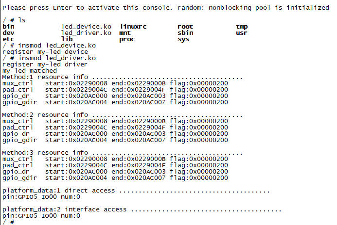

# `platform`平台总线

## 第1章 `platform`总线简介

### 1.1 为什么需要`platform`总线

Linux内核需要引入`platform`总线的主要原因，可以归结为对非标准外设的统一管理，设备驱动模型的解耦优化以及嵌入式系统开发效率的提升。

#### 1.1.1 技术背景

+ SoC外设的非总线特性

`SoC`内部集成的硬件外设(如GPIO、定时器、ADC)通过内存地址直接寻址，无需依赖物理总线(如I2C、USB)。这类设备缺乏统一的总线协议，导致传统设备模型无法直接管理。

+ 传统驱动模型的局限性

早期Linux驱动直接操作硬件寄存器，导致代码与硬件强耦合。例如：同一功能的设备(如不同型号的UART控制器)需要重复编写驱动，维护成本极高。

#### 1.1.2 核心需求:统一性与解耦

+ 虚拟总线整合非标准设备

`platform`总线作为软件抽象层，将分散的`SoC`外设映射到统一的总线框架中，使所有设备(无论是否以来物理总线)都能通过`sysfs`和内核设备模型管理。例如: LED和看门狗定时器被虚拟为`platform`设备，纳入统一的资源分配机制。

+ 设备与驱动的分离

	+ 静态解耦: 通过`platform_device`(设备资源描述)和`platform_driver`(驱动逻辑)的分离，硬件变更只需修改设备注册代码，无需重写驱动。
	
	+ 动态匹配: 总线通过`platform_match()`函数自动匹配设备与驱动(基于名称、ID表或设备树`compatible`属性)，支持热插拔场景。
	
+ 资源管理标准化

	+ 资源(内存地址、中断号)通过`struct resource`描述，驱动通过`platform_get_resource()`接口获取资源，避免硬编码。
	
	+ 统一资源接口提升了代码可移植性，例如同一驱动适配不同SoC时仅需调整设备资源定义。

#### 1.1.3 优势与必要性

+ 提高代码复用与维护性

	+ 一个驱动(如GPIO控制器驱动)可通过`id_table`支持多个设备，减少代码冗余。
	+ 驱动开发分层化: 底层操作硬件寄存器，上层实现通用接口(如字符设备)，简化开发复杂度。
	
+ 动态配置与热插拔支持

	+ 设备树与`platform`总线结合后，支持运行时动态解析硬件设置，适用于模块化嵌入式系统。
	+ 传统无设备树系统仍可以通过注册机制兼容，保留灵活性。
	
+ 统一内核设备模型

	+ `platform`总线填补了linux设备模型中，`非总线设备`的空白，确保所有设备(包括虚拟设备)遵循`bus_type`框架，维护内核架构的完整性。
	+ 支持电源管理、调试接口(sysfs)等扩展功能，增强系统健壮性。
	
#### 1.1.4 应用场景示例

+ SoC内部外设管理: 如三星S3C2440芯片的LCD控制器通过`plaftorm_device`注册资源，驱动通过`probe()`初始化寄存器，并注册帧缓冲设备。
+ 模块化驱动开发: 同一ADC驱动适配多款硬件时，仅需要定义不同的`platform_device`资源，无需修改驱动逻辑。

### 1.2 `platform`的发展过程

#### 1.2.1 早期内核的局限性(Linux 2.6之前)

在Linux 2.6内核之前，嵌入式设备的驱动开发高度依赖硬编码硬件资源(如寄存器地址、中断号)。这种模式导致以下问题：

+ 代码冗余: 同类外设(如多个UART接口)需重复编写驱动逻辑
+ 移植性差: 硬件变更需要直接修改驱动代码，难以适配不同SoC平台
+ 缺乏统一管理: 设备与驱动未分离，无法动态匹配，资源管理分散

#### 1.2.2 Linux 2.6内核的革新: 设备模型与platform总线

从Linux 2.6内核开始，内核通过kobject和kset机制重构了设备模型，并引入platform总线作为虚拟总线，核心变革包括：

+ 虚拟总线抽象: `platform`总线并非物理存在，而是为`SoC`内部外设(如GPIO、看门狗、定时器)提供统一的管理框架。这些设备通过内存直接寻址，无需依赖物理总线(如I2C、SPI)
+ 设备与驱动分离: 通过`platform_device`(设备资源描述)和`platform_driver`(驱动逻辑)分离，硬件信息与驱动逻辑解耦，支持动态匹配。
+ 资源标准化: 使用`struct resource`定义内存、中断等资源，驱动通过`platform_get_resource()`接口获取资源，避免硬编码。

#### 1.2.3 无设备树时代的静态配置

在设备树普及之前，`platform`设备通过C代码静态注册:

+ 板级代码绑定: 设备资源在板级初始化代码中硬编码(如mach-s3c2440/mach-smdk2440.c)，适用于资源固定的嵌入式系统。
+ 名称匹配机制: 设备与驱动通过`name`字段或`id_table`匹配，灵活性有限，但简化了简单外设的管理。

#### 1.2.4 设备树的引入与动态配置

随着嵌入式系统复杂度提升，设备树成为主流，`platform`总线适配动态配置机制:

+ 设备树节点匹配: 通过`compatible`属性与驱动的`of_match_table`匹配，支持运行时解析硬件资源，提升了移植性。
+ 兼容传统模式: 保留静态注册机制，支持无设备树的旧平台。

#### 1.2.5 总结

Linux `platform`总线的演化，体现了内核从硬编码驱动向动态设备模型的转型。其核心价值在于:

+ 虚拟化整合: 将分散的SoC外设纳入统一框架。
+ 标准化接口: 通过设备与驱动分离、资源描述标准化，提高代码可维护性。
+ 兼容性与扩展性: 支持设备树与传统模式，适应不同需求开发。

## 第2章 `platform_device`设备

前面我们介绍了`platform`总线的结构。OK，既然他分为设备和驱动，我们先写一个设备的框架，来测试一下。

### 2.1 `platform_device_register`注册设备

#### 2.1.1 函数作用

`platform_device_register`是Linux内核中用于注册`platform`设备的核心函数。其功能包括:

+ 初始化设备结构体`platform_device`的成员
+ 将设备添加到`platform`总线的设备链表中，触发总线匹配机制
+ 管理设备资源(如内存地址、中断号)，并将其插入系统资源树

#### 2.1.2 函数原型

```c
struct platform_device {
	const char	*name;
	int		id;
	struct device	dev;
	u32		num_resources;
	struct resource	*resource;
	/* ... */
};

int platform_device_register(struct platform_device *pdev);
```

参数: `struct platform_device *pdev`。指向平台设备结构体的指针，要预先定义并初始化以下关键成员。

+ `.name`(必须): 设备名称，用于与驱动匹配。驱动中的`platform_driver.name`或`of_match_table.compatible`要与此一致。

	```c
	.name = "my_device",	// 设备树匹配时，需与驱动中的compatible字段对应
	```

+ `.id`(必须): 设备ID，用于区分同名设备。若仅有1个设备，设为-1；若多个同名设备，需递增(如0、1、2)。

	```c
	.id = -1,  // 单设备默认值
	```

+ `.num_resources`与`.resource`(可选): 描述设备硬件资源(内存地址、中断号)。`num_resources`表示资源数量，`resource`指向资源数组。

	```c
	static struct resource my_res[] = {
		[0] = {  // 内存资源
			.start = 0x10000000,
			.end = 0x10000FFF,
			.flags = IORESOURCE_MEM,
		},
		[1] = {  // 中断资源
			.start = 42,
			.end = 42,
			.flags = IORESOURCE_IRQ,
		}
	};
	.num_resources = ARRAY_SIZE(my_res),
	.resource = my_res,
	```

+ `.dev`(必须): 继承自`struct device`的通用设备模型成员，至少要定义`.release`回调函数。

#### 2.1.3 内部执行流程

```c
int platform_device_register(struct platform_device *pdev)
{
	device_initialize(&pdev->dev);
	return platform_device_add(pdev);
}

int platform_device_add(struct platform_device *pdev)
{
	int i, ret;

	pdev->dev.parent = &platform_bus;
	pdev->dev.bus = &platform_bus_type;

	switch (pdev->id) {
	default:
		dev_set_name(&pdev->dev, "%s.%d", pdev->name,  pdev->id);
		break;
	case -1:
		dev_set_name(&pdev->dev, "%s", pdev->name);
		break;
	}

	for (i = 0; i < pdev->num_resources; i++) {
		struct resource *p, *r = &pdev->resource[i];

		if (r->name == NULL)
			r->name = dev_name(&pdev->dev);

		p = r->parent;
		if (!p) {
			if (resource_type(r) == IORESOURCE_MEM)
				p = &iomem_resource;
			else if (resource_type(r) == IORESOURCE_IO)
				p = &ioport_resource;
		}

		if (p && insert_resource(p, r)) {
			dev_err(&pdev->dev, "failed to claim resource %d\n", i);
			ret = -EBUSY;
			goto failed;
		}
	}

	return device_add(&pdev->dev);
}
```

+ 设备初始化: 调用`device_initialize(&pdev->dev)`初始化设备模型的基础字段(如引用计数)

+ 资源插入: 遍历`pdev->resource`数组，将每个资源插入系统资源树(iomem_resource或ioport_resource)，确保资源冲突检测和管理

+ 设备挂载到总线:
	+ 设置设备的父总线为`platform_bus`，设备出现在`sys/devices/platform`目录下
	+ 调用`device_add`将设备添加到内核设备层级结构，触发总线匹配逻辑

+ 返回值: 0(成功)，负数(失败)

+ 资源管理要点:

	+ 内存资源: 需要通过`ioremap`映射为内核虚拟地址后访问
	+ 中断资源: 在驱动`probe()`函数中，通过`platform_get_irq`获取，并注册中断处理函数

+ 注意事项:

	+ 设备与驱动名称匹配: 驱动与设备的`.name`字段必须完全一致，才能触发`probe()`
	+ `.release`函数必要性: 未实现`.release`会导致模块卸载时内核报错。标准模板:
		
		```c
		static void my_device_release(struct device *dev) {
			// 通过container_of获取包含device的父结构体（如platform_device）
			struct platform_device *pdev = container_of(dev, struct platform_device, dev);
			
			// 释放资源：内存、中断、自定义数据结构等
			kfree(pdev->resource);          // 释放资源数组
			iounmap(reg_base);              // 取消寄存器映射（若在probe中映射）
			kfree(pdev->dev.platform_data); // 释放自定义硬件数据
			kfree(pdev);                    // 释放platform_device自身（动态分配时）
		}
		```
	
	+ 资源冲突检查: 重复注册相同物理地址或中断号的设备，会返回-EBUSY

### 2.2 `platform_device_unregister`注销设备

#### 2.2.1 函数作用

`platform_device_unregister`用于注销已经注册的`platform`设备。主要功能包括:

+ 移除设备节点: 从`platform`总线的设备链表中删除设备，终止总线匹配机制
+ 释放资源: 清理设备占用的内存、寄存器映射、中断等资源，防止内存泄漏
+ 引用计数管理: 减少设备的引用计数，当计数归零时触发设备释放逻辑

#### 2.2.2 函数原型

```c
void platform_device_unregister(struct platform_device *pdev);
```

### 2.3 `struct resource`结构体

`​​struct resource`是Linux内核中，用于描述硬件资源的核心数据结构，主要用于管理设备的内存地址、中断号、IO端口等资源。

#### 2.3.1 结构体成员定义

```c
struct resource {
	resource_size_t start;	// 资源起始地址
	resource_size_t end;	// 资源结束地址
	const char *name;		// 资源名称(用于调试和标识)
	unsigned long flags;	// 资源类型和状态标志
};
```

+ `start和end`: 表示资源的物理地址范围或中断号

	+ 内存: start为起始物理地址，end为结束地址(如0x10000000 ~ 0x1000FFFF)
	+ 中断: start为中断号，end通常与start相同(如start = end = 42)

+ name: 资源的名称字符串(如"PCI IO")，用于调试和日志，开发者自定义

+ flags: 标志位。定义资源类型和特性。常见包括:

	+ IORESOURCE_MEM​: 内存资源。(如寄存器空间)
	+ IORESOURCE_IRQ​: 中断资源。

#### 2.3.2 资源类型与适用场景

| 资源类型 | 典型应用 | 示例代码 |
| - | - | - |
| 内存地址空间 | 寄存器映射 | DEFINE_RES_MEM(0x10000000, 0x1000) |
| 中断号 | 设备中断处理 | DEFINE_RES_IRQ(42) |

#### 2.3.3 实际应用示例

```c
static struct resource i2c_resources[] = {
    [0] = {
        .start  = 0xE0200240,          // 寄存器起始地址
        .end    = 0xE0200240 + 0x1000 - 1,  // 结束地址
        .flags  = IORESOURCE_MEM,      // 内存资源
    },
    [1] = {
        .start  = 42,                  // 中断号
        .flags  = IORESOURCE_IRQ,       // 中断资源
    }
};
```

### 2.4 `platform设备`编程框架

1. 创建`struct platform_device`变量

    + `.name`：必须(与驱动名一致)
    + `.id`: 必须(单设备设为-1)
    + `.num_resources`: 资源数组个数(可设为0)
    + `.resource`: 资源数组指针(可设为NULL)
    + `.dev.release`: 必须设置一个release函数，即使为空函数(不能不设或者设为NULL，否则`rmmod卸载设备时会报错`)

```c
static struct platform_device my_device = {
    .name = "my-led",
    .id = -1,
    .num_resources = 0,
    .resource = NULL,
    .dev = {
        .release = my_release
    },
};

static int __init my_init(void)
{
    platform_device_register(&my_device);
    return 0;
}
```

### 2.5 实例代码

我们要用`platform`总线来点亮LED。先写设备端的代码：

```c
#include <linux/init.h>
#include <linux/module.h>
#include <linux/io.h>
#include <linux/resource.h>
#include <linux/platform_device.h>

static void my_release(struct device *dev)
{
    struct platform_device *pdev = container_of(dev, struct platform_device, dev);
    printk(KERN_INFO "%s device released\n", pdev->name);
}

static struct platform_device my_device = {
    .name = "my-led",
    .id = -1,
    .num_resources = 0,
    .resource = NULL,
    .dev = {
        .release = my_release
    },
};

static int __init my_init(void)
{
    platform_device_register(&my_device);
    printk(KERN_INFO "register %s device\n", my_device.name);
    return 0;
}

static void __exit my_exit(void)
{
    platform_device_unregister(&my_device);
    printk(KERN_INFO "unregister %s device\n", my_device.name);
}

module_init(my_init);
module_exit(my_exit);

MODULE_LICENSE("GPL");
MODULE_AUTHOR("ding");
```

### 2.6 实测结果

执行`insmod`命令，加载`platform设备`后，在`/sys/bus/platform/devices`目录下，生成了我们注册的`platform`设备。


## 第3章 `platform_driver`驱动

前面已经完成了`platform设备`，接下来开始写`platform驱动`。

### 3.1 `platform_driver_register`注册驱动

`platform_driver_register`是Linux内核中，用于注册平台设备驱动的核心函数，属于`platform`总线模型的一部分。它的作用是将一个驱动描述符关联到虚拟的`platform`总线上，实现驱动与设备的动态匹配。

#### 3.1.1 函数原型

```c
int platform_driver_register(struct platform_driver *pdrv);
```

+ 返回值: 0(成功)，负数(失败)
+ 参数`struct platform_driver *pdrv`: 我们要实现的驱动

#### 3.1.2 `struct platform_driver 结构体`

这是我们写`platform驱动`要实现的结构体，注册驱动本质上就是注册这个结构体。

```c
struct platform_driver {
	int (*probe)(struct platform_device *);
	int (*remove)(struct platform_device *);
	void (*shutdown)(struct platform_device *);
	int (*suspend)(struct platform_device *, pm_message_t state);
	int (*resume)(struct platform_device *);
	struct device_driver driver;
	const struct platform_device_id *id_table;
};
```

1. `probe`函数

	+ 作用: 当驱动与设备匹配成功后调用，用于初始化硬件资源(寄存器映射、中断注册)
	+ 触发条件: 通过设备树匹配(`.of_match_table`)、`id_table`匹配、名称匹配(.driver.name)
	
2. `remove`函数

	+ 作用: 驱动卸载或设备移除时调用，释放资源(如iounmap、中断注销)
	+ 注意事项: 需确保多次调用不会引发错误

3. `shutdown、suspend、resume`函数

	+ 作用: 电源管理相关回调，分别作用域设备关闭、休眠和唤醒时的状态管理

4. `driver`成员

	+ 类型: `struct device_driver`，包含驱动的通用属性
	
		+ `.name`: 驱动名称，用于与传统非设备树设备匹配
		+ `.of_match_table`: 设备树兼容性匹配表，用于设备树场景

5. `id_table`成员: 结尾需要有一个`{}`标识结束，`Sentinel`是哨兵的意思

	+ 类型: `struct platform_device_id 数组`，定义驱动支持的设备名称列表(非设备树场景)
	+ 示例:
	
		```c
		static const struct platform_device_id my_id_table[] = {
			{ .name = "device_v1" },
			{ .name = "device_v2" },
			{ /* Sentinel */ }
		};
		```

#### 3.1.3 设计要点与使用场景

1. 设备匹配机制

	+ 优先级: 设备树兼容性匹配(.of_match_table) -> `.id_table` -> 名称匹配(.driver.name)
	+ 设备树示例: 设备树节点需包含`compatible = "vendor,device-name"`，以匹配驱动的`.of_match_table`

2. 资源管理

	+ 自动释放: 推荐使用`devm_`系列函数(如devm_ioremap_resource)自动释放资源，避免remove函数遗漏
	+ 资源获取: 通过`platform_get_resource()`获取设备的内存、中断等资源
	
3. 典型使用流程

	```c
	static struct platform_driver my_driver = {
		.probe = my_probe,
		.remove = my_remove,
		.driver = {
			.name = "my_device",
			.of_match_table = my_of_match,
		},
		.id_table = my_devices,
	};

	module_platform_driver(my_driver);  // 自动生成 init/exit 函数
	```

### 3.2 `platform_driver_unregister`注销驱动

函数原型

```c
int platform_driver_unregister(struct platform_driver *pdrv);
```

+ 返回值: 0(成功)，负数(失败)

### 3.3 `platform驱动`编程框架

1. 创建`struct platform_driver`变量

    + `.probe`：必须(匹配成功调用)
    + `.remove`: 必须(卸载驱动时调用)
    + `.driver.name`: 必须(驱动名，要与设备名一致)
    + `..driver.omner`: 必须(设为THIS_MODULE)
    + `.id_table`: 必须
	
```c
static int my_probe(struct platform_device *pdev)
{
    printk(KERN_INFO "%s probe\n", pdev->name);
    return 0;
}

static int my_remove(struct platform_device *pdev)
{
    printk(KERN_INFO "%s remove\n", pdev->name);
    return 0;
}

const struct platform_device_id my_id_table[] = {
    { .name = "my-led" },
    { /* sentinel */ }
};

static struct platform_driver my_driver = {
    .probe  = my_probe,
    .remove = my_remove,
    .driver = {
        .name = "my-led",
        .owner = THIS_MODULE
    },
    .id_table = my_id_table
};

static int __init my_init(void)
{
    platform_driver_register(&my_driver);
    return 0;
}
```

### 3.4 实测代码

#### 3.4.1 `led_device.c`

```c
#include <linux/init.h>
#include <linux/module.h>
#include <linux/io.h>
#include <linux/resource.h>
#include <linux/platform_device.h>

static void my_release(struct device *dev)
{
    struct platform_device *pdev = container_of(dev, struct platform_device, dev);
    printk(KERN_INFO "%s device released\n", pdev->name);
}

static struct platform_device my_device = {
    .name = "my-led",
    .id = -1,
    .num_resources = 0,
    .resource = NULL,
    .dev = {
        .release = my_release
    },
};

static int __init my_init(void)
{
    printk(KERN_INFO "register %s device\n", my_device.name);
    platform_device_register(&my_device);
    return 0;
}

static void __exit my_exit(void)
{
    platform_device_unregister(&my_device);
    printk(KERN_INFO "unregister %s device\n", my_device.name);
}

module_init(my_init);
module_exit(my_exit);

MODULE_LICENSE("GPL");
MODULE_AUTHOR("ding");
```

#### 3.4.2 `led_driver.c`

```c
#include <linux/init.h>
#include <linux/module.h>
#include <linux/io.h>
#include <linux/resource.h>
#include <linux/platform_device.h>

static int my_probe(struct platform_device *pdev)
{
    printk(KERN_INFO "%s probe\n", pdev->name);
    return 0;
}

static int my_remove(struct platform_device *pdev)
{
    printk(KERN_INFO "%s remove\n", pdev->name);
    return 0;
}

const struct platform_device_id my_id_table[] = {
    { .name = "my-led" },
    { /* sentinel */ }
};

static struct platform_driver my_driver = {
    .probe  = my_probe,
    .remove = my_remove,
    .driver = {
        .name = "my-led",
        .owner = THIS_MODULE
    },
    .id_table = my_id_table
};

static int __init my_init(void)
{
    printk(KERN_INFO "register %s driver\n", my_driver.driver.name);
    platform_driver_register(&my_driver);
    return 0;
}

static void __exit my_exit(void)
{
    platform_driver_unregister(&my_driver);
    printk(KERN_INFO "unregister %s driver\n", my_driver.driver.name);
}

module_init(my_init);
module_exit(my_exit);

MODULE_LICENSE("GPL");
MODULE_AUTHOR("ding");
```

#### 3.4.3 `Makefile`

```Makefile
# 生成目标
TARGET := led_device led_driver

obj-m += $(patsubst %, %.o, $(TARGET))

# 交叉编译工具链
CROSS_COMPILE ?= /usr/local/arm/gcc-linaro-4.9.4-2017.01-x86_64_arm-linux-gnueabihf/bin/arm-linux-gnueabihf-

# 编译路径
PWD  ?= $(shell pwd)
KDIR ?= /home/ding/linux/imx/kernel

# 编译规则
all:
	make -C $(KDIR) M=$(PWD) modules

clean:
	make -C $(KDIR) M=$(PWD) clean

copy:
	rm -f /home/ding/net/nfs/rootfs/*.ko
	cp *.ko /home/ding/net/nfs/rootfs
```

### 3.5 测试结果


## 第4章 `probe函数获取resource资源`

前面我们已经写了`platform设备`和`platform`驱动的软件框架，实测可以匹配成功。现在要做什么呢？

**现在要来操作硬件资源。所以，我们要在`platform设备`中定义资源，`platform驱动中获取资源`。**

### 4.1 `platform设备`定义资源

```c
/* KEY: SNVS_TAMPER0(GPIO5_IO00) */
#define MUX_CTRL_BASE   0X02290008
#define PAD_CTRL_BASE   0X0229004C
#define GPIO_DR_BASE    0x020AC000
#define GPIO_GDIR_BASE  0x020AC004

static struct resource my_res[] = {
    [0] = {
        .start  = MUX_CTRL_BASE,
        .end    = MUX_CTRL_BASE + 4 - 1,
        .flags  = IORESOURCE_MEM,
        .name   = "mux_ctrl"
    },
    [1] = {
        .start  = PAD_CTRL_BASE,
        .end    = PAD_CTRL_BASE + 4 - 1,
        .flags  = IORESOURCE_MEM,
        .name   = "pad_ctrl"
    },
    [2] = {
        .start  = GPIO_DR_BASE,
        .end    = GPIO_DR_BASE + 4 - 1,
        .flags  = IORESOURCE_MEM,
        .name   = "gpio_dr"
    },
    [3] = {
        .start  = GPIO_GDIR_BASE,
        .end    = GPIO_GDIR_BASE + 4 - 1,
        .flags  = IORESOURCE_MEM,
        .name   = "gpio_gdir"
    }
};

static void my_release(struct device *dev)
{
    struct platform_device *pdev = container_of(dev, struct platform_device, dev);
    printk(KERN_INFO "%s device released\n", pdev->name);
}

static struct platform_device my_device = {
    .name = "my-led",
    .id = -1,
    .num_resources = ARRAY_SIZE(my_res),
    .resource = my_res,
    .dev = {
        .release = my_release
    },
};
```

### 4.2 `platform驱动`获取资源

4.1节已经在`platform设备`中定义了资源，那么`platform驱动`就可以使用这些资源。在哪里使用呢？

**考虑一下流程，如果设备和驱动匹配了，就会调用`probe`函数。这个函数的原型: `int (*probe)(struct platform_device *pdev)`。没错，内核把`platform设备`中定义了资源作为入参传给`probe`函数了，所以`probe`函数可以直接访问结构体来获取资源。**

#### 4.2.1 直接访问`platform_device的resource数组`

示例代码：

```c
static int my_probe(struct platform_device *pdev)
{
    int i;
    struct resource	*res;
    printk(KERN_INFO "%s matched\n", pdev->name);

    printk(KERN_INFO "Method:1 resource info .......................................\n");
    for (i = 0; i < pdev->num_resources; i++) {
        res = &pdev->resource[i];
        printk(KERN_INFO "%-10s start:0x%08X end:0x%08X flag:0x%08X\n", res->name, res->start, res->end, res->flags);
    }
	
    return 0;
}
```

#### 4.2.2 使用`platform_get_resource()`函数，按resource数组索引获取

+ 函数原型

```c
struct resource *platform_get_resource(struct platform_device *dev,unsigned int type, unsigned int num);
```

+ 参数解析

	+ `dev`: `platform_device`指针，也就是`probe()`函数的入参
	+ `type`: 资源类型。指定需要获取的资源类型，常见类型包括:

		+ `IORESOURCE_MEM`: 内存资源(如寄存器地址范围)
		+ `IORESOURCE_IRQ`: 中断资源
		
	+ `num`: 资源索引号。就是数组下标，从0开始

+ 返回值: 成功时返回指向`struct resource`的指针，失败返回NULL

+ 资源匹配机制

函数内部的实现逻辑时，检查`pdev->resource`数组，对应索引的类型。如果索引和类型匹配，则返回该资源

```c
static int my_probe(struct platform_device *pdev)
{
    int i;
    struct resource	*res;
    printk(KERN_INFO "%s matched\n", pdev->name);

    printk(KERN_INFO "\nMethod:2 resource info .......................................\n");
    for (i = 0; i < pdev->num_resources; i++) {
        res = platform_get_resource(pdev, IORESOURCE_MEM, i);
        printk(KERN_INFO "%-10s start:0x%08X end:0x%08X flag:0x%08X\n", res->name, res->start, res->end, res->flags);
    }
    
    return 0;
}
```

#### 4.2.3 使用`platform_get_resource_byname()`函数，按resource数组成员的名称获取

+ 函数原型

```c
struct resource *platform_get_resource_byname(struct platform_device *dev, unsigned int type, const char *name);
```

+ 参数解析

	+ `dev`: `platform_device`指针，也就是`probe()`函数的入参
	+ `type`: 资源类型。指定需要获取的资源类型，常见类型包括:

		+ `IORESOURCE_MEM`: 内存资源(如寄存器地址范围)
		+ `IORESOURCE_IRQ`: 中断资源
		
	+ 资源的名称标识符，需与`struct resource`中定义的`.name`字段完全匹配

+ 返回值: 成功时返回指向`struct resource`的指针，失败返回NULL

```c
static int my_probe(struct platform_device *pdev)
{
    int i;
    struct resource	*res;
    printk(KERN_INFO "%s matched\n", pdev->name);

    printk(KERN_INFO "\nMethod:3 resource info .......................................\n");
    res = platform_get_resource_byname(pdev, IORESOURCE_MEM, "mux_ctrl");
    printk(KERN_INFO "%-10s start:0x%08X end:0x%08X flag:0x%08X\n", res->name, res->start, res->end, res->flags);
    res = platform_get_resource_byname(pdev, IORESOURCE_MEM, "pad_ctrl");
    printk(KERN_INFO "%-10s start:0x%08X end:0x%08X flag:0x%08X\n", res->name, res->start, res->end, res->flags);
    res = platform_get_resource_byname(pdev, IORESOURCE_MEM, "gpio_dr");
    printk(KERN_INFO "%-10s start:0x%08X end:0x%08X flag:0x%08X\n", res->name, res->start, res->end, res->flags);
    res = platform_get_resource_byname(pdev, IORESOURCE_MEM, "gpio_gdir");
    printk(KERN_INFO "%-10s start:0x%08X end:0x%08X flag:0x%08X\n", res->name, res->start, res->end, res->flags);

    return 0;
}
```

### 4.3 实例代码

#### 4.3.1 `platform设备`

```c
#include <linux/init.h>
#include <linux/module.h>
#include <linux/io.h>
#include <linux/resource.h>
#include <linux/platform_device.h>

/* KEY: SNVS_TAMPER0(GPIO5_IO00) */
#define MUX_CTRL_BASE   0X02290008
#define PAD_CTRL_BASE   0X0229004C
#define GPIO_DR_BASE    0x020AC000
#define GPIO_GDIR_BASE  0x020AC004

static struct resource my_res[] = {
    [0] = {
        .start  = MUX_CTRL_BASE,
        .end    = MUX_CTRL_BASE + 4 - 1,
        .flags  = IORESOURCE_MEM,
        .name   = "mux_ctrl"
    },
    [1] = {
        .start  = PAD_CTRL_BASE,
        .end    = PAD_CTRL_BASE + 4 - 1,
        .flags  = IORESOURCE_MEM,
        .name   = "pad_ctrl"
    },
    [2] = {
        .start  = GPIO_DR_BASE,
        .end    = GPIO_DR_BASE + 4 - 1,
        .flags  = IORESOURCE_MEM,
        .name   = "gpio_dr"
    },
    [3] = {
        .start  = GPIO_GDIR_BASE,
        .end    = GPIO_GDIR_BASE + 4 - 1,
        .flags  = IORESOURCE_MEM,
        .name   = "gpio_gdir"
    }
};

static void my_release(struct device *dev)
{
    struct platform_device *pdev = container_of(dev, struct platform_device, dev);
    printk(KERN_INFO "%s device released\n", pdev->name);
}

static struct platform_device my_device = {
    .name = "my-led",
    .id = -1,
    .num_resources = ARRAY_SIZE(my_res),
    .resource = my_res,
    .dev = {
        .release = my_release
    },
};

static int __init my_init(void)
{
    printk(KERN_INFO "register %s device\n", my_device.name);
    platform_device_register(&my_device);
    return 0;
}

static void __exit my_exit(void)
{
    platform_device_unregister(&my_device);
    printk(KERN_INFO "unregister %s device\n", my_device.name);
}

module_init(my_init);
module_exit(my_exit);

MODULE_LICENSE("GPL");
MODULE_AUTHOR("ding");
```

#### 4.3.2 `platform驱动`

```c
#include <linux/init.h>
#include <linux/module.h>
#include <linux/io.h>
#include <linux/resource.h>
#include <linux/platform_device.h>

static int my_probe(struct platform_device *pdev)
{
    int i;
    struct resource	*res;
    printk(KERN_INFO "%s matched\n", pdev->name);

    printk(KERN_INFO "Method:1 resource info .......................................\n");
    for (i = 0; i < pdev->num_resources; i++) {
        res = &pdev->resource[i];
        printk(KERN_INFO "%-10s start:0x%08X end:0x%08X flag:0x%08X\n", res->name, res->start, res->end, res->flags);
    }
    
    printk(KERN_INFO "\nMethod:2 resource info .......................................\n");
    for (i = 0; i < pdev->num_resources; i++) {
        res = platform_get_resource(pdev, IORESOURCE_MEM, i);
        printk(KERN_INFO "%-10s start:0x%08X end:0x%08X flag:0x%08X\n", res->name, res->start, res->end, res->flags);
    }
    
    printk(KERN_INFO "\nMethod:3 resource info .......................................\n");
    res = platform_get_resource_byname(pdev, IORESOURCE_MEM, "mux_ctrl");
    printk(KERN_INFO "%-10s start:0x%08X end:0x%08X flag:0x%08X\n", res->name, res->start, res->end, res->flags);
    res = platform_get_resource_byname(pdev, IORESOURCE_MEM, "pad_ctrl");
    printk(KERN_INFO "%-10s start:0x%08X end:0x%08X flag:0x%08X\n", res->name, res->start, res->end, res->flags);
    res = platform_get_resource_byname(pdev, IORESOURCE_MEM, "gpio_dr");
    printk(KERN_INFO "%-10s start:0x%08X end:0x%08X flag:0x%08X\n", res->name, res->start, res->end, res->flags);
    res = platform_get_resource_byname(pdev, IORESOURCE_MEM, "gpio_gdir");
    printk(KERN_INFO "%-10s start:0x%08X end:0x%08X flag:0x%08X\n", res->name, res->start, res->end, res->flags);

    return 0;
}

static int my_remove(struct platform_device *pdev)
{
    printk(KERN_INFO "%s remove\n", pdev->name);
    return 0;
}

const struct platform_device_id my_id_table[] = {
    { .name = "my-led" },
    { /* sentinel */ }
};

static struct platform_driver my_driver = {
    .probe  = my_probe,
    .remove = my_remove,
    .driver = {
        .name = "my-led",
        .owner = THIS_MODULE
    },
    .id_table = my_id_table
};

static int __init my_init(void)
{
    printk(KERN_INFO "register %s driver\n", my_driver.driver.name);
    platform_driver_register(&my_driver);
    return 0;
}

static void __exit my_exit(void)
{
    platform_driver_unregister(&my_driver);
    printk(KERN_INFO "unregister %s driver\n", my_driver.driver.name);
}

module_init(my_init);
module_exit(my_exit);

MODULE_LICENSE("GPL");
MODULE_AUTHOR("ding");
```

### 4.4 实测结果

实测3种方式，获取到的资源内容一致。



