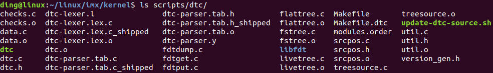
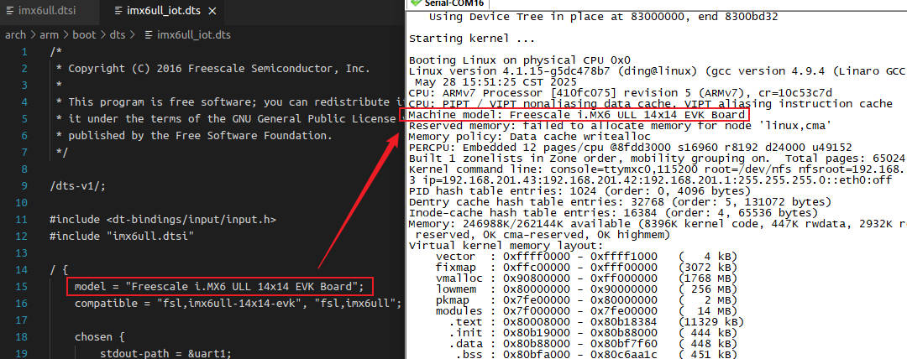
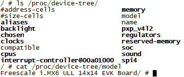
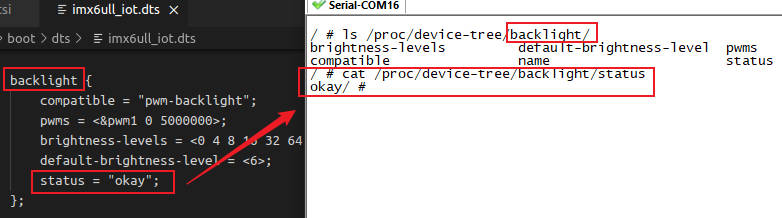

# 设备树

## 第1章 初识设备树

ARM Linux设备树的由来，可追溯到早期嵌入式系统开发中，硬件描述与内核代码高度耦合的问题。

### 1.1 `前设备树时代: 硬件描述的内核硬编码`

在设备树出现前，ARM架构的Linux内核通过板级支持代码，直接硬编码硬件信息。例如: 

+ 代码冗余: 同一SoC(如三星S3C6410)用于不同开发板时，需在`arch/arm/mach-*`目录下重复编写GPIO、时钟等配置代码
+ 内核臃肿: `arch/arm/plat-xxx`和`arch/arm/mach-xxx`目录充斥大量硬件描述，导致内核体积膨胀，维护困难
+ 可移植性差: 硬件变更需重新修改编译内核，无法实现同一内核镜像适配多硬件平台

### 1.2 `设备树的起源: PowerPC架构的探索`

设备树的核心思想，源自`PowerPC`架构的实践:

1. 技术突破: 2005年前后，PowerPC社区提出了设备树规范，将硬件信息独立为树形结构(.dts)文件，由Bootloader传递至内核，实现硬件描述与内核解耦
2. 优势验证: 该机制显著减少了内核冗余代码，验证了设备树在嵌入式系统中的可行性

### 1.3 ARM社区的转折: `Linux Torvalds`的推动

2011年，ARM架构面临重大转折:

+ `Linus的批评`: Linux创始人`Linux Torvalds`公开批评ARM内核的混乱状态，指出板级代码的维护成本过高
+ 技术选型: ARM社区借鉴PowerPC的经验，于2012连正式引入设备树机制
	+ `Linux 3.7版本(2012年)`: 全面支持设备树，要求新提交的ARM代码必须使用设备树
	+ `Linux 3.10版本(2013)年`: 移除大量旧版Board File(如arch/arm/plat-samsung)，强制采用设备树
	
### 1.4 设备树的标准化与扩展

2014年后，设备树逐步称为AEM生态的通用标准:

1. 规范统一: 由`devicetree.org`维护，定义节点、属性等语法规则
2. 工具链完善: DTC(`Device Tree Compiler`)，将`.dts`源文件编译为二进制`.dtb`，供内核解析
3. 跨架构推广: 除ARM外，设备树被MIPS、PISC-V架构采用，成为嵌入式Linux的通用硬件描述方案

### 1.5 设备树的核心价值

1. 解耦硬件与内核: 硬件信息以文本格式独立存储，修改硬件配置无需重新编译内核
2. 提升可维护性: 通过`.dtsi`文件复用公共硬件描述，减少代码冗余(如SoC与板级分离)
3. 支持异构计算: 与x86的ACPI互补，推动ARM服务器与边缘计算设备的统一管理

### 1.6 案例说明

以树莓派为例，其设备树文件(bcm2711-rpi-4-b.dts)描述了CPU、内存、GPIO控制器等信息。同一内核镜像通过加载不同的.dtb文件，即可适配树莓派3/4/5等多代硬件，体现了设备树的灵活性与可扩展性。

## 第2章 设备树基础知识

### 2.1 `dts`、`dtsi`、`dtb`、`dtc`

当描述设备树时，通常会提到以下几个关键术语: `dts`、`dtsi`、`dtb`、`dtc`。下面分别介绍:

1. DTS(`Device Tree Source`): DTS是设备树的源文件，采用一种类似于文本的语法来描述硬件设备的结构、属性和连接关系。DTS 文件以`.dts`为扩展名，通常由开发人员编写。它是人类可读的形式，用于描述设备树的层次结构和属性信息

2. DTSI(`Device Tree Source Include`): DTSI文件是设备树源文件的包含文件。它扩展了DTS文件的功能，用于定义可重用的设备树片段。DTSI 文件以`.dtsi`为扩展名，可以在多个DTS文件中包含和共享。通过使用DTSI，可以提高设备树的可重用性和可维护性（和C 语言中头文件的作用相同）

3. DTB(`Device Tree Blob`): DTB是设备树的二进制表示形式。DTB文件是通过将DTS或DTSI文件编译而成的二进制文件，以`.dtb`为扩展名。DTB文件包含了设备树的结构、属性和连接信息，被操作系统加载和解析。在运行时，操作系统使用DTB文件来动态识别和管理硬件设备

4. DTC(`Device Tree Compiler`): DTC是设备树的编译器。它是一个命令行工具，用于将DTS和DTSI文件编译成DTB 文件。DTC将文本格式的设备树源代码转换为二进制的设备树表示形式，以便操作系统能够加载和解析。DTC是设备树开发中一个重要的工具

DTS、DTSI、DTB 和DTC之间的关系：


### 2.2 设备树文件存放路径

ARM体系结构下的设备树源文件，通常存放在内核源码`arch/arm/boot/dts`目录中。如下所示:

```sh
ding@linux:~/linux/imx/kernel/arch/arm/boot/dts$ pwd
/home/ding/linux/imx/kernel/arch/arm/boot/dts
ding@linux:~/linux/imx/kernel/arch/arm/boot/dts$ ls imx6ull*
imx6ull-14x14-ddr3-arm2-adc.dtb        imx6ull-14x14-ddr3-arm2-ldo.dtb       imx6ull-14x14-evk-emmc.dtb
imx6ull-14x14-ddr3-arm2-adc.dts        imx6ull-14x14-ddr3-arm2-ldo.dts       imx6ull-14x14-evk-emmc.dts
imx6ull-14x14-ddr3-arm2-cs42888.dtb    imx6ull-14x14-ddr3-arm2-qspi-all.dtb  imx6ull-14x14-evk-gpmi-weim.dtb
imx6ull-14x14-ddr3-arm2-cs42888.dts    imx6ull-14x14-ddr3-arm2-qspi-all.dts  imx6ull-14x14-evk-gpmi-weim.dts
imx6ull-14x14-ddr3-arm2.dtb            imx6ull-14x14-ddr3-arm2-qspi.dtb      imx6ull-14x14-evk-usb-certi.dtb
imx6ull-14x14-ddr3-arm2.dts            imx6ull-14x14-ddr3-arm2-qspi.dts      imx6ull-14x14-evk-usb-certi.dts
imx6ull-14x14-ddr3-arm2-ecspi.dtb      imx6ull-14x14-ddr3-arm2-tsc.dtb       imx6ull-9x9-evk-btwifi.dtb
imx6ull-14x14-ddr3-arm2-ecspi.dts      imx6ull-14x14-ddr3-arm2-tsc.dts       imx6ull-9x9-evk-btwifi.dts
imx6ull-14x14-ddr3-arm2-emmc.dtb       imx6ull-14x14-ddr3-arm2-uart2.dtb     imx6ull-9x9-evk.dtb
imx6ull-14x14-ddr3-arm2-emmc.dts       imx6ull-14x14-ddr3-arm2-uart2.dts     imx6ull-9x9-evk.dts
imx6ull-14x14-ddr3-arm2-epdc.dtb       imx6ull-14x14-ddr3-arm2-usb.dtb       imx6ull-9x9-evk-ldo.dtb
imx6ull-14x14-ddr3-arm2-epdc.dts       imx6ull-14x14-ddr3-arm2-usb.dts       imx6ull-9x9-evk-ldo.dts
imx6ull-14x14-ddr3-arm2-flexcan2.dtb   imx6ull-14x14-ddr3-arm2-wm8958.dtb    imx6ull.dtsi
imx6ull-14x14-ddr3-arm2-flexcan2.dts   imx6ull-14x14-ddr3-arm2-wm8958.dts    imx6ull_iot.dtb
imx6ull-14x14-ddr3-arm2-gpmi-weim.dtb  imx6ull-14x14-evk-btwifi.dtb          imx6ull_iot.dts
imx6ull-14x14-ddr3-arm2-gpmi-weim.dts  imx6ull-14x14-evk-btwifi.dts          imx6ull-pinfunc.h
imx6ull-14x14-ddr3-arm2-lcdif.dtb      imx6ull-14x14-evk.dtb                 imx6ull-pinfunc-snvs.h
imx6ull-14x14-ddr3-arm2-lcdif.dts      imx6ull-14x14-evk.dts
```

### 2.3 设备树的编译

在ARM Linux系统中，设备树(`Device-Tree`)的编译，是将设备树源文件`.dts`转换成二进制文件(.dtb)的过程，以便内核或引导加载程序识别硬件配置。以下是完整的编译流程及关键步骤：

#### 2.3.1 编译器`DTC`

在Linux内核源码中，`DTC`的源代码和相关工具，通常存放在`scripts/dtc`目录中，如下图所示：



在编译完源码后，`dtc`设备树编译器会默认生成。

#### 2.3.2 设备树的编译

设备树有2种编译方式:

1. 内核集中编译(推荐): 通过内核构建系统自动编译所有配置的设备树
2. 单独编译特定设备树: 针对单个`.dts`文件编译

##### 2.3.2.1 内核集中编译(推荐)

进入内核源码目录，执行命令:

```sh
make dtbs	# 编译所有设备树
```

+ 输出路径: 编译后的`.dtb`文件，默认生成在`arch/arm/boot/dts`目录下

##### 2.3.2.2 单独编译特定设备树

针对单个`.dts`文件编译:

```sh
dtc -I dts -O dtb -o output.dtb input.dts
```

下面举例。我们写一个最简单的设备树框架来编译:

```dts
/dts-v1/;
/{

};
```

编译如下:

```sh
ding@linux:~/linux/imx/driver/ch6_device_tree/01_base_dts$ ~/linux/imx/kernel/scripts/dtc/dtc -I dts -O dtb -o test.dtb test.dts
ding@linux:~/linux/imx/driver/ch6_device_tree/01_base_dts$ ls
test.dtb  test.dts
```

其中，`input.dts`是输入的设备树源文件，`output.dtb`是编译后的二进制设备树文件

##### 2.3.2.3 设备树的反编译

设备树的反编译，是将二进制设备树文件转换回设备树源文件的过程，以便进行查看、编辑或修改。饭编译器通常也是DTC。

```sh
dtc -I dtb -O dts -o output.dts input.dtb
```

其中，`input.dtb`是输入的二进制设备树文件，`output.dts`是反编译后的设备树源文件

下面举例，我们对上面编译的二进制设备树，进行反编译。可以看到，反编译之后的设备树，与源码一致。

```sh
ding@linux:~/linux/imx/driver/ch6_device_tree/01_base_dts$ ~/linux/imx/kernel/scripts/dtc/dtc -I dtb -O dts -o 1.dts test.dtb 
ding@linux:~/linux/imx/driver/ch6_device_tree/01_base_dts$ cat 1.dts 
/dts-v1/;

/ {
};
```

## 第3章 设备树基本语法

### 3.1 根节点

根节点是整个设备树的起点和顶层节点，代表整个硬件系统平台。

**根节点由`/`开头的标识符来表示，然后使用`{}`来包含根节点所在的内容。**

一个最简单的根节点实例：

```dts
/dts-v1/;	// 设备树版本信息
/{
	// 根节点开始
	
	/*
	在这里可以添加注释，描述根节点的属性和配置
	*/
};
```

下面我们来逐一解释这个根节点模板。

#### 3.1.1 `/dts-v1/;`

在ARM Linux设备树中，`/dts-v1/;`是一个必选的版本声明指令，位域设备树源文件的开头，用于指定设备树语法的版本。

+ 核心作用与语法规范

	1. 版本声明

		+ `/dts-v1/`表示当前文件遵循`设备树语法版本1`
		+ 这是设备树编译器的标准要求，用于确保语法兼容性。若省略或版本不匹配，可能导致编译错误或解析失败
		
	2. 位置要求: 必须置于文件首行，且不允许在任何节点或属性之后。

		```dts
		/dts-v1/;  // 正确：首行声明
		/ {
			// 根节点及子节点定义
		};
		```

+ 常见问题与注意事项

	1. 编译错误场景: 若未在首行声明`/dts-v1/;`，`dtc`会报语法错误，提示版本缺失
	2. 历史兼容性：
		+ 早期内核(如Linux 2.6)未强制要求此声明，但Linux 3.x及以上版本的设备树文件必须包含
		+ 现代工具链(如uboot和内核的make dtbs)会严格校验
	
+ 实际应用示例

	典型的设备树文件架构如下：

	```dts
	/dts-v1/;                          // 版本声明（首行）
	#include "soc-base.dtsi"           // 包含公共硬件描述
	#include "custom-board.dtsi"        // 包含板级配置

	/ {                                 // 根节点
		compatible = "vendor,board-x";  // 平台标识
		memory@80000000 {               // 内存节点
			reg = <0x80000000 0x20000000>; // 512MB内存
		};
		uart0: serial@101f0000 {        // 串口设备
			compatible = "ns16550a";
			reg = <0x101f0000 0x1000>;
		};
	};
	```

#### 3.1.2 `/ {};`语法解析

##### 3.1.2.1 根节点符号解析

1. `/`的含义

	+ 根节点标识: `/`标识设备树的顶级节点，代表整个硬件系统平台
	+ 路径起点：类似文件系统的根目录，所有子节点均从`/`派生，形成树状结构
	+ 唯一性： 每个设备树文件有且仅有一个根节点，所有硬件描述均嵌套在其下
	
2. `{}`的含义

	+ 作用域包裹：大括号`{}`定义根节点的作用范围，内部包含根节点的属性和子节点
	
##### 3.1.2.2 根节点的核心作用

1. 系统级描述

	+ 平台标识：通过`compatible`属性匹配内核支持的硬件平台(如`"fsl,imx6ull"`)
	+ 型号定义：`model`属性声明具体板卡型号(如`"Freescale i.MX6ULL Board"`)

2. 资源规范

	+ 地址/长度编码：`#address-cells`和`#size-cell`属性定义子节点reg的地址和长度字段地址格式(如`<1>标识1个u32整数`)
	+ 内存布局：`memory`子节点描述物理内存范围(如reg = <0x80000000 0x20000000>表示512MB内存)
	
#### 3.1.3 根节点结构示例

```dts
/dts-v1/;	// 设备树版本声明（必须首行）
/ {			// 根节点开始
    compatible = "vendor,board-x"; 
    model = "My Hardware Platform";
    #address-cells = <1>;        // 子节点地址字段占1个u32
    #size-cells = <1>;           // 子节点长度字段占1个u32

    memory@80000000 {            // 内存子节点
        device_type = "memory";
        reg = <0x80000000 0x20000000>;  // 起始地址0x80000000，大小512MB
    };
};			// 根节点结束
```
	
### 3.2 子节点

子节点是根节点的直接子项，用于描述具体的硬件设备或设备集合。格式如下：

```dts
[label]: node-name@[unit-address] {
	[properties definitions]
	[child nodes]
};
```

以下是对这些部分的详细介绍：

1. `节点标签label:`: 可选。节点标签用于简化节点引用，增强可维护性的关键语法。

	+ 标签的核心作用

		1. 跨节点引用，避免重复书写长路径。例如：
		
			```dts
			// 定义标签
			uart1: serial@20200000 { ... };

			// 引用标签
			aliases {
				serial0 = &uart1;  // 等价于引用 "/serial@20200000"
			};
			```
			
		2. 属性覆盖与动态配置，在板级设备树`.dts`中覆盖芯片通用配置`.dtsi`。例如：
		
			```dts
			// 芯片级dtsi定义
			uart1: serial@20200000 {
				status = "disabled";
			};

			// 板级dts覆盖
			&uart1 {
				status = "okay";       // 启用设备
				pinctrl-0 = <&uart1_pins>; // 追加引脚配置
			};
			```
			
			此机制实现硬件配置的模块化，无需修改原始定义。
			
		3. 中断控制器关联，简化中断父节点指定。例如：
		
			```dts
			intc: interrupt-controller@10140000 { ... };

			serial@101f0000 {
				interrupts = <0 13 4>;
				interrupt-parent = &intc; // 引用中断控制器
			};
			```
		
			避免路径硬编码，如`interrupt-controller@10140000`
		
	+ 设计规范与常见错误

		| 场景 | 正确实践 | 典型错误 |
		| - | - | - |
		| 标签命名 | 全局唯一(如i2c0) | 重复定义uart1导致引用错误 |
		| 标签引用顺序 | 先定义后引用 | 未定义即引用(编译报错) |
		| 属性覆盖 | 在板级`.dts`中追加 | 错误覆盖reg等关键属性 |
		| 中断控制器关联 | 用`interrupt-parent = &intc` | 直接写路径导致可移植性差 |

2. `节点名称node-name`: 必须要有。节点名称的作用如下：

	+ 用于描述设备的功能或类型，需要简洁且符合规范

		+ 命令规则: 小写字母+短横线(如ethernet、iomuxc-gpio)
		+ 长度限制：`1~31`个字符，仅允许数字、字母及短横线
		+ 典型名称：cpu、memory、i2c、spi(反映设备类别)

	+ 与驱动解耦

		节点名称不直接参与驱动匹配，驱动通过`compatible`属性识别设备。名称主要用于可读性。

3. `单元地址unit-address`：可选。单元地址的作用如下：

	+ 硬件寻址标识：单元地址用于区分同类型设备的多个实例。通常有2类：物理寄存器地址，逻辑编号。

		+ 物理基地址：如串口控制器`serial@20200000`，对应的寄存器基地址为0x20200000
		+ 逻辑编号：如CPU核序号。cpu@0，cpu@1，无实际地址时用序号
		
	+ 与reg属性关联

		子节点的单元地址，必须与子节点的reg属性的首地址一致。例如：
		
		```dts
		uart@20200000 {  // 单元地址=reg的首地址
			reg = <0x20200000 0x1000>;
		};
		```

		若节点没有reg属性，单元地址必须省略。
	
4. 典型使用场景

	1. 区分多实例设备
		
		+ CPU核：cpu@0，cpu@1 (逻辑编号)
		+ 内存区域：memory@80000000 (物理起始地址)
		+ 外设控制器：i2c@40000000 i2c@40001000 (寄存器基地址)
		
	2. 总线设备寻址

		+ I2C从机：lm75@48 (`I2C地址0x48`)
		+ SPI设备：flash@0 (片选序号0)

	3. 资源映射

		```dts
		memory@80000000 {          // 单元地址=内存起始地址
			device_type = "memory";
			reg = <0x80000000 0x20000000>; // 512MB内存区域
		};
		```

5. 设备树的节点名称可以重复吗？

	在Linux中，节点名称是否可以重复，取决于节点的层级关系。规则如下：

	1. 同一父节点下的子节点，名称+单元地址需唯一
	
		```dts
		/ {
			serial@101F0000 { ... };  // 节点1
			serial@101F2000 { ... };  // 节点2（名称相同但地址不同，允许）
		}
		```
		
		+ 允许：相同基本名称(如serial)但单元地址不同(如serial@101F0000核serial@101F2000)
		+ 禁止：两个节点均为`serial@101F0000`
	
	2. 不同父节点下的子节点，名称可以重复，完整路径不同即可
	
		```dts
		/ {
			bus1: i2c@40000000 {
				sensor@48 { ... };  // 路径：/i2c@40000000/sensor@48
			};
			bus2: i2c@40001000 {
				sensor@48 { ... };  // 路径：/i2c@40001000/sensor@48（允许）
			};
		}
		```
	
	3. 标签`label`：标签名必须全局唯一，不可重复定义。

6. 总结

	+ 节点名称：硬件功能描述(必选)，影响可读性而非驱动匹配
	+ 单元地址：设备寻址标识(可选)，与reg属性强关联，同类型设备共存时必选
	+ 设计原则：
	
		+ 唯一性：同级节点名称+单元地址组合唯一
		+ 规范性：地址用十六进制无前缀(如@40000000而非0x40000000)
		+ 可读性：优先使用标准名称(ethernet而非net-controller)

### 3.3 `reg`属性

#### 3.3.1 语法规则

`reg`属性用于描述设备的物理地址空间资源，如寄存器基地址、内存映射区域或总线设备地址。其值由父节点的`#address-cells`和`#size-cells`决定格式：

+ `address-cells`: 定义子节点`reg`中`地址字段`占用的`u32`位整数数量
+ `size-cells`: 定义子节点`reg`中`长度字段`占用的`u32`位整数数量

格式示例：

```dts
reg = <address1 length1 address2 length2 ...>;
```

每个(address length)，都用来描述一段连续的地址空间。reg属性在设备节点中有2种常见格式：单个值格式、列表值格式。

#### 3.3.2 单个值格式`reg = <address size>`

这种格式适用于描述单个寄存器的情况。其中，`address`是设备寄存器的起始地址，可以是一个整数或十六进制；`size`表示寄存器的大小，即占用的字节数。

```dts
reg = <address size>;
```

在下面的示例中，`my_device`设备节点的`reg`属性值为`<0x1000 0x4>`，表示从地址`0x1000`开始的4字节寄存器区域。

```dts
my_device {
	compatible = "vendor,device";
	reg = <0x1000 0x4>;
	// 其他属性和子节点的定义
};
```

#### 3.3.2 列表值格式`reg = <address1 length1 address2 length2 ...>`

当设备具有多个寄存器区域时，可以使用列表值格式的reg属性，来描述每个寄存器区域的地址和大小。

在下面的示例中，`my_device`设备节点具有2个寄存器区域，分别是8字节和4字节大小的寄存器。

```dts
my_device {
	compatible = "vendor,device";
	reg = < 0x1000 0x4
			0x2000 0x8 >;
	// 其他属性和子节点的定义
```

#### 3.3.3 父子节点的继承与优先级

1. 继承机制: 子节点的reg属性解析，完全依赖于父节点的定义。

	+ 父节点设置

	```dts
	parent {
		#address-cells = <1>;  // 地址占1个32位数
		#size-cells = <1>;     // 长度占1个32位数
		child {
			reg = <0x30000000 0x1000>; // 地址0x30000000，长度4KB
		};
	};
	```
	
	+ 子节点无权覆盖：这很好理解。因为子节点挂载在父节点的总线上，他的总线宽度肯定与父节点一致
	
2. 优先级规则

	+ 同级节点独立：每个子节点的reg属性独立解析，无相互影响
	+ 跨层级无继承：子节点的子节点，需要重新定义`#address-cells`和`#size-cells`
	
#### 3.3.4 `#address-cells`和`size-cells`的作用域

在设备书中，#address-cells`和`size-cells`属性的作用域和继承规则，是理解节点寻址的关键。

1. 作用域规则

	+ 父节点定义，子节点继承解析规则

		父节点(如cpus)的`#address-cells`和`#size-cells`***仅作用于其直接子节点(如cpu@0)。*** 他们定义了子节点reg属性的解析格式，但***不继承到子节点的子节点。***
		
	+ 子节点无需重复定义
	
		若子节点(如cpu@0)自身***不包含需要解析reg的子节点***，则无需定义这两个属性。此时系统默认`#address-cells=0`和`size-cells=0`(不影响功能)
		
2. 示例解析
		
	```dts
	cpus {
		#address-cells = <1>;  // 子节点reg的地址占1个cell（32位）
		#size-cells = <0>;     // 子节点reg无需长度字段

		cpu0: cpu@0 {
			reg = <0>;        // 地址值：0（长度字段省略）
		};
	};
	```
	
	+ cpus节点的作用：
	
		+ `#address-cells = <1>`：子节点reg的地址字段为1个u32位整数
		+ `#size-cells = <0>`：子节点reg无长度字段(因为CPU核心只需要逻辑ID,无需物理长度)
		
	+ cpu@0节点为何不定义属性：
	
		+ cpu@0没有子节点，因此无需定义`#address-cells`和`#size-cells`
		+ `reg=<0>`由父节点规则解析为地址值0(标识CPU0)，无长度字段
		
3. 总结

	+ 作用域：父节点的#address-cells和#size-cells仅规范直接子节点的reg属性，不继承到更深层级
	+ 子节点省略条件：若节点无子节点时，则无需定义这两个属性，默认值0不影响功能
	+ 设计原则：
	
		+ 总线节点(如cpus)：必须显式定义属性以支持子设备寻址
		+ 设备节点(如cpu@0)：无子节点时可省略属性
	
#### 3.3.5 典型场景

	+ 内存映射外设(如UART)
	
		```dts
		serial@101f0000 {
			compatible = "arm,pl011";
			reg = <0x101f0000 0x1000>; // 基地址 0x101f0000，长度 4KB
		};
		```

	+ 总线设备(如I2C从机)
	
		```dts
		i2c-bus {
			#address-cells = <1>;
			#size-cells = <0>;         // 无长度字段
			sensor@48 {
				reg = <0x48>;          // I²C 地址 0x48
			};
		};
		```

	+ CPU核心标识
	
		```dts
		cpus {
			#address-cells = <1>;
			#size-cells = <0>;         // 无长度字段
			cpu@0 { reg = <0>; };      // CPU0
			cpu@1 { reg = <1>; };      // CPU1
		};
		```

### 3.4 总线节点和设备节点

在Linux设备树中，总线节点和设备节点是硬件描述的核心组成部分。

#### 3.4.1 总线节点

总线节点描述连接多个设备的物理或逻辑通道，负责定义寻址规则，和子设备管理机制。

+ 核心特性与属性

	1. 寻址规则定义
	
		+ `#address-cells`：指定子节点reg属性中**地址字段**的u32个数
		+ `size-cells`：指定子节点reg属性中**长度字段**的u32个数
		+ 示例：`I2C总线通常设为#address-cells=<1>; size-cells=<0>;`，地址占1个cell，无长度
		
	2. 子设备管理
	
		总线节点包含子设备节点(如I2C从机、SPI设备)，通过reg属性分配地址
		
#### 3.4.2 设备节点

设备节点描述具体硬件外设，分为可编址设备(如寄存器外设)和不可编址设备(如GPIO按键)。

+ 可编址设备

	1. 关键属性
	
		+ reg：描述寄存器地址范围，格式由父总线节点的#address-cells和size-cells决定
		+ compatible：驱动匹配标识，如"fsl,imx6ull-uart"
		+ interrupts：定义中断号和触发方式
		
	2. 典型场景
	
		+ 内存映射设备：UART、DMA控制器(需要地址+长度)
		+ 总线从设备：I2C温度传感器(仅需地址)
		
+ 不可编址设备

	1. 关键属性
	
		+ gpios：指定GPIO引脚(如按键、LED)
		+ clocks：时钟源引用
		+ 无reg属性
		
	2. 典型场景
	
		+ GPIO按键：`gpios = <&gpio1 2 GPIO_ACTIVE_LOW>;`
		+ 电源管理芯片：通过I2C控制，但自身无内存映射
		
#### 3.4.3 节点寻址方法

	1. 查看寻址属性
	
		+ 若节点包含#address-cells和size-cells，是总线节点
		+ 反例：设备节点不会定义这些属性
		
	2. 分析compatible值
	
		+ 总线：常含"simple-bus"或厂商标识(如"fsl,imx6ull-i2c")
		+ 设备：标识具体的硬件型号(如"ti,tmp102")
		
	3. 观察子节点类型：总线节点下多为设备节点(如I2C控制器下挂EEPROM)

#### 3.4.4 典型的总线+设备节点

	```dts
	i2c1: i2c@40012000 {          // 总线节点
		#address-cells = <1>;      // 子设备地址占 1 cell
		#size-cells = <0>;          // 无长度字段
		compatible = "fsl,imx6ul-i2c";

		eeprom@50 {                // 设备节点
			compatible = "atmel,24c02";
			reg = <0x50>;           // I²C 地址 0x50
		};
	};
	```

### 3.5 `#address-cells`和`#size-cells`属性

address-cells和#size-cells属性，用于指定reg属性地址单元和大小单元的位数。他们提供了设备树解析所需的元数据，以正确解释设备的地址和大小信息。

#### 3.5.1 `#address-cells`属性

+ 含义：指定子节点reg属性中地址值(`address`)所占的32位整数数量
+ 取值：通常为1(32位地址)、2(64位地址)

#### 3.5.2 `#size-cells`属性

+ 含义：指定子节点reg属性中长度值(`size`)所占的32位整数数量
+ 取值：通常为0(无长度字段)、1(32位长度)、2(64位长度)

### 3.6 `model`属性

`model`是设备树中的标准属性，用来描述设备的厂商型号或板级标识，提供人类可读的设备信息。

+ 一、model属性的定义与语法规则

	1. 语法格式

		```dts
		model = "manufacturer board-model";
		```

		1. manufacturer: 厂商名称(如samsung、nvidia)
		2. board-model: 设备型号(如smdk2440、am335x)

	2. 层级位置

		1. 根节点：通常位于设备树根节点`/`下，描述整个硬件平台

		```dts
		/ {
			model = "NVIDIA Jetson Nano Developer Kit";
			compatible = "nvidia,p3450-0000";
			...
		};
		```

		2. 子节点：也可以用于特定设备(如SoC或外设)，但比较少见

	3. `model`与`complatible`的关系

		二者经常配合使用，`compatible`用于机器识别，`model`用于友好显示

		| 属性 | 用途 | 示例 |
		| - | - | - |
		| model | 提供设备型号的描述信息，用于日志、调试或用户界面显示 | model = "Raspberry Pi 4 Model B"; |
		| compatible | 定义驱动匹配的硬件标识，是内核绑定驱动的关键依据 | compatible = "brcm,bcm2711"; |

+ 二、核心使用场景

	1. 硬件平台识别
	
		+ 启动阶段：uboot或内核通过解析根节点的`model`显示板级信息
		
			
			
		+ 动态适配：结合compaatible实现多板卡支持
		
	2. 调试与日志
	
		+ 问题追踪：当系统崩溃时，model信息帮助定位硬件配置问题
		+ 用户空间工具：`/proc/device-tree/model`文件暴露该属性，供脚本或应用读取
		
			

	3. 量产设备管理
	
		+ 固件升级：根据`model`值选择对应的固件包(如`firmware-${model}.bin`)
		+ 自动化测试：测试脚本依据`model`加载不同的测试用例
		
+ 三、与内核代码的结合方式

	1. 内核启动阶段
	
		在`setup_arch()`函数中，内核解析设备树并提取`model`：
		
		```c
		// arch/arm/kernel/setup.c
		void __init setup_arch(char **cmdline_p) {
			const char *model;
			model = of_get_property(of_root, "model", NULL); // 获取根节点的model属性[8,13](@ref)
			pr_info("Machine model: %s\n", model);          // 打印到内核日志
		}
		```
	
	2. 驱动代码中的使用
	
		驱动可通过设备树接口读取`model`实现差异化配置：
		
		```c
		// 示例：GPIO 驱动根据板型号调整引脚映射
		static int my_driver_probe(struct platform_device *pdev) {
			struct device_node *np = pdev->dev.of_node;
			const char *model;

			of_property_read_string(np, "model", &model); // 读取model属性[11,13](@ref)
			
			if (strstr(model, "Raspberry Pi 4")) {
				// 应用树莓派4专用配置
				configure_pins_for_rpi4();
			} else if (strstr(model, "Jetson Nano")) {
				// 应用Jetson Nano专用配置
				configure_pins_for_nano();
			}
			return 0;
		}
		```
		
	3. 用户空间访问
	
		通过sysfs或procfs接口：
		
		```c
		// 用户程序读取 /proc/device-tree/model
		FILE *f = fopen("/proc/device-tree/model", "r");
		fread(buffer, sizeof(char), 128, f);
		printf("Board Model: %s\n", buffer);
		```

+ 四、开发实践建议

	1. 命名规范
	
		+ 优先采用<vendor>,<product>-<version>格式(如ti,beaglebone-black)
		+ 避免空格，用连字符替代(如raspberry-pi-4b 而非 Raspberry Pi 4B)
		
	2. 与`.dtsi`文件的协作
	
		+ 在SoC级`.dtsi`中定义`.compatible`，板级`.dts`中补充`model`
		
			```dts
			/* imx6ull.dtsi (SOC级) */
			/ { compatible = "fsl,imx6ull"; ... };

			/* my-board.dts (板级) */
			/ { model = "MyTech IMX6ULL Industrial Board"; ... };
			```

+ 五、总结

	通过合理使用`model`属性，开发者能显著提升硬件描述的清晰度与系统可维护性，实现硬件配置与软件逻辑的高效解耦。
	
### 3.7 `status`属性

设备树的`status`属性，用来描述设备节点的运行状态。是设备树中控制设备使能/禁用的核心机制。

#### 3.7.1 语法规则与属性值

若未显式定义status，设备默认为"okay"状态

| 属性值 | 含义 |
| - | - |
| "okay" | 设备可操作(默认状态)，驱动可正常加载 |
| "disabled" | 设备当前不可操作，但未来可能变为可用(如热插拔设备未插入、时钟未就绪) |
| "fail" | 设备因严重错误永久不可用(如硬件故障) |
| "fail-sss" | 同fail，sss为具体错误描述(如fail-power表示电源故障) |

#### 3.7.2 典型使用场景

##### 3.7.2.1 动态启动/禁用设备

+ 场景：同一硬件设计支持可选外设(如开发板的扩展接口)
+ 示例：禁用未使用的耳机检测模块

```dts
&rk_headset {
    status = "disabled";  // 关闭耳机检测功能
};
```

##### 3.7.2.2 热插拔设备管理

+ 场景：支持热插拔的设备(如USB设备、SD卡)
+ 示例：SD卡槽初始状态为"disabled"，插入后由驱动改为"okay"

##### 3.7.2.3 硬件故障处理

+ 场景：检测到硬件异常(如传感器通信失败)
+ 示例：标记故障设备避免重复初始化

```dts
&temp_sensor {
    status = "fail-i2c";  // I2C通信失败
};
```

#### 3.7.3 与内核代码的结合方式

##### 3.7.3.1 内核状态检测函数

驱动通过以下API检测`status`属性：

```c
#include <linux/of.h>

bool of_device_is_available(const struct device_node *node);
```

+ 逻辑：返回true，仅当status为okay、ok或未定义(隐含okay)
+ 源码逻辑：

```c
// drivers/of/base.c
bool of_device_is_available(const struct device_node *device) {
    const char *status = of_get_property(device, "status", NULL);
    return (status == NULL) || !strcmp(status, "okay") || !strcmp(status, "ok");
}
```

##### 3.7.3.2 驱动中的典型应用

在设备探测`probe`函数中，检查设备状态：

```c
static int my_driver_probe(struct platform_device *pdev) {
    struct device_node *np = pdev->dev.of_node;
    
    // 检查设备是否可用
    if (!of_device_is_available(np)) {
        dev_info(&pdev->dev, "Device disabled in DTS\n");
        return -ENODEV;  // 退出探测
    }
    
    // 正常初始化设备...
    return 0;
}
```

##### 3.7.3.3 用户空间访问

通过sysfs查看设备状态：



#### 3.7.4 开发实践建议

1. 优先使用okay/disabled
	
	fail状态需谨慎使用，通常由驱动在运行时动态设置，非静态配置
	
2. 与`compatible`配合使用

	即使`status = disabled`，内核人会解析节点兼容性，但不会触发probe
	
3. 动态修改状态

	驱动可通过`of_node->status`动态更新状态(需同步通知子系统)
	
#### 3.7.5 status属性在系统运行的动态修改

设备树的status属性，支持在系统运行过程中动态修改，这是嵌入式系统实现硬件配置热更新的关键机制。

##### 3.7.5.1 内核模块中修改

+ 原理：通过内核模块调用设备树API，直接修改节点属性
+ 示例代码：

```c
#include <linux/module.h>
#include <linux/of.h>
static int __init my_init(void) {
    struct device_node *node = of_find_node_by_path("/soc/i2c@13860000");
    if (node) of_property_write_string(node, "status", "disabled");
    return 0;
}
module_init(my_init);
```

##### 3.7.5.2 uboot阶段修改

+ 原理：在系统启动前，通过uboot的fdt命令修改内存中的设备树
+ 操作步骤：

```sh
# U-Boot命令行中：
fdt set /soc/i2c@13860000 status "disabled"
bootm  # 启动内核
```

##### 3.7.5.3 技术限制与注意事项

1. 内核支持依赖：sysfs节点默认为只读，不可直接写入
2. 硬件行为影响：

	+ 修改status可能导致驱动卸载或设备断电，例如：
	
		+ status = "disabled" -> 触发驱动的remove()函数，释放硬件资源
		+ 错误修改可能引发总线冲突或系统崩溃
		
3. 状态持久性问题

	+ 动态修改不会保存到存储设备，重启后失效
	+ 永久生效需修改原始DTB文件，并更新固件
	
#### 3.7.6 总结

status属性通过声明式配置，实现了硬件资源的动态管理。其核心价值在于：

+ 硬件抽象：解耦硬件状态与驱动逻辑
+ 动态控制：支持热插拔、故障隔离等场景
+ 资源优化：避免初始化无用设备，加速启动
