# 设备树原理

## 第1章 初识设备树

ARM Linux设备树的由来，可追溯到早期嵌入式系统开发中，硬件描述与内核代码高度耦合的问题。

### 1.1 `前设备树时代: 硬件描述的内核硬编码`

在设备树出现前，ARM架构的Linux内核通过板级支持代码，直接硬编码硬件信息。例如: 

+ 代码冗余: 同一SoC(如三星S3C6410)用于不同开发板时，需在`arch/arm/mach-*`目录下重复编写GPIO、时钟等配置代码
+ 内核臃肿: `arch/arm/plat-xxx`和`arch/arm/mach-xxx`目录充斥大量硬件描述，导致内核体积膨胀，维护困难
+ 可移植性差: 硬件变更需重新修改编译内核，无法实现同一内核镜像适配多硬件平台

### 1.2 `设备树的起源: PowerPC架构的探索`

设备树的核心思想，源自`PowerPC`架构的实践:

1. 技术突破: 2005年前后，PowerPC社区提出了设备树规范，将硬件信息独立为树形结构(.dts)文件，由Bootloader传递至内核，实现硬件描述与内核解耦
2. 优势验证: 该机制显著减少了内核冗余代码，验证了设备树在嵌入式系统中的可行性

### 1.3 ARM社区的转折: `Linux Torvalds`的推动

2011年，ARM架构面临重大转折:

+ `Linus的批评`: Linux创始人`Linux Torvalds`公开批评ARM内核的混乱状态，指出板级代码的维护成本过高
+ 技术选型: ARM社区借鉴PowerPC的经验，于2012连正式引入设备树机制
	+ `Linux 3.7版本(2012年)`: 全面支持设备树，要求新提交的ARM代码必须使用设备树
	+ `Linux 3.10版本(2013)年`: 移除大量旧版Board File(如arch/arm/plat-samsung)，强制采用设备树
	
### 1.4 设备树的标准化与扩展

2014年后，设备树逐步称为AEM生态的通用标准:

1. 规范统一: 由`devicetree.org`维护，定义节点、属性等语法规则
2. 工具链完善: DTC(`Device Tree Compiler`)，将`.dts`源文件编译为二进制`.dtb`，供内核解析
3. 跨架构推广: 除ARM外，设备树被MIPS、PISC-V架构采用，成为嵌入式Linux的通用硬件描述方案

### 1.5 设备树的核心价值

1. 解耦硬件与内核: 硬件信息以文本格式独立存储，修改硬件配置无需重新编译内核
2. 提升可维护性: 通过`.dtsi`文件复用公共硬件描述，减少代码冗余(如SoC与板级分离)
3. 支持异构计算: 与x86的ACPI互补，推动ARM服务器与边缘计算设备的统一管理

### 1.6 案例说明

以树莓派为例，其设备树文件(bcm2711-rpi-4-b.dts)描述了CPU、内存、GPIO控制器等信息。同一内核镜像通过加载不同的.dtb文件，即可适配树莓派3/4/5等多代硬件，体现了设备树的灵活性与可扩展性。

## 第2章 设备树基础知识

### 2.1 `dts`、`dtsi`、`dtb`、`dtc`

当描述设备树时，通常会提到以下几个关键术语: `dts`、`dtsi`、`dtb`、`dtc`。下面分别介绍:

1. DTS(`Device Tree Source`): DTS是设备树的源文件，采用一种类似于文本的语法来描述硬件设备的结构、属性和连接关系。DTS 文件以`.dts`为扩展名，通常由开发人员编写。它是人类可读的形式，用于描述设备树的层次结构和属性信息

2. DTSI(`Device Tree Source Include`): DTSI文件是设备树源文件的包含文件。它扩展了DTS文件的功能，用于定义可重用的设备树片段。DTSI 文件以`.dtsi`为扩展名，可以在多个DTS文件中包含和共享。通过使用DTSI，可以提高设备树的可重用性和可维护性（和C 语言中头文件的作用相同）

3. DTB(`Device Tree Blob`): DTB是设备树的二进制表示形式。DTB文件是通过将DTS或DTSI文件编译而成的二进制文件，以`.dtb`为扩展名。DTB文件包含了设备树的结构、属性和连接信息，被操作系统加载和解析。在运行时，操作系统使用DTB文件来动态识别和管理硬件设备

4. DTC(`Device Tree Compiler`): DTC是设备树的编译器。它是一个命令行工具，用于将DTS和DTSI文件编译成DTB 文件。DTC将文本格式的设备树源代码转换为二进制的设备树表示形式，以便操作系统能够加载和解析。DTC是设备树开发中一个重要的工具

DTS、DTSI、DTB 和DTC之间的关系：


### 2.2 设备树文件存放路径

ARM体系结构下的设备树源文件，通常存放在内核源码`arch/arm/boot/dts`目录中。如下所示:

```sh
ding@linux:~/linux/imx/kernel/arch/arm/boot/dts$ pwd
/home/ding/linux/imx/kernel/arch/arm/boot/dts
ding@linux:~/linux/imx/kernel/arch/arm/boot/dts$ ls imx6ull*
imx6ull-14x14-ddr3-arm2-adc.dtb        imx6ull-14x14-ddr3-arm2-ldo.dtb       imx6ull-14x14-evk-emmc.dtb
imx6ull-14x14-ddr3-arm2-adc.dts        imx6ull-14x14-ddr3-arm2-ldo.dts       imx6ull-14x14-evk-emmc.dts
imx6ull-14x14-ddr3-arm2-cs42888.dtb    imx6ull-14x14-ddr3-arm2-qspi-all.dtb  imx6ull-14x14-evk-gpmi-weim.dtb
imx6ull-14x14-ddr3-arm2-cs42888.dts    imx6ull-14x14-ddr3-arm2-qspi-all.dts  imx6ull-14x14-evk-gpmi-weim.dts
imx6ull-14x14-ddr3-arm2.dtb            imx6ull-14x14-ddr3-arm2-qspi.dtb      imx6ull-14x14-evk-usb-certi.dtb
imx6ull-14x14-ddr3-arm2.dts            imx6ull-14x14-ddr3-arm2-qspi.dts      imx6ull-14x14-evk-usb-certi.dts
imx6ull-14x14-ddr3-arm2-ecspi.dtb      imx6ull-14x14-ddr3-arm2-tsc.dtb       imx6ull-9x9-evk-btwifi.dtb
imx6ull-14x14-ddr3-arm2-ecspi.dts      imx6ull-14x14-ddr3-arm2-tsc.dts       imx6ull-9x9-evk-btwifi.dts
imx6ull-14x14-ddr3-arm2-emmc.dtb       imx6ull-14x14-ddr3-arm2-uart2.dtb     imx6ull-9x9-evk.dtb
imx6ull-14x14-ddr3-arm2-emmc.dts       imx6ull-14x14-ddr3-arm2-uart2.dts     imx6ull-9x9-evk.dts
imx6ull-14x14-ddr3-arm2-epdc.dtb       imx6ull-14x14-ddr3-arm2-usb.dtb       imx6ull-9x9-evk-ldo.dtb
imx6ull-14x14-ddr3-arm2-epdc.dts       imx6ull-14x14-ddr3-arm2-usb.dts       imx6ull-9x9-evk-ldo.dts
imx6ull-14x14-ddr3-arm2-flexcan2.dtb   imx6ull-14x14-ddr3-arm2-wm8958.dtb    imx6ull.dtsi
imx6ull-14x14-ddr3-arm2-flexcan2.dts   imx6ull-14x14-ddr3-arm2-wm8958.dts    imx6ull_iot.dtb
imx6ull-14x14-ddr3-arm2-gpmi-weim.dtb  imx6ull-14x14-evk-btwifi.dtb          imx6ull_iot.dts
imx6ull-14x14-ddr3-arm2-gpmi-weim.dts  imx6ull-14x14-evk-btwifi.dts          imx6ull-pinfunc.h
imx6ull-14x14-ddr3-arm2-lcdif.dtb      imx6ull-14x14-evk.dtb                 imx6ull-pinfunc-snvs.h
imx6ull-14x14-ddr3-arm2-lcdif.dts      imx6ull-14x14-evk.dts
```

### 2.3 设备树的编译

在ARM Linux系统中，设备树(`Device-Tree`)的编译，是将设备树源文件`.dts`转换成二进制文件(.dtb)的过程，以便内核或引导加载程序识别硬件配置。以下是完整的编译流程及关键步骤：

#### 2.3.1 编译器`DTC`

在Linux内核源码中，`DTC`的源代码和相关工具，通常存放在`scripts/dtc`目录中，如下图所示：

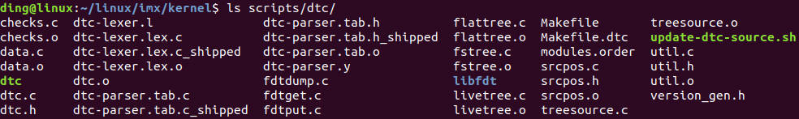

在编译完源码后，`dtc`设备树编译器会默认生成。

#### 2.3.2 设备树的编译

设备树有2种编译方式:

1. 内核集中编译(推荐): 通过内核构建系统自动编译所有配置的设备树
2. 单独编译特定设备树: 针对单个`.dts`文件编译

##### 2.3.2.1 内核集中编译(推荐)

进入内核源码目录，执行命令:

```sh
make dtbs	# 编译所有设备树
```

+ 输出路径: 编译后的`.dtb`文件，默认生成在`arch/arm/boot/dts`目录下

##### 2.3.2.2 单独编译特定设备树

针对单个`.dts`文件编译:

```sh
dtc -I dts -O dtb -o output.dtb input.dts
```

下面举例。我们写一个最简单的设备树框架来编译:

```dts
/dts-v1/;
/{

};
```

编译如下:

```sh
ding@linux:~/linux/imx/driver/ch6_device_tree/01_base_dts$ ~/linux/imx/kernel/scripts/dtc/dtc -I dts -O dtb -o test.dtb test.dts
ding@linux:~/linux/imx/driver/ch6_device_tree/01_base_dts$ ls
test.dtb  test.dts
```

其中，`input.dts`是输入的设备树源文件，`output.dtb`是编译后的二进制设备树文件

##### 2.3.2.3 设备树的反编译

设备树的反编译，是将二进制设备树文件转换回设备树源文件的过程，以便进行查看、编辑或修改。饭编译器通常也是DTC。

```sh
dtc -I dtb -O dts -o output.dts input.dtb
```

其中，`input.dtb`是输入的二进制设备树文件，`output.dts`是反编译后的设备树源文件

下面举例，我们对上面编译的二进制设备树，进行反编译。可以看到，反编译之后的设备树，与源码一致。

```sh
ding@linux:~/linux/imx/driver/ch6_device_tree/01_base_dts$ ~/linux/imx/kernel/scripts/dtc/dtc -I dtb -O dts -o 1.dts test.dtb 
ding@linux:~/linux/imx/driver/ch6_device_tree/01_base_dts$ cat 1.dts 
/dts-v1/;

/ {
};
```

## 第3章 设备树基本语法

### 3.1 根节点

根节点是整个设备树的起点和顶层节点，代表整个硬件系统平台。

**根节点由`/`开头的标识符来表示，然后使用`{}`来包含根节点所在的内容。**

一个最简单的根节点实例：

```dts
/dts-v1/;	// 设备树版本信息
/{
	// 根节点开始
	
	/*
	在这里可以添加注释，描述根节点的属性和配置
	*/
};
```

下面我们来逐一解释这个根节点模板。

#### 3.1.1 `/dts-v1/;`

在ARM Linux设备树中，`/dts-v1/;`是一个必选的版本声明指令，位域设备树源文件的开头，用于指定设备树语法的版本。

+ 核心作用与语法规范

	1. 版本声明

		+ `/dts-v1/`表示当前文件遵循`设备树语法版本1`
		+ 这是设备树编译器的标准要求，用于确保语法兼容性。若省略或版本不匹配，可能导致编译错误或解析失败
		
	2. 位置要求: 必须置于文件首行，且不允许在任何节点或属性之后。

		```dts
		/dts-v1/;  // 正确：首行声明
		/ {
			// 根节点及子节点定义
		};
		```

+ 常见问题与注意事项

	1. 编译错误场景: 若未在首行声明`/dts-v1/;`，`dtc`会报语法错误，提示版本缺失
	2. 历史兼容性：
		+ 早期内核(如Linux 2.6)未强制要求此声明，但Linux 3.x及以上版本的设备树文件必须包含
		+ 现代工具链(如uboot和内核的make dtbs)会严格校验
	
+ 实际应用示例

	典型的设备树文件架构如下：

	```dts
	/dts-v1/;                          // 版本声明（首行）
	#include "soc-base.dtsi"           // 包含公共硬件描述
	#include "custom-board.dtsi"        // 包含板级配置

	/ {                                 // 根节点
		compatible = "vendor,board-x";  // 平台标识
		memory@80000000 {               // 内存节点
			reg = <0x80000000 0x20000000>; // 512MB内存
		};
		uart0: serial@101f0000 {        // 串口设备
			compatible = "ns16550a";
			reg = <0x101f0000 0x1000>;
		};
	};
	```

#### 3.1.2 `/ {};`语法解析

##### 3.1.2.1 根节点符号解析

1. `/`的含义

	+ 根节点标识: `/`标识设备树的顶级节点，代表整个硬件系统平台
	+ 路径起点：类似文件系统的根目录，所有子节点均从`/`派生，形成树状结构
	+ 唯一性： 每个设备树文件有且仅有一个根节点，所有硬件描述均嵌套在其下
	
2. `{}`的含义

	+ 作用域包裹：大括号`{}`定义根节点的作用范围，内部包含根节点的属性和子节点
	
##### 3.1.2.2 根节点的核心作用

1. 系统级描述

	+ 平台标识：通过`compatible`属性匹配内核支持的硬件平台(如`"fsl,imx6ull"`)
	+ 型号定义：`model`属性声明具体板卡型号(如`"Freescale i.MX6ULL Board"`)

2. 资源规范

	+ 地址/长度编码：`#address-cells`和`#size-cell`属性定义子节点reg的地址和长度字段地址格式(如`<1>标识1个u32整数`)
	+ 内存布局：`memory`子节点描述物理内存范围(如reg = <0x80000000 0x20000000>表示512MB内存)
	
#### 3.1.3 根节点结构示例

```dts
/dts-v1/;	// 设备树版本声明（必须首行）
/ {			// 根节点开始
    compatible = "vendor,board-x"; 
    model = "My Hardware Platform";
    #address-cells = <1>;        // 子节点地址字段占1个u32
    #size-cells = <1>;           // 子节点长度字段占1个u32

    memory@80000000 {            // 内存子节点
        device_type = "memory";
        reg = <0x80000000 0x20000000>;  // 起始地址0x80000000，大小512MB
    };
};			// 根节点结束
```
	
### 3.2 子节点

子节点是根节点的直接子项，用于描述具体的硬件设备或设备集合。格式如下：

```dts
[label]: node-name@[unit-address] {
	[properties definitions]
	[child nodes]
};
```

以下是对这些部分的详细介绍：

1. `节点标签label:`: 可选。节点标签用于简化节点引用，增强可维护性的关键语法。

	+ 标签的核心作用

		1. 跨节点引用，避免重复书写长路径。例如：
		
			```dts
			// 定义标签
			uart1: serial@20200000 { ... };

			// 引用标签
			aliases {
				serial0 = &uart1;  // 等价于引用 "/serial@20200000"
			};
			```
			
		2. 属性覆盖与动态配置，在板级设备树`.dts`中覆盖芯片通用配置`.dtsi`。例如：
		
			```dts
			// 芯片级dtsi定义
			uart1: serial@20200000 {
				status = "disabled";
			};

			// 板级dts覆盖
			&uart1 {
				status = "okay";       // 启用设备
				pinctrl-0 = <&uart1_pins>; // 追加引脚配置
			};
			```
			
			此机制实现硬件配置的模块化，无需修改原始定义。
			
		3. 中断控制器关联，简化中断父节点指定。例如：
		
			```dts
			intc: interrupt-controller@10140000 { ... };

			serial@101f0000 {
				interrupts = <0 13 4>;
				interrupt-parent = &intc; // 引用中断控制器
			};
			```
		
			避免路径硬编码，如`interrupt-controller@10140000`
		
	+ 设计规范与常见错误

		| 场景 | 正确实践 | 典型错误 |
		| - | - | - |
		| 标签命名 | 全局唯一(如i2c0) | 重复定义uart1导致引用错误 |
		| 标签引用顺序 | 先定义后引用 | 未定义即引用(编译报错) |
		| 属性覆盖 | 在板级`.dts`中追加 | 错误覆盖reg等关键属性 |
		| 中断控制器关联 | 用`interrupt-parent = &intc` | 直接写路径导致可移植性差 |

2. `节点名称node-name`: 必须要有。节点名称的作用如下：

	+ 用于描述设备的功能或类型，需要简洁且符合规范

		+ 命令规则: 小写字母+短横线(如ethernet、iomuxc-gpio)
		+ 长度限制：`1~31`个字符，仅允许数字、字母及短横线
		+ 典型名称：cpu、memory、i2c、spi(反映设备类别)

	+ 与驱动解耦

		节点名称不直接参与驱动匹配，驱动通过`compatible`属性识别设备。名称主要用于可读性。

3. `单元地址unit-address`：可选。单元地址的作用如下：

	+ 硬件寻址标识：单元地址用于区分同类型设备的多个实例。通常有2类：物理寄存器地址，逻辑编号。

		+ 物理基地址：如串口控制器`serial@20200000`，对应的寄存器基地址为0x20200000
		+ 逻辑编号：如CPU核序号。cpu@0，cpu@1，无实际地址时用序号
		
	+ 与reg属性关联

		子节点的单元地址，必须与子节点的reg属性的首地址一致。例如：
		
		```dts
		uart@20200000 {  // 单元地址=reg的首地址
			reg = <0x20200000 0x1000>;
		};
		```

		若节点没有reg属性，单元地址必须省略。
	
4. 典型使用场景

	1. 区分多实例设备
		
		+ CPU核：cpu@0，cpu@1 (逻辑编号)
		+ 内存区域：memory@80000000 (物理起始地址)
		+ 外设控制器：i2c@40000000 i2c@40001000 (寄存器基地址)
		
	2. 总线设备寻址

		+ I2C从机：lm75@48 (`I2C地址0x48`)
		+ SPI设备：flash@0 (片选序号0)

	3. 资源映射

		```dts
		memory@80000000 {          // 单元地址=内存起始地址
			device_type = "memory";
			reg = <0x80000000 0x20000000>; // 512MB内存区域
		};
		```

5. 设备树的节点名称可以重复吗？

	在Linux中，节点名称是否可以重复，取决于节点的层级关系。规则如下：

	1. 同一父节点下的子节点，名称+单元地址需唯一
	
		```dts
		/ {
			serial@101F0000 { ... };  // 节点1
			serial@101F2000 { ... };  // 节点2（名称相同但地址不同，允许）
		}
		```
		
		+ 允许：相同基本名称(如serial)但单元地址不同(如serial@101F0000核serial@101F2000)
		+ 禁止：两个节点均为`serial@101F0000`
	
	2. 不同父节点下的子节点，名称可以重复，完整路径不同即可
	
		```dts
		/ {
			bus1: i2c@40000000 {
				sensor@48 { ... };  // 路径：/i2c@40000000/sensor@48
			};
			bus2: i2c@40001000 {
				sensor@48 { ... };  // 路径：/i2c@40001000/sensor@48（允许）
			};
		}
		```
	
	3. 标签`label`：标签名必须全局唯一，不可重复定义。

6. 总结

	+ 节点名称：硬件功能描述(必选)，影响可读性而非驱动匹配
	+ 单元地址：设备寻址标识(可选)，与reg属性强关联，同类型设备共存时必选
	+ 设计原则：
	
		+ 唯一性：同级节点名称+单元地址组合唯一
		+ 规范性：地址用十六进制无前缀(如@40000000而非0x40000000)
		+ 可读性：优先使用标准名称(ethernet而非net-controller)

### 3.3 `reg`属性

#### 3.3.1 语法规则

`reg`属性用于描述设备的物理地址空间资源，如寄存器基地址、内存映射区域或总线设备地址。其值由父节点的`#address-cells`和`#size-cells`决定格式：

+ `address-cells`: 定义子节点`reg`中`地址字段`占用的`u32`位整数数量
+ `size-cells`: 定义子节点`reg`中`长度字段`占用的`u32`位整数数量

格式示例：

```dts
reg = <address1 length1 address2 length2 ...>;
```

每个(address length)，都用来描述一段连续的地址空间。reg属性在设备节点中有2种常见格式：单个值格式、列表值格式。

#### 3.3.2 单个值格式`reg = <address size>`

这种格式适用于描述单个寄存器的情况。其中，`address`是设备寄存器的起始地址，可以是一个整数或十六进制；`size`表示寄存器的大小，即占用的字节数。

```dts
reg = <address size>;
```

在下面的示例中，`my_device`设备节点的`reg`属性值为`<0x1000 0x4>`，表示从地址`0x1000`开始的4字节寄存器区域。

```dts
my_device {
	compatible = "vendor,device";
	reg = <0x1000 0x4>;
	// 其他属性和子节点的定义
};
```

#### 3.3.2 列表值格式`reg = <address1 length1 address2 length2 ...>`

当设备具有多个寄存器区域时，可以使用列表值格式的reg属性，来描述每个寄存器区域的地址和大小。

在下面的示例中，`my_device`设备节点具有2个寄存器区域，分别是8字节和4字节大小的寄存器。

```dts
my_device {
	compatible = "vendor,device";
	reg = < 0x1000 0x4
			0x2000 0x8 >;
	// 其他属性和子节点的定义
```

#### 3.3.3 父子节点的继承与优先级

1. 继承机制: 子节点的reg属性解析，完全依赖于父节点的定义。

	+ 父节点设置

	```dts
	parent {
		#address-cells = <1>;  // 地址占1个32位数
		#size-cells = <1>;     // 长度占1个32位数
		child {
			reg = <0x30000000 0x1000>; // 地址0x30000000，长度4KB
		};
	};
	```
	
	+ 子节点无权覆盖：这很好理解。因为子节点挂载在父节点的总线上，他的总线宽度肯定与父节点一致
	
2. 优先级规则

	+ 同级节点独立：每个子节点的reg属性独立解析，无相互影响
	+ 跨层级无继承：子节点的子节点，需要重新定义`#address-cells`和`#size-cells`
	
#### 3.3.4 `#address-cells`和`size-cells`的作用域

在设备书中，#address-cells`和`size-cells`属性的作用域和继承规则，是理解节点寻址的关键。

1. 作用域规则

	+ 父节点定义，子节点继承解析规则

		父节点(如cpus)的`#address-cells`和`#size-cells`***仅作用于其直接子节点(如cpu@0)。*** 他们定义了子节点reg属性的解析格式，但***不继承到子节点的子节点。***
		
	+ 子节点无需重复定义
	
		若子节点(如cpu@0)自身***不包含需要解析reg的子节点***，则无需定义这两个属性。此时系统默认`#address-cells=0`和`size-cells=0`(不影响功能)
		
2. 示例解析
		
	```dts
	cpus {
		#address-cells = <1>;  // 子节点reg的地址占1个cell（32位）
		#size-cells = <0>;     // 子节点reg无需长度字段

		cpu0: cpu@0 {
			reg = <0>;        // 地址值：0（长度字段省略）
		};
	};
	```
	
	+ cpus节点的作用：
	
		+ `#address-cells = <1>`：子节点reg的地址字段为1个u32位整数
		+ `#size-cells = <0>`：子节点reg无长度字段(因为CPU核心只需要逻辑ID,无需物理长度)
		
	+ cpu@0节点为何不定义属性：
	
		+ cpu@0没有子节点，因此无需定义`#address-cells`和`#size-cells`
		+ `reg=<0>`由父节点规则解析为地址值0(标识CPU0)，无长度字段
		
3. 总结

	+ 作用域：父节点的#address-cells和#size-cells仅规范直接子节点的reg属性，不继承到更深层级
	+ 子节点省略条件：若节点无子节点时，则无需定义这两个属性，默认值0不影响功能
	+ 设计原则：
	
		+ 总线节点(如cpus)：必须显式定义属性以支持子设备寻址
		+ 设备节点(如cpu@0)：无子节点时可省略属性
	
#### 3.3.5 典型场景

	+ 内存映射外设(如UART)
	
		```dts
		serial@101f0000 {
			compatible = "arm,pl011";
			reg = <0x101f0000 0x1000>; // 基地址 0x101f0000，长度 4KB
		};
		```

	+ 总线设备(如I2C从机)
	
		```dts
		i2c-bus {
			#address-cells = <1>;
			#size-cells = <0>;         // 无长度字段
			sensor@48 {
				reg = <0x48>;          // I²C 地址 0x48
			};
		};
		```

	+ CPU核心标识
	
		```dts
		cpus {
			#address-cells = <1>;
			#size-cells = <0>;         // 无长度字段
			cpu@0 { reg = <0>; };      // CPU0
			cpu@1 { reg = <1>; };      // CPU1
		};
		```

### 3.4 总线节点和设备节点

在Linux设备树中，总线节点和设备节点是硬件描述的核心组成部分。

#### 3.4.1 总线节点

总线节点描述连接多个设备的物理或逻辑通道，负责定义寻址规则，和子设备管理机制。

+ 核心特性与属性

	1. 寻址规则定义
	
		+ `#address-cells`：指定子节点reg属性中**地址字段**的u32个数
		+ `size-cells`：指定子节点reg属性中**长度字段**的u32个数
		+ 示例：`I2C总线通常设为#address-cells=<1>; size-cells=<0>;`，地址占1个cell，无长度
		
	2. 子设备管理
	
		总线节点包含子设备节点(如I2C从机、SPI设备)，通过reg属性分配地址
		
#### 3.4.2 设备节点

设备节点描述具体硬件外设，分为可编址设备(如寄存器外设)和不可编址设备(如GPIO按键)。

+ 可编址设备

	1. 关键属性
	
		+ reg：描述寄存器地址范围，格式由父总线节点的#address-cells和size-cells决定
		+ compatible：驱动匹配标识，如"fsl,imx6ull-uart"
		+ interrupts：定义中断号和触发方式
		
	2. 典型场景
	
		+ 内存映射设备：UART、DMA控制器(需要地址+长度)
		+ 总线从设备：I2C温度传感器(仅需地址)
		
+ 不可编址设备

	1. 关键属性
	
		+ gpios：指定GPIO引脚(如按键、LED)
		+ clocks：时钟源引用
		+ 无reg属性
		
	2. 典型场景
	
		+ GPIO按键：`gpios = <&gpio1 2 GPIO_ACTIVE_LOW>;`
		+ 电源管理芯片：通过I2C控制，但自身无内存映射
		
#### 3.4.3 节点寻址方法

	1. 查看寻址属性
	
		+ 若节点包含#address-cells和size-cells，是总线节点
		+ 反例：设备节点不会定义这些属性
		
	2. 分析compatible值
	
		+ 总线：常含"simple-bus"或厂商标识(如"fsl,imx6ull-i2c")
		+ 设备：标识具体的硬件型号(如"ti,tmp102")
		
	3. 观察子节点类型：总线节点下多为设备节点(如I2C控制器下挂EEPROM)

#### 3.4.4 典型的总线+设备节点

	```dts
	i2c1: i2c@40012000 {          // 总线节点
		#address-cells = <1>;      // 子设备地址占 1 cell
		#size-cells = <0>;          // 无长度字段
		compatible = "fsl,imx6ul-i2c";

		eeprom@50 {                // 设备节点
			compatible = "atmel,24c02";
			reg = <0x50>;           // I²C 地址 0x50
		};
	};
	```

### 3.5 `#address-cells`和`#size-cells`属性

address-cells和#size-cells属性，用于指定reg属性地址单元和大小单元的位数。他们提供了设备树解析所需的元数据，以正确解释设备的地址和大小信息。

#### 3.5.1 `#address-cells`属性

+ 含义：指定子节点reg属性中地址值(`address`)所占的32位整数数量
+ 取值：通常为1(32位地址)、2(64位地址)

#### 3.5.2 `#size-cells`属性

+ 含义：指定子节点reg属性中长度值(`size`)所占的32位整数数量
+ 取值：通常为0(无长度字段)、1(32位长度)、2(64位长度)

### 3.6 `model`属性

`model`是设备树中的标准属性，用来描述设备的厂商型号或板级标识，提供人类可读的设备信息。

+ 一、model属性的定义与语法规则

	1. 语法格式

		```dts
		model = "manufacturer board-model";
		```

		1. manufacturer: 厂商名称(如samsung、nvidia)
		2. board-model: 设备型号(如smdk2440、am335x)

	2. 层级位置

		1. 根节点：通常位于设备树根节点`/`下，描述整个硬件平台

		```dts
		/ {
			model = "NVIDIA Jetson Nano Developer Kit";
			compatible = "nvidia,p3450-0000";
			...
		};
		```

		2. 子节点：也可以用于特定设备(如SoC或外设)，但比较少见

	3. `model`与`complatible`的关系

		二者经常配合使用，`compatible`用于机器识别，`model`用于友好显示

		| 属性 | 用途 | 示例 |
		| - | - | - |
		| model | 提供设备型号的描述信息，用于日志、调试或用户界面显示 | model = "Raspberry Pi 4 Model B"; |
		| compatible | 定义驱动匹配的硬件标识，是内核绑定驱动的关键依据 | compatible = "brcm,bcm2711"; |

+ 二、核心使用场景

	1. 硬件平台识别
	
		+ 启动阶段：uboot或内核通过解析根节点的`model`显示板级信息
		
			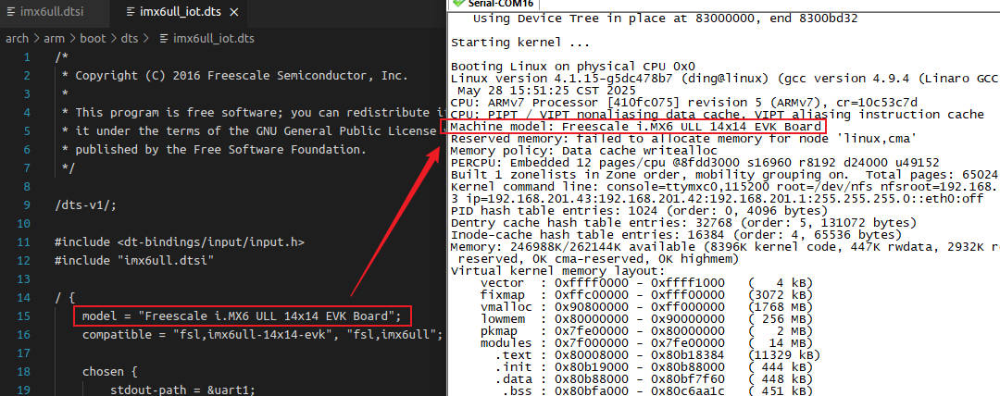
			
		+ 动态适配：结合compaatible实现多板卡支持
		
	2. 调试与日志
	
		+ 问题追踪：当系统崩溃时，model信息帮助定位硬件配置问题
		+ 用户空间工具：`/proc/device-tree/model`文件暴露该属性，供脚本或应用读取
		
			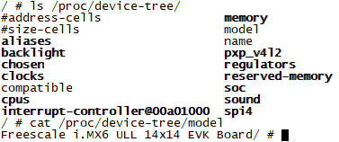

	3. 量产设备管理
	
		+ 固件升级：根据`model`值选择对应的固件包(如`firmware-${model}.bin`)
		+ 自动化测试：测试脚本依据`model`加载不同的测试用例
		
+ 三、与内核代码的结合方式

	1. 内核启动阶段
	
		在`setup_arch()`函数中，内核解析设备树并提取`model`：
		
		```c
		// arch/arm/kernel/setup.c
		void __init setup_arch(char **cmdline_p) {
			const char *model;
			model = of_get_property(of_root, "model", NULL); // 获取根节点的model属性[8,13](@ref)
			pr_info("Machine model: %s\n", model);          // 打印到内核日志
		}
		```
	
	2. 驱动代码中的使用
	
		驱动可通过设备树接口读取`model`实现差异化配置：
		
		```c
		// 示例：GPIO 驱动根据板型号调整引脚映射
		static int my_driver_probe(struct platform_device *pdev) {
			struct device_node *np = pdev->dev.of_node;
			const char *model;

			of_property_read_string(np, "model", &model); // 读取model属性[11,13](@ref)
			
			if (strstr(model, "Raspberry Pi 4")) {
				// 应用树莓派4专用配置
				configure_pins_for_rpi4();
			} else if (strstr(model, "Jetson Nano")) {
				// 应用Jetson Nano专用配置
				configure_pins_for_nano();
			}
			return 0;
		}
		```
		
	3. 用户空间访问
	
		通过sysfs或procfs接口：
		
		```c
		// 用户程序读取 /proc/device-tree/model
		FILE *f = fopen("/proc/device-tree/model", "r");
		fread(buffer, sizeof(char), 128, f);
		printf("Board Model: %s\n", buffer);
		```

+ 四、开发实践建议

	1. 命名规范
	
		+ 优先采用<vendor>,<product>-<version>格式(如ti,beaglebone-black)
		+ 避免空格，用连字符替代(如raspberry-pi-4b 而非 Raspberry Pi 4B)
		
	2. 与`.dtsi`文件的协作
	
		+ 在SoC级`.dtsi`中定义`.compatible`，板级`.dts`中补充`model`
		
			```dts
			/* imx6ull.dtsi (SOC级) */
			/ { compatible = "fsl,imx6ull"; ... };

			/* my-board.dts (板级) */
			/ { model = "MyTech IMX6ULL Industrial Board"; ... };
			```

+ 五、总结

	通过合理使用`model`属性，开发者能显著提升硬件描述的清晰度与系统可维护性，实现硬件配置与软件逻辑的高效解耦。
	
### 3.7 `status`属性

设备树的`status`属性，用来描述设备节点的运行状态。是设备树中控制设备使能/禁用的核心机制。

#### 3.7.1 语法规则与属性值

若未显式定义status，设备默认为"okay"状态

| 属性值 | 含义 |
| - | - |
| "okay" | 设备可操作(默认状态)，驱动可正常加载 |
| "disabled" | 设备当前不可操作，但未来可能变为可用(如热插拔设备未插入、时钟未就绪) |
| "fail" | 设备因严重错误永久不可用(如硬件故障) |
| "fail-sss" | 同fail，sss为具体错误描述(如fail-power表示电源故障) |

#### 3.7.2 典型使用场景

##### 3.7.2.1 动态启动/禁用设备

+ 场景：同一硬件设计支持可选外设(如开发板的扩展接口)
+ 示例：禁用未使用的耳机检测模块

```dts
&rk_headset {
    status = "disabled";  // 关闭耳机检测功能
};
```

##### 3.7.2.2 热插拔设备管理

+ 场景：支持热插拔的设备(如USB设备、SD卡)
+ 示例：SD卡槽初始状态为"disabled"，插入后由驱动改为"okay"

##### 3.7.2.3 硬件故障处理

+ 场景：检测到硬件异常(如传感器通信失败)
+ 示例：标记故障设备避免重复初始化

```dts
&temp_sensor {
    status = "fail-i2c";  // I2C通信失败
};
```

#### 3.7.3 与内核代码的结合方式

##### 3.7.3.1 内核状态检测函数

驱动通过以下API检测`status`属性：

```c
#include <linux/of.h>

bool of_device_is_available(const struct device_node *node);
```

+ 逻辑：返回true，仅当status为okay、ok或未定义(隐含okay)
+ 源码逻辑：

```c
// drivers/of/base.c
bool of_device_is_available(const struct device_node *device) {
    const char *status = of_get_property(device, "status", NULL);
    return (status == NULL) || !strcmp(status, "okay") || !strcmp(status, "ok");
}
```

##### 3.7.3.2 驱动中的典型应用

在设备探测`probe`函数中，检查设备状态：

```c
static int my_driver_probe(struct platform_device *pdev) {
    struct device_node *np = pdev->dev.of_node;
    
    // 检查设备是否可用
    if (!of_device_is_available(np)) {
        dev_info(&pdev->dev, "Device disabled in DTS\n");
        return -ENODEV;  // 退出探测
    }
    
    // 正常初始化设备...
    return 0;
}
```

##### 3.7.3.3 用户空间访问

通过sysfs查看设备状态：

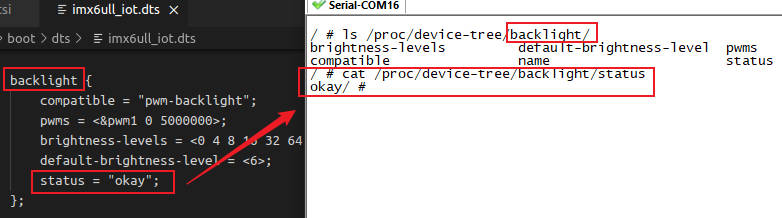

#### 3.7.4 开发实践建议

1. 优先使用okay/disabled
	
	fail状态需谨慎使用，通常由驱动在运行时动态设置，非静态配置
	
2. 与`compatible`配合使用

	即使`status = disabled`，内核人会解析节点兼容性，但不会触发probe
	
3. 动态修改状态

	驱动可通过`of_node->status`动态更新状态(需同步通知子系统)
	
#### 3.7.5 status属性在系统运行的动态修改

设备树的status属性，支持在系统运行过程中动态修改，这是嵌入式系统实现硬件配置热更新的关键机制。

##### 3.7.5.1 内核模块中修改

+ 原理：通过内核模块调用设备树API，直接修改节点属性
+ 示例代码：

```c
#include <linux/module.h>
#include <linux/of.h>
static int __init my_init(void) {
    struct device_node *node = of_find_node_by_path("/soc/i2c@13860000");
    if (node) of_property_write_string(node, "status", "disabled");
    return 0;
}
module_init(my_init);
```

##### 3.7.5.2 uboot阶段修改

+ 原理：在系统启动前，通过uboot的fdt命令修改内存中的设备树
+ 操作步骤：

```sh
# U-Boot命令行中：
fdt set /soc/i2c@13860000 status "disabled"
bootm  # 启动内核
```

##### 3.7.5.3 技术限制与注意事项

1. 内核支持依赖：sysfs节点默认为只读，不可直接写入
2. 硬件行为影响：

	+ 修改status可能导致驱动卸载或设备断电，例如：
	
		+ status = "disabled" -> 触发驱动的remove()函数，释放硬件资源
		+ 错误修改可能引发总线冲突或系统崩溃
		
3. 状态持久性问题

	+ 动态修改不会保存到存储设备，重启后失效
	+ 永久生效需修改原始DTB文件，并更新固件
	
#### 3.7.6 总结

status属性通过声明式配置，实现了硬件资源的动态管理。其核心价值在于：

+ 硬件抽象：解耦硬件状态与驱动逻辑
+ 动态控制：支持热插拔、故障隔离等场景
+ 资源优化：避免初始化无用设备，加速启动

### 3.8 `compatible`属性

linux设备的`compatible`属性，用来识别设备节点与驱动程序的匹配关系。

#### 3.8.1 `compatible`属性的定义与语法规则

##### 3.8.1.1 基本定义

+ 核心作用：`compatible`是设备节点的关键属性，用来绑定硬件设备与内核驱动。其值是一个字符串列表，操作系统通过匹配字符串加载对应的驱动程序。

+ 语法规则

	```dts
	compatible = "<manufacturer>,<model>", "<generic-driver>";
	```

	+ manufacturer: 厂商缩写(如fsl表示Freescale/NXP，brcm表示Broadcom)
	+ model: 设备型号(如imx6q-pwm表示i.MX6Q的PWM控制器)
	+ generic-driver: 通用兼容驱动(如simple-bus)，用于驱动降级匹配

##### 3.8.1.2 关键规则

+ 唯一性要求：厂商缩写需唯一，避免不同厂商设备冲突
+ 多兼容机制：支持多个字符串，内核按从左到右优先级匹配驱动(若第一项无匹配，则尝试第二项)
+ 禁止通配符：禁止使用模糊匹配(如fsl,mpc83xx-uart)，必须明确具体型号
	
#### 3.8.2 核心使用场景

##### 3.8.2.1 驱动与设备绑定

+ 精确匹配：设备树节点通过`compatible`指定设备型号，驱动代码定义`of_match_table`声明支持的设备列表。匹配成功时触发驱动的`probe()`函数。
+ 示例：

	```dts
	serial@101f0000 {
		compatible = "arm,pl011"; // 绑定 ARM PL011 驱动
		reg = <0x101f0000 0x1000>;
	};
	```
	
##### 3.8.2.2 硬件兼容性设计

+ 新旧驱动兼容：若硬件与现有驱动寄存器兼容，可追加通用驱动字符串实现服用
+ 示例：

	```dts
	compatible = "fsl,imx6q-pwm", "brcm,bcm2835-pwm"; // 优先匹配 i.MX6 驱动，失败则回退到 BCM2835 驱动[11](@ref)。
	```
	
##### 3.8.2.3 板级与SoC描述

+ 根节点标识：根节点的`compatible`描述整个硬件平台，用于内核选择初始化策略

```dts
/ {
    compatible = "raspberrypi,3-model-b", "brcm,bcm2837"; // 板级型号 + SoC 型号[12](@ref)
};
```

#### 3.8.3 与内核代码的结合方式

##### 3.8.3.1 驱动匹配表定义：驱动通过`of_match_table`声明支持的设备列表，使用`of_device_id`结构体存储匹配字符串

```c
// PWM 驱动示例
static const struct of_device_id pwm_of_match[] = {
    { .compatible = "fsl,imx6q-pwm" },   // 精确匹配 i.MX6Q PWM
    { .compatible = "brcm,bcm2835-pwm" }, // 兼容 BCM2835 PWM
    { /* Sentinel */ }
};
MODULE_DEVICE_TABLE(of, pwm_of_match);
```

##### 3.8.3.2 驱动注册与匹配流程

1. 注册驱动

	```c
	static struct platform_driver imx_pwm_driver = {
		.driver = {
			.name = "imx-pwm",
			.of_match_table = pwm_of_match, // 绑定匹配表
		},
		.probe = imx_pwm_probe, // 匹配成功后调用
	};
	platform_driver_register(&imx_pwm_driver);
	```
	
2. 内核匹配逻辑：内核遍历设备树节点，调用`of_match_device()`比较节点`compatible`与驱动的`of_match_table`。完全匹配时返回`of_device_id`，触发`probe()`

#### 3.8.4 开发实践与最佳实践

1. 命名一致性：使用厂商官方推荐的型号名(如NXP的fsl, imx6ul-uart)
2. 版本控制：硬件修订时追加版本号(如fsl,imx6q-pwm-v2)
3. 避免冗余：同意驱动支持的设备型号，应在`of_match_table`中穷举，而非设备树中重复定义

#### 3.8.5 设备树`of`缩写开头

Linux设备树中，`of`是`Open Firmware`的缩写。

##### 3.8.5.1 of的来源与含义

+ 设备树的概念，最初由`Open Firmware(开放固件)`标准引入，该标准由IBM开发。`Open Firmware`是一种固件接口，用于在计算机启动时描述硬件配置，实现硬件与操作系统的解耦
+ Linux内核在支持ARM、PowerPC等架构时，借鉴了`Open Firmware`的设备描述机制，将硬件信息从内核代码剥离到独立的设备树文件
+ Linux为保持历史兼容性，内核中与设备树操作相关的函数均已`of_前缀命名`，如`of_find_node_by_path()`、`of_property_read_u32()`等函数

##### 3.8.5.2 of在Linux内核的体现

1. 设备树操作函数(of api)：内核提供了一系列以`of_`开头的函数，用于解析设备树节点和属性。这些函数定义在`include/linux/of.h`中，实现在`drivers/of/`目录下。

	+ 节点查找：`of_find_node_by_name()`、`of_find_compatible_node()`
	+ 属性读取：`of_property_read_u32()`、`of_property_read_string()`
	+ 地址转换：`of_address_to_resource()`
	
2. 核心数据结构

	+ `struct device_node`：描述设备树中的节点(如名称、属性、父/子节点)
	+ `struct property`：描述节点的属性(如名称、值、长度)

### 3.9 总结

以下是Linux设备树中关键属性的结构化总结，结合技术规范和实际应用场景。

| 属性 | 作用 | 依赖关系 |
| - | - | - |
| 根节点 | 全局硬件框架 | 必须包含`#address-cells`和`size-cells` |
| 子节点 | 描述具体设备 | 继承父节点地址规则 |
| reg | 定义设备地址范围 | 需父节点`#address-cells`和`size-cells` |
| `#address-cells`和`size-cells` | 指定地址/长度的数值单元数 | 父节点定义、子节点遵守 |
| model | 精确硬件型号标识 | 独立属性 |
| status | 设备启用、禁用状态 | 动态控制硬件 |
| compatible | 设备与驱动匹配的关键字 | 驱动需声明匹配表 |

## 第4章 设备树扩展语法

### 4.1 `aliases`节点

`aliases`节点位于设备树根节点`/`之下，用来给其他设备节点定义简短且易读的别名，替代复杂的节点路径引用。

#### 4.1.1 `aliases`节点的核心作用

1. 简化节点引用

	通过别名(如serial0)替代完整节点路径(如/soc/serial@10000000)，提升代码可读性
	
2. 提供稳定标识

	别名在系统运行时保持固定，即使节点路径调整(如硬件地址变化)，内核代码仍通过别名访问设备
	
#### 4.1.2 `aliases`的语法规范

1. 节点位置与结构

	+ 位置：必须位于设备树根节点`/`下，节点名固定为`aliases`
	+ 结构：由多个属性组成，每个属性定义一个别名
	
	```dts
	/ {
		aliases {
			serial0 = &uart0;   // 别名 = 标签引用
			ethernet0 = "/soc/ethernet@ff000000"; // 别名 = 完整路径
		};
	};
	```

2. 属性命名规则：仅允许小写字母，数字，连字符(`-`)，长度1~31字符

3. 属性值格式

	| 写法 | 示例 | 适用场景 | 特点 |
	| - | - | - | - |
	| 标签引用(&label) | serial0 = &uart0; | 节点已定义标签(如uart0: serial@...) | 简洁、可维护性高 |
	| 完整路径 | ethernet0 = "/soc/ethernet@ff000000"; | 节点未定义标签 | 直接明确，但路径易变 |
	
4. 别名唯一性要求：同一`aliases`节点中，所有别名必须全局唯一，禁止重复定义

#### 4.1.3 典型使用场景

1. 内核驱动中引用设备节点

	开发者通过别名在驱动代码中查找设备节点，无需硬编码复杂路径
	
	```c
	#include <linux/of.h>
	struct device_node *np = of_find_node_by_alias(NULL, "serial0");
	if (np) {
		// 操作节点
		of_node_put(np);
	}
	```

	函数`of_find_node_by_alias()`通过别名快速定位节点
	
2. 用户空间设备访问

	别名映射到/dev目录下的设备文件编号。注意，设备文件名还是由`device_create()`函数创建，只是后面的编号可以取别名最后的数字编号。内核生成设备节点`/dev/i2c-0`，用户程序可通过别名编号访问设备
	
	```dts
	aliases {
		i2c0 = "/soc/i2c@13860000";
	};
	```
	
3. 统一设备接口

	为同类设备(如I2C控制器)分配连续别名(i2c0、i2c1)，提供一致的编程接口
	
4. 跨平台兼容性

	当硬件变更导致节点路径调整时，只需修改`aliases`中的映射关系，内核驱动代码无需改动
	
#### 4.1.4 `aliases`与`label`的区别

##### 4.1.4.1 编译区别

`label`用于设备树内部引用，`sliases`用于全局标识与跨层访问。虽然两者均用于简化室节点引用，但设计目的和机制截然不同。

| 特性 | aliases | label |
| - | - | - |
| 定义位置 | 独立节点(/aliases) | 节点前标签(uart0: serial@0) |
| 作用范围 | 全局(内核/用户空间)，包括内核运行时 | 设备树源文件.dts内部 |
| 编译后保留 | 保留在DTB中 | 替换为节点路径或phandle |
| 主要用途 | 跨模块引用、设备编号分配 | 设备树内节点覆盖或扩展 |
| 示例 | 提供系统及设备标识符(如控制台、总线) | 设备树内部节点引用(覆盖、添加属性) |
| 唯一性要求 | 全局唯一 | 全局唯一 |

编译差异：

+ `label`：编译后(`.dtb`)被替换为节点路径或phandle，不保留标签名
+ `aliases`：作为独立节点保留在(`.dtb`)中，内核启动时解析为全局映射表

##### 4.1.4.2 典型场景对比

1. `label`的典型场景：label主要用于​​设备树内部的节点引用和属性操作​​

	+ 覆盖或添加节点属性：通过`&label`修改已有节点的属性，无需重复定义节点路径
	
	```dts
	/* 定义节点 */
	uart0: serial@ff000000 { status = "disabled"; };

	/* 在另一位置启用UART0 */
	&uart0 { status = "okay"; };  // 直接通过标签引用[1,2](@ref)
	```
	
	+ 跨文件引用节点：在.dts或.dtsi文件中引用其他文件定义的节点
	
	```dts
	#include "soc.dtsi"
	&i2c1 { ... };  // 引用soc.dtsi中的i2c1节点[3](@ref)
	```
	
	+ 简化复杂路径：避免重复书写长路径(如`&intc`替代`/interrupt-controller@00a01000`)
	
2. aliases的典型场景：Aliases提供​​全局设备标识符​​，服务于内核驱动和用户空间

	+ 系统关键设备标识：定义标准设备名(如`serial0`为默认控制台)，内核通过`stdout-path`或`bootargs`关联
	
	```dts
	aliases { serial0 = &uart0; };  // 内核用 serial0 查找控制台[1,5](@ref)
	chosen { stdout-path = "serial0:115200n8"; };
	```
	
	+ 用户空间设备映射：在`/sys/firmware/devicetree/base/aliases`生成别名文件，用户程序可直接读取设备路径
	
	```dts
	cat /sys/firmware/devicetree/base/aliases/serial0  // 输出uart0节点路径[1,8](@ref)
	```

	+ 多实例设备排序：为同类设备分配有序别名(如`i2c0、i2c1`)，驱动通过序号匹配硬件实例
	
	```dts
	aliases { 
		i2c0 = &i2c_main;  // 主控制器
		i2c1 = &i2c_aux;   // 从控制器
	};
	```
	
	驱动代码通过`of_alias_get_id(np, "i2c")`获取设备序号
	
	+ 硬件抽象与兼容性：当节点路径因重构改变时，只需更新`aliases`映射，无需修改驱动代码
	
3. 技术实现差异

	| 特性 | label | aliases |
	| - | - | - |
	| 语法示例 | `uart0: serial@ff000000 { ... }` | `aliases { serial0 = &uart0; }` |
	| 内核访问API | 无需API(编译时替换) | `of_find_node_by_alias(NULL, "serial0")` |
	| 用户空间可见性 | 不可见 | 通过`sysfs`暴露 |
	
4. 设计哲学总结

	+ label: 本质是源码级语法糖，解决设备树内部的冗余书写问题，提升.dts可维护性
	+ aliases: 是硬件抽象层(HAL)的关键设计，为系统提供稳定的设备标识符，降低内核/用户空间对硬件路径的耦合
	
5. 何时选择

	+ 需修改节点属性或跨文件引用: 用label
	+ 需在运行时动态查找设备或定义系统及设备名: 用aliases
	
#### 4.1.5 `aliases`节点与`sysfs`路径

在linux设备树中，aliases节点通过内核在启动时的解析，会在用户空间的`sysfs`文件系统中生成设备映射别名文件。这些文件提供了从别名到设备节点路径的直接映射，方便用户空间程序动态获取硬件设备信息。

##### 4.1.5.1 生成机制与`sysfs`路径

1. 内核自动创建映射文件

	设备树编译后，内核在解析DTB时会识别`/aliases`节点下的所有属性。每个属性(别名)会在sysfs中生成一个文件：
	
	```bash
	/sys/firmware/devicetree/base/aliases/<别名>
	```

	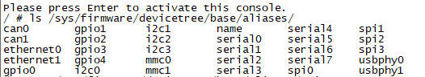

2. 文件内容格式：别名文件的内容，就是字符串形式的设备树节点路径
	
	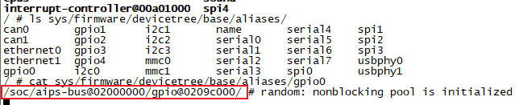

### 4.2 `chosen`节点

Linux设备树中的`chosen`节点是一个关键的特殊节点，用于在uboot和kernel之间传递配置信息和运行时参数。它不描述真实硬件，而是提供系统启动和初始化的全局设置。

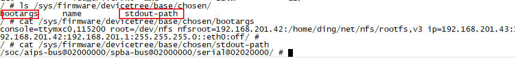

#### 4.2.1 语法规则

`chosen`节点位于设备树根目录下，语法遵循标准设备树节点格式，但无物理地址(没有@unit-address)

```dts
/chosen {
    bootargs = "console=ttyS0,115200 root=/dev/mmcblk0p2 rw"; // 内核启动参数
    stdout-path = "serial0:115200n8";                         // 标准输出设备路径
};
```

+ 核心属性：

	+ `bootargs`：字符串类型，传递内核命令行参数(如控制台设备、根文件系统位置)
	+ `stdout-path`：字符串类型，指定内核标准输出设备(格式：  设备:波特率:数据位)
	
+ 自定义属性：

	支持扩展(如firmware-name指定固件路径)，需内核驱动支持
	
#### 4.2.2 工作原理

##### 4.2.2.1 uboot阶段的动态修改

+ 传递启动参数：uboot在加载内核前，读取环境变量`bootargs`，并将其写入设备树`chosen`节点的`bootargs`属性中

+ 代码流程：

	```c
	// U-Boot源码：common/fdt_support.c
	int fdt_chosen(void *fdt) {
		int node = fdt_find_or_add_subnode(fdt, 0, "chosen"); // 创建/定位chosen节点
		char *bootargs = getenv("bootargs");                  // 获取环境变量
		fdt_setprop(fdt, node, "bootargs", bootargs, strlen(bootargs)+1); // 写入属性
	}
	```
	
+ 动态性：设备树源文件`.dts`中chosen可能为空，uboot启动时动态填充bootargs

##### 4.2.2.2 内核解析流程

内核在初始化节点(start_kernel -> setup_arch) 扫描`chosen`节点：

+ 提取`bootargs`：复制到全局变量`boot_commanf_line`，供内核后续解析(如初始化控制台、挂在根文件系统)
+ 设置标准输出：根据`stdout-path`顶顶控制台设备(如串口)

关键函数调用链：

```txt
start_kernel()
  → setup_arch(&command_line)
    → setup_machine_fdt(__fdt_pointer)       // 映射设备树
      → early_init_dt_scan_nodes()           // 扫描节点
        → early_init_dt_scan_chosen()        // 解析chosen节点
          → 提取bootargs → 写入command_line
          → 解析stdout-path → 初始化控制台
        → early_init_dt_scan_memory()        // 解析memory节点
```

#### 4.2.3 典型使用场景

1. 内核启动参数传递

	+ 功能：传递根文件系统位置、网络配置、调试等级
	+ 示例：`bootargs = "root=/dev/nfs ip=192.168.1.10 nfsroot=192.168.1.1:/opt/rootfs"` 用于网络根文件系统启动
	
2. 控制台设备指定

	+ 场景：多串口系统中，明确调试输出目标
	+ 示例：`stdout-path = "serial1:115200n8"` 将输出重定向到第2个串口
	
### 4.3 `device_type`节点

`device_type`是linux设备树中，用于表示设备类别的关键属性，在内核初始化过程中帮助识别硬件角色。

#### 4.3.1 语法规则与属性定义

1. 属性格式

	+ 值类型：字符串(如"cpu"、"memory"、"serial")
	+ 命名规范：小写字母+无空格(如"i2c-controller"标识i2c控制器)
	+ 位置：位于设备节点内部，与`compatible`、`reg`等属性并列
	
	```dts
	cpu0: cpu@0 {
		device_type = "cpu";          // 标识为CPU设备
		compatible = "arm,cortex-a53";
		reg = <0x0>;
	};
	```

2. 必须场景

	+ CPU节点(device_type = "cpu")
	+ 内存结点(device_type = "memory")
	+ 若缺失，内核无法初始化关键硬件(如内存)，导致启动失败
	
3. 可选场景：其他设备(如网络控制器、串口)可省略，内核优先通过`compatible`匹配驱动

4. 与`compatible`的区别

	| 属性 | 作用 | 优先级 |
	| - | - | - |
	| device_type | 设备粗分类(如"cpu") | 低(历史遗留) |
	| compatible | 精确匹配驱动(如具体型号) | 高(现代标准) |
	
#### 4.3.2 内核解析机制

1. 启动阶段扫描：内核初始化时遍历设备树，通过`device_type`快速定位关键设备

	+ CPU拓扑：收集所有`device_type = "cpu"`的节点，构建多核调度框架(SMP)
	+ 内存布局：查找`device_type = "memory"`节点，解析reg属性获取物理内存范围
	
2. 驱动匹配辅助：部分总线型设备(如Open Firmware总线)使用`device_type`作为初识筛选条件，再结合`compatible`选择驱动

	```dts
	i2c@021a0000 {
		device_type = "i2c-controller";  // 总线类型标识
		compatible = "fsl,imx6q-i2c";   // 具体驱动型号
	};
	```
	
	内核先按`i2c-controller`分类，再匹配具体驱动
	
#### 4.3.3 典型应用场景

1. CPU节点

	+ 作用：描述处理器核心的架构、时钟和功耗管理
	+ 示例：
	
		```dts
		cpus {
			#address-cells = <1>;
			#size-cells = <0>;
			cpu0: cpu@0 {
				device_type = "cpu";                // 标识CPU设备
				compatible = "arm,cortex-a53";
				reg = <0x0>;                        // 核心编号
				clocks = <&cru ARMCLKL>;            // 关联时钟
			};
		};
		```
		
	+ 内核通过`device_type`快速识别所有CPU节点，为多核调度提供基础
	
2. 内存结点

	+ 作用：定义物理内存的起始地址和大小
	+ 示例：
	
		```dts
		memory@80000000 {
			device_type = "memory";         // 标识内存设备
			reg = <0x80000000 0x40000000>;  // 起始地址0x80000000，大小1GB
		};
		```
	
	+ 若未定义`device_type = "memory"` 内核报错"No memory node in device tree"
	
3. 特殊总线设备

	+ 场景：早期设备树或特定总线(如PCI)需显式声明类型：
	
		```dts
		pci@1fc00000 {
			device_type = "pci";            // 标识PCI控制器
			#address-cells = <3>;
			#size-cells = <2>;
			reg = <0x1fc00000 0x2000>;
		};
		```
		
	+ 现代内核逐渐弃用此方式，改用`compatible`精确匹配
	
#### 4.3.4 设计注意事项

1. 避免冗余。现代内核优先使用`compatible`匹配驱动，非必要场景(如非CPU/内存设备)可省略`device_type`，减少设备树复杂度
2. 历史兼容性。旧版设备树可能依赖`device_type`标识串口、网络控制器等，新设计应迁移至`compatible`标准

#### 4.3.5 总结

在嵌入式开发中，准确使用 device_type 可避免启动故障，并为复杂硬件（如异构计算架构）提供清晰的设备分类基础。现代设计中，其角色逐渐被 compatible 替代，但在CPU/内存等核心节点中仍是不可或缺的基石

### 4.4 自定义属性

#### 4.4.1 语法规则

1. 命名规范：

	+ 长度限制：属性名长度需为1-31字符，仅允许使用ASCII字符
	+ 唯一性：统一节点内属性名不可重复
	
2. 值类型：

	+ 控制：仅声明属性名(如custom-prop) 用于标记存在性
	+ 字符串：双引号包裹(如`description = "Custom Sensor"`)
	+ 数值：
	
		+ 32位整数：使用尖括号`< >`，如<0x1000>或<512>
		+ 8位字节整数或数组：使用中括号`[ ]`，如`config = [00 0A FF]`
		
3. 位置要求：属性必须定义在节点内部，与标准属性(如`compatible`)并列

	```dts
	sensor@0 {
		compatible = "vendor,custom-sensor";
		custom-range = <100>;        // 整数属性
		calibration-data = [01 02 03]; // 字节数组
	};
	```

#### 4.4.2 工作原理

1. 内核存储与访问

	+ 设备树编译为DTB后，所有属性以键值对形式存入内存。内核解析时，将节点转换为`struct device_node`，属性转换为`struct property`链表
	+ 驱动通过of api读取属性：
	
		```c
		// 读取整数属性
		of_property_read_u32(dev->of_node, "custom-range", &value);
		// 读取字节数组
		of_property_read_u8_array(dev->of_node, "calibration-data", buf, len);
		```

2. 属性解析机制

	+ 驱动在`probe()`函数中解析自定义属性，动态配置硬件参数
	+ 内核不自动处理自定义属性，需驱动主动解析
	
#### 4.4.3 典型使用场景

1. 硬件参数配置

	+ 传感器校准：存储校准值(如偏移量、温度系数)
	
		```dts
		temperature-sensor@48 {
			custom-offset = <25>;  // 温度偏移校准值
		};
		```

	+ 外设模式选择：指定工作模式(如通信协议)
	
		```dts
		spi-device@0 {
			data-mode = "quad"; // 设置SPI为四线模式
		};
		```
		
2. 驱动行为控制

	+ 调试开关：启用调试日志(如debug-enable;)
	+ 功耗管理：定义休眠超时时间(如sleep-timeout-ms = <5000>;)
	
3. 平台特定数据传递

	+ 私有数据传递：传递板级配置(如GPIO映射)
	
		```dts
		leds {
			led1-gpio = <&gpio 10 GPIO_ACTIVE_HIGH>;
		};
		```
		
	+ 兼容层扩展：为旧驱动添加新参数
	
#### 4.4.4 总结

自定义属性是设备树灵活性的核心体现，通过键值对扩展硬件描述能力。其核心价值在于：

1. 解耦硬件配置：将板级细节从驱动代码剥离，提升跨平台复用性
2. 动态适应性：结合设备树覆盖或内核模块，支持运行时调整
3. 调试便捷性：通过sysfs直接访问属性，加速硬件验证

### 4.5 设备树括号`< >和[ ]`区别

在Linux设备树中，尖括号(`< >`)和中括号(`[ ]`)是两种不同的语法接口，用于表示不同类型的属性值。他们的核心区别在于数据类型和解析方式。

#### 4.5.1 尖括号`< >`：32位整数数组

##### 4.5.1.1 语法与用途

+ 数据类型：用于表示`32位无符号整数(u32)`组成的数组，每个元素占用4字节
+ 语法格式：`<value1 value2 value3 ...>` 元素间用空格分隔(不可用逗号)
+ 典型应用场景：

	+ 寄存器地址与长度(reg属性):
	
		```dts
		reg = <0x4000C000 0x1000>;  // 起始地址 0x4000C000，长度 0x1000
		```
	
	+ 中断号与触发类型(interrupt属性)：
	
		```dts
		interrupts = <0 24 4>;      // 中断号 0，24 号中断，边沿触发[3,8](@ref)
		```

	+ phandle引用(节点间引用)
	
		```dts
		gpios = <&gpio1 10 GPIO_ACTIVE_LOW>; // 引用 gpio1 节点，引脚 10，低电平有效[11](@ref)
		```

##### 4.5.1.2 内核解析方式

+ 通过`of_property_read_u32_array()`等API读取
+ 每个元素被解析为独立的32位整数，长度需要对齐4字节

#### 4.5.2 中括号`[ ]`：8位原始字节数组

##### 4.5.2.1 语法与用途

+ 数据类型：用于表示原始字节序列(8位数据)，不限定数据类型
+ 语法格式：`[byte1 byte2 byte3 ...]` 元素间用空格分隔，支持十六进制(无需0x前缀)
+ 典型应用场景：

	+ MAC地址
	
		```dts
		local-mac-address = [00 0A 35 02 1C D0]; // 6 字节 MAC 地址[6](@ref)
		```
		
	+ 校准数据(如传感器校准值)
	
		```dts
		calibration-data = [01 23 45 67]; // 4 字节校准值[9](@ref)
		```
		
	+ 固件二进制数据
	
		```dts
		firmware-blob = [DE AD BE EF ...]; // 固件二进制片段
		```
		
##### 4.5.2.2 内核解析方式

+ 通过`of_property_read_u8_array()`等API读取
+ 数据按原始字节流处理，长度无对齐要求

#### 4.5.3 总结

+ `< >​​`是32位整数数组​​的专用语法，用于硬件资源描述（地址、中断、引用）
+ ​​`[ ]​​`是​​原始字节数组​​的专用语法，用于非结构化数据（MAC、校准值、二进制块）

## 第5章 设备树实例分析-中断

Linux设备树的中断描述，是硬件抽象的核心机制，它通过层级化的属性描述硬件中断拓扑，实现驱动与硬件解耦。

```dts
gpio5: gpio@020ac000 {
	compatible = "fsl,imx6ul-gpio", "fsl,imx35-gpio";
	reg = <0x020ac000 0x4000>;
	interrupts = <GIC_SPI 74 IRQ_TYPE_LEVEL_HIGH>,
			 <GIC_SPI 75 IRQ_TYPE_LEVEL_HIGH>;
	gpio-controller;
	#gpio-cells = <2>;
	interrupt-controller;
	#interrupt-cells = <2>;
};
```

### 5.1 `#interrupt-cells`属性

`#interrupt-cells`是Linux设备树的中断控制器阶段的关键属性，用于定义描述一个中断源所需的数据单元cell数量，其值直接影响关联设备的`interrupt`属性格式

#### 5.1.1 核心作用

1. 定义中断描述符格式

`#interrupt-cells`指定了引用该中断控制器时，描述一个中断源所需的32位整数数量。例如：

+ `#interrupt-cells = <1>`：仅需中断号 如`<5>`
+ `#interrupt-cells = <2>`：需中断号+触发类型 如`<5 IRQ_TYPE_LEVEL_HIGH>`
+ `#interrupt-cells = <3>`：可能包含中断域+中断号+标志位 如`<0 5 4>`

2. 与中断控制器绑定

	此属性必须与`interrupt-controller`属性共存，后者声明节点位中断控制器
	
	```dts
	gpio5: gpio@020ac000 {
		compatible = "fsl,imx6ull-gpio";
		interrupt-controller;
		#interrupt-cells = <2>;
	};
	```

#### 5.1.2 工作原理

1. 设备节点引用中断控制器
	
	设备通过`interrupt-parent`指定父控制器，并通过`interrupts`提供中断描述符，其长度由父控制器的`#interrupt-cells`决定
	
	```dts
	gpio5: gpio@020ac000 {
		compatible = "fsl,imx6ull-gpio";
		interrupt-controller;
		#interrupt-cells = <2>;
	};
	
	&i2c1 {
		fxls8471@1e {
			compatible = "fsl,fxls8471";
			reg = <0x1e>;
			interrupt-parent = <&gpio5>;
			interrupts = <0 8>;
		};
	};
	```
	
	解释以下这段设备树代码：
	
	1. `gpio5`定义了一个中断控制器。`#interrupt-cells`为2，那么引用此中断控制器的设备，需要2个cell值，对应`interrupts = <0 8>`
	2. 第1个cell：中断线编号(此处为0)
	3. 第2个cell：中断触发类型(此处为8 IRQ_TYPE_LEVEL_LOW)
	
2. 中断触发类型编码

	常见标志位含义(第2个cell)：
	
	| 值 | 内核宏 | 触发类型 |
	| - | - | - |
	| 1 | IRQ_TYPE_EDGE_RISING | 上升沿触发 |
	| 2 | IRQ_TYPE_EDGE_FALLING | 下降沿触发 |
	| 4 | IRQ_TYPE_LEVEL_HIGH | 高电平触发 |
	| 8 | IRQ_TYPE_LEVEL_LOW | 低电平触发 |
	
#### 5.1.3 多级中断控制器场景

1. 次级控制器(如GPIO)

	次级控制器(如GPIO模块)，既是中断控制器又是中断产生设备
	
	```dts
	gpio5: gpio@020ac000 {
		interrupts = <GIC_SPI 74 IRQ_TYPE_LEVEL_HIGH>,	// 自身中断 引用(GIC)
				 <GIC_SPI 75 IRQ_TYPE_LEVEL_HIGH>;
		interrupt-controller;		// 声明为中断控制器
		#interrupt-cells = <2>;		// 子设备需2个cell
	};
	```

#### 5.1.4 设计注意事项

1. 一致性校验：设备节点的`interrupts`属性长度，必须严格匹配其`interrupt-parent`指向的控制器的`#interrupt-cells`值，否则设备树编译报错
2. 内核驱动解析：驱动通过`platform_get_irq()`获取Linux中断号时，内核依据`#interrupt-cells`中的硬件中断号，并通过`irq_domain`映射为`virq`

#### 5.1.5 总结

| 关键点 | 说明 |
| - | - |
| 位置 | 仅存在于中断控制器节点 |
| 作用 | 定义子设备`interrupts`属性的中断描述符长度 |
| 常见值 | 1(仅中断号) 2(中断号+触发类型) 3(扩展参数) |
| 依赖关系 | 与interrupt-controller属性必须共存 |
| 多级中断 | 刺激控制器需自身声明#interrupt-cells并正确映射到父控制器 |
	
### 5.2 `interrupt-controller`属性

```dts
intc: interrupt-controller@00a01000 {
	compatible = "arm,cortex-a7-gic";
	#interrupt-cells = <3>;
	interrupt-controller;
	reg = <0x00a01000 0x1000>,
		  <0x00a02000 0x100>;
};
```

`interrupt-controller`属性，用于表示当前节点所描述的设备是一个中断控制器。它本身没有特定的属性值，只需出现在节点的属性列表中即可。

### 5.3 `interrupt-parrent`属性

`interrupt-parrent`是描述中断控制器层级关系的关键属性，用于指定设备的中断信号应该路由到哪个中断控制器

#### 5.3.1 核心作用

1. 中断路由定义

	`interrupt-parrent`的值是一个`phandle`(指针句柄)，指向设备树中的某个中断控制器节点
	
	```dts
	key@0 {
		interrupt-parent = <&gpio1>;  // 引用标签为gpio1的中断控制器
		interrupts = <5 IRQ_TYPE_EDGE_FALLING>;
	};
	```
	
2. 层级化中断管理

	现代SoC通常存在多级中断控制器(如GPIO -> GPC -> IGC)，`interrupt-parrent`建立设备与直接父控制器的连接，形成树状中断路由结构
	
#### 5.3.2 属性继承机制

+ 显式指定：若设备节点中定义了`interrupt-parrent` 则直接使用该值
+ 隐式继承：若未定义，则自动继承设备树节点的`interrupt-parrent` 此机制减少冗余配置

```dts
soc {
    interrupt-parent = <&gic>;  // 所有子节点默认继承此控制器
    serial@101f0000 {
        interrupts = <1 0>;    // 实际中断父节点为gic
    };
};
```

#### 5.3.3 与`interrupts`属性的配合

1. 中断描述符格式：`interrupts`属性的长度和语义，由父控制器的`#interrupt-cells`决定

	+ `#interrupt-cells = <1>`：仅需中断号
	+ `#interrupt-cells = <2>`：需中断号+触发类型
	
2. 触发类型编码：

	| 值 | 内核宏 | 触发类型 |
	| - | - | - |
	| 1 | IRQ_TYPE_EDGE_RISING | 上升沿触发 |
	| 2 | IRQ_TYPE_EDGE_FALLING | 下降沿触发 |
	| 4 | IRQ_TYPE_LEVEL_HIGH | 高电平触发 |
	| 8 | IRQ_TYPE_LEVEL_LOW | 低电平触发 |
	
#### 5.3.4 中断控制器的层级示例

次级中断控制器(如GPIO模块)，自身也需声明中断父节点：

```dts
gpio5: gpio@020ac000 {
	compatible = "fsl,imx6ul-gpio", "fsl,imx35-gpio";
	reg = <0x020ac000 0x4000>;
	interrupts = <GIC_SPI 74 IRQ_TYPE_LEVEL_HIGH>,
			 <GIC_SPI 75 IRQ_TYPE_LEVEL_HIGH>;
	gpio-controller;
	#gpio-cells = <2>;
	interrupt-controller;
	#interrupt-cells = <2>;
};
```

此处GPIO既是中断生产者(向GIC发中断)，又是中断控制器(管理子设备中断)

### 5.4 `interrupts`属性

`interrupts`属性是描述设备中断源的核心机制，用于定义设备产生的中断信号如何路由到中断控制器。

#### 5.4.1 语法规则

1. 基本结构：`interrupts`属性由中断说明符组成，每个说明符包含若干32位整数(cell)，其长度由父中断控制器的`#interrupt-cells`属性决定

	+ 若`#interrupt-cells = <1>`：仅需中断号(如<5>)
	+ 若`#interrupt-cells = <2>`：需中断号+触发类型(如<5 1>表示中断号5+上升沿触发)
	+ 若`#interrupt-cells = <3>`：可能包含中断域、中断号、标志位(如<0 5 4>)
	
2. 中断触发类型编码：触发类型值对应内核预定义的宏，常用编码如下：

	| 值 | 内核宏 | 触发类型 |
	| - | - | - |
	| 1 | IRQ_TYPE_EDGE_RISING | 上升沿触发 |
	| 2 | IRQ_TYPE_EDGE_FALLING | 下降沿触发 |
	| 4 | IRQ_TYPE_LEVEL_HIGH | 高电平触发 |
	| 8 | IRQ_TYPE_LEVEL_LOW | 低电平触发 |
	| 值可组合(如3=1+2表示双边沿触发) | |
	
3. 多中断源表示：若设备由多个中断源(如网卡包含TX/EX中断)，需用逗号分隔多个说明符

	```dts
	ethernet@0 {
		interrupts = <0 1>, <1 2>;  // 中断0（上升沿），中断1（下降沿）
	};
	```

#### 5.4.2 中断控制器层次结构

+ 中断控制器通过`interrupt-controller`属性声明自身身份，并通过`#interrupt-cells`定义子设备的中断描述符格式
+ 设备通过`interrupt-parrent`指向父控制器(如`&gpio5`)，未显式指定是继承设备树父节点的控制器
+ 多级中断示例：

	```dts
	gpio5: gpio@020ac000 {
		reg = <0x020ac000 0x4000>;
		interrupt-parent = <&gic>;						// 自身中断路由到GIC
		interrupts = <GIC_SPI 74 IRQ_TYPE_LEVEL_HIGH>,	// 中断号74和75 高电平触发
					 <GIC_SPI 75 IRQ_TYPE_LEVEL_HIGH>;
		interrupt-controller;		// 声明自身是中断控制器
		#interrupt-cells = <2>;		// 子设备需2个参数
	};
	```

	此处GPIO控制器既是中断生产者(向GIC发中断)，又是中断控制器(管理子设备中断)
		
#### 5.4.3 典型使用场景

1. GPIO按键中断

	```dts
	key@0 {
		interrupt-parent = <&gpio1>;      // 父控制器为GPIO1
		interrupts = <5 IRQ_TYPE_EDGE_FALLING>;  // GPIO引脚5，下降沿触发
	};
	```
	
	驱动通过`gpiod_to_irq()`获取虚拟中断号，并注册中断处理函数
	
2. 多级中断控制器

	在SoC常见`GIC -> GPIO -> 设备`的三级结构：
	
	+ 设备终端路由到GPIO控制器
	+ GPIO控制器中断路由到GIC
	+ GIC最终将中断递交给CPU

### 5.5 总结

	对比发现，不同厂商对于中断属性的配置都是类似的，只是参数有些许区别
	
## 第6章 设备树实例分析-GPIO

### 6.1 GPIO控制器基础属性

```dts
gpio5: gpio@020ac000 {
	compatible = "fsl,imx6ul-gpio", "fsl,imx35-gpio";
	reg = <0x020ac000 0x4000>;
	interrupts = <GIC_SPI 74 IRQ_TYPE_LEVEL_HIGH>,
				<GIC_SPI 75 IRQ_TYPE_LEVEL_HIGH>;
	gpio-controller;
	#gpio-cells = <2>;
	interrupt-controller;
	#interrupt-cells = <2>;
};
```

#### 6.1.1 `gpio-controller`属性

+ 作用：声明节点位GPIO控制器，管理一组GPIO引脚
+ 语法：空属性，仅需在节点中添加`gpio-controller`
+ 原理：内核通过此表示识别GPIO控制器，初始化其资源(如寄存器映射)
+ 示例：

	```dts
	gpio1: gpio@e000a000 {
		gpio-controller;
	};
	```

#### 6.1.2 `gpio-cells`属性

+ 作用：定义描述一个GPIO引脚所需的参数数量(cell个数)
+ 语法：`#gpio-cells = <N>` 通常N=2
+ 参数含义：
	+ `cell 1`：引脚编号(如0、12)
	+ `cell 2`：标志位(如激活电平 GPIO_ACTIVE_HIGH/LOW)
+ 示例：
	```dts
	#gpio-cells = <2>;  // 如 <&gpio1 5 GPIO_ACTIVE_LOW>
	```

#### 6.1.3 `reg`属性

+ 作用：指定控制器的寄存器基地址和大小
+ 语法：`reg = <基地址 长度>`
+ 原理：内核通过物理地址映射寄存器，实现GPIO方向/电平控制
+ 示例：
	```dts
	reg = <0xe000a000 0x1000>;  // 基址 0xe000a000，范围 4KB
	```

### 6.2 GPIO中断相关属性

#### 6.2.1 `interrupt-controller`属性

+ 作用：声明GPIO控制器同时是中断控制器(支持引脚中断)
+ 语法：空属性，添加`interrupt-controller`
+ 原理：GPIO引脚状态变化可触发中断，需与`#interrupt-cells`配合

#### 6.2.2 `interrupt-cells`属性

+ 作用：定义中断描述符的cell数量(通常cell为2)
+ 参数含义：
	+ `cell 1`：引脚编号
	+ `cell 2`：中断触发类型(如IRQ_TYPE_DEGE_RISING)

#### 6.2.3 `interrupt-parent`和`interrupts`属性

+ 作用：若GPIO控制器自身需要中断，指定父控制器及其中断号
+ 示例：
	```dts
	gpio1: gpio@0209c000 {
		interrupt-parent = <&gic>;  // 父中断控制器
		interrupts = <GIC_SPI 66 IRQ_TYPE_LEVEL_HIGH>; // 自身中断配置
	};
	```

### 6.3 引脚复用(`pinctrl`)属性

### 6.4 GPIO引用语法

1. 外设引用GPIO的规则

	+ 属性命名：`[功能名]-gpios` 比如(`led-gpios`、`phy-reset-gpios`)
	+ 语法：`<&控制器标签label 引脚编号 标志>`
	+ 示例：
		```dts
		leds {
			led0 {
				gpios = <&gpio1 5 GPIO_ACTIVE_LOW>;  // 低电平点亮 LED
			};
		};
		```

2. 多引脚引用

	+ 作用：设备需要多个GPIO时，用数组形式列出
	+ 示例：
		```dts
		data-gpios = <&gpio1 12 0>,  // 数据线 0
             		 <&gpio1 13 0>;  // 数据线 1
		```

### 6.5 典型应用场景

## 第7章 设备树实例分析-clock时钟

时钟用于描述硬件设备和系统中的时钟源以及时钟相关的配置和连接关系。时钟在计算机系统中至关重要，用于同步和定时各种硬件设备的操作。

设备树时钟clock的配置分为：时钟生产者(`clock provider`)和时钟消费者(`clock consumer`)

### 7.1 时钟生产者(`clock provider`)

`clock provider`在设备书中描述时钟源(如晶振、PLL、分频器)的硬件特性，他是负责生成和提供时钟信号的硬件或软件模块。

#### 7.1.2 `#clock-cells`

`#clock-cells`的值定义了时钟消费者引用该提供者时所需的 ​**标识符数量**

1. `​​#clock-cells = <0>`

	+ 含义：时钟提供者仅输出单一路时钟，无需索引标识
	+ 消费者语法：直接使用`phandle`引用，无需附加参数

	```dts
	// 提供者定义（如晶振）
	osc24m: osc24m {
		compatible = "fixed-clock";
		#clock-cells = <0>;  // 单路输出
		clock-frequency = <24000000>;
	};

	// 消费者引用
	uart0: serial@a000 {
		clocks = <&osc24m>;  // 仅需 phandle
	};
	```

2. `#clock-cells = <1>`

	+ 含义：时钟提供者有​​**多路时钟输出​**​，需通过整数索引标识具体输出
	+ 消费者语法：需附加索引值，如`<&phandle index>`

	```dts
	// 提供者定义（如 PLL 分频器）
	pll: pll@4c000 {
		compatible = "vendor,pll";
		#clock-cells = <1>;  // 多路输出
		clocks = <&osc24m>;
		clock-output-names = "pll", "pll_switched";
	};

	// 消费者引用
	uart0: serial@a000 {
		clocks = <&pll 1>;  // 引用第二路输出 "pll_switched"
	};
	```

#### 7.1.2 `clock-frequency`

1. 属性定义与作用

	`clock-frequency`属性，指定时钟节点(`clock provider`)的固定输出频率，适用于无需动态调整的时钟源(如晶振、固定分频器)

	```dts
	osc32k: osc32k {
		compatible = "fixed-clock";
		clock-frequency = <32768>; // 32.768kHz RTC 时钟
	};
	```

2. 典型场景

	+ 外部晶振(如24MHz振荡器)：`clock-frequency = <24000000>;`
	+ 实时时钟(RTC)的32.768kHz时钟：`clock-frequency = <32768>;`
	
3. 约束：频率值一旦设定，系统启动时即生效，不支持运行时修改

#### 7.1.3 `clock-output-names`

`clock-output-names`是时钟提供者节点的可选属性，其值是一个字符串列表。语法如下：

```dts
clock-output-names = "name1", "name2", ...;
```

+ 单路时钟：当`#clock-cells = <0>`时，通常只定义一个名称

	```dts
	osc24m: osc24m {
		compatible = "fixed-clock";
		clock-frequency = <24000000>;
		clock-output-names = "osc24m"; // 单路输出
		#clock-cells = <0>;
	};
	```

+ 多路时钟：当`#clock-cells = <1>`时，需为每一路输出指定名称

	```dts
	pll: pll@4c000 {
		compatible = "vendor,pll";
		#clock-cells = <1>;
		clock-output-names = "pll", "pll_switched"; // 两路输出
	};
	```

#### 7.1.4 `assigned-clocks和assigned-clock-rates`属性

##### 7.1.4.1 属性定义与作用机制

1. `assigned-clocks`
	
	+ 功能：标识设备需动态配置的时钟源列表，通过生产者节点的`phandle`和时钟标识符`specifier`，指定目标时钟
	+ 数据类型：整数数组，每个元素对应一个时钟源的引用(如`<&rcu ACLK_VOP>`)
	
2. `assigned-clock-rates`

	+ 功能：为`assigned-clocks`指定的时钟源**设定运行频率(单位:Hz)** 需与时钟源顺序严格对应
	+ 数据类型：整数数组，每个元素表示一个频率值
	
3. 示例：`assigned-clock-rates`与`assigned-clocks`匹配，分别设置两个时钟的频率

	```dts
	clock {
		assigned-clocks = <&pmucru CLK_RTC_32K>, <&cru ACLK_RKVDEC_PRE>;
		assigned-clock-rates = <32768>, <300000000>; // 32.768kHz 和 300MHz
	}
	```

	简单理解一下：使用`pmucru`模块输出了`CLK_RTC_32K`时钟信号，使用`cru`模块输出了`ACLK_RKVDEC_PRE`时钟信号。这两个时钟信号的频率分别是32768和300MHz

##### 7.1.4.2 典型应用场景

1. 动态频率覆盖静态配置：当设备需要覆盖时钟生产者的默认频率

	+ 视频解码器需将ACK时钟，从默认200MHz提升到300MHz
	+ CPU核心需在启动时调整PLL输出频率
	
2. 多级时钟树配置

	+ 在复杂时钟树中，子时钟频率依赖父时钟(如PLL分频)，需动态设定各级频率
	
	```dts
	assigned-clocks = <&pll 2>;          // 引用PLL输出
	assigned-clock-rates = <1200000000>; // 设置PLL输出为1.2GHz
	```
	
3. 外设特定频率需求：如UART波特率时钟需精确匹配115.2KHz 避免依赖固定时钟源的偏差

##### 7.1.4.3 设备树语法规则

1. 位置与节点类型

	+ 通常位于**时钟消费者节点(外设)**或**时钟控制器节点(CPU)**
	+ 时钟控制器节点中，可同时配置自身输出的时钟频率
	
2. 数组顺序与匹配

	+ `assigned-clock-rates`必须与`assigned-clocks`的时钟源顺序和数量一致
	+ 若部分时钟无需设频，可用0占位(表示不修改)
	
3. 引用格式

	+ 时钟标识符(`specifier`)需与时钟生产者的`#clock-cells`匹配
	+ `#clock-cells = <0>`：单路时钟，引用时不加标识符
	+ `#clock-cells = <1>`：多路时钟，需指定索引(如`<&cru 5>`)
	
### 7.2 时钟消费者(`clock consumer`)

#### 7.2.1 `clocks`和`clock-names`属性

`clocks`和`clock-names`属性，用来指定消费者需要使用的时钟源和名字。意思就是，消费者确实需要这些时钟信号才能正常工作。如果`clocks`设置了多个时钟，意味着该外设确实需要多个独立的时钟信号，才能正常工作。

```dts
clock:clock {
	clocks = <&cru CLK_VOP>;
	clock-names = "clk_vop";
};
```

分析如下：

1. `CLK_VOP`其实就是宏定义，它使用宏定义替换了数字1、2、3....，就是索引号
2. `cru`的全称：`clock & reset unit`
3. `pmu`的全称：`power management unit`

## 第8章 设备树实例分析-CPU

cpu的层次结构，是通过不同的节点来描述系统中物理cpu的布局，是操作系统识别和管理多核架构的基础。

### 8.1 `cpus`节点

`cpus`节点是所有cpu节点的父容器，位于设备树根部`/cpus`。必须定义以下属性：

+ `#address-cells`：指定子节点reg属性中`地址字段`的单元数(通常为1或2)
+ `#size-cells`：指定子节点`reg`属性中`大小字段`的单元数(通常为0 因为CPU大小无需显式定义)
+ `imx6ull`示例：

	```dts
	cpus {
			#address-cells = <1>;
			#size-cells = <0>;

			cpu0: cpu@0 {
				compatible = "arm,cortex-a7";
				device_type = "cpu";
				reg = <0>;
			};
		};
	```

### 8.2 `cpu@x`节点(树立起属性)

描述单个cpu核心，是cpus的直接子节点。关键属性包括：

+ `device_type = cpu`：指定设备类型为cpu
+ `reg`：cpu核心的唯一id。如`reg = <0>`标识第一个cpu核
+ `compatible`：指定cpu架构。如`compatible = "arm,cortex-a7"`
+ `clocks`：关联的时钟源

## 第9章 `pinmux`引脚复用

`pinmux`引脚复用，是指系统中配置和管理引脚功能的过程。在现代的SoC中，单个引脚可以具有多个功能。例如作为GPIO、UART、SPI和I2C等。通过使用引脚复用，可以在这些不同的功能之间切换。

引脚复用通过硬件和软件的方式实现。硬件层面，芯片设计会为每个引脚提供多个功能的选择。这些功能通常由芯片厂商在芯片规格文档中定义。通过编程设置寄存器或开关，可以选择某个功能来连接引脚。这种硬件层间的配置，通常是由引脚复用控制器`pin mux controller`负责管理。

软件层面，操作系统或设备驱动程序需要了解和配置引脚的功能。他们使用设备树来描述和配置引脚功能。在设备树中，可以指定引脚的复用功能，将其连接到特定的硬件接口。操作系统或设备驱动程序在启动过程中解析设备树，并根据配置对引脚进行初始化和设置。

### 9.1 `BGA封装`的引脚标号

与stm32不同，SoC通常是`BGA`封装的，在`BGA`封装中，引脚标号是用于唯一标识每个引脚的标识符。由芯片制造商定义，在芯片的规格文档或数据手册中提供。

BGA封装的引脚标号通常由字母和数字的组合构成。它们用于在芯片的封装底部的焊盘上进行标记。每个引脚标号斗鱼芯片内部的功能或信号相对应。

`imx6ull`的引脚标号如下：`左下角的引脚号为A1, 右上角的引脚号为U17`。

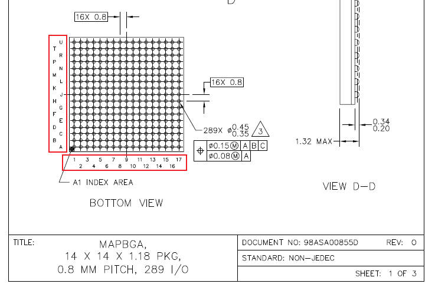

可以看到，整个芯片有`17 × 17 = 289`个引脚，但我们用的开发板绝对没有引出来这么多IO。为什么？

因为很多引脚是用来供电或者接地的。我们的SoC有多个外设，需要很强的供电，不可能只用一个引脚就完成了供电。下面是用于供电和接地的引脚：

VCC和VDD用来供电，VSS就是GND接地端。

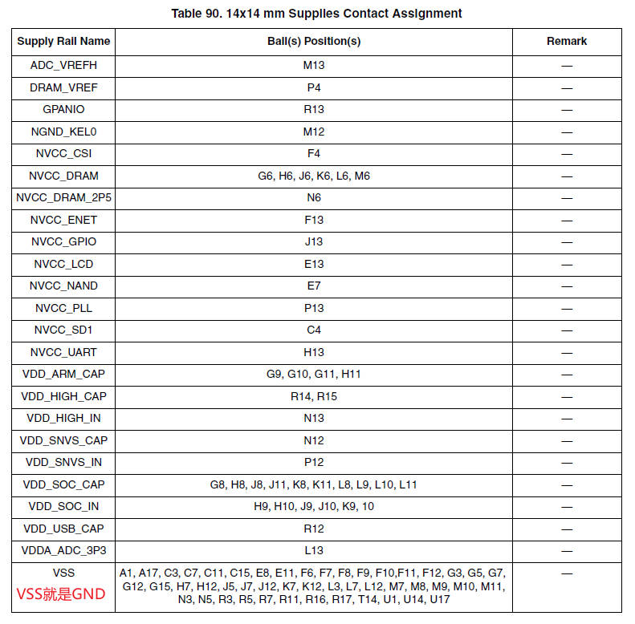

### 9.2 引脚复用

我们要怎么知道每一个引脚，可以复用成什么功能呢？

**一般在核心板的原理图上，都会标注每个引脚的复用功能。**

以`imx6ull`核心板为例：

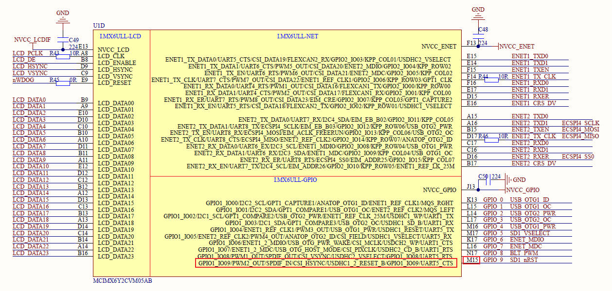

这个引脚是`GPIO1_IO09`，对应的`BGA`封装位置是M15。我们可以翻一下`imx6ull数据手册`。

确实如此。数据手册写的`GPIO1_IO09`对应M15，复用功能为`ALT5`。

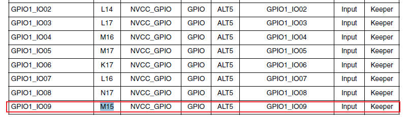

下面来看引脚复用功能。可以看到，核心板原理图与`imx6ull参考手册`一致。且`ALT5`确实就是复用为`GPIO1_IO09`。

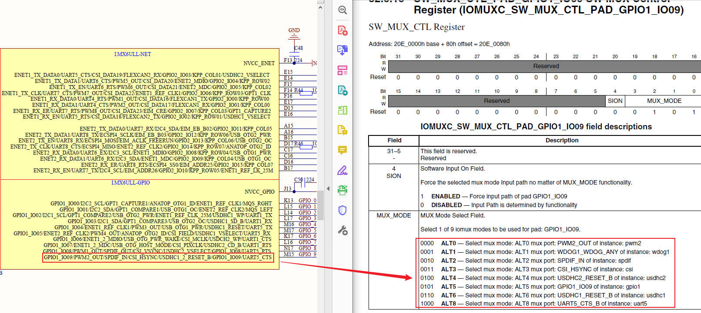

## 第10章 `pinctrl`

### 10.1 `pinctrl`简介

Linux内核提供了pinctrl子系统，pinctrl是`pin controller`的缩写，目的是为了统一各芯片原厂的pin脚管理。所以一般pinctrl子系统的驱动，由芯片原厂的BSP工程师实现。

有了pinctrl子系统以后，驱动工程师就可以通过配置设备树使用pinctrl子系统，来设置管脚服用以及管脚的电气属性。

### 10.2 语法规则：客户端与服务端分离

pinctrl的语法，我们可以看做由2部分构成：客户端client和服务端service。

#### 10.2.1 客户端(设备节点)

客户端的语法格式是固定的，所有硬件平台的语法都一样。必须记住。

1. `pinctrl-names`：表示设备的状态。如"default"、"sleep"，表示设备在不同工作模式下的配置
2. `pinctrl-0、princtrl-1`：按索引引用服务端service中的引脚

```dts
// client客户端
&i2c1 {
	pinctrl-names = "default";
	pinctrl-0 = <&pinctrl_i2c1>;

	mag3110@0e {
		compatible = "fsl,mag3110";
		reg = <0x0e>;
	};
};

// service服务端
&iomuxc {
	pinctrl_i2c1: i2c1grp {
		fsl,pins = <
			MX6UL_PAD_UART4_TX_DATA__I2C1_SCL 0x4001b8b0
			MX6UL_PAD_UART4_RX_DATA__I2C1_SDA 0x4001b8b0
		>;
	};
};
```

分析下面的设备树客户端代码：

1. 这里有default和wake up两个状态。default为第0个状态，wake up为第1个状态
2. pinctrl-0 = <&pinctrl_hog_1>表示第0个状态default对应的引脚，在pinctrl_hog_1节点中配置
3. pinctrl-1同理

```dts
pinctrl-names = "default", "wake up;
pinctrl-0 = <&pinctrl_hog_1>;
pinctrl-1 = <&pinctrl_hog_2>;
```

#### 10.2.2 服务端(pinctrl节点)

服务端pinctrl节点，定义具体的引脚服用功能和电气属性，平台相关。

```dts
// service服务端
&iomuxc {
	pinctrl_i2c1: i2c1grp {
		fsl,pins = <
			MX6UL_PAD_UART4_TX_DATA__I2C1_SCL 0x4001b8b0
			MX6UL_PAD_UART4_RX_DATA__I2C1_SDA 0x4001b8b0
		>;
	};
};
```

以上面的代码为例。分析如下：

1. NXP有个规律：前面`MX6UL_PAD`这一部分不用管，中间`UART4_TX_DATA`代表的是引脚名称，后面`I2C1_SCL`表示我们把引脚设置成什么功能
2. `MX6UL_PAD_UART4_TX_DATA__I2C1_SCL`实际上是一个宏定义。我们看一下具体代码。可以看到，`UART4_TX_DATA`这个引脚可以用作多个功能，具体由复用寄存器来配置。复用寄存器的值为0x2表示`ALT2`

	`imx6ul-pinfunc.h`
	```c
	/*
	* The pin function ID is a tuple of
	* <mux_reg conf_reg input_reg mux_mode input_val>
	*/
	#define MX6UL_PAD_UART4_TX_DATA__UART4_DCE_TX                     0x00B4 0x0340 0x0000 0x0 0x0
	#define MX6UL_PAD_UART4_TX_DATA__UART4_DTE_RX                     0x00B4 0x0340 0x063C 0x0 0x0
	#define MX6UL_PAD_UART4_TX_DATA__ENET2_TDATA02                    0x00B4 0x0340 0x0000 0x1 0x0
	#define MX6UL_PAD_UART4_TX_DATA__I2C1_SCL                         0x00B4 0x0340 0x05A4 0x2 0x1
	#define MX6UL_PAD_UART4_TX_DATA__CSI_DATA12                       0x00B4 0x0340 0x04F4 0x3 0x0
	#define MX6UL_PAD_UART4_TX_DATA__CSU_CSU_ALARM_AUT02              0x00B4 0x0340 0x0000 0x4 0x0
	#define MX6UL_PAD_UART4_TX_DATA__GPIO1_IO28                       0x00B4 0x0340 0x0000 0x5 0x0
	#define MX6UL_PAD_UART4_TX_DATA__ECSPI2_SCLK                      0x00B4 0x0340 0x0544 0x8 0x1
	```
	这个宏定义展开是5个值。分别对应`复用寄存器(复用功能)`、`配置寄存器(电气属性)`、`输入寄存器(某些外设需通过此寄存器配置输入路径)`、`复用值`、`输入寄存器值(仅当input_reg≠0时有效，否则忽略)`。
	
	我们对着芯片手册来看下：
	```c
	#define MX6UL_PAD_UART4_TX_DATA__I2C1_SCL                         0x00B4 0x0340 0x05A4 0x2 0x1
	```
	*`0x00B4`为复用寄存器偏移地址，`0x2`为复用寄存器的值，正好为`ATL2`*
	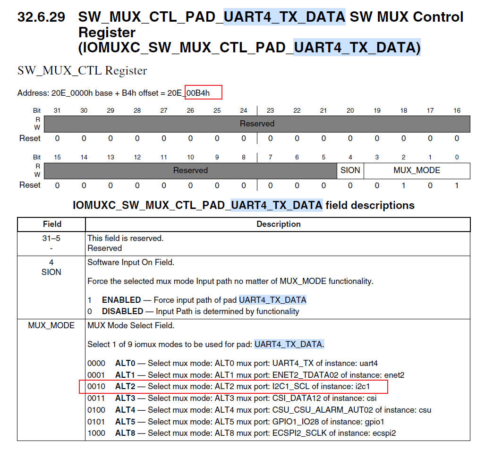
	*`0x0340`为设置电气属性的寄存器*
	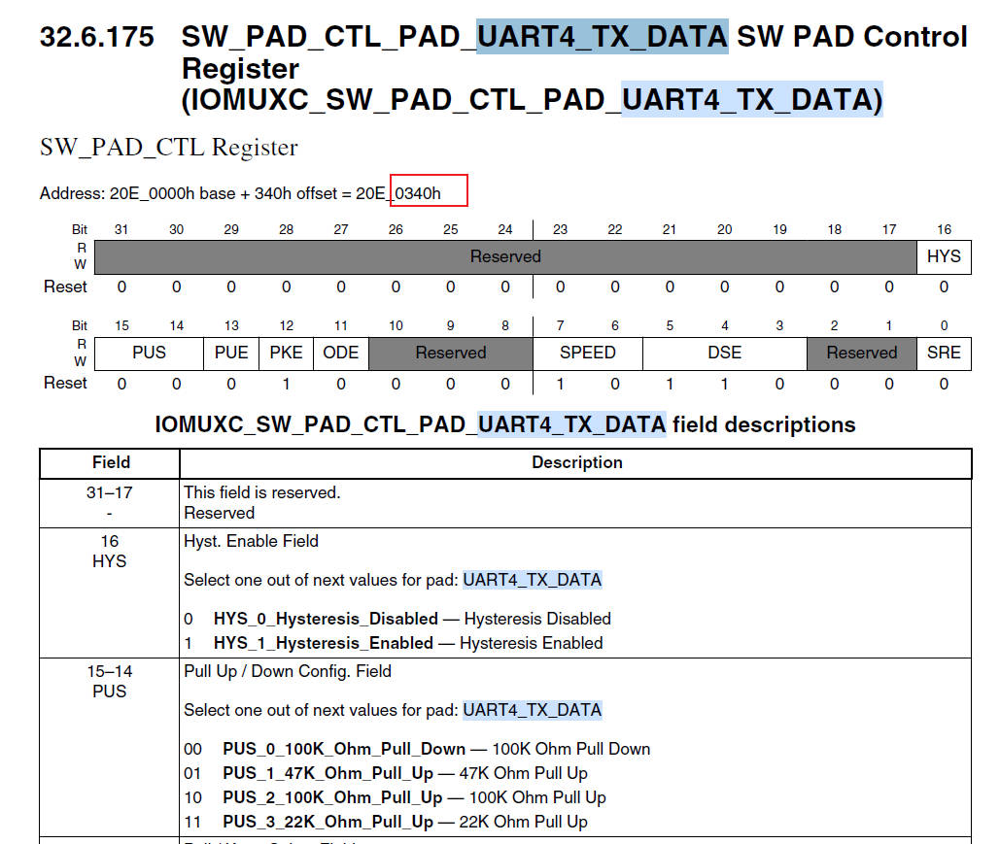
	*`0x05A4`为输入寄存器地址，0x1为选择`ALT2`*
	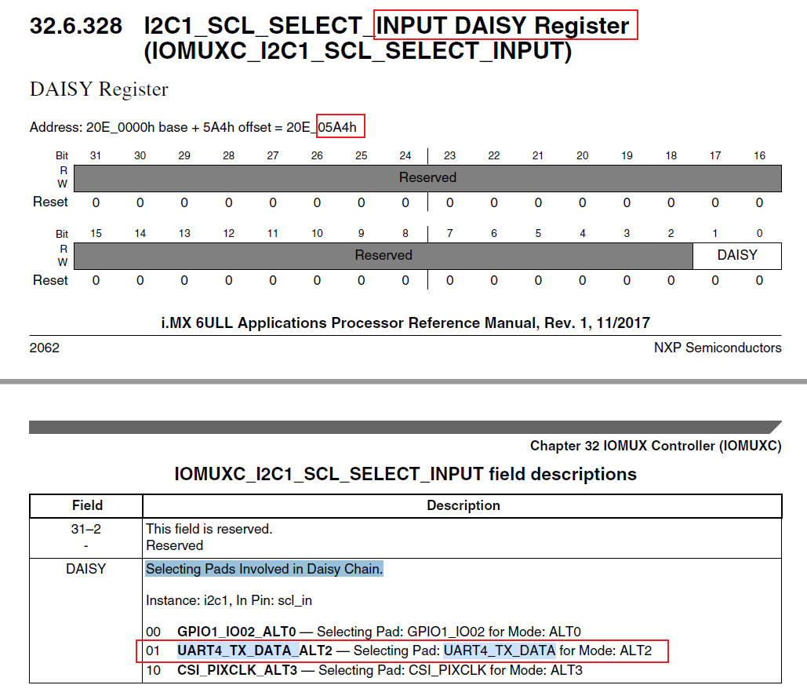

#### 10.2.3 `pinctrl`电气属性

	`pinctrl`最后一个值为电气属性，我们要根据芯片手册来进行设置。

### 10.3 `hog(独占)`引脚

pinctrl的hog机制，在内核初始化阶段具有特殊作用，主要用于强制锁定关键引脚配置，确保系统基础功能在驱动加载前可用。

```dts
&iomuxc {
	pinctrl-names = "default";
	pinctrl-0 = <&pinctrl_hog_1>;
	imx6ul-evk {
		pinctrl_hog_1: hoggrp-1 {
			fsl,pins = <
				MX6UL_PAD_UART1_RTS_B__GPIO1_IO19	0x17059 /* SD1 CD */
				MX6UL_PAD_GPIO1_IO05__USDHC1_VSELECT	0x17059 /* SD1 VSELECT */
				MX6UL_PAD_GPIO1_IO09__GPIO1_IO09        0x17059 /* SD1 RESET */
			>;
		};
	};
};

&iomuxc_snvs {
	pinctrl-names = "default_snvs";
	pinctrl-0 = <&pinctrl_hog_2>;
	imx6ul-evk {
	pinctrl_hog_2: hoggrp-2 {
			fsl,pins = <
				MX6ULL_PAD_SNVS_TAMPER0__GPIO5_IO00      0x80000000
			>;
		};
	}
};
```

#### 10.3.1 `pinctrl hog`特殊之处

1. `hog`引脚在内核启动早期被强制配置并锁定，禁止其他驱动重复占用或修改。例如：调试串口uart引脚被标记为hog，确保内核日志输出不受后续驱动影响
2. 配置时机早于驱动加载。`hog`引脚的配置发生在内核初始化阶段，早于任何外设驱动的`probe()`函数。例如：复位引脚、关键电源控制引脚需在系统启动时立即生效
3. `hog`引脚在设备树中，通常以`pinctrl_hog_x`命名(如`pinctrl_hog_1`)，并通过根节点的`pinctrl-0`引用。例如：

	```dts
	&iomuxc {
		pinctrl-names = "default";
		pinctrl-0 = <&pinctrl_hog_1>; // 引用hog组
		imx6ul-evk {
			pinctrl_hog_1: hoggrp {
				fsl,pins = <MX6UL_PAD_GPIO1_IO00__GPIO1_IO00 0x17059>; // 关键引脚
			};
		};
	};
	```

#### 10.3.2 `hog`与`非hog`配置的对比

| 类型 | 处理时机 | 是否独占 | 典型场景 |
| - | - | - | - |
| hog引脚 | 内核启动早期 | √ | 调试串口、复位引脚 |
| default状态 | 驱动probe()前 | × | 外设(i2c spi)使能 |
| sleep状态 | 驱动运行时切换 | × | 低功耗模式 |

#### 10.3.3 设计意义与最佳实践

+ 避免冲突：`hog`机智解决多驱动竞争关键引脚的问题(如多个驱动误配置同一复位引脚)
+ 保障启动可靠性：确保调试串口等核心功能在驱动初始化前可用，便于问题追踪
+ 开发建议：

	+ 仅将全局关键引脚(时钟、复位、调试接口)设为hog，避免过度占用影响外设灵活性
	+ 非关键外设(传感器、扩展IO)应使用default状态，在驱动加载时按需配置

## 第11章 `phandle`机制

在设备树中，phandle是一种唯一标识符，用于节点间的引用(如中断控制器、时钟源)。其分配方式分为自动分配(隐式)和手动分配(显式)两种。

### 11.1 phandle的分配机制

#### 11.1.1 自动分配(隐式)

+ 触发条件：在`.dts`源文件中使用label标签来引用节点(如&label)，不显式定义phandle
+ 编译过程：设备树编译器dct在生成.dtb时，自动为被引用的节点生成唯一phandle，并插入到二进制中
+ 示例：

	```dts
	// DTS 源码（未显式定义 phandle）
	pic: interrupt-controller@1000 {  // 标签 pic
		interrupt-controller;
	};

	uart0: serial@2000 {
		interrupts = <10>;
		interrupt-parent = <&pic>;  // 通过标签引用
	};
	```

	编译后的dtb中，dtc自动为pic节点分配`phandle = <1>` 并将`<&pic>`替换成`<1>`

#### 11.1.2 手动分配(显式)

+ 触发条件：在`.dts`中显式定义phandle属性(需确保全局唯一)
+ 注意事项：易冲突且难维护，通常不推荐
+ 示例：

	```dts
	interrupt-controller@1000 {
		phandle = <1>;  // 显式指定值
		interrupt-controller;
	};

	serial@2000 {
		interrupts = <10>;
		interrupt-parent = <1>;  // 直接使用 phandle 值
	};
	```

### 11.2 关键设计要点

1. 唯一性要求：phandle必须在整个设备树中唯一，dtc自动分配时通过全局计数器保证(如1、2、3...)
2. 应用方式
	+ 标签语法(&label)：提高可读性，避免硬编码
	+ 直接数值：仅用于特殊场景(如覆盖补丁设备树)

### 11.3 phandle生成流程

1. 编译入口：开发者执行编译命令 `dtc -I dts -O dtb -o output.dtb input.dts`，dtc开始解析dts文件
2. 扫描引用关系：dct遍历设备树所有节点，识别被标签引用的节点(如&pic指向的节点)，并标记为需分配phandle
3. 分配与替换
	+ 为被引用节点分配phandle值(按全局计数器顺序，从1开始)
	+ 替换引用点：将`&pic`替换为`<1>`，即`interrupt-parent = <1>`

### 11.4 多引用场景的处理

+ 同一节点被多次引用：无论被引用多少次(如多个设备引用同一个中断控制器)，dtc仅分配一个phandle，所有引用点共享同一值
+ 未引用的节点：未被标签引用的节点不会自动生成phandle，以减少二进制体积

### 11.5 实例演示

设备树源码.dts

```dts
/dts-v1/;
/ {
    intc: interrupt-controller@1000 {   // 标签 intc
        interrupt-controller;
    };
    uart0: serial@2000 {                 // 标签 uart0
        interrupt-parent = <&intc>;      // 引用 intc
    };
};
```

编译后dtb的反编译结果(.dts)格式

```dts
/dts-v1/;
/ {
    interrupt-controller@1000 {
        phandle = <0x00000001>;          // 自动分配 phandle=1
        interrupt-controller;
    };
    serial@2000 {
        interrupt-parent = <0x00000001>; // 替换为 phandle 值
    };
    // 若编译时加 -@，此处会生成 __symbols__ 节点
    __symbols__ {
        intc = "/interrupt-controller@1000";
        uart0 = "/serial@2000";
    };
};
```
