# 使用设备树

## 第1章 `dtb`文件格式详解

设备树`dtb`格式，是设备树数据的平面二进制编码。它用于在软件程序之间交换数据，如boot传递dtb给内核。

### 1.1 `dtb`文件格式

dtb格式，由1个小头部和3个可变大小的部分组成：内存保留块、结构块和字符串块。结构如下：

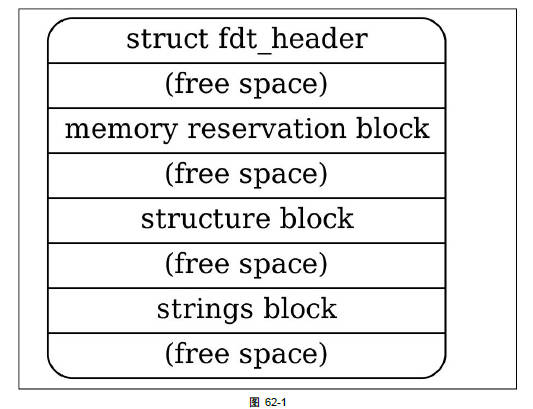

### 1.2 实例分析

以下面的设备树文件为例，分析二进制格式：

```dts
/dts-v1/;

/{
    model = "this is my device tree";
    #address-cells = <1>;
    #size-cells = <1>;
    
    chosen {
        bootargs = "root=/dev/nfs rw nfsroot=192.168.1.1 console=ttyS0,115200";
    };

    cpus {
        #address-cells = <1>;
        #size-cells = <0>;

        cpu0: cpu@0 {
            device-type = "cpu";
            compatible = "arm,cortex-a7";
            reg = <0>;
        };
    };

    aliases {
        led1 = "/gpio@22020101";
    };

    node1 {
        #address-cells = <1>;
        #size-cells = <1>;
        gpio@22020102 {
            reg = <0x20220102 0x40>;
        };
    };

    node2 {
        node1-child {
            pinnum = <01234>;
        };
    };

    gpio@22020101 {
        compatible = "led";
        reg = <0x20220101 0x40>;
        status = "okay";
    };
};
```

使用dtc工具，把设备树编译成二进制文件：

```sh
dtc -I dts -O dtb -o imx6ull_test.dtb imx6ull_test.dts
```

dtb的头布局由以下C结构定义。所有的头字段都是u32整数，以大端格式存储。

```c
struct fdt_header {
	uint32_t magic;			 /* magic word FDT_MAGIC */
	uint32_t totalsize;		 /* total size of DT block */
	uint32_t off_dt_struct;		 /* offset to structure */
	uint32_t off_dt_strings;	 /* offset to strings */
	uint32_t off_mem_rsvmap;	 /* offset to memory reserve map */
	uint32_t version;		 /* format version */
	uint32_t last_comp_version;	 /* last compatible version */

	/* version 2 fields below */
	uint32_t boot_cpuid_phys;	 /* Which physical CPU id we're
					    booting on */
	/* version 3 fields below */
	uint32_t size_dt_strings;	 /* size of the strings block */

	/* version 17 fields below */
	uint32_t size_dt_struct;	 /* size of the structure block */
};
```

下面详细解释每个字段的含义：

| 字段 | 描述 |
| - | - |
| magic | 固定值0xd00dfeed |
| totalsize | 设备树数据结构的总大小(以字节为单位). 此大小包含了所有部分 |
| off_dt_struct | 结构块从头开始的以字节为单位的偏移量 |
| off_dt_strings | 字符串块从头开始的以字节为单位的偏移量 |
| off_mem_rsvmap | 内存保留块从头开始的以字节为单位的偏移量 |
| version | 设备树数据结构的版本 |
| last_comp_version | 向后兼容的设备树数据结构的最低版本 |
| boot_cpuid_phys | 启动的cpu id，与设备树cpu节点的reg属性对应 |
| size_dt_strings | 字符串块部分的字节长度 |
| size_dt_struct | 结构块部分的字节长度 |

#### 1.2.1 `magic`

magic固定为0xd00dfeed，对应的dtb

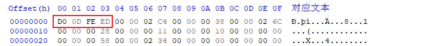

#### 1.2.2 `totalsize`

totalsize表示dtb文件的总字节数

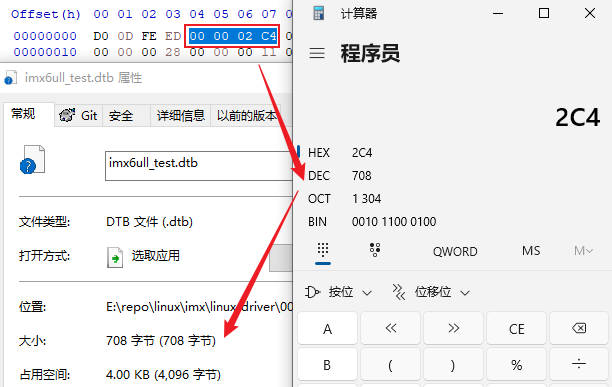

#### 1.2.3 `version和last_comp_version`

当前设备树版本为0x11(17)，能够向后兼容的设备树最低版本为0x10(16)


#### 1.2.4 `boot_cpuid_phys`

从cpu 0启动


#### 1.2.5 `size_dt_strings`

字符串块的长度

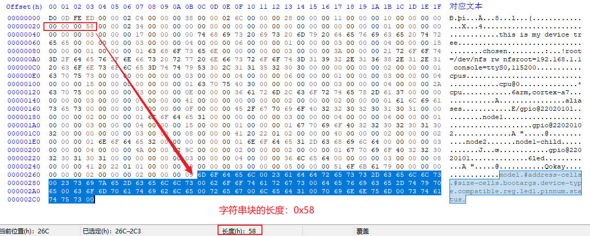

#### 1.2.6 `size_dt_struct`

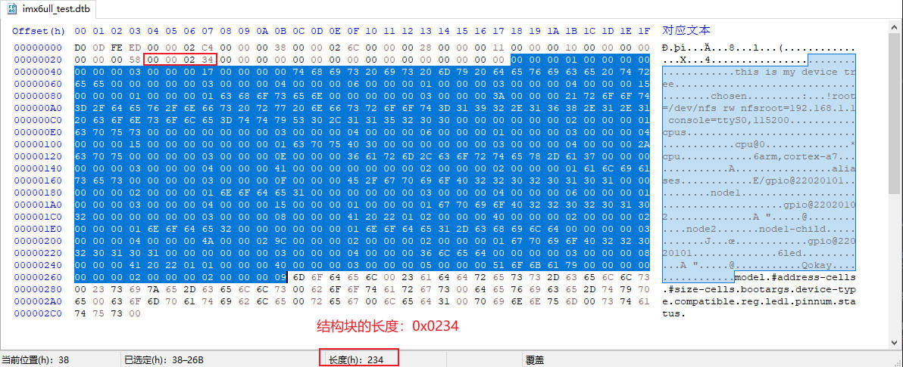

接下来我们详细介绍：内存保留块、结构块、字符串块。

### 1.3 内存保留块

在aem linux中，设备树的内存保留块是一种关键机制，用于在物理内存中预留特定区域，使其不被内核的常规内存管理系统分配使用。

#### 1.3.1 核心作用

1. 隔绝物理内存区域：通过设备树的`reserved-memory`节点，将其物理地址范围标记为保留，内核在启动时将其从`memblock`子系统移除，确保操作系统不会分配这些区域给用户程序或内核通用模块
2. 支持专用硬件访问：保留特定区域通常由特定硬件（如FPGA、DMA、GPU）直接访问。例如：FPGA通过共享内存与ARM通信
3. 提升系统稳定性与性能
    + 减少碎片化：避免大块连续内存被拆分，满足需要物理连续内存的设备
    + 低延迟访问：硬件可直接访问保留内存，无需内核介入，提升实时性

#### 1.3.2 技术实现方式

内存保留块包括2部分：定义节点、绑定节点。

##### 1.3.2.1 定义节点

在设备树的`reserved-memory`节点下声明子节点，指定地址和大小

```dts
reserved-memory {
    #address-cells = <2>;
    #size-cells = <2>;
    ranges;
    my_reserved: my_region@10000000 {
        compatible = "shared-dma-pool"; // 常用属性
        reg = <0x0 0x10000000 0x0 0x1000000>; // 起始地址0x10000000，大小16MB
        no-map; // 禁止内核创建映射
    };
};
```

关键属性：

1. `reg`：定义起始地址和长度
2. `no map`：内核不创建页表映射，需驱动通过ioremap手动映射
3. `compatible = shared-dma-pool`：表示用于DMA的连续内存池

##### 1.3.2.2 绑定节点(私有 vs 共享保留内存)

+ 私有保留保存

通过`memory-region`绑定到特定设备节点，仅限该驱动设备访问

```dts
my_device {
    compatible = "vendor,device";
    memory-region = <&my_reserved>; // 引用保留内存
};
```

+ 共享保留内存

添加`linux,cma-default`属性，作为全局连续内存分配池，供所有设备通过`dma_alloc_coherent()`申请

#### 1.3.3 数据结构

在设备树二进制文件dtb中，内存保存块的数量可通过解析其特定结构来确定。内存保留块的位置与结构：

1. 位置信息：dtb头部的`off_mem_rsvmap`字段，指明了内存保留块的起始偏移地址
2. 数据结构：由连续的`fdt_reserve_entry`结构体数组构成，数组成员为u64整数
3. 结束标志：保留块以全0的`fdt_reserve_entry`(即address=0，size=0)，作为结束标记

```c
struct fdt_reserve_entry {
	uint64_t address;
	uint64_t size;
};
```

下面是我们测试的设备树文件的dtb，由于没有定义预留块，这里`fdt_reserve_entry`直接就是全0(结束标志)

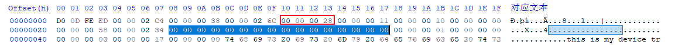

### 1.4 结构块

结构块是dtb中描述设备树本身结构和内容的部分。它由一系列带有数据的令牌序列组成，这些令牌按照线性树结构进行组织。

#### 1.4.1 令牌类型

+ FDT_BEGIN_NODE (0x00000001)：标记表示节点的开始，后接节点名称(以\0结尾的字符串). 节点名称后可能需要填充0字节以对齐，然后是下一个标记

    每个节点的开始，包括2部分：
    1. TAG(0x00000001)
    2. 节点名称字符串(可能需要填充0字节对齐)

    ```c
    struct fdt_node_header {
        uint32_t tag;   // 固定为0x00000001
        char name[0];   // 节点名称字符串
    };

    int fdt_begin_node(void *fdt, const char *name)
    {
        struct fdt_node_header *nh;
        int namelen = strlen(name) + 1;

        nh = _fdt_grab_space(fdt, sizeof(*nh) + FDT_TAGALIGN(namelen));
        nh->tag = cpu_to_fdt32(FDT_BEGIN_NODE/*0x0000 0001*/);
        memcpy(nh->name, name, namelen);
        return 0;
    }
    ```

+ FDT_END_NODE (0x00000002)：标记表示节点的结束，无额外数据. 紧跟其后的是下一个标记

+ FDT_PROP (0x00000003)：标记表示设备树中属性的开始。他后面跟着描述属性的额外数据

    每个属性，包括4部分：

    1. TAG(0x00000003)
    2. 属性值的字节长度
    3. 属性名称字符串偏移
    4. 属性值字符串(可能需要填充0字节对齐)

    ```c
    struct fdt_property {
        uint32_t tag;       // 固定为0x00000003
        uint32_t len;       // 属性值的字节长度
        uint32_t nameoff;   // 属性名称在字符串块的偏移量
        char data[0];       // 属性值字符串
    };

    int fdt_property(void *fdt, const char *name, const void *val, int len)
    {
        struct fdt_property *prop;
        int nameoff;

        FDT_SW_CHECK_HEADER(fdt);

        nameoff = _fdt_find_add_string(fdt, name);
        prop = _fdt_grab_space(fdt, sizeof(*prop) + FDT_TAGALIGN(len));

        prop->tag = cpu_to_fdt32(FDT_PROP/*0x0000 0003*/);
        prop->nameoff = cpu_to_fdt32(nameoff);
        prop->len = cpu_to_fdt32(len);
        memcpy(prop->data, val, len);
        return 0;
    }
    ```

+ FDT_END (0x00000009)：标记表示结构块的结束。应该只有一个`FDT_END`标记，并且应该是结构块中的最后一个标记。该标记没有额外的数据，紧随其后的字节就是字符串块

#### 1.4.2 实例分析

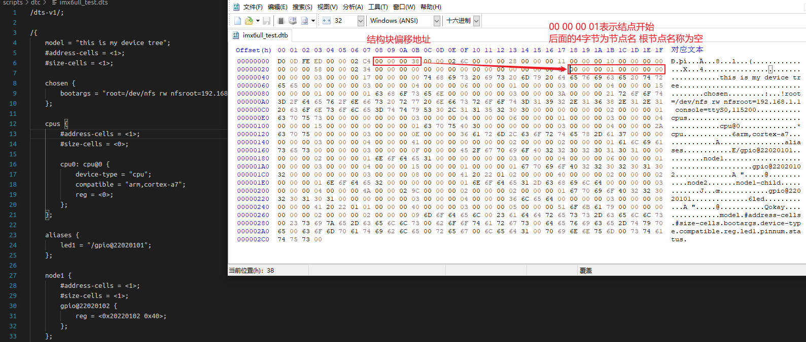

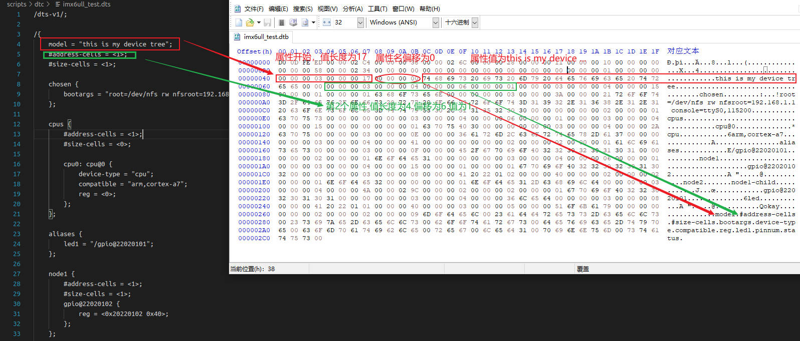

### 1.5 字符串块

字符串块用于存储设备树中使用的所有属性名称。它由一系列以`\0`空字符结尾的字符串组成。这些字符串在字符串块中简单的连接在一起。

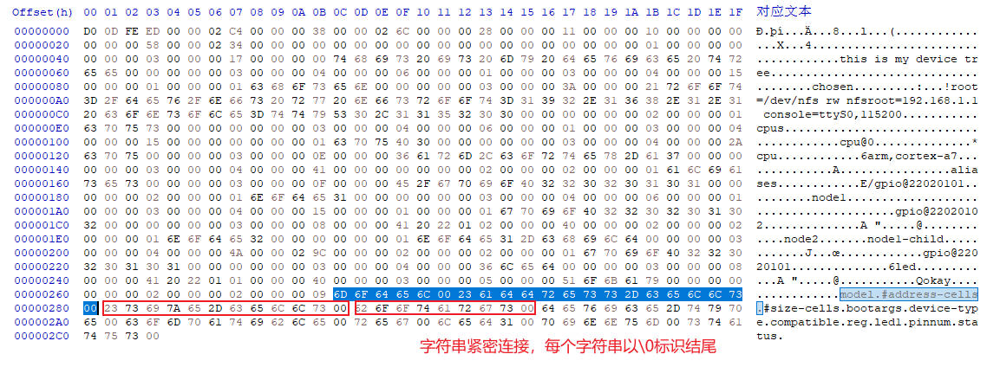

1. 字符串连接：字符串块中的字符串，以空字符\0作为终止符来连接。这意味着每个字符串都以空字符结尾，并且下一个字符串紧跟在上一个字符串的末尾
2. 偏移量引用：在结构块中，属性的名称是通过偏移量来引用字符串块中的相应字符串的
3. 对齐约束：字符串块没有对齐约束，这意味着它可以出现在设备树dcb的任何偏移处

## 第2章 `dtb`展开成`device_node`

### 2.1 `device_node`设备节点

Linux内核中`device_node`结构体，是设备树的核心数据结构，用于描述设备树中的节点信息。

```c
struct device_node {
	const char *name;               // 节点名称(非完整路径)，取自设备树节点名的首段
	const char *type;               // 设备类型，取自节点中的 device_type 属性(可选)
	u32 phandle;                    // 节点的唯一标识符，用于跨节点引用(如中断映射)
	const char *full_name;          // 节点的完整路径名(如"/soc/uart@10000000")

	struct	property *properties;   // 属性链表头指针
	struct	device_node *parent;    // 父设备节点指针
	struct	device_node *child;     // 子设备节点指针
	struct	device_node *sibling;   // 兄弟设备节点指针(平级的节点)
	struct	kobject kobj;           // 内核对象(用于sysfs)
	void	*data;                  // 与设备节点相关的数据指针
};
```

#### 2.1.1 `name`成员

##### 2.1.1.1 节点标识与查找

1. 功能说明：`device_node`结构体的`name`成员，存储设备树节点的基础名称(即节点名中@前的部分)，如节点`serial@10000000`的name值为"serial"
2. 实际应用：内核通过`of_find_node_by_name()`等API基于`name`查找节点，例如：

    ```c
    struct device_node *np = of_find_node_by_name(NULL, "serial"); // 查找所有名为"serial"的节点
    ```

    在设备树解析阶段，name用于快速定位同类型节点(如多个串口设备)

##### 2.1.1.2 设备创建与驱动匹配

1. 驱动关联：内核将`device_node`转换为`platform_device`时，会将`name`作为`platfoem_device.name`的一部分，驱动再通过`compatible`或名称匹配设备
2. 实例对比：
    设备树节点：
    ```dts
    i2c0: i2c@400000 {
        compatible = "vendor,i2c-controller";
    };
    ```
    对应的`device_node.name = i2c`，内核生成`platfoem_device.name = i2c@400000` 完整路径用于唯一性，但基础名称为i2c
3. 调试接口：`/proc/device-tree`目录中，每个子目录名即为节点的`name`值

##### 2.1.1.3 节点关系构建

设备树通过`parent、child、sibling`指针构建树状结构，name作为节点的标签，辅助开发者理解设备层级关系。

```dts
soc {                          // parent节点 name="soc"
    serial@1000 { ... };       // child节点 name="serial"
    spi@2000 { ... };          // sibling节点 name="spi"
};
```

##### 2.1.1.4 实际场景对比表

| 场景 | 设备树节点示例 | `device_node.name`值 | 内核行为 |
| - | - | - | - |
| 串口设备注册 | `serial@10000000` | `serial` | 驱动匹配时识别为串口设备 |
| I2C控制器初始化 | `i2c@400000` | `i2c` | 生成`platform_device`并注册i2c总线 |
| 调试信息打印 | `ethernet@ff000000` | `ethernet` | 日志中显式`Probing ethernet device...` |
| 节点遍历 | `gpio@ff00a000` | `gpio` | 通过`of_find_node_by_name()`查找所有gpio节点 |

#### 2.1.2 `type`成员

Linux内核的`device_node`结构体中，type成员用于标识设备的类型分类，其值来源于设备树节点中的`device_type`属性

##### 2.1.2.1 标识设备的功能类型

1. 功能说明：`type`成员存储设备树节点中，`device_type`属性的值。用于区分设备的基础功能类型(如cpu、内存、总线控制器)
2. 设备树示例：
    ```dts
    cpu0: cpu@0 {
        device_type = "cpu";       // 标识为CPU设备
        compatible = "arm,cortex-a53";
    };
    memory@80000000 {
        device_type = "memory";   // 标识为内存设备
        reg = <0x80000000 0x20000000>;
    };
    ```
    内核解析后：
    + cpu节点的`device_node.name = "cpu"`
    + 内存节点的`device_node.name = "memory"`

##### 2.1.2.2 辅助内核识别关键硬件

1. 特殊节点标识：部分关键硬件(如cpu、memory)必须通过`device_type`属性明确类型，内核根据此初始化全局数据结构
    + 内存结点：`device_type = "memory"`是识别物理内存区域的必要条件，内核根据此调用`memblock_add()`保留内存
    + cpu节点：`device_type = "cpu"`同于构建cpu拓扑结构
2. 内核行为：若设备树中未标记memory节点，内核可能无法正确初始化内存，导致系统崩溃

##### 2.1.2.3 兼容旧驱动接口(历史原因)

1. 历史API依赖：早期内核通过`of_find_node_by_type()`函数，按类型查找节点(如查找所有cpu节点)

    ```c
    struct device_node *np = of_find_node_by_type(NULL, "serial"); // 查找所有串口设备
    ```

    现代驱动已转向使用`compatible`属性匹配设备，但此API仍保留

2. 现状：`device_type`在普通外设(如uart、i2c)极少使用，仅在cpu、memory等核心硬件中保留

#### 2.1.3 `full_name`成员

Linux内核的`device_node`结构体中，`full_name`成员用于存储设备节点的完整路径名称，其核心作用在于提供设备树中节点的全局唯一标识。

##### 2.1.3.1 节点的全局唯一标识

1. 路径表示形式：`full_name`的格式为`node-name[@unit-address]`，例如`/soc/serial@40001000`，它通过富子结点层级关系唯一确定设备在设备树中的位置
2. 唯一性保障：在设备树中，同一父节点下的子节点名称需唯一(通过unit-address区分)，而`full_name`从根节点开始拼接，确保整个设备树中无重复路径

##### 2.1.3.2 节点查找与遍历的基石

内核提供一下API，依赖`full_name`进行节点操作：

1. 路径查找：`of_find_node_by_path()`：直接通过完整路径(如"/soc/i2c@400000")定位节点，内部需匹配`full_name`字段
2. 调试信息定位：内核打印节点日志时，如`pr_info("Found node: %s\n", np->full_name)`，`full_name`提供可读性强的定位信息，便于开发者快速识别问题节点

##### 2.1.3.3 内核解析流程中的生成机制

在设备树解析阶段(`unflatten_device_tree()`函数中)：

1. 首次扫描：计算节点所需内存空间，包括`full_name`的长度
2. 节点创建：递归遍历设备树时，动态生成`full_name`并填充到`device_node`结构体中
3. 例如：父节点`full_name = "/soc"`，子节点名称为`serial@1000` -> 子节点`full_name = "/soc/serial@1000"`

#### 2.1.4 `properties`成员

在Linux内核中，`properties`成员是设备树节点属性链表的头指针，核心作用是存储和管理设备节点的所有配置信息。

##### 2.1.4.1 `properties`属性链表的构建流程

设备树解析时(unflatten_device_tree()函数)，内核将dtb中的属性转换为链表：

1. 首次扫描：计算节点所需内存空间(包括属性链表)
2. 分配内存：为`struct property`分配内存，填充属性名、值、长度
3. 链表链接：将同一节点的所有属性通过`next`指针串联，链表头存入`device_node.properties`

##### 2.1.4.2 内核操作属性的API

驱动通过of函数，访问`properties`链表。

1. 查找属性：`struct property *prop = of_find_property(node, "reg", NULL);` 返回reg属性的`struct property`指针
2. 读取属性值：
    + 字符串：`of_property_read_string(node, "compatible", &str)`
    + 整数数组：`of_property_read_u32_array(node, "reg", reg_data, 2)`
    + 单整数：`of_property_read_u32(node, "clock-frequency", &freq)`
3. 资源映射：
    ```c
    void __iomem *base = of_iomap(node, 0); // 映射reg属性中的第一个寄存器地址
    ```

#### 2.1.5 `parent`成员

##### 2.1.5.1 构建设备树层级结构

`device_node`结构体的`parent`成员，主要用于构建设备树的树状拓扑结构，并支持资源继承、节点查找及硬件初始化等核心功能

```dts
soc {                          // parent节点（根节点子节点）
    i2c@400000 {               // 父节点（soc的子节点）
        sensor@1a {            // 子节点（i2c的子节点）
            compatible = "ti,tmp102";
        };
    };
};
```

内核解析后：

1. `sensor@1a -> parent -> 指向i2c@400000节点`
2. `i2c@400000 -> parent -> 指向soc节点`
3. 通过`parent`、`child`、`sibling`指针，内核将设备树组织为多级链表结构

##### 2.1.5.2 资源继承与地址解析

子节点的硬件资源(如寄存器地址)，依赖父节点的配置信息

reg属性解析：子节点的reg属性(如`reg = <0x40000000 0x1000>`)，需结合父节点的(`#address-cells、#size-cells`)属性才能正确解析. 内核通过`parent`回溯父节点获取`#address-cells、#size-cells`值，进而解析子节点的reg

##### 2.1.5.3 节点查找与遍历

内核提供基于parent的API实现节点操作

1. 查找父节点

    ```c
    struct device_node *parent = of_get_parent(child_node);
    ```

    返回`child_node`的父节点指针，失败时返回NULL

2.遍历子节点

    ```c
    struct device_node *child;
    for_each_child_of_node(parent_node, child) {
        // 处理每个子节点
    }
    ```

    内部通过`parent->child`获取第一个子节点，再通过`sibling`遍历兄弟节点

#### 2.1.6 `child`成员

设备树的`child`成员，核心作用时构建设备树的树状拓扑结构，支持对子节点的遍历、资源继承和硬件初始化

##### 2.1.6.1 构建设备树层级结构

`child`指针指向当前节点的首个子节点，通过子节点的`sibling`指针，可遍历同级所有子节点，形成树状结构

##### 2.1.6.2 子节点遍历的核心机制

内核提供API通过child指针遍历子节点

1. 获取首个子节点

    ```c
    struct device_node *first_child = parent->child;
    ```

2. 迭代所有子节点

    ```c
    struct device_node *child;
    for_each_child_of_node(parent, child) {
        // 处理每个子节点
    }
    ```

3. 宏`for_each_child_of_node`内部实现依赖child和sibling指针的链式访问

##### 2.1.6.3 驱动开发中的典型应用

1. 总线控制器驱动

    + I2C/SPI控制器，需遍历其child链表，为每个子设备(如传感器、EEPROM)注册设备
    + 代码示例：

        ```c
        struct device_node *bus_node = pdev->dev.of_node;
        struct device_node *child;
        for_each_child_of_node(bus_node, child) {
            struct i2c_client *client = create_i2c_device(child);
            // 注册子设备
        }
        ```

2. 符合设备初始化：电源管理芯片(PMIC)节点下挂载多个子节点(稳压器、充电器)，通过`child`指针逐一初始化
3. 状态过滤：通过`of_get_next_avaliable_child()`跳过`status = "disabled"`的子节点，仅处理可用设备

#### 2.1.7 `sibling`成员

设备树`device_node`结构体中，`sibling`成员用于连接同一父节点下的所有子节点，形成链表结构。核心作用在于实现设备树中同级节点的遍历与组织。

##### 2.1.7.1 构建同级节点链表

1. 链表结构：当父节点(如总线控制器)有多个子节点(挂载在总线上的设备)时，`sibling`指针将这些子节点串联为链表
    + 父节点的`child`指针，指向第一个子节点
    + 第一个子节点的`sibling`指向第二个子节点。以此类推，知道最后一个节点的`sibling`为NULL
    ```c
    // 父节点 parent
    parent->child = child1;  // 首个子节点
    child1->sibling = child2;
    child2->sibling = child3; // 终止于 NULL
    ```
2. 设备树中的表现：设备树中同一层级的节点(如多个i2c设备)，通过`sibling`关联
    ```dts
        i2c@400000 {
        sensor@1a { ... }; // child1
        eeprom@50 { ... }; // child2 (child1->sibling)
    };
    ```

#### 2.1.8 `kobj`成员

Linux内核中，`device_node`结构体的`kobj`成员，是连接设备树节点与Linux同一设备模型的核心桥梁。主要实现设备在sysfs中的动态管理、资源生命周期控制及层级关系构建。

##### 2.1.8.1 核心功能

1. sysfs文件系统映射
    + 目录创建：每个`device_node`的`kobj`在sysfs中对应一个目录，路径如`/sys/firmware/devicetree/base/...`，目录名由kobj->name决定，通常与设备树节点名一致。用于可通过该目录访问设备树节点的属性(如compatible reg)
    + 属性导出：设备树节点的属性，如寄存器地址、中断号通过kobj关联的kobj_type操作集(sysfs_ops)转换为sysfs文件，支持用户空间通过`/cat/echo`读写
2. 引用计数与生命周期管理
    + 动态内存管理：`kobj->kref`记录设备的引用计数。当引用归零时，自动释放`device_node`及其关联资源
    + 安全卸载：驱动卸载或设备移除时，调用`kobject_put(kobj)`减少计数，避免内存泄露
3. 设备树层次结构构建
    + 父子关系：`kobj->parent`指向父节点的kobject，如i2c控制器，在sysfs中形成层级目录

##### 2.1.8.2 总结

`device_node->kobj`的本质，是设备树与Linux设备模型间的适配器。其核心作用可归纳为：

1. 用户接口：通过sysfs暴露设备树硬件配置，支持动态查看、修改
2. 生命周期管理：基于引用计数实现设备资源的自动回收

#### 2.1.9 `data`成员

Linux内核中，`device_node`结构体的`data`成员(void *data)是一个通用指针，主要用于存储设备树节点相关的驱动私有数据或平台特定信息。提供一种灵活的数据扩展机制，使开发者能够将设备树节点与自定义数据结构关联起来。

##### 2.1.9.1 存储驱动私有数据

驱动程序可为每个设备树节点分配独立的内存空间(如结构体)，存储设备配置、状态信息或硬件参数，并将指针赋值给data。下面是示例：

```c
struct my_device_data {
    int irq_num;
    void __iomem *reg_base;
    u32 clock_freq;
};
static int probe(struct platform_device *pdev) {
    struct device_node *np = pdev->dev.of_node;
    struct my_device_data *priv = devm_kzalloc(&pdev->dev, sizeof(*priv), GFP_KERNEL);
    np->data = priv; // 关联私有数据到节点
}
```

##### 2.1.9.2 传递平台特定信息

1. 非标准属性处理：若设备树包含非标准属性(如自定义校准参数)。驱动可通过data暂存解析后的值，避免重复解析设备树属性
2. 硬件抽象层适配：不同硬件平台对同意设备的实现差异，可通过data存储的配置参数适配，提升代码可移植性

##### 2.1.9.3 典型使用场景

1. 设备初始化阶段：在probe函数中解析设备树属性(如寄存器地址、中断号)，并将解析结果存入data指向的结构体，供后续(read/write)操作使用

2. 跨函数数据传递：在设备操作函数(open、ioctl)中，通过file->f_inode->i_cdev获取设备号，进而找到device_node并访问data，实现跨函数共享数据

3. 电源管理回调：在suspend/resume回调中，通过`data`快速访问设备状态寄存器，减少重复解析设备树的开销

### 2.2 `struct property`属性

在Linux设备树机制中，`struct property`用来存储硬件资源的键值对信息(诶寄存器地址、中断号、兼容性字符串)。

```c
struct property {
	char	*name;          // 属性名称(如"compatible"、"reg")
	int	length;             // 属性值长度(字节数)
	void	*value;         // 指向属性值的指针
	struct property *next;  // 指向同一节点的下一个属性
};
```

#### 2.2.1 结构体定义与成员解析

##### 2.2.1.1 `name`成员

+ 作用：标识属性类型(字符串)，如`compatible`表示驱动匹配标识，`reg`表示寄存器地址和大小
+ 实例："gpios"、"interrupts"

##### 2.2.1.2 `length`成员

+ 作用：属性值的字节长度。例如：
    + 字符串数组`"arm,pl011"`的长度为12(包括终止符\0)
    + 32位整数数组`<0x80000000 0x1000>`的长度为8字节(2个u32)

##### 2.2.1.3 `value`成员

+ 作用：指向属性值原始数据的指针，数据类型需结合name解析
    + 字符串：如`compatible = "ti,tmp75"`，value指向字符串存储地址
    + 数值数组：如`reg = <0x101f0000 0x1000>`，value指向u32数组

##### 2.2.1.4 `next`成员

+ 作用：构成单向链表，链接同一节点的所有属性。遍历节点属性时通过next逐个访问

#### 2.2.2 典型使用场景

##### 2.2.2.1 驱动匹配(`compatible`属性)

+ 设备树示例

    ```dts
    i2c1 {
        temperature-sensor@48 {
            compatible = "ti,tmp75";
            reg = <0x48>;
        };
    };
    ```

+ 内核中的`struct property`：
    + name = "compatible"，value = "ti,tmp75"， length = 9(含\0)
    + 驱动通过of_match_device()匹配compatible值，触发probe()函数

##### 2.2.2.2 资源获取(`reg/interrupts`属性)

+ 设备树示例

    ```dts
    serial@101f0000 {
        compatible = "arm,pl011";
        reg = <0x101f0000 0x1000>;
        interrupts = <0 12 4>;
    };
    ```

+ 内核解析流程

    ```c
    // 获取 reg 属性
    struct resource *res = platform_get_resource(pdev, IORESOURCE_MEM, 0);
    // 实际调用 of_address_to_resource()，依赖 reg 的 struct property
    ```

    + reg属性生成`struct property`：length = 8(2个u32)，value指向`[0x101f0000, 0x1000]`

##### 2.2.2.3 状态控制(`status`属性)

+ 设备树示例：`status = "disabeld"`
+ 内核行为：解析为`struct property`后，内核跳过该设备初始化

### 2.3 `dtb`展开成`device_node`

Linux内核将设备树二进制文件`.dtb`，解析为`device_node`结构树的过程，使设备驱动初始化的核心环节。该过程始于内核启动阶段的`start_kernel()`，经过多个关键步骤完成硬件描述的动态构建。

#### 2.3.1 整体流程概述

内核通过以下阶段完成dtb解析：

1. 启动入口：`start_kernel()`调用`setup_arch()`初始化架构相关配置
2. DTB验证与保留：`setup_machine_fdt()`验证dtb有效性，`arm_memblock_init()`保留dtb内存防止覆盖
3. 设备树展开：`unflatten_device_tree()`将dtb转换为`device_node`树结构
4. 节点属性填充：递归解析每个节点及其属性，构建树形关系

流程图解：

```
start_kernel() -> setup_arch() -> setup_machine_fdt()(验证dtb) -> arm_memblock_init()(保留内存) -> unflatten_device_tree()(核心解析)
```

#### 2.3.2 关键函数源码解析

##### 2.3.2.1 `__atags_pointer 设备树地址`

`__atags_pointer`是内核启动时用于存储uboot传递的设备树dtb物理地址的关键变量。其来源涉及uboot和kernel的启动约定，、汇编阶段的寄存器传递及内核初始化流程。

1. uboot启动内核阶段：需通过arm寄存器传递参数

    + r0：通常为0(历史遗留，无实际用途)
    + r1：传统方式中存放Machine ID(使用设备树是通常忽略)
    + r2：存放dtb的物理起始地址

    ```c
    // U-Boot 的 bootm 命令实现（arch/arm/lib/bootm.c）
    if (使用设备树) {
        r2 = (unsigned long)images->ft_addr; // DTB 物理地址
    } else {
        r2 = gd->bd->bi_boot_params;        // ATAGS 物理地址
    }
    kernel_entry(0, machid, r2);             // 跳转到内核入口
    ```

2. 内核汇编阶段：接收r2并保存至`__atags_pointer`

    + 初始化cpu和内存管理
    + 在`__mmap_switched`中保存启动参数，将r2的值存入变量`__atags_pointer`
    
    ```asm
    __mmap_switched:
        adr     r3, __mmap_switched_data
        ldmia   r3!, {r4, r5, r6, r7}         // 加载符号地址
        str     r9, [r4]                       // 保存 CPU ID
        str     r1, [r5]                       // 保存 Machine ID（传统方式）
        str     r2, [r6]                       // ↓ 将 r2 存入 __atags_pointer
        b       start_kernel                   // 跳转到 C 语言入口

    __mmap_switched_data:
        .long   __mmap_switched                // 函数自身地址（无用）
        .long   __bss_start                    // BSS 起始
        .long   _end                           // BSS 结束
        .long   processor_id                   // CPU ID 变量地址
        .long   __machine_arch_type            // Machine ID 变量地址
        .long   __atags_pointer                // ATAGS/DTB 指针变量地址 ← 关键！
    ```

##### 2.3.2.2 `启动入口：setup_arch()`

`__atags_pointer`，存储了dtb的物理地址，由uboot传递

```c
// arch/arm/kernel/setup.c
void __init setup_arch(char **cmdline_p) {
    const struct machine_desc *mdesc;
    mdesc = setup_machine_fdt(__atags_pointer); // 验证DTB并获取硬件描述
    arm_memblock_init(mdesc);                  // 保留DTB内存区域
    unflatten_device_tree();                   // 解析为device_node树
}
```

##### 2.3.2.3 `dtb验证：setup_machine_fdt()`

```c
// arch/arm/kernel/devtree.c
const struct machine_desc *__init setup_machine_fdt(void *dt_virt)
{
    const struct machine_desc *mdesc, *mdesc_best = NULL;

    if (!dt_virt || !early_init_dt_verify(phys_to_virt(dt_phys)))   // 检查DTB魔数（0xd00dfeed）
        return NULL;
    initial_boot_params = dt_virt;                                  // 全局变量存储DTB地址(虚拟地址)

    of_flat_dt_match_machine(mdesc_best, arch_get_next_mach);       // 匹配compatible与硬件描述
    
    early_init_dt_scan_nodes();                  // 扫描chosen/memory等关键节点
}
```

这个函数比较复杂，我们重点看函数的功能实现：

1. `early_init_dt_verify`调用了子函数`fdt_check_header`，校验dtb的合法性

    ```c
    bool __init early_init_dt_verify(void *params)
    {
        /* check device tree validity */
        if (fdt_check_header(params))
            return false;

        /* Setup flat device-tree pointer */
        initial_boot_params = params;
        return true;
    }
    ```

2. `of_flat_dt_match_machine(mdesc_best, arch_get_next_mach)` 根据设备树(dtb)匹配硬件平台

    通过比较设备树根节点`compatible`属性，与内核预编译的`machine_desc`结构体列表，选择最匹配当前硬件的平台描述符，为初始化提供板级专属配置

    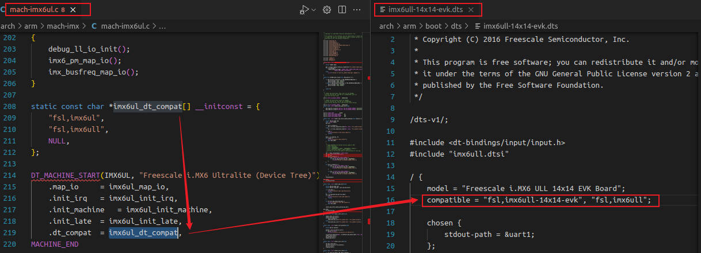

    输入参数列表：

    1. `default_match`：默认的`machine_desc`指针
    2. `arch_get_next_mach`：回调函数，用于遍历内核中的`machine_desc`列表。下面是源码实现：

        ```c
        static const void * __init arch_get_next_mach(const char *const **match)
        {
            static const struct machine_desc *mdesc = __arch_info_begin;
            const struct machine_desc *m = mdesc;

            if (m >= __arch_info_end)
                return NULL;

            mdesc++;
            *match = m->dt_compat;
            return m;
        }
        ```

    接下来，我们看下`compatible`属性匹配过程：

    1. 获取设备树根节点
    2. 调用回调函数，获取下一个`machine_desc`，这个过程会遍历内核`DT_MACHINE_START`表
    3. 调用`of_flat_dt_match`，返回值score表示匹配成功的个数。如果字符串完全匹配，得分最优
        + 若为前缀匹配(如设备树为"ti,am335x-bone"，内核支持"ti,am335x")，得分递增
        + 得分越低匹配度越高，最终选择得分最小的`machine_desc`
    4. 匹配成功后，打印硬件型号：Machine model: xxx(取自设备树model属性)

    ```c
    const void * __init of_flat_dt_match_machine(const void *default_match,
		const void * (*get_next_compat)(const char * const**))
    {
        const void *data = NULL;
        const void *best_data = default_match;
        const char *const *compat;
        unsigned long dt_root;
        unsigned int best_score = ~1, score = 0;

        dt_root = of_get_flat_dt_root();
        while ((data = get_next_compat(&compat))) {
            score = of_flat_dt_match(dt_root, compat);
            if (score > 0 && score < best_score) {
                best_data = data;
                best_score = score;
            }
        }
        pr_info("Machine model: %s\n", of_flat_dt_get_machine_name());

        return best_data;
    }
    ```

    这个函数执行完成后，我们就获得了与设备树匹配的内核描述符`machine_desc`

3. `early_init_dt_scan_nodes` 处理`/chosen(启动参数)`、`/memory(内存布局)`等节点

    ```c
    void __init early_init_dt_scan_nodes(void)
    {
        /* Retrieve various information from the /chosen node */
        of_scan_flat_dt(early_init_dt_scan_chosen, boot_command_line);

        /* Initialize {size,address}-cells info */
        of_scan_flat_dt(early_init_dt_scan_root, NULL);

        /* Setup memory, calling early_init_dt_add_memory_arch */
        of_scan_flat_dt(early_init_dt_scan_memory, NULL);
    }
    ```

##### 2.3.2.4 `核心解析：unflatten_device_tree()`

```c
void __init unflatten_device_tree(void)
{
	__unflatten_device_tree(initial_boot_params, &of_root/*全局变量，设备树根节点*/,
				early_init_dt_alloc_memory_arch);
}
```

实际的解析功能，是由函数`__unflatten_device_tree`完成的。这个函数的执行流程如下：

1. 第1次执行`unflatten_dt_node`函数，最后一个传参`dryrun = true`表示预演，模拟解析过程，仅计算所需内存大小size(包括所有的device_node和property结构体及字符串空间)
2. 调用`dt_alloc`申请内存`mem`，末尾追加`magic number`用于越界检测
3. 第2次执行`unflatten_dt_node`函数，最后一个传参`dryrun = false`表示实际解析。使用`mem`内存填充`device_node`和`property`结构体。解析完成后，把`mem`赋值给`of_root根节点`

```c
static void __unflatten_device_tree(void *blob,
			     struct device_node **mynodes,
			     void * (*dt_alloc)(u64 size, u64 align))
{
	unsigned long size;
	int start;
	void *mem;

	/* First pass, scan for size */
	start = 0;
	size = (unsigned long)unflatten_dt_node(blob, NULL, &start, NULL, NULL, 0, true);
	size = ALIGN(size, 4);

	/* Allocate memory for the expanded device tree */
	mem = dt_alloc(size + 4, __alignof__(struct device_node));
	memset(mem, 0, size);
	*(__be32 *)(mem + size) = cpu_to_be32(0xdeadbeef);

	/* Second pass, do actual unflattening */
	start = 0;
	unflatten_dt_node(blob, mem, &start, NULL, mynodes, 0, false);
}
```

##### 2.3.2.5 总结

两次遍历机制：首次计算内存需求，第二次实际构建节点树，避免内存浪费。

以下设备树片段为例：

```dts
/ { 
    serial@101f0000 {
        compatible = "arm,pl011";
        reg = <0x101f0000 0x1000>;
    };
};
```

解析后生成的结构关系：

```
of_root (根节点)
  |
  └─ child: serial@101f0000 (device_node)
      ├─ properties: 
      │   ├─ compatible: "arm,pl011"
      │   └─ reg: <0x101f0000 0x1000>
      ├─ parent: of_root
      └─ sibling: NULL
```

## 第3章 `device_node`转为`platform_device`

Linux内核中`device_node`到`platform_device`的转换，是设备树机制的核心环节，实现了硬件描述与驱动的动态匹配。

### 3.1 转换条件：哪些`device_node`会被转换？

并非所有节点都会被转换，需满足以下条件：

1. 必须属性：节点必须包含`compatible`属性(根节点除外)
2. 节点层级：
    + 根的直接子节点。如`/child-node`
    + 特殊总线节点的子节点。若父节点的`compatible`包含以下值之一，其子节点(也需包含`compatible`)会被递归转换：`simple-bus`、`simple-mfd`、`isa`、`arm-amba-bus`
3. 排除情况：
    + 根节点(/)、memory、chosen节点不转换
    + i2c/spi等总线下的子节点(如i2c@xxx/at24c02)由总线驱动处理(转换为i2c_client而非platform_device)

示例说明：

```dts
/ {
    led { compatible = "jz2440-led"; };          // ✔️ 转换（根子节点）
    i2c: i2c@44e0b000 {
        compatible = "ti,omap4-i2c";             // ✔️ 转换（根子节点）
        at24c02 { compatible = "at24c02"; };    // ❌ 不转换（由i2c总线处理）
    };
    mytest {
        compatible = "mytest", "simple-bus";     // ✔️ 转换（含simple-bus）
        child { compatible = "child-device"; };   // ✔️ 转换（父为特殊总线）
    };
};
```

### 3.2 完整转换流程与函数调用链

1. `mach-soc_xxx.c`文件，`init_machine`函数指针调用了`of_platform_populate()`函数

    以imx6ull为例。`mach-imx6ul.c`文件的部分代码如下：

    ```c
    // 默认的总线匹配表，传给of_platform_populate函数作为入参
    const struct of_device_id of_default_bus_match_table[] = {
        { .compatible = "simple-bus", },
        { .compatible = "simple-mfd", },
        {} /* Empty terminated list */
    };

    // init_machine函数，调用了of_platform_populate()函数
    // polulate单词的含义是，(给文件)输入数据
    static void __init imx6ul_init_machine(void)
    {
        struct device *parent;

        parent = imx_soc_device_init();
        if (parent == NULL)
            pr_warn("failed to initialize soc device\n");

        of_platform_populate(NULL, of_default_bus_match_table/*默认总线匹配表*/, NULL, NULL);
    }

    // 注册machine_desc描述符
    DT_MACHINE_START(IMX6UL, "Freescale i.MX6 Ultralite (Device Tree)")
	.map_io		= imx6ul_map_io,
	.init_irq	= imx6ul_init_irq,
	.init_machine	= imx6ul_init_machine,
	.init_late	= imx6ul_init_late,
	.dt_compat	= imx6ul_dt_compat,
    MACHINE_END
    ```

2. `of_platform_populate()`函数

    + 获取设备树根节点(`of_find_node_by_path("/")`)
    + 遍历根节点的所有一级子节点，对每个节点调用`of_platform_bus_create()`函数

    ```c
    int of_platform_populate(struct device_node *root,
			const struct of_device_id *matches,
			const struct of_dev_auxdata *lookup,
			struct device *parent)
    {
        struct device_node *child;
        int rc = 0;

        root = root ? of_node_get(root) : of_find_node_by_path("/");
        if (!root)
            return -EINVAL;

        for_each_child_of_node(root, child) {
            rc = of_platform_bus_create(child, matches, lookup, parent, true);
            if (rc)
                break;
        }
        of_node_set_flag(root, OF_POPULATED_BUS);

        of_node_put(root);
        return rc;
    }
    ```

3. `of_platform_bus_create()`函数

    关键参数：
    + `bus`：当前节点指针。如`/soc`
    + `matches`：匹配表(在`mach-imx6ul.c`中定义)，定义哪些节点被视为总线，如`simple-bus`
    + `strict`：若为true，则要求节点必须有`compatible`属性才处理

    ```c
    static int of_platform_bus_create(struct device_node *bus,
				  const struct of_device_id *matches,
				  const struct of_dev_auxdata *lookup,
				  struct device *parent, bool strict)
    {
        const struct of_dev_auxdata *auxdata;
        struct device_node *child;
        struct platform_device *dev;
        const char *bus_id = NULL;
        void *platform_data = NULL;
        int rc = 0;

        /* Make sure it has a compatible property */
        if (strict && (!of_get_property(bus, "compatible", NULL))) {
            return 0;
        }

        if (of_device_is_compatible(bus, "arm,primecell")) {
            of_amba_device_create(bus, bus_id, platform_data, parent);
            return 0;
        }

        dev = of_platform_device_create_pdata(bus, bus_id, platform_data, parent);
        if (!dev || !of_match_node(matches, bus))
            return 0;

        for_each_child_of_node(bus, child) {
            pr_debug("   create child: %s\n", child->full_name);
            rc = of_platform_bus_create(child, matches, lookup, &dev->dev, strict);
            if (rc) {
                of_node_put(child);
                break;
            }
        }
        of_node_set_flag(bus, OF_POPULATED_BUS);
        return rc;
    }
    ```

    我们来分析下这段代码：

    1. 判断节点有没有`compatible`属性。没有的话直接退出(不满足转换条件的必须属性)

        ```c
        if (strict && (!of_get_property(bus, "compatible", NULL))) {
            return 0;
        }
        ```

    2. 判断节点有没有`arm,primecell`属性。有的话直接创建`amba_device`

        ```c
        if (of_device_is_compatible(bus, "arm,primecell")) {
            of_amba_device_create(bus, bus_id, platform_data, parent);
            return 0;
        }
        ```

    3. 运行到这里，所有条件都满足，我们就应该创建`platform_device`了。如果创建成功且没有找到`默认总线匹配项`，返回

        ```c
        dev = of_platform_device_create_pdata(bus, bus_id, platform_data, parent);
        if (!dev || !of_match_node(matches, bus))
            return 0;
        ```

    4. 如果节点属性与`默认总线匹配项`匹配，那还需要对节点下的所有子节点，递归的进行转换。转换流程与当前函数一致(子节点有`compatible`属性就创建`platform_device`，否则退出)

        ```c
        for_each_child_of_node(bus, child) {
            pr_debug("   create child: %s\n", child->full_name);
            rc = of_platform_bus_create(child, matches, lookup, &dev->dev, strict);
            if (rc) {
                of_node_put(child);
                break;
            }
        }
        ```

4. `of_platform_device_create_pdata()`函数

    Linux内核中将`设备树节点(device_node)`转换为`platform_device`的核心函数。功能定位：

    + 解析节点属性(`reg、interrputs`)并填充resources数组
    + 关联`device_node`到`platform_device.dev.of_node`
    + 将设备注册到平台总线(`platform_bus_type`)，供驱动匹配

    ```c
    static struct platform_device *of_platform_device_create_pdata(
					struct device_node *np,
					const char *bus_id,
					void *platform_data,
					struct device *parent)
    {
        struct platform_device *dev;

        if (!of_device_is_available(np))
            return NULL;

        dev = of_device_alloc(np, bus_id, parent);

        dev->dev.bus = &platform_bus_type;
        dev->dev.platform_data = platform_data;

        of_device_add(dev);

        return dev;
    }
    ```

    这个函数做的事情比较多，我们来逐一分析：

    1. 设备节点有效性检查：节点状态`status != okay(ok)`时跳过

        ```c
        static bool __of_device_is_available(const struct device_node *device)
        {
            const char *status;
            int statlen;

            status = __of_get_property(device, "status", &statlen);
            if (status == NULL)
                return true;

            if (statlen > 0) {
                if (!strcmp(status, "okay") || !strcmp(status, "ok"))
                    return true;
            }

            return false;
        }
        ```

    2. 调用`of_device_alloc(np)`函数，分配并初始化`platform_device`

        ```c
        struct platform_device *of_device_alloc(struct device_node *np,
				  const char *bus_id,
				  struct device *parent)
        {
            struct platform_device *dev;
            int rc, i, num_reg = 0, num_irq;
            struct resource *res, temp_res;

            dev = platform_device_alloc("", -1);

            /* count the io and irq resources */
            while (of_address_to_resource(np, num_reg, &temp_res) == 0)
                num_reg++;
            num_irq = of_irq_count(np);

            /* Populate the resource table */
            if (num_irq || num_reg) {
                res = kzalloc(sizeof(*res) * (num_irq + num_reg), GFP_KERNEL);
                if (!res) {
                    platform_device_put(dev);
                    return NULL;
                }

                dev->num_resources = num_reg + num_irq;
                dev->resource = res;
                for (i = 0; i < num_reg; i++, res++) {
                    rc = of_address_to_resource(np, i, res);
                    WARN_ON(rc);
                }
                if (of_irq_to_resource_table(np, res, num_irq) != num_irq)
                    pr_debug("not all legacy IRQ resources mapped for %s\n",
                        np->name);
            }

            dev->dev.of_node = of_node_get(np);
            dev->dev.parent = parent ? : &platform_bus;


            of_device_make_bus_id(&dev->dev);

            return dev;
        }
        ```

        这个函数非常复杂。理解了这个函数，就理解了`device_node`转为`platform_device`的流程。我们详细分析：

        1. 申请`platform_device`的内存：`dev = platform_device_alloc("", -1)`
        2. 调用`of_address_to_resource()`函数，解析节点的`reg`属性，获取num_reg

            ```c
            // 获取节点的reg属性，有多组reg属性时，index就是数组下标
            const __be32 *of_get_address(struct device_node *dev, int index, u64 *size,
		    unsigned int *flags)
            {
                const __be32 *prop;
                unsigned int psize;
                struct device_node *parent;
                struct of_bus *bus;
                int onesize, i, na, ns;

                /* Get parent & match bus type */
                parent = of_get_parent(dev);
                bus = of_match_bus(parent);
                bus->count_cells(dev, &na, &ns);

                /* Get "reg" or "assigned-addresses" property */
                prop = of_get_property(dev, "reg", &psize);
                if (prop == NULL)
                    return NULL;
                psize /= 4;

                onesize = na + ns;
                for (i = 0; psize >= onesize; psize -= onesize, prop += onesize, i++)
                    if (i == index) {
                        if (size)
                            *size = of_read_number(prop + na, ns);
                        if (flags)
                            *flags = IORESOURCE_MEM;
                        return prop;
                    }
                return NULL;
            }            

            // 把reg属性里面的一组(地址 + 长度)，转换成resources[]的成员start和end，flag设为IORESOURCE_MEM
            static int __of_address_to_resource(struct device_node *dev,
                    const __be32 *addrp, u64 size, unsigned int flags,
                    const char *name, struct resource *r)
            {
                u64 taddr;

                if ((flags & (IORESOURCE_IO | IORESOURCE_MEM)) == 0)
                    return -EINVAL;
                memset(r, 0, sizeof(struct resource));
                if (flags & IORESOURCE_IO) {
                    unsigned long port;
                    port = pci_address_to_pio(taddr);
                    if (port == (unsigned long)-1)
                        return -EINVAL;
                    r->start = port;
                    r->end = port + size - 1;
                } else {
                    r->start = taddr;
                    r->end = taddr + size - 1;
                }
                r->flags = flags;
                r->name = name ? name : dev->full_name;

                return 0;
            }

            int of_address_to_resource(struct device_node *dev, int index,
			   struct resource *r)
            {
                const __be32	*addrp;
                u64		size;
                unsigned int	flags;
                const char	*name = NULL;

                // 1. 获取reg数组的第index组数据 reg = <addr size>
                addrp = of_get_address(dev, index, &size, &flags);
                if (addrp == NULL)
                    return -EINVAL;

                // 把addr和size转为resources[]数组的一条内容
                return __of_address_to_resource(dev, addrp, size, flags, name, r);
            }
            ```

        3. 调用`of_irq_count()`函数，解析节点的`interrupts`属性，获取num_irq

            ```c
            int of_irq_count(struct device_node *dev)
            {
                struct of_phandle_args irq;
                int nr = 0;

                while (of_irq_parse_one(dev, nr, &irq) == 0)
                    nr++;

                return nr;
            }
            ```

        4. 如果有`reg`或`interrupts`属性，申请`resource`内存，把`reg`和`interrupts`解析保存到`resource`中

            ```c
            if (num_irq || num_reg) {
                res = kzalloc(sizeof(*res) * (num_irq + num_reg), GFP_KERNEL);
                if (!res) {
                    platform_device_put(dev);
                    return NULL;
                }

                dev->num_resources = num_reg + num_irq;
                dev->resource = res;
                for (i = 0; i < num_reg; i++, res++) {
                    rc = of_address_to_resource(np, i, res);
                    WARN_ON(rc);
                }
                if (of_irq_to_resource_table(np, res, num_irq) != num_irq)
                    pr_debug("not all legacy IRQ resources mapped for %s\n",
                        np->name);
            }
            ```

        5. 关联`device_node`到`platform_device.dev.of_node`

            ```c
            dev->dev.of_node = of_node_get(np);
            ```

        6. `platform_device`申请和初始化完成，返回

    3. 设置总线类型为`platform_bus_type`，注册设备

        ```c
        struct bus_type platform_bus_type = {
            .name		= "platform",
            .dev_groups	= platform_dev_groups,
            .match		= platform_match,   // 平台总线匹配函数
            .uevent		= platform_uevent,
            .pm		= &platform_dev_pm_ops,
        };

        dev->dev.bus = &platform_bus_type;

        of_device_add(dev);
        ```

### 3.3 `device_node`转为`platform_device`流程总结

1. 逐个扫描根节点的子节点，判断有没有`compatible`属性
2. 如果节点有`compatible`属性，开始创建`platform_device`。跳过`status != okay`的节点，解析节点的`reg和interrupts`属性，添加到`platform_device`的resource资源中，并注册`platform_device`设备
3. 如果节点的`compatible`与`默认总线匹配表`匹配上了，那递归解析子节点。只要子节点包含了`compatible`属性，就重复1~3的流程
4. 我们的设备总线类型为`platform_bus_type`，其中`match`匹配函数为`platform_match`，用来匹配`平台设备`与`平台驱动`，下一章我们将会介绍之

## 第4章 `led`设备树示例

前面我们分析了两大块内容：`dtb`转成`device_node`，`device_node`转成`platform_device`。本章我们以`imx6ull`芯片为例，写一个最简单的`led`设备树。

### 4.1 设备树添加led的完整步骤与示例

#### 4.1.1 引脚复用配置(`pinctrl`子系统)

在iomuxc节点中，定义gpio的服用模式和电气属性：

```dts
&iomuxc {
    pinctrl-names = "default";
	imx6ul-evk {
        pinctrl_led: ledgrp {
            fsl,pins = <
                MX6ULL_PAD_SNVS_TAMPER3__GPIO5_IO03 0x10b0 /* LED引脚配置 */
            >;
        };
    };
};
```

关键说明：

+ `MX6ULL_PAD_SNVS_TAMPER3__GPIO5_IO03`：将引脚服用为GPIO功能
+ `0x10b0`：电气属性值

为什么`pinctrl`引脚定义，只能在`imx6ul-evk`节点下定义？思考一下几个问题：

1. `imx6ul-evk`节点能否改名？
2. `imx6ul-evk`节点能否删除，然后把节点里面的内容上移，直接放到`&iomuxc`节点下？

这两个问题，我们在后面解答回复。

#### 4.1.2 LED设备节点定义

在根节点`/`下添加LED设备描述：

```dts
/ {
    gpioled {
        compatible = "myboard,gpioled";  // 驱动匹配标识
        pinctrl-names = "default";       // 引脚状态名
        pinctrl-0 = <&pinctrl_led>;      // 关联pinctrl配置
        led-gpios = <&gpio5 3 GPIO_ACTIVE_LOW>; // GPIO组+引脚号+有效电平
        status = "okay";                 // 启用设备
    };
};
```

关键属性：

+ `led-gpios`：指定GPIO控制器(gpio5)、引脚号(3)、有效电平(GPIO_ACTIVE_LOW)
+ `pinctrl-0`：引用之前定义的`pinctrl_led`配置组

#### 4.1.3 检查引脚冲突

搜索设备树中相同引脚(如GPIO5_IO03)是否被其他节点(如触摸屏、传感器)占用，若有则需注释冲突部分

```dts
&tsc {
    // xnur-gpio = <&gpio5 3 ...>;  /* 注释冲突行 */
};
```

#### 4.1.4 编译与验证

1. 编译

```bash
make dtbs   # 生成dtb二进制文件
```

2. 启动后检查节点是否存在

```bash
cat /proc/device-tree/gpioled/status
```

### 4.2 为什么需要这样设计？ -- 设备树的优势与原理

1. 硬件描述与驱动分离

+ 传统方式：寄存器地址(如0x0209c000)直接卸载驱动代码中，更改硬件需重写驱动
+ 设备树方案：寄存器地址、引脚配置等硬件信息移到设备树，驱动通过标准API(`of_get_named_gpio()`)动态获取，提高跨硬件兼容性

2. gpio/pinctrl子系统的作用

| 子系统 | 功能 | 优势 |
| - | - | - |
| pinctrl | 配置引脚复用和电气属性 | 避免手动计算寄存器值 |
| gpio | 提供标准接口操作gpio，无需操作寄存器 | 驱动代码更简洁，避免底层差异 |

3. 设备树的核心价值

+ 动态适配：同一驱动可支持不同板卡(如开发板A用GPIO1_IO03，板卡B用GPIO5_IO03)，只需修改设备树
+ 自描述性：内核启动时自动解析设备树，按需初始化硬件(如status = "okay"才启用设备)
+ 减少内核冗余：剥离板级硬件描述，使内核更精简

### 4.3 驱动如何配合设备树工作？

驱动中通过of函数，读取设备树属性：

```c
// 1. 查找设备节点
struct device_node *nd = of_find_node_by_path("/gpioled");

// 2. 获取GPIO编号
int gpio = of_get_named_gpio(nd, "led-gpios", 0);

// 3. 申请并使用GPIO
gpio_request(gpio, "led"); 
gpio_direction_output(gpio, 1);  // 初始化为高电平（因GPIO_ACTIVE_LOW）
gpio_set_value(gpio, 0);         // 输出低电平，点亮LED
```

设计本质：通过设备树将硬件描述(引脚、寄存器、电平特性)与驱动逻辑解耦，借助pinctrl/gpio子系统标准化硬件访问。

### 4.4 `iomuxc`的`imx6ul-evk`节点

```dts
&iomuxc {
	pinctrl-names = "default";
	pinctrl-0 = <&pinctrl_hog_1>;
	imx6ul-evk {
		pinctrl_hog_1: hoggrp-1 {
			fsl,pins = <
				MX6UL_PAD_UART1_RTS_B__GPIO1_IO19	0x17059 /* SD1 CD */
				MX6UL_PAD_GPIO1_IO05__USDHC1_VSELECT	0x17059 /* SD1 VSELECT */
				MX6UL_PAD_GPIO1_IO09__GPIO1_IO09        0x17059 /* SD1 RESET */
			>;
		};

        pinctrl_uart1: uart1grp {
			fsl,pins = <
				MX6UL_PAD_UART1_TX_DATA__UART1_DCE_TX 0x1b0b1
				MX6UL_PAD_UART1_RX_DATA__UART1_DCE_RX 0x1b0b1
			>;
		};
    };
};
```

#### 4.4.1 能否把`imx6ul-evk`节点重命名？

##### 4.4.1.1 可行性

+ 完全可行且推荐：`imx6ul-evk`是nxp为评估板定义的默认名称。若开发板为自定义硬件(如正点原子、米尔)，重命名可提高可读性和维护性，避免与官方配置混淆
+ 不影响功能：节点名称本身不参与驱动匹配(依赖`compatible`属性)，重命名后只要子节点结构不变，引脚配置仍可正常被解析

##### 4.4.1.2 重命名步骤

1. 复制并修改设备树文件

    + 复制imx6ull-14x14-evk.dts，重命名为自定义名称(如imx6ull-myboard.dts)
    + 修改根节点的`compatible`属性。例如：
    ```dts
    / {
        compatible = "mycompany,imx6ull-myboard", "fsl,imx6ull";
    };
    ```

2. 调整设备树结构

    在`&iomuxc`节点下，将`imx6ull-evk`改为自定义名称(如`myboard-pinctrl`)

    ```dts
    &iomuxc {
        myboard-pinctrl {
            pinctrl_hog_1: hoggrp-1 { /* 原有配置 */ };
            pinctrl_led: ledgrp { /* 新增配置 */ };
        };
    };
    ```

#### 4.4.2 能否删除`imx6ull-evk`节点并上移子节点？

有风险。下面是详细分析

##### 4.4.2.1 设备树结构对比：原始设计 vs 错误修改

1. 原始设计(分层结构)

    ```dts
    // 芯片级定义：描述SoC固有资源（位于imx6ull.dtsi）
    &iomuxc {
        compatible = "fsl,imx6ul-iomuxc";  // 匹配pinctrl驱动[6,7](@ref)
    };

    // 板级定义：描述开发板专属配置（位于imx6ul-evk.dts）
    &iomuxc {
        imx6ul-evk {
            pinctrl_hog: hoggrp {
                fsl,pins = <MX6UL_PAD_GPIO1_IO00__GPIO1_IO00 0x17059>; // 评估板专属引脚
            };
            pinctrl_uart1: uart1grp {
                fsl,pins = <MX6UL_PAD_UART1_TX_DATA__UART1_DCE_TX 0x1b0b0>;
            };
        };
    };
    ```

    分层清晰：

    + `iomuxc`节点仅描述芯片级控制器(如寄存器地址范围)，由soc级`.dtst`定义
    + `imx6ull-evk`节点描述板级配置(如GPIO复用、电气属性)，与具体硬件相关

2. 错误修改(删除并上移子节点)

    ```dts
    // 破坏分层结构的设计
    &iomuxc {
        compatible = "fsl,imx6ul-iomuxc";
        // 直接嵌入板级配置
        pinctrl_hog: hoggrp {
            fsl,pins = <MX6UL_PAD_GPIO1_IO00__GPIO1_IO00 0x17059>; 
        };
        pinctrl_uart1: uart1grp {
            fsl,pins = <MX6UL_PAD_UART1_TX_DATA__UART1_DCE_TX 0x1b0b0>;
        };
    };
    ```

    问题本质：将板级专属配置硬编码到芯片级节点，违反设备树硬件描述与驱动解耦的设计原则。

3. 设计原则：具体硬件要增加子节点

    事实上，我们其他的硬件设备也是这么干的。比如i2c设备，时钟频率直接放在`&i2c1`下，而具体的i2c设备就要定义子节点，把设备的信息放在子节点中

    ```dts
    &i2c1 {
        clock-frequency = <100000>;
        pinctrl-names = "default";
        pinctrl-0 = <&pinctrl_i2c1>;
        status = "okay";

        // 具体的设备，定义到子节点中。不然的话，你都不知道哪些是公共属性，哪些是设备属性
        mag3110@0e {
            compatible = "fsl,mag3110";
            reg = <0x0e>;
            position = <2>;
        };

        // 具体的设备，定义到子结点中
        fxls8471@1e {
            compatible = "fsl,fxls8471";
            reg = <0x1e>;
            position = <0>;
            interrupt-parent = <&gpio5>;
            interrupts = <0 8>;
        };
    };
    ```

##### 4.4.2.2 驱动代码示例：`pinctrl`子系统如何解析设备树

驱动匹配逻辑(关键代码)：Linux系统pinctrl通过`compatible`属性匹配设备树节点

```c
// 驱动代码（位于drivers/pinctrl/freescale/pinctrl-imx6ul.c）
static const struct of_device_id imx6ul_pinctrl_of_match[] = {
    { .compatible = "fsl,imx6ul-iomuxc" }, // 仅匹配SoC级控制器
    { }
};

static int imx6ul_pinctrl_probe(struct platform_device *pdev) {
    // 1. 解析iomuxc节点
    struct device_node *np = pdev->dev.of_node;
    // 2. 遍历其子节点（预期为板级配置节点）
    for_each_child_of_node(np, child_np) {
        // 3. 解析子节点中的fsl,pins属性
        ret = imx_pinctrl_parse_group(child_np, &grp);
    }
}
```

+ 原始设计的正确流程：驱动匹配`iomuxc`->遍历其子节点(imx6ull-evk)->解析pinctrl等配置
+ 错误修改的后果：
    + 驱动直接解析`iomuxc`下的`pinctrl`，但板级配置被错误关键到芯片级节点
    + 若其他办卡复用同一soc，其专属配置无法与芯片级节点共存，导致配置冲突或缺失

##### 4.4.2.3 实际风险案例

1. 原始设计：为自定义板卡添加新配置

```dts
&iomuxc {
    myboard { // 新增板级节点
        pinctrl_led: ledgrp {
            fsl,pins = <MX6UL_PAD_SNVS_TAMPER0__GPIO5_IO00 0x10b0>;
        };
    };
};
```

驱动仍可以通过`imx6ul-evk`或`my-board`区分不同硬件

2. 错误修改后：冲突

```dts
&iomuxc {
    // 已有其他板卡的配置
    pinctrl_hog: hoggrp { ... }; // 来自imx6ul-evk
    pinctrl_led: ledgrp { ... }; // 新增自定义配置
};
```

#### 4.4.3 为何内核允许这种结构？

设备树语法本身不禁止节点嵌套，但内核驱动依赖分层约定：

+ `pinctrl`驱动预期`fsl,pins`位于二级子节点，如`imx6ul-evk > pinctrl_hog`，而给直接位于控制器节点下
+ 强行上移子节点可能导致驱动跳过配置解析(因驱动未在于其位置查找`fsl,pins`)

强烈建议：

1. 重命名而非删除：将`imx6ul-evk`改为自定义名称(如myboard-pinctrl)，保留其作为板级配置容器
2. 验证配置生效：编译后检查`/sys/firmware/devicetree/base`节点层次，确保`pinctrl_*`位于板级子节点下

#### 4.4.4 `imx6ull-evk`这类节点，在`pinctrl`子系统中不是必须的(如am335x)

下面以`am335x`为例。看下他的设备树怎么写的：

设备树`am335x_boneblock.dts`，可以看到，am335x就是直接在`am33xx_pinmux`下写复用节点，不需要再定义`myboard`这种节点。

```dts
/dts-v1/;

#include "am33xx.dtsi"
#include "am335x-bone-common.dtsi"

/ {
	model = "TI AM335x BeagleBone Black";
	compatible = "ti,am335x-bone-black", "ti,am335x-bone", "ti,am33xx";
};

&ldo3_reg {
	regulator-min-microvolt = <1800000>;
	regulator-max-microvolt = <1800000>;
	regulator-always-on;
};

&mmc1 {
	vmmc-supply = <&vmmcsd_fixed>;
};

&mmc2 {
	vmmc-supply = <&vmmcsd_fixed>;
	pinctrl-names = "default";
	pinctrl-0 = <&emmc_pins>;
	bus-width = <8>;
	status = "okay";
};

&am33xx_pinmux {
	nxp_hdmi_bonelt_pins: nxp_hdmi_bonelt_pins {
		pinctrl-single,pins = <
			0x1b0 0x03      /* xdma_event_intr0, OMAP_MUX_MODE3 | AM33XX_PIN_OUTPUT */
			0xa0 0x08       /* lcd_data0.lcd_data0, OMAP_MUX_MODE0 | AM33XX_PIN_OUTPUT | AM33XX_PULL_DISA */
			/* 省却部分引脚 */
			0xe8 0x00       /* lcd_pclk.lcd_pclk, OMAP_MUX_MODE0 | AM33XX_PIN_OUTPUT */
			0xec 0x00       /* lcd_ac_bias_en.lcd_ac_bias_en, OMAP_MUX_MODE0 | AM33XX_PIN_OUTPUT */
		>;
	};
	nxp_hdmi_bonelt_off_pins: nxp_hdmi_bonelt_off_pins {
		pinctrl-single,pins = <
			0x1b0 0x03      /* xdma_event_intr0, OMAP_MUX_MODE3 | AM33XX_PIN_OUTPUT */
		>;
	};
};

&lcdc {
	status = "okay";
};
```

#### 4.4.5 `pinctrl`子系统的`function`和`group`

在Linux内核的pinctrl子系统中，function和group的层次结构，是普遍采用的核心设计模式，但不同芯片厂商在设备树中的具体实现细节可能存在差异。

##### 4.4.5.1 function和group的层次结构是标准设计

1. 核心概念

    + function(功能)：对应一个硬件逻辑模块的功能抽象(如UART、SPI、I2C)
    + group(引脚组)：是实现某个function所需的物理引脚集合

2. 层次关系在设备树中，通常表现为：

```txt
引脚控制器（如 iomuxc）
└── Function 节点（如 uart0_func）
    └── Group 节点（如 uart0_pins）
        └── 引脚配置（如电气属性）
```

##### 4.4.5.2 主流芯片的设备树function和group实例

1. NXP I.MX系列(如imx6ull)

    + funciton节点：板级配置容器。位于`&iomuxc`下，以板卡名命名(如`imx6ull-evk`)

        ```dts
        &iomuxc {
            imx6ul-evk {  // Function 节点
                pinctrl_uart1: uart1grp { ... }; // Group 节点
                pinctrl_i2c1: i2c1grp { ... };
            };
        };
        ```

    + group节点：引脚配置实体。关键属性：`fsl,pins`以6个u32描述复用寄存器、电气属性

        ```dts
        pinctrl_uart1: uart1grp {
            fsl,pins = <
                MX6UL_PAD_UART1_TX_DATA__UART1_DCE_TX 0x1b0b0 // 复用模式 + 电气属性
                MX6UL_PAD_UART1_RX_DATA__UART1_DCE_RX 0x1b0b0
            >;
        };
        ```

2. rockchip RK系列(如RK3588)

    + function节点：功能分类容器。直接以功能命名，省略板级容器层(`没有imx6ull-evk这层`)

        ```dts
        &pinctrl {
            pinctrl_uart1: uart1 {  // Function 与 Group 合并
                uart1_xfer: uart1-xfer {
                    rockchip,pins = <1 RK_PB1 1 &pcfg_pull_up>,  // 引脚 + 电气模板
                                    <1 RK_PB2 1 &pcfg_pull_none>;
                };
            };
        };
        ```

    + group节点：电气属性模板化

        + 关键属性：rockchip,pins引用预定义模板，如`&pcfg_pull_up`，简化配置
        + 层级扁平化：function与group常合并为单层节点，如uart1_xfer直接包含引脚

3. Ti AM335x系列(如BeagleBone)

    + function节点：信号抽象层。描述外设信号，如mmc1_pins，而非物理功能

        ```dts
        &am33xx_pinmux {
            mmc1_pins: pinmux_mmc1_pins {  // Function 节点
                pinctrl-single,pins = <
                    AM33XX_IOPAD(0x8f0, PIN_INPUT_PULLUP | MUX_MODE0) /* mmc1_dat0 */
                    AM33XX_IOPAD(0x8f4, PIN_INPUT_PULLUP | MUX_MODE0) /* mmc1_dat1 */
                >;
            };
        };
        ```

    + group节点：寄存器直接配置

        + 关键属性：pinctrl-single,pins直接写入寄存器值(复用模式+电气标志)
        + 驱动匹配：通过pinctrl-0 = <&mmc1_pins>引用

##### 4.4.5.3 设计模式总结

| 芯片平台 | function节点角色 | group节点配置方式 | 层级结构 |
| - | - | - | - |
| NXP I.MX | 板级容器(如`imx6ull-evk`) | `fsl,pins`直接寄存器值 | 严格分层(2级) |
| RockChip RK | 功能分类(如`uart1`) | `rockchip,pins` + 电气模板引用 | 扁平化(1级为主) |
| Ti AM335x | 信号抽象(如`mmc1_pins`) | `pinctrl-single,pins` 寄存器标志组合 | 单层 |

#### 4.4.6 `imx6ull`的pinctrl子系统解析设备树

`imx_pinctrl_probe()`是imxull芯片的pinctrl子系统驱动入口函数，负责初始化soc的引脚控制器iomuxc，解析设备树中的引脚配置，并注册到内核的`pinctrl`框架中。

##### 4.4.6.1 函数功能与调用时机

1. 功能定位：`imx_pinctrl_probe()`是标准的platform驱动probe函数，在设备树中`compatible = "fsl,imx6ul-iomuxc"`的节点与驱动匹配时触发。核心任务：
    + 获取soc专属的引脚描述信息(imx6ul_pinctrl_info)
    + 调用核心函数`imx_pinctrl_probe()`完成控制器注册

2. 调用时机：当内核初始化时，通过`arch_initcall(imx6ul_pinctrl_init)`注册驱动。设备树中的`iomuxc`节点与驱动的`of_match_table`匹配后，触发probe函数

##### 4.4.6.2 函数实现与关键步骤

`imx_pinctrl_probe()`函数，调用了子函数`imx_pinctrl_probe_dt()`来实现设备树解析。

```c
int imx_pinctrl_probe(struct platform_device *pdev/* 设备树节点:&iomuxc */,
		      struct imx_pinctrl_soc_info *info)
{
    // 1. 解析设备树节点 &iomuxc
	imx_pinctrl_probe_dt(pdev, info);

    // 2. 设置platform_device的专有数据
	platform_set_drvdata(pdev, ipctl);

    // 3. 注册pinctrl子系统
	pinctrl_register(imx_pinctrl_desc, &pdev->dev, ipctl);

	return 0;
}
```

##### 4.4.6.3 `imx_pinctrl_probe_dt()`解析`iomuxc节点`

以下面的设备树片段为例：

```dts
&iomuxc {
    imx6ul-evk { // Function 节点
        pinctrl_uart1: uart1grp { // Group 节点
            fsl,pins = <
                MX6UL_PAD_UART1_TX_DATA__UART1_DCE_TX 0x1b0b0 // 引脚配置
                MX6UL_PAD_UART1_RX_DATA__UART1_DCE_RX 0x1b0b0
            >;
        };

        pinctrl_xxx: ... // 其他group节点
    };
};
```

在上面的设备树中，function只有一个，就是板级容器`imx6ul-evk`，function下面的group有多个。我们看下`imx_pinctrl_probe_dt()`解析函数做了些什么

1. 读取function个数`nfuncs`，如果没有子节点直接返回报错。所以如果我们直接移除`imx6ul-evk`，此处可能会报错
2. 给`info->functions`申请内存，用来保存每个function
3. 遍历每个function节点，获取每个function节点的子结点个数。即`imx6ull-evk`下面的group个数
    ```c
    for_each_child_of_node(np, child)
		info->ngroups += of_get_child_count(child);
    ```
4. 给`info->groups`申请内存，用来保存全部function的所有group
5. 遍历每个function节点，执行`imx_pinctrl_parse_functions()`函数，解析当前function下的group

```c
static int imx_pinctrl_probe_dt(struct platform_device *pdev,/* iomuxc节点 */
				struct imx_pinctrl_soc_info *info)
{
	struct device_node *np = pdev->dev.of_node;
	struct device_node *child;
	u32 nfuncs = 0;

	nfuncs = of_get_child_count(np);
	if (nfuncs <= 0) {
		dev_err(&pdev->dev, "no functions defined\n");
		return -EINVAL;
	}

	info->nfunctions = nfuncs;
	info->functions = devm_kzalloc(&pdev->dev, nfuncs * sizeof(struct imx_pmx_func), GFP_KERNEL);


	info->ngroups = 0;
	for_each_child_of_node(np, child)
		info->ngroups += of_get_child_count(child);
	info->groups = devm_kzalloc(&pdev->dev, info->ngroups * sizeof(struct imx_pin_group), GFP_KERNEL);


	for_each_child_of_node(np, child)
		imx_pinctrl_parse_functions(child, info, i++);

	return 0;
}
```

##### 4.4.6.3 `imx_pinctrl_parse_functions()`解析`function节点`下的group

`imx_pinctrl_parse_functions()`这个函数，输入为function节点，他的功能是解析function节点下面的group。我们来看下是怎么做的：

1. 获取当前function下的group个数`func->num_groups`，其实就是pinctrl_xxx子节点的个数
2. 如果group个数为0，返回报错
3. 遍历每个group子节点，执行`imx_pinctrl_parse_groups()`，解析当前的group
    ```c
    for_each_child_of_node(np/* imx6ul-evk节点 */, child/* pinctrl_xxx子节点 */) {
		imx_pinctrl_parse_groups(child, grp, info, i++);
	}
    ```

```c
static int imx_pinctrl_parse_functions(struct device_node *np,/*np为每个function节点遍历，如imx6ul-evk*/
				       struct imx_pinctrl_soc_info *info,
				       u32 index)   /*index为function节点的索引值*/
{
	struct device_node *child;
	struct imx_pmx_func *func;
	struct imx_pin_group *grp;
	u32 i = 0;

	func = &info->functions[index]; 

	/* Initialise function */
	func->num_groups = of_get_child_count(np);
	if (func->num_groups == 0) {
		dev_err(info->dev, "no groups defined in %s\n", np->full_name);
		return -EINVAL;
	}

	func->groups = devm_kzalloc(info->dev,
			func->num_groups * sizeof(char *), GFP_KERNEL);

	for_each_child_of_node(np, child) {
		func->groups[i] = child->name;
		grp = &info->groups[info->grp_index++];
		imx_pinctrl_parse_groups(child, grp, info, i++);
	}

	return 0;
}
```

##### 4.4.6.4 `imx_pinctrl_parse_groups()`解析`group`节点

接下来我们要解析group节点，其实也就是pinctrl节点了。还是以具体的设备树pinctrl来说明：

```dts
pinctrl_uart1: uart1grp {
    fsl,pins = <
        MX6UL_PAD_UART1_TX_DATA__UART1_DCE_TX 0x1b0b1
        MX6UL_PAD_UART1_RX_DATA__UART1_DCE_RX 0x1b0b1
    >;
};
```

下面我们来看下`imx_pinctrl_parse_groups()`函数的执行流程：

1. 获取`fsl,pins`属性，读取数组大小。这里为`(5 + 1)(u32) * 4 * 2 = 48`字节
2. 如果没有`fsl,pins`属性，直接返回报错
3. 计算引脚个数`grp->npins = size / pin_size`，即`48 / 24 = 2`，2个引脚。正好是串口的TX和RX
4. 遍历group节点每一个引脚，然后把pinctrl对应的寄存器一次取出并赋值
    ```c
    for (i = 0; i < grp->npins; i++) {
		u32 mux_reg = be32_to_cpu(*list++);
		u32 conf_reg;
		pin_reg->conf_reg = conf_reg;
		pin->input_reg = be32_to_cpu(*list++);
		pin->mux_mode = be32_to_cpu(*list++);
		pin->input_val = be32_to_cpu(*list++);
		config = be32_to_cpu(*list++);
	}
    ```

```c
static int imx_pinctrl_parse_groups(struct device_node *np,
				    struct imx_pin_group *grp,
				    struct imx_pinctrl_soc_info *info,
				    u32 index)
{
	int size, pin_size;
	const __be32 *list;
	int i;
	u32 config;

	/*
	 * the binding format is fsl,pins = <PIN_FUNC_ID CONFIG ...>,
	 * do sanity check and calculate pins number
	 */
	list = of_get_property(np, "fsl,pins", &size);
	if (!list) {
		dev_err(info->dev, "no fsl,pins property in node %s\n", np->full_name);
		return -EINVAL;
	}

    // 6个u32，每条占用的字节数为4*6=24
    pin_size = 24;  // Each pin represented in fsl,pins consists of 5 u32 PIN_FUNC_ID and * 1 u32 CONFIG, so 24 types in total for each pin.

	/* we do not check return since it's safe node passed down */
	if (!size || size % pin_size) {
		dev_err(info->dev, "Invalid fsl,pins property in node %s\n", np->full_name);
		return -EINVAL;
	}

	grp->npins = size / pin_size;
	grp->pins = devm_kzalloc(info->dev, grp->npins * sizeof(struct imx_pin),
				GFP_KERNEL);

	for (i = 0; i < grp->npins; i++) {
		u32 mux_reg = be32_to_cpu(*list++);
		u32 conf_reg;
		pin_reg->conf_reg = conf_reg;
		pin->input_reg = be32_to_cpu(*list++);
		pin->mux_mode = be32_to_cpu(*list++);
		pin->input_val = be32_to_cpu(*list++);

		/* SION bit is in mux register */
		config = be32_to_cpu(*list++);
		if (config & IMX_PAD_SION)
			pin->mux_mode |= IOMUXC_CONFIG_SION;
		pin->config = config & ~IMX_PAD_SION;
	}

	return 0;
}
```

#### 4.4.7 总结

前面分析了不同平台的pinmux复用pinctrl的语法，以及imx6ull的pinctrl解析设备树的过程。总结如下：

1. `iomuxc`节点下的`imx6uil-evk`节点，对imx6ull平台是必须的，但是节点名可以自定义，只要不破坏层级结构就可以
2. 每个平台的pinctrl写法都不同，但大体是类似的，我们应该参考官方demo板的做法

## 第5章 设备树下`platform_device`和`platform_driver`匹配实验

前面的章节都在介绍设备树的理论知识，现在开始实战。我们先从最简单的开始，在设备树中添加一个设备，然后写一个驱动来匹配它。

### 5.1 设备树下写`platform_device`设备

我们在设备树中新增了一个topeet节点。下面来详细分析：

1. `topeet`节点位于根目录下，所以会被解析为`platform_device`设备
2. `topeet`节点的`compatible`属性值为`simple-bus`，所以会递归的继续解析`topeet`的子节点`myled`
3. `myled`包含`compatible`属性，所以`myled`也符合条件，会被解析为`platform_device`设备

`imx6ull_iot.dts`

```dts
/ {
	model = "Freescale i.MX6 ULL 14x14 EVK Board";
	compatible = "fsl,imx6ull-14x14-evk", "fsl,imx6ull";

	chosen {
		stdout-path = &uart1;
	};

	memory {
		reg = <0x80000000 0x20000000>;
	};

    // 新增一个topeet节点
	topeet {
		compatible = "simple-bus";
		#address-cells = <1>;
		#size-cells = <1>;

		myled {
			compatible = "my device tree";
			reg = <0x02290008 0x00000004>;
		};
	};
};
```

### 5.2 设备树下写`platform_driver`驱动

这是一个最简单的`platform_driver`驱动框架。我们来仔细分析一下：

1. `insmod`加载驱动模块时，执行`platform_driver_register()`注册驱动。此时内核会把驱动的`of_match_table表的compatible`属性与设备进行匹配
2. `of_match_table`中的`compatible`属性值为`my device tree`，与设备树`led`节点的`compatible`匹配。所以加载驱动模块时会执行probe函数
3. 匹配成功执行`probe`函数，此时入参`struct platform_device *pdev = myled`。因为`myled`节点在内核启动时，先解析设备树转成了`device_node`，再进一步把`device_node`转成了`platform_device`，最终传给probe函数的就是`myled`节点
4. 我们在`probe()`函数中打印`platform_device`的名称(`printk(KERN_INFO "%s probe\n", pdev->name)`)，platform_device名就是`myled`节点的名称

```c
#include <linux/init.h>
#include <linux/module.h>
#include <linux/platform_device.h>

static int my_probe(struct platform_device *pdev)
{
    printk(KERN_INFO "%s probe\n", pdev->name);
    return 0;
}

static int my_remove(struct platform_device *pdev)
{
    printk(KERN_INFO "%s remove\n", pdev->name);
    return 0;
}

static const struct of_device_id my_of_id_table[] = {
    { .compatible = "my device tree" },
    { /* sentinel */ }
};

static struct platform_driver my_driver = {
    .probe  = my_probe,
    .remove = my_remove,
    .driver = {
        .owner = THIS_MODULE,
        .name = "my_platform_device",
        .of_match_table = my_of_id_table,
    },
};

static int __init my_init(void)
{
    printk(KERN_INFO "register %s driver\n", my_driver.driver.name);
    platform_driver_register(&my_driver);
    return 0;
}

static void __exit my_exit(void)
{
    platform_driver_unregister(&my_driver);
    printk(KERN_INFO "unregister %s driver\n", my_driver.driver.name);
}

module_init(my_init);
module_exit(my_exit);

MODULE_LICENSE("GPL");
MODULE_AUTHOR("ding");
```

### 5.3 实测结果

我们重新编译设备树，启动内核。先不加载驱动模块，来看下设备树中的内容。可以看到，设备树dts与`device_node`完全一致。

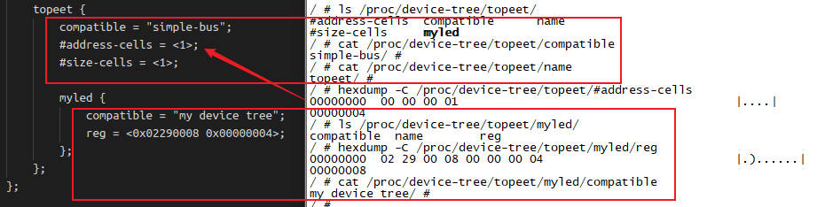

接下来，我们看下`platform_device`确实有我们在设备树中添加的`topeet`和`myled`节点。另外，`of_node`关联到了`device_node`，这跟之前的代码分析一致。

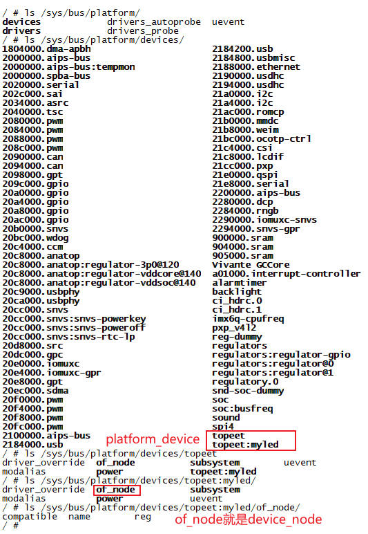

接下来我们`insmod`加载驱动模块，看看效果

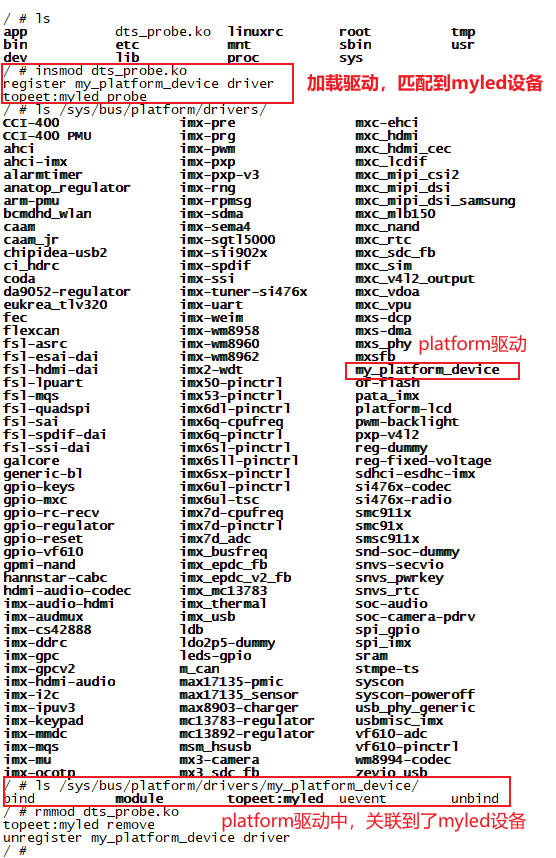

## 第6章 `of操作函数实验`：获取设备树节点

在上一章的学习中，我们学会了设备树下`platform_device`和`platform_driver`匹配，到现在也只是让他们匹配到了一起。但这样显然是不够的，为了完成一些和硬件相关的需求，我们还需要获取到设备树中编写的一些属性。

设备树节点就是`device_node`，所以`of操作函数`实际上就是获取`device_node`结构体，我们接下来学习的`of操作函数`的返回值，都是`device_node`结构体。

### 6.1 `of_find_node_by_name()`函数

#### 6.1.1 函数原型

```c
struct device_node *of_find_node_by_name(struct device_node *from, const char *name);
```

#### 6.1.2 参数详解

1. from：指定搜索的起始节点
    + 若为NULL，表示从设备树的根节点开始全局搜索
    + 若指定某个节点(父节点)，则尽在该节点的子树范围内搜索
2. name：目标节点的完整名称. 比如`uart@40011000`，不可简写成`uart`
3. 返回值
    + 成功：返回指向`struct device_node`的指针(包含节点所有信息)
    + 失败：返回NULL，表示未找到匹配节点

### 6.2 `of_find_node_by_path()`函数

#### 6.2.1 函数原型

```c
struct device_node *of_find_node_by_path(const char *path);
```

#### 6.2.2 参数详解

1. path：设备树中目标节点的完整路径或别名
    + 绝对路径：`"/soc/i2c@40012000"`
    + 别名：`"/i2c1"` 需在设备树中通过`aliases`节点定义
2. 返回值
    + 成功：返回指向`struct device_node`的指针(包含节点所有信息)
    + 失败：返回NULL，表示未找到匹配节点

### 6.3 `of_get_parent()`函数

#### 6.3.1 函数原型

```c
struct device_node *of_get_parent(const struct device_node *node);
```

#### 6.3.2 参数详解

1. node：目标子节点，需获取其父节点的设备节点指针。若为NULL，函数直接返回NULL
2. 返回值
    + 成功：返回指向`struct device_node`的指针(包含节点所有信息)
    + 失败：返回NULL，表示未找到匹配节点

#### 6.3.3 注意事项

1. 引用计数管理：`of_get_parent()`会增加父节点的引用计数，必须通过`of_node_put()`释放，否则会导致内存泄露
2. 根节点无父节点：对根节点调用将返回NULL
3. 性能优化：频繁调用时建议缓存父节点指针，减少遍历开销

### 6.4 `of_find_compatible_node()`函数

#### 6.4.1 函数原型

```c
struct device_node *of_find_compatible_node(
    struct device_node *from, 
    const char *type, 
    const char *compatible
);
```

#### 6.4.2 参数详解

1. from：搜索起点。若为NULL则从设备树根节点全局搜索。若指定节点，则仅搜索其子树
2. type：匹配节点的`device_type`属性值。可以为NULL，表示忽略此条件
3. compatible：兼容性字符串，需匹配的`compatible`属性值(如`fsl,imx6ul-gpt`)
4. 返回值
    + 成功：返回指向`struct device_node`的指针(包含节点所有信息)
    + 失败：返回NULL，表示未找到匹配节点

#### 6.4.3 注意事项

1. 引用计数管理：每次成功调用后必须用`of_node_put()`释放节点，否则会导致内存泄露
2. 若需精确路径匹配：改用`of_find_node_by_path()`

### 6.5 代码实测

接下来写代码调用这几个函数，来获取`myled`节点和`parent`节点。

```c
static int my_probe(struct platform_device *pdev)
{
    struct device_node *node = NULL;
    struct device_node *parent = NULL;

    printk(KERN_INFO "%s probe\n", pdev->name);

    node = of_find_node_by_name(NULL, "myled");
    printk(KERN_INFO "of_find_node_by_name() node.name:%s node.full_name:%s\n", node->name, node->full_name);

    node = of_find_node_by_path("/topeet/myled");
    printk(KERN_INFO "of_find_node_by_path() node.name:%s node.full_name:%s\n", node->name, node->full_name);

    parent = of_get_parent(node);
    printk(KERN_INFO "of_get_parent() parent.name:%s parent.full_name:%s\n", parent->name, parent->full_name);

    node = of_find_compatible_node(NULL, NULL, "my device tree");
    printk(KERN_INFO "of_find_compatible_node() node.name:%s node.full_name:%s\n", node->name, node->full_name);

    return 0;
}
```

测试结果：

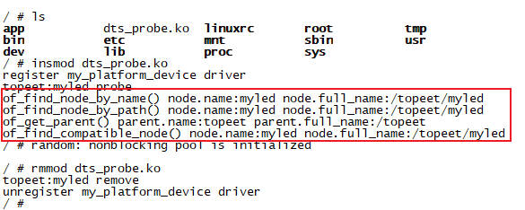

## 第7章 `of操作函数实验`：获取属性

通过第6章的学习，我们已经能够获取到设备节点`device_node`了，接下来我们要读取设备节点的属性。

### 7.1 `of_find_property()`函数：获取属性

#### 7.1.1 函数原型

```c
struct property *of_find_property(
    const struct device_node *np, 
    const char *name, 
    int *lenp
);
```

#### 7.1.2 参数详解

1. np：目标设备节点指针，需通过`of_find_node_by_path()`等函数预先获取节点
2. name：要查找的属性名称，如`compatible`、`reg`，要与设备树中的属性名严格匹配
3. lenp：输出参数，接收属性值的字节长度(可为NULL，表示忽略长度)
4. 返回值
    成功：返回`struct property *`指针
    失败：返回NULL

#### 7.1.3 核心用途

`of_find_property()`函数，最常用来检查节点是否包含指定属性(如检查`status`是否为`okay`)

### 7.2 `of_property_count_elems_of_size()`函数：统计属性内元素数量

#### 7.2.1 函数原型

```c
int of_property_count_elems_of_size(
    const struct device_node *np, 
    const char *propname, 
    int elem_size
);
```

#### 7.2.2 参数详解

1. np：目标设备节点指针，需通过`of_find_node_by_path()`等函数预先获取节点
2. propname：要查找的属性名称，如`compatible`、`reg`，要与设备树中的属性名严格匹配
3. elem_size：单个元素的字节大小，如u32为4，u64为8
4. 返回值
    成功：返回属性值中的元素的个数
    失败：返回负的错误码

#### 7.2.3 核心用途

1. 校验属性格式：验证属性值书否符合预期长度(如`interrupts`是否包含完整的`中断号+触发方式`组合)
2. 预分配内存：根据元素数量动态分配数组内存，避免缓冲区溢出或浪费

#### 7.2.4 关键注意事项

1. 元素尺寸匹配`elem_size`，需与属性值的数据类型严格一致
    + u32数组(32位地址系统)：`elem_size = 4`
    + u64数组(64位地址系统)：`elem_size = 8`
2. 复合属性处理：`reg`属性由多个`地址+长度`组成，实际元素数 = 属性总字节数 / (elem_size * 2)
3. 结合父节点规则：数组元素的实际含义，可能依赖父节点的`#address-cells`和`#size-cells`. 如`reg`每组包含(`address-cells + size-cells`)个整数

### 7.3 `of_property_read_u32_index()`函数：读取属性中指定索引的u32数据

#### 7.3.1 函数原型

```c
int of_property_read_u32_index(
    const struct device_node *np, 
    const char *propname, 
    u32 index, 
    u32 *out_value
);
```

#### 7.3.2 参数详解

1. np：目标设备节点指针，需通过`of_find_node_by_path()`等函数预先获取节点
2. propname：要查找的属性名称，如`compatible`、`reg`，要与设备树中的属性名严格匹配
3. index：元素索引号(从0开始)，指定要读取的属性值在数组中的位置
4. out_value：输出参数，存储读取到的u32值
5. 返回值
    + 成功：返回0，且`out_value`包含有效数据
    + 失败：返回负的错误码

#### 7.3.3 核心用途

1. 警觉读取数组属性中的元素：避免一次性读取整个数组，仅提取所需索引的数据，节省内存并提升效率。典型场景：
    + 解析reg属性中的特定寄存器地址或长度
    + 读取interrupts属性中某个中断号和触发方式
2. 处理动态长度的属性：结合`of_property_count_elems_of_size()`先获取元素总数，再按需读取指定索引值

### 7.4 `of_property_read_u8_array()`函数：读取属性中的u8数组

#### 7.4.1 函数原型

```c
int of_property_read_u8_array(
    const struct device_node *np, 
    const char *propname, 
    u8 *out_values, 
    size_t sz
);
```

#### 7.4.2 参数详解

1. np：目标设备节点指针，需通过`of_find_node_by_path()`等函数预先获取节点
2. propname：要查找的属性名称，如`compatible`、`reg`，要与设备树中的属性名严格匹配
3. out_values：输出缓冲区，存储读取到的u8数组数据
4. sz：要读取的元素数量(非字节数)
5. 返回值
    成功：返回0，数据写入out_values缓冲区
    失败：返回负的错误码

#### 7.4.3 核心用途

解析字节流配置：适用于需按字节序列配置的场景。如传感器的校准参数表(如ADC校准值)。

### 7.4 `of_property_read_u32_array()`函数：读取属性中的u32数组

#### 7.4.1 函数原型

```c
int of_property_read_u32_array(
    const struct device_node *np, 
    const char *propname, 
    u32 *out_values, 
    size_t sz
);
```

#### 7.4.2 参数详解

1. np：目标设备节点指针，需通过`of_find_node_by_path()`等函数预先获取节点
2. propname：要查找的属性名称，如`compatible`、`reg`，要与设备树中的属性名严格匹配
3. out_values：输出缓冲区，存储读取到的u32数组数据
4. sz：要读取的元素数量(非字节数)
5. 返回值
    成功：返回0，数据写入out_values缓冲区
    失败：返回负的错误码

#### 7.4.3 核心用途

1. 解析硬件资源数组：读取设备树中由多个u32值组成的属性。例如：
    + reg：寄存器地址和长度对(如`<0x4001100 0x400>`)
    + interrupts：中断号和触发方式组合(如`<10 IRQ_TYPE_LEVEL_HIGH>`)
2. 避免手动解析原始数据：替代直接访问`property->value`，提供类型安全和边界检查，防止内存越界

### 7.5 `of_property_read_string()`函数：读取属性中的字符串

#### 7.5.1 函数原型

```c
int of_property_read_string(
    const struct device_node *np, 
    const char *propname, 
    const char **out_string
);
```

#### 7.5.2 参数详解

1. np：目标设备节点指针，需通过`of_find_node_by_path()`等函数预先获取节点
2. propname：要查找的属性名称，如`compatible`、`reg`，要与设备树中的属性名严格匹配
3. out_string：存储指向属性字符串的指针(非拷贝，直接引用属性值)
4. 返回值
    成功：返回0，out_string指向有效的以\0结尾的字符串
    失败：返回负的错误码

#### 7.5.3 核心用途

1. 读取关键标识属性：如`compatible`(驱动匹配依据)、`status`(设备启用状态)、`device_type`(设备分类)
2. 避免手动解析原始数据：替代`of_get_property() + 内存拷贝 + 终止符检查`，简化代码并提升安全性

### 7.6 `of_property_read_string_array()`函数：读取属性中的字符串数组

#### 7.6.1 函数原型

```c
#include <linux/of.h>
int of_property_read_string_array(
    const struct device_node *np, 
    const char *propname, 
    const char **out_strings, 
    size_t sz
);
```

#### 7.6.2 参数详解

1. np：目标设备节点指针，需通过`of_find_node_by_path()`等函数预先获取节点
2. propname：要查找的属性名称，如`compatible`、`reg`，要与设备树中的属性名严格匹配
3. out_string：存储指向属性字符串的指针数组(非拷贝，直接引用属性值)
4. sz：预期读取的最大字符串数量，防止缓冲区溢出
5. 返回值
    成功：>=0 实际成功官渡区的字符串数量
    失败：返回负的错误码

#### 7.6.3 核心用途

1. 解析多字符串配置：设备树中以下属性需用此函数：
    + 时钟名列表：`clock-names = "tx", "rx", "reg"`
    + 中断名：`interrupt-names = "irq0", "irq1"`
2. 避免手动解析：替代`of_get_property() + 字符串分割`，直接返回字符串指针数组，提升安全性和可读性

### 7.6 代码实测

接下来写一个简单的测试程序，来读取`myled`节点的属性值

```c
static int my_probe(struct platform_device *pdev)
{
    struct device_node *node = NULL;
    struct property *property = NULL;
    int num = 0;
    u32 i = 0, reg_val = 0;
    const char *compatible_s = NULL;

    printk(KERN_INFO "%s probe\n", pdev->name);

    node = of_find_node_by_path("/topeet/myled");
    printk(KERN_INFO "node name:%s\n", node->name);

    property = of_find_property(node, "compatible", NULL);
    printk("property name:%s\n", property->name);

    num = of_property_count_elems_of_size(node, "reg", 4);
    printk("reg num:%d\n", num);
    for (i = 0; i < num; i++) {
        of_property_read_u32_index(node, "reg", i, &reg_val);
        printk("reg[%d]: 0x%08x\n", i, reg_val);
    }

    of_property_read_string(node, "compatible", &compatible_s);
    printk("compatible: %s\n", compatible_s);

    return 0;
}
```

实测结果：

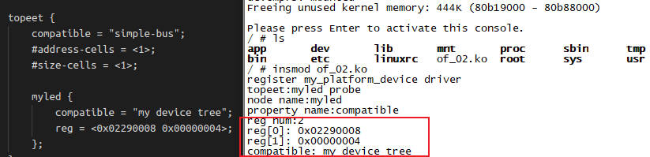

