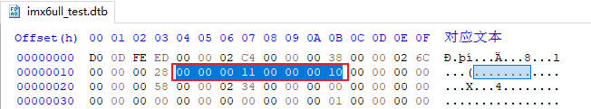

# 使用设备树

## 第1章 `dtb`文件格式详解

设备树`dtb`格式，是设备树数据的平面二进制编码。它用于在软件程序之间交换数据，如boot传递dtb给内核。

### 1.1 `dtb`文件格式

dtb格式，由1个小头部和3个可变大小的部分组成：内存保留块、结构块和字符串块。结构如下：


### 1.2 实例分析

以下面的设备树文件为例，分析二进制格式：

```dts
/dts-v1/;

/{
    model = "this is my device tree";
    #address-cells = <1>;
    #size-cells = <1>;
    
    chosen {
        bootargs = "root=/dev/nfs rw nfsroot=192.168.1.1 console=ttyS0,115200";
    };

    cpus {
        #address-cells = <1>;
        #size-cells = <0>;

        cpu0: cpu@0 {
            device-type = "cpu";
            compatible = "arm,cortex-a7";
            reg = <0>;
        };
    };

    aliases {
        led1 = "/gpio@22020101";
    };

    node1 {
        #address-cells = <1>;
        #size-cells = <1>;
        gpio@22020102 {
            reg = <0x20220102 0x40>;
        };
    };

    node2 {
        node1-child {
            pinnum = <01234>;
        };
    };

    gpio@22020101 {
        compatible = "led";
        reg = <0x20220101 0x40>;
        status = "okay";
    };
};
```

使用dtc工具，把设备树编译成二进制文件：

```sh
dtc -I dts -O dtb -o imx6ull_test.dtb imx6ull_test.dts
```

dtb的头布局由以下C结构定义。所有的头字段都是u32整数，以大端格式存储。

```c
struct fdt_header {
	uint32_t magic;			 /* magic word FDT_MAGIC */
	uint32_t totalsize;		 /* total size of DT block */
	uint32_t off_dt_struct;		 /* offset to structure */
	uint32_t off_dt_strings;	 /* offset to strings */
	uint32_t off_mem_rsvmap;	 /* offset to memory reserve map */
	uint32_t version;		 /* format version */
	uint32_t last_comp_version;	 /* last compatible version */

	/* version 2 fields below */
	uint32_t boot_cpuid_phys;	 /* Which physical CPU id we're
					    booting on */
	/* version 3 fields below */
	uint32_t size_dt_strings;	 /* size of the strings block */

	/* version 17 fields below */
	uint32_t size_dt_struct;	 /* size of the structure block */
};
```

下面详细解释每个字段的含义：

| 字段 | 描述 |
| - | - |
| magic | 固定值0xd00dfeed |
| totalsize | 设备树数据结构的总大小(以字节为单位). 此大小包含了所有部分 |
| off_dt_struct | 结构块从头开始的以字节为单位的偏移量 |
| off_dt_strings | 字符串块从头开始的以字节为单位的偏移量 |
| off_mem_rsvmap | 内存保留块从头开始的以字节为单位的偏移量 |
| version | 设备树数据结构的版本 |
| last_comp_version | 向后兼容的设备树数据结构的最低版本 |
| boot_cpuid_phys | 启动的cpu id，与设备树cpu节点的reg属性对应 |
| size_dt_strings | 字符串块部分的字节长度 |
| size_dt_struct | 结构块部分的字节长度 |

#### 1.2.1 `magic`

magic固定为0xd00dfeed，对应的dtb


#### 1.2.2 `totalsize`

totalsize表示dtb文件的总字节数


#### 1.2.3 `version和last_comp_version`

当前设备树版本为0x11(17)，能够向后兼容的设备树最低版本为0x10(16)



#### 1.2.4 `boot_cpuid_phys`

从cpu 0启动


#### 1.2.5 `size_dt_strings`

字符串块的长度


#### 1.2.6 `size_dt_struct`


接下来我们详细介绍：内存保留块、结构块、字符串块。

### 1.3 内存保留块

在aem linux中，设备树的内存保留块是一种关键机制，用于在物理内存中预留特定区域，使其不被内核的常规内存管理系统分配使用。

#### 1.3.1 核心作用

1. 隔绝物理内存区域：通过设备树的`reserved-memory`节点，将其物理地址范围标记为保留，内核在启动时将其从`memblock`子系统移除，确保操作系统不会分配这些区域给用户程序或内核通用模块
2. 支持专用硬件访问：保留特定区域通常由特定硬件（如FPGA、DMA、GPU）直接访问。例如：FPGA通过共享内存与ARM通信
3. 提升系统稳定性与性能
    + 减少碎片化：避免大块连续内存被拆分，满足需要物理连续内存的设备
    + 低延迟访问：硬件可直接访问保留内存，无需内核介入，提升实时性

#### 1.3.2 技术实现方式

内存保留块包括2部分：定义节点、绑定节点。

##### 1.3.2.1 定义节点

在设备树的`reserved-memory`节点下声明子节点，指定地址和大小

```dts
reserved-memory {
    #address-cells = <2>;
    #size-cells = <2>;
    ranges;
    my_reserved: my_region@10000000 {
        compatible = "shared-dma-pool"; // 常用属性
        reg = <0x0 0x10000000 0x0 0x1000000>; // 起始地址0x10000000，大小16MB
        no-map; // 禁止内核创建映射
    };
};
```

关键属性：

1. `reg`：定义起始地址和长度
2. `no map`：内核不创建页表映射，需驱动通过ioremap手动映射
3. `compatible = shared-dma-pool`：表示用于DMA的连续内存池

##### 1.3.2.2 绑定节点(私有 vs 共享保留内存)

+ 私有保留保存

通过`memory-region`绑定到特定设备节点，仅限该驱动设备访问

```dts
my_device {
    compatible = "vendor,device";
    memory-region = <&my_reserved>; // 引用保留内存
};
```

+ 共享保留内存

添加`linux,cma-default`属性，作为全局连续内存分配池，供所有设备通过`dma_alloc_coherent()`申请

#### 1.3.3 数据结构

在设备树二进制文件dtb中，内存保存块的数量可通过解析其特定结构来确定。内存保留块的位置与结构：

1. 位置信息：dtb头部的`off_mem_rsvmap`字段，指明了内存保留块的起始偏移地址
2. 数据结构：由连续的`fdt_reserve_entry`结构体数组构成，数组成员为u64整数
3. 结束标志：保留块以全0的`fdt_reserve_entry`(即address=0，size=0)，作为结束标记

```c
struct fdt_reserve_entry {
	uint64_t address;
	uint64_t size;
};
```

下面是我们测试的设备树文件的dtb，由于没有定义预留块，这里`fdt_reserve_entry`直接就是全0(结束标志)


### 1.4 结构块

结构块是dtb中描述设备树本身结构和内容的部分。它由一系列带有数据的令牌序列组成，这些令牌按照线性树结构进行组织。

#### 1.4.1 令牌类型

+ FDT_BEGIN_NODE (0x00000001)：标记表示节点的开始，后接节点名称(以\0结尾的字符串). 节点名称后可能需要填充0字节以对齐，然后是下一个标记

    每个节点的开始，包括2部分：
    1. TAG(0x00000001)
    2. 节点名称字符串(可能需要填充0字节对齐)

    ```c
    struct fdt_node_header {
        uint32_t tag;   // 固定为0x00000001
        char name[0];   // 节点名称字符串
    };

    int fdt_begin_node(void *fdt, const char *name)
    {
        struct fdt_node_header *nh;
        int namelen = strlen(name) + 1;

        nh = _fdt_grab_space(fdt, sizeof(*nh) + FDT_TAGALIGN(namelen));
        nh->tag = cpu_to_fdt32(FDT_BEGIN_NODE/*0x0000 0001*/);
        memcpy(nh->name, name, namelen);
        return 0;
    }
    ```

+ FDT_END_NODE (0x00000002)：标记表示节点的结束，无额外数据. 紧跟其后的是下一个标记

+ FDT_PROP (0x00000003)：标记表示设备树中属性的开始。他后面跟着描述属性的额外数据

    每个属性，包括4部分：

    1. TAG(0x00000003)
    2. 属性值的字节长度
    3. 属性名称字符串偏移
    4. 属性值字符串(可能需要填充0字节对齐)

    ```c
    struct fdt_property {
        uint32_t tag;       // 固定为0x00000003
        uint32_t len;       // 属性值的字节长度
        uint32_t nameoff;   // 属性名称在字符串块的偏移量
        char data[0];       // 属性值字符串
    };

    int fdt_property(void *fdt, const char *name, const void *val, int len)
    {
        struct fdt_property *prop;
        int nameoff;

        FDT_SW_CHECK_HEADER(fdt);

        nameoff = _fdt_find_add_string(fdt, name);
        prop = _fdt_grab_space(fdt, sizeof(*prop) + FDT_TAGALIGN(len));

        prop->tag = cpu_to_fdt32(FDT_PROP/*0x0000 0003*/);
        prop->nameoff = cpu_to_fdt32(nameoff);
        prop->len = cpu_to_fdt32(len);
        memcpy(prop->data, val, len);
        return 0;
    }
    ```

+ FDT_END (0x00000009)：标记表示结构块的结束。应该只有一个`FDT_END`标记，并且应该是结构块中的最后一个标记。该标记没有额外的数据，紧随其后的字节就是字符串块

#### 1.4.2 实例分析


### 1.5 字符串块

字符串块用于存储设备树中使用的所有属性名称。它由一系列以`\0`空字符结尾的字符串组成。这些字符串在字符串块中简单的连接在一起。


1. 字符串连接：字符串块中的字符串，以空字符\0作为终止符来连接。这意味着每个字符串都以空字符结尾，并且下一个字符串紧跟在上一个字符串的末尾
2. 偏移量引用：在结构块中，属性的名称是通过偏移量来引用字符串块中的相应字符串的
3. 对齐约束：字符串块没有对齐约束，这意味着它可以出现在设备树dcb的任何偏移处

## 第2章 `dtb`展开成`device_node`

### 2.1 `device_node`设备节点

Linux内核中`device_node`结构体，是设备树的核心数据结构，用于描述设备树中的节点信息。

```c
struct device_node {
	const char *name;   // 节点名称(非完整路径)，取自设备树节点名的首段
	const char *type;   // 设备类型，取自节点中的 device_type 属性(可选)
	phandle phandle;    // 节点的唯一标识符，用于跨节点引用(如中断映射)
	const char *full_name;
	struct fwnode_handle fwnode;

	struct	property *properties;
	struct	property *deadprops;	/* removed properties */
	struct	device_node *parent;
	struct	device_node *child;
	struct	device_node *sibling;
	struct	kobject kobj;
	unsigned long _flags;
	void	*data;
};
```


