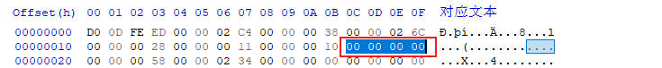

# 使用设备树

## 第1章 `dtb`文件格式详解

设备树`dtb`格式，是设备树数据的平面二进制编码。它用于在软件程序之间交换数据，如boot传递dtb给内核。

### 1.1 `dtb`文件格式

dtb格式，由1个小头部和3个可变大小的部分组成：内存保留块、结构块和字符串块。结构如下：


### 1.2 实例分析

以下面的设备树文件为例，分析二进制格式：

```dts
/dts-v1/;

/{
    model = "this is my device tree";
    #address-cells = <1>;
    #size-cells = <1>;
    
    chosen {
        bootargs = "root=/dev/nfs rw nfsroot=192.168.1.1 console=ttyS0,115200";
    };

    cpus {
        #address-cells = <1>;
        #size-cells = <0>;

        cpu0: cpu@0 {
            device-type = "cpu";
            compatible = "arm,cortex-a7";
            reg = <0>;
        };
    };

    aliases {
        led1 = "/gpio@22020101";
    };

    node1 {
        #address-cells = <1>;
        #size-cells = <1>;
        gpio@22020102 {
            reg = <0x20220102 0x40>;
        };
    };

    node2 {
        node1-child {
            pinnum = <01234>;
        };
    };

    gpio@22020101 {
        compatible = "led";
        reg = <0x20220101 0x40>;
        status = "okay";
    };
};
```

使用dtc工具，把设备树编译成二进制文件：

```sh
dtc -I dts -O dtb -o imx6ull_test.dtb imx6ull_test.dts
```

dtb的头布局由以下C结构定义。所有的头字段都是u32整数，以大端格式存储。

```c
struct fdt_header {
	uint32_t magic;			 /* magic word FDT_MAGIC */
	uint32_t totalsize;		 /* total size of DT block */
	uint32_t off_dt_struct;		 /* offset to structure */
	uint32_t off_dt_strings;	 /* offset to strings */
	uint32_t off_mem_rsvmap;	 /* offset to memory reserve map */
	uint32_t version;		 /* format version */
	uint32_t last_comp_version;	 /* last compatible version */

	/* version 2 fields below */
	uint32_t boot_cpuid_phys;	 /* Which physical CPU id we're
					    booting on */
	/* version 3 fields below */
	uint32_t size_dt_strings;	 /* size of the strings block */

	/* version 17 fields below */
	uint32_t size_dt_struct;	 /* size of the structure block */
};
```

下面详细解释每个字段的含义：

| 字段 | 描述 |
| - | - |
| magic | 固定值0xd00dfeed |
| totalsize | 设备树数据结构的总大小(以字节为单位). 此大小包含了所有部分 |
| off_dt_struct | 结构块从头开始的以字节为单位的偏移量 |
| off_dt_strings | 字符串块从头开始的以字节为单位的偏移量 |
| off_mem_rsvmap | 内存保留块从头开始的以字节为单位的偏移量 |
| version | 设备树数据结构的版本 |
| last_comp_version | 向后兼容的设备树数据结构的最低版本 |
| boot_cpuid_phys | 启动的cpu id，与设备树cpu节点的reg属性对应 |
| size_dt_strings | 字符串块部分的字节长度 |
| size_dt_struct | 结构块部分的字节长度 |

#### 1.2.1 `magic`

magic固定为0xd00dfeed，对应的dtb


#### 1.2.2 `totalsize`

totalsize表示dtb文件的总字节数


#### 1.2.3 `version和last_comp_version`

当前设备树版本为0x11(17)，能够向后兼容的设备树最低版本为0x10(16)


#### 1.2.4 `boot_cpuid_phys`

从cpu 0启动



#### 1.2.5 `size_dt_strings`

字符串块的长度


#### 1.2.6 `size_dt_struct`


接下来我们详细介绍：内存保留块、结构块、字符串块。

### 1.3 内存保留块

在aem linux中，设备树的内存保留块是一种关键机制，用于在物理内存中预留特定区域，使其不被内核的常规内存管理系统分配使用。

#### 1.3.1 核心作用

1. 隔绝物理内存区域：通过设备树的`reserved-memory`节点，将其物理地址范围标记为保留，内核在启动时将其从`memblock`子系统移除，确保操作系统不会分配这些区域给用户程序或内核通用模块
2. 支持专用硬件访问：保留特定区域通常由特定硬件（如FPGA、DMA、GPU）直接访问。例如：FPGA通过共享内存与ARM通信
3. 提升系统稳定性与性能
    + 减少碎片化：避免大块连续内存被拆分，满足需要物理连续内存的设备
    + 低延迟访问：硬件可直接访问保留内存，无需内核介入，提升实时性

#### 1.3.2 技术实现方式

内存保留块包括2部分：定义节点、绑定节点。

##### 1.3.2.1 定义节点

在设备树的`reserved-memory`节点下声明子节点，指定地址和大小

```dts
reserved-memory {
    #address-cells = <2>;
    #size-cells = <2>;
    ranges;
    my_reserved: my_region@10000000 {
        compatible = "shared-dma-pool"; // 常用属性
        reg = <0x0 0x10000000 0x0 0x1000000>; // 起始地址0x10000000，大小16MB
        no-map; // 禁止内核创建映射
    };
};
```

关键属性：

1. `reg`：定义起始地址和长度
2. `no map`：内核不创建页表映射，需驱动通过ioremap手动映射
3. `compatible = shared-dma-pool`：表示用于DMA的连续内存池

##### 1.3.2.2 绑定节点(私有 vs 共享保留内存)

+ 私有保留保存

通过`memory-region`绑定到特定设备节点，仅限该驱动设备访问

```dts
my_device {
    compatible = "vendor,device";
    memory-region = <&my_reserved>; // 引用保留内存
};
```

+ 共享保留内存

添加`linux,cma-default`属性，作为全局连续内存分配池，供所有设备通过`dma_alloc_coherent()`申请

#### 1.3.3 数据结构

在设备树二进制文件dtb中，内存保存块的数量可通过解析其特定结构来确定。内存保留块的位置与结构：

1. 位置信息：dtb头部的`off_mem_rsvmap`字段，指明了内存保留块的起始偏移地址
2. 数据结构：由连续的`fdt_reserve_entry`结构体数组构成，数组成员为u64整数
3. 结束标志：保留块以全0的`fdt_reserve_entry`(即address=0，size=0)，作为结束标记

```c
struct fdt_reserve_entry {
	uint64_t address;
	uint64_t size;
};
```

下面是我们测试的设备树文件的dtb，由于没有定义预留块，这里`fdt_reserve_entry`直接就是全0(结束标志)


### 1.4 结构块

结构块是dtb中描述设备树本身结构和内容的部分。它由一系列带有数据的令牌序列组成，这些令牌按照线性树结构进行组织。

#### 1.4.1 令牌类型

+ FDT_BEGIN_NODE (0x00000001)：标记表示节点的开始，后接节点名称(以\0结尾的字符串). 节点名称后可能需要填充0字节以对齐，然后是下一个标记

    每个节点的开始，包括2部分：
    1. TAG(0x00000001)
    2. 节点名称字符串(可能需要填充0字节对齐)

    ```c
    struct fdt_node_header {
        uint32_t tag;   // 固定为0x00000001
        char name[0];   // 节点名称字符串
    };

    int fdt_begin_node(void *fdt, const char *name)
    {
        struct fdt_node_header *nh;
        int namelen = strlen(name) + 1;

        nh = _fdt_grab_space(fdt, sizeof(*nh) + FDT_TAGALIGN(namelen));
        nh->tag = cpu_to_fdt32(FDT_BEGIN_NODE/*0x0000 0001*/);
        memcpy(nh->name, name, namelen);
        return 0;
    }
    ```

+ FDT_END_NODE (0x00000002)：标记表示节点的结束，无额外数据. 紧跟其后的是下一个标记

+ FDT_PROP (0x00000003)：标记表示设备树中属性的开始。他后面跟着描述属性的额外数据

    每个属性，包括4部分：

    1. TAG(0x00000003)
    2. 属性值的字节长度
    3. 属性名称字符串偏移
    4. 属性值字符串(可能需要填充0字节对齐)

    ```c
    struct fdt_property {
        uint32_t tag;       // 固定为0x00000003
        uint32_t len;       // 属性值的字节长度
        uint32_t nameoff;   // 属性名称在字符串块的偏移量
        char data[0];       // 属性值字符串
    };

    int fdt_property(void *fdt, const char *name, const void *val, int len)
    {
        struct fdt_property *prop;
        int nameoff;

        FDT_SW_CHECK_HEADER(fdt);

        nameoff = _fdt_find_add_string(fdt, name);
        prop = _fdt_grab_space(fdt, sizeof(*prop) + FDT_TAGALIGN(len));

        prop->tag = cpu_to_fdt32(FDT_PROP/*0x0000 0003*/);
        prop->nameoff = cpu_to_fdt32(nameoff);
        prop->len = cpu_to_fdt32(len);
        memcpy(prop->data, val, len);
        return 0;
    }
    ```

+ FDT_END (0x00000009)：标记表示结构块的结束。应该只有一个`FDT_END`标记，并且应该是结构块中的最后一个标记。该标记没有额外的数据，紧随其后的字节就是字符串块

#### 1.4.2 实例分析


### 1.5 字符串块

字符串块用于存储设备树中使用的所有属性名称。它由一系列以`\0`空字符结尾的字符串组成。这些字符串在字符串块中简单的连接在一起。


1. 字符串连接：字符串块中的字符串，以空字符\0作为终止符来连接。这意味着每个字符串都以空字符结尾，并且下一个字符串紧跟在上一个字符串的末尾
2. 偏移量引用：在结构块中，属性的名称是通过偏移量来引用字符串块中的相应字符串的
3. 对齐约束：字符串块没有对齐约束，这意味着它可以出现在设备树dcb的任何偏移处

## 第2章 `dtb`展开成`device_node`

### 2.1 `device_node`设备节点

Linux内核中`device_node`结构体，是设备树的核心数据结构，用于描述设备树中的节点信息。

```c
struct device_node {
	const char *name;               // 节点名称(非完整路径)，取自设备树节点名的首段
	const char *type;               // 设备类型，取自节点中的 device_type 属性(可选)
	u32 phandle;                    // 节点的唯一标识符，用于跨节点引用(如中断映射)
	const char *full_name;          // 节点的完整路径名(如"/soc/uart@10000000")

	struct	property *properties;   // 属性链表头指针
	struct	device_node *parent;    // 父设备节点指针
	struct	device_node *child;     // 子设备节点指针
	struct	device_node *sibling;   // 兄弟设备节点指针(平级的节点)
	struct	kobject kobj;           // 内核对象(用于sysfs)
	void	*data;                  // 与设备节点相关的数据指针
};
```

#### 2.1.1 `name`成员

##### 2.1.1.1 节点标识与查找

1. 功能说明：`device_node`结构体的`name`成员，存储设备树节点的基础名称(即节点名中@前的部分)，如节点`serial@10000000`的name值为"serial"
2. 实际应用：内核通过`of_find_node_by_name()`等API基于`name`查找节点，例如：

    ```c
    struct device_node *np = of_find_node_by_name(NULL, "serial"); // 查找所有名为"serial"的节点
    ```

    在设备树解析阶段，name用于快速定位同类型节点(如多个串口设备)

##### 2.1.1.2 设备创建与驱动匹配

1. 驱动关联：内核将`device_node`转换为`platform_device`时，会将`name`作为`platfoem_device.name`的一部分，驱动再通过`compatible`或名称匹配设备
2. 实例对比：
    设备树节点：
    ```dts
    i2c0: i2c@400000 {
        compatible = "vendor,i2c-controller";
    };
    ```
    对应的`device_node.name = i2c`，内核生成`platfoem_device.name = i2c@400000` 完整路径用于唯一性，但基础名称为i2c
3. 调试接口：`/proc/device-tree`目录中，每个子目录名即为节点的`name`值

##### 2.1.1.3 节点关系构建

设备树通过`parent、child、sibling`指针构建树状结构，name作为节点的标签，辅助开发者理解设备层级关系。

```dts
soc {                          // parent节点 name="soc"
    serial@1000 { ... };       // child节点 name="serial"
    spi@2000 { ... };          // sibling节点 name="spi"
};
```

##### 2.1.1.4 实际场景对比表

| 场景 | 设备树节点示例 | `device_node.name`值 | 内核行为 |
| - | - | - | - |
| 串口设备注册 | `serial@10000000` | `serial` | 驱动匹配时识别为串口设备 |
| I2C控制器初始化 | `i2c@400000` | `i2c` | 生成`platform_device`并注册i2c总线 |
| 调试信息打印 | `ethernet@ff000000` | `ethernet` | 日志中显式`Probing ethernet device...` |
| 节点遍历 | `gpio@ff00a000` | `gpio` | 通过`of_find_node_by_name()`查找所有gpio节点 |

#### 2.1.2 `type`成员

Linux内核的`device_node`结构体中，type成员用于标识设备的类型分类，其值来源于设备树节点中的`device_type`属性

##### 2.1.2.1 标识设备的功能类型

1. 功能说明：`type`成员存储设备树节点中，`device_type`属性的值。用于区分设备的基础功能类型(如cpu、内存、总线控制器)
2. 设备树示例：
    ```dts
    cpu0: cpu@0 {
        device_type = "cpu";       // 标识为CPU设备
        compatible = "arm,cortex-a53";
    };
    memory@80000000 {
        device_type = "memory";   // 标识为内存设备
        reg = <0x80000000 0x20000000>;
    };
    ```
    内核解析后：
    + cpu节点的`device_node.name = "cpu"`
    + 内存节点的`device_node.name = "memory"`

##### 2.1.2.2 辅助内核识别关键硬件

1. 特殊节点标识：部分关键硬件(如cpu、memory)必须通过`device_type`属性明确类型，内核根据此初始化全局数据结构
    + 内存结点：`device_type = "memory"`是识别物理内存区域的必要条件，内核根据此调用`memblock_add()`保留内存
    + cpu节点：`device_type = "cpu"`同于构建cpu拓扑结构
2. 内核行为：若设备树中未标记memory节点，内核可能无法正确初始化内存，导致系统崩溃

##### 2.1.2.3 兼容旧驱动接口(历史原因)

1. 历史API依赖：早期内核通过`of_find_node_by_type()`函数，按类型查找节点(如查找所有cpu节点)

    ```c
    struct device_node *np = of_find_node_by_type(NULL, "serial"); // 查找所有串口设备
    ```

    现代驱动已转向使用`compatible`属性匹配设备，但此API仍保留

2. 现状：`device_type`在普通外设(如uart、i2c)极少使用，仅在cpu、memory等核心硬件中保留

#### 2.1.3 `full_name`成员

Linux内核的`device_node`结构体中，`full_name`成员用于存储设备节点的完整路径名称，其核心作用在于提供设备树中节点的全局唯一标识。

##### 2.1.3.1 节点的全局唯一标识

1. 路径表示形式：`full_name`的格式为`node-name[@unit-address]`，例如`/soc/serial@40001000`，它通过富子结点层级关系唯一确定设备在设备树中的位置
2. 唯一性保障：在设备树中，同一父节点下的子节点名称需唯一(通过unit-address区分)，而`full_name`从根节点开始拼接，确保整个设备树中无重复路径

##### 2.1.3.2 节点查找与遍历的基石

内核提供一下API，依赖`full_name`进行节点操作：

1. 路径查找：`of_find_node_by_path()`：直接通过完整路径(如"/soc/i2c@400000")定位节点，内部需匹配`full_name`字段
2. 调试信息定位：内核打印节点日志时，如`pr_info("Found node: %s\n", np->full_name)`，`full_name`提供可读性强的定位信息，便于开发者快速识别问题节点

##### 2.1.3.3 内核解析流程中的生成机制

在设备树解析阶段(`unflatten_device_tree()`函数中)：

1. 首次扫描：计算节点所需内存空间，包括`full_name`的长度
2. 节点创建：递归遍历设备树时，动态生成`full_name`并填充到`device_node`结构体中
3. 例如：父节点`full_name = "/soc"`，子节点名称为`serial@1000` -> 子节点`full_name = "/soc/serial@1000"`

#### 2.1.4 `properties`成员

在Linux内核中，`properties`成员是设备树节点属性链表的头指针，核心作用是存储和管理设备节点的所有配置信息。

##### 2.1.4.1 `properties`属性链表的构建流程

设备树解析时(unflatten_device_tree()函数)，内核将dtb中的属性转换为链表：

1. 首次扫描：计算节点所需内存空间(包括属性链表)
2. 分配内存：为`struct property`分配内存，填充属性名、值、长度
3. 链表链接：将同一节点的所有属性通过`next`指针串联，链表头存入`device_node.properties`

##### 2.1.4.2 内核操作属性的API

驱动通过of函数，访问`properties`链表。

1. 查找属性：`struct property *prop = of_find_property(node, "reg", NULL);` 返回reg属性的`struct property`指针
2. 读取属性值：
    + 字符串：`of_property_read_string(node, "compatible", &str)`
    + 整数数组：`of_property_read_u32_array(node, "reg", reg_data, 2)`
    + 单整数：`of_property_read_u32(node, "clock-frequency", &freq)`
3. 资源映射：
    ```c
    void __iomem *base = of_iomap(node, 0); // 映射reg属性中的第一个寄存器地址
    ```

#### 2.1.5 `parent`成员

##### 2.1.5.1 构建设备树层级结构

`device_node`结构体的`parent`成员，主要用于构建设备树的树状拓扑结构，并支持资源继承、节点查找及硬件初始化等核心功能

```dts
soc {                          // parent节点（根节点子节点）
    i2c@400000 {               // 父节点（soc的子节点）
        sensor@1a {            // 子节点（i2c的子节点）
            compatible = "ti,tmp102";
        };
    };
};
```

内核解析后：

1. `sensor@1a -> parent -> 指向i2c@400000节点`
2. `i2c@400000 -> parent -> 指向soc节点`
3. 通过`parent`、`child`、`sibling`指针，内核将设备树组织为多级链表结构

##### 2.1.5.2 资源继承与地址解析

子节点的硬件资源(如寄存器地址)，依赖父节点的配置信息

reg属性解析：子节点的reg属性(如`reg = <0x40000000 0x1000>`)，需结合父节点的(`#address-cells、#size-cells`)属性才能正确解析. 内核通过`parent`回溯父节点获取`#address-cells、#size-cells`值，进而解析子节点的reg

##### 2.1.5.3 节点查找与遍历

内核提供基于parent的API实现节点操作

1. 查找父节点

    ```c
    struct device_node *parent = of_get_parent(child_node);
    ```

    返回`child_node`的父节点指针，失败时返回NULL

2.遍历子节点

    ```c
    struct device_node *child;
    for_each_child_of_node(parent_node, child) {
        // 处理每个子节点
    }
    ```

    内部通过`parent->child`获取第一个子节点，再通过`sibling`遍历兄弟节点

#### 2.1.6 `child`成员

设备树的`child`成员，核心作用时构建设备树的树状拓扑结构，支持对子节点的遍历、资源继承和硬件初始化

##### 2.1.6.1 构建设备树层级结构

`child`指针指向当前节点的首个子节点，通过子节点的`sibling`指针，可遍历同级所有子节点，形成树状结构

##### 2.1.6.2 子节点遍历的核心机制

内核提供API通过child指针遍历子节点

1. 获取首个子节点

    ```c
    struct device_node *first_child = parent->child;
    ```

2. 迭代所有子节点

    ```c
    struct device_node *child;
    for_each_child_of_node(parent, child) {
        // 处理每个子节点
    }
    ```

3. 宏`for_each_child_of_node`内部实现依赖child和sibling指针的链式访问

##### 2.1.6.3 驱动开发中的典型应用

1. 总线控制器驱动

    + I2C/SPI控制器，需遍历其child链表，为每个子设备(如传感器、EEPROM)注册设备
    + 代码示例：

        ```c
        struct device_node *bus_node = pdev->dev.of_node;
        struct device_node *child;
        for_each_child_of_node(bus_node, child) {
            struct i2c_client *client = create_i2c_device(child);
            // 注册子设备
        }
        ```

2. 符合设备初始化：电源管理芯片(PMIC)节点下挂载多个子节点(稳压器、充电器)，通过`child`指针逐一初始化
3. 状态过滤：通过`of_get_next_avaliable_child()`跳过`status = "disabled"`的子节点，仅处理可用设备

#### 2.1.7 `sibling`成员

设备树`device_node`结构体中，`sibling`成员用于连接同一父节点下的所有子节点，形成链表结构。核心作用在于实现设备树中同级节点的遍历与组织。

##### 2.1.7.1 构建同级节点链表

1. 链表结构：当父节点(如总线控制器)有多个子节点(挂载在总线上的设备)时，`sibling`指针将这些子节点串联为链表
    + 父节点的`child`指针，指向第一个子节点
    + 第一个子节点的`sibling`指向第二个子节点。以此类推，知道最后一个节点的`sibling`为NULL
    ```c
    // 父节点 parent
    parent->child = child1;  // 首个子节点
    child1->sibling = child2;
    child2->sibling = child3; // 终止于 NULL
    ```
2. 设备树中的表现：设备树中同一层级的节点(如多个i2c设备)，通过`sibling`关联
    ```dts
        i2c@400000 {
        sensor@1a { ... }; // child1
        eeprom@50 { ... }; // child2 (child1->sibling)
    };
    ```

#### 2.1.8 `kobj`成员

Linux内核中，`device_node`结构体的`kobj`成员，是连接设备树节点与Linux同一设备模型的核心桥梁。主要实现设备在sysfs中的动态管理、资源生命周期控制及层级关系构建。

##### 2.1.8.1 核心功能

1. sysfs文件系统映射
    + 目录创建：每个`device_node`的`kobj`在sysfs中对应一个目录，路径如`/sys/firmware/devicetree/base/...`，目录名由kobj->name决定，通常与设备树节点名一致。用于可通过该目录访问设备树节点的属性(如compatible reg)
    + 属性导出：设备树节点的属性，如寄存器地址、中断号通过kobj关联的kobj_type操作集(sysfs_ops)转换为sysfs文件，支持用户空间通过`/cat/echo`读写
2. 引用计数与生命周期管理
    + 动态内存管理：`kobj->kref`记录设备的引用计数。当引用归零时，自动释放`device_node`及其关联资源
    + 安全卸载：驱动卸载或设备移除时，调用`kobject_put(kobj)`减少计数，避免内存泄露
3. 设备树层次结构构建
    + 父子关系：`kobj->parent`指向父节点的kobject，如i2c控制器，在sysfs中形成层级目录

##### 2.1.8.2 总结

`device_node->kobj`的本质，是设备树与Linux设备模型间的适配器。其核心作用可归纳为：

1. 用户接口：通过sysfs暴露设备树硬件配置，支持动态查看、修改
2. 生命周期管理：基于引用计数实现设备资源的自动回收

#### 2.1.9 `data`成员

Linux内核中，`device_node`结构体的`data`成员(void *data)是一个通用指针，主要用于存储设备树节点相关的驱动私有数据或平台特定信息。提供一种灵活的数据扩展机制，使开发者能够将设备树节点与自定义数据结构关联起来。

##### 2.1.9.1 存储驱动私有数据

驱动程序可为每个设备树节点分配独立的内存空间(如结构体)，存储设备配置、状态信息或硬件参数，并将指针赋值给data。下面是示例：

```c
struct my_device_data {
    int irq_num;
    void __iomem *reg_base;
    u32 clock_freq;
};
static int probe(struct platform_device *pdev) {
    struct device_node *np = pdev->dev.of_node;
    struct my_device_data *priv = devm_kzalloc(&pdev->dev, sizeof(*priv), GFP_KERNEL);
    np->data = priv; // 关联私有数据到节点
}
```

##### 2.1.9.2 传递平台特定信息

1. 非标准属性处理：若设备树包含非标准属性(如自定义校准参数)。驱动可通过data暂存解析后的值，避免重复解析设备树属性
2. 硬件抽象层适配：不同硬件平台对同意设备的实现差异，可通过data存储的配置参数适配，提升代码可移植性

##### 2.1.9.3 典型使用场景

1. 设备初始化阶段：在probe函数中解析设备树属性(如寄存器地址、中断号)，并将解析结果存入data指向的结构体，供后续(read/write)操作使用

2. 跨函数数据传递：在设备操作函数(open、ioctl)中，通过file->f_inode->i_cdev获取设备号，进而找到device_node并访问data，实现跨函数共享数据

3. 电源管理回调：在suspend/resume回调中，通过`data`快速访问设备状态寄存器，减少重复解析设备树的开销


