# 设备模型

## 第1章 Linux设备模型

Linux设备模型，是Linux内核中用于**统一管理硬件设备、驱动程序及总线关系**的核心框架。它通过抽象化设备、请不动、总线和类等概念，实现设备的动态管理、热插拔支持、电源管理及用户空间交互。

### 1.1 Linux设备模型的核心组成

1. 设备(`Device`)
    + 由`struct device`表示，描述硬件设备的属性(如名称、父设备、所属总线)
    + 作用：在`/sys/devices/`下生成设备树状结构，反应物理连接层级(如SoC内部设备 通过父设备关联)
2. 驱动(`Driver`)
    + 由`struct device_driver`定义，包含`probe()`(设备初始化)、`remove()`(资源清理)等函数
    + 匹配机制：总线通过`match()`函数，将设备与驱动绑定(如设备树`cimpatible`属性匹配驱动的`of_match_table`)
3. 总线(`Bus`)
    + 由`struct bus_type`表示，分为物理总线(如USB、PCI)和虚拟总线(如platform总线)
    + 作用：管理设备与驱动的注册，提供匹配规则(如platform总线匹配SoC外设)
4. 类(`Class`)
    + 由`struct class`定义，按功能聚合设备(如`/sys/calss/net/包含所有网卡`)
    + 优势：抽象共性操作(如电源管理)，减少重复代码

### 1.2 为什么需要设备模型

1. 解决字符设备驱动的局限性
    + 硬编码问题：字符设备驱动需手动分配主、次设备号(`register_chrdev()`)，无法动态适应硬件变化
    + 无统一管理：设备间依赖关系(如父子设备)需手动维护，易引发资源泄露或冲突
    + 功能缺失：不支持热插拔、电源管理等高级特性，需驱动自行实现

2. 设备模型的核心优势

    | 特性 | 字符设备驱动 | 设备模型 | 优势说明 |
    | - | - | - | - |
    | 动态管理 | 静态注册设备号 | 自动匹配设备与驱动 | 支持热插拔(如USB设备插入时加载驱动) |
    | 资源管理 | 手动释放资源 | 自动释放依赖资源(`devm_* API`) | 防止内存泄露 |
    | 用户空间接口 | 依赖/dev节点 | 通过sysfs暴露设备属性 | 支持`echo 1 > /sys/class/leds/led0/brightness控制硬件` |
    | 电源管理 | 需自行实现 | 统一休眠/唤醒接口(如`suspend()`) | 简化功耗优化 |

### 1.3 典型场景：设备模型 vs 字符设备驱动

1. 场景1：多设备支持
    + 字符设备：为每个设备手动分配次设备号，代码冗余(如10个同类型传感器需10此注册)
    + 设备模型：通过总线自动枚举设备(如I2C总线扫描从机地址)，驱动只需实现一次`probe()`
2. 场景2：热插拔处理
    + 字符设备：无法动态响应设备插拔，需重启或手动加载驱动
    + 设备模型：通过`uevent`通知用户空间(如udev自动创建/dev节点)

### 1.4 设备模型的底层实现：`kobject`和`sysfs`

+ `kobject`：设备模型的原子单位，实现引用计数和sysfs目录映射
+ `sysfs`映射规则：
    | 内核对象 | sysfs表现 | 示例路径 |
    | - | - | - |
    | 设备(Deivce) | 目录 | `/sys/devices/platform/soc/leds` |
    | 属性(attribute) | 文件 | `/sys/class/net/eth0/mtu` |
    | 关系(RelationShip) | 符号链接 | `/sys/bus/usb/devices/1-1 -> ../../devices/pci0000:00` |

### 1.5 总结：设备模型的价值与适用性

1. 必要性：设备模型通过统一抽象(设备、驱动、总线、类)，解决了硬件拓扑管理、动态资源分配和标准化接口三大问题，是支持现代硬件(如热插拔SSID、多核SoC)的计时
2. 字符设备驱动的定位：
    + 仍适用于：简单设备(如按键、LED)或无需动态管理的场景
    + 局限性：在复杂系统中，字符设备需额外开发资源管理和热插拔支持，反而增加维护成本

## 第2章 `kobject`

### 2.1 `kobject`原理

Linux设备模型的核心是kobject机制，它为内核对线(如设备、驱动、总线)提供统一的层次结构管理、引用计数和sysfs接口支持。

```c
struct kobject {
	const char		*name;          // sysfs目录名
	struct list_head	entry;      // 用于挂载到kset的链表
	struct kobject		*parent;    // 父对象指针(构建层次结构)
	struct kset		*kset;          // 所属的kset集合
	struct kobj_type	*ktype;     // 对象类型(定义行为)
	struct kernfs_node	*sd;        // sysfs目录项
	struct kref		kref;           // 引用计数器

	unsigned int state_initialized:1;   // 状态标志
	unsigned int state_in_sysfs:1;
    // ... (其他状态标志)
};
```

这似乎有点抽象，我们根据实例来理解。在Linux中，每个kobject都会对应系统/sys下的一个目录，如下图所示。

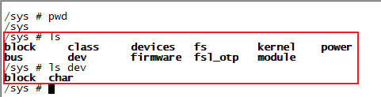

这些kobject是怎么来的？以`/sys/dev`为例，我们来看下代码：

1. 创建了`dev`这个kobject，父对象为NULL，所以直接出现在`/sys/`目录下
2. 分别创建了`block`和`char`这两个kobject，父对象为`dev`，所以他们出现在`/sys/dev/`目录下

```c
int __init devices_init(void)
{
	dev_kobj = kobject_create_and_add("dev", NULL);

	sysfs_dev_block_kobj = kobject_create_and_add("block", dev_kobj);

	sysfs_dev_char_kobj = kobject_create_and_add("char", dev_kobj);

	return 0;
}
```

现在我们知道了。kobject表示系统/sys下的一个目录，而目录又是由多个层次，所以对应kobject的树状关系如下图所示。*与设备节点`device_node`的数据结构有一点点类似，有parent指针，但没有child和sibling指针，我们不需要平行关系。*

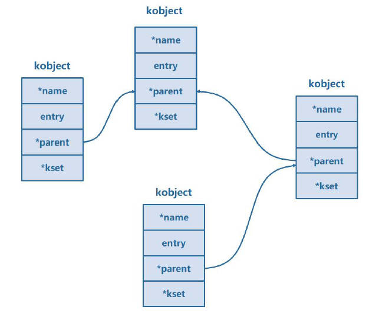

### 2.2 `kobject`函数

#### 2.2.1 `kobject_create_and_add()`函数

##### 2.2.1.1 函数功能与原型

动态分配内存、初始化kobject，并在sysfs中创建对应目录。

```c
#include <linux/kobject.h>
struct kobject *kobject_create_and_add(const char *name, struct kobject *parent);
```

+ `name`: sysfs目录名
+ `parent`: 父object指针(若为NULL, 则挂载到/sys根目录)

##### 2.2.1.2 内部实现分步解析

1. 动态内存分配: `kobject_create()`

    ```c
    struct kobject *kobj = kzalloc(sizeof(*kobj), GFP_KERNEL);
    ```

    + 通过kzalloc分配归零内存，避免未初始化字段
    + 若分配失败，返回NULL

2. 初始化object: `kobject_init()`

    ```c
    kobject_init(kobj, &dynamic_kobj_ktype);
    ```

3. 注册到sysfs: `kobject_add()`

    ```c
    retval = kobject_add(kobj, parent, "%s", name);
    ```

    1. 设置名称
    2. 设置父对象: `kobj->parent = parent`，决定sysfs路径(如父路径为`kernel_kobj`，则路径为`/sys/kernel_kobj/name`)
    3. 处理kset关系: 若`kobj->kset`非空，加入其链表(*但本函数默认不绑定`kset`*)
    4. 创建sysfs目录: `create_dir(kobj)` -> 调用`sysfs_create_dir_ns()`生成目录
        ```c
        int sysfs_create_dir_ns(struct kobject *kobj, const void *ns)
        {
            struct kernfs_node *parent, *kn;

            if (kobj->parent)
                parent = kobj->parent->sd;
            else
                parent = sysfs_root_kn;

            kn = kernfs_create_dir_ns(parent, kobject_name(kobj));
 
            return 0;
        }
        ```

##### 2.2.1.3 关键特性与行为规则

1. 默认ktype的局限性
    + 使用`dynamic_kobj_ktype`，仅支持基础内存释放，无默认属性文件(如uevent)
    + 需手动添加属性: 通过`sysfs_create_file()`或`sysfs_create_group()`扩展
2. 声明周期管理
    + 初识引用计数: kref = 1
    + 释放方式: 必须调用`kobject_put(kobj)`，触发引用计数减1，归零时执行`release()`释放内存
3. sysfs目录位置规则
    | parent参数 | sysfs路径 | 示例 |
    | - | - | - |
    | NULL | /sys根目录 | /sys/my_kobj/ |
    | 父kobject指针 | 父对象目录下 | /sys/devices/platform/my/ |
    | 绑定kset(需手动) | kset目录下 | /sys/bus/usb/devices/my/ |

##### 2.2.1.4 `kobject`初始状态图示

```
+---------------------------------------------+
|           struct kobject (kobj)             |
+---------------------------------------------+
| name:      "dynamic_kobj" (动态分配字符串)   |  🔸 由参数`name`生成
| entry:     {prev: →, next: →} (空链表节点)   |  🔸 通过`INIT_LIST_HEAD`初始化
| parent:    NULL 或指向父对象                 |  🔸 由调用参数决定
| kset:     NULL                              |  🔸 **未绑定任何kset**
| ktype:    &dynamic_kobj_ktype               |  🔸 固定类型，不可自定义
| sd:       NULL                              |  🔸 sysfs目录创建后由内核赋值
| kref:     { refcount: 1 } (原子计数)         |  🔸 初始引用计数为1
|---------------------------------------------|
| state_initialized:      1                   |  🔸 已初始化
| state_in_sysfs:         1                   |  🔸 已注册到sysfs
| state_add_uevent_sent:  0                   |  🔸 未发送ADD事件
| state_remove_uevent_sent:0                 |  🔸 未发送REMOVE事件
| uevent_suppress:        0                   |  🔸 允许发送uevent
+---------------------------------------------+
```

##### 2.2.1.5 设计意义与局限

+ 优势：简化动态kobject创建流程，无需预分配内存或自定义ktype
+ 局限：
    + 功能单一：不自动绑定kset，缺乏分组管理能力
    + 无默认属性：需手动添加sysfs文件，不适用于复杂设备模型
+ 使用场景：临时调试接口、简单内核模块的sysfs暴露

#### 2.2.2 `kobject_init_and_add()`函数

##### 2.2.2.1 函数功能与原型

对*预分配内存的kobject*进行初始化，关联其类型(kobj_type)，并注册到`sysfs`文件系统中。

```c
int kobject_init_and_add(struct kobject *kobj, 
                         struct kobj_type *ktype,
                         struct kobject *parent, 
                         const char *fmt, ...);
```

+ `kobj`: *预分配*的kobject指针(通常嵌入在自定义结构体中)
+ `ktype`: 定义对象的声明周期回调(`release`)和属性操作(`sysfs_ops`)
+ `parent`: 父对象指针，决定sysfs目录层级(若为NULL，则使用`kobj->kset`或根目录)
+ `fmt`: 格式化字符串指定sysfs目录名(如`"device%d"`)

##### 2.2.2.2 内部实现流程

1. 初始化kobject: 调用`kobject_init(kobj, ktype)`
    + 校验`kobj`和`ktype`非空
    + 初始化引用计数`kref_init(&kobj->kref)`，设置初始值1
    + 初始化链表头`INIT_LIST_HEAD(&kobj->entry)`
2. 设置名称与父对象
    + 通过`kobject_set_name_vargs()`解析`fmt`参数，生成`kobj->name`(即`sysfs`目录名)
    + 若`parent`非空，设置`kobj->parent = parent`；否则检查`kobj->kset`，将其`kobject`作为默认父节点
3. 注册到`sysfs`: 调用`kobject_add_internal()`
    + 若`kobj->kset`存在，将对象加入其链表
    + 在 sysfs 中创建目录：`sysfs_create_dir_ns()`
    + 生成默认属性文件：遍历`ktype->default_attrs`，调用`sysfs_create_file()`创建文件节点

##### 2.2.2.3 关键特性与设计意义

1. 自定义`ktype`的灵活性
    + 生命周期管理：通过`ktype->release`释放嵌入kobject的父结构(如`container_of`反向解析)
        ```c
        void my_release(struct kobject *kobj) {
            struct my_device *dev = container_of(kobj, struct my_device, kobj);
            kfree(dev);
        }
        ```
    + 属性文件支持：通过`ktype->sysfs_ops`和`default_attrs`定义读写接口
        ```c
        static struct attribute *dev_attrs[] = {
            &dev_attr_name.attr,  // 文本属性文件
            &dev_attr_value.attr,
            NULL
        };
        static struct kobj_type dev_ktype = {
            .release = my_release,
            .sysfs_ops = &dev_sysfs_ops,
            .default_attrs = dev_attrs,
        };
        ```

##### 2.2.2.4 典型应用场景

1. 自定义设备对象管理

    ```c
    struct my_device {
        int id;
        struct kobject kobj;  // 内嵌 kobject
    };

    static struct kobj_type dev_ktype = {
        .release = dev_release,
        .sysfs_ops = &dev_sysfs_ops,
        .default_attrs = dev_attrs,
    };

    int init_device(struct my_device *dev) {
        // 初始化并注册，目录名为 "deviceX"
        return kobject_init_and_add(&dev->kobj, &dev_ktype, NULL, "device%d", dev->id);
    }
    ```

2. 构建父子对象层级

    ```c
    // 父对象
    kobject_init_and_add(&parent_kobj, &ktype, NULL, "parent");
    // 子对象：指定父对象指针
    kobject_init_and_add(&child_kobj, &ktype, &parent_kobj, "child");
    ```

    sysfs结构：

    ```
    /sys/parent/
    ├── child
    │   ├── name
    │   └── value
    └── ...
    ```

##### 2.2.2.5 `kset`行为

通过`kobject_init_and_add()`创建的kobject，是否绑定`kset`取决于开发者是否手动设置其`kset`字段。

1. 默认行为：不自动绑定`kset`

    + 无默认绑定：`kobject_init_and_add`不会自动为kobject关联kset。该函数仅完成以下操作：
        + 初始化kobject：设置kerf引用计数、链表头
        + 根据`parent`参数设置父子关系(在sysfs中创建目录层次)
        + 若`kobj->kset`字段已被*手动赋值*，则将其加入对应kset的链表
    + 关键代码逻辑：在`kobject_add_internal()`函数中判断，若`kobj->kset`为空则跳过此逻辑
        ```c
        if (kobj->kset) { // 检查是否已设置kset
            if (!parent) 
                parent = kobject_get(&kobj->kset->kobj); // 若无父对象，使用kset的kobj作为父节点
            kobj_kset_join(kobj); // 将kobject加入kset的链表
        }
        ```

2. 手动绑定`kset`的方法

    开发者需要在调用`kobject_init_and_add​​()`之前，显式设置`kobject`的`kset`字段：

    ```c
    struct kobject *kobj = &my_device->kobj; // 假设kobject嵌入在自定义结构体中
    kobj->kset = my_kset; // 手动绑定到目标kset
    int ret = kobject_init_and_add(kobj, &my_ktype, NULL, "device%d", id);
    ```

3. 绑定`kset`的实际应用场景

    设备驱动注册：

    ```c
    priv->kobj.kset = bus->p->drivers_kset; // 绑定到总线的drivers_kset
    kobject_init_and_add(&priv->kobj, &driver_ktype, NULL, "%s", drv->name);
    ```

##### 2.2.1.6 `kobject`初始状态图示

```
+-------------------------------------------+
|          struct kobject (kobj)           |
+-------------------------------------------+
| name:     [由fmt生成的动态字符串]          | 🔸 如 `"device0"`，通过 `kobject_set_name_vargs()` 生成 [1,6](@ref)
| entry:    {prev: →, next: →} (空链表节点) | 🔸 `INIT_LIST_HEAD` 初始化，形成自环 [6](@ref)
| parent:   [指向传入的parent指针]           | 🔸 若参数非空则关联父对象；否则为 `NULL` [1](@ref)
| kset:     [调用前手动赋值的kset]           | 🔸 **不自动设置**，需显式赋值（未赋值则为 `NULL`）[1](@ref)
| ktype:    [传入的ktype指针]               | 🔸 **必须非空**，定义生命周期与属性操作 [2](@ref)
| sd:       NULL                            | 🔸 sysfs 目录创建后由内核赋值（`sysfs_create_dir_ns()`）[1](@ref)
| kref:     { refcount: 1 } (原子计数)      | 🔸 初始引用计数为 1（`kref_init()`）[6](@ref)
|-------------------------------------------|
| state_initialized:      1                | 🔸 标记已初始化完成 [6](@ref)
| state_in_sysfs:         1                | 🔸 标记已注册到 sysfs（目录已创建）[1](@ref)
| state_add_uevent_sent:  0                | 🔸 未发送 `KOBJ_ADD` 事件 [2](@ref)
| state_remove_uevent_sent:0               | 🔸 未发送移除事件 [2](@ref)
| uevent_suppress:        0                | 🔸 允许发送 uevent 事件 [2](@ref)
+-------------------------------------------+
```

#### 2.2.3 `kobject_put()`函数

##### 2.2.3.1 函数原型

```c
void kobject_put(struct kobject *kobj);
```

##### 2.2.3.2 核心功能与定位

1. 引用计数管理：`kobject_put()`通过原子操作减少`kobj->kref`的引用计数。计数归零时，自动调用`kobj_type->release`回调函数释放资源
2. 内存释放机制
    + 若`kobject`是动态创建的(如通过`kobject_create`函数)，默认release函数为`dynamic_kobj_release`，直接`kfree(obj)`
    + 若`kobject`嵌入在父结构中(`struct device`)，release需通过`container_of`释放父结构
    ```c
    void device_release(struct kobject *kobj) {
        struct device *dev = container_of(kobj, struct device, kobj);
        kfree(dev); // 释放包含kobject的父结构
    }
    ```
    + 最终释放(`ktype->release`)：由开发者实现的回调负责释放内存

### 2.3 `kobject创建与销毁`：代码实测

```c
#include <linux/init.h>
#include <linux/module.h>
#include <linux/slab.h>
#include <linux/kobject.h>

static struct kobject *my_kobject_01;
static struct kobject *my_kobject_02;
static struct kobject *my_kobject_03;

static struct kobj_type my_kobj_type;

static int __init my_init(void)
{
    my_kobject_01 = kobject_create_and_add("my_kobject_01", NULL);
    my_kobject_02 = kobject_create_and_add("my_kobject_02", my_kobject_01);

    my_kobject_03 = kzalloc(sizeof(*my_kobject_03), GFP_KERNEL);
    kobject_init_and_add(my_kobject_03, &my_kobj_type, NULL, "%s", "my_kobject_03");

    printk(KERN_INFO "make_kobj init\n");

    return 0;
}

static void __exit my_exit(void)
{
    kobject_put(my_kobject_01);
    kobject_put(my_kobject_02);
    kobject_put(my_kobject_03);

    printk(KERN_INFO "make_kobj exit\n");
}

module_init(my_init);
module_exit(my_exit);

MODULE_LICENSE("GPL");
MODULE_AUTHOR("ding");
```

测试结果：

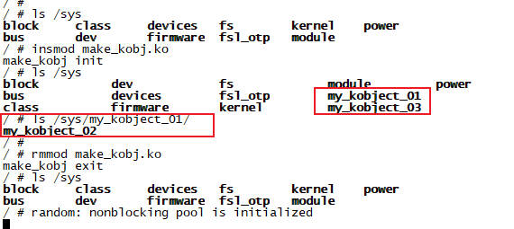

## 第3章 `kset`

### 3.1 `kset`原理

Linux设备模型中的kset(内核对象集合)，是组织和管理kobject的核心容器，用于构建设备层级结构、管理热插拔事件，并在sysfs中形成逻辑目录结构。

#### 3.1.1 `kset`结构体成员详解

```c
struct kset {
	struct list_head list;      // 管理所有关联kobject的双向链表头
	spinlock_t list_lock;       // 保护链表的自旋锁（防止并发修改）
	struct kobject kobj;        // 内嵌的kobject，代表kset本身在sysfs中的目录
	const struct kset_uevent_ops *uevent_ops;   // 热插拔事件回调函数集
};
```

`kset`结构体的核心成员：

+ `list`与`list_lock`: 所有属于该kset的kobject通过`kobject->entry`嵌入此链表，形成逻辑分组
+ `kobj`: `kset`本身也是`kobject`，因此具备名称、父对象等属性。在sysfs中表现为目录
+ `uevent_ops`: 控制热插拔时间的通知行为，包含三个回调函数：
    + `filter()`: 决定是否发送事件(如过滤特定设备)
    + `name()`: 自定义事件中对象的名称
    + `uevent()`: 添加事件的环境变量

#### 3.1.2 核心应用场景

1. 设备分类管理：将同类设备组织在同一个kset下，形成逻辑分组。
    + 所有PCI设备：`bus_set`的子集`pci_set` (路径: `/sys/bus/pci/devices/`)
    + 所有输入设备：`input_kset` (路径：`/sys/class/input/`)
2. 构建设备树层次结构
    通过`kobject->parent`和`kset->kobj`构建父子关系：
    ```
    /sys/bus/pci/                 ← kset (bus_kset)
        ├── devices/              ← kset (pci_devices_kset)
        │   ├── 0000:00:1f.2/     ← kobject (PCI设备)
        └── drivers/              ← kset (pci_drivers_kset)
            ├── ahci/            ← kobject (驱动)
    ```
3. 热插拔事件管理

#### 3.1.3 `kset`与`kobject`的交互机制

1. 添加kobject到kset: 通过`kobject_add()`实现关联。实现效果: `kobject被加入kset->list链表，并在/sys/bus/pci/devices/下创建目录`

    ```c
    struct kobject *dev_kobj;
    dev_kobj->kset = pci_devices_kset; // 指定所属kset
    kobject_add(dev_kobj, NULL, "0000:00:1f.2"); // 添加到sysfs
    ```

2. 生命周期管理：`kobject`释放时 自动从`kset`链表移除

    ```c
    void kobject_put(struct kobject *kobj) {
        if (kref_put(&kobj->kref, kobject_release)) {
            list_del(&kobj->entry); // 从kset链表中移除
            sysfs_remove_dir(kobj);
        }
    }
    ```

#### 3.1.4 内核源码实例分析

    ```c
    struct kset *pci_bus_kset;
    pci_bus_kset = kset_create_and_add("pci", NULL, &bus_kset.kobj); // 创建/sys/bus/pci/

    struct kset *pci_devs_kset;
    pci_devs_kset = kset_create_and_add("devices", NULL, &pci_bus_kset->kobj); // 创建/sys/bus/pci/devices/

    pci_devs_kset->uevent_ops = &pci_uevent_ops; // 设置热插拔回调
    ```

### 3.2 `kset`与`kobject`

在2.2.2节介绍`kobject_init_and_add()`函数时，我们说这个函数可以手动绑定`kset`。回忆下当时是怎么做的：

```c
struct kobject *kobj = &my_device->kobj; // 假设kobject嵌入在自定义结构体中
kobj->kset = my_kset; // 手动绑定到目标kset
int ret = kobject_init_and_add(kobj, &my_ktype, NULL, "device%d", id);
```

OK。我们假设`kobject`已经手动绑定了`kset`，然后调用`kobject_init_and_add()`，并且`parent = NULL`。看下接下来发生什么：

```c
static int kobject_add_internal(struct kobject *kobj)
{
	int error = 0;
	struct kobject *parent;

	parent = kobject_get(kobj->parent);

	/* join kset if set, use it as parent if we do not already have one */
	if (kobj->kset) {
		if (!parent)
			parent = kobject_get(&kobj->kset->kobj);
		kobj_kset_join(kobj);
		kobj->parent = parent;
	}
}

static inline void list_add_tail(struct list_head *new, struct list_head *head)
{
	__list_add(new, head->prev, head);
}

static void kobj_kset_join(struct kobject *kobj)
{
	if (!kobj->kset)
		return;

	kset_get(kobj->kset);
	spin_lock(&kobj->kset->list_lock);
	list_add_tail(&kobj->entry/* node */, &kobj->kset->list/* list */);
	spin_unlock(&kobj->kset->list_lock);
}
```

从上面的代码中可以看到2个重点：

1. 当手动指定了`kset`时，会把当前`kobject`的`entry`作为节点，插入到`kset->list`的链表尾部
2. 如果`parent = NULL`，会把`kobject`的`parent`父指针，指向`kset->kobj`内嵌的结构

#### 3.2.1 空`kset`初始状态

```
+---------------------------+
|        struct kset        |
|---------------------------|
| list:      ┌─────────────┐ |  
|           →│ 空链表头     │←─────── list.prev/list.next均指向自身
|            └─────────────┘ |  
|---------------------------|
| list_lock: 已初始化的自旋锁  |  ← 未上锁状态
|---------------------------|
| kobj:      ┌─────────────┐ |
|            │ name: "xxx" │←── 创建时指定的名称（如"devices"）
|            │ parent: ptr │←── 指向父kobject（参数指定）或NULL
|            │ kset: NULL  │    ← 内嵌kobject不属于其他集合
|            │ ktype:      │←── 固定为&kset_ktype（含默认release回调）
|            └─────────────┘ |
|---------------------------|
| uevent_ops: 回调函数集      |  ← 由创建参数传入
+---------------------------+
```

关键成员值：

+ `list`: 双向循环链表，`prev`和`next`都指向自身
+ `kobj.kset`: 固定为NULL，表示内嵌kobject独立存在
+ `kobj.parent`: 由`kset_create_and_add()`的父对象参数决定

#### 3.2.2 添加一个`kobject`后的状态

```
+---------------------------+        +-----------------------+
|        struct kset        |        |   struct kobject      |
|---------------------------|        |-----------------------|
| list:      ┌─────────────┐ | ┌───→│ entry.next → list     │
|           →│ 链表头       │─┘ │    │ entry.prev → list     │
|            └─────────────┘   │    | parent: &kset->kobj    |
|---------------------------|  └───┐| kset: 指向当前kset     |
| kobj:      ┌─────────────┐ |      +-----------------------+
|            │ name: "xxx" │←┘
|            │ parent: ...│          
|            │ kset: NULL │          
|            └─────────────┘          
+---------------------------+
```

关键变化：

+ `链表链接`: `kobject`通过`entry`嵌入`kset->list`，形成`链表头 ⇄ kobject`的双向链表
+ `父子关系`:
    + `kobject->parent`: 指向kset的内嵌`kobject`
    + `kobject->set`: 指向当前`kset`，标识归属关系

#### 3.2.3 添加二个`kobject`后的状态

```
+---------------------------+        +-----------------------+      +-----------------------+
|        struct kset        |        |   kobject A           |      |   kobject B           |
|---------------------------|        |-----------------------|      |-----------------------|
| list:      ┌─────────────┐ | ┌───→│ entry.next → B.entry  │┌───→│ entry.next → list     │
|           →│ 链表头       │─┘ │    │ entry.prev → list     ││    │ entry.prev → A.entry  │
|            └─────────────┘   │    | parent: &kset->kobj    ││    | parent: &kset->kobj    |
|---------------------------|   └───┐| kset: 当前kset        │└───┐| kset: 当前kset        |
| kobj: (同上)              |        +-----------------------+      +-----------------------+
+---------------------------+
```

关键变化：

+ `链表扩展`: 新增`kobject`插入链表尾部，形成循环链表(`链表头 ⇄ kobject A ⇄ kobject B ⇄ 链表头`)
+ `统一父对象`: 所有`kobject`的`parent`均指向同一个`kset->kobj`，在sysfs中表现为同级目录(如`/sys/bus/pci/devices/`下的设备)

#### 3.2.4 添加三个`kobject`后的状态

```
+---------------------------+        +-----------------------+      +-----------------------+      +-----------------------+
|        struct kset        |        |   kobject A           |      |   kobject B           |      |   kobject C           |
|---------------------------|        |-----------------------|      |-----------------------|      |-----------------------|
| list:      ┌─────────────┐ | ┌───→│ entry.next → B.entry  │┌───→│ entry.next → C.entry  │┌───→│ entry.next → list     │
|           →│ 链表头       │─┘ │    │ entry.prev → list     ││    │ entry.prev → A.entry  ││    │ entry.prev → B.entry  │
|            └─────────────┘   │    | parent: &kset->kobj    ││    | parent: &kset->kobj    ││    | parent: &kset->kobj    |
|---------------------------|   └───┐| kset: 当前kset        │└───┐| kset: 当前kset        │└───┐| kset: 当前kset        |
| kobj: (同上)              |        +-----------------------+      +-----------------------+      +-----------------------+
+---------------------------+
```

关键变化：

+ `完整循环链表`: 链表结构变为`链表头 ⇄ A ⇄ B ⇄ C ⇄ 链表头`
+ `并发保护`: `list_lock`自旋锁确保多核环境下链表操作的原子性(如并发添加/删除)

### 3.3 `kset_create_and_add()`函数：创建`kset`

```c
struct kset *kset_create_and_add(
    const char *name,                           // [IN] kset在sysfs中的目录名
    const struct kset_uevent_ops *uevent_ops,   // [IN] uevent事件回调函数集
    struct kobject *parent_kobj                 // [IN] 父kobject指针（决定sysfs层级）
);
```

1. `name`: 指定`kset`在sysfs中对应的目录名称，如`"devices"、"block"`
    + 赋值逻辑：通过`kobject_set_name(&kset->jobj, name)`设置内嵌`kobject`的`name`字段
2. `uevent_ops`: 暂时忽略
3. `parent_kobj`: 指定`kset`在`sysfs`中的父目录。若为NULL，则创建在`/sys`根目录下
    + `parent_kobj = kernel_kobj`: 目录位于`/sys/kernel/`
    + `parent_kobj = NULL`： 目录位于`/sys/`

### 3.4 代码实测

```c
#include <linux/init.h>
#include <linux/module.h>
#include <linux/slab.h>
#include <linux/kobject.h>

static struct kset *my_kset;

static struct kobject *my_kobj_01;
static struct kobject *my_kobj_02;

static struct kobj_type my_ktype;

static int __init my_init(void)
{
    my_kset = kset_create_and_add("my_kset", NULL, NULL);

    my_kobj_01 = kzalloc(sizeof(struct kobject), GFP_KERNEL);
    my_kobj_02 = kzalloc(sizeof(struct kobject), GFP_KERNEL);

    my_kobj_01->kset = my_kset;
    my_kobj_02->kset = my_kset;

    kobject_init_and_add(my_kobj_01, &my_ktype, NULL, "%s", "my_kobj_01");
    kobject_init_and_add(my_kobj_02, &my_ktype, NULL, "%s", "my_kobj_02");

    printk(KERN_INFO "make_kset init\n");

    return 0;
}

static void __exit my_exit(void)
{
    kobject_put(my_kobj_01);
    kobject_put(my_kobj_02);

    printk(KERN_INFO "make_kset exit\n");
}

module_init(my_init);
module_exit(my_exit);

MODULE_LICENSE("GPL");
MODULE_AUTHOR("ding");
```

测试结果：

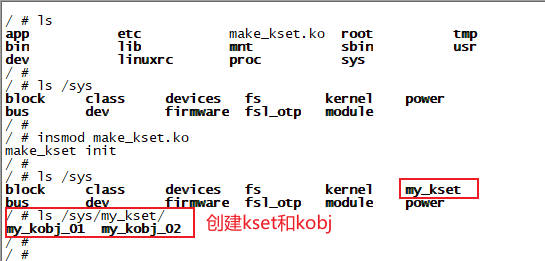

## 第4章 为什么要引入设备模型

Linux设备模型，是内核用于统一管理硬件设备的框架，其核心包含：总线(Bus)、设备(Device)、驱动(Driver)和类(Class)四个部分。他们共同构建了设备之间的层次关系，支持热插拔、电源管理、sysfs用户交互等功能。

### 4.1 四个核心组件

| 组件 | 定义与作用 | 内核数据结构 | 在sysfs中的位置 |
| - | - | - | - |
| 总线(Bus) | 设备与CPU之间的通信通道(物理或虚拟)，负责管理挂载其上的设备和驱动，并实现二者的匹配。例如PC、USB、I2C总线，以及虚拟的platform总线 | `struct bus_type` | `/sys/bus/` 如(`/sys/bus/pci`) |
| 设备(Device) | 硬件设备的抽象描述(物理或逻辑设备)，包含设备属性、资源(内存地址、IRQ)，所属总线及驱动信息 | `struct device` | `/sys/devices/(按总线层次组织)` |
| 驱动(Driver) | 控制设备的软件模块，实现设备的初始化(probe)、销毁(remove)、电源管理等操作。与设备通过总线匹配后绑定 | `struct device_driver` | `/sys/bus/(总线名)/drivers` 如`/sys/bus/i2c/drivers/tmp102/` |
| 类(Class) | 按功能分配设备的抽象层(如输入设备、显示设备)，提供跨总线的统一接口，简化用户空间操作 | `struct class` | `/sys/class` 如`/sys/class/input/` |

层次结构：总线(`/sys/bus/`)是根节点，设备和驱动挂载在总线下。

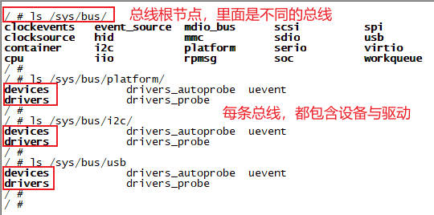

1. 注册与匹配
    + 总线注册(`bus_register`)后，设备和驱动分别通过`device_register`、`driver_register`挂载到总线
    + 总线的`match()`函数比较设备ID(如设备的`compatible`值)与驱动支持的ID表，匹配成功则调用驱动的`probe()`
2. 用户空间交互
    + 通过sysfs暴露设备属性(如`/sys/class/net/eth0/speed`)，用户可直接读写配置
3. 热插拔与电源管理
    + 设备插入时，总线触发`uevent`生成`ACTION=add`事件，通知用户空间(如udev加载驱动)
    + 电源管理时，总线按依赖顺序开关设备(如先启总线再启设备)

### 4.2 总线结构体`struct bus_type`

```c
struct bus_type {
	const char		*name;
	const char		*dev_name;
	struct device		*dev_root;
	struct device_attribute	*dev_attrs;	/* use dev_groups instead */
	const struct attribute_group **bus_groups;
	const struct attribute_group **dev_groups;
	const struct attribute_group **drv_groups;

	int (*match)(struct device *dev, struct device_driver *drv);
	int (*uevent)(struct device *dev, struct kobj_uevent_env *env);
	int (*probe)(struct device *dev);
	int (*remove)(struct device *dev);
	void (*shutdown)(struct device *dev);

	int (*suspend)(struct device *dev, pm_message_t state);
	int (*resume)(struct device *dev);
};
```

结构体成员详解：

+ `name`: 总线名称(如`i2c`、`platform`)，对应`/sys/bus/`下的目录名。命名需唯一且不含特殊字符
+ `dev_name`: 设备命名模板(如`i2c-%d`)，用于自动生成未命名设备的名称(如`I2C适配器编号`)
+ `dev_root`: 默认父设备指针，作为新注册设备的父对象(如`platform_bus`作为所有`platform_device`的父设备)
+ `dev_attrs/bus_groups/dev_groups/drv_groups`: 定义总线和设备的默认`sysfs`属性
+ `match`: 设备与驱动匹配的核心逻辑。当设备或驱动注册时调用，返回非0标识匹配成功
    典型实现：
    ```c
    // Platform 总线匹配（drivers/base/platform.c）
    static int platform_match(struct device *dev, struct device_driver *drv) {
        // 检查设备树 compatible 或 ACPI ID
        return of_driver_match_device(dev, drv);
    }
    ```
+ `uevent`: 生成热插拔事件的环境变量(如设备插入时添加`ACTION=add`)，如usb设备插入时触发udev加载驱动
+ `probe`: 设备匹配后初始化，调用驱动的probe函数
+ `remove/shutdown`: 设备移除或关机时的清理操作，如释放资源、断电
+ `suspend/resume`" 设备休眠唤醒时协调电源状态

### 4.3 设备结构体`struct device`

```c
struct device {
	struct device		*parent;
	struct kobject kobj;
	const char		*init_name; /* initial name of the device */
	const struct device_type *type;
	struct bus_type	*bus;		/* type of bus device is on */
	struct device_driver *driver;	/* which driver has allocated this
					   device */
	void		*platform_data;	/* Platform specific data, device
					   core doesn't touch it */
	struct device_node	*of_node; /* associated device tree node */
	dev_t			devt;	/* dev_t, creates the sysfs "dev" */
	struct class		*class;
};
```

+ `struct device *parent`: 指向父设备(如总线控制器)。设备树中层级关系通过parent构建，例如：
    ```dts
    &i2c1 { // 父设备（I²C 控制器）
        sensor@48 { // 子设备
            compatible = "ti,tmp102";
        };
    };
    ```
    内核中，sensor@48的parent指向i2c1的设备实例
+ `struct kobject kobj`: 在`/sys`生成设备文件。如`/sys/devices/platform/my-device`，用于暴露设备属性
+ `const char *init_name`: 设备初始名称(如`tmp102`)。若未指定，内核自动生成`"bus_id"`
+ `struct bus_type *bus`: 设备所属总线(如`&i2c_bus_type`)。总线定义设备和驱动的匹配规则
+ `struct device_driver *driver`: 绑定后的驱动指针。当总线`match()`成功(如设备树`compatible`匹配驱动的`of_match_table`)，内核调用驱动的`probe()`
+ `void *platform_data`: 板级私有数据(如GPIO配置)。嵌入式开发中常用，避免硬编码
    ```c
    // 板级文件
    static struct tmp102_platform_data my_board_data = {
        .gpio_int = 47,
    };
    platform_device_register_data(dev, &my_board_data);
    ```
+ `struct device_node *of_node`: 指向设备树节点，驱动通过`of_`函数解析资源
    ```c
    // 驱动中解析设备树
    ret = of_property_read_u32(dev->of_node, "reg", &reg_addr); // 获取寄存器地址
    irq = irq_of_parse_and_map(dev->of_node, 0); // 解析中断号
    ```
+ `struct list_head	devres_head`: 设备资源链表(内存、IO)，通过`devm_API`自动管理
    ```c
    res = devm_ioremap_resource(dev, regs); // 自动释放的寄存器映射
    ```
+ `struct class *class`: 设备分类(如`&input_class`)。所有键盘归入`/sys/class/input/`，统一生成uevent事件
+ `dev_t devt`: 设备号(主/次设备号)，用于创建设备文件`/dev/tmp102`
    ```c
    devt = MKDEV(MAJOR_NUM, MINOR_NUM);
    device_create(class, dev, devt, NULL, "tmp102");
    ```

### 4.4 驱动结构体`struct device_driver`

```c
struct device_driver {
	const char		*name;
	struct bus_type		*bus;
	struct module		*owner;
	const struct of_device_id	*of_match_table;

	int (*probe) (struct device *dev);
	int (*remove) (struct device *dev);
	void (*shutdown) (struct device *dev);
	int (*suspend) (struct device *dev, pm_message_t state);
	int (*resume) (struct device *dev);
	const struct attribute_group **groups;
};
```

+ `const char *name`: 驱动名称(如`i2c-tmp102`)，在sysfs中生成`/sys/bus/<所属总线>/drivers/<name>`目录。命名需唯一，用于匹配或调试
+ `struct bus_type *bus`: 指向驱动所属的总线(如`&i2c_bus_type`)。总线负责管理设备与驱动的匹配规则
+ `struct module *owner`: 指向驱动所属的内核模块(如`THIS_MODELE`)，用于模块引用计数管理
+ `const struct of_device_id *of_match_table`: 设备树匹配表
+ `probe/remove/shutdown/suspend/resume`: 驱动的回调函数指针
+ `const struct attribute_group **groups`: 驱动默认属性组，在sysfs中自动生成文件。例如驱动暴露版本

看到这里我们应该思考一个问题。`platform_driver`与`device_driver`有什么关联？

看下`platform_driver`的结构体，和注册函数。做了以下内容：

1. 把驱动所属的总线，设为`platform_bus`
2. 把`platform_driver`的几个函数指针，设置给`device_driver`

```c
struct platform_driver {
	int (*probe)(struct platform_device *);
	int (*remove)(struct platform_device *);
	void (*shutdown)(struct platform_device *);
	int (*suspend)(struct platform_device *, pm_message_t state);
	int (*resume)(struct platform_device *);
	struct device_driver driver;
	const struct platform_device_id *id_table;
	bool prevent_deferred_probe;
};

int __platform_driver_register(struct platform_driver *drv,
				struct module *owner)
{
	drv->driver.owner = owner;
	drv->driver.bus = &platform_bus_type;
	if (drv->probe)
		drv->driver.probe = platform_drv_probe;
	if (drv->remove)
		drv->driver.remove = platform_drv_remove;
	if (drv->shutdown)
		drv->driver.shutdown = platform_drv_shutdown;

	return driver_register(&drv->driver);
}
```

### 4.5 类结构体`struct class`

```c
struct class {
	const char		*name;
	struct module		*owner;

	struct class_attribute		*class_attrs;
	const struct attribute_group	**dev_groups;
	struct kobject			*dev_kobj;

	int (*dev_uevent)(struct device *dev, struct kobj_uevent_env *env);
	char *(*devnode)(struct device *dev, umode_t *mode);

	void (*class_release)(struct class *class);
	void (*dev_release)(struct device *dev);

	int (*suspend)(struct device *dev, pm_message_t state);
	int (*resume)(struct device *dev);
};
```

+ `const char *name`: 类名称(如`leds`、`input`)，对应`/sys/class/`下的目录名。命名需唯一，用于用户空间分类访问设备
+ `struct module *owner`: 指向拥有该类的内核模块(如`THIS_MODULE`)，用于模块引用计数管理
+ `class_attrs/dev_groups`: 属性文件
+ `char *(*devnode)(struct device *dev, umode_t *mode)`: 自定义设备节点路径(如`/dev/input/event0`)。默认在`/dev/`创建设备，可通过此回调修改路径或权限

### 4.6 `/sys`目录实例分析

我们进入到Linux系统的`/sys`目录下，可以看到如下文件夹。其中和设备模型有关的文件夹为：

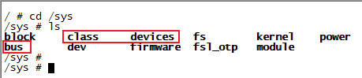

+ `/sys/devices`: 该目录包含了系统中所有设备的子目录。每个设备子目录代表一个具体的设备，通过其路径层次结构和符号链接，反应设备的关系和拓扑结构

    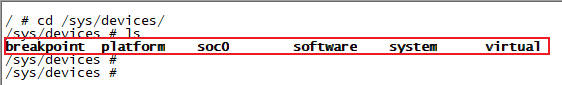

+ `/sys/bus`: 该目录包含了总线类型的子目录。每个子目录代表一个特定类型的总线，例如`i2c`、`spi`、`platform`。每个总线子目录中，包含与该总线相关的设备和驱动程序的信息

    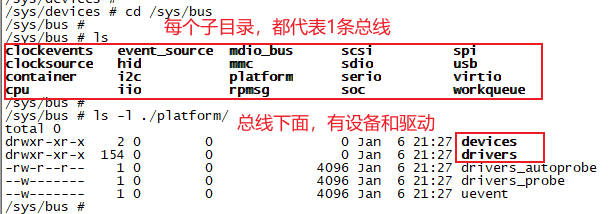

+ `/sys/class`: 该目录包含了设备类别的子目录。每个子目录代表一个设备类别，例如磁盘、网络接口等。每个设备类别子目录中，包含了属于该类别的设备的信息

    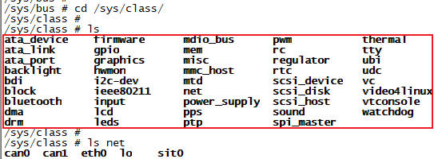

### 4.7 设备模型4部分的连接方式

在Linux的sysfs文件系统中，`/sys/class`、`/sys/devices`和`/sys/bus`之间的关联，主要通过符号链接建立。这种设计实现了设备模型的多视角组织：物理拓扑(`/sys/devices`)、功能分类(`/sys/class`)、总线类型(`/sys/bus`)

#### 4.7.1 核心目录的作用与关联方式

以`ethernet`有线网为例说明。我们先看下设备树：有线网设备位于`/soc/aips2(aips-bus@02100000)/fec1(ethernet@02188000)/`这条总线下。

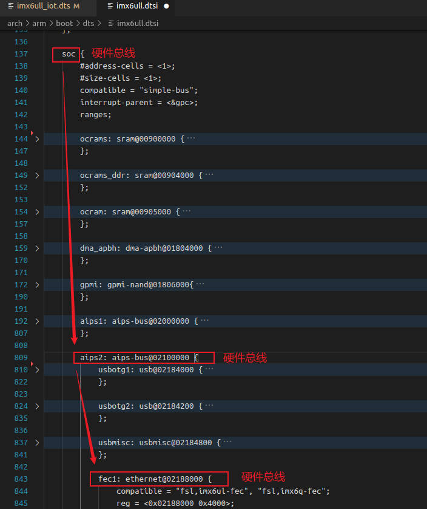

1. `/sys/devices`: 物理设备的真实存储位置。这是Linux设备模型的核心目录，按硬件连接的物理层级(如总线、父设备)组织起所有设备。例如：
    + 网卡设备路径：`/sys/devices/platform/soc/2100000.aips-bus/2188000.ethernet`
    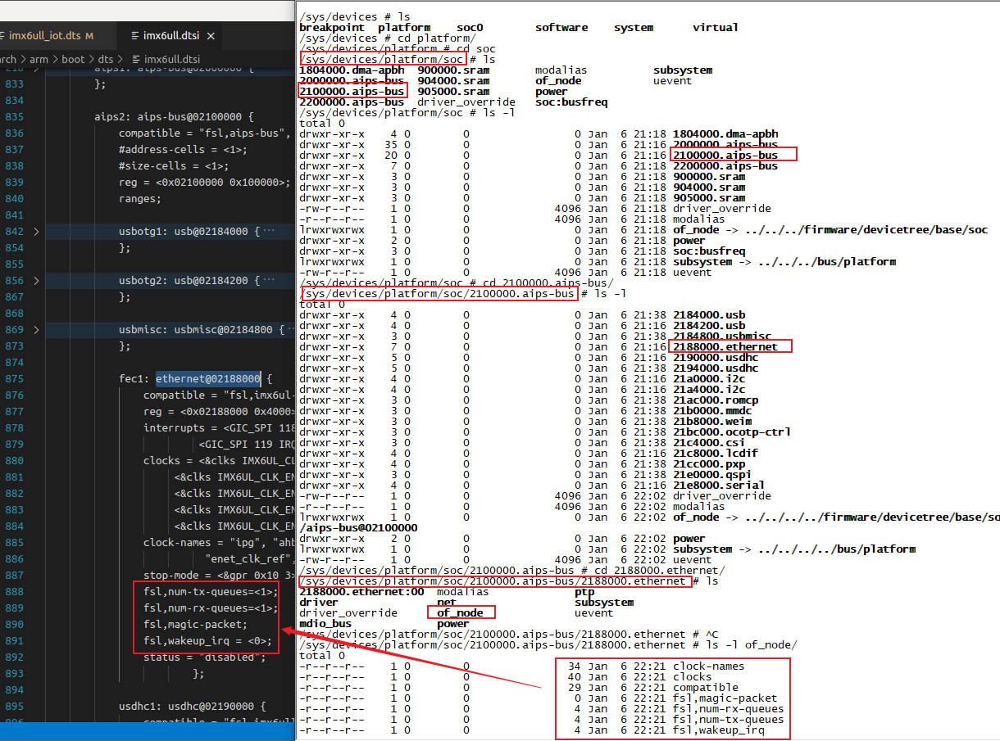
2. `/sys/class`: 按功能分类的符号链接视图
    + 作用：将设备按功能(如输入设备、网络设备)分类，不关心物理连接方式
    + 符号链接：每个设备子目录(如`/sys/class/leds/led1`)中的`device`文件，是指向`/sys/devices`中真实设备的符号链接
    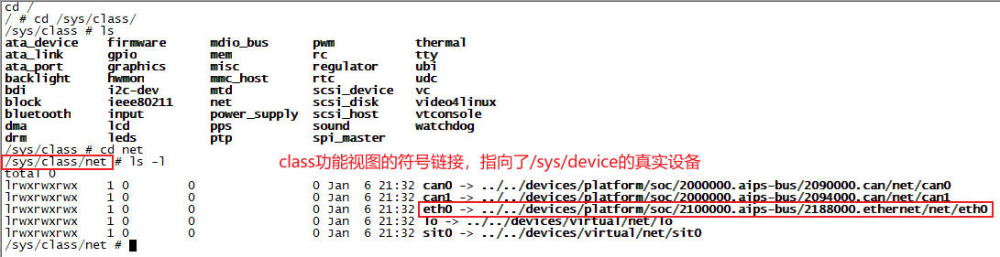
3. `/sys/bus`: 按总线类型组织的符号链接试图
    + 作用：按总线类型(如PCI、USB、I2C)组织设备和驱动
    + 符号链接：`/sys/bus/<总线名>/devices`子目录中的条目，是指向`/sys/devices`的符号链接
    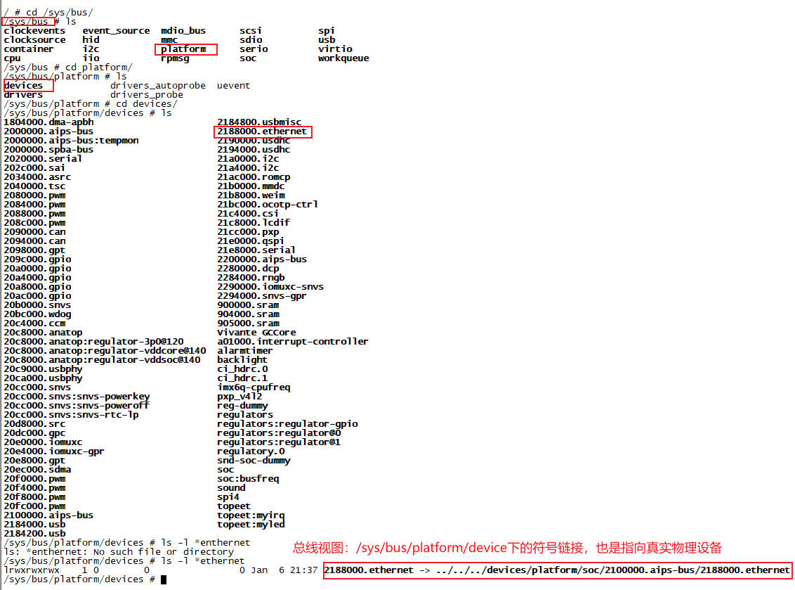

#### 4.7.2 关联关系图示

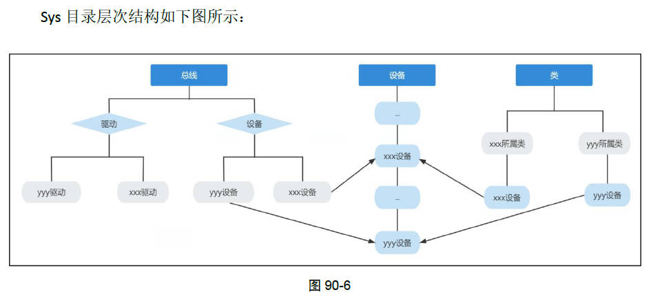

#### 4.7.3 关键点总结

1. 符号链接是核心纽带：`/sys/class`和`/sys/bus/devices`中的条目，均通过符号链接指向`/sys/devices`中的真实设备目录
2. 设计目的：
    + `/sys/devices`: 描述硬件物理层级(如设备依赖关系)
    + `/sys/class`: 提供功能抽象(如统一控制所有LED)
    + `/sys/bus`: 管理总线相关的匹配与驱动绑定
3. 用户空间操作示例：
    + 通过`/sys/class/leds/led1/brightness`控制LED(功能视图)
    + 通过`/sys/bus/pci/drivers/nvidia/bind`手动绑定设备(总线视图)

## 第5章 `kref`引用计数器

### 5.1 什么是引用计数

引用计数是一种内存管理技术，用于跟踪对象或资源的应用数量。它通过在对线被引用时增加计数值，并在引用被减少时释放计数值，以确定何时可以安全的释放对象或资源。

### 5.2 `kref引用计数器`

`kref`是Linux内核中提供的一种引用计数器实现，它是一种轻量级的引用计数技术，用于管理内核中的对象的引用计数。

```c
struct kref {
	atomic_t refcount;
};
```

在使用引用计数器时，通常会将结构体`kref`嵌入到其他结构体中，例如`struct kobject`，以实现引用计数的管理。

```c
struct kobject {
	const char		*name;
	struct list_head	entry;
	struct kobject		*parent;
	struct kset		*kset;
	struct kobj_type	*ktype;
	struct kernfs_node	*sd;
	struct kref		kref;   // 内嵌kref引用计数器
};
```

### 5.3 `kref`常用API函数

#### 5.3.1 `kref_init()`函数：初始化引用计数为1

```c
static inline void kref_init(struct kref *kref)
{
	atomic_set(&kref->refcount, 1);
}
```

#### 5.3.2 `kref_get()`函数：引用计数+1

```c
static inline void kref_get(struct kref *kref)
{
	WARN_ON_ONCE(atomic_inc_return(&kref->refcount) < 2);
}
```

#### 5.3.3 `kref_put()`函数：引用计数-1

```c
static inline int kref_put(struct kref *kref,
	     void (*release)(struct kref *kref))
{
	if (atomic_sub_and_test((int) 1, &kref->refcount)) {
		release(kref);
		return 1;
	}
	return 0;
}
```

### 5.4 引用计数的典型使用场景

#### 5.4.1 多线程数据数据传递

当对象需跨线程传递时，需在传递前增加引用计数，接收方使用后减少引用计数

```c
void worker_thread(void *data) {
    struct my_data *d = data;
    // 操作数据
    kref_put(&d->refcount, data_release);  // 使用完毕释放引用
}

void create_thread() {
    struct my_data *data = kmalloc(..., GFP_KERNEL);
    kref_init(&data->refcount);
    kref_get(&data->refcount);  // 传递前增加引用
    kthread_run(worker_thread, data, "worker");  // 传递指针
    // ... 主线程操作
    kref_put(&data->refcount, data_release);  // 主线程释放引用
}
```

#### 5.4.2 设备驱动资源管理

设备驱动中，`kref`用于跟踪设备的打开次数。*每次open()时初始化计数，每次close()时减少计数，确保无人使用时释放硬件资源。*

```c
struct device_ctx {
    struct kref ref;
    void *hw_reg;
};

static void release_dev(struct kref *kref) {
    struct device_ctx *dev = container_of(kref, struct device_ctx, ref);
    iounmap(dev->hw_reg);  // 解除内存映射
    kfree(dev);
}

int device_open() {
    struct device_ctx *dev = kmalloc(..., GFP_KERNEL);
    kref_init(&dev->ref);
    dev->hw_reg = ioremap(...);
    return 0;
}

void device_close(struct device_ctx *dev) {
    kref_put(&dev->ref, release_dev);  // 关闭时减少引用
}
```

### 5.5 使用规则与陷阱

#### 5.5.1 三条核心规则

1. 传递持久指针前必增计数：若对象指针需长期保存或跨线程传递，必须先调用`kref_get()`
2. 使用完毕后必减计数：通过`kref_put()`释放引用，归零时自动清理
3. 未持有是获取引用需加锁：若代码未持有对象指针却需获取引用(如从链表获取)，必须用锁同步`kref_get`和`kref_put`

#### 5.5.2 常见陷阱

1. 计数不匹配：`init/get`和`put`要成对出现 -> 内存泄露或提前释放
2. 错误释放函数：`release`中未正确使用`container_of` -> 内存损坏
3. 并发漏洞：未加锁保护共享对象的引用操作 -> 竞态条件

### 5.6 运行测试

测试代码：

```c
#include <linux/init.h>
#include <linux/module.h>
#include <linux/slab.h>
#include <linux/kobject.h>

static struct kobject *my_kobject_01;
static struct kobject *my_kobject_02;
static struct kobject *my_kobject_03;

static struct kobj_type my_kobj_type;

static int __init my_init(void)
{
    my_kobject_01 = kobject_create_and_add("my_kobject_01", NULL);
    printk(KERN_INFO "my_kobject_01 kref:%d\n", my_kobject_01->kref.refcount.counter);

    my_kobject_02 = kobject_create_and_add("my_kobject_02", my_kobject_01);
    printk(KERN_INFO "my_kobject_01 kref:%d\n", my_kobject_01->kref.refcount.counter);
    printk(KERN_INFO "my_kobject_02 kref:%d\n", my_kobject_02->kref.refcount.counter);

    my_kobject_03 = kzalloc(sizeof(*my_kobject_03), GFP_KERNEL);
    kobject_init_and_add(my_kobject_03, &my_kobj_type, NULL, "%s", "my_kobject_03");
    printk(KERN_INFO "my_kobject_03 kref:%d\n", my_kobject_03->kref.refcount.counter);

    return 0;
}

static void __exit my_exit(void)
{
    printk(KERN_INFO "my_kobject_01 kref:%d\n", my_kobject_01->kref.refcount.counter);
    printk(KERN_INFO "my_kobject_02 kref:%d\n", my_kobject_02->kref.refcount.counter);
    printk(KERN_INFO "my_kobject_03 kref:%d\n", my_kobject_03->kref.refcount.counter);

    kobject_put(my_kobject_01);
    printk(KERN_INFO "my_kobject_01 kref:%d\n", my_kobject_01->kref.refcount.counter);
    printk(KERN_INFO "my_kobject_02 kref:%d\n", my_kobject_02->kref.refcount.counter);
    printk(KERN_INFO "my_kobject_03 kref:%d\n", my_kobject_03->kref.refcount.counter);

    kobject_put(my_kobject_02);
    printk(KERN_INFO "my_kobject_01 kref:%d\n", my_kobject_01->kref.refcount.counter);
    printk(KERN_INFO "my_kobject_02 kref:%d\n", my_kobject_02->kref.refcount.counter);
    printk(KERN_INFO "my_kobject_03 kref:%d\n", my_kobject_03->kref.refcount.counter);

    kobject_put(my_kobject_03);
    printk(KERN_INFO "my_kobject_01 kref:%d\n", my_kobject_01->kref.refcount.counter);
    printk(KERN_INFO "my_kobject_02 kref:%d\n", my_kobject_02->kref.refcount.counter);
    printk(KERN_INFO "my_kobject_03 kref:%d\n", my_kobject_03->kref.refcount.counter);
}

module_init(my_init);
module_exit(my_exit);

MODULE_LICENSE("GPL");
MODULE_AUTHOR("ding");
```

测试结果：

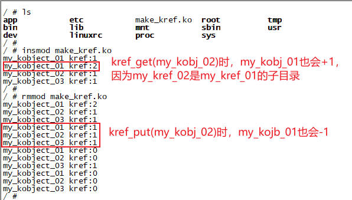

## 第6章 `kobject`释放实例分析

通过上个章节的实验，我们已经知道引用计数器是如何工作的。当引用计数器的值为0时，会自动调用自定义的释放函数去执行释放的操作。

### 6.1 创建`kobject`：增加引用计数

我们分析`kobject_create_and_add()`函数，看下引用计数是怎么设置的：

1. `kobject_create_and_add -> kobject_create -> kobject_init -> kobject_init_internal -> kref_init(&kobj->kref)`: 把`kobject`对象的`kref`初始化为1
2. `kobject_create_and_add -> kobject_add -> kobject_add_varg -> kobject_add_internal -> kobject_get(kobj->parent)`: 把`kobject`的`parent`对象的`kref`加1

```c
struct kobject *kobject_create_and_add(const char *name, struct kobject *parent)
{
	struct kobject *kobj;
	int retval;

	kobj = kobject_create();
	retval = kobject_add(kobj, parent, "%s", name);

	return kobj;
}

struct kobject *kobject_create(void)
{
	struct kobject *kobj;

	kobj = kzalloc(sizeof(*kobj), GFP_KERNEL);
	kobject_init(kobj, &dynamic_kobj_ktype);

	return kobj;
}

void kobject_init(struct kobject *kobj, struct kobj_type *ktype)
{
	kobject_init_internal(kobj);
	kobj->ktype = ktype;
	return;
}

static void kobject_init_internal(struct kobject *kobj)
{
	kref_init(&kobj->kref);
}

int kobject_add(struct kobject *kobj, struct kobject *parent,
		const char *fmt, ...)
{
	retval = kobject_add_varg(kobj, parent, fmt, args);
	return retval;
}

static int kobject_add_varg(struct kobject *kobj, struct kobject *parent,
			    const char *fmt, va_list vargs)
{
	kobj->parent = parent;
	return kobject_add_internal(kobj);
}

static int kobject_add_internal(struct kobject *kobj)
{
	struct kobject *parent;
	parent = kobject_get(kobj->parent);
}
```

动态创建`kobject`对象的函数：`kobject_create()`。使用的`kobj_type`为`dynamic_kobj_ktype`，最终会用它来释放内存。

```c
static void dynamic_kobj_release(struct kobject *kobj)
{
	kfree(kobj);
}

static struct kobj_type dynamic_kobj_ktype = {
	.release	= dynamic_kobj_release,
};

struct kobject *kobject_create(void)
{
	struct kobject *kobj;

	kobj = kzalloc(sizeof(*kobj), GFP_KERNEL);
	kobject_init(kobj, &dynamic_kobj_ktype);

	return kobj;
}
```

### 6.2 释放`kobject`：减少引用计数，释放内存

我们调用`kobject_put()`函数来释放`kobject`内存。下面来分析源码，看看是怎么做到的：

`kobject_put -> kref_put -> kobject_release -> kobj->release(dynamic_kobj_release) -> kfree(kobj)`：最终调用`kfree(kobj)`释放内存

```c
void kobject_put(struct kobject *kobj)
{
	if (kobj) {
		kref_put(&kobj->kref, kobject_release); // 减少引用计数
	}
}

int kref_put(struct kref *kref, void (*kobject_release)(struct kref *kref))
{
	if (atomic_sub_and_test((int) 1, &kref->refcount)) {
		kobject_release(kref);  // 引用计数减到0时，调用释放内存函数
		return 1;
	}
	return 0;
}

static void kobject_release(struct kref *kref)
{
	struct kobject *kobj = container_of(kref, struct kobject, kref);
	kobj->release(kobj);    // 调用 dynamic_kobj_release 函数
}

static void dynamic_kobj_release(struct kobject *kobj)
{
	kfree(kobj);    // 调用kfree函数
}
```

### 6.3 总结

+ `kobject_create()`创建`kobj`：调用`kzalloc`申请内存给`kobj`
    ```c
    struct kobject *kobject_create(void)
    {
        struct kobject *kobj;

        kobj = kzalloc(sizeof(*kobj), GFP_KERNEL);
        kobject_init(kobj, &dynamic_kobj_ktype);

        return kobj;
    }
    ```

+ `kobject_put()`释放`kobj`：调用`kfree`释放`kobj`的内存
    ```c
    void kobject_put(struct kobject *kobj)
    {
        // kobj->release(kobj)  ->   dynamic_kobj_release(kobj)
        kfree(kobj);
    }
    ```

### 6.4 代码实测

```c
#include <linux/init.h>
#include <linux/module.h>
#include <linux/slab.h>
#include <linux/kobject.h>

static void my_release(struct kobject *kobj);

static struct kobject *my_kobject;

static struct kobj_type my_kobj_type = {
    .release = my_release
};

static void my_release(struct kobject *kobj)
{
    printk(KERN_INFO "release kobj:%p\n", kobj);
    kfree(kobj);
}

static int __init my_init(void)
{
    my_kobject = kzalloc(sizeof(*my_kobject), GFP_KERNEL);
    kobject_init_and_add(my_kobject, &my_kobj_type, NULL, "%s", "my_kobject");

    printk(KERN_INFO "make_kobj init\n");

    return 0;
}

static void __exit my_exit(void)
{
    kobject_put(my_kobject);
    printk(KERN_INFO "make_kobj exit\n");
}

module_init(my_init);
module_exit(my_exit);

MODULE_LICENSE("GPL");
MODULE_AUTHOR("ding");
```

测试结果：

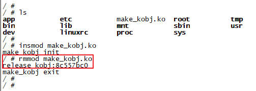

## 第7章 `container_of`宏定义

`container_of`是Linux内核中，通过结构体成员地址，反向获取整个结构体起始地址的核心宏，在链表、设备驱动等场景广泛应用。

### 7.1 参数详解

```c
#define container_of(ptr, type, member)
```

+ `ptr`: 成员指针. 指向结构体*成员变量*的地址
+ `type`: 结构体类型. 包含该成员的*结构体类型名*
+ `member`: 成员名称. 成员在结构体中的*字段名*
+ `返回值`: 指向结构体首地址的*结构体类型指针*

### 7.2 典型用法

#### 7.2.1 内核链表遍历(最常见场景)

作用：通过链表结点指针pos，反向定位包含它的sensor结构体

```c
struct list_head {
    struct list_head *next, *prev;
};

struct sensor {
    int id;
    struct list_head list;  // 嵌入链表节点
};

// 遍历链表获取 sensor 结构体
struct list_head *pos;
list_for_each(pos, &sensor_list) {
    struct sensor *s = container_of(pos, struct sensor, list);
    printk("Sensor ID: %d\n", s->id);
}
```

#### 7.2.2 设备驱动开发

作用：通过cdev成员指针获取自定义设备结构，实现多设备实例管理

```c
struct my_device {
    struct cdev cdev;  // 字符设备
    int irq;
};

static int dev_open(struct inode *inode, struct file *filp) {
    struct my_device *dev = container_of(inode->i_cdev, struct my_device, cdev);
    filp->private_data = dev;  // 存储设备结构体指针
}
```

## 第8章 `kobj`创建属性文件并实现读写功能

在第6章中，我们实现了自定义`kobj`的`release`释放函数，在创建`kobj`时设置生效。这样做的作用是，当`kobj`引用计数为0时，可以自动释放内存。

```c
struct kobj_type {
	void (*release)(struct kobject *kobj);
	const struct sysfs_ops *sysfs_ops;
	struct attribute **default_attrs;
};

static struct kobj_type my_kobj_type = {
    .release = my_release
};

static void my_release(struct kobject *kobj)
{
    printk(KERN_INFO "release kobj:%p\n", kobj);
    kfree(kobj);
}

static int __init my_init(void)
{
    my_kobject = kzalloc(sizeof(*my_kobject), GFP_KERNEL);
    kobject_init_and_add(my_kobject, &my_kobj_type, NULL, "%s", "my_kobject");

    printk(KERN_INFO "make_kobj init\n");

    return 0;
}
```

实际上，`struct kobj_type`结构体除了`release`外，还有2个关键成员：`sysfs_ops`和`default_attrs`，这就是用来创建和读写`kobj`的属性文件的。接下来我们仔细分析！

### 8.1 代码实测

我们先写一个最简单的代码，来创建和读写属性文件。看看效果，下一节再去分析实现原理！

```c
#include <linux/init.h>
#include <linux/module.h>
#include <linux/slab.h>
#include <linux/kobject.h>

struct my_kobj {
    struct kobject my_kobj;
    int value1;
    int value2;
};

static struct my_kobj *s_my_kobj;

static struct attribute value1 = {
    .name = "value1",
    .mode = 0666
};

static struct attribute value2 = {
    .name = "value2",
    .mode = 0666
};

static struct attribute *my_attrs[] = {
    &value1,
    &value2,
    NULL
};

static void my_release(struct kobject *kobj)
{
    struct my_kobj *p_my_kobj = container_of(kobj, struct my_kobj, my_kobj);
    printk(KERN_INFO "release attr_01\n");
    kfree(p_my_kobj);
}

static ssize_t my_attr_show(struct kobject *kobj, struct attribute *attr, char *buf)
{
    ssize_t count = 0;
    struct my_kobj *p_my_kobj = container_of(kobj, struct my_kobj, my_kobj);

    if (strcmp(attr->name, "value1") == 0) {
        count = sprintf(buf, "%d\n", p_my_kobj->value1);
    }
    else if (strcmp(attr->name, "value2") == 0) {
        count = sprintf(buf, "%d\n", p_my_kobj->value2);
    }

    return count;
}

static ssize_t my_attr_store(struct kobject *kobj, struct attribute *attr, const char *buf, size_t size)
{
    struct my_kobj *p_my_kobj = container_of(kobj, struct my_kobj, my_kobj);

    if (strcmp(attr->name, "value1") == 0) {
        sscanf(buf, "%d", &p_my_kobj->value1);
    }
    else if (strcmp(attr->name, "value2") == 0) {
        sscanf(buf, "%d", &p_my_kobj->value2);
    }
    
    return size;
}

static const struct sysfs_ops my_sysfs_ops = {
    .show  = my_attr_show,
	.store = my_attr_store,
};

static struct kobj_type my_kobj_type = {
    .release        = my_release,
    .sysfs_ops      = &my_sysfs_ops,
    .default_attrs  = my_attrs
};

static int __init my_init(void)
{
    s_my_kobj = kzalloc(sizeof(struct my_kobj), GFP_KERNEL);
    s_my_kobj->value1 = 1;
    s_my_kobj->value2 = 2;

    kobject_init_and_add(&s_my_kobj->my_kobj, &my_kobj_type, NULL, "%s", "attr_01");
    printk(KERN_INFO "attr_01 init\n");

    return 0;
}

static void __exit my_exit(void)
{
    kobject_put(&s_my_kobj->my_kobj);
    printk(KERN_INFO "attr_01 exit\n");
}

module_init(my_init);
module_exit(my_exit);

MODULE_LICENSE("GPL");
MODULE_AUTHOR("ding");
```

测试结果：

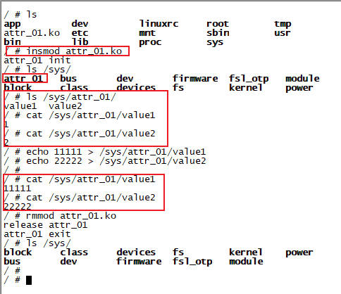

### 8.2 sysfs核心机制

sysfs是Linux内核的伪文件系统，挂载于`/sys`目录，用于将内核对象(设备、驱动、总线)以文件形式暴露给用户空间。用户通过`cat`和`echo`读写这些文件时，最终会调用驱动注册的`sysfs_ops`函数，如`show()`和`store()`。

1. `用户操作`：`cat`触发读操作，`echo`触发写操作
2. `VFS层`：系统调用(`open/read/write`)由虚拟文件系统VFS路由到sysfs的文件操作函数
3. `sysfs层`：sysfs解析文件路径，定位到对应的`kobject`和属性`attribute`
4. `驱动回调`：通过`kobject`关联的`kobj_type`找到`sysfs_ops`，最终调用驱动的`show()`或`store()`函数

### 8.3 源码分析：`ktype`的`default_attrs数组`转为属性文件

属性文件`default_attrs[]`和`sysfs_ops`都在`ktype`中，所以接下来我们重点跟踪`ktype`的使用

函数调用链：`kobject_init_and_add` -> `kobject_add_varg` -> `kobject_add_internal` -> `kobject_add_internal` -> `create_dir`

```c
static int create_dir(struct kobject *kobj)
{
    sysfs_create_dir_ns(kobj, kobject_namespace(kobj)); // 在sysfs中，以kobj名称创建目录
    populate_dir(kobj); // 在/sys/kobj目录下，先获取ktype再遍历default_attrs属性数组，创建属性文件(属性数组以NULL结尾)
}

// 在sysfs中，以kobj名称创建目录
int sysfs_create_dir_ns(struct kobject *kobj, const void *ns)
{
    kernfs_create_dir_ns(parent, kobject_name(kobj), S_IRWXU | S_IRUGO | S_IXUGO, kobj, ns);
}

// 在/sys/kobj目录下，先获取ktype再遍历default_attrs属性数组，创建属性文件(属性数组以NULL结尾)
static int populate_dir(struct kobject *kobj)
{
	struct kobj_type *t = get_ktype(kobj);
	struct attribute *attr;
	int error = 0;
	int i;

	if (t && t->default_attrs) {
		for (i = 0; (attr = t->default_attrs[i]) != NULL; i++) {
			sysfs_create_file(kobj, attr);
		}
	}
}
```

### 8.4 源码分析：`ktype`的`sysfs_ops`转为读写操作

在8.3节的源码分析中，最后是调用`sysfs_create_file(kobj, attr)`来创建`kobj`的属性文件。其实，对属性文件的读写这个函数完成的。

函数调用链：`sysfs_create_file` -> `sysfs_create_file_ns` -> `sysfs_add_file_mode_ns`。我们来分析以下，

1. 获取`kobj`对象的`ktype`，取出`sysfs_ops`操作集
2. 根据`sysfs_ops`中是否自定义了读(`show`)写(`store`)操作，选择对应的`ops`
3. 调用`__kernfs_create_file`真正去创建属性文件. 传入绑定的参数包括：属性文件名(`attr->name`)、权限(`attr->mode`)、读写操作集(`ops`)、其他
4. 用户读写属性文件时，就会调用到ops中的`sysfs_kf_seq_show`和`sysfs_kf_write`。最终会调用到`ktype`中实现的`sysfs_ops`

```c
int sysfs_add_file_mode_ns(struct kernfs_node *parent,
			   const struct attribute *attr, bool is_bin,
			   umode_t mode, const void *ns)
{
    const struct sysfs_ops *sysfs_ops = kobj->ktype->sysfs_ops;

    if (sysfs_ops->show && sysfs_ops->store) {
        ops = &sysfs_file_kfops_rw;
    } else if (sysfs_ops->show) {
        ops = &sysfs_file_kfops_ro;
    } else if (sysfs_ops->store) {
        ops = &sysfs_file_kfops_wo;
    } else
        ops = &sysfs_file_kfops_empty;

	__kernfs_create_file(parent, attr->name, mode & 0777, size, ops, (void *)attr, ns, key);
}

static const struct kernfs_ops sysfs_file_kfops_empty = {
};

static const struct kernfs_ops sysfs_file_kfops_ro = {
	.seq_show	= sysfs_kf_seq_show,
};

static const struct kernfs_ops sysfs_file_kfops_wo = {
	.write		= sysfs_kf_write,
};

static const struct kernfs_ops sysfs_file_kfops_rw = {
	.seq_show	= sysfs_kf_seq_show,
	.write		= sysfs_kf_write,
};

static int sysfs_kf_seq_show(struct seq_file *sf, void *v)
{
	const struct sysfs_ops *ops = kobj->ktype->sysfs_ops;
	char *buf;

	if (ops->show) {
		ops->show(kobj, of->kn->priv, buf);
	}
}

static ssize_t sysfs_kf_write(struct kernfs_open_file *of, char *buf,
			      size_t count, loff_t pos)
{
	const struct sysfs_ops *ops = kobj->ktype->sysfs_ops;

	return ops->store(kobj, of->kn->priv, buf, count);
}
```

### 8.5 源码分析：属性文件的名称和权限

可以看到，每个属性文件包含2部分：名称(`name`)和权限(`mode`)。权限`0666`是一个八进制数，表示该文件对所有用户均开放读写权限。

0666是Linux文件权限的八进制表示，具体分解如下：

+ `0`: 前缀，表示八进制数
+ `6`(所有者权限): 4(读) + 2(写) = 6(可读可写)
+ `6`(组权限): 4(读) + 2(写) = 6(可读可写)
+ `6`(其他用户权限): 4(读) + 2(写) = 6(可读可写)

```c
static struct attribute value1 = {
    .name = "value1",
    .mode = 0666
};

static struct attribute value2 = {
    .name = "value2",
    .mode = 0666
};

static struct attribute *my_attrs[] = {
    &value1,
    &value2,
    NULL
};

属性数组以NULL结尾。0666表示所有用户均可读写该sysfs文件(例如通过cat读取或echo写入)
```

### 8.6 源码分析：`show`和`store`函数指针

+ `show`: 用户读取属性文件。因此，我们要把字符串格式化到`buf`中，然后上层会显示`buf`的内容
+ `store`: 用户写入属性文件。如`echo 111 > value1`，这里用户的输入是一个字符串`"111"`，保存在`buf`指针中。我们要把字符串解析成十进制保存，因此采用`sscanf(buf, "%d", &p_my_kobj->value1)`。`%d`就是以十进制格式解析字符串

```c
static ssize_t my_attr_show(struct kobject *kobj, struct attribute *attr, char *buf)
{
    ssize_t count = 0;
    struct my_kobj *p_my_kobj = container_of(kobj, struct my_kobj, my_kobj);

    if (strcmp(attr->name, "value1") == 0) {
        count = sprintf(buf, "%d\n", p_my_kobj->value1);
    }
    else if (strcmp(attr->name, "value2") == 0) {
        count = sprintf(buf, "%d\n", p_my_kobj->value2);
    }

    return count;
}

static ssize_t my_attr_store(struct kobject *kobj, struct attribute *attr, const char *buf, size_t size)
{
    struct my_kobj *p_my_kobj = container_of(kobj, struct my_kobj, my_kobj);

    if (strcmp(attr->name, "value1") == 0) {
        sscanf(buf, "%d", &p_my_kobj->value1);
    }
    else if (strcmp(attr->name, "value2") == 0) {
        sscanf(buf, "%d", &p_my_kobj->value2);
    }
    
    return size;
}

static const struct sysfs_ops my_sysfs_ops = {
    .show  = my_attr_show,
	.store = my_attr_store,
};
```

## 第9章 使用`struct kobj_attribute`优化属性文件读写

在第8章中，我们是直接使用`struct attribute`创建属性文件，然后再使用`sysfs_ops`创建操作集，二者是独立分离的。

```c
struct attribute {
	const char *name;
	umode_t     mode;
};
```

还有一种常用的方式来创建属性文件，就是使用`struct kobj_attribute`结构体。来看下，他内嵌了`struct attribute`属性结构体，还包含了读写ops。所以我们可以理解，他定义的是一个属性文件外加读写操作。应用访问属性文件时，直接调用这个结构体中的ops函数指针。

```c
struct kobj_attribute {
	struct attribute attr;
	ssize_t (*show)(struct kobject *kobj, struct kobj_attribute *attr, char *buf);
	ssize_t (*store)(struct kobject *kobj, struct kobj_attribute *attr,
			const char *buf, size_t count);
};
```

### 9.1 核心区别

| 特性 | `struct attribute` | `struct kobj_attribute` |
| - | - | - |
| 结构定义 | 基础属性(名称+权限) | 扩展属性(含独立读写函数) |
| 操作函数绑定 | 依赖`ktype->sysfs_ops`统一分发 | 每个属性自带`show/store`函数 |
| 适用场景 | 多属性共享同一组操作函数 | 每个属性需独立操作逻辑 |
| 代码耦合度 | 低(属性与操作解耦) | 高(属性与操作强绑定) |
| 典型用例 | 设备类的默认属性(如dev、uevent) | 驱动自定义属性(如gpio_value) |

### 9.2 适用场景与选择

1. 直接使用`struct attribute`
    + 场景：多个属性需复用同一组操作函数(通过`attr->name`区分属性)
    + 优势：减少代码冗余，统一管理属性读写逻辑
    + 内核应用：设备模型中的默认属性(如dev、uevent)
    + 代码流程：
        1. 定义`struct attribute`数组
        2. 在`ktype->sysfs_ops`中实现统一的分发函数
        3. 在分发函数中解析`attr->name`并执行操作
2. 使用`struct kobj_attribute`
    + 场景：每个属性需*独立的操作函数*，无需在代码中解析属性名
    + 优势：代码直观，属性与操作绑定，避免strcmp判断
    + 内核应用：驱动自定义属性(如GPIO的value、LED的brightness)
    + 代码流程：
        1. 定义`struct kobj_zttribute`(含show/store函数指针)
        2. 直接通过`container_of`从`attr`反向获取`kobj_attribute`
        3. 调用属性自带的读写函数

### 9.3 选择建议

1. 优先`kobj_attribute`
    + 适用于*大多数驱动场景*，每个属性有独立逻辑(如GPIO电平控制、设备状态读写)
    + 避免在分发函数中解析属性名，提升可读性和可维护性
2. 选择`attribute`的场景
    + 多个*属性逻辑高度相似*(如统一格式化输出)
    + 需兼容内核默认属性机制(如`class_create_file`生成的属性)

终极法则：
+ 若属性操作高度类似(如批量生成设备信息)，用`attribute`
+ 若属性需独立业务逻辑(如驱动控制接口)，用`kojb_attribute`

### 9.5 常见错误

1. 混淆结构类型：将`kobj_attribute`传递给`default_attrs`时需用`&attr.attr`(提取内嵌的`attribute`)
2. 未处理属性名冲突：使用`attribute`时未校验`attr->name`，导致错误操作
3. 忽略权限控制：`mode`需匹配操作函数，如只读属性不可实现store

### 9.6 函数接口

#### 9.6.1 `__ATTR`创建属性文件

```c
#define __ATTR(_name, _mode, _show, _store) {				\
	.attr = {.name = __stringify(_name),				\
		 .mode = VERIFY_OCTAL_PERMISSIONS(_mode) },		\
	.show	= _show,						\
	.store	= _store,						\
}
```

+ `_name`: 属性文件名(字符串)
+ `_mode`: 文件属性(八进制，控制用户空间访问权限)。可以有2种方式：数字或宏。本质上都是一样的
    1. 纯数字方式
        + 0666：可读可写
        + 0444：只读
        + 0222：只写
    2. 使用宏定义
        + `S_IRUGO`: 只读
        + `S_IWUGO`: 只写
        + `S_WRUGO | S_IWUGO`: 可读可写
    3. 在`__ATTR`宏中，会对`_mode`进行权限检查。0666过不了，常用的全限制为0644
+ `_show`: 读回调函数，用户执行`cat`时触发
+ `_store`: 写回调函数，用户执行`echo`时触发

#### 9.6.2 `__ATTR_NULL`标识属性数组的末尾

用在属性数组的尾部，结束标志！

```c
#define __ATTR_NULL { .attr = { .name = NULL } }
```

#### 9.6.2 内核驱动代码实例

Linux内核驱动`ecard.c`中，就有使用`__ATTR`的实例。他提供了一系列读取设备属性的接口：

```c
static struct device_attribute ecard_dev_attrs[] = {
	__ATTR(device,   S_IRUGO, ecard_show_device,    NULL),
	__ATTR(dma,      S_IRUGO, ecard_show_dma,       NULL),
	__ATTR(irq,      S_IRUGO, ecard_show_irq,       NULL),
	__ATTR(resource, S_IRUGO, ecard_show_resources, NULL),
	__ATTR(type,     S_IRUGO, ecard_show_type,      NULL),
	__ATTR(vendor,   S_IRUGO, ecard_show_vendor,    NULL),
	__ATTR_NULL,
};
```

### 9.7 代码实测

```c
#include <linux/init.h>
#include <linux/module.h>
#include <linux/slab.h>
#include <linux/kobject.h>
#include <linux/sysfs.h>

struct my_kobj {
    struct kobject my_kobj;
    int value;
};

static struct my_kobj *s_my_kobj;

static ssize_t value_show(struct kobject *kobj, struct kobj_attribute *attr, char *buf)
{
    struct my_kobj *p_my_kobj = container_of(kobj, struct my_kobj, my_kobj);
    return sprintf(buf, "%d\n", p_my_kobj->value);
}

static ssize_t value_store(struct kobject *kobj, struct kobj_attribute *attr, const char *buf, size_t size)
{
    struct my_kobj *p_my_kobj = container_of(kobj, struct my_kobj, my_kobj);
    sscanf(buf, "%d", &p_my_kobj->value);
    return size;
}

static struct kobj_attribute value = __ATTR(value, 0644, value_show, value_store);

static void my_release(struct kobject *kobj)
{
    struct my_kobj *p_my_kobj = container_of(kobj, struct my_kobj, my_kobj);
    printk(KERN_INFO "release attr_02\n");
    kfree(p_my_kobj);
}

static ssize_t my_attr_show(struct kobject *kobj, struct attribute *attr, char *buf)
{
    struct kobj_attribute *p_my_kobj = container_of(attr, struct kobj_attribute, attr);
    return p_my_kobj->show(kobj, p_my_kobj, buf);
}

static ssize_t my_attr_store(struct kobject *kobj, struct attribute *attr, const char *buf, size_t size)
{
    struct kobj_attribute *p_my_kobj = container_of(attr, struct kobj_attribute, attr);
    return p_my_kobj->store(kobj, p_my_kobj, buf, size);
}

static const struct sysfs_ops my_sysfs_ops = {
    .show  = my_attr_show,
	.store = my_attr_store,
};

static struct attribute *my_attrs[] = {
    &value.attr,
    NULL
};

static struct kobj_type my_kobj_type = {
    .release        = my_release,
    .sysfs_ops      = &my_sysfs_ops,
    .default_attrs  = my_attrs
};

static int __init my_init(void)
{
    s_my_kobj = kzalloc(sizeof(struct my_kobj), GFP_KERNEL);
    s_my_kobj->value = 1;

    kobject_init_and_add(&s_my_kobj->my_kobj, &my_kobj_type, NULL, "%s", "attr_02");
    printk(KERN_INFO "attr_02 init\n");

    return 0;
}

static void __exit my_exit(void)
{
    kobject_put(&s_my_kobj->my_kobj);
    printk(KERN_INFO "attr_02 exit\n");
}

module_init(my_init);
module_exit(my_exit);

MODULE_LICENSE("GPL");
MODULE_AUTHOR("ding");
```

## 第10章 使用`kobject_create_and_add(*name, *parent)`创建的kobject, 添加属性文件

前面我们创建`kobj`属性文件，是使用`kobject_init_and_add(*kobj, *ktype, *parent, ...)`函数，因为可以传入`ktype`参数，我们的属性文件名和读写操作集，都是通过`ktype`传入。

*那么问题来了，`kobject_create_and_add(*name, *parent)`这个函数没有ktype入参，该怎么创建属性文件呢？*

我们还是先来看下`kobject_create_and_add()`的源码. 函数调用链：`kobject_create_and_add` -> `kobject_create`。

1. 动态创建的`kobject`，使用的`ktype`是`dynamic_kobj_ktype`
2. `dynamic_kobj_ktype`的`release`函数，就是`kfree`释放内存
3. `dynamic_kobj_ktype`没有`default_attrs`属性文件数组，我们暂时还不知道该如何创建属性文件
3. `dynamic_kobj_ktype`竟然有`sysfs_ops`操作集。看起来很奇怪，没关系。我们接下来仔细分析

```c
// 动态创建的kobject，使用的ktype为dynamic_kobj_ktype
static struct kobj_type dynamic_kobj_ktype = {
	.release	= dynamic_kobj_release,
	.sysfs_ops	= &kobj_sysfs_ops,
};

struct kobject *kobject_create(void)
{
	struct kobject *kobj;

	kobj = kzalloc(sizeof(*kobj), GFP_KERNEL);
	kobject_init(kobj, &dynamic_kobj_ktype);

	return kobj;
}

static void dynamic_kobj_release(struct kobject *kobj)
{
	pr_debug("kobject: (%p): %s\n", kobj, __func__);
	kfree(kobj);
}
```

### 10.1 创建属性文件的本质：`sysfs_create_file(*kobj, *attr)`

在`8.3 ~ 8.4`节的源码分析中，我们知道ktype里面的属性文件，最终是调用`sysfs_create_file(kobj, attr)`函数来创建属性文件，并绑定`sysfs_ops`操作集的。

```c
static int populate_dir(struct kobject *kobj)
{
	struct kobj_type *t = get_ktype(kobj);
	struct attribute *attr;
	int error = 0;
	int i;

	if (t && t->default_attrs) {
		for (i = 0; (attr = t->default_attrs[i]) != NULL; i++) {
			sysfs_create_file(kobj, attr);
		}
	}
}
```

那么对于动态创建的`kobject`，我们也可以直接调用`sysfs_create_file(kobj, attr)`来创建属性文件，并绑定操作集。

### 10.2 动态`kobject`的`sysfs_ops`操作集

动态`kobject`的`sysfs_ops`操作集代码已经写好了。我们来分析下：

1. 统一注册的`kobj_sysfs_ops`，然后在`sysfs_ops`中进行分发
2. 在`sysfs_ops`中，获取`struct kobj_attribute`，然后再调用`kobj_attribute`绑定的属性操作函数。所以，我们需要创建`kobj_attribute`类型的属性文件

```c
const struct sysfs_ops kobj_sysfs_ops = {
	.show	= kobj_attr_show,
	.store	= kobj_attr_store,
};

static ssize_t kobj_attr_show(struct kobject *kobj, struct attribute *attr,
			      char *buf)
{
	struct kobj_attribute *kattr;
	ssize_t ret = -EIO;

	kattr = container_of(attr, struct kobj_attribute, attr);
	if (kattr->show)
		ret = kattr->show(kobj, kattr, buf);
	return ret;
}

static ssize_t kobj_attr_store(struct kobject *kobj, struct attribute *attr,
			       const char *buf, size_t count)
{
	struct kobj_attribute *kattr;
	ssize_t ret = -EIO;

	kattr = container_of(attr, struct kobj_attribute, attr);
	if (kattr->store)
		ret = kattr->store(kobj, kattr, buf, count);
	return ret;
}
```

### 10.3 动态`kobject`添加属性文件的流程总结

1. `kobject_create_and_add`创建动态`kobject`
2. `__ATTR`创建`struct kojb_attribute`属性结构体，并绑定读写函数
3. `sysfs_create_file`创建属性文件，把第2步创建的属性结构体传入

### 10.4 代码实测

#### 10.4.1 `kobject`以指针形式嵌入到外部结构体的问题

```c
#include <linux/init.h>
#include <linux/module.h>
#include <linux/slab.h>
#include <linux/kobject.h>
#include <linux/sysfs.h>

struct my_device {
    struct kobject *kobj;
    int value;
};

static struct my_device *my_dev;

static ssize_t value_show(struct kobject *kobj, struct kobj_attribute *attr, char *buf)
{
    struct my_device *dev = container_of((struct kobject **)kobj, struct my_device, kobj);
    return sprintf(buf, "%d\n", dev->value);
}

static ssize_t value_store(struct kobject *kobj, struct kobj_attribute *attr, const char *buf, size_t size)
{
    struct my_device *dev = container_of((struct kobject **)kobj, struct my_device, kobj);
    sscanf(buf, "%d", &dev->value);
    return size;
}

static struct kobj_attribute value = __ATTR(value, 0644, value_show, value_store);

static int __init my_init(void)
{
    my_dev = kzalloc(sizeof(struct my_device), GFP_KERNEL);

    my_dev->kobj = kobject_create_and_add("f_attr", NULL);
    my_dev->value = 1;
    sysfs_create_file(my_dev->kobj, &value.attr);

    printk(KERN_INFO "f_attr init\n");
    return 0;
}

static void __exit my_exit(void)
{
    kobject_put(my_dev->kobj);
    kfree(my_dev);
    printk(KERN_INFO "f_attr exit\n");
}

module_init(my_init);
module_exit(my_exit);

MODULE_LICENSE("GPL");
MODULE_AUTHOR("ding");
```

测试结果如下。可以看到，这个结果显然是不对的。问题出在哪里？？？

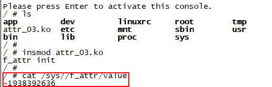

显然不对。初始值应该是1才对，但这里是一串随机值。问题出在哪里？？

我们的`kobject`是以指针形式嵌入到外部结构体的，这不是标准用法。Linux 设备模型强烈推荐直接嵌入 `struct kobject`（非指针），以简化内存管理和避免类型风险。

#### 10.4.2 解决方案：定义成单独的静态变量

不要把`kobject`指针嵌入到外部结构体成员中。如果有需要用指针，定义成单独的静态变量`static struct kobject *my_device`

```c
#include <linux/init.h>
#include <linux/module.h>
#include <linux/slab.h>
#include <linux/kobject.h>
#include <linux/sysfs.h>

static int my_value;
static struct kobject *my_kobject;

static ssize_t value_show(struct kobject *kobj, struct kobj_attribute *attr, char *buf)
{
    return sprintf(buf, "%d\n", my_value);
}

static ssize_t value_store(struct kobject *kobj, struct kobj_attribute *attr, const char *buf, size_t size)
{
    sscanf(buf, "%d", &my_value);
    return size;
}

static struct kobj_attribute value = __ATTR(value, 0644, value_show, value_store);

static int __init my_init(void)
{
    my_kobject = kobject_create_and_add("f_attr", NULL);
    my_value = 1;
    sysfs_create_file(my_kobject, &value.attr);

    printk(KERN_INFO "f_attr init\n");
    return 0;
}

static void __exit my_exit(void)
{
    kobject_put(my_kobject);
    printk(KERN_INFO "f_attr exit\n");
}

module_init(my_init);
module_exit(my_exit);

MODULE_LICENSE("GPL");
MODULE_AUTHOR("ding");
```

## 第11章 使用`sysfs_create_group(*kobj, *grp)`创建多个属性

第10章的代码中，我们使用`sysfs_create_file`来给`kobject`创建属性文件。这没有任何问题，但是如果我们需要创建多个属性文件呢？

+ 办法1：循环调用多次`sysfs_create_file`
+ 办法2：使用`sysfs_create_group`创建1组属性文件

### 11.1 函数功能

`sysfs_create_group()`用于在指定的`kobject`对应的sysfs目录下创建一组属性文件(属性组)。这些属性文件通常用于*用户空间与内核的交互*(如读写设备参数、控制硬件状态)。属性组通过`struct attribute_group`来定义，可包含多个属性文件，每核文件绑定独立的`show`和`store`回调函数。

### 11.2 函数原型与参数

```c
int sysfs_create_group(struct kobject *kobj, const struct attribute_group *grp);
```

1. `kobj`: 指向目标内核对象
2. `grp`: 指向属性组
    ```c
    struct attribute_group {
        const char *name;          // 可选：属性组的子目录名
        umode_t (*is_visible)(...); // 可选：控制属性可见性
        struct attribute **attrs;  // 必需：属性文件数组
        struct bin_attribute **bin_attrs; // 二进制属性（可选）
    };
    ```
    关键成员：
    + `attrs`: 以NULL结尾的`struct attribute_group *`数组，每个元素代表一个属性文件
    + `name`: 若指定，则在`kobj`目录下创建子目录. 否则属性直接位于`kobj`目录
3. 返回值: 0(成功)
4. 需在模块卸载时调用`sysfs_remove_group`删除属性组，避免资源泄露

### 11.3 典型使用场景

1. 设备驱动调试：暴露硬件传感器、开关状态等参数供用户空间实时读写
2. 动态配置设备：如传感器校准值、通信超时时间
3. 批量创建属性：避免多次调用`sysfs_create_file()`，提升代码可维护性

### 11.4 代码实测

```c
#include <linux/init.h>
#include <linux/module.h>
#include <linux/slab.h>
#include <linux/kobject.h>
#include <linux/sysfs.h>

static int my_value = 100;
static char my_mode[16] = "default";

static ssize_t value_show(struct kobject *kobj, struct kobj_attribute *attr, char *buf)
{
    return sprintf(buf, "%d\n", my_value);
}

static ssize_t value_store(struct kobject *kobj, struct kobj_attribute *attr, const char *buf, size_t size)
{
    int ret = kstrtoint(buf, 10, &my_value);
    return ret ? ret : size;
}

static struct kobj_attribute value_attr = __ATTR_RW(value);

static ssize_t mode_show(struct kobject *kobj, struct kobj_attribute *attr, char *buf)
{
    return sprintf(buf, "%s\n", my_mode);
}

static struct kobj_attribute mode_attr = __ATTR_RO(mode);

static struct attribute *my_attrs[] = {
    &value_attr.attr,
    &mode_attr.attr,
    NULL
};

static const struct attribute_group my_attr_grp = {
    .attrs = my_attrs   // 关联属性数组
};

static struct kobject *my_kobject;

static int __init my_init(void)
{
    my_kobject = kobject_create_and_add("f_attr", NULL);
    sysfs_create_group(my_kobject, &my_attr_grp);   // 创建属性组
    printk(KERN_INFO "f_attr init\n");
    return 0;
}

static void __exit my_exit(void)
{
    sysfs_remove_group(my_kobject, &my_attr_grp);
    kobject_put(my_kobject);
    printk(KERN_INFO "f_attr exit\n");
}

module_init(my_init);
module_exit(my_exit);

MODULE_LICENSE("GPL");
MODULE_AUTHOR("ding");
```

测试结果：

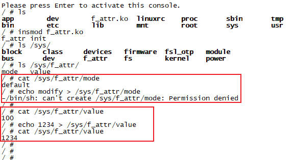

## 第12章 注册一个自己的`bus`总线

前面提到，设备模型包括设备、驱动、总线和类。前面我们学习了设备模型基本框架`kobject`和`kset`，本章开始学习总线。

Linux系统中的总线的根目录是`/sys/bus`. 如果我们自己注册一个总线，也会出现在此目录下。

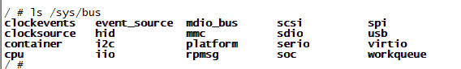

### 12.1 总线注册API函数

#### 12.1.1 `bus_register`注册总线

```c
int bus_register(struct bus_type *bus);
```

+ 功能：向内核注册总线类型，创建`/sys/bus/<bus_name>`目录及其子目录(devices、drivers)
+ 参数`bus`：`struct bus_type`指针，需初始化`name`(总线名)和`match`(匹配函数)等字段
+ 返回值： 0=成功  负数=失败
+ 代码实例：
    ```c
    struct bus_type my_bus = {
        .name = "my_bus",
        .match = my_match,  // 自定义匹配函数
    };
    int ret = bus_register(&my_bus);
    ```

#### 12.1.2 `bus_unregister`注销总线

```c
void bus_unregister(struct bus_type *bus);
```

+ 功能：注销总线，清理`sysfs`条目和内核数据结构
+ 参数`bus`：待注销的总线指针
+ 返回值：无

### 12.2 总线核心方法

#### 12.2.1 `match`方法

```c
int (*match)(struct device *dev, struct device_driver *drv)
```

+ 功能：判断设备与驱动是否匹配(需总线实现)
+ 典型实现逻辑：
    ```c
    static int my_match(struct device *dev, struct device_driver *drv) {
        // 示例：按名称匹配
        return strcmp(dev_name(dev), drv->name) == 0;
        // 实际场景可能用设备ID或设备树compatible属性
    }
    ```
+ 返回值：匹配成功 - 非零值    不匹配：0
+ 底层原理：
    + 设备/驱动注册时，总线遍历对方链表调用`match()`
    + 匹配后触发`probe()`

#### 12.2.2 `probe`方法

```c
int (*probe)(struct device *dev)
```

+ 功能：设备匹配成功后初始化硬件资源
+ 场景：设备热插拔或去当加载时的初始化

### 12.3 典型总线对比

| 总线类型 | 匹配方式 | 典型场景 |
| - | - | - |
| PCI | 设备ID (vendor/device) | 显卡、网卡 |
| platform | 设备名称或设备树compatible | SoC内置设备(如GPIO) |
| I2C | 设备地址和驱动ID表 | 传感器、EEPROM |

### 12.4 代码实测

```c
#include <linux/init.h>
#include <linux/module.h>
#include <linux/slab.h>
#include <linux/kobject.h>
#include <linux/sysfs.h>
#include <linux/device.h>

#define PROJECT_NAME    "mybus"

static int mybus_match(struct device *dev, struct device_driver *drv)
{
    printk(KERN_INFO "%s\n", __FUNCTION__);
    return (strcmp(dev_name(dev), drv->name) == 0);
}

static int my_probe(struct device *dev)
{
    struct device_driver *drv = dev->driver;
    printk(KERN_INFO "%s\n", __FUNCTION__);
    if (drv->probe) {
        return drv->probe(dev);
    }
    return 0;
}

static struct bus_type mybus = {
    .name   = "mybus",
    .match  = mybus_match,
    .probe  = my_probe,
};

static int __init my_init(void)
{
    int ret;
    ret = bus_register(&mybus);
    if (ret == 0) {
        printk(KERN_INFO "%s init success\n", PROJECT_NAME);
    }
    else {
        printk(KERN_INFO "%s init fail\n", PROJECT_NAME);
    }
    return 0;
}

static void __exit my_exit(void)
{
    bus_unregister(&mybus);
    printk(KERN_INFO "%s exit\n", PROJECT_NAME);
}

module_init(my_init);
module_exit(my_exit);

MODULE_LICENSE("GPL");
MODULE_AUTHOR("ding");
```

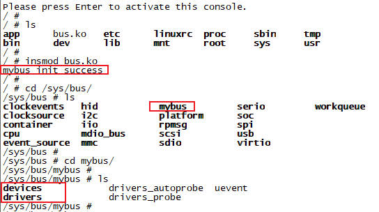

## 第13章 给`bus`总线添加属性文件

上一章我们成功的创建了自定义总线，接下来给总线添加属性文件，以扩展其功能。

### 13.1 `bus`总线属性文件API函数

```c
struct bus_attribute {
    struct attribute attr;     // 基础属性（文件名、权限）
    ssize_t (*show)(struct bus_type *bus, char *buf); // 读回调
    ssize_t (*store)(struct bus_type *bus, const char *buf, size_t count); // 写回调
};
```

#### 13.1.1 `bus_create_file`创建`bus`属性文件

```c
int bus_create_file(struct bus_type *bus, struct bus_attribute *attr);
```

#### 13.1.2 `bus_remove_file`销毁`bus`属性文件

```c
void bus_remove_file(struct bus_type *bus, struct bus_attribute *attr);
```

#### 13.1.3 `kstrtoint`把字符串转为10/16进制，在`store`方法中调用

```c
int kstrtoint(const char *s, unsigned int base, int *res);
```

### 13.2 `bus`属性文件的典型使用场景

| 场景 | 说明 |
| - | - |
| 总线版本信息暴露 | 创建只读文件(如version)，显示总线驱动版本号 |
| 动态配置总线参数 | 创建可写文件(如timeout)，允许用户修改总线超时时间 |
| 调试接口 | 创建文件触发内部状态dump(如debug_level) |

### 13.3 代码实测

```c
#include <linux/init.h>
#include <linux/module.h>
#include <linux/slab.h>
#include <linux/kobject.h>
#include <linux/sysfs.h>
#include <linux/device.h>

#define PROJECT_NAME    "mybus"
#define PROJECT_VER     "V1.0"

static int mybus_match(struct device *dev, struct device_driver *drv)
{
    printk(KERN_INFO "%s\n", __FUNCTION__);
    return (strcmp(dev_name(dev), drv->name) == 0);
}

static int my_probe(struct device *dev)
{
    struct device_driver *drv = dev->driver;
    printk(KERN_INFO "%s\n", __FUNCTION__);
    if (drv->probe) {
        return drv->probe(dev);
    }
    return 0;
}

static struct bus_type mybus = {
    .name   = "mybus",
    .match  = mybus_match,
    .probe  = my_probe,
};

static ssize_t version_show(struct bus_type *bus, char *buf)
{
    return sprintf(buf, "%s %s\n", bus->name, PROJECT_VER);
}

static int mybus_debug_level = 0;

static ssize_t debug_level_show(struct bus_type *bus, char *buf)
{
    sprintf(buf, "%d\n", mybus_debug_level);
}
static ssize_t debug_level_store(struct bus_type *bus, const char *buf, size_t count)
{
    kstrtoint(buf, 10, &mybus_debug_level);
    return count;
}

static BUS_ATTR_RO(version);
static BUS_ATTR_RW(debug_level);

static int __init my_init(void)
{
    bus_register(&mybus);
    bus_create_file(&mybus, &bus_attr_version);
    bus_create_file(&mybus, &bus_attr_debug_level);
    printk(KERN_INFO "%s init\n", PROJECT_NAME);
    return 0;
}

static void __exit my_exit(void)
{
    bus_remove_file(&mybus, &bus_attr_debug_level);
    bus_remove_file(&mybus, &bus_attr_version);
    bus_unregister(&mybus);
    printk(KERN_INFO "%s exit\n", PROJECT_NAME);
}

module_init(my_init);
module_exit(my_exit);

MODULE_LICENSE("GPL");
MODULE_AUTHOR("ding");
```

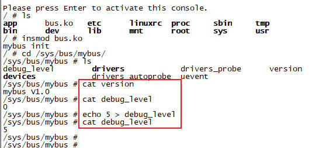

## 第14章 `bus_register`底层代码原理分析

### 14.1 `klist`和`klist_node`线程安全链表

Linux内核的`klist`是一种线程安全的链表实现。在标准`list_head`基础上引入了引用计数和同步机制，主要用于需要安全并发访问的场景。

#### 14.1.1 `klist`链表头

```c
struct klist {
	spinlock_t		k_lock;         // 保护链表的自旋锁
	struct list_head	k_list;     // 嵌入的标准链表节点
	void			(*get)(struct klist_node *);    // 节点引用增加时的回调
	void			(*put)(struct klist_node *);    // 节点引用减少时的回调
} __attribute__ ((aligned (sizeof(void *))));       // 栈指针大小对齐
```

设计意图：

+ 线程安全：通过`k_lock`自旋锁确保对链表的操作原子化
+ 生命周期管理：`get/put`回调由用户定义，用于嵌入对线的应用计数管理
+ 内存对齐：利用地址对齐特性，将指针最低位用于状态标记(如节点删除标志)，避免额外存储开销

#### 14.1.2 `klist_node`链表节点

```c
struct klist_node {
	void			*n_klist;	// 指向所属klist
	struct list_head	n_node; // 嵌入的标准链表节点
	struct kref		n_ref;      // 引用计数器
};
```

关键设计：

+ `n_klist`的双重作用：
    + 指向所属klist链表头
    + *最低位作为状态标记位(`KNODE_DEAN`)*：若置1，表示节点已标记删除，迭代时会跳过
+ 引用计数`n_ref`：
    + 节点被引用时计数增加，释放时减少
    + 计数归零时触发`klist_release`，从链表移除节点并唤醒等待线程

#### 14.1.2 核心设计思路

1. 安全删除机制`klist_del`(延迟移除)

    + 问题：直接删除节点可能导致其他线程访问已释放内存
    + 方案：
        + `klist_del()`仅标记`KNODE_DEAD`并减少引用计数，不立即删除
        + 当引用计数归零时，节点被真正移除(通过`klist_release`)
    + 优势：避免悬空指针，确保无线程持有节点时才释放内存

2. 阻塞式删除`klist_remove`

    + 场景：需等待节点完全释放(如卸载驱动时移除设备)
    + 实现：
        + 调用线程加入全局等待队列`klist_remove_waiters`，进入休眠
        + 当节点引用归零时，`klist_release`唤醒等待线程

#### 14.1.3 地址对齐与状态标记

技术背景：指针地址对齐。32位系统中，指针地址按4字节对齐(最低2位恒为0).利用最低位的`冗余0`存储状态信息(1表示删除状态)，不影响指针本身的寻址能力。我们来看下源码：

`klist.c`

```c
/*
 * Use the lowest bit of n_klist to mark deleted nodes and exclude dead ones from iteration.
 */
#define KNODE_DEAD		1LU
#define KNODE_KLIST_MASK	~KNODE_DEAD

// 获知真实链表头
static struct klist *knode_klist(struct klist_node *knode)
{
	return (struct klist *)((unsigned long)knode->n_klist & KNODE_KLIST_MASK);
}

// 判断节点状态
static bool knode_dead(struct klist_node *knode)
{
	return (unsigned long)knode->n_klist & KNODE_DEAD;
}

// 标记节点为删除状态
static void knode_kill(struct klist_node *knode)
{
	*(unsigned long *)&knode->n_klist |= KNODE_DEAD;
}
```

总结：通过位运算快速切换状态，避免锁开销。

#### 14.1.4 典型应用场景

1. 设备驱动模型(核心应用)

    + 设备与驱动的关联：
        + 总线：通过`klist`管理所有设备(`klist_devices`)和驱动(`klist_drivers`)
        + 驱动：使用`klist`管理其支持的设备(`klist_devices`)
        + 设备：包含`klist_node`成员，挂载到总线和驱动的链表中

    + 示例：
        + I2C总线上挂载多个设备(如温度传感器)，设备节点通过`klist`连接到总线及对应驱动的链表
        + 卸载驱动时，调用`klist_remove()`阻塞至所有设备引用释放

2. 动态对象管理

    + 场景：需跟踪生命周期且可能被多线程访问的对象(如内核模块、网络连接)
    + 优势：
        + 引用计数自动管理对象销毁
        + 自旋锁保证并发操作安全

#### 14.1.5 与`list_head`的对比

| 特性 | `list_head` | `klist` |
| - | - | - |
| 线程安全 | 无 | 自旋锁保护操作 |
| 节点删除 | 立即移除 | 延迟移除(引用计数归零) |
| 迭代安全 | 不支持并发修改 | 支持安全并发迭代 |
| 内存开销 | 较小 | 略大(含锁和引用计数) |

### 14.2 子系统的私有管理

在Linux内核设备模型中，`struct subsys_private`、`struct driver_private`、`struct device_private`是3个核心私有结构体，用于管理子系统(如总线或类)、设备驱动和设备实例的内部状态和关联关系。

### 14.2.1 `struct subsys_private`子系统的私有管理

```c
struct subsys_private {
	struct kset subsys;             // 子系统的kset对象. 如/sys/bus/usb
	struct kset *devices_kset;      // 子系统下所有设备的kset. /sys/bus/usb/devices
    struct kset *drivers_kset;      // 子系统下所有驱动的kset. /sys/bus/usb/drivers
	
	struct klist klist_devices;     // 线程安全的设备链表. klist管理
	struct klist klist_drivers;     // 线程安全的驱动链表. klist管理

	unsigned int drivers_autoprobe:1;   // 是否自动触发驱动probe()的标志
	struct bus_type *bus;           // 关联的总线类型. 如usb_bus_type

	struct class *class;            // 关联的设备类
};
```

### 14.2.2 `bus_register`源码分析

#### 14.2.2.1 `bus_kset`创建`/sys/bus`

+ `buses_init`函数中，创建了名为`bus`的变量`bus_kset`. 这个操作会创建`/sys/bus`目录

    ```c
    int __init buses_init(void)
    {
        bus_kset = kset_create_and_add("bus", &bus_uevent_ops, NULL);
        return 0;
    }
    ```

#### 14.2.2.2 `bus_ktype`定义了`kset`的操作函数

+ 创建了`bus_ktype`变量。这个变量包含：`sysfs_ops`读写属性文件，`bus_release`释放内存
+ `bus_release`释放内存的过程：通过`kobj`找到`subsys_private`，再进一步找到`subsys_private->bus`，释放`priv`的内存

    ```c
    static ssize_t bus_attr_show(struct kobject *kobj, struct attribute *attr,
                    char *buf)
    {
        struct bus_attribute *bus_attr = to_bus_attr(attr);
        struct subsys_private *subsys_priv = to_subsys_private(kobj);

        if (bus_attr->show)
            ret = bus_attr->show(subsys_priv->bus, buf);
    }

    static ssize_t bus_attr_store(struct kobject *kobj, struct attribute *attr,
                    const char *buf, size_t count)
    {
        struct bus_attribute *bus_attr = to_bus_attr(attr);
        struct subsys_private *subsys_priv = to_subsys_private(kobj);

        if (bus_attr->store)
            ret = bus_attr->store(subsys_priv->bus, buf, count);
    }

    static const struct sysfs_ops bus_sysfs_ops = {
        .show	= bus_attr_show,
        .store	= bus_attr_store,
    };

    static void bus_release(struct kobject *kobj)
    {
        struct subsys_private *priv = container_of(kobj, typeof(*priv), subsys.kobj);
        struct bus_type *bus = priv->bus;
        
        kfree(priv);
        bus->p = NULL;
    }

    static struct kobj_type bus_ktype = {
        .sysfs_ops	= &bus_sysfs_ops,
        .release	= bus_release,
    };
    ```

#### 14.2.2.3 总线注册`bus_register`函数

1. 申请`subsys_private`内存. 把`priv->bus`设为`bus`, `bus->p`设为`priv`. 这使得`bus`和`priv`可以互相访问对方
2. 设置`sysfs`目录结构. `kobj`名称设为`bus`名, `kset`设为`bus_kset`. 这个操作会创建`/sys/bus/xxx`目录，最后注册`priv->kset`
3. `drivers_autoprobe`标志位设置为1. 当这个标志位为1时，添加设备匹配到了驱动时，就会自动执行驱动的`probe()`函数
4. 以`priv->kset`为`parent`，创建`devices`和`drivers`两个子`kset`. 这个操作会创建`/sys/bus/xxx/devices`和`/sys/bus/xxx/drivers`两个子目录
5. 初始化设备和驱动的`klist`链表. 这里`klist_devices_get`和`klist_devices_put`里面封装了`kobject_get/put`，会执行引用计数管理
6. `add_probe_files`函数创建总线的属性文件：`uevent`、`drivers_probe`、`drivers_autoprobe`这3个属性文件
    
    ```c
    static BUS_ATTR(uevent, S_IWUSR, NULL, bus_uevent_store);
    static BUS_ATTR(drivers_probe, S_IWUSR, NULL, store_drivers_probe);
    static BUS_ATTR(drivers_autoprobe, S_IWUSR | S_IRUGO, show_drivers_autoprobe, store_drivers_autoprobe);

    static int add_probe_files(struct bus_type *bus)
    {
        retval = bus_create_file(bus, &bus_attr_uevent);
        retval = bus_create_file(bus, &bus_attr_drivers_probe);
        retval = bus_create_file(bus, &bus_attr_drivers_autoprobe);
    }
    ```
7. 添加自定义属性组`bus_groups`. 没有属性组时就不去创建

```c
int bus_register(struct bus_type *bus)
{
	int retval;
	struct subsys_private *priv;

	priv = kzalloc(sizeof(struct subsys_private), GFP_KERNEL);
	priv->bus = bus;
	bus->p = priv;

	retval = kobject_set_name(&priv->subsys.kobj, "%s", bus->name);
	priv->subsys.kobj.kset = bus_kset;
	priv->subsys.kobj.ktype = &bus_ktype;
	retval = kset_register(&priv->subsys);

    priv->drivers_autoprobe = 1;

	retval = bus_create_file(bus, &bus_attr_uevent);

	priv->devices_kset = kset_create_and_add("devices", NULL, &priv->subsys.kobj);
	priv->drivers_kset = kset_create_and_add("drivers", NULL, &priv->subsys.kobj);

	klist_init(&priv->klist_devices, klist_devices_get, klist_devices_put);
	klist_init(&priv->klist_drivers, NULL, NULL);

	retval = add_probe_files(bus);

	retval = bus_add_groups(bus, bus->bus_groups);

	pr_debug("bus: '%s': registered\n", bus->name);
	return 0;
}
```

## 第15章 `int device_register(struct device *dev)`注册设备

上一章我们注册了总线，这一章学习如何注册设备。总线和设备需要单独注册，因此我们需要2个驱动模块。

### 15.1 总线驱动`bus.c`

注意：由于设备驱动需要绑定`mybus`总线，而这是在2个不同的驱动模块间引用，因此需要导出`mybus`变量。操作方式如下：

1. `mybus`不能用static修饰，需要用全局变量
2. 使用`EXPORT_SYMBOL_GPL(mybus);`宏定义导出`mybus`变量
3. 编译出来的`Module.symvers`符号表文件，内容如下
    ```txt
    0x2f5856e4	mybus	/home/ding/linux/imx/driver/ch7_device_model/12_bus/bus/bus	EXPORT_SYMBOL_GPL
    ```

```c
#include <linux/init.h>
#include <linux/module.h>
#include <linux/slab.h>
#include <linux/kobject.h>
#include <linux/sysfs.h>
#include <linux/device.h>
#include <linux/export.h>

#define PROJECT_NAME    "mybus"
#define PROJECT_VER     "V1.0"

static int mybus_match(struct device *dev, struct device_driver *drv)
{
    printk(KERN_INFO "%s\n", __FUNCTION__);
    return (strcmp(dev_name(dev), drv->name) == 0);
}

static int mybus_probe(struct device *dev)
{
    struct device_driver *drv = dev->driver;
    printk(KERN_INFO "%s\n", __FUNCTION__);
    if (drv->probe) {
        return drv->probe(dev);
    }
    return 0;
}

struct bus_type mybus = {
    .name   = "mybus",
    .match  = mybus_match,
    .probe  = mybus_probe,
};
EXPORT_SYMBOL_GPL(mybus);

static int __init my_init(void)
{
    printk(KERN_INFO "%s init\n", PROJECT_NAME);
    return bus_register(&mybus);
}

static void __exit my_exit(void)
{
    printk(KERN_INFO "%s exit\n", PROJECT_NAME);
    bus_unregister(&mybus);
}

module_init(my_init);
module_exit(my_exit);

MODULE_LICENSE("GPL");
MODULE_AUTHOR("ding");
```

### 15.2 设备驱动`device.c`

注意：设备驱动要绑定`mybus`总线，而这是跨模块引用，因此要用到符号表。具体操作如下：

1. 源文件`device.c`中，使用`extern`声明`mybus`变量
    ```c
    extern struct bus_type mybus;
    ```
2. `Makefile`中，使用环境变量`KBUILD_EXTRA_SYMBOLS`来指定符号文件的绝对路径。必须是绝对路径！
    ```Makefile
    KBUILD_EXTRA_SYMBOLS += $(PWD)/../bus/Module.symvers	# 添加符号文件
    ```

```c
#include <linux/init.h>
#include <linux/module.h>
#include <linux/slab.h>
#include <linux/kobject.h>
#include <linux/sysfs.h>
#include <linux/device.h>

#define PROJECT_NAME    "mydev"

extern struct bus_type mybus;

static void	mydev_release(struct device *dev)
{
    printk(KERN_INFO "%s release\n", PROJECT_NAME);
}

static struct device mydev = {
    .init_name  = "mydev",
    .bus        = &mybus,
    .release    = mydev_release,
};

static int __init my_init(void)
{
    printk(KERN_INFO "%s init\n", PROJECT_NAME);
    return device_register(&mydev);
}

static void __exit my_exit(void)
{
    printk(KERN_INFO "%s exit\n", PROJECT_NAME);
    device_unregister(&mydev);
}

module_init(my_init);
module_exit(my_exit);

MODULE_LICENSE("GPL");
MODULE_AUTHOR("ding");
```

测试结果如下：

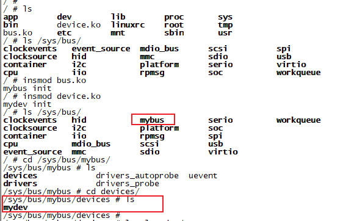

### 15.3 `device_register`设备注册流程分析

```c
int device_register(struct device *dev)
{
	device_initialize(dev);
	return device_add(dev);
}
```

重点是`device_add`函数。我们继续分析：

```c
int device_add(struct device *dev)
{
	struct device *parent = NULL;
	struct kobject *kobj;
	struct class_interface *class_intf;
	int error = -EINVAL;

    // 1. 初始化子系统
	device_private_init(dev);

    // 2. 如果设备设置了init_name, 则会使用这么设备名称. 如果没有设备名但设置了总线名, 则使用总线的规则来设置设备名
	if (dev->init_name) {
		dev_set_name(dev, "%s", dev->init_name);
	}
	if (!dev_name(dev) && dev->bus && dev->bus->dev_name) {
        dev_set_name(dev, "%s%u", dev->bus->dev_name, dev->id);
    }
		
    #if 0
    // 3. 建立设备层次关系. 设备在sysfs中的位置取决于其父设备和类属性, 函数通过get_device_parent来确定设备的父对象
    + 无类无父设备: 挂在/sys/devices目录下
    + 无类有父设备: 挂在父设备对应的目录下
    + 有类无父设备: 挂在/sys/devices/virtual下对应类名的目录下
    + 有类有父设备: 根据父设备是否属于类来决策
    #endif
	kobj = get_device_parent(dev, dev->parent);
	if (kobj) {
        dev->kobj.parent = kobj;
    }
	kobject_add(&dev->kobj, dev->kobj.parent, NULL);	

    // 4. 为设备创建各种属性文件
	device_create_file(dev, &dev_attr_uevent);
	device_add_attrs(dev);

    // 5. 为设备构建of_node设备节点的符号链接，以及设备到类、类到设备的符号链接
    device_add_class_symlinks(dev);

    // 6. 将设备添加到总线, 并建立设备与总线之间的双向关联
	bus_add_device(dev);

    // 7. 触发总线对设备的探测，尝试将设备与合适的驱动进行匹配​
	bus_probe_device(dev);

    // 8. 将当前设备添加到其所属类的设备链表中
	if (dev->class) {
		mutex_lock(&dev->class->p->mutex);
		klist_add_tail(&dev->knode_class, &dev->class->p->klist_devices);
		list_for_each_entry(class_intf, &dev->class->p->interfaces, node)
			if (class_intf->add_dev)
				class_intf->add_dev(dev, class_intf);
		mutex_unlock(&dev->class->p->mutex);
	}

	return 0;
}
```

下面是一些关键函数的代码分析：

+ `get_device_parent`获取父设备

    1. 如果没有显式设置parent, 而总线bus设置了`dev_root`, 则把sysfs的parent设为`dev_root`
    2. 如果显式设置了parent, 则把sysfs的parent设为`parent`

    ```c
    static struct kobject *get_device_parent(struct device *dev,
					 struct device *parent)
    {
        if (!parent && dev->bus && dev->bus->dev_root)
		return &dev->bus->dev_root->kobj;

        if (parent)
            return &parent->kobj;
        return NULL;
    }
    ```

+ `device_add_class_symlinks`创建sysfs符号连接, 揭示设备在内核不同维度(物理连接、功能分类、总线驱动)之间的关键

    ```c
    static int device_add_class_symlinks(struct device *dev)
    {
        struct device_node *of_node = dev_of_node(dev);

        // 创建of_node链接, 链接到设备树节点
        if (of_node) {
            sysfs_create_link(&dev->kobj, &of_node->kobj,"of_node");
        }

        // 如果设备没有关联的class, 则无需创建后续链接
        if (!dev->class)
            return 0;

        // 创建subsystem链接, 指向设备所属class的目录
        sysfs_create_link(&dev->kobj, &dev->class->p->subsys.kobj, "subsystem");

        // 创建device链接, 指向父设备的目录
        if (dev->parent) {
            sysfs_create_link(&dev->kobj, &dev->parent->kobj, "device");
        }

        // 在class目录下创建指向该设备的连接, 这使得通过class能找到设备
        sysfs_create_link(&dev->class->p->subsys.kobj, &dev->kobj, dev_name(dev));

        return 0;
    }
    ```

+ `bus_add_device`将设备关联到总线的体系结构中

    1. 在总线的devices目录下创建指向设备的符号链接（总线->设备）
    2. 在设备目录下创建指向总线的subsystem符号链接（设备->总线）
    3. 将设备添加到总线的设备链表（klist_devices）中

    ```c
    int bus_add_device(struct device *dev)
    {
        struct bus_type *bus = bus_get(dev->bus);
        if (bus) {
            sysfs_create_link(&bus->p->devices_kset->kobj, &dev->kobj, dev_name(dev));
            sysfs_create_link(&dev->kobj, &dev->bus->p->subsys.kobj, "subsystem");
            klist_add_tail(&dev->p->knode_bus, &bus->p->klist_devices);
        }
        return 0;
    }
    ```

+ `bus_probe_device` 发总线对设备的探测，尝试将设备与合适的驱动进行匹配

    1. 如果bus总线的`drivers_autoprobe`变量为1, 则启动自动探测, 执行执行device_attach函数, 并返回结果

        ```c
        void bus_probe_device(struct device *dev)
        {
            struct bus_type *bus = dev->bus;
            int ret;

            if (bus->p->drivers_autoprobe) {
                ret = device_attach(dev);
                WARN_ON(ret < 0);
            }
        }
        ```

    2. `device_attach`函数遍历`bus`总线的`klist_drivers`节点, 挨个取出驱动程序, 执行`__device_attach(drv, dev)` . 执行成功则探测成功退出循环

        ```c
        int device_attach(struct device *dev)
        {
            istruct klist_iter i;
            struct device_driver *drv;

            klist_iter_init_node(&dev->bus->p->klist_drivers, &i, NULL);
            while ((drv = next_driver(&i)) && !error)
                error = __device_attach(drv, dev);
            klist_iter_exit(&i);
            return error;
        }
        ```

    3. `__device_attach`函数先调用`bus`总线的`match`函数`drv->bus->match(dev, drv)`, 如果匹配成功则调用`probe`函数`driver_probe_device`
    
        ```c
        static int __device_attach(struct device_driver *drv, void *dev)
        {
            if (!drv->bus->match(dev, drv))
                return 0;
            return driver_probe_device(drv, dev);
        }
        ```

    4. `driver_probe_device`函数, 执行总线`bus`或驱动`drv`的`probe`函数, 然后绑定驱动和设备

        ```c
        int driver_probe_device(struct device_driver *drv, struct device *dev)
        {
            int ret = 0;

            if (dev->bus->probe) {
                ret = dev->bus->probe(dev);
            } 
            else if (drv->probe) {
                ret = drv->probe(dev);
            }
            driver_bound(dev);

            return ret;
        }
        ```

以上就是`device_add`添加设备的流程。关键过程总结一下：

1. 建立`sysfs`层次关系
2. 建立设备、驱动、类的symlink符号链接
3. 触发总线自动探测设备. 先执行match再执行驱动的probe函数

### 15.4 `platform_device_register`设备注册流程分析

#### 15.4.1 源码分析

```c
int platform_device_register(struct platform_device *pdev)
{
	device_initialize(&pdev->dev);
	return platform_device_add(pdev);
}
```

我们主要来分析`platform_device_add`这个函数。如下：

```c
int platform_device_add(struct platform_device *pdev)
{
	int i, ret;

    // 1. 如果没有设置父设备, 则把父设备设为platform_bus
	if (!pdev->dev.parent)
		pdev->dev.parent = &platform_bus;

    // 2. 把设备关键的总线, 设为platform_bus_type
	pdev->dev.bus = &platform_bus_type;

    #if 0
    // 3. 根据name和id, 设置device设备名
    // 如果platform_device的id为-1, 则设备名为%s(如led)
    // 如果platform_device的id为0、1、2..., 则设备名为%s%d(如i2c0 i2c1 i2c2...)
    // 如果platform_device的id为-2, 则设备名为%s.%s.auto
    #endif
	switch (pdev->id) {
	default:
		dev_set_name(&pdev->dev, "%s.%d", pdev->name,  pdev->id);
		break;
	case -1:
		dev_set_name(&pdev->dev, "%s", pdev->name);
		break;
	case -2:
		dev_set_name(&pdev->dev, "%s.%d.auto", pdev->name, pdev->id);
		break;
	}

    // 4. 添加resource资源。如果设置了parent则先进行检查, 如地址是否越界.
    // MEM资源都添加到iomem_resource中, IO资源都添加到ioport_resource中
	for (i = 0; i < pdev->num_resources; i++) {
		struct resource *p, *r = &pdev->resource[i];
		p = r->parent;
		if (!p) {
			if (resource_type(r) == IORESOURCE_MEM)
				p = &iomem_resource;
			else if (resource_type(r) == IORESOURCE_IO)
				p = &ioport_resource;
		}

		if (p && insert_resource(p, r)) {
			dev_err(&pdev->dev, "failed to claim resource %d\n", i);
			ret = -EBUSY;
			goto failed;
		}
	}

    // 5. 调用device_add注册设备
	ret = device_add(&pdev->dev);
	return ret;
}
```

#### 15.4.2 设计思路

`platform_bus`设备和`platform_bus_type`总线, 在内核启动的早期调用platform_bus_init注册。这是Linux设备驱动模型中至关重要的一步，只要用于管理那些不直接依附于物理总线(如I2C、SPI、PCI、USB)的片上系统(SoC)设备和其他平台设备。

```c
struct device platform_bus = {
    .init_name	= "platform",
};

struct bus_type platform_bus_type = {
    .name		= "platform",
    .match		= platform_match,
};

static int platform_match(struct device *dev, struct device_driver *drv)
{
    struct platform_device *pdev = to_platform_device(dev);
    struct platform_driver *pdrv = to_platform_driver(drv);

    // 1. 设备树匹配
    if (of_driver_match_device(dev, drv))
        return 1;

    // 2. 设备名和驱动的id_table匹配
    if (pdrv->id_table)
        return platform_match_id(pdrv->id_table, pdev) != NULL;

    // 3. 设备名和驱动名匹配
    return (strcmp(pdev->name, drv->name) == 0);
}

int __init platform_bus_init(void)
{
    device_register(&platform_bus);

    bus_register(&platform_bus_type);
}
```

`platform_bus_init`的设计思路：

1. 先创建平台设备(`platform_bus`): 在sysfs中建立`/sys/devices/platform`目录, 所有平台设备都将以此设备为父设备, 形成层次结构
2. 再注册平台总线类型(`platform_bus_type`): 在sysfs中建立`/sys/bus/platform`目录, 并注册总线的匹配函数`match`, 为后续设备和驱动的注册和匹配做好准备

## 第16章 `int driver_register(struct device_driver *drv)`注册驱动

前面几章我们注册了自己的`bus`总线和`device`设备，本章来学习注册自己的驱动。我们在前面的源码分析中提到，注册设备时最终会调用到`autoprobe`探测设备。过程如下：

1. 先调用`bus`总线的`match`匹配函数：设备名称和驱动名称一致则算匹配成功

    ```c
    static int mybus_match(struct device *dev, struct device_driver *drv)
    {
        return (strcmp(dev_name(dev), drv->name) == 0);
    }
    ```

2. 匹配成功时，如果总线有`probe`则调用总线`probe`，否则调用驱动的`prove`

    ```c
    static int mybus_probe(struct device *dev)
    {
        struct device_driver *drv = dev->driver;
        if (drv->probe) {
            return drv->probe(dev);
        }
        return 0;
    }
    ```

### 16.1 `driver_register`注册驱动实验

为了让设备和驱动能够匹配成功，我们这里把驱动的名称也设成`mydev`，跟设备保持一致。

```c
#include <linux/init.h>
#include <linux/module.h>
#include <linux/slab.h>
#include <linux/kobject.h>
#include <linux/sysfs.h>
#include <linux/device.h>

#define PROJECT_NAME    "mydrv"

extern struct bus_type mybus;

static int mydrv_probe(struct device *dev)
{
    printk(KERN_INFO "%s probe\n", PROJECT_NAME);
    return 0;
}

static int mydrv_remove(struct device *dev)
{
    printk(KERN_INFO "%s remove\n", PROJECT_NAME);
    return 0;
}

static struct device_driver mydrv = {
    .name   = "mydev",  // 跟设备名保持一致
    .bus    = &mybus,
    .probe  = mydrv_probe,
    .remove = mydrv_remove
};

static int __init my_init(void)
{
    printk(KERN_INFO "%s init\n", PROJECT_NAME);
    return driver_register(&mydrv);
}

static void __exit my_exit(void)
{
    printk(KERN_INFO "%s exit\n", PROJECT_NAME);
    driver_unregister(&mydrv);
}

module_init(my_init);
module_exit(my_exit);

MODULE_LICENSE("GPL");
MODULE_AUTHOR("ding");
```

测试结果：

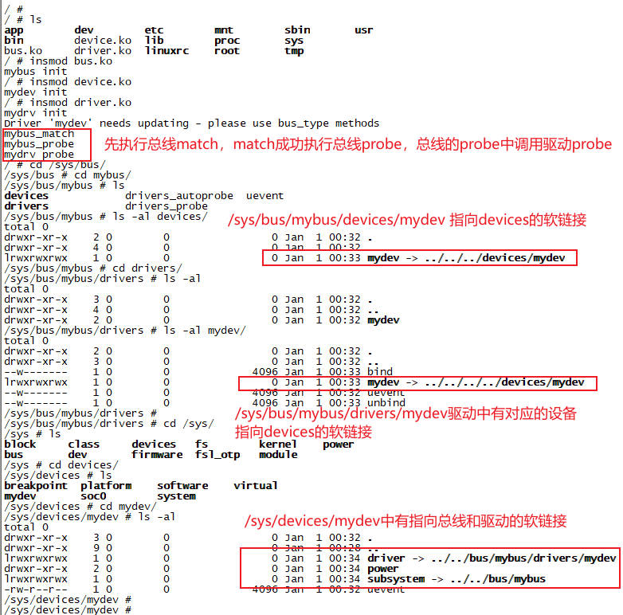

### 16.2 `driver_register`源码分析

驱动注册源码分析的关键步骤，过程如下：

1. 总线检查：确保驱动要注册的总线本身已经初始化完成。这是驱动注册的前提
2. 冲突检查：这是一个历史遗留的警告。在早期的驱动设计中，一些总线操作(如probe、remove)可能会同时存在于总线类型和驱动中。此检查旨在提醒开发者更新旧的驱动代码
3. 唯一性检查：通过`driver_find`函数在指定总线的驱动链表中查找是否已有同名的驱动被注册。`driver_find`内部会调用`kset_find_obj`在总线对应的`drivers_kset(驱动集合)`中遍历查找，已确保驱动名称的唯一性。如果找到，则返回`-EBUSY`错误
4. 核心注册`bus_add_driver`：这是最复杂也是最关键的一步，他完成了驱动注册的实质性工作

```c
int driver_register(struct device_driver *drv)
{
	int ret;
	struct device_driver *other;

    // 1. 总线检查
    BUG_ON(!drv->bus->p);

    // 2. 如果总线和驱动同时定义了probe、remove、shutdown, 则打印冲突日志
	if ((drv->bus->probe && drv->probe) ||
	    (drv->bus->remove && drv->remove) ||
	    (drv->bus->shutdown && drv->shutdown))
		printk(KERN_WARNING "Driver '%s' needs updating - please use "
			"bus_type methods\n", drv->name);

    // 3. 检查总线下是否已注册同名驱动
    other = driver_find(drv->name, drv->bus);
	if (other) {
		printk(KERN_ERR "Error: Driver '%s' is already registered, "
			"aborting...\n", drv->name);
		return -EBUSY;
	}

    // 4. 核心操作: 将驱动添加到总线
	ret = bus_add_driver(drv);

	return ret;
}
```

我们来分析一下`bus_add_driver`这个核心函数。

```c
int bus_add_driver(struct device_driver *drv)
{
	struct bus_type *bus;
	struct driver_private *priv;
	int error = 0;

    // 1. 分配并初始化驱动的私有数据结构
	priv = kzalloc(sizeof(*priv), GFP_KERNEL);

    // 2. 初始化驱动私有数据中的设备链表和节点
	klist_init(&priv->klist_devices, NULL, NULL);
	priv->driver = drv; // 关联驱动
	drv->p = priv;      // 驱动关联私有数据
	priv->kobj.kset = bus->p->drivers_kset; // 设置私有数据中kobject所属的集合kset, 为总线下的driver_kset
	error = kobject_init_and_add(&priv->kobj, &driver_ktype, NULL, "%s", drv->name);    // 初始化并添加驱动的kobject到sysfs

    // 3. 将驱动添加到总线的驱动列表中
	klist_add_tail(&priv->knode_bus, &bus->p->klist_drivers);

    // 4. 核心: 尝试驱动与设备的匹配(如果总线允许自动探测)
	if (drv->bus->p->drivers_autoprobe) {
		driver_attach(drv);
	}

	return 0;
}
```

1. `sysfs`集成`kobject_init_and_add`: 该函数会在`/sys/bus/<bus-name>/drivers/`目录下创建一个与驱动同名的子目录. 他同时指定了该`kobject`的类型为`driver_ktype`，这定义了驱动目录在sysfs中的默认文件操作
2. 驱动-设备匹配`device_attach`: 这是最关键的步骤！如果总线的`drivers_autoprobe`标志为真，就会调用`driver_attach`
3. `driver_attach`函数，他会遍历总线上的所有设备，对每个设备调用`__driver_attach`函数
4. 用总线的`match`函数尝试匹配每个设备，如果`match`匹配成功，则调用`driver_probe_device`函数

    ```c
    int driver_attach(struct device_driver *drv)
    {
        return bus_for_each_dev(drv->bus, NULL, drv, __driver_attach);
    }

    int bus_for_each_dev(struct bus_type *bus, struct device *start, void *drv, __driver_attach)
    {
        struct klist_iter i;
        struct device *dev;

        klist_iter_init_node(&bus->p->klist_devices, &i, (start ? &start->p->knode_bus : NULL));
        while ((dev = next_device(&i)) && !error)
            error = __driver_attach(dev, drv);
        klist_iter_exit(&i);
        return error;
    }

    static int __driver_attach(struct device *dev, void *drv)
    {
        if (true == driver_match_device(drv, dev)) {
            driver_probe_device(drv, dev);
        }
    }
    ```

最后一个关键点。我们再看下`driver_probe_device`函数做了些什么

```c
int driver_probe_device(struct device_driver *drv, struct device *dev)
{
	really_probe(dev, drv);
}

static int really_probe(struct device *dev, struct device_driver *drv)
{
    // 1. 设备绑定对应的驱动
	dev->driver = drv;

    // 2. 创建sysfs层次结构
	driver_sysfs_add(dev);

    // 3. 优先执行总线的probe函数, 否则执行驱动的probe函数
	if (dev->bus->probe) {
		ret = dev->bus->probe(dev);
	}
    else if (drv->probe) {
		ret = drv->probe(dev);
	}
}
```

创建的`sysfs`软链接目录层次结构如下所示：

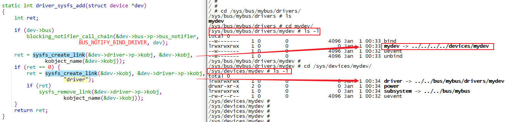

### 16.3 `__platform_driver_register`源码分析

```c
int __platform_driver_register(struct platform_driver *drv, struct module *owner)
{
	drv->driver.owner = owner;
	drv->driver.bus = &platform_bus_type;

    // 设置统一的probe remove shutdown函数. 这些统一函数里面再调用platform驱动的函数
	if (drv->probe)
		drv->driver.probe = platform_drv_probe;
	if (drv->remove)
		drv->driver.remove = platform_drv_remove;
	if (drv->shutdown)
		drv->driver.shutdown = platform_drv_shutdown;

	return driver_register(&drv->driver);
}
```

设置统一的probe remove shutdown函数. 这些统一函数里面再调用platform驱动的函数。以`probe`为例我们看下实现：

```c
static int platform_drv_probe(struct device *_dev)
{
	struct platform_driver *drv = to_platform_driver(_dev->driver);
	struct platform_device *dev = to_platform_device(_dev);
	int ret;

    // 设置默认的的时钟
	ret = of_clk_set_defaults(_dev->of_node, false);

    // 调用platform_driver的probe函数
    ret = drv->probe(dev);

	return ret;
}
```
