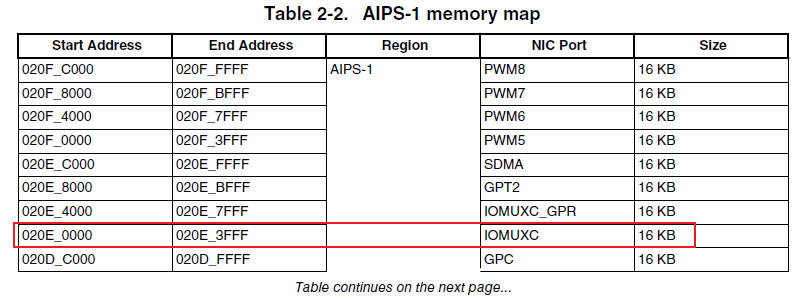
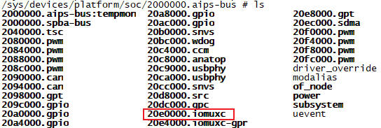
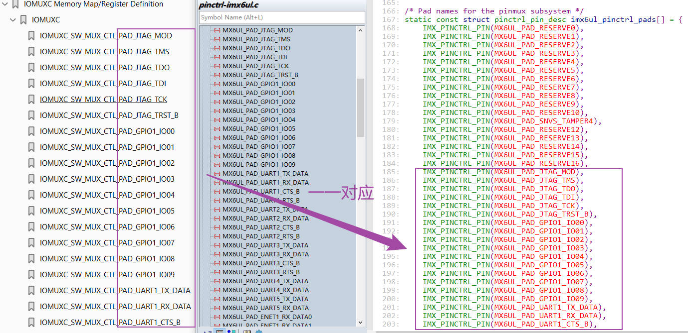

# pinctrl子系统

## 第1章 初识`pinctrl`子系统

Linux内核中的`pinctrl`子系统，是现代复杂SoC引脚管理的核心框架。它解决了嵌入式系统开发中，引脚功能复用和配置的标准化问题，体现了设备与驱动分离的思想。

### 1.1 `pinctrl`子系统由来

在早期或简单的嵌入式系统中，配置一个引脚功能(如设置为GPIO、I2C或UART)通常通过直接操作相应的硬件寄存器来完成。开发者需要仔细查阅芯片数据手册，找到正确的寄存器位域并进行设置。这种做法存在几个明显的问题：

+ 代码重复与冗余：不同驱动代码中会散布着对相同或相似引脚配置的操作，导致代码大量重复
+ 维护困难：引脚配置与具体的驱动代码和平台硬件耦合过于紧密。一旦硬件引脚链接发生变更，通常需要修改并重新编译内核源码，非常繁杂且容易出错
+ 缺乏统一抽象：没有标准的接口来管理引脚复用和配置，导致各驱动实现方式不一，增加了内核复杂度
+ 板级定制麻烦：为不同开发板或硬件变体适配引脚，需要修改多处代码，降低了代码的可重用性

为了解决这些问题，Linux内核引入了`pinctrl`子系统，旨在为SoC引脚的复用和配置提供一种统一的管理方式，并通过设备树将引脚配置信息从驱动代码中剥离出来，显著提高了代码的可重用性和可维护性。

### 1.2 关键概念抽象

为了使`pinctrl`子系统能够灵活运作，pinctrl子系统定义了几个核心概念：

+ `Pin Controller`(引脚控制器)：这是一个软件概念。对应SoC中负责控制引脚复用和配置的硬件模块(如IOMUXC)
+ `Client Device`(客户端设备)：指需要使用引脚的设备，如I2C控制器、SPI控制器、GPIO控制器等。他们通过设备树引用`Pin Controller`中定义好的配置
+ `Pin State`(引脚状态)：这是`pinctrl`子系统的核心抽象。它代表设备在特定工作阶段(如默认工作、休眠、空闲)下所需的一组引脚集合。常见的状态有default、sleep、idle
+ `Pin Group`(引脚组)：将逻辑上属于同一功能的一组引脚(如一个UART的TX和RX引脚归为一组)，方便统一管理和配置

### 1.3 设备与驱动如何分离

`pinctrl`子系统是`设备和驱动分离`思想的典范，这种分离主要通过设备树来实现。在设备树中，引脚配置信息被完全抽离出来，不再硬编码在驱动代码里。

#### 1.3.1 `Pin Controller`节点

由SoC厂商或BSP开发者，在`.dtsi`和`.dts`文件中定义，描述了控制器所能控制的所有引脚以及可用的功能组和状态。

以`imx6ull`的设备树为例。我们看下`Pin Controller`节点如何定义：

```dts
// imx6ull.dtsi
iomuxc: iomuxc@020e0000 {
    compatible = "fsl,imx6ul-iomuxc";
    reg = <0x020e0000 0x4000>;
};

// imx6ull_iot.dts 定义了一个名为uart1grp的引脚组和状态
&iomuxc {
	pinctrl-names = "default";
	pinctrl-0 = <&pinctrl_hog_1>;
	imx6ul-evk {
        pinctrl_uart1: uart1grp {
			fsl,pins = <
				MX6UL_PAD_UART1_TX_DATA__UART1_DCE_TX 0x1b0b1   // 配置引脚复用和电气属性
				MX6UL_PAD_UART1_RX_DATA__UART1_DCE_RX 0x1b0b1
			>;
		};
    };
};
```

下面是详细分析。

1. 芯片厂商在`.dtsi`中定义了`iomuxc`复用控制器的`compatile`属性和寄存器范围，相当于之定义的芯片，没有定义板卡。只定义了这两个值就结束了，为什么？
    + `compatible = "fsl,imx6ul-iomuxc"`这是给Linux内核驱动的`pinctrl`子系统代码使用的
        ```c
        static struct of_device_id imx6ul_pinctrl_of_match[] = {
            { .compatible = "fsl,imx6ul-iomuxc", .data = &imx6ul_pinctrl_info, },
            { /* sentinel */ }
        };

        static int imx6ul_pinctrl_probe(struct platform_device *pdev)
        {
            // xxx
            match = of_match_device(imx6ul_pinctrl_of_match, &pdev->dev);
        }

        static struct platform_driver imx6ul_pinctrl_driver = {
            .driver = {
                .name = "imx6ul-pinctrl",
                .of_match_table = imx6ul_pinctrl_of_match,
            },
            .probe = imx6ul_pinctrl_probe,
        };
        ```
    + `reg = <0x020e0000 0x4000>`这是芯片中`IOMUXC`控制器的寄存器范围
        

2. 板卡厂商在`dts`中，通过`&iomuxc`引用节点的方式，给`iomuxc`复用控制器，添加具体的硬件模块。下面的代码就是在`iomuxc`下添加了一组硬件串口引脚

    ```dts
    pinctrl_uart1: uart1grp {
        fsl,pins = <
            MX6UL_PAD_UART1_TX_DATA__UART1_DCE_TX 0x1b0b1
            MX6UL_PAD_UART1_RX_DATA__UART1_DCE_RX 0x1b0b1
        >;
    };
    ```

3. 这种2级定义的方式：SoC厂商+板卡厂商。最终反编译的`dts`文件，就会在`dts`的`iomuxc`节点下插入一堆设备。我们看下反汇编：我们`&iomuxc`添加的节点，直接插入到了`iomuxc`下，相当于直接在`.dtsi`下直接编辑，二者的效果一致。同时，每个节点都定义了`phandle`指针，后面我们`&pinctrl_uart1`引用`pinctrl`子系统时，实际上就是使用这个指针

    ```dts
    iomuxc@020e0000 {
        compatible = "fsl,imx6ul-iomuxc";
        reg = <0x20e0000 0x4000>;
        pinctrl-names = "default";
        pinctrl-0 = <0x1e>;

        imx6ul-evk {
            i2c1grp {
                fsl,pins = <0xb4 0x340 0x5a4 0x2 0x1 0x4001b8b0 0xb8 0x344 0x5a8 0x2 0x2 0x4001b8b0>;
                linux,phandle = <0x2b>;
                phandle = <0x2b>;
            };

            // xxx

            uart1grp {
                fsl,pins = <0x84 0x310 0x0   0x0 0x0 0x1b0b1 
                            0x88 0x314 0x624 0x0 0x3 0x1b0b1>;
                linux,phandle = <0x8>;
                phandle = <0x8>;
            };
        };
    };
    ```

#### 1.3.2 `Client Device`节点

设备驱动开发者或板级开发者，在设备节点中通过`pinctrl-属性`引用定义好的状态节点

```dts
// imx6ull_iot.dts
// 在UART1设备节点中，引用引脚配置
&uart1 {
	pinctrl-names = "default";      // 定义状态名称
	pinctrl-0 = <&pinctrl_uart1>;   // 引用默认状态的配置
	status = "okay";
};
```

我们的`Client Device`节点引用`pinctrl`配置，就是使用`phandle`指针。看下反汇编：

```dts
serial@02020000 {
    compatible = "fsl,imx6ul-uart", "fsl,imx6q-uart", "fsl,imx21-uart";
    reg = <0x2020000 0x4000>;
    interrupts = <0x0 0x1a 0x4>;
    clocks = <0x1 0xbd 0x1 0xbe>;
    clock-names = "ipg", "per";
    status = "okay";
    pinctrl-names = "default";
    pinctrl-0 = <0x8>;  // 引用Pin Controller的uart1grp phandle指针
};
```

#### 1.3.3 驱动中的标准API

设备驱动无需关心具体芯片的寄存器操作细节，只需使用`pinctrl`提供的标准API。通过这几个简单的API调用，就可以在适当的时机(如probe函数中或电源管理回调中)切换引脚状态，完全无需接触底层硬件细节。

```c
// 设备驱动中获取和设置引脚状态的典型流程
struct pinctrl *p;
struct pinctrl_state *state;

p = devm_pinctrl_get(&pdev->dev); // 获取该设备的 pinctrl 句柄
if (IS_ERR(p)) { ... }

state = pinctrl_lookup_state(p, "default"); // 查找名为 "default" 的状态
if (IS_ERR(state)) { ... }

ret = pinctrl_select_state(p, state); // 应用该状态的引脚配置
if (ret < 0) { ... }
```

### 1.4 为何要这样设计

这种`设备和驱动分离`的设计，带来了很多好处：

| 优势 | 说明 |
| - | - |
| 硬件抽象与接口统一 | 为所有芯片的引脚管理提供了统一的接口，驱动开发者无需关心具体芯片的寄存器操作细节。芯片厂商负责实现这些接口，屏蔽了硬件差异 |
| 增强可移植性和可维护性 | 同一份驱动代码可以服务于不同的硬件平台，只需修改设备树即可，提高了代码的复用性。驱动代码不再充斥大量的硬件配置细节，更加清晰和专注于业务逻辑 |
| 支持动态配置和电源管理 | 支持定义多种引脚状态(如default、sleep)，并在运行时动态切换，这为电源管理提供了基础，设备在不同状态下可以自动配置为最合适的引脚状态以节省功耗 |
| 与GPIO子系统协同工作 | pinctrl子系统与gpio子系统关系密切。pinctrl负责将引脚复用为GPIO功能并配置电气属性，然后GPIO子系统接管并进行输入输出、中断等操作 |

## 第2章 `pinctrl`设备树

pinctrl子系统通过设备树管理SoC引脚的复用功能(如GPIO、I2C、SPI)和电气属性(如上下/拉、驱动强度)。设备树中的pinctrl配置通常分为两大块：

+ 服务端：描述引脚控制器的硬件资源本身，定义所有可用的引脚配置组和状态。它位于`Pin Controller`节点下(如`&iomuxc`或`&pinctrl`)
+ 客户端：描述具体设备如何使用这些引脚配置，即在设备节点中引用服务端定义好的配置状态

### 2.1 服务端配置

服务端在`Pin Controller`节点下定义各种引脚配置组，通常使用子节点的形式。这些组包含了引脚复用和电气属性的具体配置信息。

#### 2.1.1 NXP(imx)平台示例

```dts
// 在iomuxc控制器节点中定义引脚组
&iomuxc {
    // 定义一个用于I2C2的引脚组，名为i2c2grp
    pinctrl_i2c2: i2c2grp {
        fsl,pins = <
            // 引脚宏               电气属性值
            MX6UL_PAD_UART5_TX_DATA__I2C2_SCL  0x4001b8b0  // SCL引脚，复用为I2C2_SCL，并配置电气属性
            MX6UL_PAD_UART5_RX_DATA__I2C2_SDA  0x4001b8b0  // SDA引脚，复用为I2C2_SDA，并配置电气属性
        >;
    };

    // 定义一个GPIO按键的引脚组
    pinctrl_gpio_keys: gpio-keysgrp {
        fsl,pins = <
            MX6UL_PAD_GPIO1_IO00__GPIO1_IO00   0x17059  // 配置为GPIO，带上拉
        >;
    };
};
```

+ `fsl,pins`: NXP平台使用的属性，每个条目包括一个`引脚宏`(指定引脚和复用功能)和一个`电气属性值`(32位十六进制数，配置上拉、下拉、驱动强度)
+ `引脚宏`: (如`MX6UL_PAD_UART5_TX_DATA__I2C2_SCL`)在芯片头文件中定义，指明了物理引脚和要复用的功能
+ `电气属性值`: 控制引脚的上拉、下拉电阻、驱动强度、压摆率等特性

#### 2.1.2 RockChip平台示例

```dts
// 在pinctrl节点中定义引脚组
&pinctrl {
    // 定义一个LED控制引脚组
    led1_ctl: led1-ctl {
        rockchip,pins = <
            // Bank, Pin Number, Function, Configuration
            0 RK_PB0 RK_FUNC_GPIO &pcfg_pull_up  // 将Bank0的PB0引脚配置为GPIO功能，并使能上拉
        >;
    };

    // 定义一个UART7的引脚组
    uart7m1_xfer: uart7m1-xfer {
        rockchip,pins = <
            3 RK_PC5 4 &pcfg_pull_up  // TX引脚，复用模式4，上拉
            3 RK_PC4 4 &pcfg_pull_up  // RX引脚，复用模式4，上拉
        >;
    };

    // 定义一个中断引脚配置
    hym8563_int: hym8563-int {
        rockchip,pins = <0 RK_PB0 RK_FUNC_GPIO &pcfg_pull_up>; // 配置为GPIO并上拉，用于中断
    };
};
```

+ `rockchip,pins`: RockChip平台使用的属性
+ `配置项通常包括`: GPIO Bank、引脚编号、复用功能(如`RK_FUNC_GPIO`)、预定义的配置参数(如`&pcfg_pull_up`)

### 2.2 客户端配置

客户端配置在使用引脚的`设备节点`中。通过`pinctrl-names`和`pinctrl-0`、`pinctrl-1`等属性引用服务端定义的引脚组，指定设备在不同状态下的引脚配置。

#### 2.2.1 I2C控制器设备示例

```dts
// 在I2C2设备节点中引用pinctrl配置
&i2c2 {
    clock-frequency = <100000>; // I2C总线频率100kHz
    pinctrl-names = "default";         // 定义引脚状态名为"default"
    pinctrl-0 = <&pinctrl_i2c2>;       // "default"状态引用服务端的pinctrl_i2c2组
    status = "okay";                    // 启用该设备

    // 假设一个连接到I2C2的RTC芯片
    rtc@51 {
        compatible = "nxp,pcf8563";
        reg = <0x51>;
    };
};
```

#### 2.2.2 GPIO按键设备示例

```dts
// 一个GPIO按键设备节点
gpio-keys {
    compatible = "gpio-keys";
    pinctrl-names = "default";                 // 状态名
    pinctrl-0 = <&pinctrl_gpio_keys>;          // 引用GPIO按键的引脚配置组

    // 定义一个按键
    power-button {
        label = "Power Button";
        gpios = <&gpio1 0 GPIO_ACTIVE_LOW>;    // 指定具体的GPIO
        linux,code = <KEY_POWER>;             // 按键映射为Power键
    };
};
```

#### 2.2.3 多状态配置示例

设备可以有多个状态，如默认(`default`)和睡眠(`sleep`)

```dts
// 一个设备支持多种引脚状态
&usdhc1 { // SD卡控制器
    pinctrl-names = "default", "sleep";        // 定义两种状态：默认和睡眠
    pinctrl-0 = <&pinctrl_usdhc1_default>;     // 默认状态使用正常配置
    pinctrl-1 = <&pinctrl_usdhc1_sleep>;       // 睡眠状态使用省电配置
    status = "okay";
};
```

#### 2.2.4 客户端与服务端角色对比

| 特性 | 服务端 | 客户端 |
| - | - | - |
| 所在位置 | `Pin Controller`节点下(如`&iomuxc`、`&pinctrl`) | 具体设备节点中(如`&i2c2`、`&uart1`) |
| 主要作用 | `定义`所有可用的引脚配置组和状态，描述硬件资源本身 | `引用`服务端定义的配置，描述设备如何使用这些资源 |
| 关键属性 | 平台相关属性(如`fsl,pins`、`rockchip,pins`) | `pinctrl-names`、`pinctrl-0`、`pinctrl-1` |
| 内容 | 具体的引脚复用功能、电气属性配置值 | 引脚状态名称、指向服务端配置组的引用 |
| 定义者 | SoC厂商、BSP开发者 | 板级开发者、设备驱动开发者 |

### 2.3 总结

设备树中存放的只是设备的描述信息，而具体的功能实现取决于相应的`pinctrl`驱动，可以根据`imx6ull.dtsi`设备树中`iomuxc`节点的`compatible`属性进行查找，可以查到`pinctrl`的驱动文件是内核源码的`/driver/pinctrl/freescale/pinctrl-imx6ul.c`，下一节将对`pinctrl`的驱动部分进行简单的介绍。

## 第3章 `pinctrl`驱动

### 3.1 `pinctrl`驱动为`platform`驱动

受限进入到Linux内核源码目录下的`/drivers/pinctrl/freescale/pinctrl-imx6ul.c`驱动文件中，找到驱动的入口函数。具体内容如下：

```c
static struct of_device_id imx6ul_pinctrl_of_match[] = {
	{ .compatible = "fsl,imx6ul-iomuxc", .data = &imx6ul_pinctrl_info, },
	{ .compatible = "fsl,imx6ull-iomuxc-snvs", .data = &imx6ull_snvs_pinctrl_info, },
	{ /* sentinel */ }
};

static struct platform_driver imx6ul_pinctrl_driver = {
	.driver = {
		.name = "imx6ul-pinctrl",
		.of_match_table = imx6ul_pinctrl_of_match,
	},
	.probe = imx6ul_pinctrl_probe,
};

static int __init imx6ul_pinctrl_init(void)
{
	return platform_driver_register(&imx6ul_pinctrl_driver);
}
```

可以看到，`pinctrl`驱动使用的是`platform`总线，当设备和驱动匹配成功之后，会调用`imx6ul_pinctrl_probe`函数进行初始化。

```c
static int imx6ul_pinctrl_probe(struct platform_device *pdev)
{
	return imx_pinctrl_probe(pdev, imx6ul_pinctrl_info);
}

```

这个函数里面，继续调用了`imx_pinctrl_probe`，这是nxp imx系列通用的探测函数，通常被具体型号的驱动调用。这个函数过于复杂，我们最后再分析。

### 3.2 `struct pinctrl_desc`结构体

`pinctrl_desc`结构体在Linux内核中的定义如下，它充当了`引脚控制器的说明书`。

```c
struct pinctrl_desc {
	const char *name;                       // 引脚控制器的名称
	struct pinctrl_pin_desc const *pins;    // 引脚描述符数组
	unsigned int npins;                     // 引脚描述符数组的大小
	const struct pinctrl_ops *pctlops;      // 引脚控制ops
	const struct pinmux_ops *pmxops;        // 引脚复用ops
	const struct pinconf_ops *confops;      // 引脚配置ops
};
```

+ `name`: 引脚控制器的名称，用于标识控制器的唯一性。通常在调试和`sysfs`中显示
    + 以`imx6ull`为例，设备树中的设备节点名为`iomuxc@020e0000`
        ```dts
        iomuxc@020e0000 {   // 节点名: iomuxc@020e0000
            compatible = "fsl,imx6ul-iomuxc";
            reg = <0x20e0000 0x4000>;
        };
        ```
    + 他在sysfs中对应的文件名为`20e0000.iomuxc`
        

+ `pins`和`npins`: `pins`是一个指向`struct pinctrl_pin_desc`结构体数组的指针，该数组描述了该控制器管理的所有物理引脚。`npins`指明了该数组中元素的数量，即该控制器管理的引脚总数
    ```c
    struct pinctrl_pin_desc {
        unsigned number;    // 引脚的编号(索引)
        const char *name;   // 引脚的名称(字符串标识)
    };
    ```
    + 以`imx6ull`为例，在`pinctrl-imx6ul.c`中定义了一个庞大的`imx6ul_pinctrl_pads`数组。并使用`IMX_PINCTRL_PIN`宏来初始化每个引脚描述符，将芯片手册中的引脚编号与人类可读的名称关联起来
        

+ `pctlops`: 该结构体包含了用于`管理引脚组`的操作函数。`引脚组`是将多个在逻辑上相关的引脚(如一个UART的所有引脚)组合在一起，方便统一配置
    1. `get_groups_count`: 获取该引脚控制器支持的`引脚组总数`。在imx6ull的驱动中，此函数会返回解析的设备树中，iomuxc下引脚组`xxx_grp`的个数。下面的设备树中，有2个group: i2c1grp、uart1grp。所以返回2
        ```dts
        iomuxc@020e0000 {
            compatible = "fsl,imx6ul-iomuxc";
            reg = <0x20e0000 0x4000>;
            pinctrl-names = "default";
            pinctrl-0 = <0x1e>;

            imx6ul-evk {    // function节点
                i2c1grp {
                    fsl,pins = <0xb4 0x340 0x5a4 0x2 0x1 0x4001b8b0 
                                0xb8 0x344 0x5a8 0x2 0x2 0x4001b8b0>;
                    linux,phandle = <0x2b>;
                    phandle = <0x2b>;
                };

                uart1grp {
                    fsl,pins = <0x84 0x310 0x0   0x0 0x0 0x1b0b1
                                0x88 0x314 0x624 0x0 0x3 0x1b0b1>;
                    linux,phandle = <0x8>;
                    phandle = <0x8>;
                };
            };
        };
        ```
    2. `get_group_name`: 给定索引`selector`，获取对应引脚组的名称`xxx_grp`。上面的设备树中，`selector=0`返回`i2c1grp`，`selector=1`返回`uart1grp`
    3. `get_group_pins`: 给定索引`selector`，获取该引脚组所包含的所有引脚的编号和引脚数量

+ `pinmux_ops`: 该结构体定义了SoC中的`引脚功能复用`
    1. `get_functions_count`: 返回设备节点中`function节点`的数量。下面的设备树中，只有1个function节点，所以返回1
        ```dts
        iomuxc@020e0000 {
            compatible = "fsl,imx6ul-iomuxc";
            reg = <0x20e0000 0x4000>;
            pinctrl-names = "default";
            pinctrl-0 = <0x1e>;

            imx6ul-evk {    // function节点
                i2c1grp {   // group节点
                    fsl,pins = <0xb4 0x340 0x5a4 0x2 0x1 0x4001b8b0 
                                0xb8 0x344 0x5a8 0x2 0x2 0x4001b8b0>;
                    linux,phandle = <0x2b>;
                    phandle = <0x2b>;
                };

                uart1grp {  // group节点
                    fsl,pins = <0x84 0x310 0x0   0x0 0x0 0x1b0b1
                                0x88 0x314 0x624 0x0 0x3 0x1b0b1>;
                    linux,phandle = <0x8>;
                    phandle = <0x8>;
                };
            };
        };
        ```
    2. `imx_pmx_get_func_name`: 根据给定的索引`selector`，获取对应复用功能的名称。上面的设备树中，返回值为`"imx6ul-evk"`
    3. `get_function_groups`: 根据给定的索引`selector`，获取该`function`节点下所有的`group`节点。上面的设备树中，返回`i2c1grp`、`uart1grp`
    4. `set_mux`: *最核心的函数*。用于将指定的`引脚组`设置为指定的复用功能
    5. `gpio_request_enable`: 当某个引脚被请求用作GPIO时，此函数会被调用。它负责将该引脚配置为GPIO功能，并可能进行一些基本的初始化
    6. `gpio_set_direction`: 当GPIO的方向(输入/输出)被设置时，此函数会被调用

+ `pinconf_ops`: 该结构体定义了*配置引脚电气属性*的操作函数集。这些函数负责控制引脚的硬件属性，如上拉/下拉电阻、驱动强度等。与`pinmux_ops`(负责功能复用)相辅相成，`pinconf_ops`确保了引脚在物理层面的正确行为
    1. `pin_config_get`: 获取单个引脚的当前配置，返回电气属性的寄存器值
    2. `pin_config_set`: 设置单个引脚的电气属性值。这是最常用的函数，把配置值写于pad控制寄存器

### 3.3 `imx_pinctrl_probe`源码分析

我们从设备树开始，一步步分析`pinctrl`子系统是怎么跑起来的。

#### 3.3.1 设备树定义了`compatible = "fsl,imx6ul-iomuxc"`，用来匹配驱动

```dts
iomuxc@020e0000 {
    compatible = "fsl,imx6ul-iomuxc";   // compatible属性，用来匹配platform驱动pinctrl-imx6ul.c
    reg = <0x20e0000 0x4000>;           // iomuxc硬件的寄存器地址

    imx6ul-evk {    // function节点
        i2c1grp {       // group节点
            fsl,pins = <0xb4 0x340 0x5a4 0x2 0x1 0x4001b8b0 0xb8 0x344 0x5a8 0x2 0x2 0x4001b8b0>;
            linux,phandle = <0x2b>;
            phandle = <0x2b>;
        };

        uart1grp {      // group节点
            fsl,pins = <0x84 0x310 0x0 0x0 0x0 0x1b0b1 0x88 0x314 0x624 0x0 0x3 0x1b0b1>;
            linux,phandle = <0x8>;
            phandle = <0x8>;
        };
    };
};
```

#### 3.3.2 `platform`驱动`pinctrl-imx6ul.c`匹配`iomuxc`设备

我们前面提到，在`pinctrl-imx6ul.c`中定义了一个庞大的`imx6ul_pinctrl_pads`数组，用来描述该控制器管理的所有物理引脚。就是下面这样，这个表跟芯片手册的`MUX`意义对应。

```c
static const struct pinctrl_pin_desc imx6ul_pinctrl_pads[] = {
    // ...
	IMX_PINCTRL_PIN(MX6UL_PAD_JTAG_MOD),
	IMX_PINCTRL_PIN(MX6UL_PAD_JTAG_TMS),
	IMX_PINCTRL_PIN(MX6UL_PAD_JTAG_TDO),
	IMX_PINCTRL_PIN(MX6UL_PAD_JTAG_TDI),
	IMX_PINCTRL_PIN(MX6UL_PAD_JTAG_TCK),
	IMX_PINCTRL_PIN(MX6UL_PAD_JTAG_TRST_B),
	IMX_PINCTRL_PIN(MX6UL_PAD_GPIO1_IO00),
	IMX_PINCTRL_PIN(MX6UL_PAD_GPIO1_IO01),
	IMX_PINCTRL_PIN(MX6UL_PAD_GPIO1_IO02),
	IMX_PINCTRL_PIN(MX6UL_PAD_UART1_TX_DATA),
	IMX_PINCTRL_PIN(MX6UL_PAD_UART1_RX_DATA),
};
```

NXP为了适配i.MX系列芯片的特定需求和功能，对`struct pinctrl_pin_desc`又进行了一次封装。如下所示：

```c
struct imx_pinctrl_soc_info {
	struct device *dev;
	const struct pinctrl_pin_desc *pins;    // 指向imx6ul_pinctrl_pads数组，封装了iomuxc能管理的所有物理引脚
	unsigned int npins;                     // imx6ul_pinctrl_pads数组元素的个数，即iomuxc管理的引脚数
	struct imx_pin_reg *pin_regs;
	struct imx_pin_group *groups;
	unsigned int ngroups;
	struct imx_pmx_func *functions;
	unsigned int nfunctions;
};
```

当驱动代码`pinctrl-imx6ul.c`根据`compatible = "fsl,imx6ul-iomuxc"`匹配到设备节点后，就去执行`imx6ul_pinctrl_probe`函数。

```c
static struct platform_driver imx6ul_pinctrl_driver = {
	.driver = {
		.name = "imx6ul-pinctrl",
		.of_match_table = {
            .compatible = "fsl,imx6ul-iomuxc",
            .data = &imx6ul_pinctrl_info,
        },
	},
	.probe = imx6ul_pinctrl_probe,
};

static int __init imx6ul_pinctrl_init(void)
{
	return platform_driver_register(&imx6ul_pinctrl_driver);
}
```

`imx6ul_pinctrl_probe`函数，这里继续调用了`imx_pinctrl_probe`函数，这是imx系列的通用探测函数。然后还传入了我们封装的`struct imx_pinctrl_soc_info`结构体，这个结构体初始值只有2个参数：imx6ul_pinctrl_pads(引脚数组)、引脚数组个数。

```c
static struct imx_pinctrl_soc_info imx6ul_pinctrl_info = {
	.pins = imx6ul_pinctrl_pads,
	.npins = ARRAY_SIZE(imx6ul_pinctrl_pads),
};

static int imx6ul_pinctrl_probe(struct platform_device *pdev)
{
	return imx_pinctrl_probe(pdev, &imx6ul_pinctrl_info);
}
```

#### 3.3.3 `imx_pinctrl_probe`函数一阶段：根据`iomuxc`设备节点，填充`imx6ul_pinctrl_info`结构体

现在先不关心如何注册`pinctrl`。上一节说到，`imx6ul_pinctrl_info`这个结构体初始只有2个参数：`pins`、`npins`。当前一阶段要做的事情是，根据`iomuxc`设备节点，继续填充`imx6ul_pinctrl_info`结构体。

我们要向`imx6ul_pinctrl_info`中填充的内容包括：

1. `struct device`设备
2. `function`节点个数
3. 指向`function`结构体数组的指针。因为可能有多个`function`节点，每个节点信息都保存到结构体中，形成数组
4. `group`节点个数。设备树可能有多个`function`节点，每个节点又有多个`group`节点。这里的`group`个数，指的是全部`function`下的`group`之和
5. 指向`group`结构体数组的指针。因为我们必然是有多个`group`节点，那就需要数组了

```c

```


