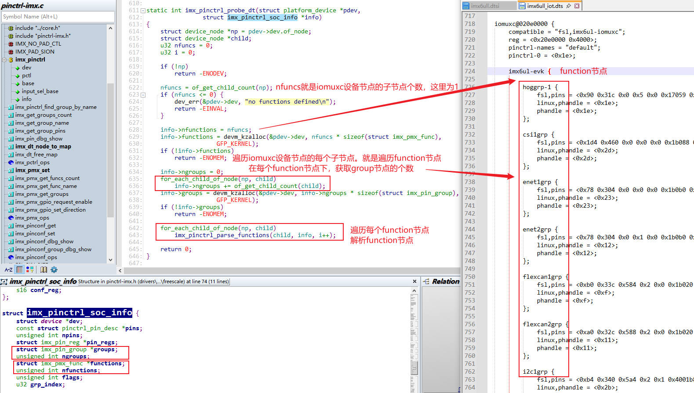

# pinctrl子系统

## 第1章 初识`pinctrl`子系统

Linux内核中的`pinctrl`子系统，是现代复杂SoC引脚管理的核心框架。它解决了嵌入式系统开发中，引脚功能复用和配置的标准化问题，体现了设备与驱动分离的思想。

### 1.1 `pinctrl`子系统由来

在早期或简单的嵌入式系统中，配置一个引脚功能(如设置为GPIO、I2C或UART)通常通过直接操作相应的硬件寄存器来完成。开发者需要仔细查阅芯片数据手册，找到正确的寄存器位域并进行设置。这种做法存在几个明显的问题：

+ 代码重复与冗余：不同驱动代码中会散布着对相同或相似引脚配置的操作，导致代码大量重复
+ 维护困难：引脚配置与具体的驱动代码和平台硬件耦合过于紧密。一旦硬件引脚链接发生变更，通常需要修改并重新编译内核源码，非常繁杂且容易出错
+ 缺乏统一抽象：没有标准的接口来管理引脚复用和配置，导致各驱动实现方式不一，增加了内核复杂度
+ 板级定制麻烦：为不同开发板或硬件变体适配引脚，需要修改多处代码，降低了代码的可重用性

为了解决这些问题，Linux内核引入了`pinctrl`子系统，旨在为SoC引脚的复用和配置提供一种统一的管理方式，并通过设备树将引脚配置信息从驱动代码中剥离出来，显著提高了代码的可重用性和可维护性。

### 1.2 关键概念抽象

为了使`pinctrl`子系统能够灵活运作，pinctrl子系统定义了几个核心概念：

+ `Pin Controller`(引脚控制器)：这是一个软件概念。对应SoC中负责控制引脚复用和配置的硬件模块(如IOMUXC)
+ `Client Device`(客户端设备)：指需要使用引脚的设备，如I2C控制器、SPI控制器、GPIO控制器等。他们通过设备树引用`Pin Controller`中定义好的配置
+ `Pin State`(引脚状态)：这是`pinctrl`子系统的核心抽象。它代表设备在特定工作阶段(如默认工作、休眠、空闲)下所需的一组引脚集合。常见的状态有default、sleep、idle
+ `Pin Group`(引脚组)：将逻辑上属于同一功能的一组引脚(如一个UART的TX和RX引脚归为一组)，方便统一管理和配置

### 1.3 设备与驱动如何分离

`pinctrl`子系统是`设备和驱动分离`思想的典范，这种分离主要通过设备树来实现。在设备树中，引脚配置信息被完全抽离出来，不再硬编码在驱动代码里。

#### 1.3.1 `Pin Controller`节点

由SoC厂商或BSP开发者，在`.dtsi`和`.dts`文件中定义，描述了控制器所能控制的所有引脚以及可用的功能组和状态。

以`imx6ull`的设备树为例。我们看下`Pin Controller`节点如何定义：

```dts
// imx6ull.dtsi
iomuxc: iomuxc@020e0000 {
    compatible = "fsl,imx6ul-iomuxc";
    reg = <0x020e0000 0x4000>;
};

// imx6ull_iot.dts 定义了一个名为uart1grp的引脚组和状态
&iomuxc {
	pinctrl-names = "default";
	pinctrl-0 = <&pinctrl_hog_1>;
	imx6ul-evk {
        pinctrl_uart1: uart1grp {
			fsl,pins = <
				MX6UL_PAD_UART1_TX_DATA__UART1_DCE_TX 0x1b0b1   // 配置引脚复用和电气属性
				MX6UL_PAD_UART1_RX_DATA__UART1_DCE_RX 0x1b0b1
			>;
		};
    };
};
```

下面是详细分析。

1. 芯片厂商在`.dtsi`中定义了`iomuxc`复用控制器的`compatile`属性和寄存器范围，相当于之定义的芯片，没有定义板卡。只定义了这两个值就结束了，为什么？
    + `compatible = "fsl,imx6ul-iomuxc"`这是给Linux内核驱动的`pinctrl`子系统代码使用的
        ```c
        static struct of_device_id imx6ul_pinctrl_of_match[] = {
            { .compatible = "fsl,imx6ul-iomuxc", .data = &imx6ul_pinctrl_info, },
            { /* sentinel */ }
        };

        static int imx6ul_pinctrl_probe(struct platform_device *pdev)
        {
            // xxx
            match = of_match_device(imx6ul_pinctrl_of_match, &pdev->dev);
        }

        static struct platform_driver imx6ul_pinctrl_driver = {
            .driver = {
                .name = "imx6ul-pinctrl",
                .of_match_table = imx6ul_pinctrl_of_match,
            },
            .probe = imx6ul_pinctrl_probe,
        };
        ```
    + `reg = <0x020e0000 0x4000>`这是芯片中`IOMUXC`控制器的寄存器范围
        

2. 板卡厂商在`dts`中，通过`&iomuxc`引用节点的方式，给`iomuxc`复用控制器，添加具体的硬件模块。下面的代码就是在`iomuxc`下添加了一组硬件串口引脚

    ```dts
    pinctrl_uart1: uart1grp {
        fsl,pins = <
            MX6UL_PAD_UART1_TX_DATA__UART1_DCE_TX 0x1b0b1
            MX6UL_PAD_UART1_RX_DATA__UART1_DCE_RX 0x1b0b1
        >;
    };
    ```

3. 这种2级定义的方式：SoC厂商+板卡厂商。最终反编译的`dts`文件，就会在`dts`的`iomuxc`节点下插入一堆设备。我们看下反汇编：我们`&iomuxc`添加的节点，直接插入到了`iomuxc`下，相当于直接在`.dtsi`下直接编辑，二者的效果一致。同时，每个节点都定义了`phandle`指针，后面我们`&pinctrl_uart1`引用`pinctrl`子系统时，实际上就是使用这个指针

    ```dts
    iomuxc@020e0000 {
        compatible = "fsl,imx6ul-iomuxc";
        reg = <0x20e0000 0x4000>;
        pinctrl-names = "default";
        pinctrl-0 = <0x1e>;

        imx6ul-evk {
            i2c1grp {
                fsl,pins = <0xb4 0x340 0x5a4 0x2 0x1 0x4001b8b0 0xb8 0x344 0x5a8 0x2 0x2 0x4001b8b0>;
                linux,phandle = <0x2b>;
                phandle = <0x2b>;
            };

            // xxx

            uart1grp {
                fsl,pins = <0x84 0x310 0x0   0x0 0x0 0x1b0b1 
                            0x88 0x314 0x624 0x0 0x3 0x1b0b1>;
                linux,phandle = <0x8>;
                phandle = <0x8>;
            };
        };
    };
    ```

#### 1.3.2 `Client Device`节点

设备驱动开发者或板级开发者，在设备节点中通过`pinctrl-属性`引用定义好的状态节点

```dts
// imx6ull_iot.dts
// 在UART1设备节点中，引用引脚配置
&uart1 {
	pinctrl-names = "default";      // 定义状态名称
	pinctrl-0 = <&pinctrl_uart1>;   // 引用默认状态的配置
	status = "okay";
};
```

我们的`Client Device`节点引用`pinctrl`配置，就是使用`phandle`指针。看下反汇编：

```dts
serial@02020000 {
    compatible = "fsl,imx6ul-uart", "fsl,imx6q-uart", "fsl,imx21-uart";
    reg = <0x2020000 0x4000>;
    interrupts = <0x0 0x1a 0x4>;
    clocks = <0x1 0xbd 0x1 0xbe>;
    clock-names = "ipg", "per";
    status = "okay";
    pinctrl-names = "default";
    pinctrl-0 = <0x8>;  // 引用Pin Controller的uart1grp phandle指针
};
```

#### 1.3.3 驱动中的标准API

设备驱动无需关心具体芯片的寄存器操作细节，只需使用`pinctrl`提供的标准API。通过这几个简单的API调用，就可以在适当的时机(如probe函数中或电源管理回调中)切换引脚状态，完全无需接触底层硬件细节。

```c
// 设备驱动中获取和设置引脚状态的典型流程
struct pinctrl *p;
struct pinctrl_state *state;

p = devm_pinctrl_get(&pdev->dev); // 获取该设备的 pinctrl 句柄
if (IS_ERR(p)) { ... }

state = pinctrl_lookup_state(p, "default"); // 查找名为 "default" 的状态
if (IS_ERR(state)) { ... }

ret = pinctrl_select_state(p, state); // 应用该状态的引脚配置
if (ret < 0) { ... }
```

### 1.4 为何要这样设计

这种`设备和驱动分离`的设计，带来了很多好处：

| 优势 | 说明 |
| - | - |
| 硬件抽象与接口统一 | 为所有芯片的引脚管理提供了统一的接口，驱动开发者无需关心具体芯片的寄存器操作细节。芯片厂商负责实现这些接口，屏蔽了硬件差异 |
| 增强可移植性和可维护性 | 同一份驱动代码可以服务于不同的硬件平台，只需修改设备树即可，提高了代码的复用性。驱动代码不再充斥大量的硬件配置细节，更加清晰和专注于业务逻辑 |
| 支持动态配置和电源管理 | 支持定义多种引脚状态(如default、sleep)，并在运行时动态切换，这为电源管理提供了基础，设备在不同状态下可以自动配置为最合适的引脚状态以节省功耗 |
| 与GPIO子系统协同工作 | pinctrl子系统与gpio子系统关系密切。pinctrl负责将引脚复用为GPIO功能并配置电气属性，然后GPIO子系统接管并进行输入输出、中断等操作 |

## 第2章 `pinctrl`设备树

pinctrl子系统通过设备树管理SoC引脚的复用功能(如GPIO、I2C、SPI)和电气属性(如上下/拉、驱动强度)。设备树中的pinctrl配置通常分为两大块：

+ 服务端：描述引脚控制器的硬件资源本身，定义所有可用的引脚配置组和状态。它位于`Pin Controller`节点下(如`&iomuxc`或`&pinctrl`)
+ 客户端：描述具体设备如何使用这些引脚配置，即在设备节点中引用服务端定义好的配置状态

### 2.1 服务端配置

服务端在`Pin Controller`节点下定义各种引脚配置组，通常使用子节点的形式。这些组包含了引脚复用和电气属性的具体配置信息。

#### 2.1.1 NXP(imx)平台示例

```dts
// 在iomuxc控制器节点中定义引脚组
&iomuxc {
    // 定义一个用于I2C2的引脚组，名为i2c2grp
    pinctrl_i2c2: i2c2grp {
        fsl,pins = <
            // 引脚宏               电气属性值
            MX6UL_PAD_UART5_TX_DATA__I2C2_SCL  0x4001b8b0  // SCL引脚，复用为I2C2_SCL，并配置电气属性
            MX6UL_PAD_UART5_RX_DATA__I2C2_SDA  0x4001b8b0  // SDA引脚，复用为I2C2_SDA，并配置电气属性
        >;
    };

    // 定义一个GPIO按键的引脚组
    pinctrl_gpio_keys: gpio-keysgrp {
        fsl,pins = <
            MX6UL_PAD_GPIO1_IO00__GPIO1_IO00   0x17059  // 配置为GPIO，带上拉
        >;
    };
};
```

+ `fsl,pins`: NXP平台使用的属性，每个条目包括一个`引脚宏`(指定引脚和复用功能)和一个`电气属性值`(32位十六进制数，配置上拉、下拉、驱动强度)
+ `引脚宏`: (如`MX6UL_PAD_UART5_TX_DATA__I2C2_SCL`)在芯片头文件中定义，指明了物理引脚和要复用的功能
+ `电气属性值`: 控制引脚的上拉、下拉电阻、驱动强度、压摆率等特性

#### 2.1.2 RockChip平台示例

```dts
// 在pinctrl节点中定义引脚组
&pinctrl {
    // 定义一个LED控制引脚组
    led1_ctl: led1-ctl {
        rockchip,pins = <
            // Bank, Pin Number, Function, Configuration
            0 RK_PB0 RK_FUNC_GPIO &pcfg_pull_up  // 将Bank0的PB0引脚配置为GPIO功能，并使能上拉
        >;
    };

    // 定义一个UART7的引脚组
    uart7m1_xfer: uart7m1-xfer {
        rockchip,pins = <
            3 RK_PC5 4 &pcfg_pull_up  // TX引脚，复用模式4，上拉
            3 RK_PC4 4 &pcfg_pull_up  // RX引脚，复用模式4，上拉
        >;
    };

    // 定义一个中断引脚配置
    hym8563_int: hym8563-int {
        rockchip,pins = <0 RK_PB0 RK_FUNC_GPIO &pcfg_pull_up>; // 配置为GPIO并上拉，用于中断
    };
};
```

+ `rockchip,pins`: RockChip平台使用的属性
+ `配置项通常包括`: GPIO Bank、引脚编号、复用功能(如`RK_FUNC_GPIO`)、预定义的配置参数(如`&pcfg_pull_up`)

### 2.2 客户端配置

客户端配置在使用引脚的`设备节点`中。通过`pinctrl-names`和`pinctrl-0`、`pinctrl-1`等属性引用服务端定义的引脚组，指定设备在不同状态下的引脚配置。

#### 2.2.1 I2C控制器设备示例

```dts
// 在I2C2设备节点中引用pinctrl配置
&i2c2 {
    clock-frequency = <100000>; // I2C总线频率100kHz
    pinctrl-names = "default";         // 定义引脚状态名为"default"
    pinctrl-0 = <&pinctrl_i2c2>;       // "default"状态引用服务端的pinctrl_i2c2组
    status = "okay";                    // 启用该设备

    // 假设一个连接到I2C2的RTC芯片
    rtc@51 {
        compatible = "nxp,pcf8563";
        reg = <0x51>;
    };
};
```

#### 2.2.2 GPIO按键设备示例

```dts
// 一个GPIO按键设备节点
gpio-keys {
    compatible = "gpio-keys";
    pinctrl-names = "default";                 // 状态名
    pinctrl-0 = <&pinctrl_gpio_keys>;          // 引用GPIO按键的引脚配置组

    // 定义一个按键
    power-button {
        label = "Power Button";
        gpios = <&gpio1 0 GPIO_ACTIVE_LOW>;    // 指定具体的GPIO
        linux,code = <KEY_POWER>;             // 按键映射为Power键
    };
};
```

#### 2.2.3 多状态配置示例

设备可以有多个状态，如默认(`default`)和睡眠(`sleep`)

```dts
// 一个设备支持多种引脚状态
&usdhc1 { // SD卡控制器
    pinctrl-names = "default", "sleep";        // 定义两种状态：默认和睡眠
    pinctrl-0 = <&pinctrl_usdhc1_default>;     // 默认状态使用正常配置
    pinctrl-1 = <&pinctrl_usdhc1_sleep>;       // 睡眠状态使用省电配置
    status = "okay";
};
```

#### 2.2.4 客户端与服务端角色对比

| 特性 | 服务端 | 客户端 |
| - | - | - |
| 所在位置 | `Pin Controller`节点下(如`&iomuxc`、`&pinctrl`) | 具体设备节点中(如`&i2c2`、`&uart1`) |
| 主要作用 | `定义`所有可用的引脚配置组和状态，描述硬件资源本身 | `引用`服务端定义的配置，描述设备如何使用这些资源 |
| 关键属性 | 平台相关属性(如`fsl,pins`、`rockchip,pins`) | `pinctrl-names`、`pinctrl-0`、`pinctrl-1` |
| 内容 | 具体的引脚复用功能、电气属性配置值 | 引脚状态名称、指向服务端配置组的引用 |
| 定义者 | SoC厂商、BSP开发者 | 板级开发者、设备驱动开发者 |

### 2.3 总结

设备树中存放的只是设备的描述信息，而具体的功能实现取决于相应的`pinctrl`驱动，可以根据`imx6ull.dtsi`设备树中`iomuxc`节点的`compatible`属性进行查找，可以查到`pinctrl`的驱动文件是内核源码的`/driver/pinctrl/freescale/pinctrl-imx6ul.c`，下一节将对`pinctrl`的驱动部分进行简单的介绍。

## 第3章 `pinctrl`驱动

### 3.1 `pinctrl`驱动为`platform`驱动

受限进入到Linux内核源码目录下的`/drivers/pinctrl/freescale/pinctrl-imx6ul.c`驱动文件中，找到驱动的入口函数。具体内容如下：

```c
static struct of_device_id imx6ul_pinctrl_of_match[] = {
	{ .compatible = "fsl,imx6ul-iomuxc", .data = &imx6ul_pinctrl_info, },
	{ .compatible = "fsl,imx6ull-iomuxc-snvs", .data = &imx6ull_snvs_pinctrl_info, },
	{ /* sentinel */ }
};

static struct platform_driver imx6ul_pinctrl_driver = {
	.driver = {
		.name = "imx6ul-pinctrl",
		.of_match_table = imx6ul_pinctrl_of_match,
	},
	.probe = imx6ul_pinctrl_probe,
};

static int __init imx6ul_pinctrl_init(void)
{
	return platform_driver_register(&imx6ul_pinctrl_driver);
}
```

可以看到，`pinctrl`驱动使用的是`platform`总线，当设备和驱动匹配成功之后，会调用`imx6ul_pinctrl_probe`函数进行初始化。

```c
static int imx6ul_pinctrl_probe(struct platform_device *pdev)
{
	return imx_pinctrl_probe(pdev, imx6ul_pinctrl_info);
}

```

这个函数里面，继续调用了`imx_pinctrl_probe`，这是nxp imx系列通用的探测函数，通常被具体型号的驱动调用。这个函数过于复杂，我们最后再分析。

### 3.2 `struct pinctrl_desc`结构体

`pinctrl_desc`结构体在Linux内核中的定义如下，它充当了`引脚控制器的说明书`。

```c
struct pinctrl_desc {
	const char *name;                       // 引脚控制器的名称
	struct pinctrl_pin_desc const *pins;    // 引脚描述符数组
	unsigned int npins;                     // 引脚描述符数组的大小
	const struct pinctrl_ops *pctlops;      // 引脚控制ops
	const struct pinmux_ops *pmxops;        // 引脚复用ops
	const struct pinconf_ops *confops;      // 引脚配置ops
};
```

+ `name`: 引脚控制器的名称，用于标识控制器的唯一性。通常在调试和`sysfs`中显示
    + 以`imx6ull`为例，设备树中的设备节点名为`iomuxc@020e0000`
        ```dts
        iomuxc@020e0000 {   // 节点名: iomuxc@020e0000
            compatible = "fsl,imx6ul-iomuxc";
            reg = <0x20e0000 0x4000>;
        };
        ```
    + 他在sysfs中对应的文件名为`20e0000.iomuxc`
        

+ `pins`和`npins`: `pins`是一个指向`struct pinctrl_pin_desc`结构体数组的指针，该数组描述了该控制器管理的所有物理引脚。`npins`指明了该数组中元素的数量，即该控制器管理的引脚总数
    ```c
    struct pinctrl_pin_desc {
        unsigned number;    // 引脚的编号(索引)
        const char *name;   // 引脚的名称(字符串标识)
    };
    ```
    + 以`imx6ull`为例，在`pinctrl-imx6ul.c`中定义了一个庞大的`imx6ul_pinctrl_pads`数组。并使用`IMX_PINCTRL_PIN`宏来初始化每个引脚描述符，将芯片手册中的引脚编号与人类可读的名称关联起来
        

+ `pctlops`: 该结构体包含了用于`管理引脚组`的操作函数。`引脚组`是将多个在逻辑上相关的引脚(如一个UART的所有引脚)组合在一起，方便统一配置
    1. `get_groups_count`: 获取该引脚控制器支持的`引脚组总数`。在imx6ull的驱动中，此函数会返回解析的设备树中，iomuxc下引脚组`xxx_grp`的个数。下面的设备树中，有2个group: i2c1grp、uart1grp。所以返回2
        ```dts
        iomuxc@020e0000 {
            compatible = "fsl,imx6ul-iomuxc";
            reg = <0x20e0000 0x4000>;
            pinctrl-names = "default";
            pinctrl-0 = <0x1e>;

            imx6ul-evk {    // function节点
                i2c1grp {
                    fsl,pins = <0xb4 0x340 0x5a4 0x2 0x1 0x4001b8b0 
                                0xb8 0x344 0x5a8 0x2 0x2 0x4001b8b0>;
                    linux,phandle = <0x2b>;
                    phandle = <0x2b>;
                };

                uart1grp {
                    fsl,pins = <0x84 0x310 0x0   0x0 0x0 0x1b0b1
                                0x88 0x314 0x624 0x0 0x3 0x1b0b1>;
                    linux,phandle = <0x8>;
                    phandle = <0x8>;
                };
            };
        };
        ```
    2. `get_group_name`: 给定索引`selector`，获取对应引脚组的名称`xxx_grp`。上面的设备树中，`selector=0`返回`i2c1grp`，`selector=1`返回`uart1grp`
    3. `get_group_pins`: 给定索引`selector`，获取该引脚组所包含的所有引脚的编号和引脚数量

+ `pinmux_ops`: 该结构体定义了SoC中的`引脚功能复用`
    1. `get_functions_count`: 返回设备节点中`function节点`的数量。下面的设备树中，只有1个function节点，所以返回1
        ```dts
        iomuxc@020e0000 {
            compatible = "fsl,imx6ul-iomuxc";
            reg = <0x20e0000 0x4000>;
            pinctrl-names = "default";
            pinctrl-0 = <0x1e>;

            imx6ul-evk {    // function节点
                i2c1grp {   // group节点
                    fsl,pins = <0xb4 0x340 0x5a4 0x2 0x1 0x4001b8b0 
                                0xb8 0x344 0x5a8 0x2 0x2 0x4001b8b0>;
                    linux,phandle = <0x2b>;
                    phandle = <0x2b>;
                };

                uart1grp {  // group节点
                    fsl,pins = <0x84 0x310 0x0   0x0 0x0 0x1b0b1
                                0x88 0x314 0x624 0x0 0x3 0x1b0b1>;
                    linux,phandle = <0x8>;
                    phandle = <0x8>;
                };
            };
        };
        ```
    2. `imx_pmx_get_func_name`: 根据给定的索引`selector`，获取对应复用功能的名称。上面的设备树中，返回值为`"imx6ul-evk"`
    3. `get_function_groups`: 根据给定的索引`selector`，获取该`function`节点下所有的`group`节点。上面的设备树中，返回`i2c1grp`、`uart1grp`
    4. `set_mux`: *最核心的函数*。用于将指定的`引脚组`设置为指定的复用功能
    5. `gpio_request_enable`: 当某个引脚被请求用作GPIO时，此函数会被调用。它负责将该引脚配置为GPIO功能，并可能进行一些基本的初始化
    6. `gpio_set_direction`: 当GPIO的方向(输入/输出)被设置时，此函数会被调用

+ `pinconf_ops`: 该结构体定义了*配置引脚电气属性*的操作函数集。这些函数负责控制引脚的硬件属性，如上拉/下拉电阻、驱动强度等。与`pinmux_ops`(负责功能复用)相辅相成，`pinconf_ops`确保了引脚在物理层面的正确行为
    1. `pin_config_get`: 获取单个引脚的当前配置，返回电气属性的寄存器值
    2. `pin_config_set`: 设置单个引脚的电气属性值。这是最常用的函数，把配置值写于pad控制寄存器

### 3.3 `imx_pinctrl_probe`源码分析

我们从设备树开始，一步步分析`pinctrl`子系统是怎么跑起来的。

#### 3.3.1 设备树定义了`compatible = "fsl,imx6ul-iomuxc"`，用来匹配驱动

```dts
iomuxc@020e0000 {
    compatible = "fsl,imx6ul-iomuxc";   // compatible属性，用来匹配platform驱动pinctrl-imx6ul.c
    reg = <0x20e0000 0x4000>;           // iomuxc硬件的寄存器地址

    imx6ul-evk {    // function节点
        i2c1grp {       // group节点
            fsl,pins = <0xb4 0x340 0x5a4 0x2 0x1 0x4001b8b0 0xb8 0x344 0x5a8 0x2 0x2 0x4001b8b0>;
            linux,phandle = <0x2b>;
            phandle = <0x2b>;
        };

        uart1grp {      // group节点
            fsl,pins = <0x84 0x310 0x0 0x0 0x0 0x1b0b1 0x88 0x314 0x624 0x0 0x3 0x1b0b1>;
            linux,phandle = <0x8>;
            phandle = <0x8>;
        };
    };
};
```

#### 3.3.2 `platform`驱动`pinctrl-imx6ul.c`匹配`iomuxc`设备

我们前面提到，在`pinctrl-imx6ul.c`中定义了一个庞大的`imx6ul_pinctrl_pads`数组，用来描述该控制器管理的所有物理引脚。就是下面这样，这个表跟芯片手册的`MUX`意义对应。

```c
static const struct pinctrl_pin_desc imx6ul_pinctrl_pads[] = {
    // ...
	IMX_PINCTRL_PIN(MX6UL_PAD_JTAG_MOD),
	IMX_PINCTRL_PIN(MX6UL_PAD_JTAG_TMS),
	IMX_PINCTRL_PIN(MX6UL_PAD_JTAG_TDO),
	IMX_PINCTRL_PIN(MX6UL_PAD_JTAG_TDI),
	IMX_PINCTRL_PIN(MX6UL_PAD_JTAG_TCK),
	IMX_PINCTRL_PIN(MX6UL_PAD_JTAG_TRST_B),
	IMX_PINCTRL_PIN(MX6UL_PAD_GPIO1_IO00),
	IMX_PINCTRL_PIN(MX6UL_PAD_GPIO1_IO01),
	IMX_PINCTRL_PIN(MX6UL_PAD_GPIO1_IO02),
	IMX_PINCTRL_PIN(MX6UL_PAD_UART1_TX_DATA),
	IMX_PINCTRL_PIN(MX6UL_PAD_UART1_RX_DATA),
};
```

NXP为了适配i.MX系列芯片的特定需求和功能，对`struct pinctrl_pin_desc`又进行了一次封装。如下所示：

```c
struct imx_pinctrl_soc_info {
	struct device *dev;
	const struct pinctrl_pin_desc *pins;    // 指向imx6ul_pinctrl_pads数组，封装了iomuxc能管理的所有物理引脚
	unsigned int npins;                     // imx6ul_pinctrl_pads数组元素的个数，即iomuxc管理的引脚数
	struct imx_pin_reg *pin_regs;
	struct imx_pin_group *groups;
	unsigned int ngroups;
	struct imx_pmx_func *functions;
	unsigned int nfunctions;
};
```

当驱动代码`pinctrl-imx6ul.c`根据`compatible = "fsl,imx6ul-iomuxc"`匹配到设备节点后，就去执行`imx6ul_pinctrl_probe`函数。

```c
static struct platform_driver imx6ul_pinctrl_driver = {
	.driver = {
		.name = "imx6ul-pinctrl",
		.of_match_table = {
            .compatible = "fsl,imx6ul-iomuxc",
            .data = &imx6ul_pinctrl_info,
        },
	},
	.probe = imx6ul_pinctrl_probe,
};

static int __init imx6ul_pinctrl_init(void)
{
	return platform_driver_register(&imx6ul_pinctrl_driver);
}
```

`imx6ul_pinctrl_probe`函数，这里继续调用了`imx_pinctrl_probe`函数，这是imx系列的通用探测函数。然后还传入了我们封装的`struct imx_pinctrl_soc_info`结构体，这个结构体初始值只有2个参数：imx6ul_pinctrl_pads(引脚数组)、引脚数组个数。

```c
static struct imx_pinctrl_soc_info imx6ul_pinctrl_info = {
	.pins = imx6ul_pinctrl_pads,
	.npins = ARRAY_SIZE(imx6ul_pinctrl_pads),
};

static int imx6ul_pinctrl_probe(struct platform_device *pdev)
{
	return imx_pinctrl_probe(pdev, &imx6ul_pinctrl_info);
}
```

#### 3.3.3 `imx_pinctrl_probe`函数一阶段：根据`iomuxc`设备节点，填充`imx6ul_pinctrl_info`结构体

现在先不关心如何注册`pinctrl`。上一节说到，`imx6ul_pinctrl_info`这个结构体初始只有2个参数：`pins`、`npins`。当前一阶段要做的事情是，根据`iomuxc`设备节点，继续填充`imx6ul_pinctrl_info`结构体。

我们要向`imx6ul_pinctrl_info`中填充的内容包括：

1. `struct device`设备
2. `function`节点个数
3. 指向`function`结构体数组的指针。因为可能有多个`function`节点，每个节点信息都保存到结构体中，形成数组
4. `group`节点个数。设备树可能有多个`function`节点，每个节点又有多个`group`节点。这里的`group`个数，指的是全部`function`下的`group`之和
5. 指向`group`结构体数组的指针。因为我们必然是有多个`group`节点，那就需要数组了
6. 指向`imx_pin_reg`结构体数组的指针。设备树中的每个pin都有`mux`和`pad`寄存器，`imx_pin_reg`数组的每个成员，就保存对应`pin`的这两个物理寄存器

```c
int imx_pinctrl_probe(struct platform_device *pdev, struct imx_pinctrl_soc_info *info)
{
	struct device_node *dev_np = pdev->dev.of_node;
	struct resource *res;
	int ret, i;

    // 1. 填充device结构体
	info->dev = &pdev->dev;

#if 0
    // 2. 保存每个物理引脚的
    // 前面我们不是定义了imx6ul_pinctrl_pads数组嘛，用来保存iomuxc控制器能够管理的所有物理引脚
    // pin_regs是一个数组，每个数组包含mux_reg和conf_reg两个寄存器，用来保存设备树中设置的引脚的寄存器
#endif
	info->pin_regs = devm_kmalloc(&pdev->dev, sizeof(*info->pin_regs) * info->npins, GFP_KERNEL);
	for (i = 0; i < info->npins; i++) {
		info->pin_regs[i].mux_reg = -1;
		info->pin_regs[i].conf_reg = -1;
	}

    // 3. 读取设备节点的第0个资源。这是什么？这是寄存器映射，reg = <0x20e0000 0x4000> 然后ioremap映射内存
	res = platform_get_resource(pdev, IORESOURCE_MEM, 0);
	ipctl->base = devm_ioremap_resource(&pdev->dev, res);

    // 4. 解析设备节点，继续填充imx6ul_pinctrl_info结构体。这是个关键函数，我们下一节重点分析
	ret = imx_pinctrl_probe_dt(pdev, info);
	
	dev_info(&pdev->dev, "initialized IMX pinctrl driver\n");

    // 注册pinctrl子系统。先不管，在下一节再分析
    pinctrl_register(imx_pinctrl_desc, &pdev->dev, ipctl);

	return 0;
}
```

看起来可能还是有点抽象。我们结合实际的代码来看看：

1. 为什么`imx6ul_pinctrl_pads数组`前面预留了17个元素？因为`iomuxc`寄存器的起始地址为0x44(68)，`68/4=17`，所以预留了17个元素。这样做的好处是，我们可以直接根据`寄存器地址 / 4 = 数组索引`。此时寄存器地址和`pin`的引脚是一一对应的


2. `imx6ul_pinctrl_pads`数组中定义了数组的`pin`索引，这个索引值跟`iomuxc`寄存器的偏移地址一一对应。我们定义了`info->pin_regs`数组，数组的元素索引就是imx6ul_pinctrl_pads，数组的值就是对应的`mux`和`config`寄存器值


3. 获取`iomuxc`的第0个资源，即外设的寄存器地址范围。`ioremap`映射这段地址，接下来就能访问`mux`和`config`寄存器了


接下来是调用`imx_pinctrl_probe_dt(pdev, info)`解析`iomuxc`设备节点，继续填充`info`结构体，我们来分析源码。

### 3.4 `imx_pinctrl_probe_dt(pdev"iomuxc设备节点", info"imx")`源码分析

```c
static int imx_pinctrl_probe_dt(struct platform_device *pdev, struct imx_pinctrl_soc_info *info)
{
	struct device_node *np = pdev->dev.of_node;
	struct device_node *child;
	u32 nfuncs = 0;
	u32 i = 0;

	nfuncs = of_get_child_count(np);
	if (nfuncs <= 0) {
		dev_err(&pdev->dev, "no functions defined\n");
		return -EINVAL;
	}

	info->nfunctions = nfuncs;
	info->functions = devm_kzalloc(&pdev->dev, nfuncs * sizeof(struct imx_pmx_func), GFP_KERNEL);

	info->ngroups = 0;
	for_each_child_of_node(np, child)
		info->ngroups += of_get_child_count(child);
	info->groups = devm_kzalloc(&pdev->dev, info->ngroups * sizeof(struct imx_pin_group), GFP_KERNEL);
	if (!info->groups)
		return -ENOMEM;

	for_each_child_of_node(np, child)
		imx_pinctrl_parse_functions(child, info, i++);

	return 0;
}
```

这个函数做的事情如下：
1. 获取`iomuxc`设备节点下的`function`节点个数
2. 给`function`节点申请内存
3. 遍历所有的`function`节点，获取每个`function`节点下面的`group`节点个数
4. 给`group`节点申请内存



最后，遍历每个`function`节点，解析这些`function`节点，并更新`info`结构体。

### 3.5 `imx_pinctrl_parse_functions`解析`function`节点

前面提到，我们已经获取了`function`节点的个数，并申请了内存。最后，遍历每个`function`节点，调用`imx_pinctrl_parse_functions`来解析`function`节点，并把解析结果保存到`info`结构体中。

```c
static int imx_pinctrl_probe_dt(struct platform_device *pdev, struct imx_pinctrl_soc_info *info)
{
	struct device_node *np = pdev->dev.of_node;
	struct device_node *child;

	for_each_child_of_node(np, child)
		imx_pinctrl_parse_functions(child, info, i++);

	return 0;
}
```

在真正分析`解析function节点`的源代码之前，我们先think一下，我们要解析哪些东西呢？

如下面的设备树。设备树的`function`节点，有以下内容：

1. `const char *name`: `function`节点名
2. `const char **groups`: 二级指针(字符串指针数组)。保存每个`group`节点的名称
3. `unsigned num_groups`: `group`节点的个数


现在我们已经知道了，`解析function节点`要做的工作。OK 现在看下具体的源码实现：

```c
static int imx_pinctrl_parse_functions(struct device_node *np/* function设备节点 */, 
                                       struct imx_pinctrl_soc_info *info, 
                                       u32 index/*function节点的索引*/)
{
	struct device_node *child;
	struct imx_pmx_func *func;
	struct imx_pin_group *grp;
	u32 i = 0;

#if 0
    1. func结构体的name，就是function设备节点的名称
    // func结构体的num_groups，就是function设备节点的子节点(group)个数
    // 如果function节点没有子节点，直接报错
#endif
	func = &info->functions[index];
	func->name = np->name;
	func->num_groups = of_get_child_count(np);
	if (func->num_groups == 0) {
		dev_err(info->dev, "no groups defined in %s\n", np->full_name);
		return -EINVAL;
	}

    // 2. 申请指针数组(二级指针) ，数组大小为num_groups，用来保存每个group节点的名称
	func->groups = devm_kzalloc(info->dev, func->num_groups * sizeof(char *), GFP_KERNEL);

    // 3. 遍历function节点下的group子节点
	for_each_child_of_node(np, child) {
        // 4. 保存每个group子节点的名称
		func->groups[i] = child->name;

        // 5. 调用imx_pinctrl_parse_groups，解析group子节点
		grp = &info->groups[info->grp_index++];
		imx_pinctrl_parse_groups(child, grp, info, i++);
	}

	return 0;
}
```

### 3.6 `imx_pinctrl_parse_groups`解析`groups`节点

我们前面已经解析了`function`节点，现在要解析`group`节点，如下所示。

```c
static int imx_pinctrl_parse_functions(struct device_node *np/* function设备节点 */, 
                                       struct imx_pinctrl_soc_info *info, 
                                       u32 index/*function节点的索引*/)
{
    struct device_node *child;
	struct imx_pmx_func *func;
	struct imx_pin_group *grp;
	u32 i = 0;

    for_each_child_of_node(np, child) {
		func->groups[i] = child->name;
		grp = &info->groups[info->grp_index++];
        // 解析group节点。child就是group的设备节点，grp就是group的结构体
		imx_pinctrl_parse_groups(child, grp, info, i++);
	}

    return 0;
}
```

在直接分析源码之前，我们先来看下每个`group`节点下有哪些内容。这也就是我们接下来代码要解析的

```c
struct imx_pin_group {
	const char *name;
	unsigned npins;
	unsigned int *pin_ids;
	struct imx_pin *pins;
};
```

1. `const char *name`: `group`节点名
2. `unsigned npins`: `group`节点下`pin`的个数
3. `unsigned int pin_ids[]`: `pin id`数组。因为我们一个`group`下有很多pin，这个数组用来记录每个`pin`的id，这个id可以通过`mux`寄存及计算得到，跟`imx6ul_pinctrl_pads数组`一一对应
4. `struct imx_pin *pins`: `pin 寄存器和值`数组。`input_reg mux_mode input_val conf_val`这些值，要从设备树里取出来放到`pins`数组中
    ```c
    struct imx_pin {
        unsigned int pin;
        unsigned int mux_mode;
        u16 input_reg;
        unsigned int input_val;
        unsigned long config;
    };
    ```


OK. 现在我们来看下源码，具体是怎么解析`group`节点的。


到这里为止，我们已经把`imx`解析`iomuxc`设备树节点，包括`function`和`group`节点，全部分析完成了。

设备节点解析完成后，`imx_pinctrl_probe`函数继续调用`pinctrl_register`，来注册`pinctrl`子系统，我们后面继续分析。

```c
int imx_pinctrl_probe(struct platform_device *pdev, struct imx_pinctrl_soc_info *info)
{
    struct imx_pinctrl *ipctl;
	struct resource *res;
	struct pinctrl_desc *imx_pinctrl_desc;

    imx_pinctrl_probe_dt(pdev, info);   // 前面分析的代码，解析设备树节点

    // 填充pinctrl_dest静态描述符
    imx_pinctrl_desc->name = dev_name(&pdev->dev);
	imx_pinctrl_desc->pins = info->pins;
	imx_pinctrl_desc->npins = info->npins;
	imx_pinctrl_desc->pctlops = &imx_pctrl_ops;
	imx_pinctrl_desc->pmxops = &imx_pmx_ops;
	imx_pinctrl_desc->confops = &imx_pinconf_ops;
	imx_pinctrl_desc->owner = THIS_MODULE;

    // ipctl是要设置给驱动使用的私有数据
    ipctl->base = devm_ioremap_resource(&pdev->dev, res);
    ipctl->info = info;
	ipctl->dev  = info->dev;
	platform_set_drvdata(pdev, ipctl);

    // 注册pinctrl子系统
    ipctl->pctl = pinctrl_register(imx_pinctrl_desc, &pdev->dev, ipctl);
}
```

### 3.7 `pinctrl`子系统操作函数集

前面我们对`pinctrl`的`probe`函数进行了讲解，probe函数的实际作用就是，注册并启用`pinctrl`设备。`pinctrl`设备由`pinctrl_desc`结构体描述，所以在`probe`函数中会对`pinctrl_desc`结构体中的内容进行填充。

#### 3.7.1 `function`和`group`

在`pinctrl`子系统中，有两个关键概念：引脚组(group)和功能(function)，在介绍`pinctrl`子系统函数操作集之前，首先对`function`和`group`进行讲解。

引脚组(`group`): 是一组具有相似功能、约束条件或共同工作的引脚的集合。每个引脚组通常与特定的硬件功能或外设相关联。例如：一个引脚组可以用于控制穿行通信接口(如UART或SPI)，另一个引脚组可以用于驱动GPIO。

功能(`function`): 定义了芯片上具有外设功能的功能。每个功能节点对应与一个或多个IO组(`group`)的配置信息。这些功能可以是串口、SPI、I2C等外设功能。

#### 3.7.2 函数操作集结构体讲解

在`pinctrl_desc`结构体中，总共有3个函数操作集。具体内容如下所示：

```c
const struct pinctrl_ops imx_pctrl_ops;
const struct pinmux_ops  imx_pmx_ops;
const struct pinconf_ops imx_pinconf_ops;
```

我们看下函数操作集的具体实现。

##### 3.7.2.1 `pinctrl_ops`

```c
static const struct pinctrl_ops imx_pctrl_ops = {
	.get_groups_count   = imx_get_groups_count, // 获取引脚组数量
	.get_group_name     = imx_get_group_name,   // 获取引脚组名称
	.get_group_pins     = imx_get_group_pins,   // 获取引脚组的引脚列表
	.dt_node_to_map     = imx_dt_node_to_map,   // 将设备树节点转换为引脚控制器映射的函数
	.dt_free_map        = imx_dt_free_map,      // 释放引脚控制器映射资源的函数
};
```

下面是这些和函数的具体实现。

```c
static int imx_get_groups_count(struct pinctrl_dev *pctldev)
{
	struct imx_pinctrl *ipctl = pinctrl_dev_get_drvdata(pctldev);
	const struct imx_pinctrl_soc_info *info = ipctl->info;

	return info->ngroups;
}

static const char *imx_get_group_name(struct pinctrl_dev *pctldev, unsigned selector)
{
	struct imx_pinctrl *ipctl = pinctrl_dev_get_drvdata(pctldev);
	const struct imx_pinctrl_soc_info *info = ipctl->info;

	return info->groups[selector].name;
}

static int imx_get_group_pins(struct pinctrl_dev *pctldev, unsigned selector,
			       const unsigned **pins,
			       unsigned *npins)
{
	struct imx_pinctrl *ipctl = pinctrl_dev_get_drvdata(pctldev);
	const struct imx_pinctrl_soc_info *info = ipctl->info;

	*pins = info->groups[selector].pin_ids;
	*npins = info->groups[selector].npins;

	return 0;
}

static int imx_dt_node_to_map(struct pinctrl_dev *pctldev,
			struct device_node *np,
			struct pinctrl_map **map, unsigned *num_maps)
{
    // 这个函数很复杂。后面专门介绍
}
```

##### 3.7.2.2 `pinmux_ops`

```c
static const struct pinmux_ops imx_pmx_ops = {
	.get_functions_count = imx_pmx_get_funcs_count, // 获取引脚复用功能数量
	.get_function_name   = imx_pmx_get_func_name,   // 获取引脚复用功能名称
	.get_function_groups = imx_pmx_get_groups,      // 获取引脚复用功能对应的引脚组
	.set_mux             = imx_pmx_set,             // 设置引脚复用功能的函数
};
```

对应的函数代码实现：

```c
static int imx_pmx_get_funcs_count(struct pinctrl_dev *pctldev)
{
	struct imx_pinctrl *ipctl = pinctrl_dev_get_drvdata(pctldev);
	const struct imx_pinctrl_soc_info *info = ipctl->info;

	return info->nfunctions;
}

static const char *imx_pmx_get_func_name(struct pinctrl_dev *pctldev,
					  unsigned selector)
{
	struct imx_pinctrl *ipctl = pinctrl_dev_get_drvdata(pctldev);
	const struct imx_pinctrl_soc_info *info = ipctl->info;

	return info->functions[selector].name;
}

static int imx_pmx_get_groups(struct pinctrl_dev *pctldev, unsigned selector,
			       const char * const **groups,
			       unsigned * const num_groups)
{
	struct imx_pinctrl *ipctl = pinctrl_dev_get_drvdata(pctldev);
	const struct imx_pinctrl_soc_info *info = ipctl->info;

	*groups = info->functions[selector].groups;
	*num_groups = info->functions[selector].num_groups;

	return 0;
}

static int imx_pmx_set(struct pinctrl_dev *pctldev, unsigned selector, unsigned group)
{
	struct imx_pinctrl *ipctl = pinctrl_dev_get_drvdata(pctldev);
	const struct imx_pinctrl_soc_info *info = ipctl->info;
	const struct imx_pin_reg *pin_reg;
	unsigned int npins, pin_id;
	int i;
	struct imx_pin_group *grp;

	// 1. 获取引脚组
	grp = &info->groups[group];
	npins = grp->npins;

    // 2. 遍历引脚组下的所有引脚
	for (i = 0; i < npins; i++) {
		struct imx_pin *pin = &grp->pins[i];

        // 3. 获取pin_id和对应的pin_reg
		pin_id = pin->pin;
		pin_reg = &info->pin_regs[pin_id];

        // 4. 把复用值写入复用功能寄存器
		writel(pin->mux_mode, ipctl->base + pin_reg->mux_reg);

        if (pin->input_reg) {
            writel(pin->input_val, ipctl->base + pin->input_reg);
        }
	}

	return 0;
}
```

##### 3.7.2.3 `imx_pinconf_ops`

```c
static const struct pinconf_ops imx_pinconf_ops = {
	.pin_config_get = imx_pinconf_get,  // 获取引脚配置
	.pin_config_set = imx_pinconf_set,  // 设置引脚配置
};
```

对应的源码实现：

```c
static int imx_pinconf_get(struct pinctrl_dev *pctldev,
			     unsigned pin_id, unsigned long *config)
{
	struct imx_pinctrl *ipctl = pinctrl_dev_get_drvdata(pctldev);
	const struct imx_pinctrl_soc_info *info = ipctl->info;
	const struct imx_pin_reg *pin_reg = &info->pin_regs[pin_id];

	*config = readl(ipctl->base + pin_reg->conf_reg);

	return 0;
}

static int imx_pinconf_set(struct pinctrl_dev *pctldev,
			     unsigned pin_id, unsigned long *configs,
			     unsigned num_configs)
{
	struct imx_pinctrl *ipctl = pinctrl_dev_get_drvdata(pctldev);
	const struct imx_pinctrl_soc_info *info = ipctl->info;
	const struct imx_pin_reg *pin_reg = &info->pin_regs[pin_id];
	int i;

	for (i = 0; i < num_configs; i++) {
		writel(configs[i], ipctl->base + pin_reg->conf_reg);
	}

	return 0;
}
```

一般情况下，SoC原厂的BSP工程师已经帮我们写好了上述函数，不需要独自进行编写。所以只需要简单的了解即可。

### 3.8 `dt_node_to_map`函数分析

`imx_dt_node_to_map`函数，用于给定一个`group`设备节点，把他映射成`map`表。

#### 3.8.1 `pinctrl_map`结构体成员

我们先来看下`struct pinctrl_map`结构体。

```c
struct pinctrl_map {
	const char *dev_name;   // 设备名。通常与设备节点名一致
	const char *name;       // 此映射项的名称。常对应设备树中pinctrl-names定义的状态名(如default、sleep)
	enum pinctrl_map_type type; // 映射类型。决定data联合体中哪个成员有效。主要类型有PIN_MAP_TYPE_MUX_GROUP(功能复用)和PIN_MAP_TYPE_CONFIGS_PIN(电气配置)
	const char *ctrl_dev_name;  // 引脚控制器的设备名称。即 iomuxc
	union {                     // 一个联合体。根据type字段存储具体的配置数据
		struct pinctrl_map_mux mux;         // 当type为PIN_MAP_TYPE_MUX_GROUP时使用
		struct pinctrl_map_configs configs; // 当type为PIN_MAP_TYPE_CONFIGS_PIN时使用
	} data;
};

// data联合体中的结构体
struct pinctrl_map_mux {
    const char *group;    /* 引脚组的名称 */
    const char *function; /* 功能名称（如 "uart1", "i2c0"） */
};

struct pinctrl_map_configs {
    const char *group_or_pin; /* 引脚组名或单个引脚名 */
    unsigned long *configs;   /* 指向配置值数组的指针 */
    unsigned num_configs;     /* 配置值的数量 */
};
```

#### 3.8.2 `pinctrl_map`的典型使用场景

1. 设备树解析与映射转换: 这是`pinctrl_map`最核心的来源。内核启动时，会解析设备树中`pinctrl-0`、`pinctrl-1`等属性引用的节点。引脚控制器的驱动(`dt_node_to_map`函数)将这些设备树节点信息转换为一个或多个`pinctrl-map`结构体。这些映射随后被注册到系统中供后续调用
2. 管理设备的多种引脚状态: 一个设备在不同工作模式下，可能需要不同的引脚配置
    + `default`: 正常工作时的配置
    + `sleep`: 低功耗模式下的配置，可能会将引脚设置为高阻或下拉以盛典
3. 驱动初始化时应用引脚配置: 设备驱动在其Probe函数中，通常会执行以下步骤来应用引脚配置
    + 调用 devm_pinctrl_get()获取该设备的 pinctrl 句柄
    + 调用 pinctrl_lookup_state()查找特定状态（如 "default"）的 pinctrl_state
    + 调用 pinctrl_select_state()应用该状态

#### 3.8.3 `dt_node_to_map`源码分析

```c
static int imx_dt_node_to_map(struct pinctrl_dev *pctldev,
			struct device_node *np,
			struct pinctrl_map **map, unsigned *num_maps)
{
	struct imx_pinctrl *ipctl = pinctrl_dev_get_drvdata(pctldev);
	const struct imx_pinctrl_soc_info *info = ipctl->info;
	const struct imx_pin_group *grp;
	struct pinctrl_map *new_map;
	struct device_node *parent;
	int map_num = 1;
	int i, j;

    // 1. 根据设备节点名，获取group引脚组
	grp = imx_pinctrl_find_group_by_name(info, np->name);
    map_num += grp->npins;

    // 2. 申请map并初始化。申请的个数=1 + npins. 1用于mux map(复用), npins用于config map
	new_map = kmalloc(sizeof(struct pinctrl_map) * map_num, GFP_KERNEL);
	*map = new_map;
	*num_maps = map_num;

	// 3. 设置复用map
	parent = of_get_parent(np);
	new_map[0].type = PIN_MAP_TYPE_MUX_GROUP;
	new_map[0].data.mux.function = parent->name;
	new_map[0].data.mux.group = np->name;

	// 4. 设置config map
	new_map++;
	for (i = 0; i < grp->npins; i++) {
        // 5. 分别设置类型、pin名称、配置值的地址、配置值数量
        new_map[i].type = PIN_MAP_TYPE_CONFIGS_PIN;
        new_map[i].data.configs.group_or_pin = pin_get_name(pctldev, grp->pins[i].pin);
        new_map[i].data.configs.configs = &grp->pins[i].config;
        new_map[i].data.configs.num_configs = 1;
	}

	return 0;
}
```

### 3.9 `pinctrl_bind_pins`函数

在前面的章节中，对`pinctrl`子系统的`probe`函数及其相关框架进行了讲解，现在还需要回答一个问题：`引脚的复用关系是在什么时候被设置的`。我们来看下本章的内容。

#### 3.9.1 `dev_pin_info`结构体引入

以有线网卡的设备树节点进行举例。要添加的`ethernet`设备树内容如下所示：

```c
ethernet@02188000 {
    compatible = "fsl,imx6ul-fec", "fsl,imx6q-fec";
    reg = <0x2188000 0x4000>;
    status = "okay";
    pinctrl-names = "default";
    pinctrl-0 = <0x23>;
    phy-mode = "rmii";
    phy-handle = <0x24>;
    phy-reset-gpios = <0x25 0x6 0x1>;   // 复位引脚
    phy-reset-duration = <0x1a>;
};
```

当上面编写的`ethernet`设备树跟驱动匹配成功后，就会进入相应驱动中的`probe`函数，在`probe`函数中就可以对设备树中的复位引脚进行拉高和拉低的操作，从而控制网卡时序。所以可以猜测，在进入驱动的`probe`函数之前就已经使用`pinctrl`子系统对引脚进行了复用。我们来看下驱动匹配的函数源码：

```c
int driver_probe_device(struct device_driver *drv, struct device *dev)
{
	really_probe(dev, drv);
}

static int really_probe(struct device *dev, struct device_driver *drv)
{
    /* If using pinctrl, bind pins now before probing */
	pinctrl_bind_pins(dev);
}
```

可以看到，`device`和`driver`匹配成功后，会调用到`pinctrl_bind_pins`函数，我们来分析下这个函数。

```c
struct dev_pin_info {
	struct pinctrl *p;
	struct pinctrl_state *default_state;
#ifdef CONFIG_PM
	struct pinctrl_state *sleep_state;
	struct pinctrl_state *idle_state;
#endif
};

int pinctrl_bind_pins(struct device *dev)
{
	int ret;

    // dev->pins 就是 struct dev_pin_info 结构体
	dev->pins = devm_kzalloc(dev, sizeof(*(dev->pins)), GFP_KERNEL);

    // 1. 获取设备的 pinctrl 句柄
	dev->pins->p = devm_pinctrl_get(dev);

    // 2. 查找设备默认 pinctrl 状态
	dev->pins->default_state = pinctrl_lookup_state(dev->pins->p, PINCTRL_STATE_DEFAULT);

    // 3. 选择默认的 pinctrl 状态
	ret = pinctrl_select_state(dev->pins->p, dev->pins->default_state);

	return 0;
}
```

在`ethernet`设备树中，`pinctrl-names`属性制定了设备所使用的引脚为`"default"`，而`pinctrl-0`存放了对应的phandle指针，`"default_state"`必然会保存引脚的复用信息。

我们接下来看下，`"default_state"`和`"pinctrl_map"`是如何建立关联的。

#### 3.9.1 `pinctrl_bind_pins`函数分析1

```c
int pinctrl_bind_pins(struct device *dev)
{
	int ret;

    // dev->pins 就是 struct dev_pin_info 结构体
	dev->pins = devm_kzalloc(dev, sizeof(*(dev->pins)), GFP_KERNEL);

    // 1. 获取设备的 pinctrl 句柄
	dev->pins->p = devm_pinctrl_get(dev);

    // 2. 查找设备默认 pinctrl 状态
	dev->pins->default_state = pinctrl_lookup_state(dev->pins->p, PINCTRL_STATE_DEFAULT);

    // 3. 选择默认的 pinctrl 状态
	ret = pinctrl_select_state(dev->pins->p, dev->pins->default_state);

	return 0;
}
```

`pinctrl_bind_pins`函数，首先调用了`devm_pinctrl_get`函数获取设备的 `pinctrl` 句柄并保存。我们看下实现过程。

```c
struct pinctrl *devm_pinctrl_get(struct device *dev)
{
	return pinctrl_get(dev);
}

struct pinctrl *pinctrl_get(struct device *dev)
{
	return create_pinctrl(dev);
}
```

可以看到，`devm_pinctrl_get`函数最终会调用`create_pinctrl`，根据`dev设备`来创建`pinctrl`。我们来分析一下源码：

```c
struct pinctrl {
	struct list_head node;  // 用于将 pinctrl 添加到全局链表 pinctrl_list
	struct device *dev;     // 关联的设备
	struct list_head states;        // 存储引脚配置的链表，用于跟踪不同的引脚配置转来
	struct pinctrl_state *state;    // 当前应用的引脚配置状态
	struct list_head dt_maps;       // 存储设备树中定义的引脚映射信息的链表
};

static struct pinctrl *create_pinctrl(struct device *dev)
{
	struct pinctrl *p;
	struct pinctrl_maps *maps_node;
	int i;
	struct pinctrl_map const *map;
	int ret;

	// 1. 分配 pinctrl 并初始化
	p = kzalloc(sizeof(*p), GFP_KERNEL);
	p->dev = dev;
	INIT_LIST_HEAD(&p->states);
	INIT_LIST_HEAD(&p->dt_maps);

    // 2. 将设备树中方音译的引脚映射信息，转换成struct pinctrl_map结构，并添加到p->dt_maps
	ret = pinctrl_dt_to_map(p);

    // 3. 调用add_setting添加map
	for_each_maps(maps_node, i, map) {
		/* Map must be for this device */
		if (strcmp(map->dev_name, dev_name(dev)))
			continue;

		ret = add_setting(p, map);
	}

    // 4. 把 当前设备节点生成的pinctrl，添加到pinctrl_list链表中。每个pinctrl设备节点，都会创建一个pinctrl对象，最终添加到pinctrl_list中
	list_add_tail(&p->node, &pinctrl_list);

	return p;
}
```

从源码中可以看到，`pinctrl_dt_to_map(p)`用于将设备节点的`pinctrl-`添加到`map`表中。我们来分析下这个函数的源代码：


我们来看下`dt_to_map_one_config(p, statename, np_config)`函数，它用来解析一个设备节点。

```c
static int dt_to_map_one_config(struct pinctrl *p, const char *statename, struct device_node *np_config)
{
	struct device_node *np_pctldev = np_config;
	struct pinctrl_dev *pctldev;
	const struct pinctrl_ops *ops;
	int ret;
	struct pinctrl_map *map;
	unsigned num_maps;

    // 1. 循环遍历group引脚组(设备节点)的父节点，直到找到pinctrldev_list链表注册的iomuxc设备为止
	for (;;) {
        // 1. 获取 np_pctldev 的父节点
		np_pctldev = of_get__parent(np_pctldev);

        // 2. 从pinctrldev_list链表中，遍历匹配np_pctldev设备节点。匹配成功则返回指针(此时即为iomuxc设备节点)，匹配失败则返回NULL，继续寻找父节点
		pctldev = get_pinctrl_dev_from_of_node(np_pctldev);
		if (pctldev)
			break;
	}

    // 3. 执行pinctrl_register注册函数中，设置给imx_pinctrl_desc的ops，调用dt_node_to_map函数。解析group引脚组转为map
	ops = pctldev->desc->pctlops;
	ret = ops->dt_node_to_map(pctldev, np_config, &map, &num_maps);

	// 4. 将映射表块存储起来，以供后续使用
	return dt_remember_or_free_map(p, statename, pctldev, map, num_maps);
}
```

最后一步是，调用`dt_remember_or_free_map(p, statename, pctldev, map, num_maps)`保存`map`映射表，看下源码。

```c
static int dt_remember_or_free_map(struct pinctrl *p, const char *statename,
				   struct pinctrl_dev *pctldev,
				   struct pinctrl_map *map, unsigned num_maps)
{
	int i;
	struct pinctrl_dt_map *dt_map;

	// 1. 初始化map结构体数组里面，每个结构体成员的其他字段
	for (i = 0; i < num_maps; i++) {
		map[i].dev_name = dev_name(p->dev);
		map[i].name = statename;
		if (pctldev)
			map[i].ctrl_dev_name = dev_name(pctldev->dev);
	}

    // 2. 申请dt_map并初始化，然后添加到 pinctrl 的dt_maps 链表中
	dt_map = kzalloc(sizeof(*dt_map), GFP_KERNEL);
	dt_map->pctldev = pctldev;
	dt_map->map = map;
	dt_map->num_maps = num_maps;
	list_add_tail(&dt_map->node, &p->dt_maps);

    // 3. 注册map
	return pinctrl_register_map(map, num_maps, false);
}
```

注册`map`，把`map`添加到全局静态链表`pinctrl_maps`中，后面可以通过查找静态链表`pinctrl_maps`来进行引脚配置和管理。

```c
LIST_HEAD(pinctrl_maps);

int pinctrl_register_map(struct pinctrl_map const *maps, unsigned num_maps, bool dup)
{
	struct pinctrl_maps *maps_node;

	maps_node = kzalloc(sizeof(*maps_node), GFP_KERNEL);
	maps_node->num_maps = num_maps;
    maps_node->maps = maps;

	list_add_tail(&maps_node->node, &pinctrl_maps);

	return 0;
}
```

#### 3.9.2 `pinctrl_bind_pins`函数分析2

这里继续讲解在上一章中没有讲解完成的`create_pinctrl`函数。我们接着往后看：

```c
static struct pinctrl *create_pinctrl(struct device *dev)
{
	struct pinctrl *p;
	const char *devname;
	struct pinctrl_maps *maps_node;
	int i;
	struct pinctrl_map const *map;
	int ret;

    // 1. 创建 pinctrl 对象指针
	p = kzalloc(sizeof(*p), GFP_KERNEL);
	p->dev = dev;
	INIT_LIST_HEAD(&p->states);
	INIT_LIST_HEAD(&p->dt_maps);

    // 2. 把设备节点转成map，并注册到 pinctrl_maps 静态链表中
	ret = pinctrl_dt_to_map(p);

    // 3. 遍历pinctrl_maps静态链表，只要名称匹配就算找到了，执行add_setting函数
	for_each_maps(maps_node, i, map) {
		if (strcmp(map->dev_name, dev_name(dev)))
			continue;

        // 4. 对于每一个匹配的map，调用add_setting进行转换和添加
		add_setting(p, map);
	}

    // 4. 把pinctrl对象指针，添加到全局链表pinctrl_list中
	list_add_tail(&p->node, &pinctrl_list);

	return p;
}
```

`add_setting`是一个非常重要的函数，用于将映射map添加到引脚控制器中。

```c
// create_state函数，就是申请state(如default、sleep)，保存到 pinctrl->states 链表中
static struct pinctrl_state *create_state(struct pinctrl *p, const char *name)
{
	struct pinctrl_state *state;

	state = kzalloc(sizeof(*state), GFP_KERNEL);
	state->name = name;
	INIT_LIST_HEAD(&state->settings);

	list_add_tail(&state->node, &p->states);

	return state;
}

struct pinctrl_setting {
	struct list_head node;
	enum pinctrl_map_type type;
	struct pinctrl_dev *pctldev;
	const char *dev_name;
	union {
		struct pinctrl_setting_mux mux;
		struct pinctrl_setting_configs configs;
	} data;
};

static int add_setting(struct pinctrl *p, struct pinctrl_map const *map)
{
	struct pinctrl_state *state;
	struct pinctrl_setting *setting;
	int ret;

    // 1. 申请state(default、slepp), 保存到 pinctrl->states 链表
	state = create_state(p, map->name);

    // 2. 申请setting并初始化
	setting = kzalloc(sizeof(*setting), GFP_KERNEL);
	setting->type = map->type;
	setting->pctldev = get_pinctrl_dev_from_devname(map->ctrl_dev_name);
	setting->dev_name = map->dev_name;

    // 3. 完成map到setting的转换
	switch (map->type) {
	case PIN_MAP_TYPE_MUX_GROUP:
		ret = pinmux_map_to_setting(map, setting);  // 复用组映射类型
		break;
	case PIN_MAP_TYPE_CONFIGS_PIN:
	case PIN_MAP_TYPE_CONFIGS_GROUP:
		ret = pinconf_map_to_setting(map, setting); // 配置映射类型
		break;
	}

    // 4. 把 setting 添加到 state->settings链表，而 state又在 pinctrl->states 链表
	list_add_tail(&setting->node, &state->settings);

	return 0;
}
```

至此，`add_setting`分析完成，关于他的上层函数`create_pinctrl`也就讲解完成了。我们继续分析`pinctrl_bind_pins`函数。

```c
int pinctrl_bind_pins(struct device *dev)
{
	int ret;

	dev->pins = devm_kzalloc(dev, sizeof(*(dev->pins)), GFP_KERNEL);

	dev->pins->p = devm_pinctrl_get(dev);

	dev->pins->default_state = pinctrl_lookup_state(dev->pins->p, PINCTRL_STATE_DEFAULT);

    // 调用 pinctrl_select_state 函数，设置默认状态
	ret = pinctrl_select_state(dev->pins->p, dev->pins->default_state);

	return 0;
}
```

我们来看下`pinctrl_select_state`函数源码，看看他是怎么设置选择`state`状态的:

1. 读取setting数组的type(第1个元素是mux，后面的元素是config)
2. 如果type是`PIN_MAP_TYPE_MUX_GROUP`，调用`pinmux_enable_setting`
3. 如果type是`PIN_MAP_TYPE_CONFIGS_PIN`，调用`pinconf_apply_setting`

```c
int pinctrl_select_state(struct pinctrl *p, struct pinctrl_state *state)
{
	struct pinctrl_setting *setting, *setting2;
	struct pinctrl_state *old_state = p->state;
	int ret;

	p->state = NULL;

	/* Apply all the settings for the new state */
	list_for_each_entry(setting, &state->settings, node) {
		switch (setting->type) {
		case PIN_MAP_TYPE_MUX_GROUP:
			ret = pinmux_enable_setting(setting);
			break;
		case PIN_MAP_TYPE_CONFIGS_PIN:
		case PIN_MAP_TYPE_CONFIGS_GROUP:
			ret = pinconf_apply_setting(setting);
			break;
		}
	}

	p->state = state;

	return 0;
}
```

关于这两个函数，其实调用`imx_pinctrl_desc`设置的`set_mux`和`pin_config_set`这两个ops方法，设置对应的`mux`和`config`寄存器值。

```c
int pinmux_enable_setting(struct pinctrl_setting const *setting)
{
	struct pinctrl_dev *pctldev = setting->pctldev;
	const struct pinctrl_ops *pctlops = pctldev->desc->pctlops;
	const struct pinmux_ops *ops = pctldev->desc->pmxops;
	int ret = 0;

	ret = ops->set_mux(pctldev, setting->data.mux.func, setting->data.mux.group);

	return 0;
}

int pinconf_apply_setting(struct pinctrl_setting const *setting)
{
	struct pinctrl_dev *pctldev = setting->pctldev;
	const struct pinconf_ops *ops = pctldev->desc->confops;
	int ret;

	switch (setting->type) {
	case PIN_MAP_TYPE_CONFIGS_PIN:

		ret = ops->pin_config_set(pctldev,
				setting->data.configs.group_or_pin,
				setting->data.configs.configs,
				setting->data.configs.num_configs);

		break;
	}

	return 0;
}
```

### 3.10. `pinctrl_register`注册`pinctrl`子系统

在前面我们已经分析了，`imx6ull`内核解析`iomuxc`设备树节点的全过程。我们已经解析了设备树还需要做的事情就是，把`pinctrl`注册到linux子系统中。这就要使用到`pinctrl_register`函数。

#### 3.10.1 函数原型

这个函数是Linux内核通用函数，所以他一定不会直接出现`imx`系列的函数和结构体，但最终是以什么方式产生关联？我们来看下。

```c
struct pinctrl_dev *pinctrl_register(struct pinctrl_desc *pctldesc,
				                     struct device *dev, 
                                     void *driver_data)
```

#### 3.10.2 函数参数

1. `struct pinctrl_desc *pctldesc`: 对引脚控制器的软件抽象，它定义了控制器的属性和操作结构，是pinctrl驱动与pinctrl核心子系统之间的桥梁。我们看下结构体成员：
    ```c
    struct pinctrl_desc {
        const char *name;   // 引脚控制器的名称。就是iomuxc设备节点名
        struct pinctrl_pin_desc const pins[];    // 就是imx6ul_pinctrl_pads数组。详细描述了该控制器管理的所有物理引脚，包括引脚编号和名字
        unsigned int npins; // pins数组中的引脚数量
        const struct pinctrl_ops *pctlops;  // ops指针，主要用于管理引脚分组
        const struct pinmux_ops *pmxops;    // ops指针，主要用于控制引脚的功能复用(i2c、spi...)
        const struct pinconf_ops *confops;  // ops指针，主要用于配置引脚的电气属性(上/下拉，驱动能力...)
    };
    ```

2. `struct device *dev`: 指向设备指针。是我们`iomuxc`设备节点对应的`device`
3. `void *driver_data`: 驱动私有数据指针。可以在驱动需要时存储一些上下文，该信息会被存储到注册成功的`pinctrl_dev`中，后续驱动可通过`pinctrl_get_drvdata`获取

#### 3.10.3 函数返回值

`pinctrl_register`注册函数的返回值，是一个`struct pinctrl_dev`设备。`pinctrl_dev`结构体是`pinctrl`子系统的核心，它抽象了一个物理的引脚控制器。我们来看下结构体成员：

```c
struct pinctrl_dev {
	struct list_head node;
	struct pinctrl_desc *desc;
	struct radix_tree_root pin_desc_tree;
	struct list_head gpio_ranges;
	struct device *dev;
	void  *driver_data;
	struct pinctrl *p;
	struct pinctrl_state *hog_default;
	struct pinctrl_state *hog_sleep;
	struct mutex mutex;
};
```

1. `struct list_head node`:用于将多个`pinctrl_dev`链接到一个全局链表`pinctrldev_list`中，方便内核统一管理和遍历所有的引脚控制器
2. `struct pinctrl_desc *desc`: 前一节中已经介绍。这是驱动在注册时提供的静态描述符，包含了引脚控制器的名称、它支持的所有引脚描述符数组(pins)、引脚数量(npins)以及最关键的三大操作集函数指针。`pinctrl_dev`以来这些操作集来执行具体硬件操作
3. `struct radix_tree_root pin_desc_tree`: 一个基数树。用于高效的存储和通过引脚编号快速查找该控制器管理的每一个引脚的`struct pin_desc`
4. `struct list_head gpio_ranges`: 一个链表有，用于链接多个`struct pinctrl_gpio_range`。这些范围描述了此引脚控制器管理的引脚中，哪些范围可以作为GPIO使用，以及他们如何映射到全局的GPIO编号空间。这是`pinctrl`子系统与`GPIO`子系统协同工作的关键
5. `struct device *dev`: `iomuxc`设备节点对应的`device`指针
6. `void  *driver_data`一个供驱动使用的私有数据指针，通常用于存储驱动特定的上下文或硬件寄存器基地址
7. `struct pinctrl *p`: 指向一个`pinctrl`结构体。用于管理`客户端设备`的引脚状态(例如`default、sleep、idle`)。它包含了状态链表和当前激活的状态
8. `struct pinctrl_state *hog_default, *hog_sleep`: 在引脚控制器自身初始化时，如果需要`永久独占`某些引脚硬设置为特定的默认或睡眠状态，这些指针指向对应的状态
9. `struct mutex mutex`: 互斥锁。用于保护对引脚控制器的并发访问

#### 3.10.4 `pinctrl_register`函数源码实现

前面我们介绍了`pinctrl_dev`结构体的成员，感觉上还是有点抽象。`pinctrl_dev`是`pinctrl_register`函数的返回值，所以接下来分析函数源码，看看是怎么填充`pinctrl_dev`设备的。

```c
struct pinctrl_dev *pinctrl_register(struct pinctrl_desc *pctldesc,
				    struct device *dev, void *driver_data)
{
	struct pinctrl_dev *pctldev;
	int ret;

    // 1. 申请内存，保存pctldev设备
	pctldev = kzalloc(sizeof(*pctldev), GFP_KERNEL);

    // 2. 保存设备、驱动注册的静态描述符、驱动的私有数据
    pctldev->dev = dev;
	pctldev->desc = pctldesc;
	pctldev->driver_data = driver_data;

    // 3. 初始化radix-tree数据结构。它做的事情是，创建一个树形结构，通过pin_id可以迅速查找对应的指针
	INIT_RADIX_TREE(&pctldev->pin_desc_tree, GFP_KERNEL);

    // 4. 初始化gpio rangs
	INIT_LIST_HEAD(&pctldev->gpio_ranges);
	
    // 5. 初始化互斥锁
	mutex_init(&pctldev->mutex);

    // 6. 注册所有的引脚(注册imx6ul_pinctrl_pads数组定义的引脚)
	pinctrl_register_pins(pctldev, pctldesc->pins, pctldesc->npins);

    // 7. 把当前pinctrl_dev添加到全局链表pinctrldev_list中
	mutex_lock(&pinctrldev_list_mutex);
	list_add_tail(&pctldev->node, &pinctrldev_list);
	mutex_unlock(&pinctrldev_list_mutex);

    // 解析和准备所有的引脚状态
	pctldev->p = pinctrl_get(pctldev->dev);

    // 9. 查找并设置所有的状态(default、sleep)，并设置默认状态
    #define PINCTRL_STATE_DEFAULT "default"
    #define PINCTRL_STATE_IDLE "idle"
    #define PINCTRL_STATE_SLEEP "sleep"
	pctldev->hog_default = pinctrl_lookup_state(pctldev->p, PINCTRL_STATE_DEFAULT);
	pctldev->hog_sleep = pinctrl_lookup_state(pctldev->p, PINCTRL_STATE_SLEEP);
    pinctrl_select_state(pctldev->p,pctldev->hog_default);

	return pctldev;
}
```

这个函数中，有一些非常重要的代码框图。可以帮助我们理解`pinctrl`子系统的整体视图。

##### 3.10.4.1 `radix-tree`基数树

代码中有这样一行`INIT_RADIX_TREE(&pctldev->pin_desc_tree, GFP_KERNEL)`，用于初始化`radix-tree`。这是一种典型的二叉树结构，内核用它来存储`pin id(整数)`和`pin 对象(指针)`。本质上是一种整数和指针的映射。

为什么需要`radix-tree`？因为我们的`pin`可能有非常非常多，如果每次都是定义一个大数组遍历查询，效率非常之低。

既然有了`radix-tree`，可以想象的到，接下来我们就会把所有的`pin id`和`pin 对象`添加到这个表中。


##### 3.10.4.2 `注册pin数组`

我们要做的事情就是，把所有的`pin`(对于imx6ull来说，就是imx6ul_pinctrl_pads数组)，都插入到`radix-tree`树中。这样的好处是，我们使用`pin`能够很快的找到对象指针。

```c
// 注册imx6ul_pinctrl_pads数组中所有的pin
pinctrl_register_pins(pctldev, pctldesc->pins, pctldesc->npins);

static int pinctrl_register_pins(struct pinctrl_dev *pctldev, 
                                 struct pinctrl_pin_desc const *pins,
				                 unsigned num_descs)
{
	unsigned i;
	int ret = 0;

	for (i = 0; i < num_descs; i++) {
		ret = pinctrl_register_one_pin(pctldev, pins[i].number, pins[i].name);
	}

	return 0;
}
```

上面的函数会遍历`imx6ul_pinctrl_pads`数组中的所有引脚，然后调用`pinctrl_register_one_pin`来注册。这个函数做的事情就是：

1. 为每个`pin`引脚申请内存`pindesc`，保存dev指针和name
2. 把`pin id`和`pindesc 指针`，插入到`radix-tree`树中。这样可以根据`pin id`迅速查找到`pindesc 指针`

这样做有什么用呢？我们可以根据`pinctrl_dev`获取到`pin_desc_tree`树，然后根据`pin id`可以从树中查找到`pin name`。

```c
struct pin_desc {
	struct pinctrl_dev *pctldev;
	const char *name;
	bool dynamic_name;
	/* These fields only added when supporting pinmux drivers */
#ifdef CONFIG_PINMUX
	unsigned mux_usecount;
	const char *mux_owner;
	const struct pinctrl_setting_mux *mux_setting;
	const char *gpio_owner;
#endif
};

static int pinctrl_register_one_pin(struct pinctrl_dev *pctldev, unsigned number, const char *name)
{
	struct pin_desc *pindesc;

    // 1. 申请内存
	pindesc = kzalloc(sizeof(*pindesc), GFP_KERNEL);

    // 2. 设置dev指针和name
	pindesc->pctldev = pctldev;
	if (name) {
		pindesc->name = name;
	} else {
		pindesc->name = kasprintf(GFP_KERNEL, "PIN%u", number);
		pindesc->dynamic_name = true;
	}

    // 3. 把number(pin id)和pindesc指针，插入到radix-tree树中
	radix_tree_insert(&pctldev->pin_desc_tree, number, pindesc);

	return 0;
}
```
