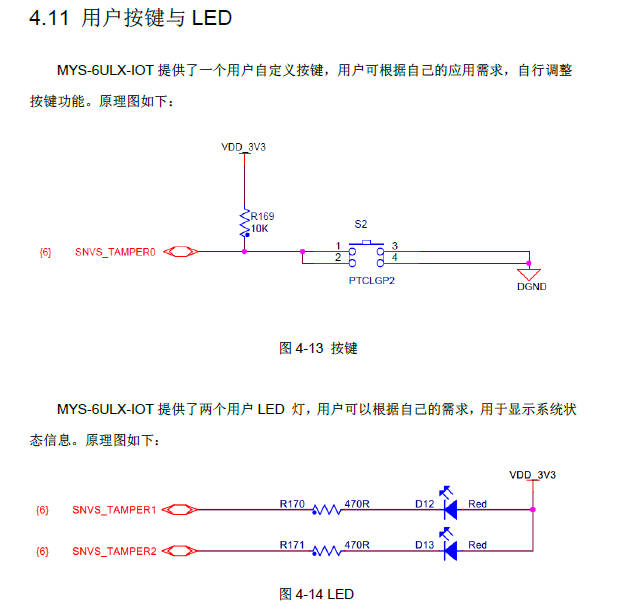
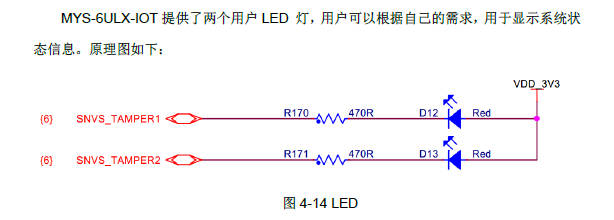
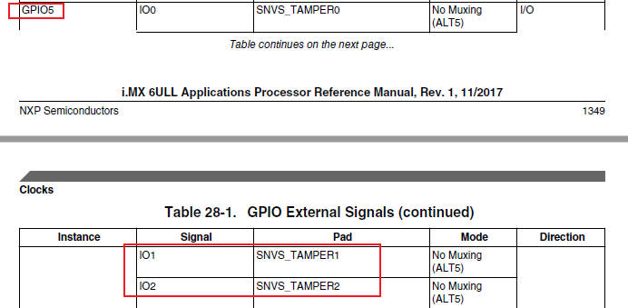
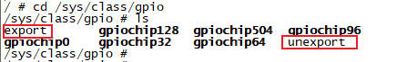
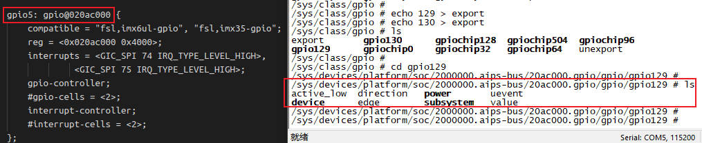
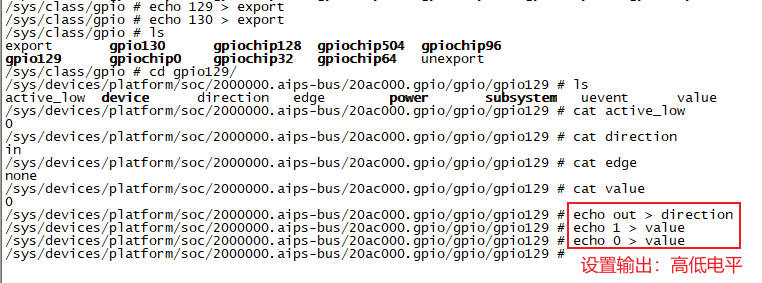
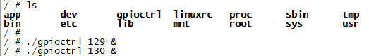
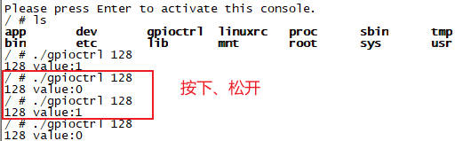

# GPIO子系统

## 第1章 GPIO入门

### 1.1 什么是GPIO

GPIO是干什么的呢？从字面意思来看，`GPIO=General Purpose Input/Output`是一种软件运行期间，能够动态配置和控制的通用引脚。通用，就是说他是万金油，干什么都行。输入输出，就是说既能当输入端口使用，又能当输出端口使用。端口，就是元器件上的一个引脚。

所有的GPIO在上电后的初始状态都是输入模式，可以通过软件设为上拉或下拉，也可以输入中断信号，驱动强度都是可编程的。

我们学linux、单片机的第一个操作硬件就是点亮第一个LED灯，也就是控制GPIO的高低电平。在单片机上我们控制一个GPIO非常简单，直接操作引脚就可以了。在Linux现有的框架下，我们甚至不需要写驱动，直接命令操作就可以了。因为Linux系统本身有好多成熟的驱动框架，使用这些框架的好处是，当我们更换平台的时候，应用程序可以几乎不用做任何改变，就可以在新平台上运行。



### 1.2 GPIO引脚分布

imx6ull有5组GPIO引脚分布：`GPIO0到GPIO4`。每组GPIO又以`0~31`作为区分的编号。注意：实际上imx6ull并不是每组GPIO都有32个引脚，我们来看下：

| `GPIO组` | `引脚编号` |
| - | - |
| GPIO1 | 0~31 |
| GPIO2 | 0~21 |
| GPIO3 | 0~28 |
| GPIO4 | 0~28 |
| GPIO5 | 0~11 |

## 第2章 GPIO控制和操作

GPIO软件编程方式有多种，可以写驱动程序调用GPIO函数操作GPIO，也可以直接通过操作寄存器的方式操作GPIO，还可以通过sysfs方式实现对GPIO的控制。

### 2.1 使用命令通过`sysfs`文件系统控制GPIO

#### 2.1.1 内核配置

使用`sysfs`方式控制GPIO，首先需要底层驱动的支持，需要在`make menuconfig`图形化配置界面加入以下配置：

```
Device Drivers
    -> GPIO Support
        -> /sys/class/gpio/xxxx
```


#### 2.1.2 GPIO编号计算

`imx6ull`有5组GPIO(`bank`)，每组0 ~ 31个引脚(`number`)。GPIO引脚编号计算方式：`pin = (bank - 1) * 32 + number`。

以两个LED灯的GPIO为例：`SNVS_TAMPER1`和`SNVS_TAMPER2`。



他们对应的GPIO分别是：`GPIO5 IO01`和`GPIO5 IO02`，如下图所示。引脚编号计算如下：

```c
pin1 = (5 - 1) * 32 + 1 = 129
pin1 = (5 - 1) * 32 + 2 = 130
```



#### 2.1.3 使用`sysfs`控制接口控制GPIO

`sysfs`控制接口为`/sys/class/goio/export`和`/sys/class/goio/unexport`。如下图所示：

1. `/sys/class/goio/export`用于将GPIO控制从内核空间导出到用户空间
2. `/sys/class/goio/unexport`用于取消GPIO控制从内核空间导出到用户空间的导出
3. `export`和`unexport`都是只写的
4. `gpiochipx`代表GPIO控制器



`export`用于将指定编号的GPIO引脚导出。在使用GPIO引脚之前，需要将其导出，导出成功后才能使用它。以一个指定的编号写入到`export`文件中，即可将对应的GPIO引脚导出。

以两个LED灯的`GPIO5 IO01`和`GPIO5 IO02`为例，使用`echo 129 > export`导出如下：


可以看到，在`/sys/class/gpio`目录下生成了`gpio129`、`gpio130`两个文件夹，这些文件夹就是导出来的GPIO引脚对应的文件夹，用于管理、控制该引脚。

`unexport`将导出的GPIO引脚删除。当使用完GPIO引脚之后，需要将导出的引脚删除：`echo 129 > unexport`。

需要注意：并不是所有GPIO引脚都可以成功导出，如果对应的GPIO已经被导出或在内核中被使用了，那就无法成功导出。

可以看到，`gpio129`文件夹下有4个属性文件。接下来介绍这些属性文件的作用：



1. `direction`: 配置GPIO引脚为输入或输出模式。该文件可读、可写。读取或写入操作可取的值为：`out`(输出模式)、`in`(输入模式)
2. `active_low`: 用于控制极性的文件。该文件可读、可写，默认情况下为0。当`active_low`为0时，`value`为1输出高电平，`value`为0输出低电平。当`active_low`10时，`value`为1输出低电平，`value`为0输出高电平
3. `edge`: 控制中断的触发模式，该文件可读可写。在配置GPIO引脚的中断触发模式之前，需将其设置为输入模式。4种触发模式的设置如下所示：
    ```bash
    echo "none"    > edge   # 非中断引脚
    echo "rising"  > edge   # 上升沿触发
    echo "falling" > edge   # 下降沿触发
    echo "both"    > edge   # 边沿触发
    ```
4. `value`: 设置高低电平。`value`写1设置高电平，`value`写0设置低电平

下面是使用`sysfs`点亮LED的实测结果：



### 2.2 使用C程序通过`sysfs`文件系统控制GPIO

#### 2.2.1 控制GPIO输出

```c
#include <stdio.h>
#include <string.h>
#include <errno.h>
#include <sys/types.h>
#include <sys/stat.h>
#include <fcntl.h>
#include <unistd.h>

int gpio_export(char *pin)
{
    int fd, ret;

    fd = open("/sys/class/gpio/export", O_WRONLY);
    if (fd < 0) {
        printf("open /sys/class/gpio/export error\n");
        return -1;
    }
    ret = write(fd, pin, strlen(pin));
    if (ret < 0) {
        printf("write /sys/class/gpio/export error\n");
        close(fd);
        return -2;
    }
    close(fd);

    return 0;
}

int gpio_unexport(char *pin)
{
    int fd, ret;

    fd = open("/sys/class/gpio/unexport", O_WRONLY);
    if (fd < 0) {
        printf("open /sys/class/gpio/unexport error\n");
        return -1;
    }
    ret = write(fd, pin, strlen(pin));
    if (ret < 0) {
        printf("write /sys/class/gpio/unexport error\n");
        close(fd);
        return -2;
    }
    close(fd);

    return 0;
}

int gpio_ctrl(char *f_path, char *arg, char *val)
{
    int fd, ret;
    char attr[128];

    sprintf(attr, "%s/%s", f_path, arg);

    fd = open(attr, O_WRONLY);
    if (fd < 0) {
        printf("open %s error\n", attr);
        return -1;
    }
    ret = write(fd, val, strlen(val));
    if (ret < 0) {
        printf("write %s error\n", attr);
        close(fd);
        return -2;
    }
    close(fd);

    return 0;
}

int main(int argc, char *argv[])
{
    int i;
    char *pin;
    char f_path[128];

    if (argc < 2) {
        printf("Usage: pinctrl pin\n");
        return -1;
    }
    pin = argv[1];
    sprintf(f_path, "/sys/class/gpio/gpio%s", pin);
    if (access(f_path, F_OK)) {
        gpio_export(pin);
    }
    gpio_ctrl(f_path, "direction", "out");
    for (i = 0; i < 100; i++) {
        if (i % 2) {
            gpio_ctrl(f_path, "value", "1");
        }
        else {
            gpio_ctrl(f_path, "value", "0");
        }
        usleep(1000 * 200);
    }
    gpio_ctrl(f_path, "value", "1");
    gpio_ctrl(f_path, "direction", "in");
    gpio_unexport(pin);
    
    return 0;
}
```

我现在要点亮2个LED灯：`129`和`130`。测试过程如下：



#### 2.2.1 控制GPIO输入

我们的imx6ull开发板提供了一个用户按键：`GPIO5_IO00`，对应的pin为128。我们可以写代码来读取按键值：


测试代码如下：

```c
#include <stdio.h>
#include <string.h>
#include <errno.h>
#include <sys/types.h>
#include <sys/stat.h>
#include <fcntl.h>
#include <unistd.h>

int gpio_export(char *pin)
{
    int fd, ret;

    fd = open("/sys/class/gpio/export", O_WRONLY);
    if (fd < 0) {
        printf("open /sys/class/gpio/export error\n");
        return -1;
    }
    ret = write(fd, pin, strlen(pin));
    if (ret < 0) {
        printf("write /sys/class/gpio/export error\n");
        close(fd);
        return -2;
    }
    close(fd);

    return 0;
}

int gpio_unexport(char *pin)
{
    int fd, ret;

    fd = open("/sys/class/gpio/unexport", O_WRONLY);
    if (fd < 0) {
        printf("open /sys/class/gpio/unexport error\n");
        return -1;
    }
    ret = write(fd, pin, strlen(pin));
    if (ret < 0) {
        printf("write /sys/class/gpio/unexport error\n");
        close(fd);
        return -2;
    }
    close(fd);

    return 0;
}

int gpio_ctrl(char *f_path, char *arg, char *val)
{
    int fd, ret;
    char attr[128];

    sprintf(attr, "%s/%s", f_path, arg);

    fd = open(attr, O_WRONLY);
    if (fd < 0) {
        printf("open %s error\n", attr);
        return -1;
    }
    ret = write(fd, val, strlen(val));
    if (ret < 0) {
        printf("write %s error\n", attr);
        close(fd);
        return -2;
    }
    close(fd);

    return 0;
}

int gpio_read_value(char *f_path)
{
    int fd, ret;
    char value[10] = {0};
    char attr[128] = {0};

    sprintf(attr, "%s/value", f_path);
    fd = open(attr, O_RDONLY);
    if (fd < 0) {
        printf("open %s error\n", attr);
        return -1;
    }
    ret = read(fd, value, 1);
    if (ret < 0) {
        printf("read %s error\n", attr);
        close(fd);
        return -2;
    }
    else {
        if (0 == strcmp(value, "1")) {
            ret = 1;
        }
        else if (0 == strcmp(value, "0")) {
            ret = 0;
        }
        else {
            ret = -3;
        }
    }
    close(fd);

    return ret;
}

int main(int argc, char *argv[])
{
    int i;
    char *pin;
    char f_path[128];

    if (argc < 2) {
        printf("Usage: pinctrl pin\n");
        return -1;
    }
    pin = argv[1];
    sprintf(f_path, "/sys/class/gpio/gpio%s", pin);
    if (access(f_path, F_OK)) {
        gpio_export(pin);
    }
    gpio_ctrl(f_path, "direction", "in");
    printf("%s value:%d\n", pin, gpio_read_value(f_path));
    gpio_unexport(pin);
    
    return 0;
}
```

测试结果：



### 2.3 Linux中的`/dev/mem`深入解析

通过`/dev/mem`设备也可以控制GPIO，我们先来理解下`/dev/mem`。

#### 2.3.1 什么是`/dev/mem`

`/dev/mem`是Linux内核提供的一个字符设备，他是系统物理地址空间的完整映像。通过这个设备，用户空间可以绕过内核的内存管理机制，直接读写物理内存、外设寄存器以及其他映射到物理地址空间的硬件资源。由于其强大的能力和潜在风险，通常只有root用户才有权限访问此设备。

#### 2.3.2 内核底层实现原理

`/dev/mem`的驱动实现主要位于`Linux`内核的`drivers/char/mem.c`文件中。其核心是作为一个字符设备，通过定义`file_operations`结构退来实现打开、读取、写入和内存映射等操作。

#### 2.3.2.1 关键操作函数实现

```c
static const struct file_operations __maybe_unused mem_fops = {
	.llseek		= memory_lseek,
	.read		= read_mem,
	.write		= write_mem,
	.mmap		= mmap_mem,
	.open		= open_mem,
};
```

#### 2.3.2.2 关键操作函数实现

##### 2.3.2.2.1 打开设备(`open`)

当用户空间程序打开`/dev/mem`时，内核会进行严格的权限检查。确保只有具备`CAP_SYS_RAWIO`能力的进程(通常是root)才能访问。

```c
static int open_mem(struct inode *inode, struct file *filp)
{
	if (!capable(CAP_SYS_RAWIO)) {
        return -EPERM;  // 没有权限
    }
    return 0;
}
```

##### 2.3.2.2.2 内存映射(`mmap`)

`mmap`操作是将物理内存映射到用户空间地址的关键，它使用`remap_pfn_range()`函数实现物理地址到虚拟地址的转换。

```c
static int mmap_mem(struct file *file, struct vm_area_struct *vma)
{
	size_t size = vma->vm_end - vma->vm_start;

    // 检查地址范围有效性
	if (!valid_mmap_phys_addr_range(vma->vm_pgoff, size))
		return -EINVAL;

	// 创建映射
	if (remap_pfn_range(vma, vma->vm_start, vma->vm_pgoff,
			    size, vma->vm_page_prot)) {
		return -EAGAIN;
	}
	return 0;
}
```

#### 2.3.2.3 物理地址空间组成

`/dev/mem`提供的物理地址空间，包含多种类型的区域：

+ 物理地址(RAM): 系统主内存
+ 物理存储(ROM): 只读存储器
+ CPU总线地址: CPU总线上的地址空间
+ CPU寄存器: 处理器内部寄存器
+ 外设寄存器: 如GPIO、定时器、ADC灯硬件控制器寄存器

#### 2.3.3 使用场景与示例

##### 2.3.3.1 典型使用场景

1. 硬件调试与开发: 在驱动开发或BSP移植初期，直接访问外设寄存器进行硬件调试
2. 性能关键应用: 需要绕过内核开销，直接与硬件交互的高性能应用
3. 系统监控与诊断: 开发系统监控工具，直接读取物理内存信息
4. 嵌入式系统开发: 在资源受限的嵌入式环境中，实现轻量级硬件访问
5. 安全研究与取证: 用于系统安全分析和数字取证

##### 2.3.3.2 使用流程

使用`/dev/mem`的基本流程通常如下：

1. 打开设备: 使用`open()`系统调用打开`/dev/mem`
2. 内存映射: 使用`mmap()`将感兴趣的物理地址区域映射到用户空间
3. 直接访问: 通过映射后的指针直接读写内存或寄存器
4. 清理资源: 使用`munmap()`解除映射并`close()`关闭设备

#### 2.3.4 `设计思路与考量`

##### 2.3.4.1 设计目标

`/dev/mem`的设计，主要基于以下几个目标：

1. 硬件直接访问: 为用户空间提供一种直接访问硬件资源的机制
2. 性能优化: 避免不必要的内存拷贝，实现高效的数据传输
3. 开发灵活性: 在驱动开发初期提供便捷的硬件调试手段
4. 系统维护: 为系统诊断和监控工具提供底层访问能力

##### 2.3.4.2 与`/dev/kmem`的区别


