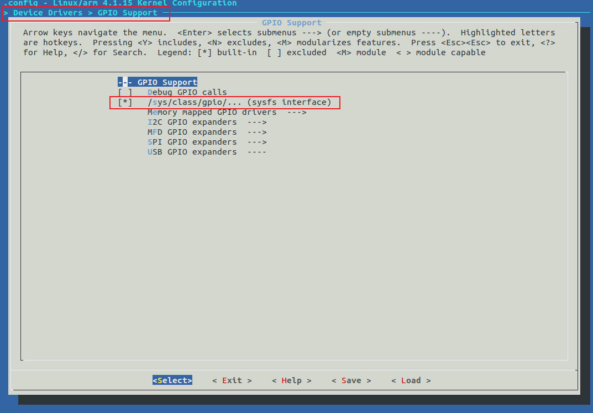
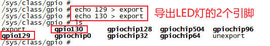
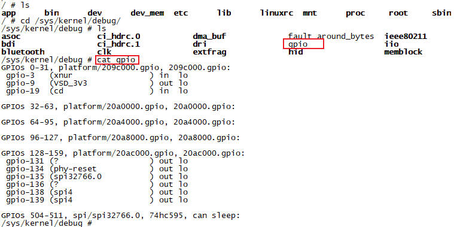
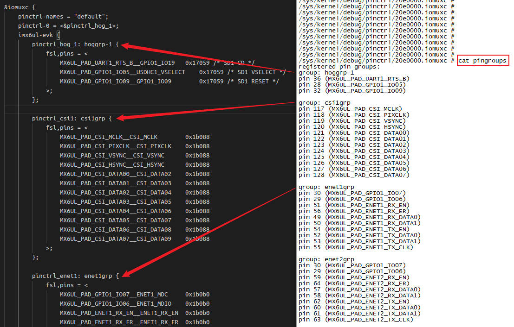

# GPIO子系统

## 第1章 GPIO入门

### 1.1 什么是GPIO

GPIO是干什么的呢？从字面意思来看，`GPIO=General Purpose Input/Output`是一种软件运行期间，能够动态配置和控制的通用引脚。通用，就是说他是万金油，干什么都行。输入输出，就是说既能当输入端口使用，又能当输出端口使用。端口，就是元器件上的一个引脚。

所有的GPIO在上电后的初始状态都是输入模式，可以通过软件设为上拉或下拉，也可以输入中断信号，驱动强度都是可编程的。

我们学linux、单片机的第一个操作硬件就是点亮第一个LED灯，也就是控制GPIO的高低电平。在单片机上我们控制一个GPIO非常简单，直接操作引脚就可以了。在Linux现有的框架下，我们甚至不需要写驱动，直接命令操作就可以了。因为Linux系统本身有好多成熟的驱动框架，使用这些框架的好处是，当我们更换平台的时候，应用程序可以几乎不用做任何改变，就可以在新平台上运行。


### 1.2 GPIO引脚分布

imx6ull有5组GPIO引脚分布：`GPIO0到GPIO4`。每组GPIO又以`0~31`作为区分的编号。注意：实际上imx6ull并不是每组GPIO都有32个引脚，我们来看下：

| `GPIO组` | `引脚编号` |
| - | - |
| GPIO1 | 0~31 |
| GPIO2 | 0~21 |
| GPIO3 | 0~28 |
| GPIO4 | 0~28 |
| GPIO5 | 0~11 |

## 第2章 GPIO控制和操作

GPIO软件编程方式有多种，可以写驱动程序调用GPIO函数操作GPIO，也可以直接通过操作寄存器的方式操作GPIO，还可以通过sysfs方式实现对GPIO的控制。

### 2.1 使用命令通过`sysfs`文件系统控制GPIO

#### 2.1.1 内核配置

使用`sysfs`方式控制GPIO，首先需要底层驱动的支持，需要在`make menuconfig`图形化配置界面加入以下配置：

```
Device Drivers
    -> GPIO Support
        -> /sys/class/gpio/xxxx
```



#### 2.1.2 GPIO编号计算

`imx6ull`有5组GPIO(`bank`)，每组0 ~ 31个引脚(`number`)。GPIO引脚编号计算方式：`pin = (bank - 1) * 32 + number`。

以两个LED灯的GPIO为例：`SNVS_TAMPER1`和`SNVS_TAMPER2`。


他们对应的GPIO分别是：`GPIO5 IO01`和`GPIO5 IO02`，如下图所示。引脚编号计算如下：

```c
pin1 = (5 - 1) * 32 + 1 = 129
pin1 = (5 - 1) * 32 + 2 = 130
```


#### 2.1.3 使用`sysfs`控制接口控制GPIO

`sysfs`控制接口为`/sys/class/goio/export`和`/sys/class/goio/unexport`。如下图所示：

1. `/sys/class/goio/export`用于将GPIO控制从内核空间导出到用户空间
2. `/sys/class/goio/unexport`用于取消GPIO控制从内核空间导出到用户空间的导出
3. `export`和`unexport`都是只写的
4. `gpiochipx`代表GPIO控制器


`export`用于将指定编号的GPIO引脚导出。在使用GPIO引脚之前，需要将其导出，导出成功后才能使用它。以一个指定的编号写入到`export`文件中，即可将对应的GPIO引脚导出。

以两个LED灯的`GPIO5 IO01`和`GPIO5 IO02`为例，使用`echo 129 > export`导出如下：



可以看到，在`/sys/class/gpio`目录下生成了`gpio129`、`gpio130`两个文件夹，这些文件夹就是导出来的GPIO引脚对应的文件夹，用于管理、控制该引脚。

`unexport`将导出的GPIO引脚删除。当使用完GPIO引脚之后，需要将导出的引脚删除：`echo 129 > unexport`。

需要注意：并不是所有GPIO引脚都可以成功导出，如果对应的GPIO已经被导出或在内核中被使用了，那就无法成功导出。

可以看到，`gpio129`文件夹下有4个属性文件。接下来介绍这些属性文件的作用：


1. `direction`: 配置GPIO引脚为输入或输出模式。该文件可读、可写。读取或写入操作可取的值为：`out`(输出模式)、`in`(输入模式)
2. `active_low`: 用于控制极性的文件。该文件可读、可写，默认情况下为0。当`active_low`为0时，`value`为1输出高电平，`value`为0输出低电平。当`active_low`10时，`value`为1输出低电平，`value`为0输出高电平
3. `edge`: 控制中断的触发模式，该文件可读可写。在配置GPIO引脚的中断触发模式之前，需将其设置为输入模式。4种触发模式的设置如下所示：
    ```bash
    echo "none"    > edge   # 非中断引脚
    echo "rising"  > edge   # 上升沿触发
    echo "falling" > edge   # 下降沿触发
    echo "both"    > edge   # 边沿触发
    ```
4. `value`: 设置高低电平。`value`写1设置高电平，`value`写0设置低电平

下面是使用`sysfs`点亮LED的实测结果：


### 2.2 使用C程序通过`sysfs`文件系统控制GPIO

#### 2.2.1 控制GPIO输出

```c
#include <stdio.h>
#include <string.h>
#include <errno.h>
#include <sys/types.h>
#include <sys/stat.h>
#include <fcntl.h>
#include <unistd.h>

int gpio_export(char *pin)
{
    int fd, ret;

    fd = open("/sys/class/gpio/export", O_WRONLY);
    if (fd < 0) {
        printf("open /sys/class/gpio/export error\n");
        return -1;
    }
    ret = write(fd, pin, strlen(pin));
    if (ret < 0) {
        printf("write /sys/class/gpio/export error\n");
        close(fd);
        return -2;
    }
    close(fd);

    return 0;
}

int gpio_unexport(char *pin)
{
    int fd, ret;

    fd = open("/sys/class/gpio/unexport", O_WRONLY);
    if (fd < 0) {
        printf("open /sys/class/gpio/unexport error\n");
        return -1;
    }
    ret = write(fd, pin, strlen(pin));
    if (ret < 0) {
        printf("write /sys/class/gpio/unexport error\n");
        close(fd);
        return -2;
    }
    close(fd);

    return 0;
}

int gpio_ctrl(char *f_path, char *arg, char *val)
{
    int fd, ret;
    char attr[128];

    sprintf(attr, "%s/%s", f_path, arg);

    fd = open(attr, O_WRONLY);
    if (fd < 0) {
        printf("open %s error\n", attr);
        return -1;
    }
    ret = write(fd, val, strlen(val));
    if (ret < 0) {
        printf("write %s error\n", attr);
        close(fd);
        return -2;
    }
    close(fd);

    return 0;
}

int main(int argc, char *argv[])
{
    int i;
    char *pin;
    char f_path[128];

    if (argc < 2) {
        printf("Usage: pinctrl pin\n");
        return -1;
    }
    pin = argv[1];
    sprintf(f_path, "/sys/class/gpio/gpio%s", pin);
    if (access(f_path, F_OK)) {
        gpio_export(pin);
    }
    gpio_ctrl(f_path, "direction", "out");
    for (i = 0; i < 100; i++) {
        if (i % 2) {
            gpio_ctrl(f_path, "value", "1");
        }
        else {
            gpio_ctrl(f_path, "value", "0");
        }
        usleep(1000 * 200);
    }
    gpio_ctrl(f_path, "value", "1");
    gpio_ctrl(f_path, "direction", "in");
    gpio_unexport(pin);
    
    return 0;
}
```

我现在要点亮2个LED灯：`129`和`130`。测试过程如下：


#### 2.2.1 控制GPIO输入

我们的imx6ull开发板提供了一个用户按键：`GPIO5_IO00`，对应的pin为128。我们可以写代码来读取按键值：


测试代码如下：

```c
#include <stdio.h>
#include <string.h>
#include <errno.h>
#include <sys/types.h>
#include <sys/stat.h>
#include <fcntl.h>
#include <unistd.h>

int gpio_export(char *pin)
{
    int fd, ret;

    fd = open("/sys/class/gpio/export", O_WRONLY);
    if (fd < 0) {
        printf("open /sys/class/gpio/export error\n");
        return -1;
    }
    ret = write(fd, pin, strlen(pin));
    if (ret < 0) {
        printf("write /sys/class/gpio/export error\n");
        close(fd);
        return -2;
    }
    close(fd);

    return 0;
}

int gpio_unexport(char *pin)
{
    int fd, ret;

    fd = open("/sys/class/gpio/unexport", O_WRONLY);
    if (fd < 0) {
        printf("open /sys/class/gpio/unexport error\n");
        return -1;
    }
    ret = write(fd, pin, strlen(pin));
    if (ret < 0) {
        printf("write /sys/class/gpio/unexport error\n");
        close(fd);
        return -2;
    }
    close(fd);

    return 0;
}

int gpio_ctrl(char *f_path, char *arg, char *val)
{
    int fd, ret;
    char attr[128];

    sprintf(attr, "%s/%s", f_path, arg);

    fd = open(attr, O_WRONLY);
    if (fd < 0) {
        printf("open %s error\n", attr);
        return -1;
    }
    ret = write(fd, val, strlen(val));
    if (ret < 0) {
        printf("write %s error\n", attr);
        close(fd);
        return -2;
    }
    close(fd);

    return 0;
}

int gpio_read_value(char *f_path)
{
    int fd, ret;
    char value[10] = {0};
    char attr[128] = {0};

    sprintf(attr, "%s/value", f_path);
    fd = open(attr, O_RDONLY);
    if (fd < 0) {
        printf("open %s error\n", attr);
        return -1;
    }
    ret = read(fd, value, 1);
    if (ret < 0) {
        printf("read %s error\n", attr);
        close(fd);
        return -2;
    }
    else {
        if (0 == strcmp(value, "1")) {
            ret = 1;
        }
        else if (0 == strcmp(value, "0")) {
            ret = 0;
        }
        else {
            ret = -3;
        }
    }
    close(fd);

    return ret;
}

int main(int argc, char *argv[])
{
    int i;
    char *pin;
    char f_path[128];

    if (argc < 2) {
        printf("Usage: pinctrl pin\n");
        return -1;
    }
    pin = argv[1];
    sprintf(f_path, "/sys/class/gpio/gpio%s", pin);
    if (access(f_path, F_OK)) {
        gpio_export(pin);
    }
    gpio_ctrl(f_path, "direction", "in");
    printf("%s value:%d\n", pin, gpio_read_value(f_path));
    gpio_unexport(pin);
    
    return 0;
}
```

测试结果：


### 2.3 Linux中的`/dev/mem`深入解析

通过`/dev/mem`设备也可以控制GPIO，我们先来理解下`/dev/mem`。

#### 2.3.1 什么是`/dev/mem`

`/dev/mem`是Linux内核提供的一个字符设备，他是系统物理地址空间的完整映像。通过这个设备，用户空间可以绕过内核的内存管理机制，直接读写物理内存、外设寄存器以及其他映射到物理地址空间的硬件资源。由于其强大的能力和潜在风险，通常只有root用户才有权限访问此设备。

#### 2.3.2 内核底层实现原理

`/dev/mem`的驱动实现主要位于`Linux`内核的`drivers/char/mem.c`文件中。其核心是作为一个字符设备，通过定义`file_operations`结构退来实现打开、读取、写入和内存映射等操作。

##### 2.3.2.1 关键操作函数实现

```c
static const struct file_operations __maybe_unused mem_fops = {
	.llseek		= memory_lseek,
	.read		= read_mem,
	.write		= write_mem,
	.mmap		= mmap_mem,
	.open		= open_mem,
};
```

##### 2.3.2.2 关键操作函数实现

###### 2.3.2.2.1 打开设备(`open`)

当用户空间程序打开`/dev/mem`时，内核会进行严格的权限检查。确保只有具备`CAP_SYS_RAWIO`能力的进程(通常是root)才能访问。

```c
static int open_mem(struct inode *inode, struct file *filp)
{
	if (!capable(CAP_SYS_RAWIO)) {
        return -EPERM;  // 没有权限
    }
    return 0;
}
```

###### 2.3.2.2.2 内存映射(`mmap`)

`mmap`操作是将物理内存映射到用户空间地址的关键，它使用`remap_pfn_range()`函数实现物理地址到虚拟地址的转换。

```c
static int mmap_mem(struct file *file, struct vm_area_struct *vma)
{
	size_t size = vma->vm_end - vma->vm_start;

    // 检查地址范围有效性
	if (!valid_mmap_phys_addr_range(vma->vm_pgoff, size))
		return -EINVAL;

	// 创建映射
	if (remap_pfn_range(vma, vma->vm_start, vma->vm_pgoff,
			    size, vma->vm_page_prot)) {
		return -EAGAIN;
	}
	return 0;
}
```

##### 2.3.2.3 物理地址空间组成

`/dev/mem`提供的物理地址空间，包含多种类型的区域：

+ 物理地址(RAM): 系统主内存
+ 物理存储(ROM): 只读存储器
+ CPU总线地址: CPU总线上的地址空间
+ CPU寄存器: 处理器内部寄存器
+ 外设寄存器: 如GPIO、定时器、ADC灯硬件控制器寄存器

#### 2.3.3 使用场景与示例

##### 2.3.3.1 典型使用场景

1. 硬件调试与开发: 在驱动开发或BSP移植初期，直接访问外设寄存器进行硬件调试
2. 性能关键应用: 需要绕过内核开销，直接与硬件交互的高性能应用
3. 系统监控与诊断: 开发系统监控工具，直接读取物理内存信息
4. 嵌入式系统开发: 在资源受限的嵌入式环境中，实现轻量级硬件访问
5. 安全研究与取证: 用于系统安全分析和数字取证

##### 2.3.3.2 使用流程

使用`/dev/mem`的基本流程通常如下：

1. 打开设备: 使用`open()`系统调用打开`/dev/mem`
2. 内存映射: 使用`mmap()`将感兴趣的物理地址区域映射到用户空间
3. 直接访问: 通过映射后的指针直接读写内存或寄存器
4. 清理资源: 使用`munmap()`解除映射并`close()`关闭设备

#### 2.3.4 `设计思路与考量`

##### 2.3.4.1 设计目标

`/dev/mem`的设计，主要基于以下几个目标：

1. 硬件直接访问: 为用户空间提供一种直接访问硬件资源的机制
2. 性能优化: 避免不必要的内存拷贝，实现高效的数据传输
3. 开发灵活性: 在驱动开发初期提供便捷的硬件调试手段
4. 系统维护: 为系统诊断和监控工具提供底层访问能力

##### 2.3.4.2 与`/dev/kmem`的区别

| 特性 | `/dev/mem` | `/dev/kmem` |
| - | - | - |
| 地址空间 | 物理内存地址空间 | 内核虚拟内存地址空间 |
| 访问对象 | 物理内存、设备寄存器 | 内核数据结构、变量 |
| 主要用途 | 硬件访问、寄存器操作 | 内核调试、内部状态检查 |
| 安全风险 | 硬件级风险 | 内核信息泄露、Rootkit |

### 2.4 `/dev/mem`设备使用方法

使用`/dev/mem`设备需要具有root权限，并且谨慎操作，因为直接访问内核空间是一项潜在的危险操作。

#### 2.4.1 使用`open()`打开`/dev/mem`文件描述符

使用`open()`函数打开`/dev/mem`文件描述符，并指定访问权限。访问权限可以是: 只读(`O_RDONLY`)、只写(`O_WRONLY`)、读写(`O_RDWR`)。

```c
int fd = 0;
fd = open("/dev/mem", O_RDWR);
```

#### 2.4.2 使用`mmap()`将要访问的物理地址与`/dev/mem`文件描述符建立映射

使用`mmap()`函数将需要访问的物理地址与`/dev/mem`文件描述符建立映射，`mmap()`函数将返回一个指向映射内存区域的指针。

```c
char *mmap_addr = NULL;

mmap_addr = (char *)mmap(NULL, MMAP_SIZE, PROT_READ | PROT_WRITE, MAP_SHARED, fd, MMAP_ADDR);
```

1. `MMAP_SIZE`: 映射的大小
2. `PROT_READ | PROT_WRITE`: 访问权限为读写
3. `MAP_SHARED`: 共享映射
4. `fd`: 打开的`/dev/mem`文件描述符
5. `MMAP_ADDR`: 要映射的物理地址

#### 2.4.3 对映射的地址进行访问，即对寄存器进行读写

通过指针操作对`mmap_addr`指向的地址进行读写操作

```c
int a = 0;

*((int *)mmap_addr) = 0xff; // 写地址
a = *((int *)mmap_addr);    // 读地址
```

### 2.5 `mmap()`函数

#### 2.5.1 函数基本介绍

`mmap()`系统调用，用于将文件或设备的内容映射到调用进程的虚拟地址空间中，从而允许应用程序通过指针直接访问文件数据，避免频繁使用`read`或`write`等系统调用带来的性能开销。

映射成功后，`mmap`返回映射区域的起始地址。

```c
#include <sys/mman.h>

void *mmap(void *addr, size_t length, int prot, int flags, int fd, off_t offset);
```

#### 2.5.2 参数详解

`mmap()`函数的各个参数共同决定了映射行为。以下是每个参数的详细说明：

| 参数 | 类型 |含义与说明 |
| - | - | - |
| addr | `void *` | *建议的映射起始地址*。通常设为NULL，表示内核自动选择合适的地址 |
| length | size_t | *要映射的字节长度*。该值必须大于0 |
| prot | int | `PROT_READ`: 页面可读<br>`PROT_WRITE`: 页面可写<br>`PROT_EXEC`: 页面内容可执行<br> |
| flags | int | *映射类型和行为的控制标志*。以下是常用的标志：<br>`MAP_SHARED`: 共享映射。对映射区域的修改会同步到底层文件，并且对其他映射了同一文件的进程可见<br>`MAP_PRIVATE`: 私有映射。创建一个写时复制的私有映射，对该映射区域的修改不会影响底层文件，对其它进程也不可见 |
| fd | int | *文件描述符*。指向要映射的已打开文件 |
| offset | off_t | *文件映射起始偏移量*。指定从文件开头算起的偏移位置，从此处开始映射。必须是系统页面大小(通常为4096字节)的整数倍 |

#### 2.5.3 典型使用场景

`mmap()`的强大之处体现在多个方面：

##### 2.5.3.1 高效文件I/O

传统文件读写(如read/write)通常涉及两次数据拷贝：从内核页缓存到用户缓冲区，然后再从用户缓冲区到应用程序。对于需要频繁随机访问大文件的场景，这种开销很大。

使用`mmap()`的优势：

+ 零拷贝`(Zero-Copy)`: 应用程序直接通过指针操作页缓存中的数据，避免了用户态和内核态之间的数据拷贝
+ 高效随机访问: 无需`lseek`，可直接通过指针偏移访问文件的任何部分
+ 惰性加载: 仅访问到的文件部分才会被加载到内存，节省内存并加速初始化

使用场景: 数据库系统(如MySQL、SQLite)、大型数据文件(如图像、视频处理)、日志处理系统等

处理大文件的代码示例：

```c
#include <stdio.h>
#include <stdlib.h>
#include <sys/mman.h>
#include <sys/stat.h>
#include <fcntl.h>
#include <unistd.h>

int main() {
    int fd = open("large_file.dat", O_RDWR);
    if (fd == -1) { perror("open"); exit(EXIT_FAILURE); }

    struct stat sb;
    if (fstat(fd, &sb) == -1) { perror("fstat"); close(fd); exit(EXIT_FAILURE); }
    off_t file_size = sb.st_size;

    // 将整个文件映射到内存
    void *mapped = mmap(NULL, file_size, PROT_READ | PROT_WRITE, MAP_SHARED, fd, 0);
    if (mapped == MAP_FAILED) { perror("mmap"); close(fd); exit(EXIT_FAILURE); }

    // 现在可以像操作内存一样操作文件内容，例如：
    char *data = (char *)mapped;
    for (off_t i = 0; i < file_size; i++) {
        // 处理 data[i]
    }

    // 解除映射并关闭文件
    if (munmap(mapped, file_size) == -1) { perror("munmap"); }
    close(fd);
    return 0;
}
```

##### 2.5.3.2 进程间通信(IPC)

`mmap()`系统了一种高效的基于文件的共享内存IPC机制: 多个进程通过`mmap()`映射同一个文件(使用`MAP_SHARED`标志)。对映射内存的修改对所有进程立即可见，并会同步到底层文件(除非是用msync，否则同步时间由内核决定)

##### 2.5.3.3 内存分配

虽然`malloc()`是更常用的动态内存分配接口，但`mmap`可以用来分配大块内存。`glibc`中的`malloc`实现对于非常大的内存请求(通常是超过128KB)，会使用`mmap`来分配，而不是通过扩展堆空间(`brk`)。原因如下：

+ `mmap`分配的内存可以独立与堆空间，更易于管理
+ 使用`munmap`释放大块内存时，可以立即将物理内存和虚拟地址空间返还给系统，而`free()`释放的内存可能仍被保留在进程的堆中

##### 2.5.3.4 程序与库的加载

操作系统加载器(`Loader`)使用`mmap`将可执行程序的文件本身和它依赖的共享库(如glibc)的代码段和数据段映射到进程的地址空间。这通常是只读(`PROT_READ`)或读+执行(`PROT_READ | PROT_EXEC`)的私有映射(`MAP_PRIVATE`)，确保了代码的共享性和安全性。

#### 2.5.4 注意事项与最佳实践

使用`mmap`的注意事项：

1. 对齐要求: 参数`offset`*必须是系统页面大小的整数倍*
2. 文件大小与映射长度: 映射长度`length`不应超过文件大小。如果访问量超出文件大小但仍在映射范围内的地址，可能会触发dump
3. 权限匹配: `prot`和`flags`参数需要与文件打开模式兼容(例如: 不能用`PROT_WRITE`映射一个只读方式`O_RDONLY`打开的文件)
4. 资源清理: 务必使用`munmap`解除映射，并使用`close`关闭文件描述符，避免资源泄漏
5. 同步重要数据: 对于`MAP_SHARED`映射，如果对数据的之旧话有严格要求，应在关键操作后调用`msync()`强制将修改同步到磁盘
6. 地址空间布局随机化: 现代系统为安全起见，每次运行进程时`mmap`返回的地址可能不同，不应假设地址固定
7. 性能权衡: 对于小文件或顺序访问，`mmap`的缺页异常开销可能使其细嫩不如传统的`read/write`。它更适用于需要频繁随机访问的大文件

### 2.6 使用`/dev/mem`和`mmap`操作寄存器点亮LED

```c
#include <stdio.h>
#include <string.h>
#include <errno.h>
#include <sys/types.h>
#include <sys/stat.h>
#include <sys/mman.h>
#include <fcntl.h>
#include <unistd.h>

#define IOMUXC_SNVS_BASE    (0x02290000)
#define GPIO5_BASE          (0x020AC000)
#define MMAP_SIZE           (4096)

#define READ_REG(reg)       (*((unsigned int *)(reg)))
#define WRITE_REG(reg, val) ((*((unsigned int *)(reg))) = (val))

int main(int argc, char *argv[])
{
    int fd = -1, flag = 0, count = 50;
    unsigned char *iomuxc_snvs_base = NULL;
    unsigned char *gpio5_base = NULL;
    unsigned int reg_val = 0;

    fd = open("/dev/mem", O_RDWR);
    if (fd < 0) {
        fprintf(stderr, "open /dev/mem fail\n");
        return -1;
    }
    iomuxc_snvs_base = (unsigned char *)mmap(NULL, MMAP_SIZE, PROT_READ | PROT_WRITE, MAP_SHARED, fd, IOMUXC_SNVS_BASE);
    if (iomuxc_snvs_base == MAP_FAILED) {
        fprintf(stderr, "mmap IOMUXC_SNVS fail\n");
        return -2;
    }
    gpio5_base = (unsigned char *)mmap(NULL, MMAP_SIZE, PROT_READ | PROT_WRITE, MAP_SHARED, fd, GPIO5_BASE);
    if (iomuxc_snvs_base == MAP_FAILED) {
        fprintf(stderr, "mmap GPIO5 fail\n");
        return -3;
    }
    WRITE_REG(iomuxc_snvs_base + 0x0C, 5);
    WRITE_REG(iomuxc_snvs_base + 0x10, 5);
    WRITE_REG(iomuxc_snvs_base + 0x50, 0x1b0b0);
    WRITE_REG(iomuxc_snvs_base + 0x54, 0x1b0b0);

    reg_val = READ_REG(gpio5_base + 0x04);
    reg_val |= (1 << 1);
    reg_val |= (1 << 2);
    WRITE_REG(gpio5_base + 0x04, reg_val);

    while (count-- > 0) {
        if (flag) {
            reg_val = READ_REG(gpio5_base + 0x00);
            reg_val |= (1 << 1);
            reg_val |= (1 << 2);
            WRITE_REG(gpio5_base + 0x00, reg_val);
        }
        else {
            reg_val = READ_REG(gpio5_base + 0x00);
            reg_val &= ~(1 << 1);
            reg_val &= ~(1 << 2);
            WRITE_REG(gpio5_base + 0x00, reg_val);
        }
        flag = !flag;
        usleep(1000 * 200);
    }

    munmap(iomuxc_snvs_base, MMAP_SIZE);
    munmap(gpio5_base, MMAP_SIZE);
    close(fd);

    return 0;
}
```

## 第3章 GPIO调试方法

GPIO调试方法除了使用IO或`/dem/mem`去查看寄存器，还可以使用其他方法进行GPIO的调试。

### 3.1 `debugfs`调试文件系统

`debugfs`是linux内核为开发者提供了一个基于内存的虚拟文件系统，专门用于内核调试。它允许开发者通过简单的文件操作(如`cat`、`echo`)在内核和用户空间之间交换信息，非常适合动态查看状态、控制行为或诊断问题，而无需重新编译内核或使用复杂的工具。

#### 3.1.1 启用与挂载`debugfs`

##### 3.1.1.1 内核启用`debugfs`

我们先要在`linux`内核中，启用`debugfs`。操作方式如下：

```sh
Kernel hacking
    -> Compile-time checks and pompiler options
        -> Debuf Filesystem
```


我们可以通过以下命令，检查内核编译是是否启用了`CONFIG_DEBUG_FS`。输出为`CONFIG_DEBUG_FS=y`，表示内核启用了`debugfs`。

```bash
/ # zcat /proc/config.gz | grep CONFIG_DEBUG_FS
CONFIG_DEBUG_FS=y
```

##### 3.1.1.2 手动挂载`debugfs`

`debugfs`通常需要手动挂载到`/sys/kernel/debug`目录。在手动挂载前，我们可以先看一下`/sys/kernel/debug`目录下，有没有文件。

如果没有，可以使用以下命令进行挂载：

```bash
mount -t debugfs none /sys/kernel/debug
```


##### 3.1.1.3 开机自动挂载`debugfs`

如果希望开机自动挂载`debugfs`，可在`/etc/fstab`文件中添加如下一行。

`/etc/fstab`文件内容：

```sh
# <file system>   <mount point>   <type>   <options>   <dump>   <pass>
proc              /proc           proc     defaults    0        0
tmpfs             /tmp            tmpfs    defaults    0        0
sysfs             /sys            sysfs    defaults    0        0
# 新增debugfs调试文件系统
none        /sys/kernel/debug     debugfs  defaults    0        0
```

可以看到。`proc`的第一个参数是`proc`，`tmpfs`的第一个参数是`tmpfs`，`sysfs`的第一个参数是`sysfs`。那为什么`debugfs`的第一个参数不是`debugfs`而是`none`？

下表汇总了常见虚拟文件系统在`fstab`中的典型写法，方便对比和理解：

| 虚拟文件系统 | `fstab`中的设备字段(第1列) | 标准挂载点(第2列) | 典型挂载选项(第4列) |
| - | - | - | - |
| `procfs` | `proc` | `/proc` | `defaults` |
| `sysfs` | `sysfs` | `/sys` | `defaults` |
| `tmpfs` | `tmpfs` | `/tmp, /run, /var/volatile` | `defaults,size=xxx,mode=1777` |
| `devpts` | `devpts` | `/dev/pts` | `mode=0620,gid=5` |
| `debugfs` | `none` | `/sys/kernel/debug` | `defaults` |

这种差异很多程度上是`历史原因`造成的。

+ `proc、sysfs、tmpfs`: 这些文件系统在Linux早期阶段就已存在。在当时，`mount`命令可能对`设备`参数有更严格的要求，过着数去形成了使用其类型名作为设备参数的惯例。这个被一直保留下来，尤其是在`/etc/fstab`中，以确保与所有历史脚本和与其行为的最大兼容性
+ `debugfs`: 作为一个相对比较晚加入内核的调试文件系统，它出现时，*使用`none`来明确表示`无设备`已称为新虚拟文件系统的标准做法*。因此，在配置`debugfs`时，第一参数普遍写作`none`。

从功能上将，对于所有这些虚拟文件系统，*设备字段的具体内容通常并不关键*，因为内核最终是通过`-t <type>`参数来识别文件系统类型的。

#### 3.1.2 `debugfs`与`procfs/sysfs`的对比

| 特性 | `debugfs` | `procfs` | `sysfs` |
| - | - | - | - |
| *主要目的* | 内核调试 | 进程信息与类和接口 | 设备与驱动模型 |
| *稳定性* | *不稳定*，接口可随时更改 | 稳定 | 稳定 |
| *使用建议* | *仅限开发调试* | 可用于生产环境 | 可用于生产环境 |
| *创建自定义接口* | *非常灵活简单* | 支持但比较复杂 | 支持，寻遵循特定结构 |

#### 3.1.3 `/sys/kernel/debug/gpio`查看信息

在挂载好`debugfs`之后，就可以使用命令`cat /sys/kernel/debug/gpio`查看`gpio`的硬件调试信息了。如下图所示：



```sh
/sys/kernel/debug # cat gpio
GPIOs 0-31, platform/209c000.gpio, 209c000.gpio:
 gpio-3   (xnur                ) in  lo    
 gpio-9   (VSD_3V3             ) out lo    
 gpio-19  (cd                  ) in  lo    

GPIOs 32-63, platform/20a0000.gpio, 20a0000.gpio:

GPIOs 64-95, platform/20a4000.gpio, 20a4000.gpio:

GPIOs 96-127, platform/20a8000.gpio, 20a8000.gpio:

GPIOs 128-159, platform/20ac000.gpio, 20ac000.gpio:
 gpio-131 (?                   ) out lo    
 gpio-134 (phy-reset           ) out lo    
 gpio-135 (spi32766.0          ) out lo    
 gpio-136 (?                   ) out lo    
 gpio-138 (spi4                ) out lo    
 gpio-139 (spi4                ) out lo    
```

`/sys/kernel/debug/gpio`文件中的每一行，通常代表一个GPIO引脚的状态。

### 3.2 `/sys/kernel/debug/pinctrl`调试信息

进入`/sys/kernel/debug/pinctrl`目录，可以获取有关GPIO控制器的调试信息。该目录下的文件和目录如下：


1. `/sys/kernel/debug/pinctrl/20e0000.iomuxc/pinmux-functions`: 设备树`pinctrl`的`function`节点和对应的`group`节点

    

2. `/sys/kernel/debug/pinctrl/20e0000.iomuxc/pingroups`: 提供了设备树`pinctrl`的`group`子节点的每个引脚组的信息

    

3. `/sys/kernel/debug/pinctrl/20e0000.iomuxc/pinmux-pins`: 提供了每个引脚的功能模式、`function`节点和`group`引脚组

    

4. `/sys/kernel/debug/pinctrl/20e0000.iomuxc/pinconf-pins`: 包含了GPIO引脚的配置信息。如输入输出、上拉/下拉、电气属性值

    

## 第4章 GPIO子系统API函数的引入

### 4.1 两套`GPIO API`接口区分

在目前的Linux内核中，GPIO子系统存在两个版本：新版本和旧版本。新版本GPIO子系统接口是基于描述符(`descriptor-based`)来实现的，旧版本的GPIO子系统接口是基于整数(`integer-bases`)来实现的。在Linux内核中为了保持向下的兼容性，旧版本的接口在最新的内核版本中仍然得到支持。

新的GPIO子系统接口需要与设备树结合使用。没有设备树，就无法使用新的GPIO接口。那要如何为新旧GPIO子系统接口进行区分？

一个明显的区别是，新的GPIO子系统接口使用了以`gpiod_`作为前缀的函数命名约定，而旧的GPIO子系统接口使用了以`gpio_`作为前缀的函数命名约定。

新的GPIO子系统接口示例：

```c
void gpiod_set_value(struct gpio_desc *desc, int value);
int  gpiod_get_value(const struct gpio_desc *desc);

int  gpiod_direction_input(struct gpio_desc *desc);
int  gpiod_direction_output(struct gpio_desc *desc, int value);
```

旧的GPIO子系统接口示例：

```c
int  gpio_get_value(unsigned gpio);
void gpio_set_value(unsigned gpio, int value);

int gpio_direction_input(unsigned gpio);
int gpio_direction_output(unsigned gpio, int value);
```

### 4.2 `struct gpio_desc`GPIO描述符

#### 4.2.1 核心作用与设计理念

前面提到，新的GPIO子系统基于描述符来实现，由`struct gpio_desc`结构体来表示。他代表了一个具体的GPIO引脚，是现代Linux GPIO操作的基石。

#### 4.2.2 `struct gpio_desc`关键成员详解

```c
struct gpio_desc {
	struct gpio_chip    *chip;

#define FLAG_REQUESTED	0
#define FLAG_IS_OUT	1
#define FLAG_EXPORT	2	/* protected by sysfs_lock */
#define FLAG_SYSFS	3	/* exported via /sys/class/gpio/control */
#define FLAG_TRIG_FALL	4	/* trigger on falling edge */
#define FLAG_TRIG_RISE	5	/* trigger on rising edge */
#define FLAG_ACTIVE_LOW	6	/* value has active low */
#define FLAG_OPEN_DRAIN	7	/* Gpio is open drain type */
#define FLAG_OPEN_SOURCE 8	/* Gpio is open source type */
#define FLAG_USED_AS_IRQ 9	/* GPIO is connected to an IRQ */
#define FLAG_SYSFS_DIR	10	/* show sysfs direction attribute */
#define FLAG_IS_HOGGED	11	/* GPIO is hogged */

    unsigned long		flags;

	const char		    *label;
};
```

结构体关键成员介绍：

1. `struct gpio_chip *chip`: *指向管理此引脚的GPIO控制器*。这是最重要的成员之一，通过它可以直接找到管理这个引脚的控制芯片(`gpio_chip`)和所有底层操作函数(如`set、get`)。一个GPIO控制器可以管理一组GPIO引脚
2. `unsigned long flags`: *引脚的状态和属性标志位*。这是一个位图，通过预定义的宏来标识引脚的各种状态。例如：
    + `FLAG_REQUESTED`: GPIO已被申请
    + `FLAG_IS_OUT`: 配置为输出模式
    + `FLAG_ACTIVE_LOW`: 低电平有效
    + `FLAG_OPEN_DRAIN`: 开漏输出模式
    + `FLAG_USED_AS_IRQ`: 用于终端输入
3. `const char *label`: *GPIO的功能标签*。通常来自于设备树中的属性名(如`led-gpios`)或驱动申请时指定的名称。这在`debugfs`中非常有用，可以看到每个GPIO的用途

值得注意的是: `struct gpio_desc`中`并不直接存储`引脚的`当前电平值`。电平是动态的，需要实时的通过其所属的`chip`中的`get()`函数从硬件寄存器中读取。

`struct gpio_dest`的关键成员是`struct gpio_chip`，我们来详细分析。

#### 4.2.3 `struct gpio_chip`结构体详解

##### 4.2.3.1 关键成员介绍

```c
struct gpio_chip {
    /******************************* 1. 核心标识 *******************************/
	const char		*label;         // 控制器的名称，用于调试和日志(如"gpio1")
	struct device		*dev;       // device设备指针
    struct gpio_desc	*desc;

    /******************************* 2. 引脚范围 *******************************/
    int			base;   // 该控制器管理的起始GPIO全局编号。可设置为-1请求内核自动分配
	u16			ngpio;  // 该控制器管理的GPIO引脚总数

    /***************************** 3. 关键操作函数 *****************************/
	int			(*request)(struct gpio_chip *chip, unsigned offset);            // 可选。当引脚被申请时调用，可用于硬件相关的初始化
	void		(*free)(struct gpio_chip *chip, unsigned offset);               // 可选。释放引脚
	int			(*get_direction)(struct gpio_chip *chip, unsigned offset);      // 必须实现。获取引脚方向
	int			(*direction_input)(struct gpio_chip *chip, unsigned offset);    // 必须实现。设置指定偏移量的引脚为输入模式
	int			(*direction_output)(struct gpio_chip *chip, unsigned offset, int value);    // 必须实现。设置指定偏移量的引脚为输出模式并可设置初始值
	int			(*get)(struct gpio_chip *chip, unsigned offset);                // 必须实现。读取输入引脚的电平值
	void		(*set)(struct gpio_chip *chip, unsigned offset, int value);     // 必须实现。设置输出引脚的电平值
	int			(*to_irq)(struct gpio_chip *chip, unsigned offset);             // 可选。将GPIO偏移量转换成对应的中断号，用于支持中断的GPIO

    /*************************** 4. 设备树与高级功能 ***************************/
	struct device_node *of_node;    // 设备节点
    int of_gpio_n_cells;            // 应用此控制器需要的参数个数
	int (*of_xlate)(struct gpio_chip *gc, onst struct of_phandle_args *gpiospec, u32 *flags);   // 翻译函数，将设备树中的GPIO描述符转换为芯片内部的偏移量和标志位
};
```

##### 4.2.3.2 典型使用场景

`gpio_chip`的使用主要分为两个角色：*实现控制器驱动*和*使用控制器引脚*。

+ 场景一：*编写GPIO控制器驱动*。这是芯片原厂或BSP开发者的工作，目的是为硬件注册一个GPIO控制器。例如：为`imx6ull`的`GPIO 1~5`或通过I2C连接的扩展芯片编写驱动。你需要实现上述关键操作函数，这些函数会直接操作SoC寄存器或通过I2C协议与扩展芯片通信，最终调用`gpiochip_add`注册到内核

+ 场景二：*在设备驱动中使用GPIO*。驱动通过`gpiod_get`等函数从设备树获取指定的GPIO描述符(`struct gpio_desc`)，然后使用`gpiod_direction_input/output`等通用API来操作引脚。

##### 4.2.3.3 从设备树到`gpio_chip`: 以`imx6ull`为例

设备树是描述硬件拓扑的静态数据结构。内核在启动时解析设备树，并根据其中的信息来初始化和注册`gpio_chip`。

```dts
// arch/arm/boot/dts/imx6ull.dtsi
gpio1: gpio@0209c000 {
	compatible = "fsl,imx6ul-gpio", "fsl,imx35-gpio";
    reg = <0x0209c000 0x4000>;
    interrupts = <GIC_SPI 66 IRQ_TYPE_LEVEL_HIGH>,
                 <GIC_SPI 67 IRQ_TYPE_LEVEL_HIGH>;
    gpio-controller;
    #gpio-cells = <2>;
    interrupt-controller;
    #interrupt-cells = <2>;
};
```

设备树属性与`gpio_chip`成员的对应关系：

| 设备树属性 | 对应的`gpio_chip`成员、作用 | 说明 |
| - | - | - |
| `compatible = "fsl,imx6ul-gpio"...` | 驱动匹配的关键 | 内核通过此字符串匹配到正确的驱动程序，该驱动会创建并初始化`gpio_chip` |
| `reg = <0x0209c000 0x4000>` | 驱动操作的寄存器基地址 | 驱动程序使用此信息映射内存，`set/get`等函数通过操作这些寄存器控制GPIO |
| `gpio-controller` | 标识这是一个GPIO控制器 | 告诉操作系统该节点是一个GPIO控制器 |
| `#gpio-cells = <2>` | `of_gpio_n_cells` | 规定在其他节点中引用此控制器的GPIO时需要2个参数(通常是`<引脚> <偏移量> <标志>`) |
| `interrupt-controller` | `irq`(GPIO中断支持) | 表示该GPIO控制器同时也是一个中断控制器 |

转换过程概述：

1. 匹配驱动：内核解析设备树，找到`compatible`为`fsl,imx35-gpio`的节点
2. 探测设备：匹配的平台驱动程序的`probe`函数被调用
3. 初始化`chip`：在`probe`函数中，驱动程序：
    + 提取设备树信息(如`reg->寄存器地址`，`#gpio-cells->设置chip->of_gpio_n_cells`)
    + 分配并初始化一个`struct gpio_chip`实例
    + 设置`chip->label = "gpio1"`
    + 设置`chip->of_node = np`指向设备树节点
    + 实现并挂接关键操作函数：`chip->direction_input = ..., chip->get = ..., chip->set = ...`等，这些函数会操作从`reg`获取的寄存器
    + 设置`chip->ngpio = 32`(imx6ull每个bank通常32个引脚)
4. 注册`chip`：驱动程序调用`gpiochip_add(chip)`，内核会为该`gpio_chip`分配一个全局的起始编号，并为其管理的每个引脚创建`gpio_desc`结构体

#### 4.2.4 查看已注册的GPIO控制器

```sh
cat /sys/kernel/debug/gpio
```

这会列出所有已注册的`gpio_chip`，显示其名称、全局编号范围和使用状态


#### 4.2.5 查看`sysfs`接口

成功注册后，内核会在`/sys/class/gpio/下创建gpiochipX目录`(X为全局起始编号)，其中包含base、label、ngpio等属性文件，对应`gpio_chip`中的信息。


## 第5章 获取单个`gpio`描述实验

Linux内核的GPIO子系统提供了一套基于描述符`desc`的现代API来管理GPIO。这组`gpiod_get*`函数是与设备树配合使用，安全获取GPIO资源的推荐方式。

| 函数 | 功能描述 | 主要区别和特点 |
| - | - | - |
| `gpiod_get` | 获取设备指定的`GPIO`描述符 | 基本函数，要求GPIO必须存在 |
| `gpiod_get_indx` | 获取设备指定的`GPIO`组中，特定索引的`gpio`描述符 | 用于处理一个属性包含多个`GPIO`的情况 |
| `gpiod_get_optional` | 获取设备指定的`GPIO`描述符，可选 | GPIO不存在时返回NULL，而非错误 |
| `gpiod_get_indx_optional` | 获取设备指定的`GPIO`组中，特定索引的`gpio`描述符，可选 | `gpiod_get_indx`的可选版本 |

### 5.1 函数功能与参数介绍

所有这些函数，都定义在`<linux/gpio/consumer.h>`头文件中。

#### 5.1.1 `gpiod_get`

+ 函数原型：`gpio_desc *gpiod_get(struct device *dev, const char *con_id, enum gpiod_flags flags)`
+ 功能：从设备`dev`对应的设备树节点中，获取连接标识符为`con_id`的`GPIO`描述符，并根据`flags`初始化其方向或输出值
+ 参数
    + `dev`：指向关联设备的指针(通常在驱动的`probe`函数中，通过`&pdev->dev`获取)
    + `con_id`: GPIO的*连接标识符*。它对应设备树中`*-gpios`属性名的`*`部分。例如：属性名为`led-gpios`，则`con_id`应为`"led"`；如果属性名就是通用的`gpios`，则`con_id`可传入NULL
    + `flags`：*GPIO配置标志*。用于指定获取GPIO时的初始状态
        + `GPIOD_ASIS或0`：不进行初始化
        + `GPIOD_IN`：初始化为*输入*模式
        + `GPIOD_OUT_LOW`：初始化为*输出*模式，且输出*低电平*
        + `GPIOD_OUT_HIGH`：初始化为*输出*模式，且输出*高电平*
+ 返回值
    + 成功：返回指向`struct gpio_desc`的指针
    + 失败：返回`ERR_PTR(-errno)`。错误码指针，需用IS_ERR()判读

#### 5.1.2 `gpiod_get_index`

+ 函数原型：`gpio_desc *gpiod_get_index(struct device *dev, const char *con_id, unsigned int idx, enum gpiod_flags flags)`
+ 功能：当设备树中`con_id`对应的属性(如`led-gpios`)包含了*多个GPIO引脚描述*时，此函数用于获取该属性中*特定索引(idx)*的GPIO描述符
+ 参数：比`gpiod_get`多一个`idx`参数，指定要获取该属性中的第几个GPIO(从0开始计数)
+ 返回值：同`gpiod_get`

#### 5.1.3 `gpiod_get_optional`

+ 函数原型：`gpio_desc *gpiod_get_optional(struct device *dev, const char *con_id, enum gpiod_flags flags)`
+ 功能：尝试获取指定的`GPIO`描述符。与`gpiod_get`的唯一区别在于，如果设备书中不存在该GPIO属性，他*不会返回错误*，而是返回NULL。这对于可选的GPIO非常有用
+ 参数：同`gpiod_get`
+ 返回值
    + 成功或GPIO不存在：返回`struct gpio_desc *`或NULL
    + 失败：只有发生其他错误(如参数错误)时，才会返回`ERR_PTR(-errno)`

#### 5.1.4 `gpiod_get_index_optional`

+ 函数原型：`gpio_desc *gpiod_get_index_optional(struct device *dev, const char *con_id, unsigned int idx, enum gpiod_flags flags)`
+ 功能：`gpiod_get_index`的可选版本，行为与`gpiod_get_optional`类似
+ 参数：同`gpiod_get_index`
+ 返回值：同`gpiod_get_optional`

### 5.2 与设备树的配合使用(`imx6ull`示例)

设备树的GPIO属性通常命名为：`<name>-gpios`，其中`<name>`就是驱动中`con_id`的来源。

#### 5.2.1 示例1：获取单个GPIO(例如一个复位信号)

##### 5.2.1.1 设备树配置

`imx6ull-my-board.dts`

```dts
&iomuxc {
    pinctrl_reset: resetgrp {
        fsl,pins = <
            MX6UL_PAD_SNVS_TAMPER0__GPIO5_IO00   0x10B0 /* 复位引脚 */
        >;
    };
};

/ {
    my_device {
        compatible = "my,device";
        pinctrl-names = "default";
        pinctrl-0 = <&pinctrl_reset>;
        reset-gpios = <&gpio5 0 GPIO_ACTIVE_LOW>; /* 低电平有效 */
    };
};
```

+ 在`my_device`节点中定义了`reset-gpios`属性
+ `reset`就是`con_id`
+ `&gpio5 0`指定使用GPIO5的第0个引脚
+ `GPIO_ACTIVE_LOW`表示低电平有效。这会影响到`gpiod_set_value`等函数的行为(逻辑电平和物理电平的转换)

##### 5.2.1.2 驱动代码

```c
struct gpio_desc *reset_gpio;

reset_gpio = devm_gpiod_get(&pdev->dev, "reset", GPIOD_OUT_HIGH);
if (IS_ERR(reset_gpio)) {
    dev_err(&pdev->dev, "Failed to get reset GPIO\n");
    return PTR_ERR(reset_gpio);
}

/* 设备复位：输出有效电平（由于是ACTIVE_LOW，设置低电平） */
gpiod_set_value(reset_gpio, 1); // 输出低电平
msleep(10);
gpiod_set_value(reset_gpio, 0); // 输出高电平，结束复位
```

+ `devm_gpiod_get`会自动管理GPIO资源的生命周期，无需手动释放
+ `con_id`为`"reset"`，对应设备树中的`reset-gpios`
+ 初始标志设为`GPIO_OUT_HIGH`，表示初始化为输出模式且默认输出*高电平*(无效点评，因为复位是迪达拉平有效)

#### 5.2.2 示例2：通过索引获取GPIO(例如RGB三色灯)

##### 5.2.2.1 设备树配置

`imx6ull-my-board.dts`

```dts
&iomuxc {
    pinctrl_led_rgb: ledrgbgrp {
        fsl,pins = <
            MX6UL_PAD_GPIO1_IO02__GPIO1_IO02    0x10B0 /* 红 */
            MX6UL_PAD_GPIO1_IO03__GPIO1_IO03    0x10B0 /* 绿 */
            MX6UL_PAD_GPIO1_IO04__GPIO1_IO04    0x10B0 /* 蓝 */
        >;
    };
};

/ {
    rgb_leds {
        compatible = "my,rgb-leds";
        pinctrl-names = "default";
        pinctrl-0 = <&pinctrl_led_rgb>;
        led-gpios = <&gpio1 2 GPIO_ACTIVE_HIGH>,   /* 红 */
                    <&gpio1 3 GPIO_ACTIVE_HIGH>,   /* 绿 */
                    <&gpio1 4 GPIO_ACTIVE_HIGH>;   /* 蓝 */
    };
};
```

+ `led-gpios`属性包含了*三个GPIO引脚*的描述。

##### 5.2.2.2 驱动代码

```c
struct gpio_desc *red_led, *green_led, *blue_led;

red_led = devm_gpiod_get_index(&pdev->dev, "led", 0, GPIOD_OUT_LOW);
if (IS_ERR(red_led)) { /* 错误处理 */ }

green_led = devm_gpiod_get_index(&pdev->dev, "led", 1, GPIOD_OUT_LOW);
if (IS_ERR(green_led)) { /* 错误处理 */ }

blue_led = devm_gpiod_get_index(&pdev->dev, "led", 2, GPIOD_OUT_LOW);
if (IS_ERR(blue_led)) { /* 错误处理 */ }

/* 或者使用循环 */
int i;
struct gpio_desc *leds[3];
for (i = 0; i < 3; i++) {
    leds[i] = devm_gpiod_get_index(&pdev->dev, "led", i, GPIOD_OUT_LOW);
    if (IS_ERR(leds[i])) {
        /* 错误处理 */
    }
}
```

+ `con_id`为`"led"`，对应设备树中的`led-gpios`
+ 通过`index(0, 1, 2)`来分别获取红、绿、蓝三个LED对应的GPIO描述都

#### 5.2.3 示例3：获取可选GPIO(例如一个可选的状态灯)

##### 5.2.3.1 设备树配置(可能没有这个属性)

```dts
my_device {
    compatible = "my,device";
    status-gpios = <&gpio1 5 GPIO_ACTIVE_HIGH>; /* 此属性可能存在，也可能不存在 */
};
```

##### 5.2.3.2 驱动代码

```c
struct gpio_desc *status_led;

status_led = devm_gpiod_get_optional(&pdev->dev, "status", GPIOD_OUT_LOW);
if (IS_ERR(status_led)) { // 仍需检查是否发生其他错误
    return PTR_ERR(status_led);
}

if (status_led) {
    // GPIO 存在，可以使用它
    gpiod_set_value(status_led, 1);
} else {
    // GPIO 不存在，驱动可能以降级模式运行
    dev_info(&pdev->dev, "Status LED not available, proceeding without it.\n");
}
```

+ 使用`gpiod_get_optional`，如果`status-gpios`属性不存在，`status-led`将为NULL，但驱动不会因此报错失败

### 5.3 重要注意事项

1. 错误检查：*必须*使用`IS_ERR()`来检查`gpiod_get`和`gpiod_get_index`的返回值(除非使用`*_optional`变体且你确信可以忽略错误)。不要直接判断返回值是否为NULL
2. 逻辑电平与物理电平：`gpiod_set_value/gpiod_get_value`等函数操作的是*逻辑电平*。如果设备树中设置了`GPIO_ACTIVE_LOW`，那么驱动中`gpiod_set_value(desc, 1)`实际上会输出物理低电平。内核GPIO子系统会自动处理这种转换。如果需要操作原始物理电平，可以使用`gpiod_set_raw_value`等函数
3. 引脚控制(`pinctrl`)：在设备树中，除了定义`*-gpios`属性，通常还需要在`iomuxc`节点中配置引脚的复用功能(MUX)和电气属性(如上下拉)。这是通过`pinctrl-0`等属性引用的，确保引脚被正确配置为GPIO功能

### 5.4 测试代码

这是我们一次完成设备树下的驱动代码。我们的需求如下：

1. 把所有的led灯放到一个`leds`节点和类里面
2. 每个具体的`led`单独作为一个`device`设备
3. 创建字符设备和设备文件(名称根据节点来命名)

#### 5.4.1 设备树

```dts
/* 两个LED灯的pinctrl */
&iomuxc_snvs {
    pinctrl_leds: ledsgrp {
        fsl,pins = <
            MX6ULL_PAD_SNVS_TAMPER1__GPIO5_IO01		0x1b0b0
            MX6ULL_PAD_SNVS_TAMPER2__GPIO5_IO02		0x1b0b0
        >;
    };
};

/* 根节点下添加platform设备 */
/ {
    leds {
		compatible = "gpio-leds";
		pinctrl-names = "default";
		pinctrl-0 = <&pinctrl_leds>;

		led0 {
			led0-gpios = <&gpio5 1 GPIO_ACTIVE_LOW>;
		};
		led1 {
			led1-gpios = <&gpio5 2 GPIO_ACTIVE_LOW>;
		};
	};
}
```

#### 5.4.2 驱动程序


