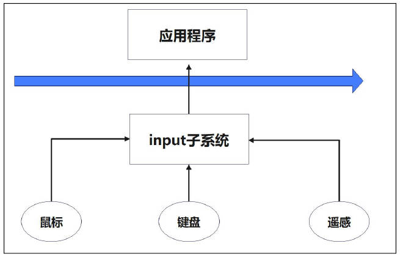
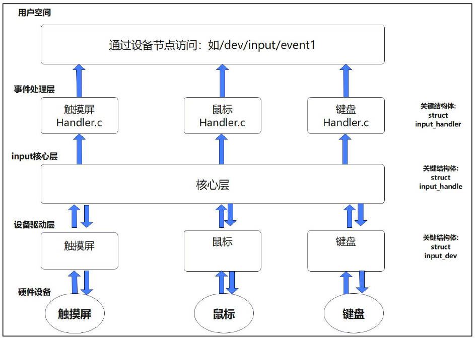
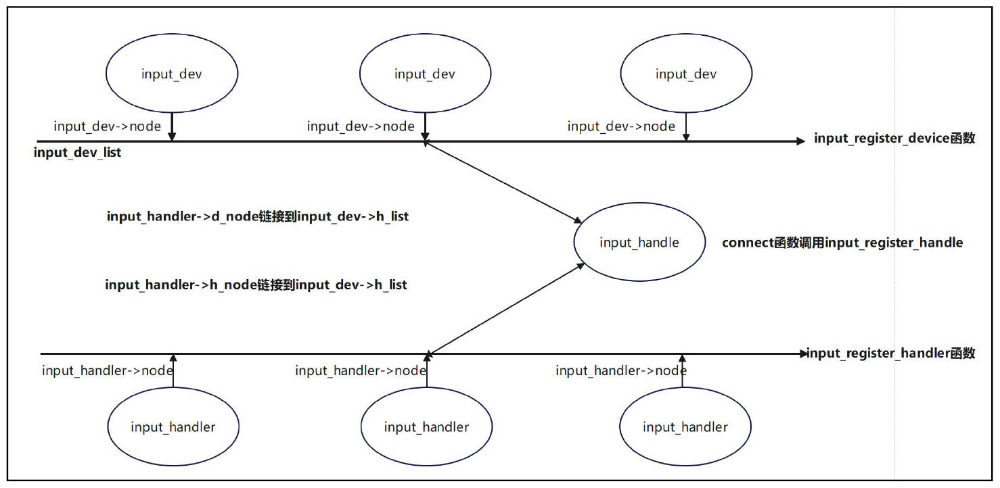
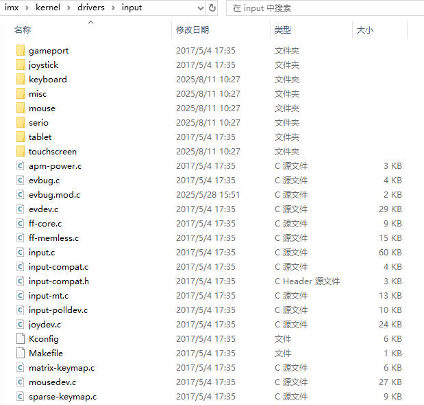
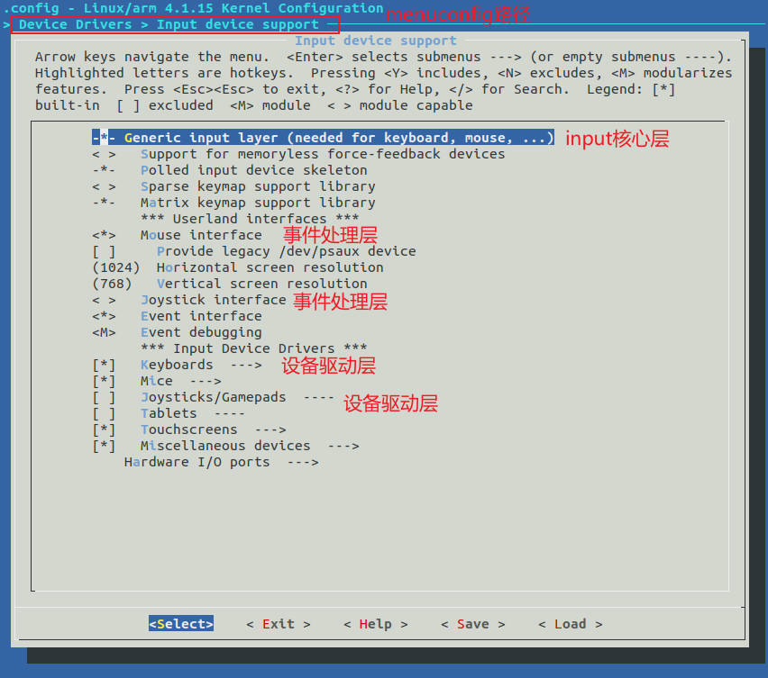
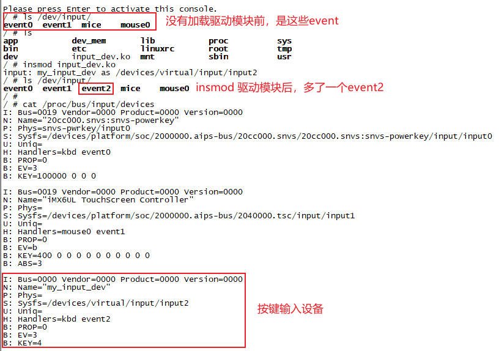
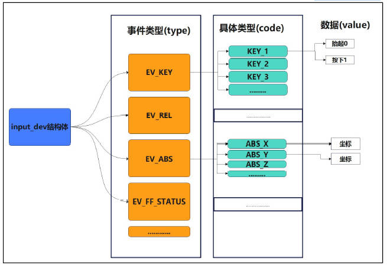
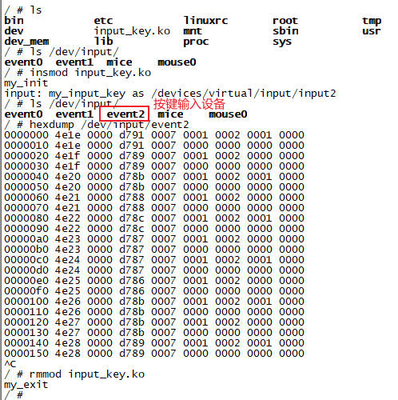
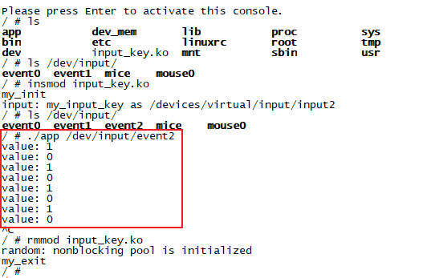

# 输入子系统

## 第1章 初识输入子系统

Linux输入子系统是Linux内核中，用于*统一管理各种输入设备*(键盘、鼠标、触摸屏、游戏手柄)的框架。它将这些设备产生的原始信号转换为系统可识别的标准事件，并传递给应用程序。



下面是Linux输入子系统支持的主要事件类型及其含义：

| 事件类型(`Event Type`) | 含义 | 典型设备 | 常见事件码(`Event Code`) |
| - | - | - | - |
| `EV_KEY`(0x01) | 按键事件 | 键盘、按钮 | `KEY_ENTER`(回车键)、`KEY_SPACE`(空格键)、`KEY_A`(A键) |
| `EV_REL`(0x02) | 相对位移事件，报告相对于上一次位置的偏移量 | 鼠标 | `REL_X`(X轴移动)、`REL_Y`(Y轴移动)、`REL_WHEEL`(滚轮) |
| `EV_ABS`(0x03) | 绝对位移事件，报告在一个绝对坐标系中的位置 | 触摸屏 | `ABS_X`(X坐标)、`ABS_Y`(Y坐标)、`ABS_PRESSURE`(压力) |
| `EV_SYN`(0x00) | 同步事件，用于分隔或打包一系列输入事件，标志一个事件报告的结束 | 所有设备 | `SYN_REPORT`(报告同步)、`SYN_CONFIG`(配置同步) |
| `EV_MSC`(0x04) | 其他事件类型 | 多种设备 | `MSC_SCAN`(扫描码) |
| `EV_SW`(0x05) | 开关事件 | 开关、拨码开关 | `SW_LID`(笔记本盖子开关) |
| `EV_LED`(0x11) | LED灯状态事件 | 键盘LED | `LED_NUML`(数字键盘锁LED)、`LED_CAPSL`(大写锁LED) |

输入子系统的工作流程：

Linux输入子系统采用分层架构，主要分为三层。各司其职：

| 层级 | 职责描述 | 关键操作/函数 |
| - | - | - |
| 驱动层 | 直接与硬件交互，读取原始数据，并将其转换为标准的`input_event` | 申请和注册输入设备(`input_allocate_device`、`input_register_device`)、上报事件(`input_event`、`input_report_*`) |
| 核心层 | 承上启下，提供输入设备和事件处理程序的注册和管理接口，负责将事件分发给正确的处理程序 | 提供统一的设备管理和事件分发机制 |
| 事件处理层 | 接收核心层分发的事件，并将其传递到用户空间应用程序(通常通过`/dev/input/eventX`设备文件) | 为应用程序提供统一的`read`接口读取事件 |



这种*分层解耦*的设计思路带来了诸多好处：

+ *对驱动开发者*：只需关注硬件操作和事件上报，无需关心事件如何传递到应用
+ *对应用开发者*：只需从统一的设备文件读取标准格式的事件，无需关心底层硬件差异
+ *对系统*：增强了可扩展性和可维护性，新硬件只需实现驱动层即可接入整个系统

典型使用场景：

Linux输入子系统广泛应用于多种场景：

+ *桌面环境*：管理键盘、鼠标、触摸板，为用户提供图形界面(如GNOME)交互的基础
+ *嵌入式系统*：在智能电视、工业控制面板、智能家居中控等设备上，处理触摸屏、五年间、遥控器信号等输入
+ *移动设备*：智能手机和平板电脑中，驱动触摸屏、传感器(如重力感应)、物理音量键
+ *游戏和娱乐*： 支持游戏手柄、摇杆、方向盘等游戏外设
+ *服务器和无人值守设备*：虽然交互不多，但仍可能需要处理键盘输入等基本操作

编写一个简单的输入设备驱动：

了解输入子系统的设计后，若要编写一个简单的输入设备驱动(如GPIO按键)。核心步骤包括：

1. *分配输入设备*：使用`input_allocate_device()`分配一个`struct input_dev`
2. *设置设备能力*：使用`set_bit()`告诉内核设备支持哪些事件类型(如`EV_KEY`)和具体事件(如`KEY_A`)
3. *注册输入设备*：使用`input_register_device()`将设备注册到子系统
4. *上报输入事件*：在中断处理函数或轮询例程中，检测到输入动作(按键按下/释放)时，使用`input_report_key()`等函数上报事件，并以`input_sync()`同步标记事件结束
5. *注销和清理*：在驱动卸载时，使用`input_unregister_device()`和`input_free_device()`进行清理

## 第2章 输入子系统数据结构介绍

### 2.1 事件处理层(`input_handler`)

事件处理层的代码位于`drivers/input/evdev.c`文件中，为上层的应用程序提供了统一的事件处理机制。它定义了处理输入设备事件的函数，并提供了读取事件、控制设备等功能的接口。当`evdev`设备注册时，首先会调用`input_register_handler`函数来注册`input_handler`结构体。

```c
static struct input_handler evdev_handler = {
	.event		= evdev_event,
	.events		= evdev_events,
	.connect	= evdev_connect,
	.disconnect	= evdev_disconnect,
	.legacy_minors	= true,
	.minor		= EVDEV_MINOR_BASE,
	.name		= "evdev",
	.id_table	= evdev_ids,
};

static int __init evdev_init(void)
{
	return input_register_handler(&evdev_handler);
}
```

#### 2.1.1 `struct input_handler`结构体

我们先来看下, `struct input_handler`结构体的成员：

```c
struct input_handler {

	void *private;

	void (*event)(struct input_handle *handle, unsigned int type, unsigned int code, int value);
	void (*events)(struct input_handle *handle, const struct input_value *vals, unsigned int count);
	bool (*filter)(struct input_handle *handle, unsigned int type, unsigned int code, int value);
	bool (*match)(struct input_handler *handler, struct input_dev *dev);
	int (*connect)(struct input_handler *handler, struct input_dev *dev, const struct input_device_id *id);
	void (*disconnect)(struct input_handle *handle);
	void (*start)(struct input_handle *handle);

	bool legacy_minors;
	int minor;
	const char *name;

	const struct input_device_id *id_table;

	struct list_head	h_list;
	struct list_head	node;
};
```

1. `void *private`
    + 作用：指向`handler`的*私有数据*。每个具体的`handler`(如evdev, mousedev)都可以用它来存储自己所需的数据结构
    + 使用场景：`evdev_handler`的私有数据可能包含一个结构体，用于管理所有打开的`clients`和事件缓冲区
2. `void (*event)(struct input_handle *handle, unsigned int type, unsigned int code, int value)`
    + 作用：*处理单个输入事件*的核心回调函数。当输入设备驱动(如按键或触摸屏)通过`input_event()`上报一个事件时，`Input Core`最终会调用于此设备关联的所有`handler`的`event`函数
    + 使用场景：几乎所有输入事件的处理(如将触摸屏的绝对坐标传递到用户空间)
    + 设计原则：提供一种*统一的事件分发机制*。`Input Core`将硬件差异巨大的原始输入数据转化为标准事件，然后通过此函数接口交给`handler`处理，实现了设备驱动与事件处理的解耦
3. `void (*events)(struct input_handle *handle, const struct input_value *vals, unsigned int count)`
    + 作用：与`event`类似，但用于*批量处理多个事件*。输入值以数组形式传递
    + 使用场景：需要*高效处理连续或组合事件*。(如触摸屏上报的多个触电坐标数据)
    + 设计原则：优化性能
4. `bool (*filter)(struct input_handle *handle, unsigned int type, unsigned int code, int value)`
    + 作用：*事件过滤器*。在`event`函数处理前调用，如果此函数返回`true`，则表示该事件被过滤掉。此时`event`函数将不会收到它
    + 使用场景：需要*屏蔽或修改特定事件*。(例如：某些情况下忽略某个按键的长按)
    + 设计原则：提供一种*灵活的事件拦截和修改机制*，可以在时间到达主要处理逻辑或用户空间之前进行干预
5. `bool (*match)(struct input_handler *handler, struct input_dev *dev)`
    + 作用：在标准的基于`id_table`的匹配之后，进行*更细粒度的设备匹配检查*
    + 使用场景：当匹配条件不仅仅依赖于设备ID(`id_table`中的厂商、产品ID)，还需要其他复杂逻辑时。例如：一个`handler`可能只支持具有特定功能的特定型号的游戏手柄
    + 设计原则：扩展匹配机制的灵活性。允许基于*动态条件或更复杂的策略*来决定是否连接某个设备和`handler`
6. `int (*connect)(struct input_handler *handler, struct input_dev *dev, const struct input_device_id *id)`
    + 作用：当`Input Core`发现一个`input_dev`和`input_handler`通过`id_table`匹配成功时，会调用此函数来*建立两者的连接*
    + 使用场景：这是`handler`*初始化与设备关联资源的关健步骤*
    + 设计原因：*动态连接机制*是输入子系统强大灵活性的核心。它允许在系统运行时动态的添加和移除输入设备(USB热插拔)，并自动为其找到合适的`handler`
7. `void (*disconnect)(struct input_handle *handle)`
    + 作用：与`connect`相反。当设备被移除或`handler`被卸载时，断开连接并进行清理
    + 使用场景：释放`connect`中分配的所有资源，释放私有数据内存，清除设备节点
    + 设计原则：防止内存泄露
8. `void (*start)(struct input_handle *handle)`
    + 作用：*启动`handler`*。开始处理输入事件
    + 使用场景：并非所有`handler`都必须实现它。在某些`handler`的实现中，可能需要在连接建立后、开始处理事件前进行一些额外的启动操作
9. `bool legacy_minors`
    + 作用：指示该`handler`是否使用*传统的、固定的次设备号分配方式*
    + 使用场景：为了向后兼容一些旧的应用程序，这些程序可能期望特定的输入设备节点具有固定的次设备号
    + 设计原则：*兼容性*。在现代的输入子系统中，次设备号的动态分配是更常见的做法
10. `int minor`
    + 作用：如果`legacy_minors`为`true`，此成员表示该`handler`所使用的*起始次设备号*
    + 使用场景：如`EVDEV_MINOR_BASE`(64)是`evdev_handler`的起始次设备号，其设备节点为`event0 ~ event31`(次设备号`64 - 95`)
    + 设计原则：为需要固定次设备号的`handler`提供标识
11. `const char *name`
    + 作用：*`handler`的名称*。用于标识和调试
    + 使用场景：在`/proc/bus/input/handlers`中可以看到已注册的`handler`名称。如evdev，mousedev
    + 设计原则：提供*可读性标识*，方便开发和调试
12. `const struct input_device_id *id_table`
    + 作用：指向一个表，该表定义了此`handler`*可以支持哪些输入设备*。他是`Input Core`进行设备匹配的主要依据
    + 使用场景：匹配规则可以基于总线类型、厂商ID、产品ID、版本号，以及设备支持的事件类型(evbit)、按键类型(key_bit)等。一个空的ID表(如evdev)表示匹配所有设备
    + 设计原则：提供一种*声明式的匹配机制*，使`handler`能够明确指定其支持的设备类型，实现自动化连接
13. `struct list_head	h_list`
    + 作用：链表头。用于链接所有与此`handler`关联的`input_handle`结构
    + 使用场景：通过遍历这个链表，`handler`可以管理所有当前连接到他的输入设备
    + 设计原因：Linux内核中管理多个对象的常见模式。允许`handler`*高效的跟踪所有附加设备*
14. `struct list_head	node`
    + 作用：*链表节点*。用于将本`handler`加入到`Input Core`维护的*全局`handler`链表*中
    + 使用场景：当调用`input_register_handler`时，新的`handler`会通过此节点被添加到全局链表，从而使`Input Core`能够发现和管理它
    + 设计原则：同样是内核的标准链表操作，用于*集中管理所有注册的`handler`*

#### 2.1.2 `input_register_handler`函数

```c
static int __init evdev_init(void)
{
	return input_register_handler(&evdev_handler);
}
```

然后继续回到`drivers/input/evdev.c`文件中，使用`input_register_handler`来注册`evdev_handler`。我们看下源码：

```c
int input_register_handler(struct input_handler *handler)
{
	struct input_dev *dev;
	int error;

	error = mutex_lock_interruptible(&input_mutex);
	if (error)
		return error;

	INIT_LIST_HEAD(&handler->h_list);

	list_add_tail(&handler->node, &input_handler_list);

	list_for_each_entry(dev, &input_dev_list, node)
		input_attach_handler(dev, handler);

	input_wakeup_procfs_readers();

	mutex_unlock(&input_mutex);
	return 0;
}
```

重点过程如下：

1. 将`handler`添加到`input_handler_list`链表的尾部
2. 遍历`input_dev_list`链表，获取`input_dev`设备，然后调用`input_attach_handler(dev, handler)`附加处理
3. 在给所有的输入设备附加处理后，调用`input_wakeup_procfs_readers()`唤醒正在阻塞的`procfs`读取器。这是为了通知`procfs`读取器有新的处理程序已经注册，以便读取器可以及时获取新的输入事件信息

上述代码中，最重要的就是`input_attach_handler(dev, handler)`函数。我们来看下。

#### 2.1.3 `input_attach_handler`函数

```c
int input_attach_handler(struct input_dev *dev, struct input_handler *handler)
{
	const struct input_device_id *id;
	int error;

	id = input_match_device(handler, dev);
	if (!id)
		return -ENODEV;

	return handler->connect(handler, dev, id);
}
```

重点过程如下：

1. 调用`input_match_device(handler, dev)`函数，来确定输入设备和处理程序是否匹配。这个函数在处理程序的输入设备ID表中查找与给定的输入设备匹配的ID。返回匹配的ID
2. 如果找到匹配的ID，则调用`handler->connect(handler, dev, id)`。这是处理程序的连接函数

这两个函数都很重要。我们先看下`input_match_device`函数。

```c
static const struct input_device_id *input_match_device(struct input_handler *handler,
							struct input_dev *dev)
{
	const struct input_device_id *id;

	for (id = handler->id_table; id->flags || id->driver_info; id++) {

		if (id->flags & INPUT_DEVICE_ID_MATCH_BUS)
			if (id->bustype != dev->id.bustype)
				continue;

		if (id->flags & INPUT_DEVICE_ID_MATCH_VENDOR)
			if (id->vendor != dev->id.vendor)
				continue;

		if (id->flags & INPUT_DEVICE_ID_MATCH_PRODUCT)
			if (id->product != dev->id.product)
				continue;

		if (id->flags & INPUT_DEVICE_ID_MATCH_VERSION)
			if (id->version != dev->id.version)
				continue;

		if (!bitmap_subset(id->evbit, dev->evbit, EV_MAX))
			continue;
		// ...
		if (!bitmap_subset(id->swbit, dev->swbit, SW_MAX))
			continue;

		if (!handler->match || handler->match(handler, dev))
			return id;
	}

	return NULL;
}
```

这个函数在输入子系统中的作用是，在给定的输入事件处理程序(`input handler`)中查找与指定输入设备匹配的输入设备ID。过程如下：

1. 循环遍历处理程序`handler`的输入设备ID表，直到找到匹配的ID或遍历完所有ID位置
2. 在循环中，匹配厂商ID、设备ID、版本等。如果输入设备与当前ID匹配。执行`match`(如果有定义)，然后返回ID
3. 如果遍历完所有ID都没有找到匹配的ID，则函数返回NULL。表示在处理程序的输入设备ID表中，没有与给定输入设备匹配的ID

由于`input_handler`结构体输入事件处理层，所以与它对应的`input_dev`自然就输入设备驱动层。`input_dev`结构体内容如下：

```c
struct input_id {
	__u16 bustype;  // 总线类型
	__u16 vendor;   // 厂商ID
	__u16 product;  // 产品ID
	__u16 version;  // 版本
};

struct input_dev {
	const char *name;       // 设备名
	const char *phys;       // 物理位置
	const char *uniq;       // 唯一标识符
	struct input_id id;     // ID信息

	unsigned long propbit[BITS_TO_LONGS(INPUT_PROP_CNT)];   // 属性位图

	unsigned long evbit[BITS_TO_LONGS(EV_CNT)];     // 事件类型位图
	unsigned long keybit[BITS_TO_LONGS(KEY_CNT)];   // 按键位图
	unsigned long relbit[BITS_TO_LONGS(REL_CNT)];   // 相对坐标位图
	unsigned long absbit[BITS_TO_LONGS(ABS_CNT)];   // 绝对坐标位图
	unsigned long mscbit[BITS_TO_LONGS(MSC_CNT)];   // 杂项事件位图
	unsigned long ledbit[BITS_TO_LONGS(LED_CNT)];   // LED位图
	unsigned long sndbit[BITS_TO_LONGS(SND_CNT)];   // 声音位图
	unsigned long ffbit[BITS_TO_LONGS(FF_CNT)];     // 力反馈
	unsigned long swbit[BITS_TO_LONGS(SW_CNT)];

    // ...
}
```

关于`struct input_dev`结构体，在后面编写实际的驱动程序时会进行讲解。继续回到`input_attach_handler`函数，它调用了`handler->connect(handler, dev, id)`函数，建立输入设备和处理程序之间的连接。

### 2.2 核心层(`input_handle`)

在讲解`handler->connect(handler, dev, id)`函数前，先介绍`struct input_handle`结构体。在调用`connect`函数之后，会创建一个`input_handle`结构体，用于记录匹配成功的输入处理程序(`input_handler`)和输入设备(`input_dev`)，并建立他们之间的关系。

```c
struct input_handle {
	void *private;      // 私有数据指针

	int open;           // 打开计数
	const char *name;   // 名称

	struct input_dev *dev;          // 输入设备
	struct input_handler *handler;  // 输入处理程序

	struct list_head	d_node;     // 指向输入设备链表的节点
	struct list_head	h_node;     // 指向输入处理程序链表的指针
};
```

`connect`函数比较复杂，我们挑一些重点的内容来看：

```c
static int evdev_connect(struct input_handler *handler, struct input_dev *dev, const struct input_device_id *id)
{
	struct evdev *evdev;
	int minor;
	int dev_no;

    // 1. 获取一个新的次设备号，以便将其分配给新的输入设备
	minor = input_get_new_minor(EVDEV_MINOR_BASE, EVDEV_MINORS, true);

    // 2. 申请evdev结构体指针
	evdev = kzalloc(sizeof(struct evdev), GFP_KERNEL);

    // 3. 初始化evdev
	INIT_LIST_HEAD(&evdev->client_list);
	spin_lock_init(&evdev->client_lock);
	mutex_init(&evdev->mutex);
	init_waitqueue_head(&evdev->wait);
	evdev->exist = true;

    // 设置struct device设备名, 格式为"event%d"
	dev_no = minor;
	dev_set_name(&evdev->dev, "event%d", dev_no);

    // 初始化并注册 input_handle
	evdev->handle.dev = input_get_device(dev);
	evdev->handle.name = dev_name(&evdev->dev);
	evdev->handle.handler = handler;
	evdev->handle.private = evdev;
    input_register_handle(&evdev->handle);

    // 初始化并添加 struct device设备
	evdev->dev.devt = MKDEV(INPUT_MAJOR, minor);
	evdev->dev.class = &input_class;
	evdev->dev.parent = &dev->dev;
	evdev->dev.release = evdev_free;
	device_initialize(&evdev->dev);
    device_add(&evdev->dev);

    // 初始化并添加 cdev字符设备, 操作函数fops为evdev_fops
	cdev_init(&evdev->cdev, &evdev_fops);
	evdev->cdev.kobj.parent = &evdev->dev.kobj;
	cdev_add(&evdev->cdev, evdev->dev.devt, 1);
	
	return 0;
}
```

其中`input_handle`使用函数`input_register_handle`来注册。源码如下：

```c
int input_register_handle(struct input_handle *handle)
{
	struct input_handler *handler = handle->handler;
	struct input_dev *dev = handle->dev;

    // 过滤器添加到 input_dev 输入设备链表头部
	if (handler->filter)
		list_add_rcu(&handle->d_node, &dev->h_list);
	else
		list_add_tail_rcu(&handle->d_node, &dev->h_list);

    // 处理程序添加到 input_handler 输入处理程序 尾部
	list_add_tail_rcu(&handle->h_node, &handler->h_list);

	if (handler->start)
		handler->start(handle);

	return 0;
}
```

### 2.3 驱动层(`input_dev`)

`input_handler`使用`input_register_handler`函数来注册，`input_handle`使用`input_register_handle`函数来注册。可以想到，`input_dev`也应该有个`input_register_device`注册函数。

这个函数我们先简单分析，后面还会去加深理解。

```c
int input_register_device(struct input_dev *dev)
{
	struct input_devres *devres = NULL;
	struct input_handler *handler;

    // XXX: 省略了部分代码

	mutex_lock_interruptible(&input_mutex);

    // 添加 input_dev 到全局链表
	list_add_tail(&dev->node, &input_dev_list);

    // 遍历 input_handler_list, 执行 input_attach_handler 绑定过程
	list_for_each_entry(handler, &input_handler_list, node)
		input_attach_handler(dev, handler);

	input_wakeup_procfs_readers();

	mutex_unlock(&input_mutex);

	return 0;
}
```

### 2.4 总结

输入子系统数据结构框图如下所示：



## 第3章 认识内核中输入子系统的源码和裁剪

### 3.1 内核输入子系统的源码

`input`输入子系统源码所在路径在`kernel/drivers/input`。如下所示：



每个文件和文件夹的作用如下所示：

| **文件/目录** | **作用** |
| - | - |
| `apm-power.c` | 提供与`Advanced Power Management`相关的输入设备接口 |
| `evbug.c` | 提供用于调试的虚拟输入设备，可以模拟按键、鼠标移动等事件 |
| `evdev.c` | 提供通用的输入事件层，将所有输入设备的事件转化为标准化的输入事件格式，并提供给上层用户空间程序使用 |
| `ff-core.c` | 提供力反馈设备的支持，允许输入设备发送力反馈信息 |
| `ff-memless.c` | 提供一种无需内存分配的力反馈设备支持，适用于资源受限的嵌入式系统 |
| `input.c` | 提供输入子系统的初始化和事件处理等操作 |
| `input-leds.c` | 提供LED指示灯设备的支持，允许控制LED指示灯的状态 |
| `joydev.c` | 提供支持游戏杆的驱动程序，处理游戏杆设备的输入事件 |
| `keyboard/` | 包含支持键盘的驱动程序的目录 |
| `misc/` | 包含其他类型输入设备的驱动程序的目录，如红外遥控器、输入音频 |
| `serio/` | 提供支持通过串行接口接入的输入设备的驱动程序，处理串行输入设备的通信和处理 |
| `tablet/` | 提供支持绘图板和其他类型图形输入设备的驱动程序，处理绘图板设备的输入事件 |
| `touchscreen/` | 提供支持触摸屏的驱动程序，处理触摸屏设备的输入事件 |

### 3.2 输入子系统源码裁剪和配置

默认情况下，Linux内核已经支持了很多设备，但是在实际的使用中使用不到。这时候就需要对输入子系统进行裁剪了。如下图所示：

进入`menuconfig`界面，进入以下路径。

```
Device Drivers --->
    Input device support --->
```



如果要对内核进行裁剪和配置，只需要勾选和取消即可。

## 第4章 编写最简单的设备驱动层代码

Linux输入子系统采用分层架构设计，将输入设备的处理分为三层：设备驱动层、核心层和事件处理层。设备驱动层是唯一需要开发者实现的部分，其他两层已由内核提供。

### 4.1 驱动层代码编写步骤

#### 4.1.1 分配`input_dev`设备结构体

作用：为输入设备分配内核空间，创建一个`input_dev`结构体实例

```c
struct input_dev *dev = input_allocate_device();
if (!dev) {
    return -ENOMEM;
}
```

#### 4.1.2 设置设备能力

作用：定义设备支持的事件类型和具体事件能力

```c
/* 设置支持的事件类型 */
__set_bit(EV_KEY, dev->evbit);    // 支持按键事件

/* 设置支持的具体按键 */
__set_bit(KEY_A, dev->keybit);
__set_bit(KEY_B, dev->keybit);
```

设计原理：

+ `evbit`: 表示设备支持的事件大类(按键、绝对坐标、相对坐标等)
+ `keybit/absbit/xxx`: 表示设备支持的具体事件(具体按键、坐标轴等)
+ 采用位图`bitmap`设计，高效表示设备能力集合
4 这种设计使内核能自动过滤不支持的事件，避免无效处理

#### 4.1.3 设置设备信息(可选但推荐)

作用：提供设备的识别信息

```c
dev->name = "my_touchscreen";
dev->id.bustype = BUS_I2C;      // 总线类型
dev->id.vendor = 0x1234;        // 厂商ID
dev->id.product = 0x5678;       // 产品ID
dev->id.version = 1;            // 版本号
```

设计原理：

+ 便于在用户空间识别设备类型和来源
+ 事件处理层会将这些信息暴露给用户空间
+ 支持应用程序根据设备信息进行特定处理
+ 保持与Linux设备模型的一致性

#### 4.1.4 注册`input_dev`设备

作用：将`input_dev`注册到输入子系统中

```c
int error = input_register_device(dev);
if (error) {
    input_free_device(dev);
    return error;
}
```

设计原理：

+ 核心层将设备添加到全局设备列表中
+ 事件处理层自动创建设备节点(`/dev/input/eventX`)
+ 建立设备与事件处理程序的关联
+ 这是设备能够被系统识别和使用的必要步骤
+ 采用注册机制而非静态定义，支持热插拔设备

#### 4.1.5 设置硬件交互机制

作用：建立与硬件的交互通道，获取原始输入数据

```c
/* 中断方式（按键示例） */
error = request_irq(gpio_to_irq(button_gpio), button_irq_handler,
                   IRQF_TRIGGER_RISING | IRQF_TRIGGER_FALLING,
                   "button_irq", dev);

/* 或定时器轮询方式（触摸屏示例） */
setup_timer(&ts_timer, touch_timer_fire, (unsigned long)dev);
mod_timer(&ts_timer, jiffies + msecs_to_jiffies(10));
```

设计原理：

+ 不同输入设备有不同的数据获取方式(中断/轮询)
+ 中断方式适合事件触发型设备(按键)
+ 将硬件交互细节封装在驱动层，与上层解耦

#### 4.1.6 上报输入事件

作用：将原始硬件数据转换为标准输入事件并上报

```c
static irqreturn_t button_irq_handler(int irq, void *dev_id)
{
    struct input_dev *dev = dev_id;
    int state = gpio_get_value(button_gpio);
    
    /* 上报按键事件 */
    input_report_key(dev, KEY_ENTER, state);
    input_sync(dev);  // 事件同步
    
    return IRQ_HANDLED;
}
```

设计原理：

+ `input_report_*`系列函数将数据转换为统一的`input_event`结构
+ `input_sync()`表示一个完整事件序列的结束，触发事件分发
+ 驱动开发者无需关心事件如何传递到用户空间
+ 采用统一事件结构，使不同设备的事件可以统一处理

#### 4.1.7 设备卸载时清理资源

作用：在模块卸载时正确释放资源

```c
static void __exit my_input_exit(void)
{
    input_unregister_device(dev);
    free_irq(gpio_to_irq(button_gpio), dev);
    del_timer_sync(&ts_timer);
    input_free_device(dev);
}
```

设计原理：

+ 确保资源不泄漏(内存、中断、定时器)
+ 通知核心层设备已移除，更新设备列表

### 4.2 测试代码

本章节只是为了编写最简单的设备驱动层代码，所以本章节不会涉及事件上报这一步骤相关的代码，后面的章节再进行填充。

`测试代码.c`

```c
#include <linux/init.h>
#include <linux/module.h>
#include <linux/input.h>

static struct input_dev *my_dev;

static int __init my_init(void)
{
    int ret;

    my_dev = input_allocate_device();
    if (my_dev == NULL) {
        printk("input_allocate_device fail\n");
        return -1;
    }
    my_dev->name = "my_input_dev";
    // 设置输入设备支持的事件类型
    __set_bit(EV_KEY, my_dev->evbit);
    __set_bit(KEY_1,  my_dev->keybit);
    ret = input_register_device(my_dev);
    if (ret) {
        printk("input_register_device fail\n");
        goto error;
    }

    return 0;

error:
    input_free_device(my_dev);
    return ret;
}

static void __exit my_exit(void)
{
    input_free_device(my_dev);
}

module_init(my_init);
module_exit(my_exit);

MODULE_LICENSE("GPL");
MODULE_AUTHOR("ding");
```

测试结果：



## 第5章 继续完善设备驱动层代码

在前一章节，我们编写了最简单的设备驱动层代码，创建了输入设备结构体。本章我们继续完善设备驱动层代码，用输入设备来上报事件。

### 5.1 上报事件

上报事件是指在设备驱动层中，当输入设备产生事件时，将该事件通知给输入子系统。在上报事件前，首先要确定要上报的事件类型。事件类型可以是：按键事件、相对位置事件、绝对位置事件等，取决于输入设备的特性与能力。

在Linux内核中，事件类型由预定义的常量表示。在确定事件类型之后，就需要使用相应的上报函数将事件数据传递给输入子系统。

```c
// input.h

#define EV_SYN			0x00
#define EV_KEY			0x01	// 按键事件
#define EV_REL			0x02	// 相对位置事件
#define EV_ABS			0x03	// 绝对位置事件
// ...
#define EV_LED			0x11
#define EV_MAX			0x1f
#define EV_CNT			(EV_MAX+1)
```



### 5.2 上报函数

当在设备驱动层中使用上报函数时，这些函数负责将时间数据传递给输入子系统，以便将事件信息传递给应用程序或系统组件进行响应和处理。

#### 5.2.1 `input_report_key`函数

```c
void input_report_key(struct input_dev *dev, unsigned int code, int value);
```

+ 功能：上报按键事件
+ 参数：
	+ `dev`: 输入设备
	+ `code`: 按键码。表示按下或释放的具体按键
	+ `value`: 按键状态。0表示按键释放，1表示按键按下

#### 5.2.2 `input_report_rel`函数

```c
void input_report_rel(struct input_dev *dev, unsigned int code, int value);
```

+ 功能：上报相对位置事件
+ 参数：
	+ `dev`: 输入设备
	+ `code`: 位置码。表示相对位置的具体类型
	+ `value`: 位置偏移量。表示设备相对于先前设备的偏移量

#### 5.2.3 `input_report_abs`函数

```c
void input_report_abs(struct input_dev *dev, unsigned int code, int value);
```

+ 功能：上报绝对位置事件
+ 参数：
	+ `dev`: 输入设备
	+ `code`: 位置码。表示绝对位置的具体类型
	+ `value`: 位置值。表示设备的绝对位置

#### 5.2.4 `input_report_switch`函数

```c
void input_report_switch(struct input_dev *dev, unsigned int code, int value);
```

+ 功能：上报开关事件
+ 参数：
	+ `dev`: 输入设备
	+ `code`: 开关码。表示开关的具体类型
	+ `value`: 开关状态。0表示关闭，非零值表示打开

#### 5.2.5 `input_sync`函数

```c
void input_sync(struct input_dev *dev);
```

+ 功能：同步事件
+ 参数`dev`：输入设备

每个上报函数都是内联函数，通过调用`input_event()`函数将事件数据添加到输入事件队列中。在使用上报函数之后，通常回调用`input_sync()`函数进行同步。同步事件的目的时，告知输入子系统事件的结束，以便子系统可以将事件传递给响应的印共有六个程序或系统组件进行处理。

### 5.3 测试代码

我们的测试代码原理是，启动一个1000ms周期定时器。在定时器中翻转按键状态值，并上报。至于为什么要翻转按键值，我们后面再分析。

```c
#include <linux/init.h>
#include <linux/module.h>
#include <linux/input.h>
#include <linux/slab.h>

struct my_dev {
    struct input_dev *input;
    struct timer_list timer;
    int key_value;
};

static struct my_dev *s_dev;

static void my_timer(unsigned long arg)
{
    struct my_dev *dev = (struct my_dev *)arg;

    input_report_key(dev->input, KEY_1, dev->key_value);
    input_sync(dev->input);
    dev->key_value = !dev->key_value;

    mod_timer(&dev->timer, jiffies + msecs_to_jiffies(1000));
}

static int __init my_init(void)
{
    printk("my_init\n");
    
    s_dev = kzalloc(sizeof(struct my_dev), GFP_KERNEL);

    s_dev->input = input_allocate_device();
    s_dev->input->name = "my_input_key";
    set_bit(EV_SYN, s_dev->input->evbit);
    set_bit(EV_KEY, s_dev->input->evbit);
    set_bit(KEY_1,  s_dev->input->keybit);
    input_register_device(s_dev->input);

    setup_timer(&s_dev->timer, my_timer, (unsigned long)s_dev);
    mod_timer(&s_dev->timer, jiffies + msecs_to_jiffies(1000));
	return 0;
}

static void __exit my_exit(void)
{
    del_timer_sync(&s_dev->timer);

    input_unregister_device(s_dev->input);
    input_free_device(s_dev->input);
    
    kfree(s_dev);
    printk("my_exit\n");
}

module_init(my_init);
module_exit(my_exit);

MODULE_LICENSE("GPL");
MODULE_AUTHOR("ding");
```

测试结果如下：

+ 使用`insmod input_key.ko`加载驱动，可以看到多出来一个`event4`节点
+ 使用`hexdump /dev/input/event2`命令，查看设备节点的输出信息



### 5.4 编写应用获取上报数据

在上一个小节的实验中，我们是通过`hexdump`命令从输入设备的设备系欸但那获取的16进制数据。那要如何通过编写上层应用程序来获取到上述相应的数据？

读取某个输入设备的数据对应的流程如下所示：

1. 应用程序打开`/dev/input/eventX`设备文件. X为对应的输入设备编号
2. 应用程序使用`read`函数从设备文件中读取数据。如果设备上没有数据可读，则`read`函数会一直阻塞等待，直到数据可用
3. 读取的数据为一个`input_event`结构体，其包含事件类型、事件码、事件值3个字段。用于描述输入设备发生的事件信息
4. 应用程序根据读到的事件数据进行处理，例如根据事件类型和事件码判断是哪个键被按下，鼠标移动的距离等，并进行相应的操作
5. 在使用完输入设备后，使用`close`系统调用关闭输入设备文件

测试代码：

```c
#include <stdio.h>
#include <fcntl.h>
#include <unistd.h>
#include <linux/input.h>

int main(int argc, char *argv[])
{
    int fd, ret;
    struct input_event event;

    if (argc < 2) {
        printf("Usage: ./app /dev/input/eventX\n");
        return -1;
    }
    fd = open(argv[1], O_RDONLY);
    if (fd < 0) {
        printf("Open %s fail\n", argv[1]);
        return -2;
    }
    while (1) {
        ret = read(fd, &event, sizeof(struct input_event));
        if (ret < 0) {
            printf("Read fail\n");
            return -3;
        }

        if (event.type == EV_KEY) {
            if (event.code == KEY_1) {
                if (event.value == 1) {
                    printf("value: 1\n");
                }
                else if (event.value == 0) {
                    printf("value: 0\n");
                }
            }
        }
    }

    return 0;
}
```

测试结果：



## 第6章 输入子系统上报数据格式分析


